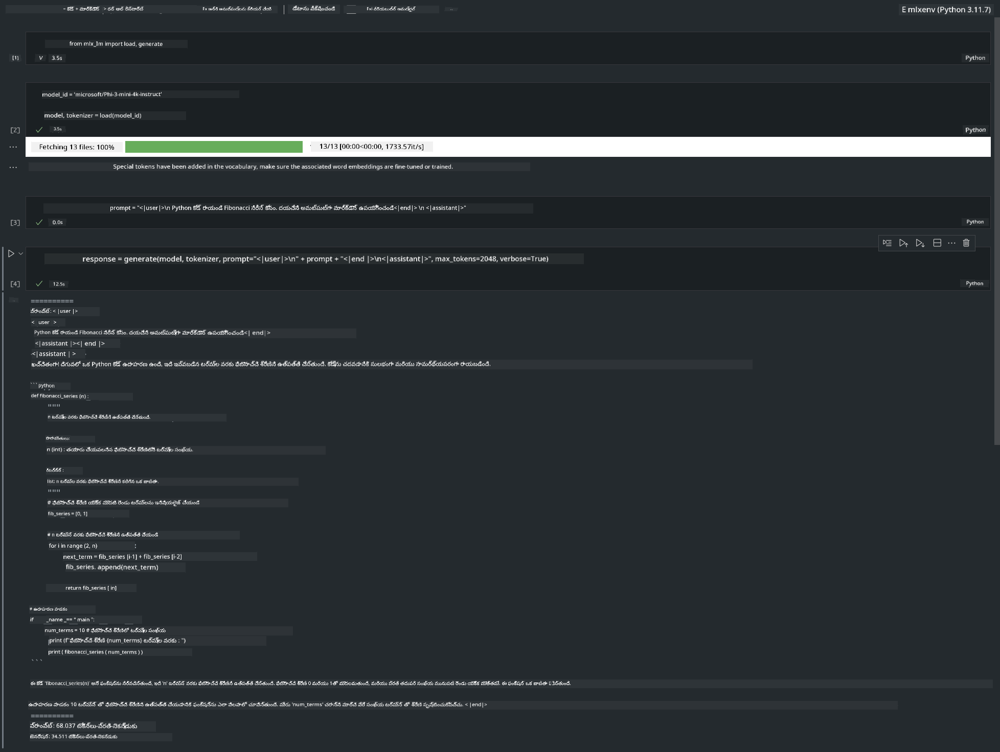

<!--
CO_OP_TRANSLATOR_METADATA:
{
  "original_hash": "dcb656f3d206fc4968e236deec5d4384",
  "translation_date": "2025-12-22T01:26:56+00:00",
  "source_file": "md/01.Introduction/03/MLX_Inference.md",
  "language_code": "te"
}
-->
# **Phi-3 ను Apple MLX Framework ఉపయోగించి ఇన్ఫరెన్స్ చేయడం**

## **MLX ఫ్రేమ్‌వర్క్ అంటే ఏమిటి**

MLX అనేది Apple సిలికాన్ పై మెషీన్ లెర్నింగ్ పరిశోధన కోసం Apple మెషీన్ లెర్నింగ్ రీసెర్చ్ ద్వారా అందించిన ఒక అర్రే ఫ్రేమ్‌వర్క్.

MLX‌ను మెషీన్ లెర్నింగ్ పరిశోధకులు కోసం మెషీన్ లెర్నింగ్ పరిశోధకుల చేత డిజైన్ చేయబడింది. ఫ్రేమ్‌వర్క్ వినియోగదారులకు అనుకూలంగా ఉండేందుకు ఉద్దేశించబడింది, అయినప్పటికీ మోడల్స్‌ను ట్రెయిన్ చేసి డిప్లాయ్ చేయడంలో సమర్థవంతంగా ఉంటుంది. ఫ్రేమ్‌వర్క్ యొక్క డిజైన్ స్వయంగా సిద్ధాంత పరంగా కూడా సింపుల్‌గా ఉంటుంది. కొత్త ఆలోచనలను త్వరగా అన్వేషించుకునే లక్ష్యంతో పరిశోధకులు MLX‌ను విస్తరించి మెరుగుపరచడం సులభంగా ఉండేలా చేయాలని మన ఉద్దేశ్యం.

MLX ద్వారా Apple Silicon పరికరాలలో LLMs వేగవంతం చేయబడవచ్చు, మరియు మోడల్స్‌ను స్థానికంగా చాలా సౌకర్యవంతంగా నడపవచ్చు.

## **MLX ఉపయోగించి Phi-3-mini ఇన్ఫరెన్స్ చేయడం**

### **1. మీ MLX env సెటప్ చేయండి**

1. Python 3.11.x
2. MLX లైబ్రరీని ఇన్‌స్టాల్ చేసుకోండి


```bash

pip install mlx-lm

```

### **2. MLX తో Terminal లో Phi-3-mini అమలు చేయడం**


```bash

python -m mlx_lm.generate --model microsoft/Phi-3-mini-4k-instruct --max-token 2048 --prompt  "<|user|>\nCan you introduce yourself<|end|>\n<|assistant|>"

```

ఫలితం (నా env Apple M1 Max,64GB) ఈ విధంగా ఉంది


### **3. Terminal లో MLX తో Phi-3-mini ను క్వాంటైజ్ చేయడం**


```bash

python -m mlx_lm.convert --hf-path microsoft/Phi-3-mini-4k-instruct

```

***Note：*** మోడల్‌ను mlx_lm.convert ద్వారా క్వాంటైజ్ చేయవచ్చు, మరియు డిఫాల్ట్ క్వాంటైజేషన్ INT4. ఈ ఉదాహరణలో Phi-3-mini ను INT4 గా క్వాంటైజ్ చేస్తారు

మోడల్‌ను mlx_lm.convert ద్వారా క్వాంటైజ్ చేయవచ్చు, మరియు డిఫాల్ట్ క్వాంటైజేషన్ INT4. ఈ ఉదాహరణలో Phi-3-mini ను INT4 గా క్వాంటైజ్ చేయడం. క్వాంటైజేషన్ తర్వాత, అది డిఫాల్ట్ డైరెక్టరీ ./mlx_model లో నిల్వ చేయబడుతుంది

మేము టెర్మినల్ నుంచి MLX తో క్వాంటైజ్ చేసిన మోడల్‌ను పరీక్షించవచ్చు


```bash

python -m mlx_lm.generate --model ./mlx_model/ --max-token 2048 --prompt  "<|user|>\nCan you introduce yourself<|end|>\n<|assistant|>"

```

ఫలితం ఇదే


### **4. Jupyter Notebook లో MLX తో Phi-3-mini అమలు చేయడం**




***Note:*** దయచేసి ఈ సాంపిల్‌ను చదవండి [ఈ లింక్‌ను క్లిక్ చేయండి](../../../code/03.Inference/MLX/MLX_DEMO.ipynb)


## **వనరులు**

1. Apple MLX ఫ్రేమ్‌వర్క్ గురించి తెలుసుకోండి [https://ml-explore.github.io](https://ml-explore.github.io/mlx/build/html/index.html)

2. Apple MLX GitHub రిపోజిటరీ [https://github.com/ml-explore](https://github.com/ml-explore)

---

<!-- CO-OP TRANSLATOR DISCLAIMER START -->
నిరాకరణ:
ఈ పత్రాన్ని AI అనువాద సేవ [Co-op Translator](https://github.com/Azure/co-op-translator) ఉపయోగించి అనువదించబడింది. మేము ఖచ్చితత్వానికి ప్రయత్నించినప్పటికీ, ఆటోమేటెడ్ అనువాదాల్లో తప్పులు లేదా లోపాలు ఉండొచ్చు. మూల భాషలోని అస‌లైన పత్రాన్నే అధికారిక మూలంగా పరిగణించాలి. ముఖ్యం/నిర్ణాయక సమాచారం కోసం, వృత్తిపరమైన మానవ అనువాదం చేయించుకోవాలని సూచిస్తాము. ఈ అనువాదాన్ని ఉపయోగించటంతో కలిగే ఏవైనా అపోహలు లేదా తప్పుగా అర్థం చేసుకోవడాలపై మేము బాధ్యులం కుఖమని తెలియజేస్తున్నాము.
<!-- CO-OP TRANSLATOR DISCLAIMER END -->