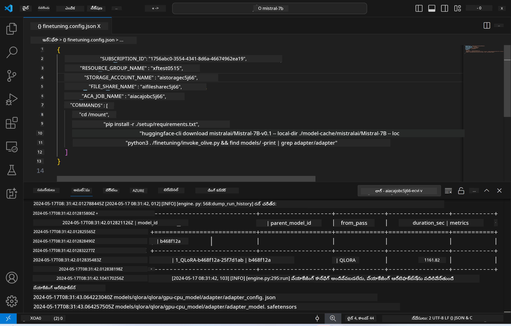
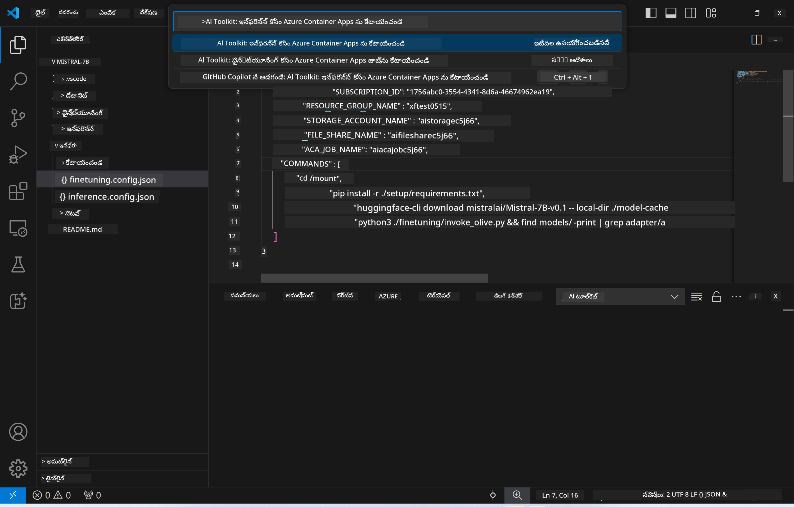
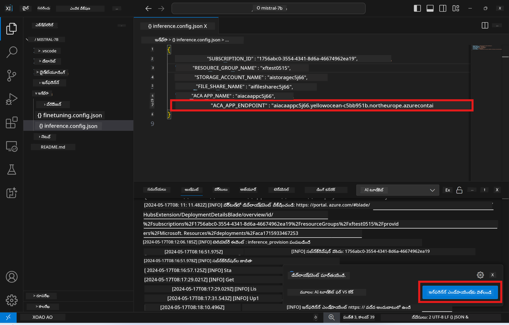

<!--
CO_OP_TRANSLATOR_METADATA:
{
  "original_hash": "a54cd3d65b6963e4e8ce21e143c3ab04",
  "translation_date": "2025-12-22T00:17:34+00:00",
  "source_file": "md/01.Introduction/03/Remote_Interence.md",
  "language_code": "te"
}
-->
# ఫైన్ట్యూన్ చేసిన మోడల్‌తో రిమోట్ ఇన్ఫరెన్సింగ్

ఆడాప్టర్లు రిమోట్ పర్యావరణంలో ట్రైనింగ్ అయిన తర్వాత, మోడల్‌తో ఇന്റరాక్ట్ చేయడానికి ఒక సాదా Gradio అప్లికేషన్ ఉపయోగించండి.



### Azure వనరులను ప్రొవిజన్ చేయడం
రిమోట్ ఇన్ఫరెన్స్ కోసం Azure వనరులను సెట్ చేయడానికి, కమాండ్ పలెట్ నుండి `AI Toolkit: Provision Azure Container Apps for inference` ను ఎక్సిక్యూట్ చేయవలసి ఉంటుంది. ఈ సెటప్ సమయంలో, మీ Azure Subscription మరియు resource group ను ఎంచుకోవాల్సి ఉంటుంది.  

   
డిఫాల్ట్ ప్రకారం, ఇన్ఫరెన్స్ కోసం సబ్‌స్క్రిప్షన్ మరియు రిసోర్స్ గ్రూప్ ఫైన్-ట్యూనింగ్ కోసం ఉపయోగించినదే అవ్వాలి. ఇన్ఫరెన్స్ అదే Azure Container App Environment ను ఉపయోగిస్తుంది మరియు ఫైన్-ట్యూనింగ్ దశలో జనరేట్ చేసిన Azure Filesలో నిల్వ ఉన్న మోడల్ మరియు మోడల్ అడాప్టర్‌కు యాక్సెస్ చేస్తుంది. 

## AI Toolkit ఉపయోగించడం

### ఇన్ఫరెన్స్ కోసం డిప్లాయ్‌మెంట్  
ఇన్ఫరెన్స్ కోడ్‌ని సవరించాలనుకుంటే లేదా ఇన్ఫరెన్స్ మోడల్‌ను రీలోడ్ చేయాలనుకుంటే, దయచేసి `AI Toolkit: Deploy for inference` కమాండ్‌ను అమలు చేయండి. ఇది మీ తాజా కోడ్‌ను ACA తో సమకాలీకరించి రిప్లికాను రీస్టార్ట్ చేస్తుంది.  


డిప్లాయ్‌మెంట్ విజయవంతంగా పూర్తి అయిన తర్వాత, ఈ ఎండ్‌పాయింట్ ఉపయోగించి మోడల్ now ద్వారా మూల్యంచేయడానికి సిద్ధంగా ఉంటుంది.

### ఇన్ఫరెన్స్ API కి ప్రాప్తి

VSCode నోటిఫికేషన్‌లో చూపబడే "*ఇన్ఫరెన్స్ ఎండ్‌పాయింట్‌కు వెళ్లండి*" బటన్‌ను క్లిక్ చేసి మీరు ఇన్ఫరెన్స్ API కి ప్రాప్తి పొందవచ్చు. ప్రత్యామ్నాయంగా, వెబ్ API ఎండ్‌పాయింట్‌ను `./infra/inference.config.json` లోని `ACA_APP_ENDPOINT` కింద మరియు అవుట్పుట్ ప్యానెల్‌లో కనుగొనవచ్చు.



> **గమనిక:** ఇన్ఫరెన్స్ ఎండ్‌పాయింట్ పూర్తిగా ఆపరేషనల్ కావడానికి కొంత సమయం పట్టొచ్చు.

## టెంప్లేట్‌లో ఉన్న ఇన్ఫరెన్స్ భాగాలు
 
| ఫోల్డర్ | కంటెంట్‌లు |
| ------ |--------- |
| `infra` | రిమోట్ ఆపరేషన్ల కోసం అవసరమైన అన్ని కాన్ఫిగరేషన్లు కలిగి ఉంటుంది. |
| `infra/provision/inference.parameters.json` | బైస్ప్ టెంప్లేట్స్ కోసం ప్యారామీటర్లు అందిస్తుంది, ఇవి ఇన్ఫరెన్స్ కోసం Azure వనరులను ప్రొవిజన్ చేయడానికి ఉపయోగిస్తారు. |
| `infra/provision/inference.bicep` | ఇన్ఫరెన్స్ కోసం Azure వనరులను ప్రొవిజన్ చేయడానికి టెంప్లేట్స్‌ను కలిగి ఉంటుంది. |
| `infra/inference.config.json` | కాన్ఫిగరేషన్ ఫైల్, `AI Toolkit: Provision Azure Container Apps for inference` కమాండ్ ద్వారా జనరేట్ చేయబడింది. ఇది ఇతర రిమోట్ కమాండ్ పలెట్స్‌కు ఇన్పుట్‌గా ఉపయోగించబడుతుంది. |

### Azure రిసోర్స్ ప్రొవిజన్‌ను కాన్ఫిగర్ చేయడానికి AI Toolkit ఉపయోగించడం
[AI Toolkit](https://marketplace.visualstudio.com/items?itemName=ms-windows-ai-studio.windows-ai-studio)ని కాన్ఫిగర్ చేయండి

Provision Azure Container Apps for inference` కమాండ్.

కాన్ఫిగరేషన్ ప్యారామీటర్లు `./infra/provision/inference.parameters.json` ఫైల్‌లో కనుగొనవచ్చు. వివరాలు ఇక్కడ ఉన్నాయి:
| పారామెటర్ | వివరణ |
| --------- |------------ |
| `defaultCommands` | ఇది వెబ్ API ప్రారంభించడానికి ఉపయోగించే కమాండ్లు. |
| `maximumInstanceCount` | ఈ పారామీటర్ GPU ఇన్స్టాన్స్‌ల గరిష్ట సామర్ధ్యాన్ని సెట్ చేస్తుంది. |
| `location` | ఇది Azure వనరులు ప్రొవిజన్ చేయబడే చోటు. డిఫాల్ట్ విలువు ఎంచుకున్న రిసోర్స్ గ్రూప్ యొక్క లొకేషన్‌తో అదే ఉంటుంది. |
| `storageAccountName`, `fileShareName` `acaEnvironmentName`, `acaEnvironmentStorageName`, `acaAppName`,  `acaLogAnalyticsName` | ఈ పారామీలు ప్రొవిజన్ కోసం Azure వనరులకు పేర్లు నియమించడానికి ఉపయోగిస్తారు. డిఫాల్ట్‌గా, అవి ఫైన్-ట్యూనింగ్ వనరు పేరుతో అదే ఉంటాయి. మీరు మీ స్వంత కస్టమ్ నేమ్ వాటితో వనరులు సృష్టించడానికి కొత్త, వాడని రిసోర్సు పేరు ఇన్‌పుట్ చేయవచ్చు, లేదా మీరు ఉపయోగించదలచిన ఇప్పటికే ఉన్న Azure వనరు పేరు ఇన్‌పుట్ చేయవచ్చు. వివరాలకు [ఉన్న Azure వనరులను ఉపయోగించడం](../../../../../md/01.Introduction/03) విభాగాన్ని చూడండి. |

### ఉన్న Azure వనరులను ఉపయోగించడం

డిఫాల్ట్‌గా, ఇన్ఫరెన్స్ ప్రొవిజన్ ఫైన్-ట్యూనింగ్ సమయంలో ఉపయోగించిన అదే Azure Container App Environment, Storage Account, Azure File Share, మరియు Azure Log Analytics ను ఉపయోగిస్తుంది. ఇన్ఫరెన్స్ API కోసం ప్రత్యేక Azure Container App ఒకటి మాత్రమే సృష్టించబడుతుంది. 

ఫైన్-ట్యూనింగ్ దశలో మీరు Azure వనరులను అనుకూలీకరించినట్లయితే లేదా ఇన్ఫరెన్స్ కోసం మీ స్వంత ఇప్పటికే ఉన్న Azure వనరులను ఉపయోగించాలని ఉంటే, అవి పేర్లను `./infra/inference.parameters.json` ఫైల్‌లో నిర్దేశించండి. తర్వాత, కమాండ్ పలెట్ నుండి `AI Toolkit: Provision Azure Container Apps for inference` కమాండ్‌ను నడిపించండి. ఇది ఏవైనా నిర్దేశించిన వనరులను అప్‌డేట్ చేస్తుంది మరియు లాపస్సు ఉన్న వాటిని సృష్టిస్తుంది.

ఉదాహరణకు, మీకు ఇప్పటికే ఒక Azure container environment ఉంటే, మీ `./infra/finetuning.parameters.json` ఈ విధంగా ఉండాలి:

```json
{
    "$schema": "https://schema.management.azure.com/schemas/2019-04-01/deploymentParameters.json#",
    "contentVersion": "1.0.0.0",
    "parameters": {
      ...
      "acaEnvironmentName": {
        "value": "<your-aca-env-name>"
      },
      "acaEnvironmentStorageName": {
        "value": null
      },
      ...
    }
  }
```

### మాన్యువల్ ప్రొవిజన్  
మీరు Azure వనరులను మాన్యువల్‌గా కాన్ఫిగర్ చేయాలని ఇష్టపడితే, `./infra/provision` ఫోల్డర్లలో ఉన్న bicep ఫైళ్లను ఉపయోగించవచ్చు. మీరు ఇప్పటికే AI Toolkit కమాండ్ పలెట్‌ను ఉపయోగించకుండానే అన్ని Azure వనరులను సెట్ చేసి కాన్ఫిగర్ చేసి ఉంటే, మీరు సాదాసీదాగా `inference.config.json` ఫైల్‌లో వనరు పేర్లను నమోదు చేయవచ్చు.

ఉదాహరణకు:

```json
{
  "SUBSCRIPTION_ID": "<your-subscription-id>",
  "RESOURCE_GROUP_NAME": "<your-resource-group-name>",
  "STORAGE_ACCOUNT_NAME": "<your-storage-account-name>",
  "FILE_SHARE_NAME": "<your-file-share-name>",
  "ACA_APP_NAME": "<your-aca-name>",
  "ACA_APP_ENDPOINT": "<your-aca-endpoint>"
}
```

---

<!-- CO-OP TRANSLATOR DISCLAIMER START -->
స్పష్టీకరణ:
ఈ పత్రాన్ని AI అనువాద సేవ Co-op Translator (https://github.com/Azure/co-op-translator) ఉపయోగించి అనువదించబడింది. మేము ఖచ్చితత్వానికి ప్రయత్నించినప్పటికీ, ఆటోమేటెడ్ అనువాదాల్లో తప్పులు లేదా అపార్థాలు ఉండవచ్చు. మూల పత్రాన్ని దాని స్వభాషలోని నిబంధనాత్మక మూలంగా పరిగణించాలి. కీలక సమాచారానికి, నిపుణులైన మానవ అనువాదం చేయించుకోవాలని సిఫార్సు చేయబడుతుంది. ఈ అనువాదాన్ని ఉపయోగించడంలో ఏర్పడిన ఏవైనా అపార్థాలు లేదా తప్పుగా అర్థం చేసుకోవడాలకు మేము బాధ్యత వహించము.
<!-- CO-OP TRANSLATOR DISCLAIMER END -->