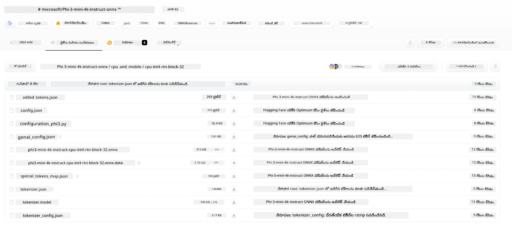
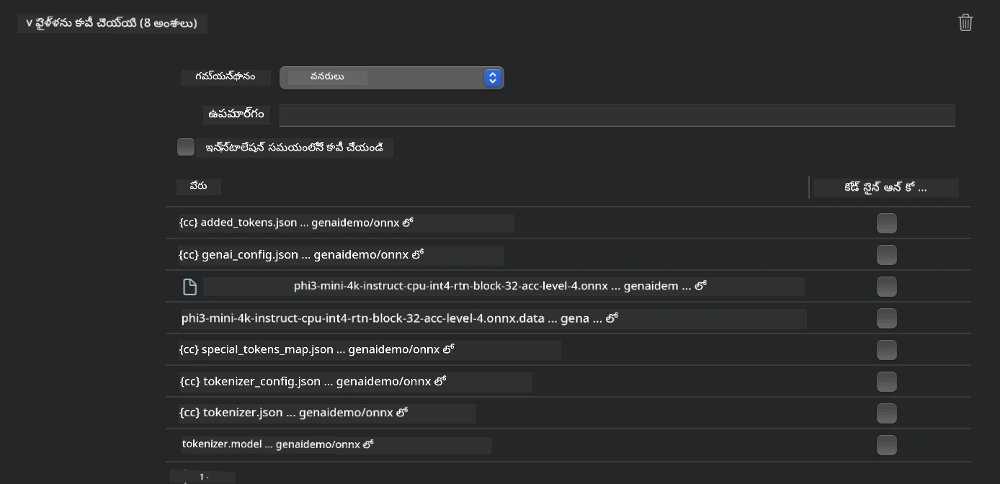
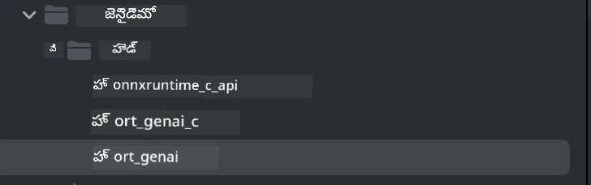
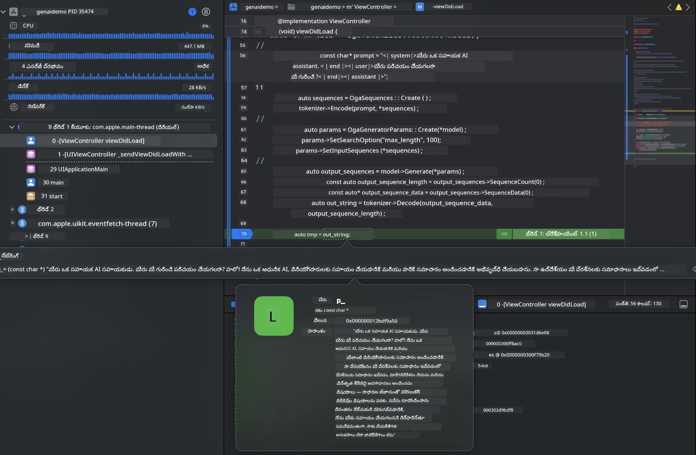

# **iOSలో Phi-3 ఇన్ఫరెన్స్**

Phi-3-mini Microsoft నుండి వచ్చిన ఒక కొత్త మోడల్ సిరీస్, ఇది Large Language Models (LLMs)ను ఎడ్జ్ పరికరాలు మరియు IoT పరికరాలపై డిప్లాయ్ చేయడానికి అనుమతిస్తుంది. Phi-3-mini iOS, Android, మరియు Edge Device deployments కోసం అందుబాటులో ఉంది, BYOD వాతావరణాలలో జనరేటివ్ AI న్ని డిప్లాయ్ చేయడానికి అనుమతిస్తుంది. క్రింది ఉదాహరణ iOSలో Phi-3-mini ఎలా డిప్లాయ్ చేయాలో చూపుతుంది.

## **1. సిద్ధత**

- **a.** macOS 14+
- **b.** Xcode 15+
- **c.** iOS SDK 17.x (iPhone 14 A16 లేదా వాటిని మించి)
- **d.** Python 3.10+ ను ఇన్‌స్టాల్ చేయండి (Conda సూచించబడింది)
- **e.** Python లైబ్రరీని ఇన్‌స్టాల్ చేయండి: `python-flatbuffers`
- **f.** CMake ను ఇన్‌స్టాల్ చేయండి

### Semantic Kernel మరియు ఇన్ఫరెన్స్

Semantic Kernel అనేది ఒక అప్లికేషన్ ఫ్రేమ్‌వర్క్, ఇది Azure OpenAI Service, OpenAI మోడల్స్ మరియు స్థానిక మోడల్స్‌కు అనుకూలమైన అప్లికేషన్లను సృష్టించడానికి వీలు కల్పిస్తుంది. Semantic Kernel ద్వారా స్థానిక సర్వీసులకు యాక్సెస్ చేసుకోవడం మీ స్వీయ-హోస్టెడ్ Phi-3-mini మోడల్ సర్వర్‌తో సులభంగా ఇంటిగ్రేట్ చేయగలిగేలా చేస్తుంది.

### Ollama లేదా LlamaEdgeతో క్వాంటైజ్డ్ మోడల్స్‌ను పిలవడం

చాలా వినియోగదారులు స్థానికంగా మోడల్స్‌ను నడపడానికి క్వాంటైజ్డ్ మోడల్స్‌ను ఉపయోగించడం ఇష్టపడతారు. [Ollama](https://ollama.com) మరియు [LlamaEdge](https://llamaedge.com) వినియోగదారులు వేరే వేరే క్వాంటైజ్డ్ మోడల్స్‌కు కాల్ చేయడానికి అనుమతిస్తాయి:

#### **Ollama**

మీరు నేరుగా `ollama run phi3` ను నడపవచ్చు లేదా దాన్ని ఆఫ్‌లైన్‌గా కాన్ఫిగర్ చేయవచ్చు. మీ `gguf` ఫైల్‌కు మార్గంతో ఒక Modelfile సృష్టించండి. Phi-3-mini క్వాంటైజ్డ్ మోడల్ నడపటానికి నమూనా కోడ్:

```gguf
FROM {Add your gguf file path}
TEMPLATE \"\"\"<|user|> .Prompt<|end|> <|assistant|>\"\"\"
PARAMETER stop <|end|>
PARAMETER num_ctx 4096
```

#### **LlamaEdge**

మీరు `gguf` ను క్లౌడ్ మరియు ఎడ్జ్ పరికరాల్లో ఒకేసారి ఉపయోగించాలని ఉంటే, LlamaEdge ఒక గొప్ప ఎంపిక.

## **2. iOS కోసం ONNX Runtime కంపైల్ చేయడం**

```bash

git clone https://github.com/microsoft/onnxruntime.git

cd onnxruntime

./build.sh --build_shared_lib --ios --skip_tests --parallel --build_dir ./build_ios --ios --apple_sysroot iphoneos --osx_arch arm64 --apple_deploy_target 17.5 --cmake_generator Xcode --config Release

cd ../

```

### **గమనిక**

- **a.** కంపైల్ చేయకే ముందు, Xcode సరైన రీతిలో కాన్ఫిగర్ చేయబడిందో నిర్ధారించండి మరియు టెర్మినల్‌లో దాన్ని active developer directory గా ఏర్పాటు చేయండి:

    ```bash
    sudo xcode-select -switch /Applications/Xcode.app/Contents/Developer
    ```

- **b.** ONNX Runtime ను విభిన్న ప్లాట్‌ఫారమ్‌ల కోసం కంపైల్ చేయడం అవసరం. iOS కోసం, మీరు `arm64` లేదా `x86_64` కోసం కంపైల్ చేయవచ్చు.

- **c.** కంపైల్ కోసం తాజా iOS SDK ఉపయోగించడం సూచించబడింది. అయితే, గత SDKలతో అనుకూలత అవసరమైతే మీరు పాత వెర్షన్ కూడా ఉపయోగించవచ్చు.

## **3. iOS కోసం ONNX Runtime తో జనరేటివ్ AI కంపైల్ చేయడం**

> **గమనిక:** ONNX Runtime తో జనరేటివ్ AI ప్రివ్యూలో ఉంది, కాబట్టి మార్పులు మారిపోవచ్చు అన్న విషయాన్ని గమనించండి.

```bash

git clone https://github.com/microsoft/onnxruntime-genai
 
cd onnxruntime-genai
 
mkdir ort
 
cd ort
 
mkdir include
 
mkdir lib
 
cd ../
 
cp ../onnxruntime/include/onnxruntime/core/session/onnxruntime_c_api.h ort/include
 
cp ../onnxruntime/build_ios/Release/Release-iphoneos/libonnxruntime*.dylib* ort/lib
 
export OPENCV_SKIP_XCODEBUILD_FORCE_TRYCOMPILE_DEBUG=1
 
python3 build.py --parallel --build_dir ./build_ios --ios --ios_sysroot iphoneos --ios_arch arm64 --ios_deployment_target 17.5 --cmake_generator Xcode --cmake_extra_defines CMAKE_XCODE_ATTRIBUTE_CODE_SIGNING_ALLOWED=NO

```

## **4. Xcodeలో App అప్లికేషన్ సృష్టించడం**

నేను App అభివృద్ధి విధంగా Objective-Cను ఎంచుకున్నాను, ఎందుకంటే ONNX Runtime C++ APIతో జనరేటివ్ AI ఉపయోగించినప్పుడు Objective-C బెటర్ అనుకూలత కలిగి ఉంటుంది. ఖచ్చితంగా, మీరు Swift బ్రిడ్జింగ్ ద్వారా సంబంధిత కాల్‌లను కూడా పూర్తి చేయవచ్చు.


## **5. ONNX క్వాంటైజ్డ్ INT4 మోడల్‌ను App ప్రాజెక్ట్‌లోకి కాపీ చేయడం**

మా వద్ద ONNX ఫార్మాట్‌లోని INT4 క్వాంటైజేషన్ మోడల్‌ను దిగుమతి చేయాల్సి ఉంటుంది, దానిని ముందుగా డౌన్లోడ్ చేయాలి



డౌన్లోడ్ చేసిన తర్వాత, దాన్ని Xcodeలో ప్రాజెక్ట్ యొక్క Resources డైరెక్టరీలో జత చేయాలి.



## **6. ViewControllersలో C++ API చేర్చడం**

> **గమనిక:**

- **a.** సంబంధిత C++ హెడ్డర్ ఫైళ్లను ప్రాజెక్ట్‌లో జత చేయండి.

  

- **b.** Xcodeలో `onnxruntime-genai` డైనమిక్ లైబ్రరీని చేర్చండి.

  

- **c.** టెస్టింగ్ కోసం C Samples కో드를 ఉపయోగించండి.您 మీరు ఎక్కువ ఫంక్షనాలిటీ కోసం ChatUI వంటి అదనపు ఫీచర్లను కూడా జోడించవచ్చు.

- **d.** మీ ప్రాజెక్ట్లో C++ ఉపయోగించాల్సిన అవసరం ఉన్నందున, Objective-C++ బాక్సిని ఎనేబుల్ చేయడానికి `ViewController.m` ను `ViewController.mm` గా పేరు మార్చండి.

```objc

    NSString *llmPath = [[NSBundle mainBundle] resourcePath];
    char const *modelPath = llmPath.cString;

    auto model =  OgaModel::Create(modelPath);

    auto tokenizer = OgaTokenizer::Create(*model);

    const char* prompt = "<|system|>You are a helpful AI assistant.<|end|><|user|>Can you introduce yourself?<|end|><|assistant|>";

    auto sequences = OgaSequences::Create();
    tokenizer->Encode(prompt, *sequences);

    auto params = OgaGeneratorParams::Create(*model);
    params->SetSearchOption("max_length", 100);
    params->SetInputSequences(*sequences);

    auto output_sequences = model->Generate(*params);
    const auto output_sequence_length = output_sequences->SequenceCount(0);
    const auto* output_sequence_data = output_sequences->SequenceData(0);
    auto out_string = tokenizer->Decode(output_sequence_data, output_sequence_length);
    
    auto tmp = out_string;

```

## **7. అప్లికేషన్‌ను నడుపుతున్నది**

సెట్‌అప్ పూర్తయిన తర్వాత, Phi-3-mini మోడల్ ఇన్ఫరెన్స్ ఫలితాలను చూడటానికి మీరు అప్లికేషన్‌ను రన్ చేయవచ్చు.



మరింత నమూనా కోడ్ మరియు విస్తృత సూచనల కోసం, [Phi-3 Mini నమూనా రిపోజిటరీ](https://github.com/Azure-Samples/Phi-3MiniSamples/tree/main/ios) ను సందర్శించండి.

---

<!-- CO-OP TRANSLATOR DISCLAIMER START -->
నిరాకరణ:
ఈ పత్రాన్ని AI అనువాద సేవ అయిన Co-op Translator (https://github.com/Azure/co-op-translator) ఉపయోగించి అనువదించబడింది. మేము ఖచ్చితతకు ప్రయత్నించినప్పటికీ, స్వయంచాలక అనువాదాల్లో తప్పులు లేదా ఖచ్చితత్వ లోపాలు ఉండవచ్చునని దయచేసి గమనించండి. కీలకమైన సమాచారానికి వృత్తిపరమైన మానవ అనువాదం చేయించుకోవాలని సిఫార్సు చేయబడుతుంది. ఈ అనువాదాన్ని ఉపయోగించడం వల్ల ఏర్పడియే ఏవైనా అపార్థాలు లేదా తప్పుగా అర్థం చేసుకోవడాలంపైన మేము బాధ్యత వహించము.
<!-- CO-OP TRANSLATOR DISCLAIMER END -->