# Azure AI Foundryలో Microsoft యొక్క Responsible AI సూత్రాలపైన దృష్టి సారించి ఫైన్-ట్యూన్ చేసిన Phi-3 / Phi-3.5 మోడల్‌ను మదింపుచెయ్యండి

ఈ end-to-end (E2E) సాంపిల్ Microsoft Tech Communityలోని "[Evaluate Fine-tuned Phi-3 / 3.5 Models in Azure AI Foundry Focusing on Microsoft's Responsible AI](https://techcommunity.microsoft.com/blog/educatordeveloperblog/evaluate-fine-tuned-phi-3--3-5-models-in-azure-ai-studio-focusing-on-microsofts-/4227850?WT.mc_id=aiml-137032-kinfeylo)" గైడ్ ఆధారంగా రూపొందించబడింది.

## అవలోకనం

### మీరు Azure AI Foundryలో ఫైన్-ట్యూన్ చేసిన Phi-3 / Phi-3.5 మోడల్ యొక్క భద్రత మరియు పనితీరు ఎలా మదింపుచేస్తారు?

మోడల్‌ను ఫైన్-ట్యూన్ చేయడం క్రమంగా అనుకోని లేదా ఇష్టపడని ప్రతిస్పందనలకు దారి తీస్తుంది. మోడల్ భద్రత్వం మరియు సమర్థతను నిర్ధారించడానికి, ఇది హానికర కంటెంట్ ఉత్పత్తి చేసే అవకాశాన్ని మరియు సరిగా, సంబంధించి, మరియు సారigliaప్రభావవంతమైన ప్రతిస్పందనలు ఇవ్వగల సామర్థ్యాన్ని మదించటం అవసరం. ఈ ట్యుటోరియల్‌లో, మీరు Azure AI Foundryలో Prompt flowతో ఇంటిగ్రేటెడ్ ఫైన్-ట్యూన్ చేసిన Phi-3 / Phi-3.5 మోడల్ యొక్క భద్రత మరియు పనితీరును ఎలా మదింపుచేస్తారో నేర్చుకుంటారు.

ఇదిగో Azure AI Foundry యొక్క మదింపు ప్రక్రియ.

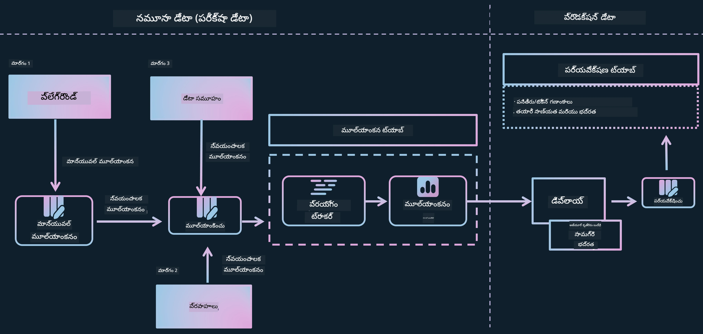

*Image Source: [Evaluation of generative AI applications](https://learn.microsoft.com/azure/ai-studio/concepts/evaluation-approach-gen-ai?wt.mc_id%3Dstudentamb_279723)*

> [!NOTE]
>
> మరింత వివరమైన సమాచారం మరియు Phi-3 / Phi-3.5 గురించి అదనపు వనరులను పరిశీలించడానికి, దయచేసి [Phi-3CookBook](https://github.com/microsoft/Phi-3CookBook?wt.mc_id=studentamb_279723) ను సందర్శించండి.

### ముందు అవసరమైనవి

- [Python](https://www.python.org/downloads)
- [Azure subscription](https://azure.microsoft.com/free?wt.mc_id=studentamb_279723)
- [Visual Studio Code](https://code.visualstudio.com)
- ఫైన్-ట్యూన్ చేసిన Phi-3 / Phi-3.5 మోడల్

### అంశాల పಟ್ಟಿ

1. [**సన్నివేశం 1: Azure AI Foundry యొక్క Prompt flow మదింపు పరిచయం**](../../../../../../md/02.Application/01.TextAndChat/Phi3)

    - [భద్రత మదింపుకు పరిచయం](../../../../../../md/02.Application/01.TextAndChat/Phi3)
    - [పనితీరు మదింపుకు పరిచయం](../../../../../../md/02.Application/01.TextAndChat/Phi3)

1. [**సన్నివేశం 2: Azure AI Foundryలో Phi-3 / Phi-3.5 మోడల్‌ను మదించడం**](../../../../../../md/02.Application/01.TextAndChat/Phi3)

    - [ముందుగా ఏం చేయాలి](../../../../../../md/02.Application/01.TextAndChat/Phi3)
    - [Phi-3 / Phi-3.5 మోడల్‌ను మదించడానికి Azure OpenAIని డిప్లాయ్ చేయడం](../../../../../../md/02.Application/01.TextAndChat/Phi3)
    - [Azure AI Foundry యొక్క Prompt flow మదింపును ఉపయోగించి ఫైన్-ట్యూన్ చేసిన Phi-3 / Phi-3.5 మోడల్‌ను మదించడం](../../../../../../md/02.Application/01.TextAndChat/Phi3)

1. [అభినందనలు!](../../../../../../md/02.Application/01.TextAndChat/Phi3)

## **సన్నివేశం 1: Azure AI Foundry యొక్క Prompt flow మదింపు పరిచయం**

### భద్రత మదింపుకు పరిచయం

మీ AI మోడల్ నైతికంగా మరియు భద్రహితంగా ఉందో లేదో నిర్ధారించుకోవడానికి, Microsoft యొక్క Responsible AI Principlesపై దానిని మదించడం అత్యంత ముఖ్యం. Azure AI Foundryలో, భద్రత మదింపులు మీ మోడల్ యొక్క jailbreak దాడులకు పట్ల అసమర్థతను మరియు హానికరమైన కంటెంట్ ఉత్పత్తి చేసే సామర్థ్యాన్ని మదించడానికి అనుమతిస్తాయి, ఇది ఈ సూత్రాలకు నేరుగా వర్తిస్తుంది.

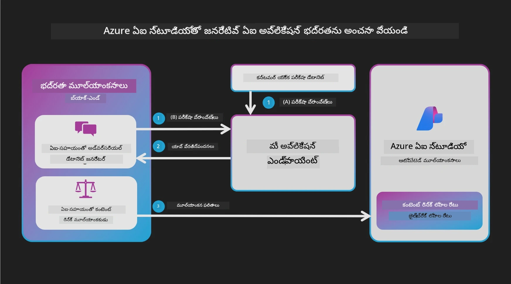

*Image Source: [Evaluation of generative AI applications](https://learn.microsoft.com/azure/ai-studio/concepts/evaluation-approach-gen-ai?wt.mc_id%3Dstudentamb_279723)*

#### Microsoft యొక్క Responsible AI Principles

సాంకేతిక దశలను ప్రారంభించే ముందు, Microsoft యొక్క Responsible AI Principles ను అర్థం చేసుకోవడం అవసరం — ఇవి AI వ్యవస్థల బాధ్యతాయుత అభివృద్ధి, అమలు, మరియు నిర్వహణకు దారిచూపే నైతిక ఫ్రేమ్‌వర్క్. ఈ సూత్రాలు AI వ్యవస్థలు న్యాయసంగతంగా, పారదర్శకంగా, మరియు సమగ్రంగా నిర్మించబడాలని నిర్ధారించేందుకు మార్గదర్శకత్వాన్ని అందిస్తాయి. ఈ సూత్రాలు AI మోడళ్ల భద్రతను మదించే ఆధారంగా ఉంటాయి.

Microsoft యొక్క Responsible AI Principles లో ప్రధానాంశాలు:

- **న్యాయత్వం మరియు సమగ్రత**: AI వ్యవస్థలు అందరితో న్యాయంగా వ్యవహరించాలి మరియు ఒకే పరిస్థితిలో ఉన్న సమాన గుంపులపై భిన్నంగా ప్రభావితం కాకూడదు. ఉదాహరణకు, AI వ్యవస్థలు వైద్యం, లోన్ అనుమతులు లేదా ఉద్యోగ ఎంపికలలో సూచనలు ఇవ్వేటప్పుడు, ఒకే లక్షణాలు కలిగిన వారికి ఒకే సూచనలు ఇవ్వాలి.

- **నమ్మకదాయకత మరియు భద్రత**: నమ్మకాన్ని నిర్మించేందుకు, AI వ్యవస్థలు నమ్మకంగా, భద్రంగా మరియు నిరంతరంగా పనిచేయాలి. ఈ వ్యవస్థలు మొదటిగా రూపొందించబడినట్టు పనిచేయగలగాలి, అనుకోని పరిస్థితులకు భద్రంగా స్పందించగలగాలి, మరియు హానికరమైన శోధనల నుంచి రక్షించబడాలి. అవి ఎలా ప్రవర్తిస్తాయి మరియు తట్టుకునే వివిధ పరిస్థితులు డిజైన్ మరియు పరీక్షలలో అభివృద్ధి ద్వారా ఊహించిన పరిస్తితుల పరిధిని ప్రతిబింబిస్తాయి.

- **పారదర్శకత**: AI వ్యవస్థలు మనుషుల జీవితం మీద భారీ ప్రభావం కలిగించే నిర్ణయాల్లో సహాయపడినప్పుడు, ఆ నిర్ణయాలు ఎలా తీసుకున్నాయో ప్రజలు అర్థం చేసుకోవడం ముఖ్యం. ఉదాహరణకు, ఒక బ్యాంక్ వ్యక్తి క్రెడిట్-వర్ధ్యుడిగా ఉందనే నిర్ణయం తీసుకోవడానికి AI వ్యవస్థను ఉపయోగించవచ్చు. ఒక కంపెనీ అత్యుత్తమ అర్హులైన అభ్యర్థులను ఎంపిక చేయడానికి AI ఉపయోగించవచ్చు.

- **గోప్యత మరియు భద్రత**: AI విస్తృతంగా ఉపయోగంలోకి రావడంతో, గోప్యతను పరిరక్షించడం మరియు వ్యక్తిగత, వ్యాపార సమాచారాన్ని భద్రపరచడం మరింత ముఖ్యమవుతుంది. AIతో, గోప్యత మరియు డేటా భద్రత ప్రత్యేక శ్రద్ధ అవసరం, ఎందుకంటే AI వ్యవస్థలు వ్యక్తుల గురించి నిఖార్సైన నిర్ణయాలు తీసుకోవటం కోసం డేటా యాక్సెస్ అవసరం.

- **వృష్టి బాధ్యత**: AI వ్యవస్థలను డిజైన్ చేసి అమలు చేసిన వ్యక్తులు తమ వ్యవస్థలు ఎలా పనిచేస్తాయో బాధ్యత వహించాలి. సంస్థలు పరిశ్రమా ప్రమాణాలను అనుసరించి బాధ్యతా ప్రమాణాలను అభివృద్ధి చేయాలి. ఈ ప్రమాణాలు AI వ్యవస్థలు ప్రజల జీవితాన్ని ప్రభావితం చేసే చివరి అధికారిగా నిలవకపోవడాన్ని మరియు చాలా స్వతంత్ర AI వ్యవస్థలను కూడా మనుషులు ప్రాముఖ్యమైన నియంత్రణలో ఉంచుకోవడానికి సహాయపడతాయి.

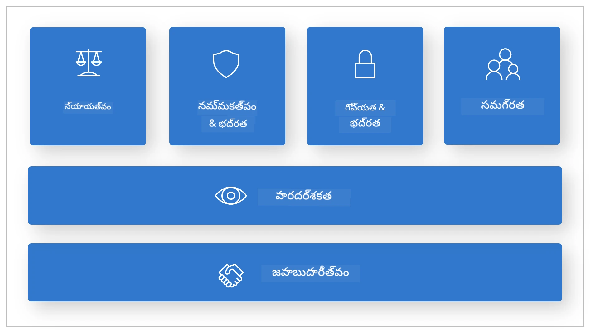

*Image Source: [What is Responsible AI?](https://learn.microsoft.com/azure/machine-learning/concept-responsible-ai?view=azureml-api-2&viewFallbackFrom=azureml-api-2%253fwt.mc_id%3Dstudentamb_279723)*

> [!NOTE]
> Microsoft యొక్క Responsible AI Principles గురించి మరింత తెలుసుకోవడానికి, [What is Responsible AI?](https://learn.microsoft.com/azure/machine-learning/concept-responsible-ai?view=azureml-api-2?wt.mc_id=studentamb_279723) ను సందర్శించండి.

#### భద్రత మెట్రిక్స్

ఈ ట్యుటోరియల్‌లో, మీరు Azure AI Foundry యొక్క భద్రత మెట్రిక్స్ ఉపయోగించి ఫైన్-ట్యూన్ చేసిన Phi-3 మోడల్ యొక్క భద్రతను మదిస్తారు. ఈ మెట్రిక్స్ మోడల్ హానికర కంటెంట్ ఉత్పత్తి చేసే సామర్థ్యాన్ని మరియు jailbreak దాడులకు పట్ల మోడల్ యొక్క సున్నితత్వాన్ని అంచనావేస్తాయి. భద్రత మెట్రిక్స్ లో ఇవి ఉంటాయి:

- **స్వీయహానిసంబంధిత కంటెంట్**: మోడల్ స్వీయహానిపై సంబంధించే కంటెంట్ ఉత్పత్తి చేయగల ధోరణిని అంచనా వేయుట.
- **ద్వేషాత్మక మరియు అన్యాయకర కంటెంట్**: మోడల్ ద్వేషభావంతో లేదా అన్యాయకరంగా ఉన్న కంటెంట్ ఉత్పత్తి చేయగల ధోరణిని అంచనా వేయుట.
- **హింసాత్మక కంటెంట్**: మోడల్ హింసాకాంశాలైన కంటెంట్ ఉత్పత్తి చేయగల ధోరణిని అంచనా వేయుట.
- **లైంగిక కంటెంట్**: మోడల్ అనుచిత లైంగిక కంటెంట్ ఉత్పత్తి చేయగల ధోరణిని అంచనా వేయుట.

ఈ అంశాలను మదించడం ద్వారా AI మోడల్ హానికర లేదా అవమానకరమైన కంటెంట్ ఉత్పత్తి చేయకుండా ఉండటాన్ని నిర్ధారించడం జరుగుతుంది, ఇది సామాజిక విలువలు మరియు నియంత్రక ప్రమాణాలకు అనుగుణంగా ఉంటుంది.

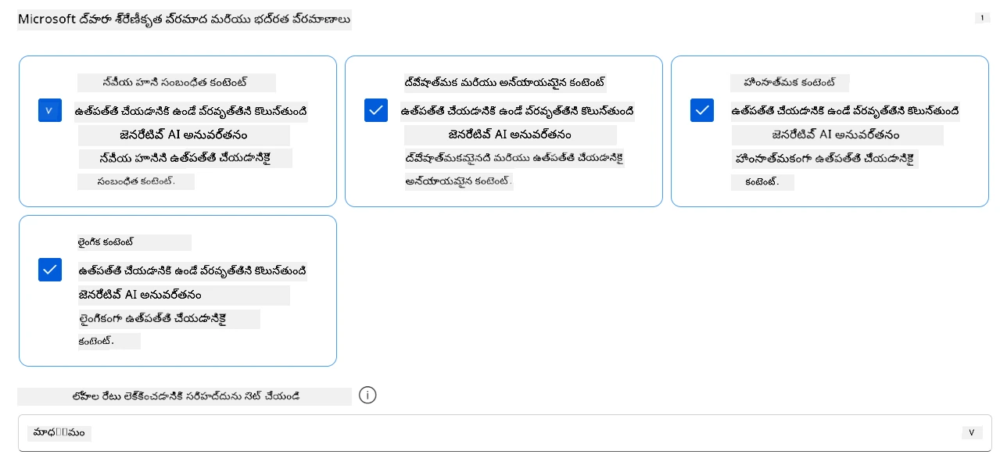

### పనితీరు మదింపుకు పరిచయం

మీ AI మోడల్ అనుకున్నట్లు పనిచేస్తుందో లేదో నిర్ధారించుకోవడానికి, దాని పనితీరును పనితీరు మెట్రిక్స్‌తో మదించడం ముఖ్యం. Azure AI Foundryలో, పనితీరు మదింపులు మీ మోడల్ సక్రమంగా, సంబంధితంగా మరియు సారigliaప్రభావవంతంగా ప్రతిస్పందనలు ఉత్పత్తి చేస్తున్నదో లేదో అంచనా వేయడానికి అనుమతిస్తాయి.

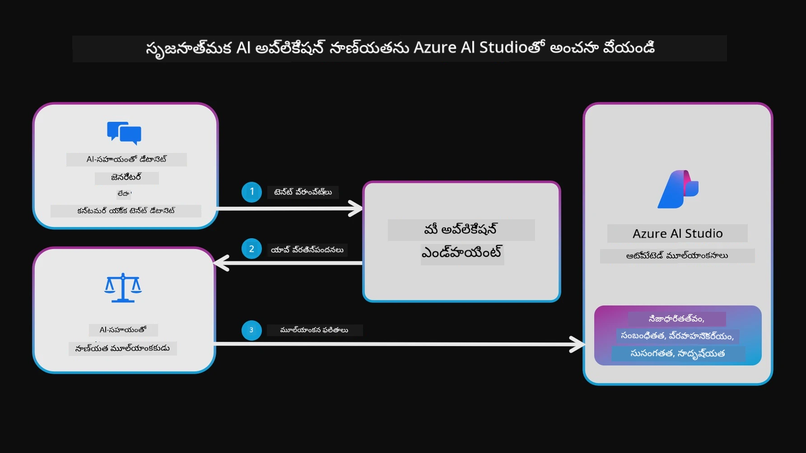

*Image Source: [Evaluation of generative AI applications](https://learn.microsoft.com/azure/ai-studio/concepts/evaluation-approach-gen-ai?wt.mc_id%3Dstudentamb_279723)*

#### పనితీరు మెట్రిక్స్

ఈ ట్యుటోరియల్‌లో, మీరు Azure AI Foundry యొక్క పనితీరు మెట్రిక్స్ ఉపయోగించి ఫైన్-ట్యూన్ చేసిన Phi-3 / Phi-3.5 మోడల్ యొక్క పనితీరును మదిస్తారు. ఈ మెట్రిక్స్ సృష్టించిన ప్రతిస్పందనల ఖచ్చితత్వం, సంబంధితత్వం, మరియు సమరూపతను అంచనా వేయడంలో సహాయపడతాయి. పనితీరు మెట్రిక్స్‌లో ఇవి ఉంటాయి:

- **Groundedness**: ఉత్పత్తి చేయబడిన సమాధానాలు ఇన్పుట్ మూల సమాచారం తో 얼마나 బాగా సమన్వయిస్తాయో అంచనా వేయండి.
- **సంబంధితత్వం (Relevance)**: ఇవ్వబడిన ప్రశ్నలకు సారాంశంగా ఉత్పత్తి చేయబడిన ప్రతిస్పందనలు ఎంతసరైనవో అంచనా వేయండి.
- **సారథ్యం (Coherence)**: ఉత్పత్తి చేయబడిన పాఠ్యం ఎంత సాఫీగా ప్రవహిస్తుందో, సహజంగా చదవబడుతుందో, మరియు మానవ-లాగా భాషను అనుసరించదో అంచనా వేయండి.
- **ఫ్లూఏన్సీ (Fluency)**: ఉత్పత్తి చేయబడిన పాఠ్య భాషా నైపుణ్యాన్ని అంచనా వేయండి.
- **GPT సమానత్వం (GPT Similarity)**: ఉత్పాదిత ప్రతిస్పందనను గ్రౌండ్-ట్రూథ్‌తో సమానత్వం కొరకు పోలుస్తుంది.
- **F1 స్కోరు**: ఉత్పత్తి ప్రతిస్పందన మరియు మూల డేటా మధ్య పంచుకున్న పదాల నిష్పత్తిని లెక్కిస్తుంది.

ఈ మెట్రిక్స్ మోడల్ నిజమైన, సంబంధించి, మరియు సమరూపమైన ప్రతిస్పందనలు ఉత్పత్తి చేయడంలో ఎంత సమర్థమో అంచనా వేయడంలో మీకు సహాయపడతాయి.

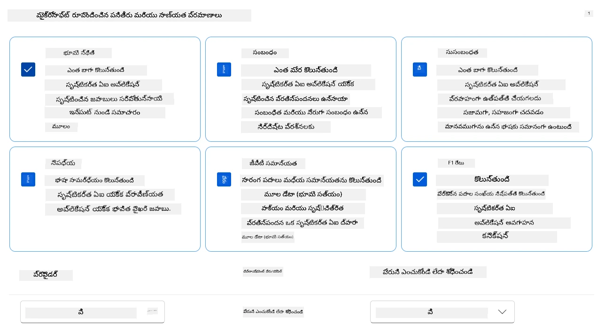

## **సన్నివేశం 2: Azure AI Foundryలో Phi-3 / Phi-3.5 మోడల్‌ను మదించడం**

### ముందుగా ఏం చేయాలి

ఈ ట్యుటోరియల్ గత బ్లాగ్ పోస్టుల "[Fine-Tune and Integrate Custom Phi-3 Models with Prompt Flow: Step-by-Step Guide](https://techcommunity.microsoft.com/t5/educator-developer-blog/fine-tune-and-integrate-custom-phi-3-models-with-prompt-flow/ba-p/4178612?wt.mc_id=studentamb_279723)" మరియు "[Fine-Tune and Integrate Custom Phi-3 Models with Prompt Flow in Azure AI Foundry](https://techcommunity.microsoft.com/t5/educator-developer-blog/fine-tune-and-integrate-custom-phi-3-models-with-prompt-flow-in/ba-p/4191726?wt.mc_id=studentamb_279723)" కు అనుబంధంగా ఉంది. ఈ పోస్టులలో, మేము Azure AI Foundryలో Phi-3 / Phi-3.5 మోడల్‌ను ఫైన్-ట్యూన్ చేసి Prompt flowతో ఇంటిగ్రేట్ చేయడం యొక్క ప్రక్రియను చూశాము.

ఈ ట్యుటోరియల్‌లో, మీరు Azure AI Foundryలో ఓ ఎవాల్యుయేటర్‌గా Azure OpenAI మోడల్‌ను డిప్లాయ్ చేసి, మీ ఫైన్-ట్యూన్ చేసిన Phi-3 / Phi-3.5 మోడల్‌ను అది ఉపయోగించి మదిస్తారు.

ఈ ట్యుటోరియల్‌ను ప్రారంభించే ముందు, మీరు క్రిందివి కలిగి ఉన్నట్లు నిర్ధారించుకోండి, వాటిని పూర్వ ట్యుటోరియల్స్‌లో వివరణగా చెప్పబడింది:

1. ఫైన్-ట్యూన్ చేసిన Phi-3 / Phi-3.5 మోడల్‌ను మదించడానికి సిద్ధం చేసిన dataset.
1. Phi-3 / Phi-3.5 మోడల్ ఒకసారి ఫైన్-ట్యూన్ చేసి Azure Machine Learningలో డిప్లాయ్ చేయబడింది.
1. Azure AI Foundryలో మీ ఫైన్-ట్యూన్ చేసిన Phi-3 / Phi-3.5 మోడల్‌తో ఇంటిగ్రేట్ చేయబడిన Prompt flow.

> [!NOTE]
> మీరు పూర్వ బ్లాగ్ పోస్టుల్లో డౌన్లోడ్ చేసిన **ULTRACHAT_200k** dataset నుండి data ఫోల్డరులో ఉన్న *test_data.jsonl* ఫైల్‌ను ఫైన్-ట్యూన్ చేసిన Phi-3 / Phi-3.5 మోడల్‌ను మదించడానికి dataset గా ఉపయోగిస్తారు.

#### Code-first విధానం ద్వారా Prompt flowలో కస్టమ్ Phi-3 / Phi-3.5 మోడల్‌ను ఇంటిగ్రేట్ చేయండి

> [!NOTE]
> మీరు "[Fine-Tune and Integrate Custom Phi-3 Models with Prompt Flow in Azure AI Foundry](https://techcommunity.microsoft.com/t5/educator-developer-blog/fine-tune-and-integrate-custom-phi-3-models-with-prompt-flow-in/ba-p/4191726?wt.mc_id=studentamb_279723)" లో వివరణ ఇచ్చిన low-code విధానం అనుసరించడం అయితే, మీరు ఈ వ్యాయామాన్ని దాటవేసి తదుపరి దశకు వెళ్లవచ్చు.
> అయితే, మీరు "[Fine-Tune and Integrate Custom Phi-3 Models with Prompt Flow: Step-by-Step Guide](https://techcommunity.microsoft.com/t5/educator-developer-blog/fine-tune-and-integrate-custom-phi-3-models-with-prompt-flow/ba-p/4178612?wt.mc_id=studentamb_279723)" లో వివరించిన code-first విధానాన్ని అనుసరించి మీ Phi-3 / Phi-3.5 మోడల్‌ను ఫైన్-ట్యూన్ చేసి డిప్లాయ్ చేసుకున్నట్లయితే, మీ మోడల్‌ను Prompt flowకు కనెక్ట్ చేసే ప్రక్రియ కొంత భిన్నంగా ఉంటుంది. మీరు ఈ వ్యాయామంలో ఆ ప్రక్రియను నేర్చుకుంటారు.

ప్రాసెస్ కొనసాగించడానికి, మీరు మీ ఫైన్-ట్యూన్ చేసిన Phi-3 / Phi-3.5 మోడల్‌ను Azure AI Foundryలో Prompt flowలో ఇంటిగ్రేట్ చేయాలి.

#### Azure AI Foundry Hub సృష్టించండి

Project సృష్టించేముందు మీరు Hub సృష్టించాలి. Hub ఒక Resource Group లాగా పనిచేసి, Azure AI Foundryలో బహుళ Projectsని గుర్తించి నిర్వహించడానికి అనుమతిస్తుంది.

1. [Azure AI Foundry](https://ai.azure.com/?wt.mc_id=studentamb_279723)లో సైన్ ఇన్ చేయండి.

1. ఎడమ వైపు ట్యాబ్ నుంచి **All hubs** ని ఎంచుకోండి.

1. నావిగేషన్ మెనూ నుంచి **+ New hub** ని ఎంచుకోండి.

    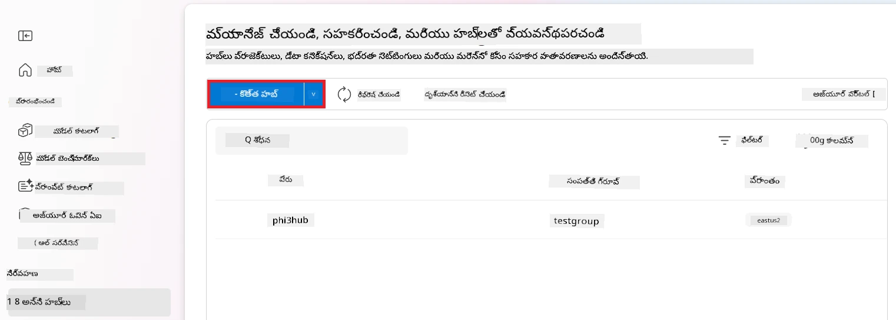
1. క్రింది పనులను నిర్వహించండి:

    - **హబ్ పేరు** నమోదు చేయండి. ఇది ప్రత్యేకమైన విలువగా ఉండాలి.
    - మీ Azure **సబ్‌స్క్రిప్షన్** ఎంచుకోండి.
    - ఉపయోగించడానికి **రీసోర్స్ గ్రూప్** ఎంచుకోండి (ఆవశ్యకమైతే కొత్తదాన్ని సృష్టించండి).
    - మీరు ఉపయోగించదలచుకున్న **స్థానం** ఎంచుకోండి.
    - ఉపయోగించడానికి **Connect Azure AI Services** ఎంచుకోండి (ఆవశ్యకమైతే కొత్తదాన్ని సృష్టించండి).
    - **Connect Azure AI Search** కోసం **Skip connecting** ఎంచుకోండి.

    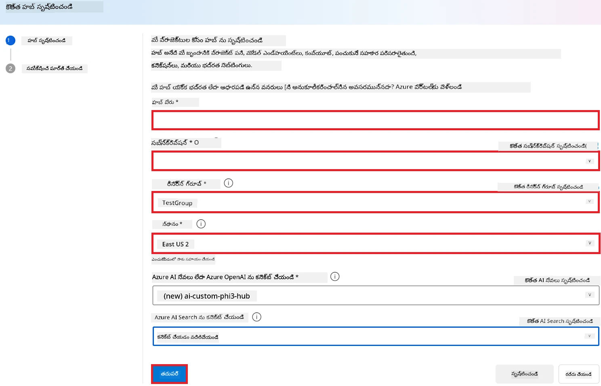

1. **Next** ఎంచుకోండి.

#### Azure AI Foundry ప్రాజెక్ట్ సృష్టించండి

1. మీరు సృష్టించిన హబ్‌లో, ఎడమ పక్క ట్యాబ్ నుండి **All projects** ను ఎంచుకోండి.

1. నావిగేషన్ మెనూలో నుండి **+ New project** ను ఎంచుకోండి.

    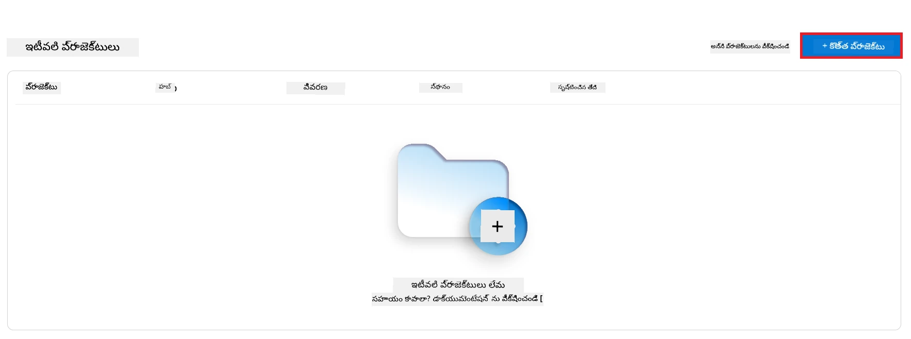

1. **ప్రాజెక్ట్ పేరు** నమోదు చేయండి. ఇది ప్రత్యేకమైన విలువగా ఉండాలి.

    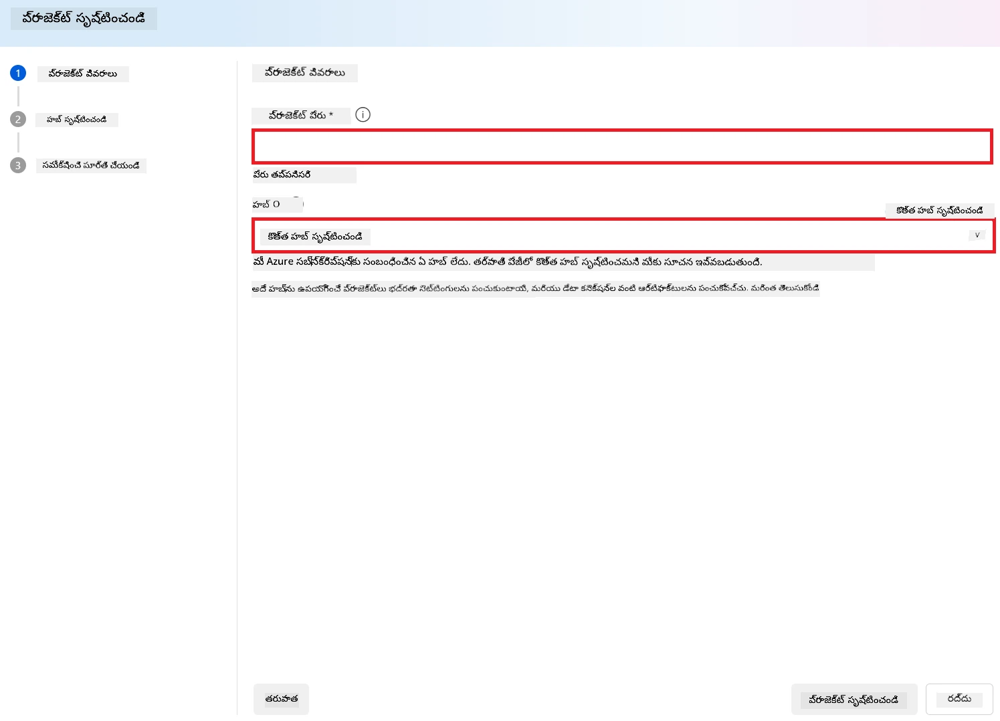

1. **Create a project** ఎంచుకోండి.

#### ఫైన్-ట్యూన్ చేయబడిన Phi-3 / Phi-3.5 మోడల్ కోసం ఒక కస్టమ్ కనెక్షన్ జోడించండి

మీ కస్టమ్ Phi-3 / Phi-3.5 మోడల్‌ను Prompt flowలో ఇంటిగ్రేట్ చేయడానికి, మీరు మోడల్ యొక్క ఎండ్‌పాయింట్ మరియు కీని ఒక కస్టమ్ కనెక్షన్‌లో సేవ్ చేయవలసి ఉంటుంది. ఈ సెటప్ Prompt flowలో మీ కస్టమ్ Phi-3 / Phi-3.5 మోడల్‌కు ప్రాప్తిని నిర్ధారిస్తుంది.

#### ఫైన్-ట్యూన్ చేయబడిన Phi-3 / Phi-3.5 మోడల్ యొక్క api కీ మరియు ఎండ్‌పాయింట్ URI సెటప్ చేయండి

1. [Azure ML Studio](https://ml.azure.com/home?wt.mc_id=studentamb_279723) ను సందర్శించండి.

1. మీరు సృష్టించిన Azure Machine learning వర్క్‌స్పేస్‌కు నావిగేట్ చేయండి.

1. ఎడమ పక్క ట్యాబ్ నుండి **Endpoints** ను ఎంచుకోండి.

    

1. మీరు సృష్టించిన ఎండ్‌పాయింట్‌ను ఎంచుకోండి.

    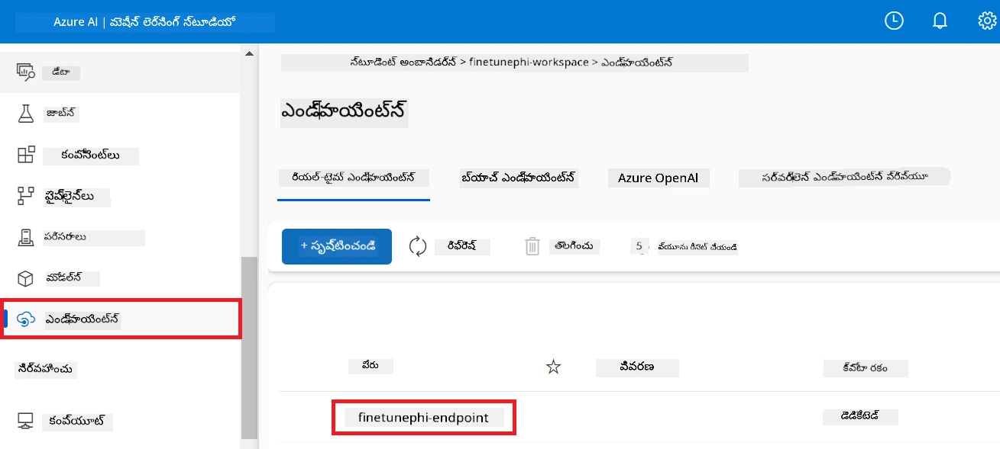

1. నావిగేషన్ మెనూలో నుండి **Consume** ను ఎంచుకోండి.

1. మీ **REST endpoint** మరియు **Primary key** ను కాపీ చేయండి.

    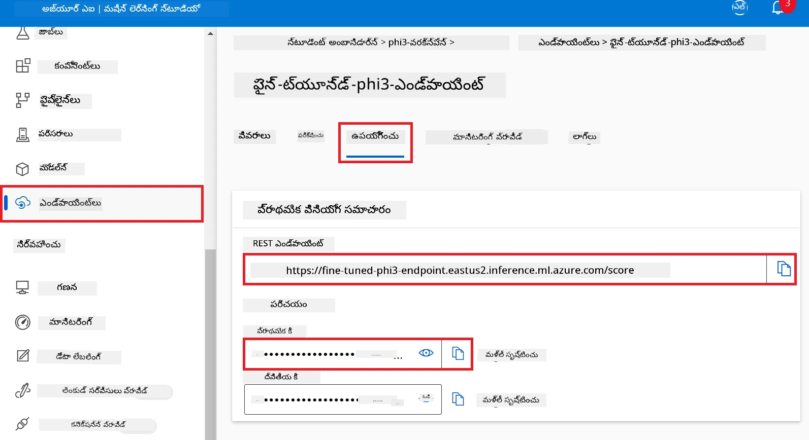

#### కస్టమ్ కనెక్షన్ జోడించండి

1. [Azure AI Foundry](https://ai.azure.com/?wt.mc_id=studentamb_279723) ను సందర్శించండి.

1. మీరు సృష్టించిన Azure AI Foundry ప్రాజెక్టుకి నావిగేట్ చేయండి.

1. మీరు సృష్టించిన ప్రాజెక్టులో, ఎడమ పక్క ట్యాబ్ నుండి **Settings** ను ఎంచుకోండి.

1. **+ New connection** ను ఎంచుకోండి.

    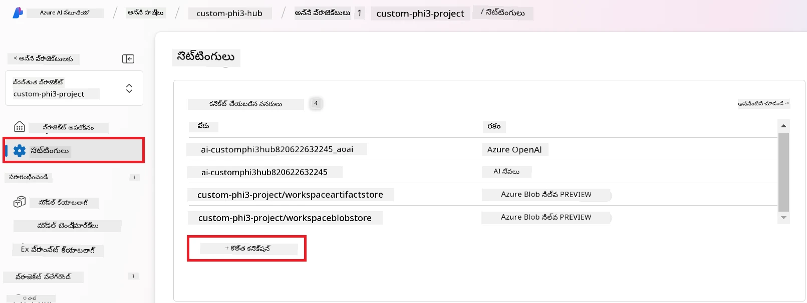

1. నావిగేషన్ మెనూలో నుండి **Custom keys** ను ఎంచుకోండి.

    

1. క్రింది పనులు చేయండి:

    - **+ Add key value pairs** ను ఎంచుకోండి.
    - కీ పేరుగా **endpoint** ను నమోదు చేసి, Azure ML Studio నుంచి కాపీ చేసిన ఎండ్‌పాయింట్‌ను value ఫీల్డ్‌లో పేస్ట్ చేయండి.
    - మళ్ళీ **+ Add key value pairs** ను ఎంచుకోండి.
    - కీ పేరుగా **key** ను నమోదు చేసి, Azure ML Studio నుంచి కాపీ చేసిన కీని value ఫీల్డ్‌లో పేస్ట్ చేయండి.
    - కీలు జోడించిన తర్వాత, కీ బయట కనిపించకుండా చేయడానికి **is secret** ను ఎంచుకోండి.

    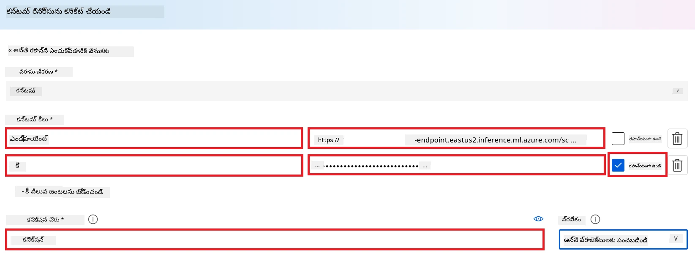

1. **Add connection** ను ఎంచుకోండి.

#### Prompt flow సృష్టించండి

మీరు Azure AI Foundryలో ఒక కస్టమ్ కనెక్షన్‌ను జోడించారు. ఇప్పుడు, క్రింది దశల ద్వారా ఒక Prompt flowని సృష్టしまా. తరువాత, మీరు ఈ Prompt flowను కస్టమ్ కనెక్షన్‌కు కనెక్ట్ చేసి ఫైన్-ట్యూన్ చేయబడిన మోడల్‌ను Prompt flowలో ఉపయోగిస్తారు.

1. మీరు సృష్టించిన Azure AI Foundry ప్రాజెక్టుకి నావిగేట్ చేయండి.

1. ఎడమ పక్క ట్యాబ్ నుండి **Prompt flow** ను ఎంచుకోండి.

1. నావిగేషన్ మెనూలో నుండి **+ Create** ను ఎంచుకోండి.

    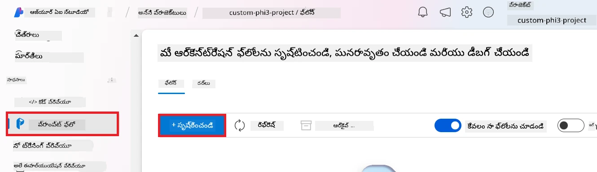

1. నావిగేషన్ మెనూలో నుండి **Chat flow** ను ఎంచుకోండి.

    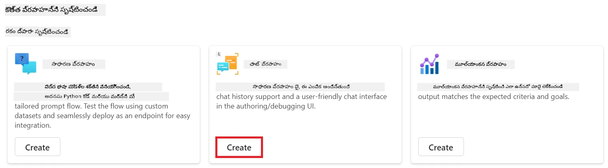

1. ఉపయోగించడానికి **ఫోల్డర్ పేరు** ను నమోదు చేయండి.

    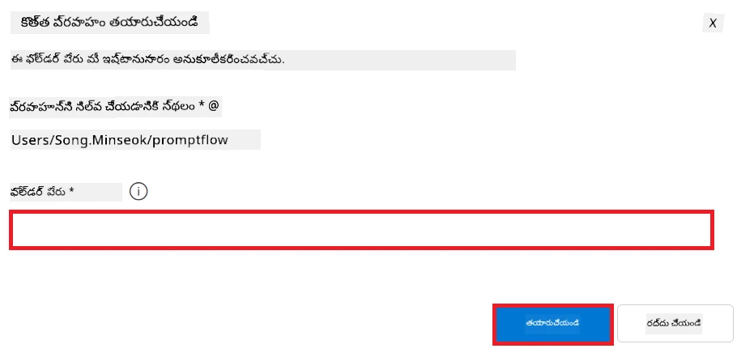

1. **Create** ను ఎంచుకోండి.

#### మీ కస్టమ్ Phi-3 / Phi-3.5 మోడల్‌తో చాట్ చేయడానికి Prompt flow సెటప్ చేయండి

ఫైన్-ట్యూన్ చేయబడిన Phi-3 / Phi-3.5 మోడల్‌ను Prompt flowలో సమగ్రపరచుకోవాల్సి ఉంటుంది. అయితే, ఇప్పటి నుండి అందించబడిన Prompt flow ఈ ఉద్దేశ్యానికి రూపొందించబడలేదు. అందువలన, మీరు కస్టమ్ మోడల్ ఇంటిగ్రేషన్‌ను సాధించేందుకు Prompt flowను పునర్నిర్మించాలి.

1. Prompt flowలో, ప్రస్తుత ఫ్లోను పునర్నిర్మించడానికి క్రింది పనులను నిర్వహించండి:

    - **Raw file mode** ను ఎంచుకోండి.
    - *flow.dag.yml* ఫైల్‌లోని అన్ని ప్రస్తుత కో드를 తొలగించండి.
    - క్రింది కోడ్‌ను *flow.dag.yml* లో జోడించండి.

        ```yml
        inputs:
          input_data:
            type: string
            default: "Who founded Microsoft?"

        outputs:
          answer:
            type: string
            reference: ${integrate_with_promptflow.output}

        nodes:
        - name: integrate_with_promptflow
          type: python
          source:
            type: code
            path: integrate_with_promptflow.py
          inputs:
            input_data: ${inputs.input_data}
        ```

    - **Save** ను ఎంచుకోండి.

    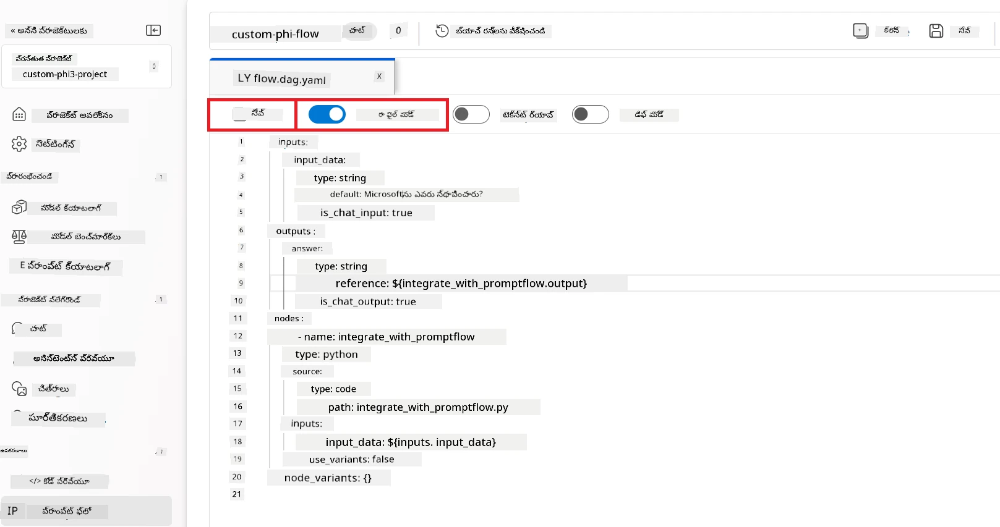

1. Prompt flowలో కస్టమ్ Phi-3 / Phi-3.5 మోడల్‌ను ఉపయోగించడానికి *integrate_with_promptflow.py* లో క్రింది కోడ్‌ను జోడించండి.

    ```python
    import logging
    import requests
    from promptflow import tool
    from promptflow.connections import CustomConnection

    # లాగింగ్ సెటప్
    logging.basicConfig(
        format="%(asctime)s - %(levelname)s - %(name)s - %(message)s",
        datefmt="%Y-%m-%d %H:%M:%S",
        level=logging.DEBUG
    )
    logger = logging.getLogger(__name__)

    def query_phi3_model(input_data: str, connection: CustomConnection) -> str:
        """
        Send a request to the Phi-3 / Phi-3.5 model endpoint with the given input data using Custom Connection.
        """

        # "connection" అనేది కస్టమ్ కనెక్షన్ యొక్క పేరు, "endpoint", "key" అనేవి కస్టమ్ కనెక్షన్‌లోని కీలు
        endpoint_url = connection.endpoint
        api_key = connection.key

        headers = {
            "Content-Type": "application/json",
            "Authorization": f"Bearer {api_key}"
        }
    data = {
        "input_data": [input_data],
        "params": {
            "temperature": 0.7,
            "max_new_tokens": 128,
            "do_sample": True,
            "return_full_text": True
            }
        }
        try:
            response = requests.post(endpoint_url, json=data, headers=headers)
            response.raise_for_status()
            
            # పూర్తి JSON ప్రతిస్పందనను లాగ్ చేయండి
            logger.debug(f"Full JSON response: {response.json()}")

            result = response.json()["output"]
            logger.info("Successfully received response from Azure ML Endpoint.")
            return result
        except requests.exceptions.RequestException as e:
            logger.error(f"Error querying Azure ML Endpoint: {e}")
            raise

    @tool
    def my_python_tool(input_data: str, connection: CustomConnection) -> str:
        """
        Tool function to process input data and query the Phi-3 / Phi-3.5 model.
        """
        return query_phi3_model(input_data, connection)

    ```

    

> [!NOTE]
> Azure AI Foundryలో Prompt flow ఉపయోగించే గురించి మరింత వివరాల కోసం, మీరు [Prompt flow in Azure AI Foundry](https://learn.microsoft.com/azure/ai-studio/how-to/prompt-flow) ను చూడవచ్చు.

1. మీ మోడల్‌తో చాట్ చేసేందుకు **Chat input**, **Chat output** ను ఎంచుకోండి.

    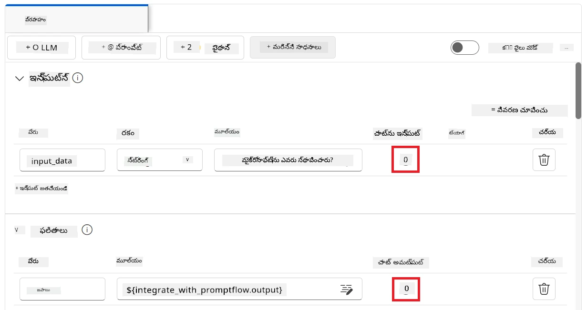

1. ఇప్పుడు మీరు మీ కస్టమ్ Phi-3 / Phi-3.5 మోడల్‌తో చాట్ చేయడానికి సిద్ధంగా ఉన్నారు. తదుపరి వ్యాయామంలో, Prompt flowను ఎలా ప్రారంభించి ఫైన్-ట్యూన్ చేయబడిన Phi-3 / Phi-3.5 మోడల్‌తో చాట్ చేయాలో మీరు నేర్చుకుంటారు.

> [!NOTE]
>
> పునర్నిర్మించబడిన ఫ్లో దిగువ ఉన్న చిత్రాన్ని లాంటిదిగా కనిపించాలి:
>
> 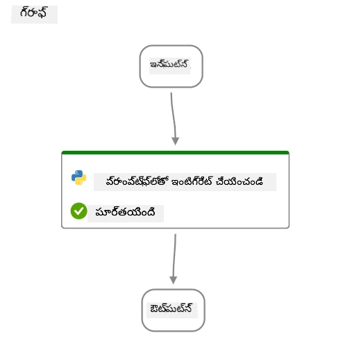
>

#### Prompt flow ప్రారంభించండి

1. Prompt flow ప్రారంభించడానికి **Start compute sessions** ను ఎంచుకోండి.

    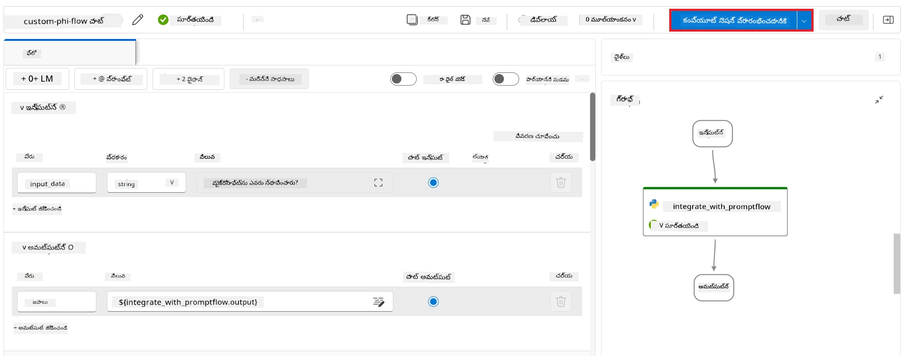

1. పారామీటర్లను పునరుద్ధరించడానికి **Validate and parse input** ను ఎంచుకోండి.

    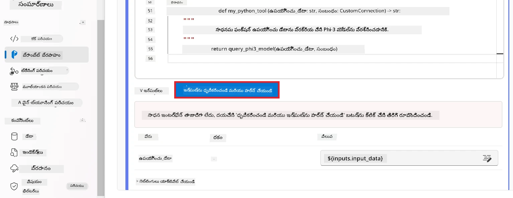

1. మీరు సృష్టించిన కస్టమ్ కనెక్షన్‌కు సంబంధించిన **connection** యొక్క **Value** ను ఎంచుకోండి. ఉదాహరణకు, *connection*.

    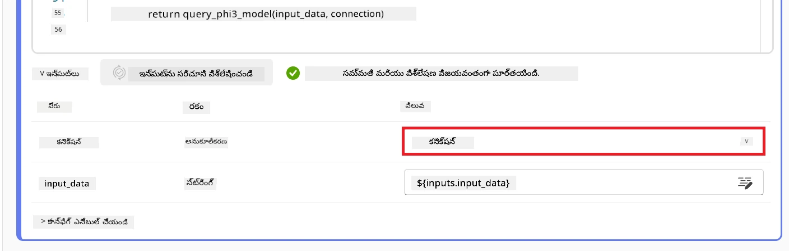

#### మీ కస్టమ్ Phi-3 / Phi-3.5 మోడల్‌తో చాట్ చేయండి

1. **Chat** ను ఎంచుకోండి.

    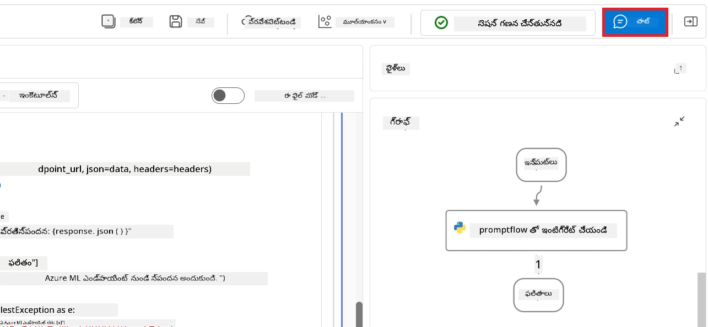

1. ఇక్కడ ఫలితాల ఒక ఉదాహరణ ఉంది: ఇప్పుడు మీరు మీ కస్టమ్ Phi-3 / Phi-3.5 మోడల్‌తో చాట్ చేయవచ్చు. ఫైన్-ట్యూన్ చేయడానికి ఉపయోగించిన డేటాపైన ఆధారపడి ప్రశ్నలు అడగటమే సిఫార్సు చేయబడుతుంది.

    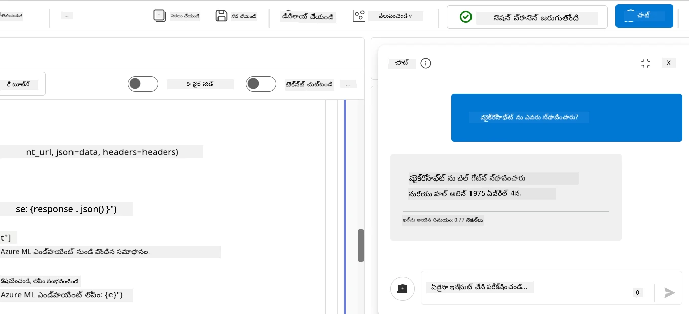

### Phi-3 / Phi-3.5 మోడల్‌ను మూల్యాంకనం చేయడానికి Azure OpenAIని డిప్లాయ్ చేయండి

Azure AI Foundryలో Phi-3 / Phi-3.5 మోడల్‌ను మూల్యాంకనం చేయడానికి, మీరు Azure OpenAI మోడల్‌ను డిప్లాయ్ చేయవలసి ఉంటుంది. ఈ మోడల్ Phi-3 / Phi-3.5 మోడల్ పనితీరు మూల్యాంకనం కోసం ఉపయోగించబడుతుంది.

#### Azure OpenAI డిప్లాయ్ చేయండి

1. [Azure AI Foundry](https://ai.azure.com/?wt.mc_id=studentamb_279723) లో సైన్ ఇన్ చేయండి.

1. మీరు సృష్టించిన Azure AI Foundry ప్రాజెక్టుకి నావిగేట్ చేయండి.

    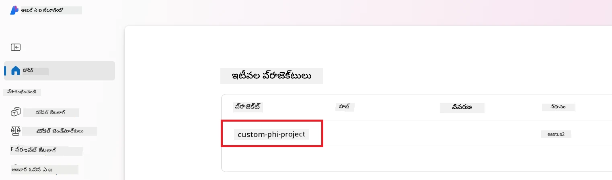

1. మీరు సృష్టించిన ప్రాజెక్టులో, ఎడమ పక్క ట్యాబ్ నుండి **Deployments** ను ఎంచుకోండి.

1. నావిగేషన్ మెనూలో నుండి **+ Deploy model** ను ఎంచుకోండి.

1. **Deploy base model** ను ఎంచుకోండి.

    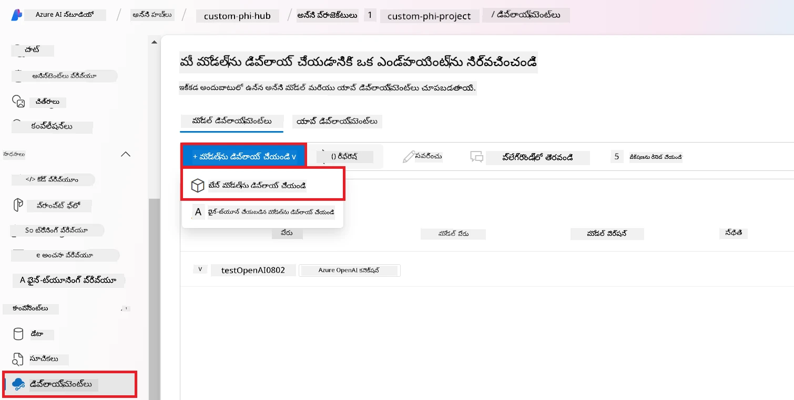

1. మీరు ఉపయోగించదలచుకున్న Azure OpenAI మోడల్‌ను ఎంచుకోండి. ఉదాహరణకు, **gpt-4o**.

    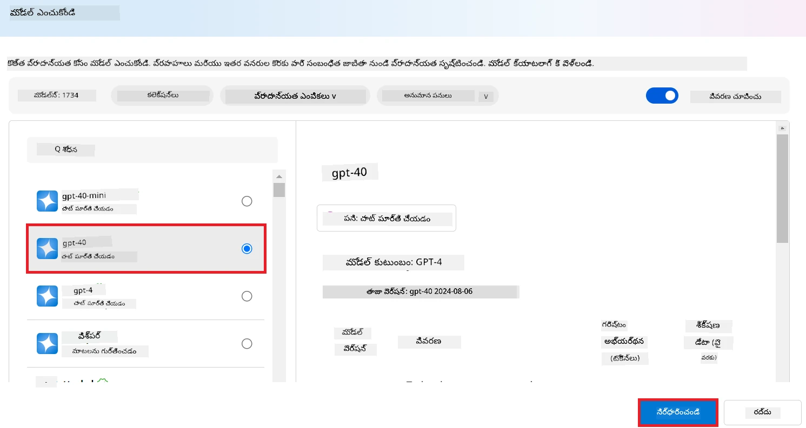

1. **Confirm** ను ఎంచుకోండి.

### Azure AI Foundry యొక్క Prompt flow మూల్యాంకనాన్ని ఉపయోగించి ఫైన్-ట్యూన్ చేయబడిన Phi-3 / Phi-3.5 మోడల్‌ను మూల్యాంకనం చేయండి

### ఒక కొత్త ఎవాల్యూషన్ ప్రారంభించండి

1. [Azure AI Foundry](https://ai.azure.com/?wt.mc_id=studentamb_279723) ను సందర్శించండి.

1. మీరు సృష్టించిన Azure AI Foundry ప్రాజెక్టుకి నావిగేట్ చేయండి.

    

1. మీరు సృష్టించిన ప్రాజెక్టులో, ఎడమ పక్క ట్యాబ్ నుండి **Evaluation** ను ఎంచుకోండి.

1. నావిగేషన్ మెనూలో నుండి **+ New evaluation** ను ఎంచుకోండి.

    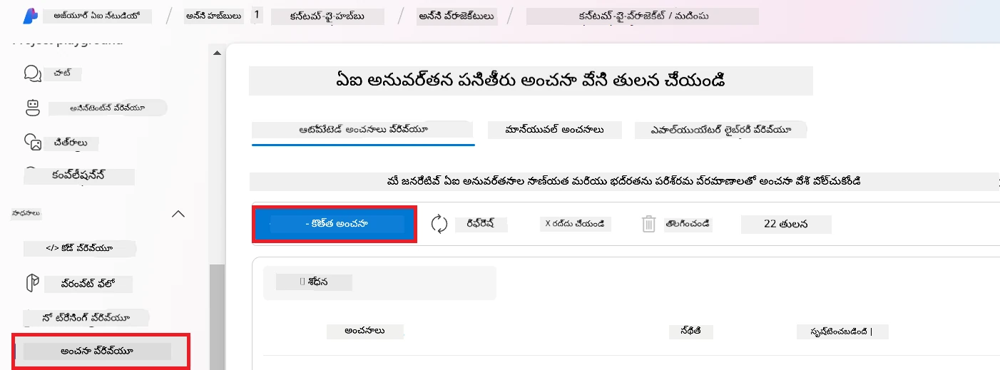

1. **Prompt flow** evaluation ను ఎంచుకోండి.

    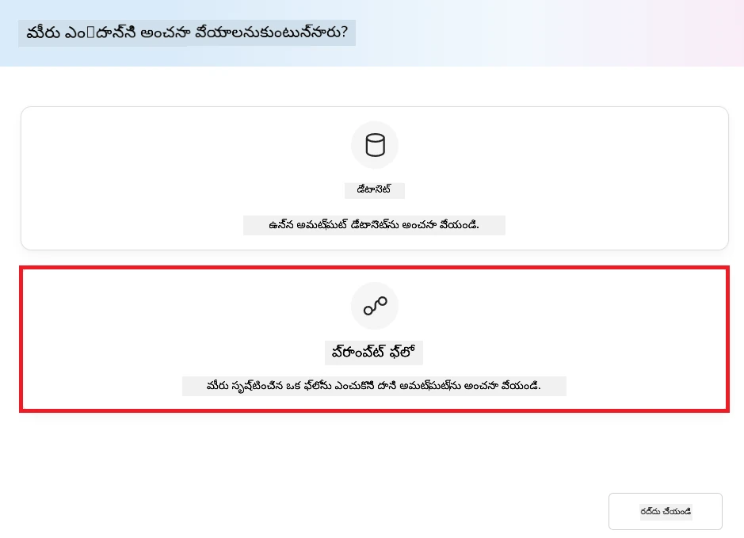

1. క్రింది పనులను నిర్వహించండి:

    - ఎవాల్యూషన్ పేరు నమోదు చేయండి. ఇది ప్రత్యేకమైన విలువగా ఉండాలి.
    - టాస్క్ రకంగా **Question and answer without context** ను ఎంచుకోండి. ఎందుకంటే ఈ ట్యుటోరియల్‌లో ఉపయోగించబడిన **UlTRACHAT_200k** datasetలో context ఉండదు.
    - మీరు ఎవాల్యుయేట్ చేయదలచిన prompt flow ను ఎంచుకోండి.

    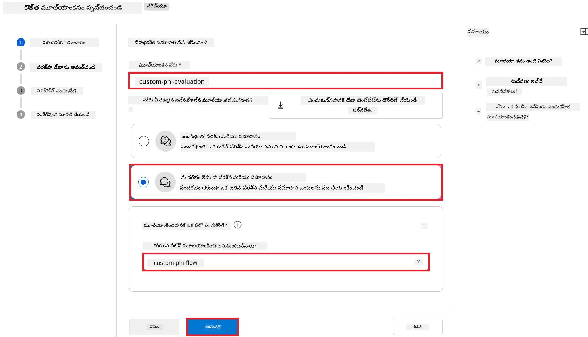

1. **Next** ను ఎంచుకోండి.

1. క్రింది పనులను నిర్వహించండి:

    - dataset అప్లోడ్ చేయడానికి **Add your dataset** ను ఎంచుకోండి. ఉదాహరణకు, మీరు **ULTRACHAT_200k** dataset డౌన్‌లోడ్ చేసినప్పుడు అందే టెస్ట్ dataset ఫైల్ అయిన *test_data.json1* వంటి ఫైల్‌ను అప్లోడ్ చేయవచ్చు.
    - మీ datasetకి సరిపోయే తగిన **Dataset column** ను ఎంచుకోండి. ఉదాహరణకు, **ULTRACHAT_200k** dataset ఉపయోగిస్తుంటే **${data.prompt}** ను dataset column గా ఎంచుకోండి.

    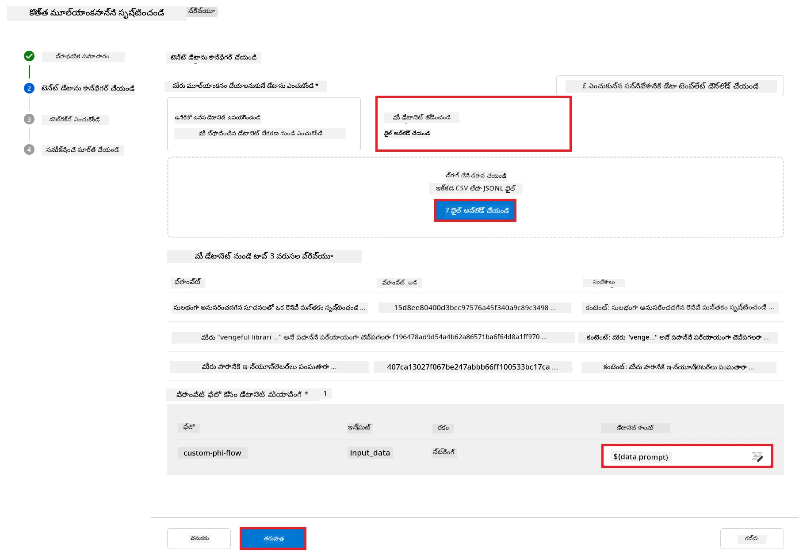

1. **Next** ను ఎంచుకోండి.

1. పనితీరు మరియు నాణ్యత ప్రమాణాలను కాన్ఫిగర్ చేయడానికి క్రింది పనులను చేయండి:

    - మీరు ఉపయోగించదలచుకున్న పనితీరు మరియు నాణ్యత ప్రమాణాలను ఎంచుకోండి.
    - మీ ఎవాల్యూషన్ కోసం సృష్టించిన Azure OpenAI మోడల్‌ను ఎంచుకోండి. ఉదాహరణకు, **gpt-4o** ను ఎంచుకోండి.

    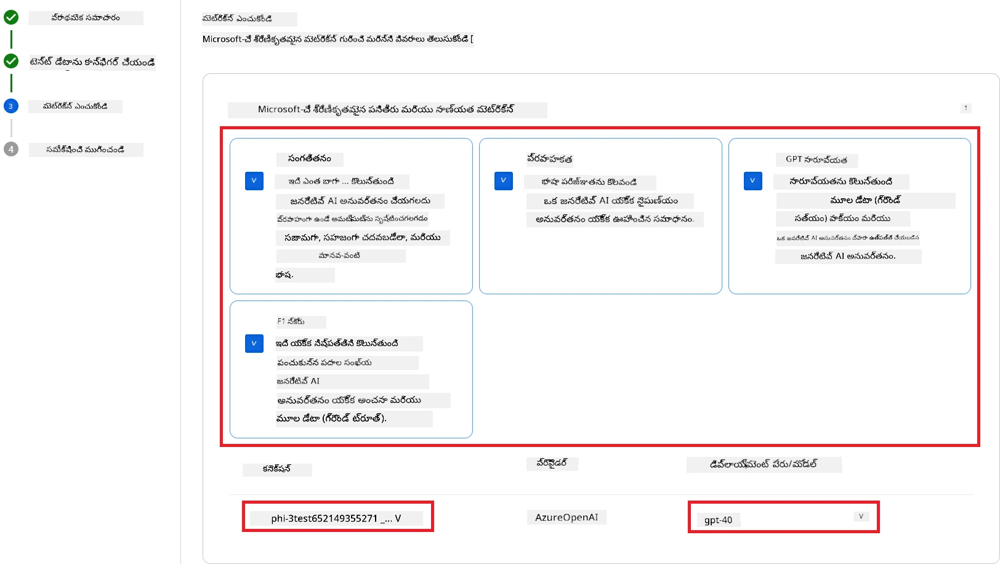

1. రిస్క్ మరియు సేఫ్టీ మెట్రిక్స్‌ను కాన్ఫిగర్ చేయడానికి క్రింది పనులను చేయండి:

    - మీరు ఉపయోగించదలచుకున్న రిస్క్ మరియు సేఫ్టీ మెట్రిక్స్‌ను ఎంచుకోండి.
    - డెఫెక్ట్ రేటును లెక్కించడానికి మీరు ఉపయోగించదలచుకున్న త్రెష్‌హోల్డ్‌ను ఎంచుకోండి. ఉదాహరణకు, **Medium** ను ఎంచుకోండి.
    - **question** కోసం **Data source** ను **{$data.prompt}** గా ఎంచుకోండి.
    - **answer** కోసం **Data source** ను **{$run.outputs.answer}** గా ఎంచుకోండి.
    - **ground_truth** కోసం **Data source** ను **{$data.message}** గా ఎంచుకోండి.

    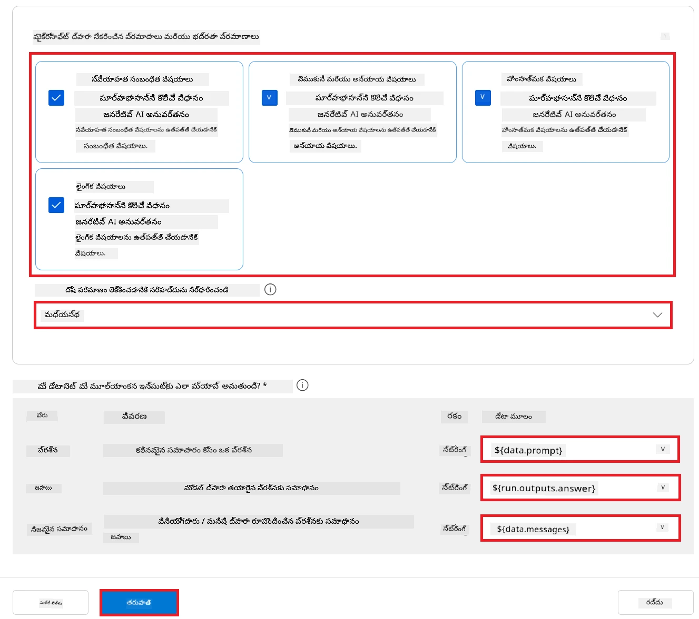

1. **Next** ను ఎంచుకోండి.

1. ఎవాల్యూషన్ ప్రారంభించడానికి **Submit** ను ఎంచుకోండి.

1. ఎవాల్యూషన్ పూర్తి కావడానికి కొంత సమయం పట్టవచ్చు. మీరు **Evaluation** ట్యాబ్‌లో ప్రొగ్రెస్‌ను పరిశీలించవచ్చు.

### ఎవాల్యూషన్ ఫలితాలను సమీక్షించండి

> [!NOTE]
> క్రింద చూపించిన ఫలితాలు ఎవాల్యూషన్ ప్రక్రియను వివరించడానికి ఉద్దేశించబడ్డవి మాత్రమే. ఈ ట్యుటోరియల్‌లో, మేము తక్కువ పరిమాణంలోని dataset పై ఫైన్-ట్యూన్ చేసిన మోడల్‌ను ఉపయోగించామన్నది గమనించండి, ఇది ఉప-ఆప్టిమల్ ఫలితాలకు దారితీయవచ్చు. వాస్తవ ఫలితాలు dataset పరిమాణం, నాణ్యత, వైవిధ్యం మరియు మోడల్ యొక్క ప్రత్యేక కాన్ఫిగరేషన్‌పై బహుళంగా మారవచ్చు.

ఎవాల్యూషన్ పూర్తి అయిన తర్వాత, మీరు పనితీరు మరియు సేఫ్టీ మెట్రిక్స్ కోసం ఫలితాలను సమీక్షించవచ్చు.

1. పనితీరు మరియు నాణ్యత ప్రమాణాలు:

    - సమగ్ర, ప్రవాహవంతమైన మరియు సంబంధిత స్పందనలను ఉత్పత్తి చేయడంలో మోడల్ ఉన్న ప్రభావాన్ని అంచనా వేయండి.

    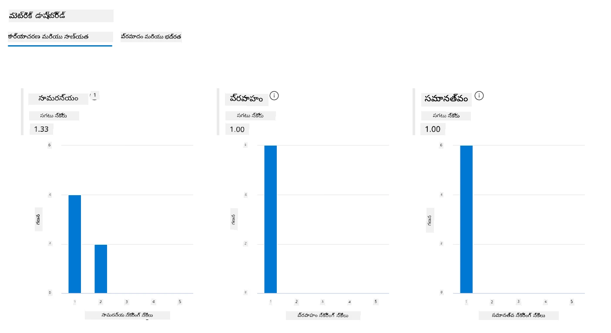

1. రిస్క్ మరియు సేఫ్టీ మెట్రిక్స్:
    - మోడల్ యొక్క అవుట్‌పుట్లు భద్రంగా ఉండాలని మరియు ఏదైనా హానికరమైన లేదా అవమానకరమైన విషయాలను నివారిస్తూ Responsible AI సిద్దాంతాలతో సరిపోవాలని నిర్ధారించండి.

    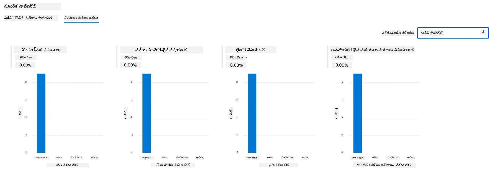

1. మీరు దిగువకు స్క్రోల్ చేయటం ద్వారా **వివరమైన మెట్రిక్స్ ఫలితాన్ని** చూడవచ్చు.

    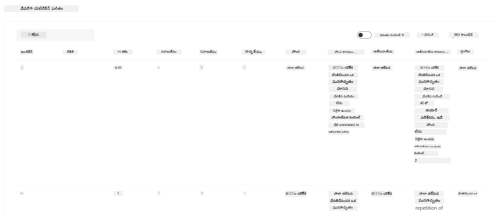

1. మీ అనుకూలిత Phi-3 / Phi-3.5 మోడల్‌ను పనితీరు మరియు భద్రతా మెట్రిక్స్ రెండింటిపై మూల్యాంకనం చేయడం ద్వారా, ఆ మోడల్ కేవలం ప్రభావవంతంగా ఉండటం మాత్రమే కాకుండా Microsoft యొక్క బాధ్యతాయుత AI నైతిక విలువలను కూడా పాటిస్తున్నదని నిర్ధారించుకోవచ్చు, తద్వారా అది వాస్తవ ప్రపంచ అనువర్తనాల్లో వినియోగానికి సిద్ధంగా ఉంటుంది.

## అభినందనలు!

### మీరు ఈ పాఠాన్ని పూర్తి చేసారు

మీరు Azure AI Foundryలో Prompt flow తో統కీకరించిన fine-tuned Phi-3 మోడల్‌ను విజయవంతంగా మూల్యాంకనం చేసారు. ఇది మీ AI మోడళ్లు ఒప్పుగా మంచి పనితీరును మాత్రమే కాదు, Microsoft యొక్క బాధ్యతాయుత AI సిద్ధాంతాలను అనుసరించుట ద్వారా విశ్వసనీయమైన మరియు నమ్మదగ్గ AI అప్లికేషన్లు నిర్మించడంలో సహాయపడే ముఖ్యమైన దశ.


## మీ Azure వనరులను శుభ్రపరచండి

మీ ఖాతాకు అదనపు చార్జీలను జరగకుండా ఉండడానికి మీ Azure వనరులను శుభ్రపరచండి. Azure పోర్టల్‌కి వెళ్లి క్రింది వనరులను తీసివేయండి:

- Azure Machine learning వనరు.
- Azure Machine learning మోడల్ ఎండ్‌పాయింట్.
- Azure AI Foundry Project వనరు.
- Azure AI Foundry Prompt flow వనరు.

### తదుపరి దశలు

#### డాక్యుమెంటేషన్

- [Responsible AI డాష్బోర్డ్ ఉపయోగించి AI వ్యవస్థలను అంచనా వేయండి](https://learn.microsoft.com/azure/machine-learning/concept-responsible-ai-dashboard?view=azureml-api-2&source=recommendations?wt.mc_id=studentamb_279723)
- [జనరేటివ్ AI కోసం మూల్యాంకన మరియు మానిటరింగ్ మెట్రిక్స్](https://learn.microsoft.com/azure/ai-studio/concepts/evaluation-metrics-built-in?tabs=definition?wt.mc_id=studentamb_279723)
- [Azure AI Foundry డాక్యుమెంటేషన్](https://learn.microsoft.com/azure/ai-studio/?wt.mc_id=studentamb_279723)
- [Prompt flow డాక్యుమెంటేషన్](https://microsoft.github.io/promptflow/?wt.mc_id=studentamb_279723)

#### శిక్షణ కంటెంట్

- [Microsoft యొక్క బాధ్యతాయుత AI దృష్టికోణానికి పరిచయం](https://learn.microsoft.com/training/modules/introduction-to-microsofts-responsible-ai-approach/?source=recommendations?wt.mc_id=studentamb_279723)
- [Azure AI Foundryకి పరిచయం](https://learn.microsoft.com/training/modules/introduction-to-azure-ai-studio/?wt.mc_id=studentamb_279723)

### సూచనలు

- [బాధ్యతాయుత AI అంటే ఏమిటి?](https://learn.microsoft.com/azure/machine-learning/concept-responsible-ai?view=azureml-api-2?wt.mc_id=studentamb_279723)
- [మీకు మరింత భద్రత మరియు నమ్మకాన్ని కలిగించే జనరేటివ్ AI అనువర్తనాలను నిర్మించడంలో సహాయపడేందుకు Azure AIలో కొత్త టూల్‌లను ప్రకటించడం](https://azure.microsoft.com/blog/announcing-new-tools-in-azure-ai-to-help-you-build-more-secure-and-trustworthy-generative-ai-applications/?wt.mc_id=studentamb_279723)
- [జనరేటివ్ AI అప్లికేషన్ల మూల్యాంకనం](https://learn.microsoft.com/azure/ai-studio/concepts/evaluation-approach-gen-ai?wt.mc_id%3Dstudentamb_279723)

---

<!-- CO-OP TRANSLATOR DISCLAIMER START -->
బాధ్యత నిరాకరణ:
ఈ పత్రాన్ని AI అనువాద సేవ [Co-op Translator](https://github.com/Azure/co-op-translator) ఉపయోగించి అనువదించబడింది. మేము ఖచ్చితత్వాన్ని లక్ష్యంగా పెట్టుకుని పనిచేస్తున్నప్పటికీ, ఆటోమేటెడ్ అనువాదాలలో పొరపాట్లు లేదా లోపాలు ఉండవచ్చు — దయచేసి గమనించండి. మూల పత్రాన్ని దాని స్థానిక భాషలోని డాక్యుమెంటుగా ప్రామాణిక మూలంగా పరిగణించాలి. కీలకమైన సమాచారానికి వృత్తిపరమైన మానవ అనువాదాన్ని సూచిస్తాము. ఈ అనువాదాన్ని ఉపయోగించడం వలన ఏర్పడే ఏవైనా అపార్థాలు లేదా తప్పుగా అర్థం చేసుకోవడాలకు మేము బాధ్యత వహించము.
<!-- CO-OP TRANSLATOR DISCLAIMER END -->