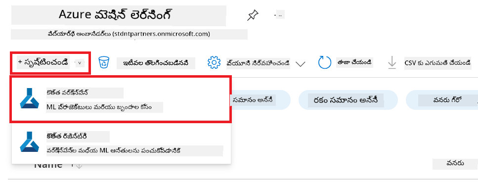
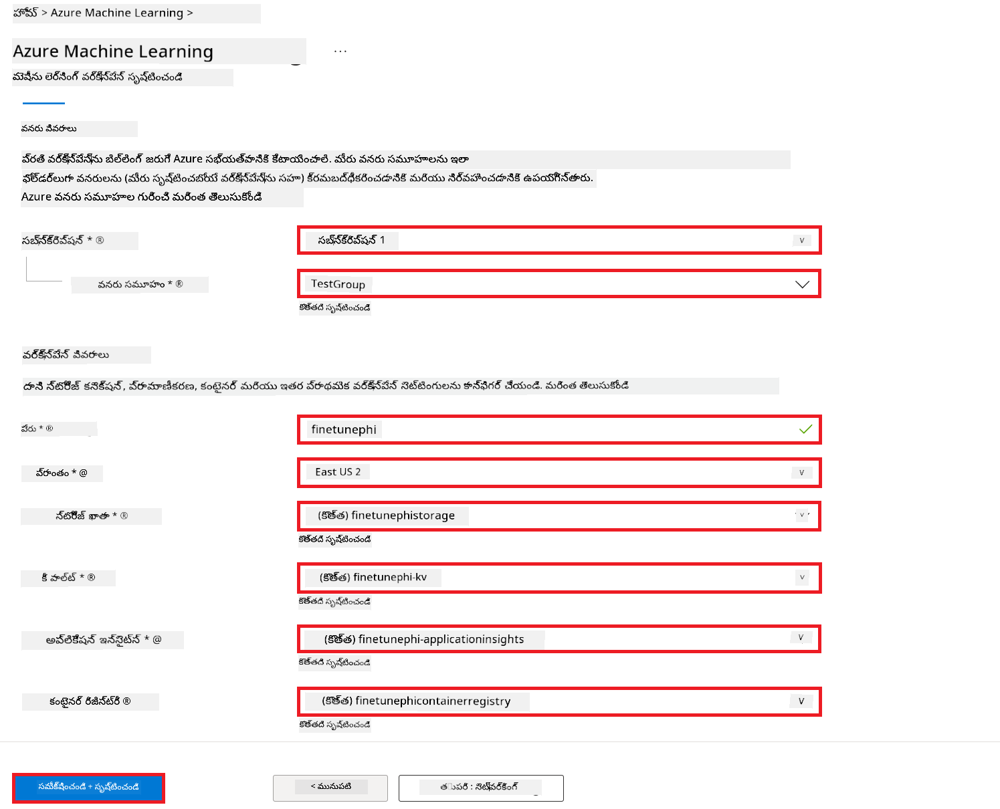
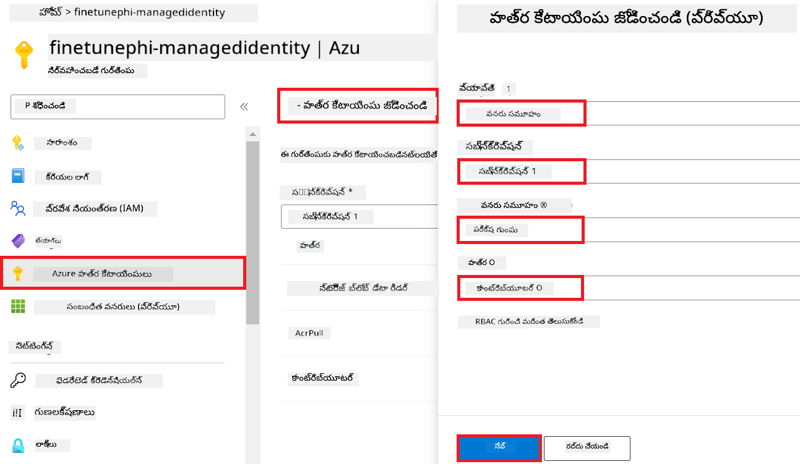
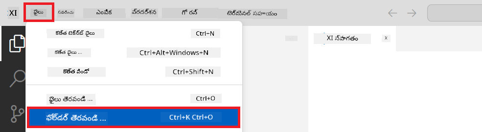
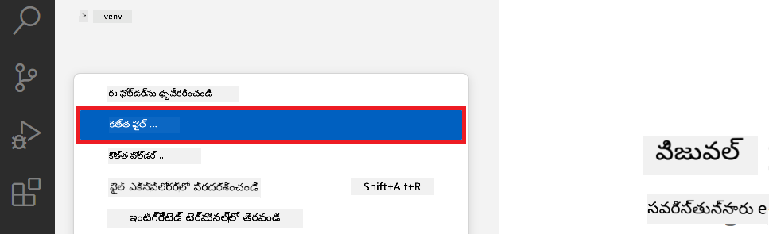
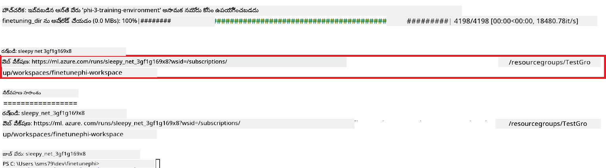
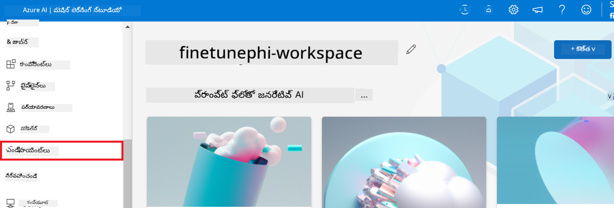
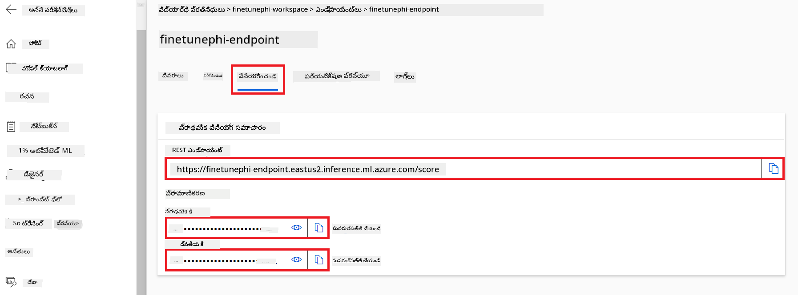
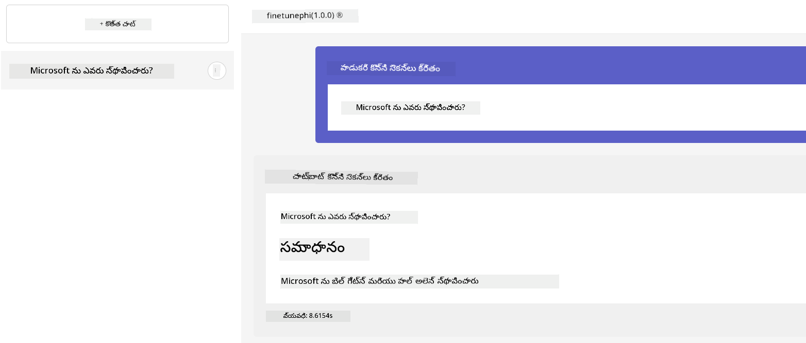

<!--
CO_OP_TRANSLATOR_METADATA:
{
  "original_hash": "455be2b7b9c3390d367d528f8fab2aa0",
  "translation_date": "2025-12-21T20:26:34+00:00",
  "source_file": "md/02.Application/01.TextAndChat/Phi3/E2E_Phi-3-FineTuning_PromptFlow_Integration.md",
  "language_code": "te"
}
-->
# కస్టమ్ Phi-3 మోడల్స్‌ను Prompt flow తో ఫైన్-ట్యూన్ చేయండి మరియు ఇంటిగ్రేట్ చేయండి

This end-to-end (E2E) sample is based on the guide "[Fine-Tune and Integrate Custom Phi-3 Models with Prompt Flow: Step-by-Step Guide](https://techcommunity.microsoft.com/t5/educator-developer-blog/fine-tune-and-integrate-custom-phi-3-models-with-prompt-flow/ba-p/4178612?WT.mc_id=aiml-137032-kinfeylo)" from the Microsoft Tech Community. It introduces the processes of fine-tuning, deploying, and integrating custom Phi-3 models with Prompt flow.

## అవలోకనం

In this E2E sample, you will learn how to fine-tune the Phi-3 model and integrate it with Prompt flow. By leveraging Azure Machine Learning, and Prompt flow you will establish a workflow for deploying and utilizing custom AI models. This E2E sample is divided into three scenarios:

**Scenario 1: Set up Azure resources and Prepare for fine-tuning**

**Scenario 2: Fine-tune the Phi-3 model and Deploy in Azure Machine Learning Studio**

**Scenario 3: Integrate with Prompt flow and Chat with your custom model**

Here is an overview of this E2E sample.


### విషయంలో సూచిక

1. **[సన్నివేశం 1: Azure వనరులను సెట్ చేయడం మరియు ఫైన్-ట్యూనింగ్ కు సిద్ధం చేసుకోవడం](../../../../../../md/02.Application/01.TextAndChat/Phi3)**
    - [Azure Machine Learning Workspace రూపొందించండి](../../../../../../md/02.Application/01.TextAndChat/Phi3)
    - [Azure సబ్‌స్క్రిప్షన్‌లో GPU కొటా అభ్యర్థించండి](../../../../../../md/02.Application/01.TextAndChat/Phi3)
    - [రోల్ అప్పాయింట్ చేయండి](../../../../../../md/02.Application/01.TextAndChat/Phi3)
    - [ప్రాజెక్ట్ సెట్ చేయండి](../../../../../../md/02.Application/01.TextAndChat/Phi3)
    - [ఫైన్-ట్యూనింగ్ కోసం డేటాసెట్ సిద్ధం చేయండి](../../../../../../md/02.Application/01.TextAndChat/Phi3)

1. **[సన్నివేశం 2: Phi-3 మోడల్‌ను ఫైన్-ట్యూన్ చేసి Azure Machine Learning Studioలో డిప్లాయ్ చేయండి](../../../../../../md/02.Application/01.TextAndChat/Phi3)**
    - [Azure CLI సెట్ చేయండి](../../../../../../md/02.Application/01.TextAndChat/Phi3)
    - [Phi-3 మోడల్‌ను ఫైన్-ట్యూన్ చేయండి](../../../../../../md/02.Application/01.TextAndChat/Phi3)
    - [ఫైన్-ట్యూన్ చేసిన మోడల్‌ను డిప్లాయ్ చేయండి](../../../../../../md/02.Application/01.TextAndChat/Phi3)

1. **[సన్నివేశం 3: Prompt flow తో ఇంటిగ్రేట్ చేసి మీ కస్టమ్ మోడల్‌తో చాట్ చేయండి](../../../../../../md/02.Application/01.TextAndChat/Phi3)**
    - [కస్టమ్ Phi-3 మోడల్‌ను Prompt flow తో ఇంటిగ్రేట్ చేయండి](../../../../../../md/02.Application/01.TextAndChat/Phi3)
    - [మీ కస్టమ్ మోడల్‌తో చాట్ చేయండి](../../../../../../md/02.Application/01.TextAndChat/Phi3)

## సన్నివేశం 1: Azure వనరులను సెట్ చేయడం మరియు ఫైన్-ట్యూనింగ్ కు సిద్ధం చేసుకోవడం

### Azure Machine Learning Workspace రూపొందించండి

1. పోర్టల్ పేజీపై ఉన్న **శోధన బార్**లో *azure machine learning* టైప్ చేసి కనిపించే ఎంపికల నుండి **Azure Machine Learning** ను ఎంచుకోండి.

    

1. నావిగేషన్ మెనూలోని **+ Create** ను ఎంచుకోండి.

1. నావిగేషన్ మెనూలోని **New workspace** ను ఎంచుకోండి.

    

1. క్రింద ఇచ్చిన పనులను చేయండి:

    - మీ Azure **Subscription** ను ఎంచుకోండి.
    - ఉపయోగించడానికి కావలసిన **Resource group** ను ఎంచుకోండి (తీసుకోనని జరిగినా కొత్తది సృష్టించండి).
    - **Workspace Name** ను నమోదు చేయండి. ఇది ప్రత్యేకమైన విలువ కావాలి.
    - మీరు ఉపయోగించదలచిన **Region** ను ఎంచుకోండి.
    - ఉపయోగించడానికి కావలసిన **Storage account** ను ఎంచుకోండి (తీసుకోనని జరిగినా కొత్తది సృష్టించండి).
    - ఉపయోగించడానికి కావలసిన **Key vault** ను ఎంచుకోండి (తీసుకోనని జరిగినా కొత్తది సృష్టించండి).
    - ఉపయోగించడానికి కావలసిన **Application insights** ను ఎంచుకోండి (తీసుకోనని జరిగినా కొత్తది సృష్టించండి).
    - ఉపయోగించడానికి కావలసిన **Container registry** ను ఎంచుకోండి (తీసుకోనని జరిగినా కొత్తది సృష్టించండి).

    

1. **Review + Create** ను ఎంచుకోండి.

1. **Create** ను ఎంచుకోండి.

### Azure సబ్‌స్క్రిప్షన్‌లో GPU కొటా అభ్యర్థించండి

ఈ E2E ఉదాహరణలో, ఫైన్-ట్యూనింగ్ కోసం మీరు *Standard_NC24ads_A100_v4 GPU* ని ఉపయోగిస్తారు, దీనికి కొటా అభ్యర్థన అవసరం ఉంటుంది, మరియు డిప్లాయ్‌మెంట్ కోసం *Standard_E4s_v3* CPU ఉపయోగిస్తారు, దానికి కొటా అభ్యర్థన అవసరం లేదు.

> [!NOTE]
>
> మాత్రమే Pay-As-You-Go సబ్‌స్క్రిప్షన్లు (సాధారణ సబ్‌స్క్రిప్షన్ రకం) GPU కేటాయింపుకు అర్హత సాధిస్తాయి; బెనిఫిట్ సబ్‌స్క్రిప్షన్లు ప్రస్తుతం మద్దతు పొందడం లేదు.
>
> Visual Studio Enterprise Subscription వంటి బెనిఫిట్ సబ్‌స్క్రిప్షన్లను ఉపయోగిస్తున్నవారు లేదా ఫైన్-ట్యూనింగ్ మరియు డిప్లాయ్‌మెంట్ ప్రక్రియను త్వరగా పరీక్షించుకోవాలనుకునే వారికోసం, ఈ ట్యూటోరియల్ CPU ఉపయోగించి చిన్న డేటాసెట్‌తో ఫైన్-ట్యూనింగ్ చేయడానికైన సూచనలను కూడా అందిస్తుంది. అయితే, పెద్ద డేటాసెట్‌లతో GPU ఉపయోగించడం ఫైన్-ట్యూనింగ్ ఫలితాలను గణనీయంగా మెరుగ్గా చేస్తుంది.

1. [Azure ML Studio](https://ml.azure.com/home?wt.mc_id=studentamb_279723) ను సందర్శించండి.

1. *Standard NCADSA100v4 Family* కొటాకు అభ్యర్థించడానికి క్రింద ఇచ్చిన పనులను చేయండి:

    - ఎడమ త్రైపు ట్యాబ్ నుండి **Quota** ను ఎంచుకోండి.
    - ఉపయోగించవలసిన **Virtual machine family**ను ఎంచుకోండి. ఉదాహరణకు, *Standard NCADSA100v4 Family Cluster Dedicated vCPUs* ను ఎంచుకోండి, ఇది *Standard_NC24ads_A100_v4* GPU ని కలిగి ఉంటుంది.
    - నావిగేషన్ మెనూనుండి **Request quota** ని ఎంచుకోండి.

        

    - Request quota పేజీలో, మీరు ఉపయోగించదలిచిన **New cores limit** ను నమోదు చేయండి. ఉదాహరణకు, 24.
    - Request quota పేజీలో, GPU కొటా అభ్యర్థించడానికి **Submit** ను ఎంచుకోండి.

> [!NOTE]
> మీరు మీ అవసరాలకు అనుగుణంగా సరైన GPU లేదా CPUని ఎంచుకోవచ్చు, దానికి సంబంధించి [Azureలో వర్చువల్ మెషీన్ల పరిమాణాలు](https://learn.microsoft.com/azure/virtual-machines/sizes/overview?tabs=breakdownseries%2Cgeneralsizelist%2Ccomputesizelist%2Cmemorysizelist%2Cstoragesizelist%2Cgpusizelist%2Cfpgasizelist%2Chpcsizelist) డాక్యుమెంట్‌ను సూచించవచ్చు.

### రోల్ అప్పాయింట్ చేయండి

మీ మోడల్స్‌ను ఫైన్-ట్యూన్ చేసి డిప్లాయ్ చేయడానికి, ముందుగా మీరు User Assigned Managed Identity (UAI) ను సృష్టించి దానికి తగిన అనుమతులను అప్పాయింట్ చేయాలి. డిప్లాయ్‌మెంట్ సమయంలో ఆ UAI గుర్తింపుకు ఉపయోగించబడుతుంది

#### User Assigned Managed Identity (UAI) సృష్టించండి

1. పోర్టల్ పేజీపై ఉన్న **శోధన బార్**లో *managed identities* టైప్ చేసి కనిపించే ఎంపికల నుండి **Managed Identities** ను ఎంచుకోండి.

    

1. **+ Create** ను ఎంచుకోండి.

    

1. క్రింద ఇచ్చిన పనులను చేయండి:

    - మీ Azure **Subscription** ను ఎంచుకోండి.
    - ఉపయోగించడానికి కావలసిన **Resource group** ను ఎంచుకోండి (తీసుకోనని జరిగినా కొత్తది సృష్టించండి).
    - మీరు ఉపయోగించదలచిన **Region** ను ఎంచుకోండి.
    - **Name** ను నమోదు చేయండి. ఇది ప్రత్యేకమైన విలువ కావాలి.

1. **Review + create** ను ఎంచుకోండి.

1. **+ Create** ను ఎంచుకోండి.

#### Managed Identityకి Contributor రోల్ అప్పాయింట్ చేయండి

1. మీరు సృష్టించిన Managed Identity రిసోర్స్కు నావిగేట్ చేయండి.

1. ఎడమ త్రైపు ట్యాబ్ నుండి **Azure role assignments** ను ఎంచుకోండి.

1. నావిగేషన్ మెనూలోని **+Add role assignment** ను ఎంచుకోండి.

1. Add role assignment పేజీలో, క్రింద ఇచ్చిన పనులను చేయండి:
    - **Scope** ను **Resource group** గా ఎంచుకోండి.
    - మీ Azure **Subscription** ను ఎంచుకోండి.
    - ఉపయోగించవలసిన **Resource group** ను ఎంచుకోండి.
    - **Role** గా **Contributor** ను ఎంచుకోండి.

    

1. **Save** ను ఎంచుకోండి.

#### Managed Identityకి Storage Blob Data Reader రోల్ అప్పాయింట్ చేయండి

1. పోర్టల్ పేజీపై ఉన్న **శోధన బార్**లో *storage accounts* టైప్ చేసి కనిపించే ఎంపికల నుండి **Storage accounts** ను ఎంచుకోండి.

    

1. మీరు సృష్టించిన Azure Machine Learning workspaceకి సంబంధించి ఉన్న storage account ను ఎంచుకోండి. ఉదాహరణకు, *finetunephistorage*.

1. Add role assignment పేజీకి నావిగేట్ చేయడానికి క్రింది పనులను చేయండి:

    - మీరు సృష్టించిన Azure Storage account కి నావిగేట్ చేయండి.
    - ఎడమ త్రైపు ట్యాబ్ నుండి **Access Control (IAM)** ను ఎంచుకోండి.
    - నావిగేషన్ మెనూలోని **+ Add** ను ఎంచుకోండి.
    - నావిగేషన్ మెనూలోని **Add role assignment** ను ఎంచుకోండి.

    

1. Add role assignment పేజీలో, క్రింద ఇచ్చిన పనులను చేయండి:

    - Role పేజీలో, **search bar** లో *Storage Blob Data Reader* టైప్ చేసి కనిపించే ఎంపికల నుండి **Storage Blob Data Reader** ను ఎంచుకోండి.
    - Role పేజీలో, **Next** ను ఎంచుకోండి.
    - Members పేజీలో, **Assign access to** గా **Managed identity** ను ఎంచుకోండి.
    - Members పేజీలో, **+ Select members** ను ఎంచుకోండి.
    - Select managed identities పేజీలో, మీ Azure **Subscription** 을 ఎంచుకోండి.
    - Select managed identities పేజీలో, **Managed identity** కు **Manage Identity** ను ఎంచుకోండి.
    - Select managed identities పేజీలో, మీరు సృష్టించిన Manage Identity ను ఎంచుకోండి. ఉదాహరణకు, *finetunephi-managedidentity*.
    - Select managed identities పేజీలో, **Select** ను ఎంచుకోండి.

    

1. **Review + assign** ను ఎంచుకోండి.

#### Managed Identityకి AcrPull రోల్ అప్పాయింట్ చేయండి

1. పోర్టల్ పేజీపై ఉన్న **శోధన బార్**లో *container registries* టైప్ చేసి కనిపించే ఎంపికల నుండి **Container registries** ను ఎంచుకోండి.

    

1. Azure Machine Learning workspaceకి సంబంధించిన container registry ను ఎంచుకోండి. ఉదాహరణకు, *finetunephicontainerregistries*

1. Add role assignment పేజీకి నావిగేట్ చేయడానికి క్రింది పనులను చేయండి:

    - ఎడమ త్రైపు ట్యాబ్ నుండి **Access Control (IAM)** ను ఎంచుకోండి.
    - నావిగేషన్ మెనూలోని **+ Add** ను ఎంచుకోండి.
    - నావిగేషన్ మెనూలోని **Add role assignment** ను ఎంచుకోండి.

1. Add role assignment పేజీలో, క్రింద ఇచ్చిన పనులను చేయండి:

    - Role పేజీలో, **search bar** లో *AcrPull* టైప్ చేసి కనిపించే ఎంపికల నుండి **AcrPull** ను ఎంచుకోండి.
    - Role పేజీలో, **Next** ను ఎంచుకోండి.
    - Members పేజీలో, **Assign access to** గా **Managed identity** ను ఎంచుకోండి.
    - Members పేజీలో, **+ Select members** ను ఎంచుకోండి.
    - Select managed identities పేజీలో, మీ Azure **Subscription** ను ఎంచుకోండి.
    - Select managed identities పేజీలో, **Managed identity** కు **Manage Identity** ను ఎంచుకోండి.
    - Select managed identities పేజీలో, మీరు సృష్టించిన Manage Identity ను ఎంచుకోండి. ఉదాహరణకు, *finetunephi-managedidentity*.
    - Select managed identities పేజీలో, **Select** ను ఎంచుకోండి.
    - **Review + assign** ను ఎంచుకోండి.

### ప్రాజెక్ట్ సెట్ చేయండి

ఇప్పుడు, మీరు పని చేయడానికి ఒక ఫోల్డర్‌ను సృష్టించబోతున్నారు మరియు వినియోగదారులతో పరస్పర చర్య చేసే, మరియు Azure Cosmos DBలో నిల్వ చేయబడిన చాట్ ఇంకార నిర్వహణను ఉపయోగించే ప్రోగ్రామ్‌ను అభివృద్ధి చేయడానికి ఒక వర్చువల్ ఎన్‌విరాన్‌మెంట్‌ను సెట్ చేయబోతున్నారు.

#### పని చేయడానికి ఒక ఫోల్డర్ సృష్టించండి

1. టెర్మినల్ విండో ఓపెన్ చేసి డిఫాల్ట్ పాత్‌లో *finetune-phi* అనే పేరుతో ఒక ఫోల్డర్ సృష్టించడానికి ఈ క్రింది క‌మాండ్ టైప్ చేయండి.

    ```console
    mkdir finetune-phi
    ```

1. మీరు సృష్టించిన *finetune-phi* ఫోల్డర్‌కు నావిగేట్ చేయడానికి మీ టెర్మినల్‌లో క్రింది క‌మాండ్‌ను టైప్ చేయండి.

    ```console
    cd finetune-phi
    ```

#### వర్చువల్ ఎన్‌విరాన్‌మెంట్ సృష్టించండి

1. .venv అనే పేరుతో వర్చువల్ ఎన్‌విరాన్‌మెంట్ సృష్టించడానికి మీ టెర్మినల్‌లో క్రింది క‌మాండ్‌ను టైప్ చేయండి.

    ```console
    python -m venv .venv
    ```

1. వర్చువల్ ఎన్‌విరాన్‌మెంట్‌ను యాక్టివేట్ చేయడానికి మీ టెర్మినల్‌లో క్రింది క‌మాండ్‌ను టైప్ చేయండి.

    ```console
    .venv\Scripts\activate.bat
    ```

> [!NOTE]
>
> సరైనగా జరిగితే, మీరు కమాండ్ ప్రాంప్ట్ ముందు *(.venv)* కనిపిస్తుందని చూడగలరు.

#### అవసరమైన ప్యాకేజీలు ఇన్‌స్టాల్ చేయండి

1. అవసరమైన ప్యాకేజీలను ఇన్స్టాల్ చేసేందుకు మీ టెర్మినల్‌లో క్రింది కమాండ్లను టైప్ చేయండి.

    ```console
    pip install datasets==2.19.1
    pip install transformers==4.41.1
    pip install azure-ai-ml==1.16.0
    pip install torch==2.3.1
    pip install trl==0.9.4
    pip install promptflow==1.12.0
    ```

#### ప్రాజెక్ట్ ఫైళ్లను సృష్టించండి
In this వ్యాయామంలో, మీరు మా ప్రాజెక్ట్ కోసం అవసరమైన ఫైళ్లను సృష్టించబోతున్నారు. ఈ ఫైళ్ల్లో డేటాసెట్‌ను డౌన్లోడ్ చేయడం, Azure Machine Learning వాతావరణాన్ని సెటప్ చేయడం, Phi-3 మోడల్‌ను ఫైన్‑ట్యూన్ చేయడం మరియు ఫైన్‑ట్యూన్ చేయబడిన మోడల్‌ను డిప్లాయ్ చేయడానికి అవసరమైన స్క్రిప్టులు ఉంటాయి. మీరు ఫైన్‑ట్యూనింగ్ వాతావరణాన్ని సెటప్ చేయడానికి ఒక *conda.yml* ఫైల్‌ను కూడా సృష్టిస్తారు.

In this exercise, you will:

- డేటాసెట్‌ను డౌన్లోడ్ చేయడానికి *download_dataset.py* ఫైల్‌ను సృష్టించండి.
- Azure Machine Learning వాతావరణాన్ని సెటప్ చేయడానికి *setup_ml.py* ఫైల్‌ను సృష్టించండి.
- డేటాసెట్‌ను ఉపయోగించి Phi-3 మోడల్‌ను ఫైన్‑ట్యూన్ చేయడానికి *finetuning_dir* ఫోల్డర్‌లో *fine_tune.py* ఫైల్‌ను సృష్టించండి.
- ఫైన్‑ట్యూనింగ్ వాతావరణాన్ని సెటప్ చేయటానికి *conda.yml* ఫైల్‌ను సృష్టించండి.
- ఫైన్‑ట్యూన్ చేయబడ్డ మోడల్‌ను డిప్లాయ్ చేయడానికి *deploy_model.py* ఫైల్‌ను సృష్టించండి.
- ఫైన్‑ట్యూన్ చేయబడ్డ మోడల్‌ను Prompt flow తో統合 చేయడానికి మరియు మోడల్‌ను Prompt flow ద్వారా అమలు చేయడానికి *integrate_with_promptflow.py* ఫైల్‌ను సృష్టించండి.
- Prompt flow కోసం వర్క్‌ఫ్లో నిర్మాణాన్ని సెటప్ చేయడానికి flow.dag.yml ఫైల్‌ను సృష్టించండి.
- Azure సమాచారం నమోదు చేయడానికి *config.py* ఫైల్‌ను సృష్టించండి.

> [!NOTE]
>
> సంపూర్ణ ఫోల్డర్ నిర్మాణం:
>
> ```text
> └── YourUserName
> .    └── finetune-phi
> .        ├── finetuning_dir
> .        │      └── fine_tune.py
> .        ├── conda.yml
> .        ├── config.py
> .        ├── deploy_model.py
> .        ├── download_dataset.py
> .        ├── flow.dag.yml
> .        ├── integrate_with_promptflow.py
> .        └── setup_ml.py
> ```

1. **Visual Studio Code** ను తెరవండి.

1. మెను బార్ నుంచి **File** ను ఎంచుకోండి.

1. **Open Folder** ను ఎంచుకోండి.

1. మీరు సృష్టించిన *finetune-phi* ఫోల్డర్‌ను ఎంచుకోండి, ఇది *C:\Users\yourUserName\finetune-phi* వద్ద ఉంది.

    

1. Visual Studio Code యొక్క ఎడమ ప్యాన్‌లో రైట్‑క్లిక్ చేసి **New File** ఎంచుకుని *download_dataset.py* নামে ఒక కొత్త ఫైల్ సృష్టించండి.

1. Visual Studio Code యొక్క ఎడమ ప్యాన్‌లో రైట్‑క్లిక్ చేసి **New File** ఎంచుకుని *setup_ml.py* নামে ఒక కొత్త ఫైల్ సృష్టించండి.

1. Visual Studio Code యొక్క ఎడమ ప్యాన్‌లో రైట్‑క్లిక్ చేసి **New File** ఎంచుకుని *deploy_model.py* అనే కొత్త ఫైల్ సృష్టించండి.

    

1. Visual Studio Code యొక్క ఎడమ ప్యాన్‌లో రైట్‑క్లిక్ చేసి **New Folder** ఎంచుకుని *finetuning_dir* అనే కొత్త ఫోల్డర్ సృష్టించండి.

1. *finetuning_dir* ఫోల్డర్‌లో *fine_tune.py* అనే కొత్త ఫైల్‌ని సృష్టించండి.

#### Create and Configure *conda.yml* file

1. Visual Studio Code యొక్క ఎడమ ప్యాన్‌లో రైట్‑క్లిక్ చేసి **New File** ఎంచుకుని *conda.yml* అనే ఫైల్‌ను సృష్టించండి.

1. Phi-3 మోడల్ కోసం ఫైన్‑ట్యూనింగ్ వాతావరణాన్ని సెటప్ చేయడానికి *conda.yml* ఫైల్‌లో క్రింది కోడ్‌ను జోడించండి.

    ```yml
    name: phi-3-training-env
    channels:
      - defaults
      - conda-forge
    dependencies:
      - python=3.10
      - pip
      - numpy<2.0
      - pip:
          - torch==2.4.0
          - torchvision==0.19.0
          - trl==0.8.6
          - transformers==4.41
          - datasets==2.21.0
          - azureml-core==1.57.0
          - azure-storage-blob==12.19.0
          - azure-ai-ml==1.16
          - azure-identity==1.17.1
          - accelerate==0.33.0
          - mlflow==2.15.1
          - azureml-mlflow==1.57.0
    ```

#### Create and Configure *config.py* file

1. Visual Studio Code యొక్క ఎడమ ప్యాన్‌లో రైట్‑క్లిక్ చేసి **New File** ఎంచుకుని *config.py* అనే ఫైల్‌ను సృష్టించండి.

1. మీ Azure సమాచారం చేర్చడానికి *config.py* ఫైల్‌లో క్రింది కోడ్‌ను జోడించండి.

    ```python
    # Azure సెట్టింగులు
    AZURE_SUBSCRIPTION_ID = "your_subscription_id"
    AZURE_RESOURCE_GROUP_NAME = "your_resource_group_name" # "TestGroup"

    # Azure మెషీన్ లెర్నింగ్ సెట్టింగులు
    AZURE_ML_WORKSPACE_NAME = "your_workspace_name" # "finetunephi-workspace"

    # Azure నిర్వహించబడే ఐడెంటిటీ సెట్టింగులు
    AZURE_MANAGED_IDENTITY_CLIENT_ID = "your_azure_managed_identity_client_id"
    AZURE_MANAGED_IDENTITY_NAME = "your_azure_managed_identity_name" # "finetunephi-mangedidentity"
    AZURE_MANAGED_IDENTITY_RESOURCE_ID = f"/subscriptions/{AZURE_SUBSCRIPTION_ID}/resourceGroups/{AZURE_RESOURCE_GROUP_NAME}/providers/Microsoft.ManagedIdentity/userAssignedIdentities/{AZURE_MANAGED_IDENTITY_NAME}"

    # డేటాసెట్ ఫైల్ మార్గాలు
    TRAIN_DATA_PATH = "data/train_data.jsonl"
    TEST_DATA_PATH = "data/test_data.jsonl"

    # ఫైన్-ట్యూన్ చేసిన మోడల్ సెట్టింగులు
    AZURE_MODEL_NAME = "your_fine_tuned_model_name" # "finetune-phi-model"
    AZURE_ENDPOINT_NAME = "your_fine_tuned_model_endpoint_name" # "finetune-phi-endpoint"
    AZURE_DEPLOYMENT_NAME = "your_fine_tuned_model_deployment_name" # "finetune-phi-deployment"

    AZURE_ML_API_KEY = "your_fine_tuned_model_api_key"
    AZURE_ML_ENDPOINT = "your_fine_tuned_model_endpoint_uri" # "https://{your-endpoint-name}.{your-region}.inference.ml.azure.com/score"
    ```

#### Add Azure environment variables

1. Azure Subscription IDను జోడించడానికి ఈ క్రింది పనుల్ని చేయండి:

    - పోర్టల్ పేజీ టాప్‌లోని **search bar** లో *subscriptions* టైప్ చేసి కనిపించే ఎంపికల నుంచి **Subscriptions** ను ఎంచుకోండి.
    - మీరు ప్రస్తుతం ఉపయోగిస్తున్న Azure Subscription ను ఎంచుకోండి.
    - మీ Subscription IDను కాపీ చేసి *config.py* ఫైల్‌లో పె pasted చేయండి.

    

1. Azure Workspace Nameను జోడించడానికి ఈ క్రింది పనుల్ని చేయండి:

    - మీరు సృష్టించిన Azure Machine Learning రిసోర్స్‌కి నావిగేట్ చేయండి.
    - మీ ఖాతా పేరు ను *config.py* ఫైల్‌లో కాపీ చేసి పేస్ట్ చేయండి.

    

1. Azure Resource Group Nameను జోడించడానికి ఈ క్రింది పనుల్ని చేయండి:

    - మీరు సృష్టించిన Azure Machine Learning రిసోర్స్‌కి నావిగేట్ చేయండి.
    - మీ Azure Resource Group Name ను *config.py* ఫైల్‌లో కాపీ చేసి పేస్ట్ చేయండి.

    

2. Azure Managed Identity పేరును జోడించడానికి ఈ క్రింది పనుల్ని చేయండి:

    - మీరు సృష్టించిన Managed Identities రిసోర్స్‌లోకి నావిగేట్ చేయండి.
    - మీ Azure Managed Identity పేరును *config.py* ఫైల్‌లో కాపీ చేసి పేస్ట్ చేయండి.

    

### Prepare dataset for fine-tuning

ఈ వ్యాయామంలో, మీరు *download_dataset.py* ఫైల్‌ను రన్ చేసి *ULTRACHAT_200k* datasets ని మీ లోకల్ వాతావరణానికి డౌన్లోడ్ చేస్తారు. తరువాత ఈ datasets ను Azure Machine Learning లో Phi-3 మోడల్‌ను ఫైన్‑ట్యూన్ చేయడానికి ఉపయోగిస్తారు.

#### Download your dataset using *download_dataset.py*

1. Visual Studio Code లో *download_dataset.py* ఫైల్‌ను ఓపెన్ చేయండి.

1. *download_dataset.py* లో క్రింది కోడ్‌ను జోడించండి.

    ```python
    import json
    import os
    from datasets import load_dataset
    from config import (
        TRAIN_DATA_PATH,
        TEST_DATA_PATH)

    def load_and_split_dataset(dataset_name, config_name, split_ratio):
        """
        Load and split a dataset.
        """
        # నిర్దిష్టమైన పేరు, కాన్ఫిగరేషన్ మరియు విభజన రేషియోతో డేటాసెట్‌ను లోడ్ చేయండి
        dataset = load_dataset(dataset_name, config_name, split=split_ratio)
        print(f"Original dataset size: {len(dataset)}")
        
        # డేటాసెట్‌ను ట్రైన్ మరియు టెస్ట్ సెట్లుగా విభజించండి (80% ట్రైన్, 20% టెస్ట్)
        split_dataset = dataset.train_test_split(test_size=0.2)
        print(f"Train dataset size: {len(split_dataset['train'])}")
        print(f"Test dataset size: {len(split_dataset['test'])}")
        
        return split_dataset

    def save_dataset_to_jsonl(dataset, filepath):
        """
        Save a dataset to a JSONL file.
        """
        # డైరెక్టరీ లేకపోతే దాన్ని సృష్టించండి
        os.makedirs(os.path.dirname(filepath), exist_ok=True)
        
        # రాయడానికి ఫైల్‌ను తెరవండి
        with open(filepath, 'w', encoding='utf-8') as f:
            # డేటాసెట్‌లోని ప్రతి రికార్డును వరుసగా ప్రాసెస్ చేయండి
            for record in dataset:
                # రికార్డును JSON ఆబ్జెక్ట్‌గా డంప్ చేసి ఫైల్‌కి రాయండి
                json.dump(record, f)
                # రికార్డులను వేరు చేయడానికి ఒక newline అక్షరాన్ని రాయండి
                f.write('\n')
        
        print(f"Dataset saved to {filepath}")

    def main():
        """
        Main function to load, split, and save the dataset.
        """
        # ULTRACHAT_200k డేటాసెట్‌ను నిర్దిష్ట కాన్ఫిగరేషన్ మరియు విభజన రేషియోతో లోడ్ చేసి విభజించండి
        dataset = load_and_split_dataset("HuggingFaceH4/ultrachat_200k", 'default', 'train_sft[:1%]')
        
        # స్ప్లిట్ నుండి ట్రైన్ మరియు టెస్ట్ డేటాసెట్లను తీసుకోండి
        train_dataset = dataset['train']
        test_dataset = dataset['test']

        # ట్రైన్ డేటాసెట్‌ను JSONL ఫైల్‌గా సేవ్ చేయండి
        save_dataset_to_jsonl(train_dataset, TRAIN_DATA_PATH)
        
        # టెస్ట్ డేటాసెట్‌ను వేరే JSONL ఫైల్‌గా సేవ్ చేయండి
        save_dataset_to_jsonl(test_dataset, TEST_DATA_PATH)

    if __name__ == "__main__":
        main()

    ```

> [!TIP]
>
> **CPU ఉపయోగించి తక్కువ డేటాసెట్‌తో ఫైన్‑ట్యూన్ చేయడానికి మార్గదర్శకం**
>
> మీరు ఫైన్‑ట్యూన్ కోసం CPU ఉపయోగించాలని ఉంటే, ఇది Visual Studio Enterprise Subscription వంటి బెనిఫిట్ సబ్స్క్రిప్షన్లు ఉన్నవారికి లేదా ఫైన్‑ట్యూన్ మరియు డిప్లాయ్ ప్రక్రియను త్వరగా పరీక్షించుకోవడానికి సరైన విధానం.
>
> Replace `dataset = load_and_split_dataset("HuggingFaceH4/ultrachat_200k", 'default', 'train_sft[:1%]')` with `dataset = load_and_split_dataset("HuggingFaceH4/ultrachat_200k", 'default', 'train_sft[:10]')`
>

1. టెర్మినల్‌లో క్రింది కమాండ్‌ను టైప్ చేసి స్క్రిప్ట్ను రన్ చేసి డేటాసెట్‌ను మీ లోకల్ వాతావరణానికి డౌన్లోడ్ చేయండి.

    ```console
    python download_data.py
    ```

1. డేటాసెట్లు విజయవంతంగా మీ లోకల్ *finetune-phi/data* డైరెక్టరీకి సేవ్ అయ్యాయో లేదో నిర్ధారించండి.

> [!NOTE]
>
> **డేటాసెట్ పరిమాణం మరియు ఫైన్‑ట్యూనింగ్ సమయంలో**
>
> ఈ E2E నమూనాలో, మీరు dataset యొక్క కేవలం 1% (`train_sft[:1%]`) మాత్రమే ఉపయోగిస్తున్నారు. ఇది డేటా పరిమాణాన్ని తీవ్రముగా తగ్గిస్తుంది, ఎప్పుడూ అప్‌లోడ్ మరియు ఫైన్‑ట్యూనింగ్ ప్రక్రియలను వేగవంతం చేస్తుంది. శిక్షణ సమయం మరియు మోడల్ పనితీరును సమతుల్యం చేయడానికి మీరు శాతం మార్చుకోవచ్చు. తక్కువ సబ్‌సెట్ని ఉపయోగించడం ఫైన్‑ట్యూనింగ్ కోసం అవసరమైన సమయాన్ని తగ్గిస్తుంది, ఇది E2E నమూనా కోసం ప్రక్రియను నిర్వహించడానికి సులభతరం చేస్తుంది.

## Scenario 2: Phi-3 మోడల్‌ను ఫైన్‑ట్యూన్ చేసి Azure Machine Learning Studioలో డిప్లాయ్ చేయడం

### Set up Azure CLI

మీ వాతావరణాన్ని సత్యాపితం చేయడానికి Azure CLI ను సెటప్ చేయాలి. Azure CLI ద్వారా మీరు కమాండ్ లైన్ నుంచి Azure రిసోర్సులను నిర్వహించవచ్చు మరియు Azure Machine Learning కు అవసరమైన క్రెడెన్షియల్స్ అందించబడతాయి. ప్రారంభించడానికి [Azure CLI](https://learn.microsoft.com/cli/azure/install-azure-cli) ఇన్స్టాల్ చేయండి

1. ఒక టెర్మినల్ విండోను ఓపెన్ చేసి Azure ఖాతాలో లాగిన్ అవడానికి క్రింది కమాండ్‌ను టైప్ చేయండి.

    ```console
    az login
    ```

1. మీరు ఉపయోగించవలసిన Azure ఖాతాను ఎంచుకోండి.

1. మీరు ఉపయోగించవలసిన Azure subscription ను ఎంచుకోండి.

    

> [!TIP]
>
> మీరు Azure లో సైన్ ఇన్ చేసేటప్పుడు సమస్యలు ఎదురైనా, డివైస్ కోడ్ ఉపయోగించండి. Azure ఖాతాలో సైన్ ఇన్ కావడానికి టెర్మినల్ విండో ఓపెన్ చేసి క్రింది కమాండ్‌ను టైప్ చేయండి:
>
> ```console
> az login --use-device-code
> ```
>

### Fine-tune the Phi-3 model

ఈ వ్యాయామంలో, మీరు అందించిన డేటాసెట్‌ను ఉపయోగించి Phi-3 మోడల్‌ను ఫైన్‑ట్యూన్ చేయబోతున్నారు. ముందుగా *fine_tune.py* ఫైల్‌లో ఫయిన్‑ట్యూనింగ్ ప్రక్రియను నిర్వచిస్తారు. తరువాత, Azure Machine Learning వాతావరణాన్ని కాన్ఫిగర్ చేసి ఫైన్‑ట్యూనింగ్ ప్రక్రియను ప్రారంభించడానికి *setup_ml.py* ఫైల్‌ను రన్ చేస్తారు. ఈ స్క్రిప్ట్ Azure Machine Learning వాతావరణంలో ఫైన్‑ట్యూనింగ్ జరుగుతుందన్న విషయాన్ని నిర్ధారిస్తుంది.

*setup_ml.py* ను రన్ చేయడం ద్వారా, మీరు Azure Machine Learning వాతావరణంలో ఫైన్‑ట్యూనింగ్ ప్రక్రియను ప్రారంభిస్తారు.

#### Add code to the *fine_tune.py* file

1. *finetuning_dir* ఫోల్డర్‌కు వెళ్లి Visual Studio Code లో *fine_tune.py* ఫైల్‌ను ఓపెన్ చేయండి.

1. *fine_tune.py* లో క్రింది కోడ్‌ను జోడించండి.

    ```python
    import argparse
    import sys
    import logging
    import os
    from datasets import load_dataset
    import torch
    import mlflow
    from transformers import AutoModelForCausalLM, AutoTokenizer, TrainingArguments
    from trl import SFTTrainer

    # MLflow లో INVALID_PARAMETER_VALUE లోపాన్ని నివారించడానికి, MLflow ఇంటిగ్రేషన్‌ను నిలిపివేయండి
    os.environ["DISABLE_MLFLOW_INTEGRATION"] = "True"

    # లాగింగ్ సెటప్
    logging.basicConfig(
        format="%(asctime)s - %(levelname)s - %(name)s - %(message)s",
        datefmt="%Y-%m-%d %H:%M:%S",
        handlers=[logging.StreamHandler(sys.stdout)],
        level=logging.WARNING
    )
    logger = logging.getLogger(__name__)

    def initialize_model_and_tokenizer(model_name, model_kwargs):
        """
        Initialize the model and tokenizer with the given pretrained model name and arguments.
        """
        model = AutoModelForCausalLM.from_pretrained(model_name, **model_kwargs)
        tokenizer = AutoTokenizer.from_pretrained(model_name)
        tokenizer.model_max_length = 2048
        tokenizer.pad_token = tokenizer.unk_token
        tokenizer.pad_token_id = tokenizer.convert_tokens_to_ids(tokenizer.pad_token)
        tokenizer.padding_side = 'right'
        return model, tokenizer

    def apply_chat_template(example, tokenizer):
        """
        Apply a chat template to tokenize messages in the example.
        """
        messages = example["messages"]
        if messages[0]["role"] != "system":
            messages.insert(0, {"role": "system", "content": ""})
        example["text"] = tokenizer.apply_chat_template(
            messages, tokenize=False, add_generation_prompt=False
        )
        return example

    def load_and_preprocess_data(train_filepath, test_filepath, tokenizer):
        """
        Load and preprocess the dataset.
        """
        train_dataset = load_dataset('json', data_files=train_filepath, split='train')
        test_dataset = load_dataset('json', data_files=test_filepath, split='train')
        column_names = list(train_dataset.features)

        train_dataset = train_dataset.map(
            apply_chat_template,
            fn_kwargs={"tokenizer": tokenizer},
            num_proc=10,
            remove_columns=column_names,
            desc="Applying chat template to train dataset",
        )

        test_dataset = test_dataset.map(
            apply_chat_template,
            fn_kwargs={"tokenizer": tokenizer},
            num_proc=10,
            remove_columns=column_names,
            desc="Applying chat template to test dataset",
        )

        return train_dataset, test_dataset

    def train_and_evaluate_model(train_dataset, test_dataset, model, tokenizer, output_dir):
        """
        Train and evaluate the model.
        """
        training_args = TrainingArguments(
            bf16=True,
            do_eval=True,
            output_dir=output_dir,
            eval_strategy="epoch",
            learning_rate=5.0e-06,
            logging_steps=20,
            lr_scheduler_type="cosine",
            num_train_epochs=3,
            overwrite_output_dir=True,
            per_device_eval_batch_size=4,
            per_device_train_batch_size=4,
            remove_unused_columns=True,
            save_steps=500,
            seed=0,
            gradient_checkpointing=True,
            gradient_accumulation_steps=1,
            warmup_ratio=0.2,
        )

        trainer = SFTTrainer(
            model=model,
            args=training_args,
            train_dataset=train_dataset,
            eval_dataset=test_dataset,
            max_seq_length=2048,
            dataset_text_field="text",
            tokenizer=tokenizer,
            packing=True
        )

        train_result = trainer.train()
        trainer.log_metrics("train", train_result.metrics)

        mlflow.transformers.log_model(
            transformers_model={"model": trainer.model, "tokenizer": tokenizer},
            artifact_path=output_dir,
        )

        tokenizer.padding_side = 'left'
        eval_metrics = trainer.evaluate()
        eval_metrics["eval_samples"] = len(test_dataset)
        trainer.log_metrics("eval", eval_metrics)

    def main(train_file, eval_file, model_output_dir):
        """
        Main function to fine-tune the model.
        """
        model_kwargs = {
            "use_cache": False,
            "trust_remote_code": True,
            "torch_dtype": torch.bfloat16,
            "device_map": None,
            "attn_implementation": "eager"
        }

        # pretrained_model_name = "microsoft/Phi-3-mini-4k-instruct"
        pretrained_model_name = "microsoft/Phi-3.5-mini-instruct"

        with mlflow.start_run():
            model, tokenizer = initialize_model_and_tokenizer(pretrained_model_name, model_kwargs)
            train_dataset, test_dataset = load_and_preprocess_data(train_file, eval_file, tokenizer)
            train_and_evaluate_model(train_dataset, test_dataset, model, tokenizer, model_output_dir)

    if __name__ == "__main__":
        parser = argparse.ArgumentParser()
        parser.add_argument("--train-file", type=str, required=True, help="Path to the training data")
        parser.add_argument("--eval-file", type=str, required=True, help="Path to the evaluation data")
        parser.add_argument("--model_output_dir", type=str, required=True, help="Directory to save the fine-tuned model")
        args = parser.parse_args()
        main(args.train_file, args.eval_file, args.model_output_dir)

    ```

1. *fine_tune.py* ఫైల్‌ను సేవ్ చేసి మూసివేయండి.

> [!TIP]
> **మీరు Phi-3.5 మోడల్‌ను కూడా ఫైన్‑ట్యూన్ చేయవచ్చు**
>
> *fine_tune.py* ఫైల్‌లో, మీరు `pretrained_model_name`ను `"microsoft/Phi-3-mini-4k-instruct"` నుండి మీకు కావలసిన మోడల్ పేరు కాపీ చేసి పెట్టడానికి మార్చవచ్చు. ఉదాహరణకు, మీరు దీన్నను `"microsoft/Phi-3.5-mini-instruct"` గా మార్చితే, మీరు Phi-3.5-mini-instruct మోడల్‌తో ఫైన్‑ట్యూన్ చేస్తున్నట్లు ఉంటుంది. మీరు కోరుకునే మోడల్ పేరు కోసం [Hugging Face](https://huggingface.co/) ను సందర్శించి మీకు కావలసిన మోడల్‌ను వెతకండి, ఆ తర్వాత దాని పేరు సరైన ఫార్మాట్‌లో `pretrained_model_name` ఫీల్డ్‌లో పేస్ట్ చేయండి.
>
> :::image type="content" source="../../imgs/03/FineTuning-PromptFlow/finetunephi3.5.png" alt-text="Phi-3.5 ను ఫైన్‑ట్యూన్ చేయండి.":::
>

#### Add code to the *setup_ml.py* file

1. Visual Studio Code లో *setup_ml.py* ఫైల్‌ను ఓపెన్ చేయండి.

1. *setup_ml.py* లో క్రింది కోడ్‌ను జోడించండి.

    ```python
    import logging
    from azure.ai.ml import MLClient, command, Input
    from azure.ai.ml.entities import Environment, AmlCompute
    from azure.identity import AzureCliCredential
    from config import (
        AZURE_SUBSCRIPTION_ID,
        AZURE_RESOURCE_GROUP_NAME,
        AZURE_ML_WORKSPACE_NAME,
        TRAIN_DATA_PATH,
        TEST_DATA_PATH
    )

    # స్థిర విలువలు

    # శిక్షణకు CPU ఇన్‌స్టాన్స్ ఉపయోగించాలంటే క్రింది లైన్లపై ఉన్న వ్యాఖ్యలను తీసివేయండి
    # COMPUTE_INSTANCE_TYPE = "Standard_E16s_v3" # CPU
    # COMPUTE_NAME = "cpu-e16s-v3"
    # DOCKER_IMAGE_NAME = "mcr.microsoft.com/azureml/openmpi4.1.0-ubuntu20.04:latest"

    # శిక్షణకు GPU ఇన్‌స్టాన్స్ ఉపయోగించాలంటే క్రింది లైన్లపై ఉన్న వ్యాఖ్యలను తీసివేయండి
    COMPUTE_INSTANCE_TYPE = "Standard_NC24ads_A100_v4"
    COMPUTE_NAME = "gpu-nc24s-a100-v4"
    DOCKER_IMAGE_NAME = "mcr.microsoft.com/azureml/curated/acft-hf-nlp-gpu:59"

    CONDA_FILE = "conda.yml"
    LOCATION = "eastus2" # మీ కంప్యూట్ క్లస్టర్ యొక్క స్థలంతో మార్చండి
    FINETUNING_DIR = "./finetuning_dir" # ఫైన్-ట్యూనింగ్ స్క్రిప్ట్‌కు మార్గం
    TRAINING_ENV_NAME = "phi-3-training-environment" # శిక్షణ వాతావరణం పేరు
    MODEL_OUTPUT_DIR = "./model_output" # Azure ML లోని మోడల్ అవుట్‌పుట్ డైరెక్టరీకు మార్గం

    # ప్రక్రియను ట్రాక్ చేయడానికి లాగింగ్ సెట్టప్
    logger = logging.getLogger(__name__)
    logging.basicConfig(
        format="%(asctime)s - %(levelname)s - %(name)s - %(message)s",
        datefmt="%Y-%m-%d %H:%M:%S",
        level=logging.WARNING
    )

    def get_ml_client():
        """
        Initialize the ML Client using Azure CLI credentials.
        """
        credential = AzureCliCredential()
        return MLClient(credential, AZURE_SUBSCRIPTION_ID, AZURE_RESOURCE_GROUP_NAME, AZURE_ML_WORKSPACE_NAME)

    def create_or_get_environment(ml_client):
        """
        Create or update the training environment in Azure ML.
        """
        env = Environment(
            image=DOCKER_IMAGE_NAME,  # పర్యావరణానికి Docker ఇమేజ్
            conda_file=CONDA_FILE,  # Conda పర్యావరణ ఫైల్
            name=TRAINING_ENV_NAME,  # పర్యావరణం పేరు
        )
        return ml_client.environments.create_or_update(env)

    def create_or_get_compute_cluster(ml_client, compute_name, COMPUTE_INSTANCE_TYPE, location):
        """
        Create or update the compute cluster in Azure ML.
        """
        try:
            compute_cluster = ml_client.compute.get(compute_name)
            logger.info(f"Compute cluster '{compute_name}' already exists. Reusing it for the current run.")
        except Exception:
            logger.info(f"Compute cluster '{compute_name}' does not exist. Creating a new one with size {COMPUTE_INSTANCE_TYPE}.")
            compute_cluster = AmlCompute(
                name=compute_name,
                size=COMPUTE_INSTANCE_TYPE,
                location=location,
                tier="Dedicated",  # కంప్యూట్ క్లస్టర్ స్థాయి
                min_instances=0,  # కనీస ఇన్‌స్టాన్సుల సంఖ్య
                max_instances=1  # గరిష్ట ఇన్‌స్టాన్సుల సంఖ్య
            )
            ml_client.compute.begin_create_or_update(compute_cluster).wait()  # క్లస్టర్ సృష్టించబడే వరకు వేచిచూడండి
        return compute_cluster

    def create_fine_tuning_job(env, compute_name):
        """
        Set up the fine-tuning job in Azure ML.
        """
        return command(
            code=FINETUNING_DIR,  # fine_tune.pyకి మార్గం
            command=(
                "python fine_tune.py "
                "--train-file ${{inputs.train_file}} "
                "--eval-file ${{inputs.eval_file}} "
                "--model_output_dir ${{inputs.model_output}}"
            ),
            environment=env,  # శిక్షణ వాతావరణం
            compute=compute_name,  # ఉపయోగించాల్సిన కంప్యూట్ క్లస్టర్
            inputs={
                "train_file": Input(type="uri_file", path=TRAIN_DATA_PATH),  # శిక్షణ డేటా ఫైల్‌కు మార్గం
                "eval_file": Input(type="uri_file", path=TEST_DATA_PATH),  # మూల్యాంకన డేటా ఫైల్‌కు మార్గం
                "model_output": MODEL_OUTPUT_DIR
            }
        )

    def main():
        """
        Main function to set up and run the fine-tuning job in Azure ML.
        """
        # ML క్లయింట్ ప్రారంభించండి
        ml_client = get_ml_client()

        # ఎన్‌విరాన్‌మెంట్ సృష్టించండి
        env = create_or_get_environment(ml_client)
        
        # కంప్యూట్ క్లస్టర్‌ను సృష్టించండి లేదా ఉన్నదాన్ని పొందండి
        create_or_get_compute_cluster(ml_client, COMPUTE_NAME, COMPUTE_INSTANCE_TYPE, LOCATION)

        # ఫైన్-ట్యూనింగ్ జాబ్‌ను సృష్టించి సమర్పించండి
        job = create_fine_tuning_job(env, COMPUTE_NAME)
        returned_job = ml_client.jobs.create_or_update(job)  # జాబ్‌ను సమర్పించండి
        ml_client.jobs.stream(returned_job.name)  # జాబ్ లాగ్‌లను స్ట్రీమ్ చేయండి
        
        # జాబ్ పేరును క్యాప్చర్ చేయండి
        job_name = returned_job.name
        print(f"Job name: {job_name}")

    if __name__ == "__main__":
        main()

    ```

1. `COMPUTE_INSTANCE_TYPE`, `COMPUTE_NAME`, మరియు `LOCATION` ను మీ నిర్దిష్ట వివరాలతో ప్రతిస్థాపించండి.

    ```python
   # శిక్షణ కోసం GPU ఇన్‌స్టాన్స్‌ను ఉపయోగించడానికి క్రింది లైన్లపై ఉన్న కామెంట్‌ను తీసేయండి
    COMPUTE_INSTANCE_TYPE = "Standard_NC24ads_A100_v4"
    COMPUTE_NAME = "gpu-nc24s-a100-v4"
    ...
    LOCATION = "eastus2" # దాన్ని మీ కంప్యూట్ క్లస్టర్ ఉన్న స్థానంతో మార్చండి
    ```

> [!TIP]
>
> **CPU ఉపయోగించి తక్కువ డేటాసెట్‌తో ఫైన్‑ట్యూన్ చేయడానికి మార్గదర్శకం**
>
> మీరు ఫైన్‑ట్యూన్ కోసం CPU ఉపయోగించాలనుకుంటే, ఇది Visual Studio Enterprise Subscription వంటి బెనిఫిట్ సబ్స్క్రిప్షన్లు ఉన్నవారికి లేదా ఫైన్‑ట్యూన్ మరియు డిప్లాయ్ ప్రక్రియను త్వరగా పరీక్షించుకోవడానికి ఉపయోగకరంగా ఉంటుంది.
>
> 1. *setup_ml* ఫైల్‌ను ఓపెన్ చేయండి.
> 1. `COMPUTE_INSTANCE_TYPE`, `COMPUTE_NAME`, మరియు `DOCKER_IMAGE_NAME` ను క్రింది వాటితో మార్చండి. మీకు *Standard_E16s_v3* యాక్సెస్ లేకుంటే, సమానమైన CPU instance లేదా కొత్త క్వోటా అభ్యర్థించండి.
> 1. `LOCATION` ను మీ నిర్దిష్ట వివరంతో మార్చండి.
>
>    ```python
>    # Uncomment the following lines to use a CPU instance for training
>    COMPUTE_INSTANCE_TYPE = "Standard_E16s_v3" # cpu
>    COMPUTE_NAME = "cpu-e16s-v3"
>    DOCKER_IMAGE_NAME = "mcr.microsoft.com/azureml/openmpi4.1.0-ubuntu20.04:latest"
>    LOCATION = "eastus2" # Replace with the location of your compute cluster
>    ```
>

1. *setup_ml.py* స్క్రిప్ట్‌ను రన్ చేసి Azure Machine Learningలో ఫైన్‑ట్యూనింగ్ ప్రక్రియను ప్రారంభించడానికి క్రింది కమాండ్‌ను టైప్ చేయండి.

    ```python
    python setup_ml.py
    ```

1. ఈ వ్యాయామంలో, మీరు Azure Machine Learning ఉపయోగించి విజయవంతంగా Phi-3 మోడల్‌ను ఫైన్‑ట్యూన్ చేశారు. *setup_ml.py* స్క్రిప్ట్‌ను రన్ చేయడం ద్వారా మీరు Azure Machine Learning వాతావరణాన్ని సెటప్ చేసి *fine_tune.py* ఫైల్‌లో నిర్వచించిన ఫైన్‑ట్యూనింగ్ ప్రక్రియను ప్రారంభించారు. దయచేసి గమనించండి ఫైన్‑ట్యూనింగ్ ప్రక్రియకు ఎక్కువ సమయం పట్టవచ్చు. `python setup_ml.py` కమాండ్‌ను రన్ చేసిన తర్వాత ప్రక్రియ పూర్తి అయ్యే వరకు నిరీక్షించాల్సి ఉంటాయి. మీరు టెర్మినల్‌లో అందించిన లింక్ ద్వారా Azure Machine Learning పోర్టల్‌లో ఫైన్‑ట్యూనింగ్ జాబ్ స్థితిని మానిటర్ చేయవచ్చు.

    

### Deploy the fine-tuned model

ఫైన్‑ట్యూన్ చేయబడిన Phi-3 మోడల్‌ను Prompt Flow తో統合 చేయడానికి, మీరు మోడల్‌ను రియల్‑టైమ్ ఇన్ఫరెన్స్కు అందుబాటులో ఉండేలా డిప్లాయ్ చేయాలి. ఈ ప్రక్రియలో మోడల్‌ను రిజిస్టర్ చేయడం, ఆన్‌లైన్ ఎండ్పాయింట్‌ను సృష్టించడం మరియు మోడల్‌ను డిప్లాయ్ చేయడం ఉంటాయి.

#### Set the model name, endpoint name, and deployment name for deployment

1. *config.py* ఫైల్‌ను ఓపెన్ చేయండి.

1. `AZURE_MODEL_NAME = "your_fine_tuned_model_name"` ను మీకు కావలసిన మోడల్ పేరుతో మార్చండి.

1. `AZURE_ENDPOINT_NAME = "your_fine_tuned_model_endpoint_name"` ను మీకు కావలసిన ఎండ్పాయింట్ పేరుతో మార్చండి.

1. `AZURE_DEPLOYMENT_NAME = "your_fine_tuned_model_deployment_name"` ను మీకు కావలసిన డిప్లాయ్‌మెంట్ పేరుతో మార్చండి.

#### Add code to the *deploy_model.py* file

*deploy_model.py* ఫైల్‌ను రన్ చేయడం ద్వారా మొత్తం డిప్లాయ్ ప్రక్రియ ఆటోమేట్ అవుతుంది. ఇది మోడల్‌ను రిజిస్టర్ చేస్తుంది, ఎండ్పాయింట్‌ను సృష్టిస్తుంది మరియు config.py ఫైల్‌లో పేర్కొన్న సెట్టింగ్స్ ఆధారంగా డిప్లాయ్ చేయును, అందులో మోడల్ పేరు, ఎండ్పాయింట్ పేరు మరియు డిప్లాయ్‌మెంట్ పేరు ఉంటాయి.

1. Visual Studio Code లో *deploy_model.py* ఫైల్‌ను ఓపెన్ చేయండి.

1. *deploy_model.py* లో క్రింది కోడ్‌ను జోడించండి.

    ```python
    import logging
    from azure.identity import AzureCliCredential
    from azure.ai.ml import MLClient
    from azure.ai.ml.entities import Model, ProbeSettings, ManagedOnlineEndpoint, ManagedOnlineDeployment, IdentityConfiguration, ManagedIdentityConfiguration, OnlineRequestSettings
    from azure.ai.ml.constants import AssetTypes

    # కాన్ఫిగరేషన్ దిగుమతులు
    from config import (
        AZURE_SUBSCRIPTION_ID,
        AZURE_RESOURCE_GROUP_NAME,
        AZURE_ML_WORKSPACE_NAME,
        AZURE_MANAGED_IDENTITY_RESOURCE_ID,
        AZURE_MANAGED_IDENTITY_CLIENT_ID,
        AZURE_MODEL_NAME,
        AZURE_ENDPOINT_NAME,
        AZURE_DEPLOYMENT_NAME
    )

    # స్థిరమైన విలువలు
    JOB_NAME = "your-job-name"
    COMPUTE_INSTANCE_TYPE = "Standard_E4s_v3"

    deployment_env_vars = {
        "SUBSCRIPTION_ID": AZURE_SUBSCRIPTION_ID,
        "RESOURCE_GROUP_NAME": AZURE_RESOURCE_GROUP_NAME,
        "UAI_CLIENT_ID": AZURE_MANAGED_IDENTITY_CLIENT_ID,
    }

    # లాగింగ్ ఏర్పాట్లు
    logging.basicConfig(
        format="%(asctime)s - %(levelname)s - %(name)s - %(message)s",
        datefmt="%Y-%m-%d %H:%M:%S",
        level=logging.DEBUG
    )
    logger = logging.getLogger(__name__)

    def get_ml_client():
        """Initialize and return the ML Client."""
        credential = AzureCliCredential()
        return MLClient(credential, AZURE_SUBSCRIPTION_ID, AZURE_RESOURCE_GROUP_NAME, AZURE_ML_WORKSPACE_NAME)

    def register_model(ml_client, model_name, job_name):
        """Register a new model."""
        model_path = f"azureml://jobs/{job_name}/outputs/artifacts/paths/model_output"
        logger.info(f"Registering model {model_name} from job {job_name} at path {model_path}.")
        run_model = Model(
            path=model_path,
            name=model_name,
            description="Model created from run.",
            type=AssetTypes.MLFLOW_MODEL,
        )
        model = ml_client.models.create_or_update(run_model)
        logger.info(f"Registered model ID: {model.id}")
        return model

    def delete_existing_endpoint(ml_client, endpoint_name):
        """Delete existing endpoint if it exists."""
        try:
            endpoint_result = ml_client.online_endpoints.get(name=endpoint_name)
            logger.info(f"Deleting existing endpoint {endpoint_name}.")
            ml_client.online_endpoints.begin_delete(name=endpoint_name).result()
            logger.info(f"Deleted existing endpoint {endpoint_name}.")
        except Exception as e:
            logger.info(f"No existing endpoint {endpoint_name} found to delete: {e}")

    def create_or_update_endpoint(ml_client, endpoint_name, description=""):
        """Create or update an endpoint."""
        delete_existing_endpoint(ml_client, endpoint_name)
        logger.info(f"Creating new endpoint {endpoint_name}.")
        endpoint = ManagedOnlineEndpoint(
            name=endpoint_name,
            description=description,
            identity=IdentityConfiguration(
                type="user_assigned",
                user_assigned_identities=[ManagedIdentityConfiguration(resource_id=AZURE_MANAGED_IDENTITY_RESOURCE_ID)]
            )
        )
        endpoint_result = ml_client.online_endpoints.begin_create_or_update(endpoint).result()
        logger.info(f"Created new endpoint {endpoint_name}.")
        return endpoint_result

    def create_or_update_deployment(ml_client, endpoint_name, deployment_name, model):
        """Create or update a deployment."""

        logger.info(f"Creating deployment {deployment_name} for endpoint {endpoint_name}.")
        deployment = ManagedOnlineDeployment(
            name=deployment_name,
            endpoint_name=endpoint_name,
            model=model.id,
            instance_type=COMPUTE_INSTANCE_TYPE,
            instance_count=1,
            environment_variables=deployment_env_vars,
            request_settings=OnlineRequestSettings(
                max_concurrent_requests_per_instance=3,
                request_timeout_ms=180000,
                max_queue_wait_ms=120000
            ),
            liveness_probe=ProbeSettings(
                failure_threshold=30,
                success_threshold=1,
                period=100,
                initial_delay=500,
            ),
            readiness_probe=ProbeSettings(
                failure_threshold=30,
                success_threshold=1,
                period=100,
                initial_delay=500,
            ),
        )
        deployment_result = ml_client.online_deployments.begin_create_or_update(deployment).result()
        logger.info(f"Created deployment {deployment.name} for endpoint {endpoint_name}.")
        return deployment_result

    def set_traffic_to_deployment(ml_client, endpoint_name, deployment_name):
        """Set traffic to the specified deployment."""
        try:
            # ప్రస్తుత ఎండ్‌పాయింట్ వివరాలను పొందండి
            endpoint = ml_client.online_endpoints.get(name=endpoint_name)
            
            # డీబగ్గింగ్ కోసం ప్రస్తుత ట్రాఫిక్ కేటాయింపును లాగ్ చేయండి
            logger.info(f"Current traffic allocation: {endpoint.traffic}")
            
            # డిప్లాయ్‌మెంట్ కోసం ట్రాఫిక్ కేటాయింపును సెట్ చేయండి
            endpoint.traffic = {deployment_name: 100}
            
            # కొత్త ట్రాఫిక్ కేటాయింపుతో ఎండ్‌పాయింట్‌ను నవీకరించండి
            endpoint_poller = ml_client.online_endpoints.begin_create_or_update(endpoint)
            updated_endpoint = endpoint_poller.result()
            
            # డీబగ్గింగ్ కోసం నవీకరించిన ట్రాఫిక్ కేటాయింపును లాగ్ చేయండి
            logger.info(f"Updated traffic allocation: {updated_endpoint.traffic}")
            logger.info(f"Set traffic to deployment {deployment_name} at endpoint {endpoint_name}.")
            return updated_endpoint
        except Exception as e:
            # ప్రక్రియలో జరుగే ఏదైనా లోపాలను లాగ్ చేయండి
            logger.error(f"Failed to set traffic to deployment: {e}")
            raise


    def main():
        ml_client = get_ml_client()

        registered_model = register_model(ml_client, AZURE_MODEL_NAME, JOB_NAME)
        logger.info(f"Registered model ID: {registered_model.id}")

        endpoint = create_or_update_endpoint(ml_client, AZURE_ENDPOINT_NAME, "Endpoint for finetuned Phi-3 model")
        logger.info(f"Endpoint {AZURE_ENDPOINT_NAME} is ready.")

        try:
            deployment = create_or_update_deployment(ml_client, AZURE_ENDPOINT_NAME, AZURE_DEPLOYMENT_NAME, registered_model)
            logger.info(f"Deployment {AZURE_DEPLOYMENT_NAME} is created for endpoint {AZURE_ENDPOINT_NAME}.")

            set_traffic_to_deployment(ml_client, AZURE_ENDPOINT_NAME, AZURE_DEPLOYMENT_NAME)
            logger.info(f"Traffic is set to deployment {AZURE_DEPLOYMENT_NAME} at endpoint {AZURE_ENDPOINT_NAME}.")
        except Exception as e:
            logger.error(f"Failed to create or update deployment: {e}")

    if __name__ == "__main__":
        main()

    ```

1. `JOB_NAME` పొందడానికి ఈ క్రింది పనుల్ని చేయండి:

    - మీరు సృష్టించిన Azure Machine Learning రిసోర్స్‌కి నావిగేట్ చేయండి.
    - Azure Machine Learning వర్క్‌స్పేస్‌ను 열డానికి **Studio web URL** ను ఎంచుకోండి.
    - ఎడమవైపు టాబ్‌లోని **Jobs** ను ఎంచుకోండి.
    - ఫైన్‑ట్యూనింగ్ కోసం ఏర్పాటుచేసిన ఎక్స్‌పెరీమెంట్‌ను ఎంచుకోండి. ఉదాహరణకు, *finetunephi*.
    - మీరు సృష్టించిన జాబ్‌ను ఎంచుకోండి.
    - మీ జాబ్ పేరును కాపీ చేసి `JOB_NAME = "your-job-name"` లో *deploy_model.py* ఫైల్‌లో పేస్ట్ చేయండి.

1. Replace `COMPUTE_INSTANCE_TYPE` with your specific details.

1. ఈ క్రింది ఆదేశాన్ని టైప్ చేసి *deploy_model.py* స్క్రిప్ట్‌ను 실행 చేసి Azure Machine Learning లో డిప్లాయ్‌మెంట్ ప్రాసెస్‌ను మొదలు పెట్టండి.

    ```python
    python deploy_model.py
    ```

> [!WARNING]
> మీ ఖాతాకు అదనపు ఛార్జీలు రాకుండా ఉండడానికి, Azure Machine Learning వర్క్‌స్పేస్‌లో సృష్టించిన ఎండ్పాయింట్(ల)ను తొలగించండి.
>

#### Azure Machine Learning వర్క్‌స్పేస్‌లో డిప్లాయ్‌మెంట్ స్థితిని తనిఖీ చేయండి

1. సందర్శించండి [Azure ML Studio](https://ml.azure.com/home?wt.mc_id=studentamb_279723).

1. మీరు సృష్టించిన Azure Machine Learning వర్క్‌స్పేస్‌కు నావిగేట్ చేయండి.

1. Azure Machine Learning వర్క్‌స్పేస్‌ను открыть చేయడానికి **Studio web URL**ను ఎంచుకోండి.

1. ఎడమవైపు ట్యాబ్ నుండి **Endpoints**ను ఎంచుకోండి.

    

2. మీరు సృష్టించిన ఎండ్పాయింట్‌ను ఎంచుకోండి.

    

3. この పేజీలో, మీరు డిప్లాయ్‌మెంట్ ప్రక్రియ సమయంలో సృష్టించిన ఎండ్పాయింట్(ల)ను నిర్వహించవచ్చు.

## సన్నివేశం 3: Prompt flow కు ఇంటిగ్రేట్ చేసి మీ కస్టమ్ మోడల్‌తో చాట్ చేయండి

### Prompt flowతో కస్టమ్ Phi-3 మోడల్‌ను ఇంటిగ్రేట్ చేయడం

మీరు ఫైన్-ట్యునింగ్ చేసిన మోడల్‌ను విజయవంతంగా డిప్లాయ్ చేసిన తర్వాత, Prompt flowతో దాన్ని ఇంటిగ్రేట్ చేసి రియల్-టైమ్ అప్లికేషన్లలో మీ మోడల్‌ను ఉపయోగించవచ్చు, తద్వారా మీ కస్టమ్ Phi-3 మోడల్‌తో వివిధ ఇంటరాక్టివ్ పనులను చేయగలుగుతారు.

#### ఫైన్-ట్యున్ చేసిన Phi-3 మోడల్ యొక్క api key మరియు endpoint uriని సెట్ చేయండి

1. మీరు సృష్టించిన Azure Machine Learning వర్క్‌స్పేస్‌కు నావిగేట్ చేయండి.
1. ఎడమవైపు ట్యాబ్ నుండి **Endpoints**ను ఎంచుకోండి.
1. మీరు సృష్టించిన ఎండ్పాయింట్‌ను ఎంచుకోండి.
1. నావిగేషన్ మెనూలో నుండి **Consume**ను ఎంచుకోండి.
1. మీ **REST endpoint**ను నకలుచేసి *config.py* ఫైల్‌లో `AZURE_ML_ENDPOINT = "your_fine_tuned_model_endpoint_uri"` ను మీ **REST endpoint**తో మార్చి పేస్ట్ చేయండి.
1. మీ **Primary key**ను నకలుచేసి *config.py* ఫైల్‌లో `AZURE_ML_API_KEY = "your_fine_tuned_model_api_key"` ను మీ **Primary key**తో మార్చి పేస్ట్ చేయండి.

    

#### *flow.dag.yml* ఫైల్‌లో కోడ్ జోడించండి

1. Visual Studio Codeలో *flow.dag.yml* ఫైల్‌ను తెరవండి.

1. కింది కోడ్‌ను *flow.dag.yml* లో జోడించండి.

    ```yml
    inputs:
      input_data:
        type: string
        default: "Who founded Microsoft?"

    outputs:
      answer:
        type: string
        reference: ${integrate_with_promptflow.output}

    nodes:
    - name: integrate_with_promptflow
      type: python
      source:
        type: code
        path: integrate_with_promptflow.py
      inputs:
        input_data: ${inputs.input_data}
    ```

#### *integrate_with_promptflow.py* ఫైల్‌లో కోడ్ జోడించండి

1. Visual Studio Codeలో *integrate_with_promptflow.py* ఫైల్‌ను తెరవండి.

1. కింది కోడ్‌ను *integrate_with_promptflow.py* లో జోడించండి.

    ```python
    import logging
    import requests
    from promptflow.core import tool
    import asyncio
    import platform
    from config import (
        AZURE_ML_ENDPOINT,
        AZURE_ML_API_KEY
    )

    # లాగింగ్ సెటప్
    logging.basicConfig(
        format="%(asctime)s - %(levelname)s - %(name)s - %(message)s",
        datefmt="%Y-%m-%d %H:%M:%S",
        level=logging.DEBUG
    )
    logger = logging.getLogger(__name__)

    def query_azml_endpoint(input_data: list, endpoint_url: str, api_key: str) -> str:
        """
        Send a request to the Azure ML endpoint with the given input data.
        """
        headers = {
            "Content-Type": "application/json",
            "Authorization": f"Bearer {api_key}"
        }
        data = {
            "input_data": [input_data],
            "params": {
                "temperature": 0.7,
                "max_new_tokens": 128,
                "do_sample": True,
                "return_full_text": True
            }
        }
        try:
            response = requests.post(endpoint_url, json=data, headers=headers)
            response.raise_for_status()
            result = response.json()[0]
            logger.info("Successfully received response from Azure ML Endpoint.")
            return result
        except requests.exceptions.RequestException as e:
            logger.error(f"Error querying Azure ML Endpoint: {e}")
            raise

    def setup_asyncio_policy():
        """
        Setup asyncio event loop policy for Windows.
        """
        if platform.system() == 'Windows':
            asyncio.set_event_loop_policy(asyncio.WindowsSelectorEventLoopPolicy())
            logger.info("Set Windows asyncio event loop policy.")

    @tool
    def my_python_tool(input_data: str) -> str:
        """
        Tool function to process input data and query the Azure ML endpoint.
        """
        setup_asyncio_policy()
        return query_azml_endpoint(input_data, AZURE_ML_ENDPOINT, AZURE_ML_API_KEY)

    ```

### మీ కస్టమ్ మోడల్‌తో చాట్ చేయండి

1. ఈ క్రింది ఆదేశాన్ని టైప్ చేసి *deploy_model.py* స్క్రిప్ట్‌ను 실행 చేసి Azure Machine Learning లో డిప్లాయ్‌మెంట్ ప్రక్రియను ప్రారంభించండి.

    ```python
    pf flow serve --source ./ --port 8080 --host localhost
    ```

1. ఫలితాల ఉదాహరణ — ఇప్పుడు మీరు మీ కస్టమ్ Phi-3 మోడల్‌తో చాట్ చేయవచ్చు. ఫైన్-ట్యూనింగ్ కోసం ఉపయోగించిన డేటాపై ఆధారంగా ప్రశ్నలు అడగడం సిఫార్సు చేయబడుతుంది.

    

---

<!-- CO-OP TRANSLATOR DISCLAIMER START -->
బాధ్యతా మినహాయింపు:
ఈ డాక్యుమెంటును AI అనువాద సేవ [Co-op Translator](https://github.com/Azure/co-op-translator) ఉపయోగించి అనువదించబడింది. మేము ఖచ్చితత్వం కోసం ప్రయత్నించినప్పటినుండి కూడా, స్వయంచాలక అనువాదాల్లో పొరపాట్లు లేదా లోపాలు ఉండవచ్చు అని దయచేసి గమనించండి. మూలభాషలో ఉన్న అసలు డాక్యుమెంటును అధికారిక మూలంగా పరిగణించాలి. కీలక సమాచారానికి ప్రొఫెషనల్ మానవ అనువాదం చేయించమని సూచించబడుతుంది. ఈ అనువాదం ఉపయోగించడంవల్ల కలిగే ఏవైనా అపార్థాలు లేదా తప్పుగా అర్థం చేసుకోవడాలకు మేము బాధ్యత వహించము.
<!-- CO-OP TRANSLATOR DISCLAIMER END -->