<!--
CO_OP_TRANSLATOR_METADATA:
{
  "original_hash": "7ca2c30fdb802664070e9cfbf92e24fe",
  "translation_date": "2026-01-05T14:56:27+00:00",
  "source_file": "md/02.Application/01.TextAndChat/Phi3/E2E_Phi-3-FineTuning_PromptFlow_Integration.md",
  "language_code": "te"
}
-->
# Fine-tune మరియు Prompt flow తో కస్టమ్ Phi-3 మోడళ్లను ఇంటిగ్రేట్ చేయడం

ఈ ఎండ్-టు-ఎండ్ (E2E) నమూనా Microsoft Tech Community నుండి "[Fine-Tune and Integrate Custom Phi-3 Models with Prompt Flow: Step-by-Step Guide](https://techcommunity.microsoft.com/t5/educator-developer-blog/fine-tune-and-integrate-custom-phi-3-models-with-prompt-flow/ba-p/4178612?WT.mc_id=aiml-137032-kinfeylo)" గైడ్ ఆధారంగా ఉంది. ఇది Phi-3 కస్టమ్ మోడళ్లను ఫైన్-ట్యూనింగ్, డిప్లాయ్ చేసుకోవడం మరియు Prompt flow తో ఇంటిగ్రేట్ చేసే ప్రక్రియలను పరిచయం చేస్తుంది.

## అవలోకనం

ఈ E2E నమూనాలో, మీరు Phi-3 మోడల్ ను ఫైన్-ట్యూన్ చేసి Prompt flow తో ఎలా ఇంటిగ్రేట్ చేయాలో నేర్చుకుంటారు. Azure Machine Learning మరియు Prompt flow ని ఉపయోగించి, మీరు కస్టమ్ AI మోడళ్లను డిప్లాయ్ చేసి ఉపయోగించే వర్క్‌ఫ్లోను ఏర్పాటు చేసుకుంటారు. ఈ E2E నమూనా మూడు సన్నివేశాలుగా విభజించబడింది:

**సన్నివేశం 1: Azure వనరులు సెట్ చేసి ఫైన్-ట్యూనింగ్ కోసం తయారుచేయడం**

**సన్నివేశం 2: Phi-3 మోడల్ ను ఫైన్-ట్యూన్ చేసి Azure Machine Learning Studio లో డిప్లాయ్ చేయడం**

**సన్నివేశం 3: Prompt flowతో ఇంటిగ్రేట్ చేసి మీ కస్టమ్ మోడల్ తో చాట్ చేయడం**

ఈ E2E నమూనా అవలోకనం ఇక్కడ ఉంది.

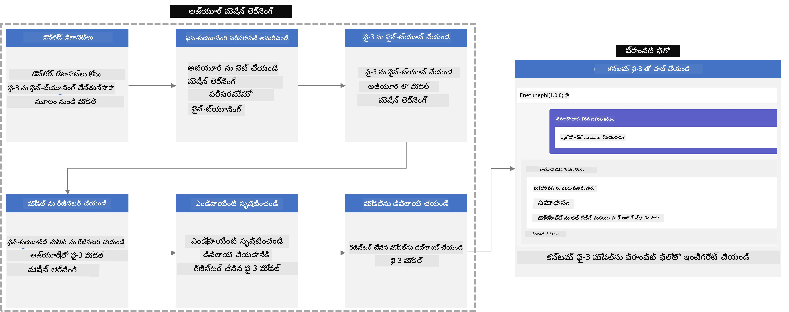

### విషయ సూచిక

1. **[సన్నివేశం 1: Azure వనరులు సెట్ చేసి ఫైన్-ٹ్యూనింగ్ కోసం తయారుచేయడం](../../../../../../md/02.Application/01.TextAndChat/Phi3)**
    - [Azure Machine Learning వర్క్‌స్పేస్ సృష్టించండి](../../../../../../md/02.Application/01.TextAndChat/Phi3)
    - [Azure Subscription లో GPU కోటాలు అభ్యర్థించండి](../../../../../../md/02.Application/01.TextAndChat/Phi3)
    - [భూమిక ఏర్పాటు చేయండి](../../../../../../md/02.Application/01.TextAndChat/Phi3)
    - [ప్రాజెక్ట్ సెట్ చేయండి](../../../../../../md/02.Application/01.TextAndChat/Phi3)
    - [ఫైన్-ట్యూనింగ్ కోసం డేటాసెట్ సిద్ధం చేయండి](../../../../../../md/02.Application/01.TextAndChat/Phi3)

1. **[సన్నివేశం 2: Phi-3 మోడల్ ను ఫైన్-ట్యూన్ చేసి Azure Machine Learning Studio లో డిప్లాయ్ చేయడం](../../../../../../md/02.Application/01.TextAndChat/Phi3)**
    - [Azure CLI సెట్ చేయండి](../../../../../../md/02.Application/01.TextAndChat/Phi3)
    - [Phi-3 మోడల్ ను ఫైన్-ట్యూన్ చేయండి](../../../../../../md/02.Application/01.TextAndChat/Phi3)
    - [ఫైన్-ట్యూన్ చేసిన మోడల్ ని డిప్లాయ్ చేయండి](../../../../../../md/02.Application/01.TextAndChat/Phi3)

1. **[సన్నివేశం 3: Prompt flowతో ఇంటిగ్రేట్ చేసి మీ కస్టమ్ మోడల్ తో చాట్ చేయడం](../../../../../../md/02.Application/01.TextAndChat/Phi3)**
    - [కస్టమ్ Phi-3 మోడల్‌ని Prompt flowతో ఇంటిగ్రేట్ చేయండి](../../../../../../md/02.Application/01.TextAndChat/Phi3)
    - [మీ కస్టమ్ మోడల్ తో చాట్ చేయండి](../../../../../../md/02.Application/01.TextAndChat/Phi3)

## సన్నివేశం 1: Azure వనరులు సెట్ చేసి ఫైన్-ట్యూనింగ్ కోసం తయారుచేయడం

### Azure Machine Learning వర్క్‌స్పేస్ సృష్టించండి

1. పోర్టల్ పేజీ అగ్రభాగంలో ఉన్న **search bar** లో *azure machine learning* టైప్ చేసి, కనిపించే ఎంపికల నుండి **Azure Machine Learning**ను ఎంచుకోండి.

    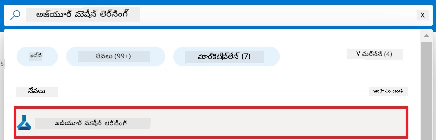

1. నావిగేషన్ మెనూ నుండి **+ Create** ఎంచుకోండి.

1. నావిగేషన్ మెనూ నుండి **New workspace** ఎంచుకోండి.

    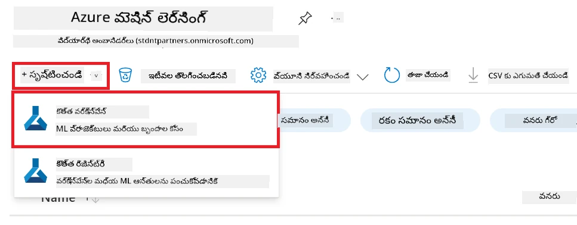

1. క్రింది పనులు చేయండి:

    - మీ Azure **Subscription** ఎంచుకోండి.
    - ఉపయోగించాల్సిన **Resource group** ఎంచుకోండి (తొడుగులకు కొత్తదాన్ని సృష్టించండి).
    - **Workspace Name** నమోదు చేయండి. ఇది ప్రత్యేకమైన విలువ కావాలి.
    - మీరు ఉపయోగించాలని కోరుకునే **Region** ఎంచుకోండి.
    - ఉపయోగించాల్సిన **Storage account** ఎంచుకోండి (తొడుగులకు కొత్తదాన్ని సృష్టించండి).
    - ఉపయోగించాల్సిన **Key vault** ఎంచుకోండి (తొడుగులకు కొత్తదాన్ని సృష్టించండి).
    - ఉపయోగించాల్సిన **Application insights** ఎంచుకోండి (తొడుగులకు కొత్తదాన్ని సృష్టించండి).
    - ఉపయోగించాల్సిన **Container registry** ఎంచుకోండి (తొడుగులకు కొత్తదాన్ని సృష్టించండి).

    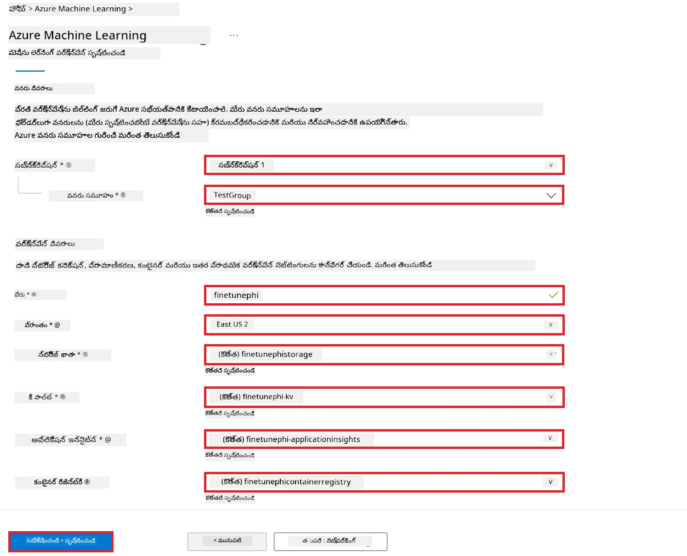

1. **Review + Create** ఎంచుకోండి.

1. **Create** ఎంచుకోండి.

### Azure Subscription లో GPU కోటాలు అభ్యర్థించండి

ఈ E2E నమూనాలో, ఫైన్-ట్యూనింగ్ కోసం *Standard_NC24ads_A100_v4 GPU* ఉపయోగించబడుతుంది, ఇది కోటా అభ్యర్థన అవసరం, మరియు డిప్లాయ్‌మెంట్ కోసం *Standard_E4s_v3* CPU ఉపయోగపడుతుంది, దీనికి కోటా అభ్యర్థన అవసరం లేదు.

> [!NOTE]
>
> GPU కేటాయింపుకు కేవలం Pay-As-You-Go సబ్స్క్రిప్షన్లే (ప్రామాణిక సబ్స్క్రిప్షన్ రకం) అర్హత పొందుతాయి; బెనిఫిట్ సబ్స్క్రిప్షన్లను ప్రస్తుతానికి మద్దతు లేదు.
>
> Visual Studio Enterprise Subscription వంటి బెనిఫిట్ సబ్స్క్రిప్షన్లు ఉపయోగిస్తున్న వారు లేదా ఫైన్-ట్యూనింగ్ మరియు డిప్లాయ్‌మెంట్ ప్రక్రియను త్వరగా పరీక్షించాలనుకునేవారు, ఈ పాఠం CPU తో చిన్న డేటాసెట్ ఉపయోగించి ఫైన్-ట్యూనింగ్ కోసం మార్గదర్శకత్వాన్ని కూడా అందిస్తుంది. అయితే, పెద్ద డేటాసెట్లతో GPU ఉపయోగించిన ఫైన్-ట్యూనింగ్ ఫలితాలు గణనీయంగా మెరుగ్గా ఉంటాయని గమనించండి.

1. [Azure ML Studio](https://ml.azure.com/home?wt.mc_id=studentamb_279723) ని సందర్శించండి.

1. *Standard NCADSA100v4 Family* కోటా అభ్యర్థించడానికి క్రింది పనులు చేయండి:

    - ఎడమ వైపు టాబ్ నుండి **Quota** ఎంచుకోండి.
    - ఉపయోగించాల్సిన **Virtual machine family** ఎంచుకోండి. ఉదాహరణకు, *Standard NCADSA100v4 Family Cluster Dedicated vCPUs* ఎంచుకోండి, ఇది *Standard_NC24ads_A100_v4* GPUని కలిగి ఉంటుంది.
    - నావిగేషన్ మెనూ నుండి **Request quota** ఎంచుకోండి.

        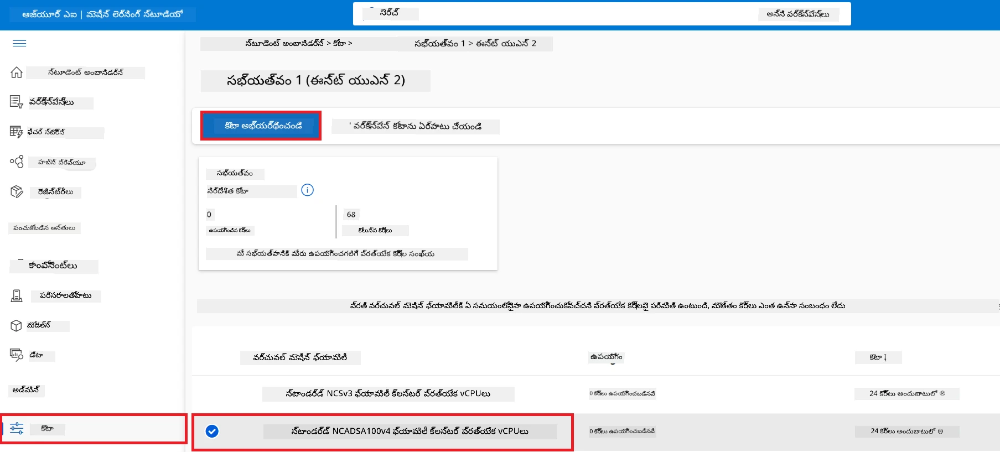

    - Request quota పేజీ లో, మీరు ఉపయోగించాలనుకునే **New cores limit** నమోదు చేయండి. ఉదాహరణకు, 24.
    - Request quota పేజీలో, GPU కోటా అభ్యర్థించడానికి **Submit** ఎంచుకోండి.

> [!NOTE]
> మీరు మీ అవసరాలకు అనుగుణంగా GPU లేదా CPU ఎంచుకోవచ్చును. వివరణ కోసం [Sizes for Virtual Machines in Azure](https://learn.microsoft.com/azure/virtual-machines/sizes/overview?tabs=breakdownseries%2Cgeneralsizelist%2Ccomputesizelist%2Cmemorysizelist%2Cstoragesizelist%2Cgpusizelist%2Cfpgasizelist%2Chpcsizelist) డాక్యుమెంట్లు చూడండి.

### భూమిక (Role) నియాయించండి

మీ మోడళ్లను ఫైన్-ట్యూన్ చేసి డిప్లాయ్ చేయడానికి, మీరు ముందుగా User Assigned Managed Identity (UAI) సృష్టించి, అనుకూలమైన అనుమతులు ఇవ్వాలి. ఈ UAI ని డిప్లాయ్‌మెంట్ సమయంలో ధృవీకరణ కోసం ఉపయోగిస్తారు.

#### User Assigned Managed Identity (UAI) సృష్టించండి

1. పోర్టల్ పేజీ అగ్రభాగంలో **search bar** లో *managed identities* టైప్ చేసి, కనిపించే ఎంపికల నుండి **Managed Identities**ఎంచుకోండి.

    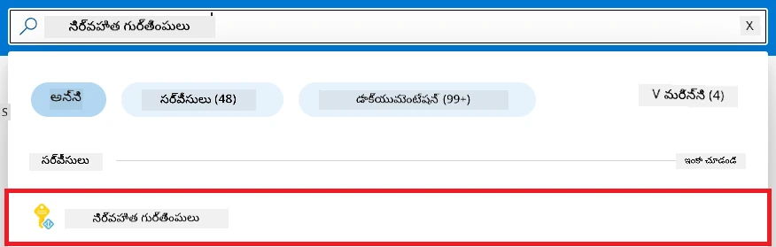

1. **+ Create** ఎంచుకోండి.

    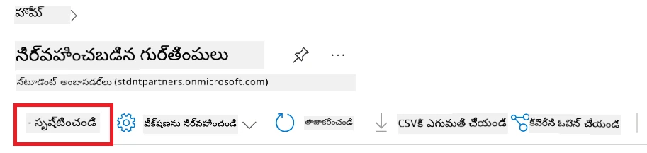

1. క్రింది పనులు చేయండి:

    - మీ Azure **Subscription** ఎంచుకోండి.
    - ఉపయోగించాల్సిన **Resource group** ఎంచుకోండి (తొడుగులకు కొత్తదాన్ని సృష్టించండి).
    - మీరు ఉపయోగించాలని కోరుకునే **Region** ఎంచుకోండి.
    - **Name** నమోదు చేయండి. ఇది ప్రత్యేకమైన విలువ కావాలి.

1. **Review + create** ఎంచుకోండి.

1. **+ Create** ఎంచుకోండి.

#### Managed Identity కు Contributor భూమిక (Role) నియాయించండి

1. మీరు సృష్టించిన Managed Identity వనరు వద్దకు నావిగేట్ అవ్వండి.

1. ఎడమ వైపు టాబ్ నుండి **Azure role assignments** ఎంచుకోండి.

1. నావిగేషన్ మెనూ నుండి **+Add role assignment** ఎంచుకోండి.

1. Add role assignment పేజీలో క్రింది పనులు చేయండి:
    - **Scope** ను **Resource group** గా ఎంచుకోండి.
    - మీ Azure **Subscription** ఎంచుకోండి.
    - ఉపయోగించాల్సిన **Resource group** ఎంచుకోండి.
    - **Role** ను **Contributor** గా ఎంచుకోండి.

    

1. **Save** ఎంచుకోండి.

#### Managed Identity కు Storage Blob Data Reader భూమిక (Role) నియాయించండి

1. పోర్టల్ పేజీ అగ్రభాగంలో **search bar** లో *storage accounts* టైప్ చేసి, కనిపించే ఎంపికల నుండి **Storage accounts** ఎంచుకోండి.

    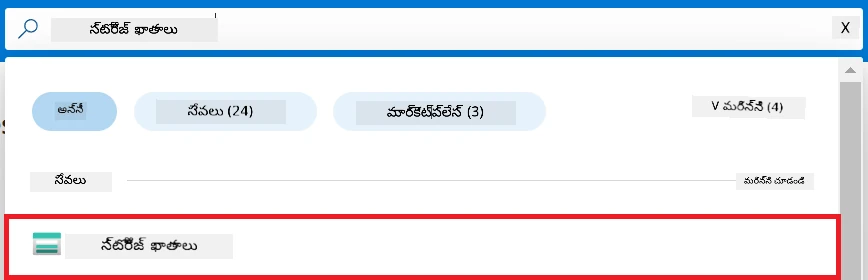

1. మీరు సృష్టించిన Azure Machine Learning వర్క్‌స్పేస్ కు సంబంధించిన స్టోరేజ్ అకౌంట్ ఎంచుకోండి. ఉదాహరణకు, *finetunephistorage*.

1. Add role assignment పేజీకి వెళ్లేందుకు క్రింది పనులు చేయండి:

    - మీరు సృష్టించిన Azure Storage అకౌంట్ వద్దకు నావిగేట్ అవ్వండి.
    - ఎడమ వైపు టాబ్ నుండి **Access Control (IAM)** ఎంచుకోండి.
    - నావిగేషన్ మెనూ నుండి **+ Add** ఎంచుకోండి.
    - **Add role assignment** ఎంచుకోండి.

    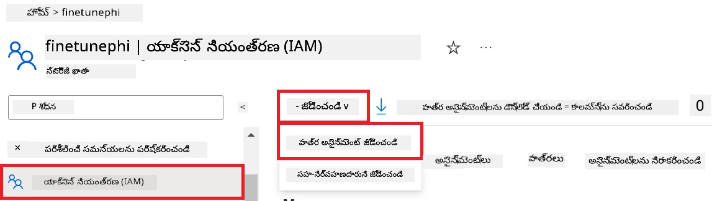

1. Add role assignment పేజీలో క్రింది పనులు చేయండి:

    - Role పేజీలో, **search bar** లో *Storage Blob Data Reader* టైప్ చేసి కనిపించే ఎంపికల నుండి **Storage Blob Data Reader** ఎంచుకోండి.
    - Role పేజీలో, **Next** ఎంచుకోండి.
    - Members పేజీలో, **Assign access to** లో **Managed identity** ఎంచుకోండి.
    - Members పేజీలో, **+ Select members** ఎంచుకోండి.
    - Select managed identities పేజీలో, మీ Azure **Subscription** ఎంచుకోండి.
    - Select managed identities పేజీలో, **Managed identity** ను **Manage Identity** గా ఎంచుకోండి.
    - మీరు సృష్టించిన Managed Identity ఎంచుకోండి. ఉదాహరణకు, *finetunephi-managedidentity*.
    - Select managed identities పేజీలో, **Select** ఎంచుకోండి.

    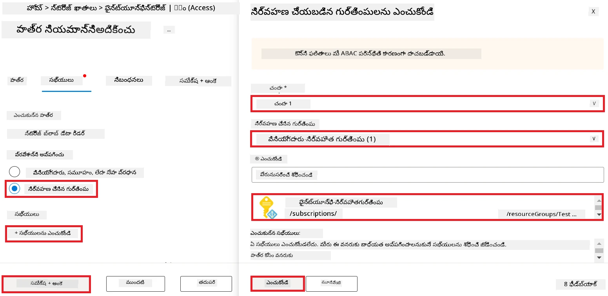

1. **Review + assign** ఎంచుకోండి.

#### Managed Identity కు AcrPull భూమిక (Role) నియాయించండి

1. పోర్టల్ పేజీ అగ్రభాగంలో **search bar** లో *container registries* టైప్ చేసి, కనిపించే ఎంపికల నుండి **Container registries** ఎంచుకోండి.

    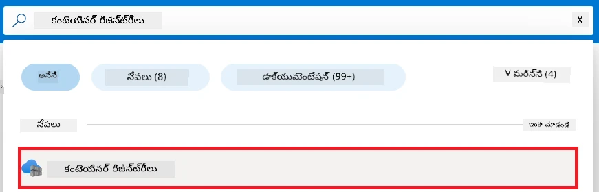

1. Azure Machine Learning వర్క్‌స్పేస్ కు సంబంధించిన కంటైనర్ రిజిస్ట్రీ ఎంచుకోండి. ఉదాహరణకు, *finetunephicontainerregistries*.

1. Add role assignment పేజీకి వెళ్లేందుకు క్రింది పనులు చేయండి:

    - ఎడమ వైపు టాబ్ నుండి **Access Control (IAM)** ఎంచుకోండి.
    - నావిగేషన్ మెనూ నుండి **+ Add** ఎంచుకోండి.
    - **Add role assignment** ఎంచుకోండి.

1. Add role assignment పేజీలో క్రింది పనులు చేయండి:

    - Role పేజీలో, **search bar** లో *AcrPull* టైప్ చేసి కనిపించే ఎంపికల నుండి **AcrPull** ఎంచుకోండి.
    - Role పేజీలో, **Next** ఎంచుకోండి.
    - Members పేజీలో, **Assign access to** లో **Managed identity** ఎంచుకోండి.
    - Members పేజీలో, **+ Select members** ఎంచుకోండి.
    - Select managed identities పేజీలో, మీ Azure **Subscription** ఎంచుకోండి.
    - Select managed identities పేజీలో, **Managed identity** ను **Manage Identity** గా ఎంచుకోండి.
    - మీరు సృష్టించిన Managed Identity ఎంచుకోండి. ఉదాహరణకు, *finetunephi-managedidentity*.
    - Select managed identities పేజీలో, **Select** ఎంచుకోండి.
    - **Review + assign** ఎంచుకోండి.

### ప్రాజెక్ట్ సెట్ చేయండి

ఇప్పుడు, మీరు పనికి ఉదాహరణ ఫోల్డర్ సృష్టించి, వర్చువల్ ఎన్విరాన్‌మెంట్ ఏర్పాటు చేసి, యూజర్లతో ఇంటరాక్ట్ అయ్యే ప్రోగ్రామ్ అభివృద్ధి చేస్తారు. ఇది Azure Cosmos DB నుండి నిల్వ చేసిన చాట్ చరిత్రను ఉపయోగించి సమాధానాలను తెలియజేస్తుంది.

#### పని చేయడానికి ఫోల్డర్ సృష్టించండి

1. టర్మినల్ విండో ఓపెన్ చేసి, డిఫాల్ట్ పాత్ లో *finetune-phi* అనే పేరు గల ఫోల్డర్ సృష్టించడానికి దిగువ కమాండ్ టైప్ చేయండి.

    ```console
    mkdir finetune-phi
    ```

1. మీరు సృష్టించిన *finetune-phi* ఫోల్డర్ లోకి వెళ్లడానికి టర్మినల్ లో క్రింది కమాండ్ టైప్ చేయండి.

    ```console
    cd finetune-phi
    ```

#### వర్చువల్ ఎన్విరాన్‌మెంట్ సృష్టించండి

1. *.venv* అనే పేరు గల వర్చువల్ ఎన్విరాన్‌మెంట్ సృష్టించడానికి టర్మినల్ లో క్రింది కమాండ్ టైప్ చేయండి.

    ```console
    python -m venv .venv
    ```

1. వర్చువల్ ఎన్విరాన్‌మెంట్‌ని యాక్టివేట్ చేయడానికి క్రింది కమాండ్ టైప్ చేయండి.

    ```console
    .venv\Scripts\activate.bat
    ```

> [!NOTE]
>
> ఇది పని చేయగలిగితే, కమాండ్ ప్రాంప్ట్ ముందు *(.venv)* కనిపించాలి.

#### అవసరమైన ప్యాకేజీలు ఇన్‌స్టాల్ చేయండి

1. అవసరమైన ప్యాకేజీలు ఇన్‌స్టాల్ చేయడానికి క్రింది కమాండ్లు మీ టర్మినల్ లో టైప్ చేయండి.

    ```console
    pip install datasets==2.19.1
    pip install transformers==4.41.1
    pip install azure-ai-ml==1.16.0
    pip install torch==2.3.1
    pip install trl==0.9.4
    pip install promptflow==1.12.0
    ```

#### ప్రాజెక్ట్ ఫైళ్ళను సృష్టించండి
ఈ వ్యాయామంలో, మన ప్రాజెక్ట్ కోసం అవసరమైన ఫైళ్ళను మీరు సృష్టించబోతున్నారు. ఈ ఫైళ్ళలో dataset డౌన్లోడ్ చేసుకోవడానికి స్క్రిప్టులు, Azure Machine Learning పరిసరాన్ని ఏర్పాటు చేయడానికి, Phi-3 మోడల్‌ను ఫైన్-ట్యూన్ చేయడానికి మరియు ఫైన్-ట్యూన్ చేసిన మోడల్‌ని డిప్లాయ్ చేయడానికి స్క్రిప్టులు ఉంటాయి. మీరు ఫైన్-ట్యూనింగ్ పరిసరాన్ని ఏర్పాటు చేయడానికి *conda.yml* ఫైల్ కూడా సృష్టిస్తారు.

ఈ వ్యాయామంలో మీరు:

- dataset డౌన్లోడ్ చేసుకోవడానికి *download_dataset.py* ఫైల్ సృష్టించండి.
- Azure Machine Learning పరిసరాన్ని ఏర్పాటు చేయడానికి *setup_ml.py* ఫైల్ సృష్టించండి.
- *finetuning_dir* ఫోల్డర్‌లో *fine_tune.py* ఫైల్ సృష్టించి dataset ఉపయోగించి Phi-3 మోడల్‌ను ఫైన్-ట్యూన్ చేయండి.
- ఫైన్-ట్యూనింగ్ పరిసరాన్ని సెట్ చేసేందుకు *conda.yml* ఫైల్ సృష్టించండి.
- ఫైన్-ట్యూన్ చేసిన మోడల్‌ను డిప్లాయ్ చేయడానికి *deploy_model.py* ఫైల్ సృష్టించండి.
- ఫైన్-ట్యూన్ చేసిన మోడల్‌ను ఇంటిగ్రేట్ చేసి Prompt flow ద్వారా మోడల్ అడుగు వేయడానికి *integrate_with_promptflow.py* ఫైల్ సృష్టించండి.
- Prompt flow కోసం workflow నిర్మాణం సృష్టించేందుకు flow.dag.yml ఫైల్ సృష్టించండి.
- Azure సమాచారాన్ని పొందుపరచడానికి *config.py* ఫైల్ సృష్టించండి.

> [!NOTE]
>
> పూర్తి ఫోల్డర్ నిర్మాణం:
>
> ```text
> └── YourUserName
> .    └── finetune-phi
> .        ├── finetuning_dir
> .        │      └── fine_tune.py
> .        ├── conda.yml
> .        ├── config.py
> .        ├── deploy_model.py
> .        ├── download_dataset.py
> .        ├── flow.dag.yml
> .        ├── integrate_with_promptflow.py
> .        └── setup_ml.py
> ```

1. **Visual Studio Code**ని ఓపెన్ చేయండి.

1. మెను బార్ నుండి **File**ని ఎంపిక చేసుకోండి.

1. **Open Folder**ని ఎంపిక చేసుకోండి.

1. మీరు సృష్టించిన *finetune-phi* ఫోల్డర్‌ను ఎంపిక చేసుకోండి, ఇది *C:\Users\yourUserName\finetune-phi*లో ఉంటుంది.

    

1. Visual Studio Code ఎడమ ప్యాన్‌లో రైట్-క్లిక్ చేసి **New File** ఎంపిక చేసుకుని *download_dataset.py* అనే కొత్త ఫైల్ సృష్టించండి.

1. Visual Studio Code ఎడమ ప్యాన్‌లో రైట్-క్లిక్ చేసి **New File** ఎంపిక చేసుకుని *setup_ml.py* అనే కొత్త ఫైల్ సృష్టించండి.

1. Visual Studio Code ఎడమ ప్యాన్‌లో రైట్-క్లిక్ చేసి **New File** ఎంపిక చేసుకుని *deploy_model.py* అనే కొత్త ఫైల్ సృష్టించండి.

    

1. Visual Studio Code ఎడమ ప్యాన్‌లో రైట్-క్లిక్ చేసి **New Folder**ని ఎంపిక చేసుకుని *finetuning_dir* అనే కొత్త ఫోల్‌డర్ సృష్టించండి.

1. *finetuning_dir* ఫోల్డర్‌లో *fine_tune.py* అనే కొత్త ఫైల్‌ను సృష్టించండి.

#### *conda.yml* ఫైల్ సృష్టించి సెట్ చేయండి

1. Visual Studio Code ఎడమ ప్యాన్‌లో రైట్-క్లిక్ చేసి **New File**ని ఎంపిక చేసుకుని *conda.yml* అనే కొత్త ఫైల్ సృష్టించండి.

1. *conda.yml* ఫైల్‌లో Phi-3 మోడల్ కోసం ఫైన్-ట్యూనింగ్ పరిసరాన్ని ఏర్పాటు చేసేందుకు క్రింది కోడ్‌ను చేర్చండి.

    ```yml
    name: phi-3-training-env
    channels:
      - defaults
      - conda-forge
    dependencies:
      - python=3.10
      - pip
      - numpy<2.0
      - pip:
          - torch==2.4.0
          - torchvision==0.19.0
          - trl==0.8.6
          - transformers==4.41
          - datasets==2.21.0
          - azureml-core==1.57.0
          - azure-storage-blob==12.19.0
          - azure-ai-ml==1.16
          - azure-identity==1.17.1
          - accelerate==0.33.0
          - mlflow==2.15.1
          - azureml-mlflow==1.57.0
    ```

#### *config.py* ఫైల్ సృష్టించి సెట్ చేయండి

1. Visual Studio Code ఎడమ ప్యాన్‌లో రైట్-క్లిక్ చేసి **New File**ని ఎంపిక చేసుకుని *config.py* అనే కొత్త ఫైల్ సృష్టించండి.

1. మీ Azure సమాచారాన్ని చేర్చడానికి *config.py* ఫైల్‌లో క్రింది కోడ్‌ను జోడించండి.

    ```python
    # Azure సెట్టింగులు
    AZURE_SUBSCRIPTION_ID = "your_subscription_id"
    AZURE_RESOURCE_GROUP_NAME = "your_resource_group_name" # "TestGroup"

    # Azure మిషన్ లెర్నింగ్ సెట్టింగులు
    AZURE_ML_WORKSPACE_NAME = "your_workspace_name" # "finetunephi-workspace"

    # Azure మేనేజ్డ్ ఐడెంటిటీ సెట్టింగులు
    AZURE_MANAGED_IDENTITY_CLIENT_ID = "your_azure_managed_identity_client_id"
    AZURE_MANAGED_IDENTITY_NAME = "your_azure_managed_identity_name" # "finetunephi-mangedidentity"
    AZURE_MANAGED_IDENTITY_RESOURCE_ID = f"/subscriptions/{AZURE_SUBSCRIPTION_ID}/resourceGroups/{AZURE_RESOURCE_GROUP_NAME}/providers/Microsoft.ManagedIdentity/userAssignedIdentities/{AZURE_MANAGED_IDENTITY_NAME}"

    # డేటాసెట్ ఫైల్ మార్గాలు
    TRAIN_DATA_PATH = "data/train_data.jsonl"
    TEST_DATA_PATH = "data/test_data.jsonl"

    # ఫైన్-ట్యూన్ చేసిన మోడల్ సెట్టింగులు
    AZURE_MODEL_NAME = "your_fine_tuned_model_name" # "finetune-phi-model"
    AZURE_ENDPOINT_NAME = "your_fine_tuned_model_endpoint_name" # "finetune-phi-endpoint"
    AZURE_DEPLOYMENT_NAME = "your_fine_tuned_model_deployment_name" # "finetune-phi-deployment"

    AZURE_ML_API_KEY = "your_fine_tuned_model_api_key"
    AZURE_ML_ENDPOINT = "your_fine_tuned_model_endpoint_uri" # "https://{your-endpoint-name}.{your-region}.inference.ml.azure.com/score"
    ```

#### Azure పరిసర వేరియబుల్స్ జోడించండి

1. Azure Subscription ID జోడించడానికి క్రింది కార్యాచరణలు చేయండి:

    - పోర్టల్ పేజీ పైభాగంలో ఉన్న **search bar**లో *subscriptions* టైప్ చేసి వచ్చిన ఎంపికలలో **Subscriptions**ని సెలెక్ట్ చేయండి.
    - మీరు ఉపయోగిస్తున్న Azure Subscriptionని సెలెక్ట్ చేయండి.
    - మీ Subscription IDని కాపీ చేసి *config.py* ఫైల్‌లో పేస్ట్ చేయండి.

    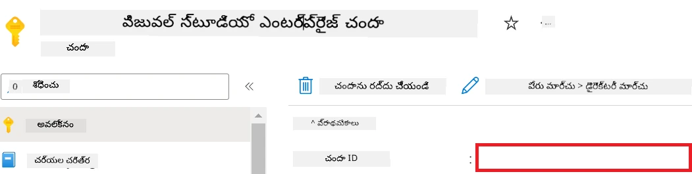

1. Azure Workspace Name జోడించడానికి క్రింది కార్యాచరణలు చేయండి:

    - మీరు సృష్టించిన Azure Machine Learning రీసోర్స్‌కి వెళ్లండి.
    - మీ అకౌంట్ పేరును కాపీ చేసి *config.py* ఫైల్‌లో పేస్ట్ చేయండి.

    

1. Azure Resource Group Name జోడించడానికి క్రింది కార్యాచరణలు చేయండి:

    - మీరు సృష్టించిన Azure Machine Learning రీసోర్స్‌కి వెళ్లండి.
    - మీ Azure Resource Group Nameను కాపీ చేసి *config.py* ఫైల్‌లో పేస్ట్ చేయండి.

    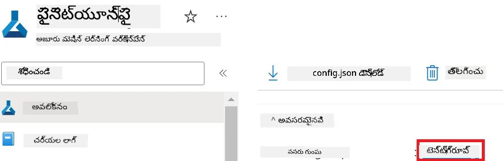

2. Azure Managed Identity పేరు జోడించడానికి క్రింది కార్యకలాపాలు చేయండి:

    - మీరు సృష్టించిన Managed Identities రీసోర్స్‌కి వెళ్లండి.
    - మీ Azure Managed Identity పేరు కాపీ చేసి *config.py* ఫైల్‌లో పేస్ట్ చేయండి.

    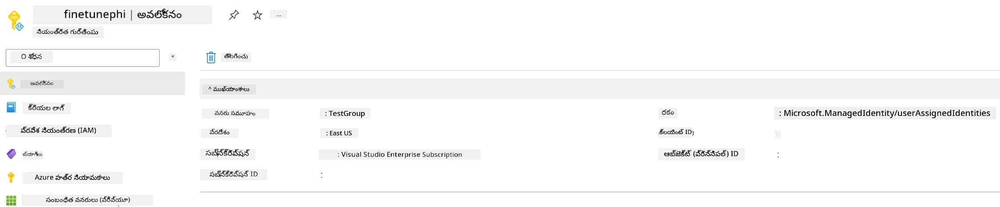

### ఫైన్-ట్యూనింగ్ కోసం dataset సిద్ధం చేయండి

ఈ వ్యాయామంలో, మీరు *download_dataset.py* ఫైల్ రన్ చేసి *ULTRACHAT_200k* dataset ను మీ लोकల్ పరిసరానికి డౌన్లోడ్ చేసుకోవాలి. మీరు ఆ dataset ఉపయోగించి Azure Machine Learningలో Phi-3 మోడల్‌ను ఫైన్-ట్యూన్ చేస్తారు.

#### *download_dataset.py* ఉపయోగించి dataset డౌన్లోడ్ చేయండి

1. Visual Studio Codeలో *download_dataset.py* ఫైల్ తెరవండి.

1. *download_dataset.py* లో క్రింది కోడ్‌ను జోడించండి.

    ```python
    import json
    import os
    from datasets import load_dataset
    from config import (
        TRAIN_DATA_PATH,
        TEST_DATA_PATH)

    def load_and_split_dataset(dataset_name, config_name, split_ratio):
        """
        Load and split a dataset.
        """
        # నిర్దిష్టించిన పేరు, కాన్ఫిగరేషన్ మరియు విడగొట్టు నిష్పత్తితో డేటాసెట్‌ను లోడ్ చేయండి
        dataset = load_dataset(dataset_name, config_name, split=split_ratio)
        print(f"Original dataset size: {len(dataset)}")
        
        # డేటాసెట్‌ను ట్రైన్ మరియు టెస్ట్ సెட்டులుగా విభజించండి (80% ట్రైన్, 20% టెస్ట్)
        split_dataset = dataset.train_test_split(test_size=0.2)
        print(f"Train dataset size: {len(split_dataset['train'])}")
        print(f"Test dataset size: {len(split_dataset['test'])}")
        
        return split_dataset

    def save_dataset_to_jsonl(dataset, filepath):
        """
        Save a dataset to a JSONL file.
        """
        # డైరెక్టరీ లేనప్పుడు సృష్టించండి
        os.makedirs(os.path.dirname(filepath), exist_ok=True)
        
        # ఫైల్ను వ్రాయు మోడ్‌లో తెరవండి
        with open(filepath, 'w', encoding='utf-8') as f:
            # డేటాసెట్‌లోని ప్రతి రికార్డును తిరగండి
            for record in dataset:
                # రికార్డును JSON ఆబ్జెక్టుగా డంప్ చేసి ఫైల్కు వ్రాయండి
                json.dump(record, f)
                # రికార్డుల మధ్య విభజన కోసం ఒక న్యూలైన్ క్యారెక్టర్ వ్రాయండి
                f.write('\n')
        
        print(f"Dataset saved to {filepath}")

    def main():
        """
        Main function to load, split, and save the dataset.
        """
        # నిర్దిష్ట కాన్ఫిగరేషన్ మరియు విడగొట్టు నిష్పత్తితో ULTRACHAT_200k డేటాసెట్‌ను లోడ్ చేసి విభజించండి
        dataset = load_and_split_dataset("HuggingFaceH4/ultrachat_200k", 'default', 'train_sft[:1%]')
        
        # విభజన నుండి ట్రైన్ మరియు టెస్ట్ డేటాసెట్‌ను తీయండి
        train_dataset = dataset['train']
        test_dataset = dataset['test']

        # ట్రైన్ డేటాసెట్‌ను JSONL ఫైల్‌గా సేవ్ చేయండి
        save_dataset_to_jsonl(train_dataset, TRAIN_DATA_PATH)
        
        # టెస్ట్ డేటాసెట్‌ను వేరే JSONL ఫైల్‌గా సేవ్ చేయండి
        save_dataset_to_jsonl(test_dataset, TEST_DATA_PATH)

    if __name__ == "__main__":
        main()

    ```

> [!TIP]
>
> **CPU ఉపయోగించి కనీస dataset తో ఫైన్-ట్యూనింగ్ కోసం మార్గదర్శకం**
>
> CPUతో ఫైన్-ట్యూన్ చేయాలనుకుంటే, ఇది Visual Studio Enterprise Subscription వంటి బెనిఫిట్ సబ్స్క్రిప్షన్లు ఉన్న వారికి లేదా ఫైన్-ట్యూనింగ్ మరియు డిప్లాయ్‌మెంట్ ప్రాసెస్‌ను శీఘ్రంగా పరీక్షించడానికి అనుకూలంగా ఉంటుంది.
>
> `dataset = load_and_split_dataset("HuggingFaceH4/ultrachat_200k", 'default', 'train_sft[:1%]')`ను `dataset = load_and_split_dataset("HuggingFaceH4/ultrachat_200k", 'default', 'train_sft[:10]')`తో మార్చండి.
>

1. టెర్మినల్‌లో క్రింది కమాండును టైప్ చేసి స్క్రిప్టుని రన్ చేసి datasetని লোকల్ పరిసరానికి డౌన్లోడ్ చేయండి.

    ```console
    python download_data.py
    ```

1. డేటాసెట్‌లు మీ लोकల్ *finetune-phi/data* డైరెక్టరీలో విజయవంతంగా సేవ్ అయినాయి అని నిర్ధారించండి.

> [!NOTE]
>
> **Dataset పరిమాణం మరియు ఫైన్-ట్యూనింగ్ సమయం**
>
> ఈ E2E ఉదాహరణలో, మీరు dataset లో 1% (`train_sft[:1%]`) మాత్రమే ఉపయోగిస్తున్నారు. ఇది డేటా మొత్తం గణనీయంగా తగ్గించి అప్‌లోడ్ మరియు ఫైన్-ట్యూనింగ్ ప్రక్రియలను వేగవంతం చేస్తుంది. మీరు శిక్షణ సమయం మరియు మోడల్ పనితీరుకు సరిపోయే శాతం సర్దుబాటు చేయవచ్చు. చిన్న ఉపసమితి dataset ఉపయోగించడం ఫైన్-ట్యూనింగ్ సమయాన్ని తగ్గించి ఈ E2E ఉదాహరణ కోసం ప్రక్రియను సులభతరం చేస్తుంది.

## సన్నివేశం 2: Phi-3 మోడల్‌ను ఫైన్-ట్యూన్ చేసి Azure Machine Learning Studioలో డిప్లాయ్ చేయండి

### Azure CLI సెట్ చేయండి

మీ పరిసరాన్ని authenticate చేయడానికై Azure CLIని ఏర్పాటు చేయాలి. Azure CLI మీ Azure వనరులను కమాండ్ లైన్ నుండి నేరుగా నిర్వహించడానికి మరియు Azure Machine Learningకి ఆ వనరుల యాక్సెస్ కోసం అవసరమైన క్రెడెన్షియల్స్ ఇవ్వడానికి ఉపయోగపడుతుంది. ప్రారంభించడానికి [Azure CLI](https://learn.microsoft.com/cli/azure/install-azure-cli) ని ఇన్స్టాల్ చేయండి.

1. టెర్మినల్ విండో ఓపెన్ చేసి క్రింది కమాండు టైప్ చేసి మీ Azure అకౌంట్‌లో లాగిన్ అవ్వండి.

    ```console
    az login
    ```

1. ఉపయోగించవలసిన Azure అకౌంట్‌ను ఎంపిక చేసుకోండి.

1. ఉపయోగించవలసిన Azure subscription ను ఎంపిక చేసుకోండి.

    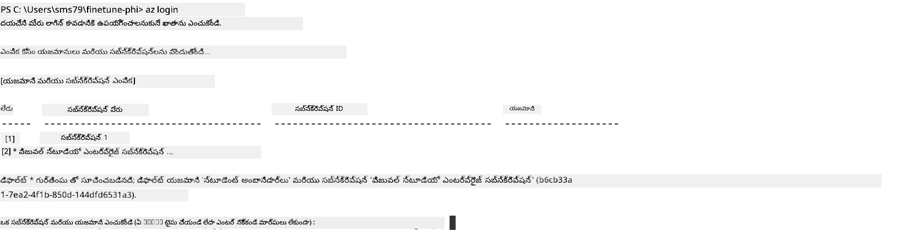

> [!TIP]
>
> Azureలో సైన్ ఇన్ చేస్తున్నప్పుడు సమస్య ఉంటే, డివైస్ కోడ్ ఉపయోగించండి. టెర్మినల్ విండో ఓపెన్ చేసి క్రింది కమాండు ద్వారా Azure అకౌంట్ లో సైన్ ఇన్ అవ్వండి:
>
> ```console
> az login --use-device-code
> ```
>

### Phi-3 మోడల్‌ను ఫైన్-ట్యూన్ చేయండి

ఈ వ్యాయామంలో, మీరు అందించిన dataset ఉపయోగించి Phi-3 మోడల్‌ను ఫైన్-ట్యూన్ చేస్తారు. ముందుగా, మీరు *fine_tune.py* ఫైల్‌లో ఫైన్-ట్యూనింగ్ ప్రక్రియను నిర్వచిస్తారు. తర్వాత, Azure Machine Learning పరిసరాన్ని సెట్ చేసి *setup_ml.py* ఫైల్ రన్ చేసి ఫైన్-ట్యూనింగ్ ప్రారంభిస్తారు. ఈ స్క్రిప్ట్ ద్వారా ఫైన్-ట్యూనింగ్ Azure Machine Learning పరిసరంలో జరుగుతుంది.

*setup_ml.py*ని రన్ చేస్తే, మీరు Azure Machine Learning పరిసరంలో ఫైన్-ట్యూనింగ్ ప్రక్రియను నిర్వహించగలుగుతారు.

#### *fine_tune.py* ఫైల్‌లో కోడ్ జత చేయండి

1. *finetuning_dir* ఫోల్డర్‌కు వెళ్లి Visual Studio Codeలో *fine_tune.py* ఫైల్ తెరువండి.

1. *fine_tune.py* లో క్రింది కోడ్‌ను జత చేయండి.

    ```python
    import argparse
    import sys
    import logging
    import os
    from datasets import load_dataset
    import torch
    import mlflow
    from transformers import AutoModelForCausalLM, AutoTokenizer, TrainingArguments
    from trl import SFTTrainer

    # MLflowలో INVALID_PARAMETER_VALUE తప్పిదం ఎరిచేందుకు, MLflow సమన్వయాన్ని నిలిపివేయండి
    os.environ["DISABLE_MLFLOW_INTEGRATION"] = "True"

    # లాగింగ్ సెటప్
    logging.basicConfig(
        format="%(asctime)s - %(levelname)s - %(name)s - %(message)s",
        datefmt="%Y-%m-%d %H:%M:%S",
        handlers=[logging.StreamHandler(sys.stdout)],
        level=logging.WARNING
    )
    logger = logging.getLogger(__name__)

    def initialize_model_and_tokenizer(model_name, model_kwargs):
        """
        Initialize the model and tokenizer with the given pretrained model name and arguments.
        """
        model = AutoModelForCausalLM.from_pretrained(model_name, **model_kwargs)
        tokenizer = AutoTokenizer.from_pretrained(model_name)
        tokenizer.model_max_length = 2048
        tokenizer.pad_token = tokenizer.unk_token
        tokenizer.pad_token_id = tokenizer.convert_tokens_to_ids(tokenizer.pad_token)
        tokenizer.padding_side = 'right'
        return model, tokenizer

    def apply_chat_template(example, tokenizer):
        """
        Apply a chat template to tokenize messages in the example.
        """
        messages = example["messages"]
        if messages[0]["role"] != "system":
            messages.insert(0, {"role": "system", "content": ""})
        example["text"] = tokenizer.apply_chat_template(
            messages, tokenize=False, add_generation_prompt=False
        )
        return example

    def load_and_preprocess_data(train_filepath, test_filepath, tokenizer):
        """
        Load and preprocess the dataset.
        """
        train_dataset = load_dataset('json', data_files=train_filepath, split='train')
        test_dataset = load_dataset('json', data_files=test_filepath, split='train')
        column_names = list(train_dataset.features)

        train_dataset = train_dataset.map(
            apply_chat_template,
            fn_kwargs={"tokenizer": tokenizer},
            num_proc=10,
            remove_columns=column_names,
            desc="Applying chat template to train dataset",
        )

        test_dataset = test_dataset.map(
            apply_chat_template,
            fn_kwargs={"tokenizer": tokenizer},
            num_proc=10,
            remove_columns=column_names,
            desc="Applying chat template to test dataset",
        )

        return train_dataset, test_dataset

    def train_and_evaluate_model(train_dataset, test_dataset, model, tokenizer, output_dir):
        """
        Train and evaluate the model.
        """
        training_args = TrainingArguments(
            bf16=True,
            do_eval=True,
            output_dir=output_dir,
            eval_strategy="epoch",
            learning_rate=5.0e-06,
            logging_steps=20,
            lr_scheduler_type="cosine",
            num_train_epochs=3,
            overwrite_output_dir=True,
            per_device_eval_batch_size=4,
            per_device_train_batch_size=4,
            remove_unused_columns=True,
            save_steps=500,
            seed=0,
            gradient_checkpointing=True,
            gradient_accumulation_steps=1,
            warmup_ratio=0.2,
        )

        trainer = SFTTrainer(
            model=model,
            args=training_args,
            train_dataset=train_dataset,
            eval_dataset=test_dataset,
            max_seq_length=2048,
            dataset_text_field="text",
            tokenizer=tokenizer,
            packing=True
        )

        train_result = trainer.train()
        trainer.log_metrics("train", train_result.metrics)

        mlflow.transformers.log_model(
            transformers_model={"model": trainer.model, "tokenizer": tokenizer},
            artifact_path=output_dir,
        )

        tokenizer.padding_side = 'left'
        eval_metrics = trainer.evaluate()
        eval_metrics["eval_samples"] = len(test_dataset)
        trainer.log_metrics("eval", eval_metrics)

    def main(train_file, eval_file, model_output_dir):
        """
        Main function to fine-tune the model.
        """
        model_kwargs = {
            "use_cache": False,
            "trust_remote_code": True,
            "torch_dtype": torch.bfloat16,
            "device_map": None,
            "attn_implementation": "eager"
        }

        # pretrained_model_name = "microsoft/Phi-3-mini-4k-instruct"
        pretrained_model_name = "microsoft/Phi-3.5-mini-instruct"

        with mlflow.start_run():
            model, tokenizer = initialize_model_and_tokenizer(pretrained_model_name, model_kwargs)
            train_dataset, test_dataset = load_and_preprocess_data(train_file, eval_file, tokenizer)
            train_and_evaluate_model(train_dataset, test_dataset, model, tokenizer, model_output_dir)

    if __name__ == "__main__":
        parser = argparse.ArgumentParser()
        parser.add_argument("--train-file", type=str, required=True, help="Path to the training data")
        parser.add_argument("--eval-file", type=str, required=True, help="Path to the evaluation data")
        parser.add_argument("--model_output_dir", type=str, required=True, help="Directory to save the fine-tuned model")
        args = parser.parse_args()
        main(args.train_file, args.eval_file, args.model_output_dir)

    ```

1. *fine_tune.py* ఫైల్‌ను సేవ్ చేసి మూసివేయండి.

> [!TIP]
> **మీరు Phi-3.5 మోడల్‌ను కూడా ఫైన్-ట్యూన్ చేయవచ్చు**
>
> *fine_tune.py* ఫైల్‌లో `pretrained_model_name` ను `"microsoft/Phi-3-mini-4k-instruct"` నుండి `"microsoft/Phi-3.5-mini-instruct"` వంటి మీకు కావలసిన మోడల్‌కు మార్చవచ్చు. మీకు కావలసిన మోడల్ పేరు తెలుసుకోవడానికి [Hugging Face](https://huggingface.co/) వెబ్‌సైట్‌కి వెళ్లి, మీరు ఇష్టపడే మోడల్ కోసం శోధించి, ఆ పేరును మీ స్క్రిప్ట్‌లోని `pretrained_model_name` ఫీల్డ్‌లో కాపీ చేసి పేస్ట్ చేయండి.
>
> <image type="content" src="../../../../imgs/02/FineTuning-PromptFlow/finetunephi3.5.png" alt-text="Phi-3.5 ఫైన్-ట్యూన్ చేయడం.">
>

#### *setup_ml.py* ఫైల్‌లో కోడ్ జత చేయండి

1. Visual Studio Codeలో *setup_ml.py* ఫైల్ తెరవండి.

1. *setup_ml.py* లో క్రింది కోడ్‌ను జత చేయండి.

    ```python
    import logging
    from azure.ai.ml import MLClient, command, Input
    from azure.ai.ml.entities import Environment, AmlCompute
    from azure.identity import AzureCliCredential
    from config import (
        AZURE_SUBSCRIPTION_ID,
        AZURE_RESOURCE_GROUP_NAME,
        AZURE_ML_WORKSPACE_NAME,
        TRAIN_DATA_PATH,
        TEST_DATA_PATH
    )

    # కుదిరిన విలువలు

    # శిక్షణ కోసం CPU ఉదాహరణను ఉపయోగించడానికి క్రింది లైన్ల తొలగింపు
    # COMPUTE_INSTANCE_TYPE = "Standard_E16s_v3" # cpu
    # COMPUTE_NAME = "cpu-e16s-v3"
    # DOCKER_IMAGE_NAME = "mcr.microsoft.com/azureml/openmpi4.1.0-ubuntu20.04:latest"

    # శిక్షణ కోసం GPU ఉదాహరణను ఉపయోగించడానికి క్రింది లైన్ల తొలగింపు
    COMPUTE_INSTANCE_TYPE = "Standard_NC24ads_A100_v4"
    COMPUTE_NAME = "gpu-nc24s-a100-v4"
    DOCKER_IMAGE_NAME = "mcr.microsoft.com/azureml/curated/acft-hf-nlp-gpu:59"

    CONDA_FILE = "conda.yml"
    LOCATION = "eastus2" # మీ కంప్యూట్ క్లస్టర్ యొక్క స్థానం తో భర్తీ చేయండి
    FINETUNING_DIR = "./finetuning_dir" # ఫైన్-ట్యూనింగ్ స్క్రిప్ట్ కు మార్గం
    TRAINING_ENV_NAME = "phi-3-training-environment" # శిక్షణ వాతావరణం పేరు
    MODEL_OUTPUT_DIR = "./model_output" # ఆజ్యూర్ ML లో మోడల్ అవుట్పుట్ డైరెక్టరీకి మార్గం

    # ప్రక్రియను ట్రాక్ చేయడానికి లాగింగ్ సెటప్
    logger = logging.getLogger(__name__)
    logging.basicConfig(
        format="%(asctime)s - %(levelname)s - %(name)s - %(message)s",
        datefmt="%Y-%m-%d %H:%M:%S",
        level=logging.WARNING
    )

    def get_ml_client():
        """
        Initialize the ML Client using Azure CLI credentials.
        """
        credential = AzureCliCredential()
        return MLClient(credential, AZURE_SUBSCRIPTION_ID, AZURE_RESOURCE_GROUP_NAME, AZURE_ML_WORKSPACE_NAME)

    def create_or_get_environment(ml_client):
        """
        Create or update the training environment in Azure ML.
        """
        env = Environment(
            image=DOCKER_IMAGE_NAME,  # వాతావరణం కోసం డోకర్ ఇమేజ్
            conda_file=CONDA_FILE,  # కాండా వాతావరణం ఫైలు
            name=TRAINING_ENV_NAME,  # వాతావరణం పేరు
        )
        return ml_client.environments.create_or_update(env)

    def create_or_get_compute_cluster(ml_client, compute_name, COMPUTE_INSTANCE_TYPE, location):
        """
        Create or update the compute cluster in Azure ML.
        """
        try:
            compute_cluster = ml_client.compute.get(compute_name)
            logger.info(f"Compute cluster '{compute_name}' already exists. Reusing it for the current run.")
        except Exception:
            logger.info(f"Compute cluster '{compute_name}' does not exist. Creating a new one with size {COMPUTE_INSTANCE_TYPE}.")
            compute_cluster = AmlCompute(
                name=compute_name,
                size=COMPUTE_INSTANCE_TYPE,
                location=location,
                tier="Dedicated",  # కంప్యూట్ క్లస్టర్ స్థాయి
                min_instances=0,  # కనిష్ట ఉదాహరణల సంఖ్య
                max_instances=1  # గరిష్ట ఉదాహరణల సంఖ్య
            )
            ml_client.compute.begin_create_or_update(compute_cluster).wait()  # క్లస్టర్ సృష్టించబడేవరకు వేచి ఉండండి
        return compute_cluster

    def create_fine_tuning_job(env, compute_name):
        """
        Set up the fine-tuning job in Azure ML.
        """
        return command(
            code=FINETUNING_DIR,  # fine_tune.py కు మార్గం
            command=(
                "python fine_tune.py "
                "--train-file ${{inputs.train_file}} "
                "--eval-file ${{inputs.eval_file}} "
                "--model_output_dir ${{inputs.model_output}}"
            ),
            environment=env,  # శిక్షణ వాతావరణం
            compute=compute_name,  # ఉపయోగించవలసిన కంప్యూట్ క్లస్టర్
            inputs={
                "train_file": Input(type="uri_file", path=TRAIN_DATA_PATH),  # శిక్షణ డేటా ఫైల్ కు మార్గం
                "eval_file": Input(type="uri_file", path=TEST_DATA_PATH),  # మూల్యాంకన డేటా ఫైల్ కు మార్గం
                "model_output": MODEL_OUTPUT_DIR
            }
        )

    def main():
        """
        Main function to set up and run the fine-tuning job in Azure ML.
        """
        # ML క్లయింట్ ను ప్రారంభించండి
        ml_client = get_ml_client()

        # వాతావరణం సృష్టించండి
        env = create_or_get_environment(ml_client)
        
        # కొత్తగా కంప్యూట్ క్లస్టర్ సృష్టించండి లేదా ఇప్పటికే ఉన్నదాన్ని పొందండి
        create_or_get_compute_cluster(ml_client, COMPUTE_NAME, COMPUTE_INSTANCE_TYPE, LOCATION)

        # ఫైన్-ట్యూనింగ్ ఉద్యోగం సృష్టించి పంపండి
        job = create_fine_tuning_job(env, COMPUTE_NAME)
        returned_job = ml_client.jobs.create_or_update(job)  # ఉద్యోగాన్ని సమర్పించండి
        ml_client.jobs.stream(returned_job.name)  # ఉద్యోగం లాగ్ లను స్ట్రీమ్ చేయండి
        
        # ఉద్యోగం పేరు క్యాప్చర్ చేయండి
        job_name = returned_job.name
        print(f"Job name: {job_name}")

    if __name__ == "__main__":
        main()

    ```

1. `COMPUTE_INSTANCE_TYPE`, `COMPUTE_NAME`, మరియు `LOCATION` స్థానాల్లో మీ వివరాలను పూరించండి.

    ```python
   # శిక్షణకు GPU ఉదాహరణను ఉపయోగించేందుకు క్రింది పంక్తులను అనుమతించండి
    COMPUTE_INSTANCE_TYPE = "Standard_NC24ads_A100_v4"
    COMPUTE_NAME = "gpu-nc24s-a100-v4"
    ...
    LOCATION = "eastus2" # మీ కంప్యూట్ క్లస్టర్ స్థలాన్ని మార్చండి
    ```

> [!TIP]
>
> **CPU తో కనీస dataset ఉపయోగించి ఫైన్-ట్యూనింగ్ కోసం మార్గదర్శకం**
>
> CPUతో ఫైన్-ట్యూన్ చేయాలనుకుంటే, ఇది Visual Studio Enterprise Subscription వంటి బెనిఫిట్ సబ్స్క్రిప్షన్లు ఉన్న వారికి లేదా ఫైన్-ట్యూనింగ్, డిప్లాయ్‌మెంట్ ప్రక్రియను త్వరగా పరీక్షించడానికి అనుకూలం.
>
> 1. *setup_ml* ఫైల్ ఓపెన్ చేయండి.
> 1. `COMPUTE_INSTANCE_TYPE`, `COMPUTE_NAME`, మరియు `DOCKER_IMAGE_NAME` స్థానాలను క్రింద ఇవ్వబడినట్లుగా మార్చండి. మీరు *Standard_E16s_v3*కి యాక్సెస్ లేకుంటే సమానమైన CPU instance ఉపయోగించవచ్చు లేదా కొత్త కోటాను అభ్యర్థించండి.
> 1. `LOCATION` స్థానంలో మీ వివరాలు జమచేయండి.
>
>    ```python
>    # Uncomment the following lines to use a CPU instance for training
>    COMPUTE_INSTANCE_TYPE = "Standard_E16s_v3" # cpu
>    COMPUTE_NAME = "cpu-e16s-v3"
>    DOCKER_IMAGE_NAME = "mcr.microsoft.com/azureml/openmpi4.1.0-ubuntu20.04:latest"
>    LOCATION = "eastus2" # Replace with the location of your compute cluster
>    ```
>

1. *setup_ml.py* స్క్రిప్ట్‌ను రన్ చేసి Azure Machine Learning లో ఫైన్-ట్యూనింగ్ ప్రారంభించడానికి క్రింది కమాండును టెర్మినల్‌లో టైప్ చేయండి.

    ```python
    python setup_ml.py
    ```

1. ఈ వ్యాయామంలో, మీరు Azure Machine Learning ఉపయోగించి విజయవంతంగా Phi-3 మోడల్‌ను ఫైన్-ట్యూన్ చేసారు. *setup_ml.py* ను రన్ చేయడం ద్వారా మీరు Azure Machine Learning పరిసరాన్ని ఏర్పాటు చేసి *fine_tune.py* లో నిర్వచించిన ఫైన్-ట్యూనింగ్ ప్రక్రియను ప్రారంభించారు. దయచేసి గమనించండి, ఫైన్-ట్యూనింగ్ ప్రక్రియ కొంత సమయం తీసుకోవచ్చు. `python setup_ml.py` కమాండును రన్ చేసిన తర్వాత, ప్రక్రియ ముగిసేవరకు వేచిచూడాలి. టెర్మినల్‌లో ఇచ్చిన Azure Machine Learning పోర్టల్ లింకు ద్వారా మీరు ఫైన్-ట్యూనింగ్ జాబ్ స్థితిని మానిటర్ చేయవచ్చు.

    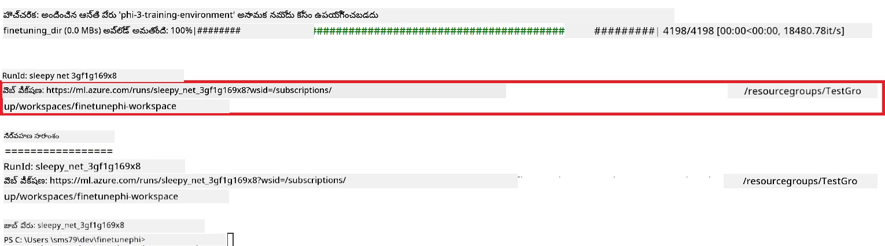

### ఫైన్-ట్యూన్ చేసిన మోడల్‌ను డిప్లాయ్ చేయండి

ఫైన్-ట్యూన్ చేసిన Phi-3 మోడల్‌ను Prompt Flowతో ఇంటిగ్రేట్ చేయాలంటే, మోడల్‌ను రియల్ టైమ్ ఇన్ఫరెన్స్ కోసం యాక్సెస్ చేయదగినలా డిప్లాయ్ చేయాలి. ఈ ప్రక్రియలో మోడల్‌ను రిజిస్టర్ చేయడం, ఆన్‌లైన్ ఎండ్పాయింట్ సృష్టించడం, మరియు మోడల్‌ను డిప్లాయ్ చేయడం ప్రధానంగా ఉంటాయి.

#### డిప్లాయ్‌మెంట్ కొరకు మోడల్ పేరు, ఎండ్పాయింట్ పేరు, మరియు డిప్లాయ్‌మెంట్ పేరు సెట్ చేయండి

1. *config.py* ఫైల్‌ను ఓపెన్ చేయండి.

1. `AZURE_MODEL_NAME = "your_fine_tuned_model_name"` ను మీ మోడల్‌కు కావలసిన పేరుతో మార్చండి.

1. `AZURE_ENDPOINT_NAME = "your_fine_tuned_model_endpoint_name"` ను మీ ఎండ్పాయింట్‌కు కావలసిన పేరుతో మార్చండి.

1. `AZURE_DEPLOYMENT_NAME = "your_fine_tuned_model_deployment_name"` ను మీ డిప్లాయ్‌మెంట్‌కు కావలసిన పేరుతో మార్చండి.

#### *deploy_model.py* ఫైల్‌లో కోడ్ జత చేయండి

*deploy_model.py* ఫైల్ రన్ చేయడం ద్వారా మొత్తం డిప్లాయ్‌మెంట్ ప్రక్రియ ఆటోమేటిక్‌గా పూర్తి అవుతుంది. ఇది మోడల్‌ను రిజిస్టర్ చేసి, ఎండ్పాయింట్‌ను సృష్టించి, config.py ఫైల్‌లో స్పష్టమైన సెట్టింగ్స్ ఆధారంగా డిప్లాయ్‌మెంట్‌ను అమలు చేస్తుంది, అందులో మోడల్ పేరు, ఎండ్పాయింట్ పేరు మరియు డిప్లాయ్‌మెంట్ పేరు ఉంటాయి.

1. Visual Studio Codeలో *deploy_model.py* ఫైల్ తెరవండి.

1. *deploy_model.py* లో క్రింది కోడ్‌ను జత చేయండి.

    ```python
    import logging
    from azure.identity import AzureCliCredential
    from azure.ai.ml import MLClient
    from azure.ai.ml.entities import Model, ProbeSettings, ManagedOnlineEndpoint, ManagedOnlineDeployment, IdentityConfiguration, ManagedIdentityConfiguration, OnlineRequestSettings
    from azure.ai.ml.constants import AssetTypes

    # కాన్ఫిగరేషన్ దిగుమతులు
    from config import (
        AZURE_SUBSCRIPTION_ID,
        AZURE_RESOURCE_GROUP_NAME,
        AZURE_ML_WORKSPACE_NAME,
        AZURE_MANAGED_IDENTITY_RESOURCE_ID,
        AZURE_MANAGED_IDENTITY_CLIENT_ID,
        AZURE_MODEL_NAME,
        AZURE_ENDPOINT_NAME,
        AZURE_DEPLOYMENT_NAME
    )

    # స్థిరాంకాలు
    JOB_NAME = "your-job-name"
    COMPUTE_INSTANCE_TYPE = "Standard_E4s_v3"

    deployment_env_vars = {
        "SUBSCRIPTION_ID": AZURE_SUBSCRIPTION_ID,
        "RESOURCE_GROUP_NAME": AZURE_RESOURCE_GROUP_NAME,
        "UAI_CLIENT_ID": AZURE_MANAGED_IDENTITY_CLIENT_ID,
    }

    # లాగింగ్ సెటప్
    logging.basicConfig(
        format="%(asctime)s - %(levelname)s - %(name)s - %(message)s",
        datefmt="%Y-%m-%d %H:%M:%S",
        level=logging.DEBUG
    )
    logger = logging.getLogger(__name__)

    def get_ml_client():
        """Initialize and return the ML Client."""
        credential = AzureCliCredential()
        return MLClient(credential, AZURE_SUBSCRIPTION_ID, AZURE_RESOURCE_GROUP_NAME, AZURE_ML_WORKSPACE_NAME)

    def register_model(ml_client, model_name, job_name):
        """Register a new model."""
        model_path = f"azureml://jobs/{job_name}/outputs/artifacts/paths/model_output"
        logger.info(f"Registering model {model_name} from job {job_name} at path {model_path}.")
        run_model = Model(
            path=model_path,
            name=model_name,
            description="Model created from run.",
            type=AssetTypes.MLFLOW_MODEL,
        )
        model = ml_client.models.create_or_update(run_model)
        logger.info(f"Registered model ID: {model.id}")
        return model

    def delete_existing_endpoint(ml_client, endpoint_name):
        """Delete existing endpoint if it exists."""
        try:
            endpoint_result = ml_client.online_endpoints.get(name=endpoint_name)
            logger.info(f"Deleting existing endpoint {endpoint_name}.")
            ml_client.online_endpoints.begin_delete(name=endpoint_name).result()
            logger.info(f"Deleted existing endpoint {endpoint_name}.")
        except Exception as e:
            logger.info(f"No existing endpoint {endpoint_name} found to delete: {e}")

    def create_or_update_endpoint(ml_client, endpoint_name, description=""):
        """Create or update an endpoint."""
        delete_existing_endpoint(ml_client, endpoint_name)
        logger.info(f"Creating new endpoint {endpoint_name}.")
        endpoint = ManagedOnlineEndpoint(
            name=endpoint_name,
            description=description,
            identity=IdentityConfiguration(
                type="user_assigned",
                user_assigned_identities=[ManagedIdentityConfiguration(resource_id=AZURE_MANAGED_IDENTITY_RESOURCE_ID)]
            )
        )
        endpoint_result = ml_client.online_endpoints.begin_create_or_update(endpoint).result()
        logger.info(f"Created new endpoint {endpoint_name}.")
        return endpoint_result

    def create_or_update_deployment(ml_client, endpoint_name, deployment_name, model):
        """Create or update a deployment."""

        logger.info(f"Creating deployment {deployment_name} for endpoint {endpoint_name}.")
        deployment = ManagedOnlineDeployment(
            name=deployment_name,
            endpoint_name=endpoint_name,
            model=model.id,
            instance_type=COMPUTE_INSTANCE_TYPE,
            instance_count=1,
            environment_variables=deployment_env_vars,
            request_settings=OnlineRequestSettings(
                max_concurrent_requests_per_instance=3,
                request_timeout_ms=180000,
                max_queue_wait_ms=120000
            ),
            liveness_probe=ProbeSettings(
                failure_threshold=30,
                success_threshold=1,
                period=100,
                initial_delay=500,
            ),
            readiness_probe=ProbeSettings(
                failure_threshold=30,
                success_threshold=1,
                period=100,
                initial_delay=500,
            ),
        )
        deployment_result = ml_client.online_deployments.begin_create_or_update(deployment).result()
        logger.info(f"Created deployment {deployment.name} for endpoint {endpoint_name}.")
        return deployment_result

    def set_traffic_to_deployment(ml_client, endpoint_name, deployment_name):
        """Set traffic to the specified deployment."""
        try:
            # ప్రస్తుత ఎండ్‌పాయింట్ వివరాలను తెచ్చుకోండి
            endpoint = ml_client.online_endpoints.get(name=endpoint_name)
            
            # డీబగ్గింగ్ కోసం ప్రస్తుత ట్రాఫిక్ కేటాయింపును లాగ్ చేయండి
            logger.info(f"Current traffic allocation: {endpoint.traffic}")
            
            # డిప్లాయ్‌మెంట్‌కు ట్రాఫిక్ కేటాయింపును సెట్ చేయండి
            endpoint.traffic = {deployment_name: 100}
            
            # కొత్త ట్రాఫిక్ కేటాయింపుతో ఎండ్‌పాయింట్‌ను అప్డేట్ చేయండి
            endpoint_poller = ml_client.online_endpoints.begin_create_or_update(endpoint)
            updated_endpoint = endpoint_poller.result()
            
            # డీబగ్గింగ్ కోసం అప్డేట్ చేసిన ట్రాఫిక్ కేటాయింపును లాగ్ చేయండి
            logger.info(f"Updated traffic allocation: {updated_endpoint.traffic}")
            logger.info(f"Set traffic to deployment {deployment_name} at endpoint {endpoint_name}.")
            return updated_endpoint
        except Exception as e:
            # ప్రక్రియలో జరిగే ఏదైనా పొరపాటును లాగ్ చేయండి
            logger.error(f"Failed to set traffic to deployment: {e}")
            raise


    def main():
        ml_client = get_ml_client()

        registered_model = register_model(ml_client, AZURE_MODEL_NAME, JOB_NAME)
        logger.info(f"Registered model ID: {registered_model.id}")

        endpoint = create_or_update_endpoint(ml_client, AZURE_ENDPOINT_NAME, "Endpoint for finetuned Phi-3 model")
        logger.info(f"Endpoint {AZURE_ENDPOINT_NAME} is ready.")

        try:
            deployment = create_or_update_deployment(ml_client, AZURE_ENDPOINT_NAME, AZURE_DEPLOYMENT_NAME, registered_model)
            logger.info(f"Deployment {AZURE_DEPLOYMENT_NAME} is created for endpoint {AZURE_ENDPOINT_NAME}.")

            set_traffic_to_deployment(ml_client, AZURE_ENDPOINT_NAME, AZURE_DEPLOYMENT_NAME)
            logger.info(f"Traffic is set to deployment {AZURE_DEPLOYMENT_NAME} at endpoint {AZURE_ENDPOINT_NAME}.")
        except Exception as e:
            logger.error(f"Failed to create or update deployment: {e}")

    if __name__ == "__main__":
        main()

    ```

1. `JOB_NAME` పొందడానికి క్రింది చర్యలు చేయండి:

    - మీరు సృష్టించిన Azure Machine Learning రీసోర్స్‌కు వెళ్ళండి.
    - **Studio web URL** ని సెలెక్ట్ చేసి Azure Machine Learning వర్క్‌స్పేస్‌ను ఓపెన్ చేయండి.
    - ఎడమ వైపు టాబ్ నుండి **Jobs**ని సెలెక్ట్ చేయండి.
    - ఫైన్-ట్యూనింగ్ కోసం ఎక్స్‌పెరిమెంట్ సెలెక్ట్ చేయండి. ఉదాహరణకు, *finetunephi*.
    - మీరు సృష్టించిన జాబ్‌ని సెలెక్ట్ చేయండి.
- మీ జాబ్ పేరు `JOB_NAME = "your-job-name"` ను *deploy_model.py* ఫైల్‌లో కాపీ చేసి పేస్టు చేయండి.

1. `COMPUTE_INSTANCE_TYPE` ను మీ ప్రత్యేక వివరాలతో మార్చండి.

1. Azure మెషీన్ లెర్నింగ్‌లో *deploy_model.py* స్క్రిప్ట్‌ను రన్ చేసి, డిప్లాయ్‌మెంట్ ప్రక్రియను ప్రారంభించడానికి క్రింది కమాండ్ టైప్ చేయండి.

    ```python
    python deploy_model.py
    ```

> [!WARNING]
> మీ ఖాతాకు అదనపు ఛార్జీలను నివారించడానికి, Azure మెషీన్ లెర్నింగ్ వర్క్‌స్పేస్‌లో సృష్టించిన ఎండ్‌పాయింట్‌ను తప్పనిసరిగా డిలీట్ చేయండి.
>

#### Azure మెషీన్ లెర్నింగ్ వర్క్‌స్పేస్‌లో డిప్లాయ్‌మెంట్ స్థితిని తనిఖీ చేయండి

1. [Azure ML Studio](https://ml.azure.com/home?wt.mc_id=studentamb_279723) ను సందర్శించండి.

1. మీరు సృష్టించిన Azure మెషీన్ లెర్నింగ్ వర్క్‌స్పేస్‌కు నావిగేట్ అవ్వండి.

1. Azure మెషీన్ లెర్నింగ్ వర్క్‌స్పేస్‌ను తెరవడానికి **Studio web URL** ని ఎంచుకోండి.

1. ఎడమ వైపు టాబ్ నుండి **Endpoints**ను ఎంచుకోండి.

    

2. మీరు సృష్టించిన ఎండ్‌పాయింట్‌ను ఎంచుకోండి.

    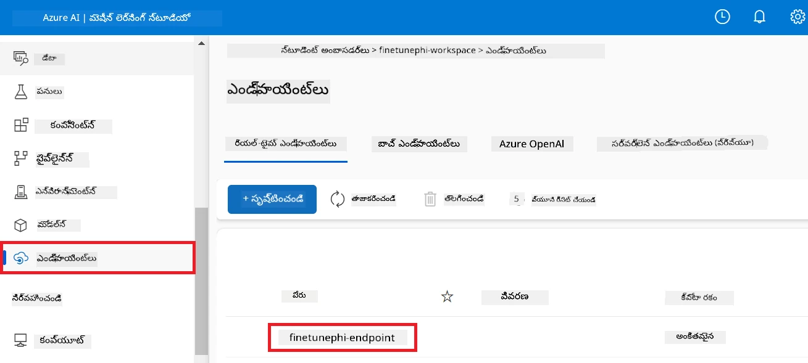

3. ఈ పేజీలో మీరు డిప్లాయ్‌మెంట్ ప్రక్రియలో సృష్టించిన ఎండ్‌పాయింట్లను నిర్వహించవచ్చు.

## ప్రాసంగిక దృశ్యం 3: Prompt flow తో ఇంటిగ్రేట్ చేసి మీ కస్టమ్ మోడల్‌తో చాట్ చేయండి

### కస్టమ్ Phi-3 మోడల్‌ను Prompt flow తో ఇంటిగ్రేట్ చేయండి

మీ ఫైన్-ట్యూనింగ్ చేసిన మోడల్‌ను విజయవంతంగా డిప్లాయ్ చేసిన తర్వాత, ಈಗ మీరు Prompt flow తో అనుసంధానం చేసి, మీ మోడల్‌ను రియల్-టైమ్ అప్లికేషన్లలో ఉపయోగించవచ్చు, మీ కస్టమ్ Phi-3 మోడల్‌తో వివిధ ఇంటరాక్టివ్ పనులను జరుపుకోవచ్చు.

#### ఫైన్-ట్యూన్ చేసిన Phi-3 మోడల్ యొక్క api కీ మరియు ఎండ్‌పాయింట్ URI సెట్ చేయండి

1. మీరు సృష్టించిన Azure మెషీన్ లెర్నింగ్ వర్క్‌స్పేస్‌కు నావిగేట్ అవ్వండి.
1. ఎడమ వైపు టాబ్ నుండి **Endpoints**ను ఎంచుకోండి.
1. మీరు సృష్టించిన ఎండ్‌పాయింట్‌ను ఎంచుకోండి.
1. నావిగేషన్ మెనూ నుండి **Consume**ను ఎంచుకోండి.
1. మీ **REST endpoint** ను కాపీ చేసి *config.py* ఫైల్‌లో `AZURE_ML_ENDPOINT = "your_fine_tuned_model_endpoint_uri"` ను మీ **REST endpoint** తో మార్చండి.
1. మీ **Primary key** ను కాపీ చేసి *config.py* లో `AZURE_ML_API_KEY = "your_fine_tuned_model_api_key"` ను మీ **Primary key** తో మార్చండి.

    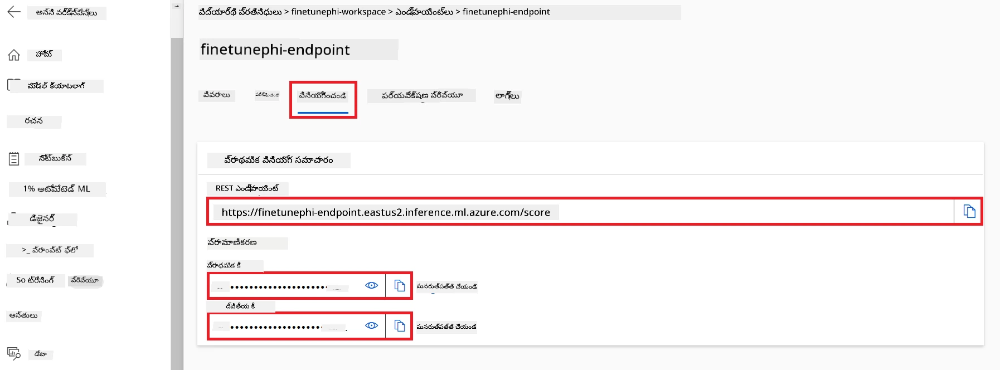

#### *flow.dag.yml* ఫైల్‌లో కోడ్ జోడించండి

1. Visual Studio Code లో *flow.dag.yml* ఫైల్‌ను తెరవండి.

1. క్రింది కోడ్ ను *flow.dag.yml* లో జోడించండి.

    ```yml
    inputs:
      input_data:
        type: string
        default: "Who founded Microsoft?"

    outputs:
      answer:
        type: string
        reference: ${integrate_with_promptflow.output}

    nodes:
    - name: integrate_with_promptflow
      type: python
      source:
        type: code
        path: integrate_with_promptflow.py
      inputs:
        input_data: ${inputs.input_data}
    ```

#### *integrate_with_promptflow.py* ఫైల్‌లో కోడ్ జోడించండి

1. Visual Studio Code లో *integrate_with_promptflow.py* ఫైల్‌ను తెరవండి.

1. క్రింది కోడ్‌ను *integrate_with_promptflow.py* లో జోడించండి.

    ```python
    import logging
    import requests
    from promptflow.core import tool
    import asyncio
    import platform
    from config import (
        AZURE_ML_ENDPOINT,
        AZURE_ML_API_KEY
    )

    # లాగింగ్ సెటప్
    logging.basicConfig(
        format="%(asctime)s - %(levelname)s - %(name)s - %(message)s",
        datefmt="%Y-%m-%d %H:%M:%S",
        level=logging.DEBUG
    )
    logger = logging.getLogger(__name__)

    def query_azml_endpoint(input_data: list, endpoint_url: str, api_key: str) -> str:
        """
        Send a request to the Azure ML endpoint with the given input data.
        """
        headers = {
            "Content-Type": "application/json",
            "Authorization": f"Bearer {api_key}"
        }
        data = {
            "input_data": [input_data],
            "params": {
                "temperature": 0.7,
                "max_new_tokens": 128,
                "do_sample": True,
                "return_full_text": True
            }
        }
        try:
            response = requests.post(endpoint_url, json=data, headers=headers)
            response.raise_for_status()
            result = response.json()[0]
            logger.info("Successfully received response from Azure ML Endpoint.")
            return result
        except requests.exceptions.RequestException as e:
            logger.error(f"Error querying Azure ML Endpoint: {e}")
            raise

    def setup_asyncio_policy():
        """
        Setup asyncio event loop policy for Windows.
        """
        if platform.system() == 'Windows':
            asyncio.set_event_loop_policy(asyncio.WindowsSelectorEventLoopPolicy())
            logger.info("Set Windows asyncio event loop policy.")

    @tool
    def my_python_tool(input_data: str) -> str:
        """
        Tool function to process input data and query the Azure ML endpoint.
        """
        setup_asyncio_policy()
        return query_azml_endpoint(input_data, AZURE_ML_ENDPOINT, AZURE_ML_API_KEY)

    ```

### మీ కస్టమ్ మోడల్‌తో చాట్ చేయండి

1. Azure మెషీన్ లెర్నింగ్‌లో *deploy_model.py* స్క్రిప్ట్‌ను రన్ చేసి, డిప్లాయ్‌మెంట్ ప్రారంభించేందుకు క్రింది కమాండ్‌ను టైప్ చేయండి.

    ```python
    pf flow serve --source ./ --port 8080 --host localhost
    ```

1. ఫలితాల ఉదాహరణ ఇక్కడ ఉంది: ఇప్పుడు మీరు మీ కస్టమ్ Phi-3 మోడల్‌తో చాట్ చేయవచ్చు. ఫైన్-ట్యూనింగ్ కోసం ఉపయోగించిన డేటా ఆధారంగా ప్రశ్నలు అడగడం సిఫార్సు చేయబడింది.

    

---

<!-- CO-OP TRANSLATOR DISCLAIMER START -->
**వైదారణా**:  
ఈ పత్రికను AI అనువాద సేవ [Co-op Translator](https://github.com/Azure/co-op-translator) ఉపయోగించి అనువదించారు. మేము ఖచ్చితత్వం కోసం ప్రయత్నిస్తున్నా, స్వయంచాలక అనువాదాలలో తప్పులు లేదా అపరాధతలు ఉండవచ్చు అని గమనించండి. ప్రకృతిక భాషలో ఉన్న అసలు పత్రికను అధికారిక మూలంగా పరిగణించాలి. ముఖ్యమైన సమాచారానికి, వృత్తిపరమైన మానవ అనువాదం సిఫార్సుచేస్తాము. ఈ అనువాదం వాడకం కారణంగా జరిగిన ఏవైనా అనర్ధాలు లేదా తప్పుదలల కోసం మేము బాధ్యులను కాదు.
<!-- CO-OP TRANSLATOR DISCLAIMER END -->