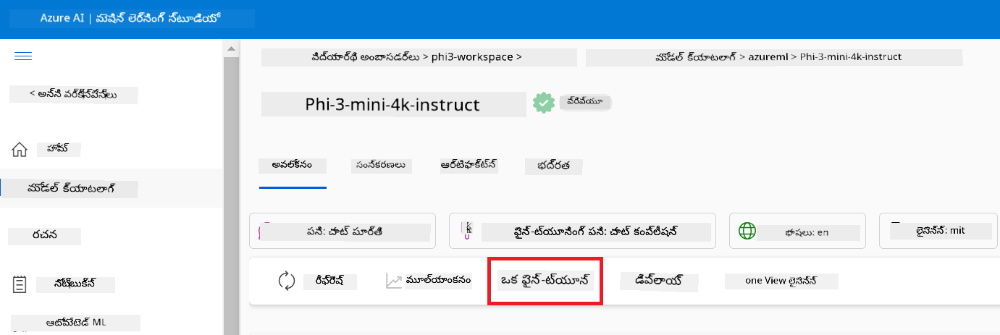
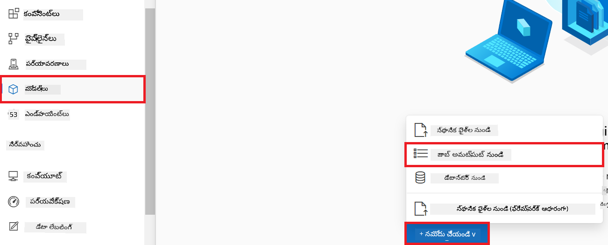
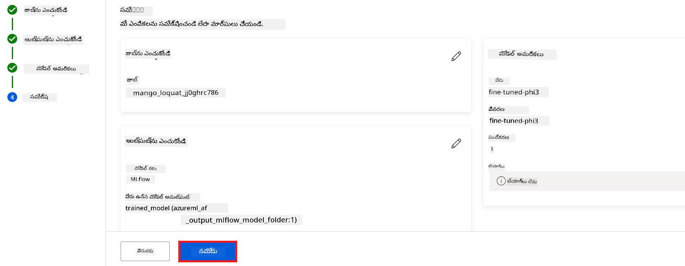
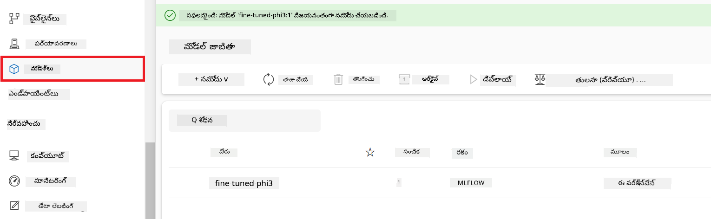
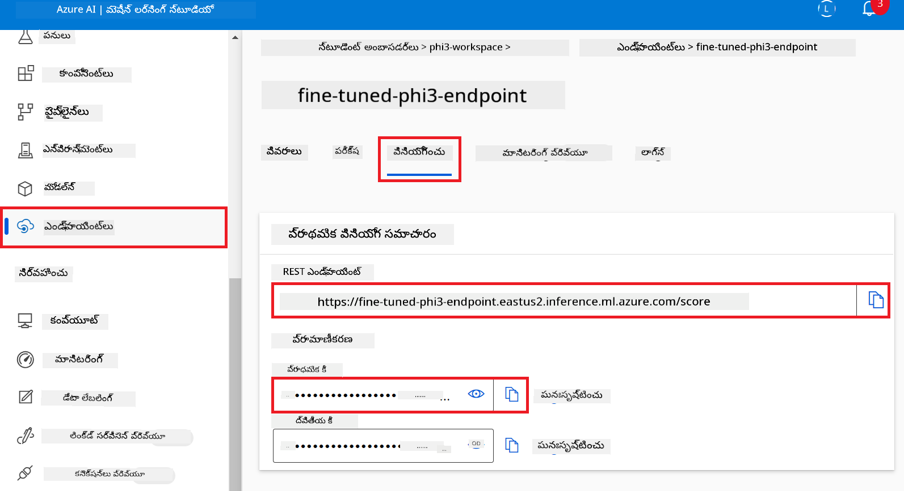
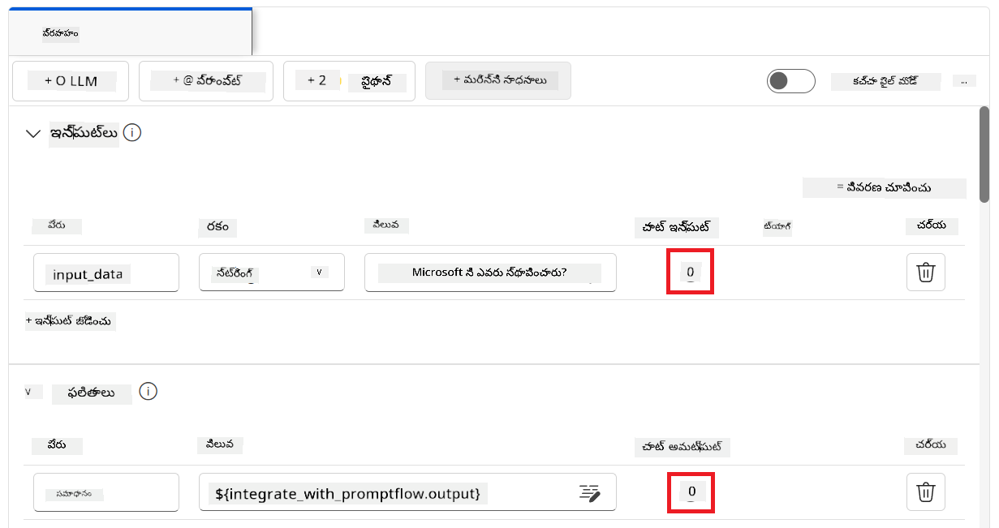
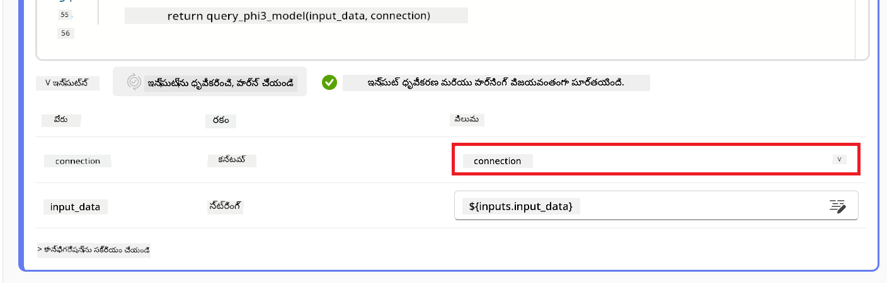
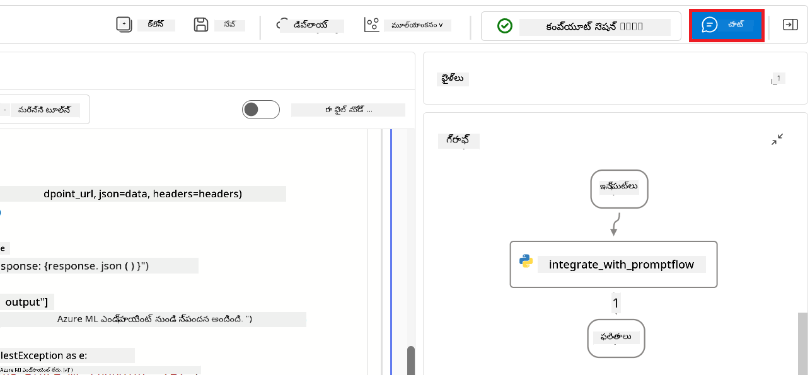

<!--
CO_OP_TRANSLATOR_METADATA:
{
  "original_hash": "ecbd9179a21edbaafaf114d47f09f3e3",
  "translation_date": "2025-12-21T20:44:26+00:00",
  "source_file": "md/02.Application/01.TextAndChat/Phi3/E2E_Phi-3-FineTuning_PromptFlow_Integration_AIFoundry.md",
  "language_code": "te"
}
-->
# Azure AI Foundryలో Prompt flow తో కస్టమ్ Phi-3 మోడళ్లను ఫైన్‑ట్యూన్ చేసి ఇంటిగ్రేట్ చేయడం

ఈ end-to-end (E2E) నమూనా Microsoft Tech Communityలోని "[Fine-Tune and Integrate Custom Phi-3 Models with Prompt Flow in Azure AI Foundry](https://techcommunity.microsoft.com/t5/educator-developer-blog/fine-tune-and-integrate-custom-phi-3-models-with-prompt-flow-in/ba-p/4191726?WT.mc_id=aiml-137032-kinfeylo)" గైడ్‌పై ఆధారపడి ఉంటుంది. ఇది ఫైన్‑ట్యూనింగ్, డిప్లాయ్‌మెంట్ మరియు Azure AI Foundryలో Prompt flow తో కస్టమ్ Phi-3 మోడ్లను ఇంటిగ్రేట్ చేసే ప్రకియలను పరిచయం చేస్తుంది.
ఈ E2E నమూనా, "[Fine-Tune and Integrate Custom Phi-3 Models with Prompt Flow](./E2E_Phi-3-FineTuning_PromptFlow_Integration.md)", స్థానికంగా కోడ్ రన్ చేయడం అవసరమయ్యే వెర్షన్ తో భిన్నంగా, ఈ ట్యుటోరియల్ మొత్తం Azure AI / ML Studio లో మీ మోడల్‌ను ఫైన్‑ట్యూన్ చేసి ఇంటిగ్రేట్ చేయడంపై కేంద్రీకృతమైంది.

## సమీక్ష

ఈ E2E నమూనాలో, మీరు Phi-3 మోడల్‌ను ఎలా ఫైన్‑ట్యూన్ చేస్తారు మరియు దీన్ని Azure AI Foundryలో Prompt flow తో ఎలా ఇంటిగ్రేట్ చేయాలో నేర్చుకుంటారు. Azure AI / ML Studioను ఉపయోగించి, మీరు కస్టమ్ AI మోడల్స్‌ను డిప్లాయ్ మరియు ఉపయోగించే వర్క్‌ఫ్లోను నెలకొల్పుతారు. ఈ E2E నమూనా మూడు సన్నివేశాలుగా విభజించబడింది:

**సన్నివేశం 1: Azure వనరులను సెటప్ చేసి ఫైన్‑ట్యూనింగ్‌కు సిద్ధం చేయడం**

**సన్నివేశం 2: Phi-3 మోడల్‌ను ఫైన్‑ట్యూన్ చేసి Azure Machine Learning Studioలో డిప్లాయ్ చేయడం**

**సన్నివేశం 3: Prompt flow తో ఇంటిగ్రేట్ చేసి Azure AI Foundryలో మీ కస్టమ్ మోడల్‌తో చాట్ చేయడం**

ఇదే ఈ E2E నమూనా యొక్క అవలోకనం.


### విషయ సూచిక

1. **[సన్నివేశం 1: Azure వనరులను సెటప్ చేసి ఫైన్‑ట్యూనింగ్‌కు సిద్ధం చేయడం](../../../../../../md/02.Application/01.TextAndChat/Phi3)**
    - [Azure Machine Learning Workspace సృష్టించడం](../../../../../../md/02.Application/01.TextAndChat/Phi3)
    - [Azure Subscriptionలో GPU కోటా అభ్యర్థించడం](../../../../../../md/02.Application/01.TextAndChat/Phi3)
    - [రోల్ అసైన్‌మెంట్ జోడించడం](../../../../../../md/02.Application/01.TextAndChat/Phi3)
    - [ప్రాజెక్ట్ సెటప్ చేయడం](../../../../../../md/02.Application/01.TextAndChat/Phi3)
    - [ఫైన్‑ట్యూనింగ్‌కు dataset సిద్ధం చేయడం](../../../../../../md/02.Application/01.TextAndChat/Phi3)

1. **[సన్నివేశం 2: Phi-3 మోడల్‌ను ఫైన్‑ట్యూన్ చేసి Azure Machine Learning Studioలో డిప్లాయ్ చేయడం](../../../../../../md/02.Application/01.TextAndChat/Phi3)**
    - [Phi-3 మోడల్‌ను ఫైన్‑ట్యూన్ చేయడం](../../../../../../md/02.Application/01.TextAndChat/Phi3)
    - [ఫైన్‑ట్యూన్ చేసిన Phi-3 మోడల్‌ను డిప్లాయ్ చేయడం](../../../../../../md/02.Application/01.TextAndChat/Phi3)

1. **[సన్నివేశం 3: Prompt flow తో ఇంటిగ్రేట్ చేసి Azure AI Foundryలో మీ కస్టమ్ మోడల్‌తో చాట్ చేయడం](../../../../../../md/02.Application/01.TextAndChat/Phi3)**
    - [కస్టమ్ Phi-3 మోడల్‌ను Prompt flowతో ఇంటిగ్రేట్ చేయడం](../../../../../../md/02.Application/01.TextAndChat/Phi3)
    - [మీ కస్టమ్ Phi-3 మోడల్‌తో చాట్ చేయడం](../../../../../../md/02.Application/01.TextAndChat/Phi3)

## సన్నివేశం 1: Azure వనరులను సెటప్ చేసి ఫైన్‑ట్యూనింగ్‌కు సిద్ధం చేయడం

### Azure Machine Learning Workspace సృష్టించడం

1. పోర్టల్ పేజీ టాప్ లోని **search bar**లో *azure machine learning* టైప్ చేసి కనిపించే ఆప్షన్లలోని **Azure Machine Learning**ని ఎంచుకోండి.

    

2. నావిగేషన్ మెనూ నుండి **+ Create** ఎంచుకోండి.

3. నావిగేషన్ మెనూ నుండి **New workspace** ఎంచుకోండి.

    

4. క్రింద ఇవ్వబడిన పనులను చేయండి:

    - మీ Azure **Subscription** ఎంచుకోండి.
    - ఉపయోగించాల్సిన **Resource group** ఎంచుకోండి (తక్కనవసరం అయితే కొత్తదాన్ని సృష్టించండి).
    - **Workspace Name** ఎంటర్ చేయండి. ఇది ప్రత్యేకమైన విలువ ఉండాలి.
    - మీరు ఉపయోగించదలచిన **Region** ఎంచుకోండి.
    - ఉపయోగించాల్సిన **Storage account** ఎంచుకోండి (తక్కనవసరం అయితే కొత్తదాన్ని సృష్టించండి).
    - ఉపయోగించాల్సిన **Key vault** ఎంచుకోండి (తక్కనవసరం అయితే కొత్తదాన్ని సృష్టించండి).
    - ఉపయోగించాల్సిన **Application insights** ఎంచుకోండి (తక్కనవసరం అయితే కొత్తదాన్ని సృష్టించండి).
    - ఉపయోగించాల్సిన **Container registry** ఎంచుకోండి (తక్కనవసరం అయితే కొత్తదాన్ని సృష్టించండి).

    

5. **Review + Create** ఎంచుకోండి.

6. **Create** ఎంచుకోండి.

### Azure Subscriptionలో GPU కోటా అభ్యర్థించడం

ఈ ట్యుటోరియల్‌లో, మీరు GPUs ఉపయోగించి Phi-3 మోడల్‌ను ఫైన్‑ట్యూన్ చేయడం మరియు డిప్లాయ్ చేయడం నేర్చుకుంటారు. ఫైన్‑ట్యూనింగ్ కోసం, మీరు *Standard_NC24ads_A100_v4* GPUని ఉపయోగిస్తారు, దీనికోసం కోటా అభ్యర్థన అవసరం. డిప్లాయ్‌మెంట్ కోసం, మీరు *Standard_NC6s_v3* GPUని ఉపయోగిస్తారు, దీనికోసం కూడా కోటా అభ్యర్థన అవసరం.

> [!NOTE]
>
> Only Pay-As-You-Go subscriptions (the standard subscription type) are eligible for GPU allocation; benefit subscriptions are not currently supported.
>

1. సందర్శించండి [Azure ML Studio](https://ml.azure.com/home?wt.mc_id=studentamb_279723).

1. క్రింద ఇచ్చిన పనులను చేసి *Standard NCADSA100v4 Family* కోటాను అభ్యర్థించండి:

    - ఎడమ పక్క ట్యాబ్ నుండి **Quota** ఎంచుకోండి.
    - ఉపయోగించవలసిన **Virtual machine family**ని ఎంచుకోండి. ఉదాహరణకి, *Standard NCADSA100v4 Family Cluster Dedicated vCPUs* ను ఎంచుకోండి, ఇది *Standard_NC24ads_A100_v4* GPUని కలిగి ఉంటుంది.
    - నావిగేషన్ మెనూ నుండి **Request quota** ఎంచుకోండి.

        

    - Request quota పేజీలో, మీరు ఉపయోగించదలచిన **New cores limit**ను ఎంటర్ చేయండి. ఉదాహరణకి, 24.
    - Request quota పేజీలో **Submit** ను ఎంచుకుని GPU కోటా కోసం అభ్యర్థించండి.

1. క్రింది పనులను చేసి *Standard NCSv3 Family* కోటాను అభ్యర్థించండి:

    - ఎడమ పక్క ట్యాబ్ నుండి **Quota** ఎంచుకోండి.
    - ఉపయోగించవలసిన **Virtual machine family** ని ఎంచుకోండి. ఉదాహరణకి, *Standard NCSv3 Family Cluster Dedicated vCPUs* ను ఎంచుకోండి, ఇది *Standard_NC6s_v3* GPUని కలిగి ఉంటుంది.
    - నావిగేషన్ మెనూ నుండి **Request quota** ఎంచుకోని, Request quota పేజీలో మీ కోసం కావలసిన **New cores limit** (ఉదాహరణకి 24) ని ఎంటర్ చేయండి.
    - Request quota పేజీలో **Submit** ఎంచుకొని GPU కోటాను అభ్యర్థించండి.

### రోల్ అసైన్‌మెంట్ జోడించడం

మీ మోడల్స్‌ను ఫైన్‑ట్యూన్ చేసి డిప్లాయ్ చేయడానికి, మీరు మొదటగా User Assigned Managed Identity (UAI) సృష్టించి దానికి సరైన అనుమతులను అసైన్ చేయాలి. ఈ UAI ను డిప్లాయ్‌మెంట్ సమయంలో authentication కోసం ఉపయోగిస్తారు

#### User Assigned Managed Identity(UAI) సృష్టించడం

1. పోర్టల్ పేజీ టాప్ లోని **search bar**లో *managed identities* టైప్ చేసి కనిపించే ఆప్షన్లలో **Managed Identities**ని ఎంచుకోండి.

    

1. **+ Create** ఎంచుకోండి.

    

1. క్రింద ఇచ్చిన పనులు చేయండి:

    - మీ Azure **Subscription** ఎంచుకోండి.
    - ఉపయోగించాల్సిన **Resource group** ఎంచుకోండి (తక్కనవసరం అయితే కొత్తదాన్ని సృష్టించండి).
    - మీరు ఉపయోగించదలచిన **Region** ఎంచుకోండి.
    - **Name** ని ఎంటర్ చేయండి. ఇది ప్రత్యేకమైన విలువ ఉంటుంది.

    

1. **Review + create** ఎంచుకోండి.

1. **+ Create** ఎంచుకోండి.

#### Managed Identityకి Contributor రోల్ అసైన్‌మెంట్ జోడించడం

1. మీరు సృష్టించిన Managed Identity రీసోర్స్‌కు వెళ్లండి.

1. ఎడమ పక్క ట్యాబ్ నుండి **Azure role assignments** ఎంచుకోండి.

1. నావిగేషన్ మెనూ నుంచి **+Add role assignment** ఎంచుకోండి.

1. Add role assignment పేజీలో, క్రింద ఇచ్చిన పనులను చేయండి:
    - **Scope**ను **Resource group** గా సెట్ చేయండి.
    - మీ Azure **Subscription**ఎంచుకోండి.
    - ఉపయోగించవలసిన **Resource group** ఎంచుకోండి.
    - **Role**ను **Contributor**గా ఎంచుకోండి.

    

2. **Save** ఎంచుకోండి.

#### Managed Identityకి Storage Blob Data Reader రోల్ అసైన్‌మెంట్ జోడించడం

1. పోర్టల్ పేజీ టాప్ లోని **search bar**లో *storage accounts* టైప్ చేసి కనిపించే ఆప్షన్లలో **Storage accounts**ను ఎంచుకోండి.

    

1. మీరు సృష్టించిన Azure Machine Learning workspace కి సంబంధించిన storage account ని ఎంచుకోండి. ఉదాహరణకి, *finetunephistorage*.

1. Add role assignment పేజీకి నావిగేట్ చేయడానికి క్రింది పనులను చేయండి:

    - మీరు సృష్టించిన Azure Storage accountకి నావిగేట్ చేయండి.
    - ఎడమ పక్క ట్యాబ్ నుండి **Access Control (IAM)** ఎంచుకోండి.
    - నావిగేషన్ మెనూ నుండి **+ Add** ఎంచుకోండి.
    - **Add role assignment** ఎంచుకోండి.

    

1. Add role assignment పేజీలో క్రింద ఇచ్చిన పనులను చేయండి:

    - Role పేజీలో **search bar**లో *Storage Blob Data Reader* టైప్ చేసి కనిపించే ఆప్షన్లలో **Storage Blob Data Reader**ను ఎంచుకోండి.
    - Role పేజీలో **Next** ఎంచుకోండి.
    - Members పేజీలో **Assign access to** ను **Managed identity**గా ఎంచుకోండి.
    - Members పేజీలో **+ Select members** ఎంచుకోండి.
    - Select managed identities పేజీలో మీ Azure **Subscription** ఎంచుకోండి.
    - Select managed identities పేజీలో **Managed identity**ని ఎంచుకోండి.
    - Select managed identities పేజీలో మీరు సృష్టించిన Managed Identityని ఎంచుకోండి. ఉదాహరణకి, *finetunephi-managedidentity*.
    - Select managed identities పేజీలో **Select** ఎంచుకోండి.

    

1. **Review + assign** ఎంచుకోండి.

#### Managed Identityకి AcrPull రోల్ అసైన్‌మెంట్ జోడించడం

1. పోర్టల్ పేజీ టాప్ లోని **search bar**లో *container registries* టైప్ చేసి కనిపించే ఆప్షన్లలో **Container registries**ని ఎంచుకోండి.

    

1. Azure Machine Learning workspace కి సంబంధించిన container registryని ఎంచుకోండి. ఉదాహరణకి, *finetunephicontainerregistry*

1. Add role assignment పేజీకి నావిగేట్ చేయడానికి క్రింది పనులు చేయండి:

    - ఎడమ పక్క ట్యాబ్ నుండి **Access Control (IAM)** ఎంచుకోండి.
    - నావిగేషన్ మెనూ నుండి **+ Add** ఎంచుకోండి.
    - **Add role assignment** ఎంచుకోండి.

1. Add role assignment పేజీలో క్రింది పనులను చేయండి:

    - Role పేజీలో **search bar**లో *AcrPull* టైప్ చేసి కనిపించే ఆప్షన్లలో **AcrPull**ను ఎంచుకోండి.
    - Role పేజీలో **Next** ఎంచుకోండి.
    - Members పేజీలో **Assign access to** ను **Managed identity**గా ఎంచుకోండి.
    - Members పేజీలో **+ Select members** ఎంచుకోండి.
    - Select managed identities పేజీలో మీ Azure **Subscription** ఎంచుకోండి.
    - Select managed identities పేజీలో **Managed identity**ను ఎంచుకోండి.
    - Select managed identities పేజీలో మీరు సృష్టించిన Managed Identityని ఎంచుకోండి. ఉదాహరణకి, *finetunephi-managedidentity*.
    - Select managed identities పేజీలో **Select** ఎంచుకోండి.
    - **Review + assign** ఎంచుకోండి.

### ప్రాజెక్ట్ సెటప్ చేయడం

ఫైన్‑ట్యూనింగ్ కోసం అవసరమైన datasets డౌన్‌లోడ్ చేయడానికి, మీరు స్థానిక పరిసరాన్ని సెటప్ చేయాలి.

ఈ వ్యాయామంలో, మీరు

- పని చేయడానికి ఒక ఫోల్డర్ సృష్టించండి.
- ఒక వర్చువల్ ఎన్విరాన్మెంట్ సృష్టించండి.
- అవసరమైన ప్యాకేజీలు ఇన్స్టాల్ చేయండి.
- dataset డౌన్‌లోడ్ చేయడానికి *download_dataset.py* ఫైల్ సృష్టించండి.

#### పని చేయడానికి ఫోల్డర్ సృష్టించడం

1. టెర్మినల్ విండో ఓపెన్ చేసి డిఫాల్ట్ పాథ్‌లో *finetune-phi* అనే ఫోల్డర్ ను సృష్టించడానికి క్రింద ఇచ్చిన కమాండ్ టైప్ చేయండి.

    ```console
    mkdir finetune-phi
    ```

2. టెర్మినల్‌లో క్రింది కమాండ్ టైప్ చేసి మీరు సృష్టించిన *finetune-phi* ఫోల్‌డర్‌కు నావిగేట్ చేయండి.

    ```console
    cd finetune-phi
    ```

#### Create a virtual environment

1. టెర్మినల్‌లో క్రింది కమాండ్ టైప్ చేసి *.venv* అనే పేరుతో వర్చువల్ ఎన్విరాన్‌మెంట్‌ని సృష్టించండి.

    ```console
    python -m venv .venv
    ```

2. టెర్మినల్‌లో క్రింది కమాండ్ టైప్ చేసి వర్చువల్ ఎన్విరాన్‌మెంట్‌ను యాక్టివేట్ చేయండి.

    ```console
    .venv\Scripts\activate.bat
    ```

> [!NOTE]
> సహేతుకంగా జరిగితే, కమాండ్ ప్రాంప్ట్‌కు ముందు *(.venv)* కనిపించాలి.

#### Install the required packages

1. అవసరమైన ప్యాకేజీలను ఇన్స్టాల్ చేయడానికి టెర్మినల్‌లో క్రింది కమాండ్లను టైప్ చేయండి.

    ```console
    pip install datasets==2.19.1
    ```

#### Create `donload_dataset.py`

> [!NOTE]
> పూర్తి ఫోల్డర్ నిర్మాణం:
>
> ```text
> └── YourUserName
> .    └── finetune-phi
> .        └── download_dataset.py
> ```

1. **Visual Studio Code** ఓపెన్ చేయండి.

1. మెను బార్ నుండి **File** ఎంచుకోండి.

1. **Open Folder** ఎంచుకోండి.

1. మీరు సృష్టించిన *finetune-phi* ఫోల్డర్‌ను ఎంచుకోండి, ఇది *C:\Users\yourUserName\finetune-phi*లో ఉంది.

    

1. Visual Studio Code యొక్క బలవైపు ప్యానెల్‌లో రైట్‑క్లిక్ చేసి **New File** ను ఎంచుకుని *download_dataset.py* పేరుతో కొత్త ఫైల్‌ను సృష్టించండి.

    

### Prepare dataset for fine-tuning

ఈ వ్యాయామంలో, మీరు *download_dataset.py* ఫైల్‌ను ర‌న్ చేసి *ultrachat_200k* datasets ను మీ లోకల్ ఎన్విరాన్‌మెంట్‌కు డౌన్లోడ్ చేస్తారు. ఆపై మీరు ఈ datasets ను Azure Machine Learningలో Phi-3 మోడల్‌ను ఫైనెట్‍यూన్ చేయడానికి ఉపయోగిస్తారు.

ఈ వ్యాయామంలో, మీరు:

- డేటాసెట్స్ డౌన్లోడ్ చేయడానికి *download_dataset.py* ఫైల్‌లో కోడ్‌ను జోడించండి.
- datasets ను మీ లోకల్ ఎన్విరాన్‌మెంట్‌లో డౌన్లోడ్ చేయడానికి *download_dataset.py* ఫైల్‌ను రన్ చేయండి.

#### Download your dataset using *download_dataset.py*

1. Visual Studio Codeలో *download_dataset.py* ఫైల్‌ను ఓపెన్ చేయండి.

1. క్రింది కోడ్‌ను *download_dataset.py* ఫైల్‌లో జోడించండి.

    ```python
    import json
    import os
    from datasets import load_dataset

    def load_and_split_dataset(dataset_name, config_name, split_ratio):
        """
        Load and split a dataset.
        """
        # నిర్దిష్ట పేరు, కాన్ఫిగరేషన్ మరియు విభజన నిష్టతితో డేటాసెట్‌ను లోడ్ చేయండి
        dataset = load_dataset(dataset_name, config_name, split=split_ratio)
        print(f"Original dataset size: {len(dataset)}")
        
        # డేటాసెట్‌ను శిక్షణ మరియు పరీక్ష సెట్లుగా విభజించండి (80% శిక్షణ, 20% పరీక్ష)
        split_dataset = dataset.train_test_split(test_size=0.2)
        print(f"Train dataset size: {len(split_dataset['train'])}")
        print(f"Test dataset size: {len(split_dataset['test'])}")
        
        return split_dataset

    def save_dataset_to_jsonl(dataset, filepath):
        """
        Save a dataset to a JSONL file.
        """
        # డైరెక్టరీ కలగకపోతే సృష్టించండి
        os.makedirs(os.path.dirname(filepath), exist_ok=True)
        
        # ఫైల్‌ను వ్రాయే మోడ్‌లో తెరవండి
        with open(filepath, 'w', encoding='utf-8') as f:
            # డేటాసెట్‌లోని ప్రతి రికార్డ్‌పై పునరావృతంగా నడపండి
            for record in dataset:
                # రికార్డును JSON ఆబ్జెక్ట్‌గా మార్చి ఫైల్‌లో వ్రాయండి
                json.dump(record, f)
                # రికార్డులను విడగొట్టడానికి ఒక newline అక్షరాన్ని వ్రాయండి
                f.write('\n')
        
        print(f"Dataset saved to {filepath}")

    def main():
        """
        Main function to load, split, and save the dataset.
        """
        # నిర్దిష్ట కాన్ఫిగరేషన్ మరియు విభజన నిష్పత్తితో ULTRACHAT_200k డేటాసెట్‌ను లోడ్ చేసి విభజించండి
        dataset = load_and_split_dataset("HuggingFaceH4/ultrachat_200k", 'default', 'train_sft[:1%]')
        
        # స్ప్లిట్ నుండి శిక్షణ మరియు పరీక్ష డేటాసెట్‌లను తీసుకోండి
        train_dataset = dataset['train']
        test_dataset = dataset['test']

        # శిక్షణ డేటాసెట్‌ను JSONL ఫైల్‌గా సేవ్ చేయండి
        save_dataset_to_jsonl(train_dataset, "data/train_data.jsonl")
        
        # పరీక్ష డేటాసెట్‌ను వేరే JSONL ఫైల్‌లో సేవ్ చేయండి
        save_dataset_to_jsonl(test_dataset, "data/test_data.jsonl")

    if __name__ == "__main__":
        main()

    ```

1. స్క్రిప్ట్‌ను రన్ చేసి datasetను teie లోకల్ ఎన్విరాన్‌మెంట్‌కు డౌన్లోడ్ చేయడానికి టెర్మినల్‌లో క్రింది కమాండ్ టైప్ చేయండి.

    ```console
    python download_dataset.py
    ```

1. datasets విజయవంతంగా మీ లోకల్ *finetune-phi/data* డైరెక్టరీలో సేవ్ అయినాయో లేదో ధృవీకరించండి.

> [!NOTE]
>
> #### డేటాసెట్ పరిమాణం మరియు ఫైన్‑ట్యూనింగ్ సమయంపై గమనిక
>
> ఈ ట్యూటోరియల్‌లో, మీరు datasetలోని కేవలం 1% (`split='train[:1%]'`) మాత్రమే ఉపయోగిస్తున్నారు. ఇది డేటా పరిమాణాన్ని గణనీయంగా తగ్గిస్తుంది, అప్‌లోడ్ మరియు ఫైన్‑ట్యూనింగ్ ప్రక్రియలను వేగవంతం చేస్తుంది. శిక్షణ సమయం మరియు మోడల్ పనితీరు మధ్య సరైన సంతులనం కనుగొనడానికి మీరు శాతం మార్చుకోవచ్చు. చిన్న ఉపసెట్ ఉపయోగించడం ఫైన్‑ట్యూనింగ్‌కు కావలసిన సమయాన్ని తగ్గిస్తుంది, ట్యూటోరియల్ కోసం ప్రక్రియను మరింత నిర్వహించదగినదిగా చేస్తుంది.

## Scenario 2: Fine-tune Phi-3 model and Deploy in Azure Machine Learning Studio

### Fine-tune the Phi-3 model

ఈ వ్యాయామంలో, మీరు Azure Machine Learning Studioలో Phi-3 మోడల్‌ను ఫైన్‑ట్యూన్ చేస్తారు.

ఈ వ్యాయామంలో, మీరు:

- ఫైన్‑ట్యూనింగ్ కోసం compute క్లస్టర్‌ను సృష్టించండి.
- Azure Machine Learning Studioలో Phi-3 మోడల్‌ను ఫైన్‑ట్యూన్ చేయండి.

#### Create computer cluster for fine-tuning

1. సందర్శించండి [Azure ML Studio](https://ml.azure.com/home?wt.mc_id=studentamb_279723).

1. ఎడమ బారులోని ట్యాబ్ నుండి **Compute** ఎంచుకోండి.

1. నావిగేషన్ మెనూలో నుండి **Compute clusters** ఎంచుకోండి.

1. **+ New** ఎంచుకోండి.

    

1. క్రింది పనులను చేయండి:

    - మీరు ఉపయోగించదలిచిన **Region** ఎంచుకోండి.
    - **Virtual machine tier** ను **Dedicated** గా ఎంచుకోండి.
    - **Virtual machine type** ను **GPU** గా ఎంచుకోండి.
    - **Virtual machine size** ఫిల్టర్‌ను **Select from all options** గా ఎంచుకోండి.
    - **Virtual machine size** ను **Standard_NC24ads_A100_v4** గా ఎంచుకోండి.

    

1. **Next** ఎంచుకోండి.

1. క్రింది పనులను చేయండి:

    - **Compute name** ను నమోదు చెయ్యండి. ఇది ఒక ప్రత్యేకమైన విలువగా ఉండాలి.
    - **Minimum number of nodes** ను **0** గా ఎంచుకోండి.
    - **Maximum number of nodes** ను **1** గా ఎంచుకోండి.
    - **Idle seconds before scale down** ను **120** గా ఎంచుకోండి.

    

1. **Create** ఎంచుకోండి.

#### Fine-tune the Phi-3 model

1. సందర్శించండి [Azure ML Studio](https://ml.azure.com/home?wt.mc_id=studentamb_279723).

1. మీరు సృష్టించిన Azure Machine Learning workspaceని ఎంచుకోండి.

    

1. క్రింది పనులను చేయండి:

    - ఎడమ బారులోని ట్యాబ్ నుండి **Model catalog** ఎంచుకోండి.
    - **search bar**లో *phi-3-mini-4k* టైపు చేసి కనబడిన ఎంపికలలోనుండి **Phi-3-mini-4k-instruct** ను ఎంచుకోండి.

    

1. నావిగేషన్ మెనూలో నుండి **Fine-tune** ఎంచుకోండి.

    

1. క్రింది పనులను చేయండి:

    - **Select task type** ను **Chat completion** గా ఎంచుకోండి.
    - **+ Select data** ను ఎంచుకుని **Traning data** అప్లోడ్ చేయండి.
    - Validation data అప్లోడ్ టైప్‌ను **Provide different validation data** గా ఎంచుకోండి.
    - **+ Select data** ను ఎంచుకుని **Validation data** అప్లోడ్ చేయండి.

    

    > [!TIP]
    >
    > మీరు **Advanced settings** ను ఎంచుకుని **learning_rate** మరియు **lr_scheduler_type** వంటి కాన్ఫిగరేషన్లను అనుకూలీకరించి ఫైన్‑ట్యూనింగ్ ప్రక్రియను మీ నిర్దిష్ట అవసరాలకు అనుగుణంగా మెరుగుపరచవచ్చు.

1. **Finish** ఎంచుకోండి.

1. ఈ వ్యాయామంలో, మీరు Azure Machine Learning ఉపయోగించి విజయవంతంగా Phi-3 మోడల్‌ను ఫైన్‑ట్యూన్ చేశారు. దయచేసి గమనించండి, ఫైన్‑ట్యూనింగ్ ప్రక్రియకు గణనీయమైన సమయం పట్టవచ్చు. ఫైన్‑ట్యూనింగ్ జాబ్ ను నడిపిన తర్వాత అది పూర్తయ్యేవరకు మీకు వేచివుంటాలి. ఫైన్‑ట్యూనింగ్ జాబ్ స్థితిని మానిటర్ చేయడానికి మీరు Azure Machine Learning Workspace యొక్క ఎడమ వైపు ఉన్న Jobs ట్యాబ్‌‌కి వెళ్లి చూడవచ్చు. తదుపరి సెరీస్‌లో, మీరు ఫైన్‑ట్యూన్ చేసిన మోడల్‌ను డిప్లాయ్ చేసి దాన్ని Prompt flowతో ఇంటిగ్రేట్ చేస్తారు.

    

### Deploy the fine-tuned Phi-3 model

ఫైన్‑ట్యూన్ చేసిన Phi-3 మోడల్‌ను Prompt flowతో ఇంటిగ్రేట్ చేయడానికి, రియల్‑టైమ్ ఇన్ఫరెన్స్ కోసం మోడల్ ప్రవేశానికి అనువుగా ఉండేలా డిప్లాయ్ చేయాలి. ఈ ప్రక్రియలో మోడల్‌ను రిజిస్టర్ చేయడం, ఒక ఆన్‌లైన్ ఎండ్‌పాయింట్ సృష్టించడం, మరియు మోడల్‌ను డిప్లాయ్ చేయడం జరుగుతుంది.

ఈ వ్యాయామంలో, మీరు:

- Azure Machine Learning workspaceలో ఫైన్‑ట్యూన్ చేసిన మోడల్‌ను రిజిస్టర్ చేయండి.
- ఒక ఆన్‌లైన్ ఎండ్‌పాయింట్ సృష్టించండి.
- రిజిస్టర్ చేసిన ఫైన్‑ట్యూన్ చేసిన Phi-3 మోడల్‌ను డిప్లాయ్ చేయండి.

#### Register the fine-tuned model

1. సందర్శించండి [Azure ML Studio](https://ml.azure.com/home?wt.mc_id=studentamb_279723).

1. మీరు సృష్టించిన Azure Machine Learning workspaceని ఎంచుకోండి.

    

1. ఎడమ బారులోని ట్యాబ్ నుండి **Models** ఎంచుకోండి.
1. **+ Register** ఎంచుకోండి.
1. **From a job output** ఎంచుకోండి.

    

1. మీరు సృష్టించిన జాబ్‌ను ఎంచుకోండి.

    

1. **Next** ఎంచుకోండి.

1. **Model type** ను **MLflow** గా ఎంచుకోండి.

1. **Job output** ఎంచుకోబడిందని నిర్ధారించండి; అది ఆపోమాటంగా ఎంచుకోబడుతుంది.

    

2. **Next** ఎంచుకోండి.

3. **Register** ఎంచుకోండి.

    

4. ఎడమ బారులోని ట్యాబ్ నుండి **Models** మెనూకి వెళ్లి మీ రిజిస్టర్ చేసిన మోడల్‌ను చూడవచ్చు.

    

#### Deploy the fine-tuned model

1. మీరు సృష్టించిన Azure Machine Learning workspace‌కి నావిగేట్ చేయండి.

1. ఎడమ బారులోని ట్యాబ్ నుండి **Endpoints** ఎంచుకోండి.

1. నావిగేషన్ మెనూలో నుండి **Real-time endpoints** ఎంచుకోండి.

    

1. **Create** ఎంచుకోండి.

1. మీరు రిజిస్టర్ చేసిన మోడల్‌ను ఎంచుకోండి.

    

1. **Select** ఎంచుకోండి.

1. క్రింది పనులను చేయండి:

    - **Virtual machine** ను *Standard_NC6s_v3* గా ఎంచుకోండి.
    - మీరు ఉపయోగించదలిచిన **Instance count** ను ఎంచుకోండి. ఉదాహరణకు, *1*.
    - **Endpoint** ను కొత్తదిగా సృష్టించడానికి **New** గా ఎంచుకోండి.
    - **Endpoint name** ను నమోదు చేయండి. ఇది ఒక ప్రత్యేకమైన విలువగా ఉండాలి.
    - **Deployment name** ను నమోదు చేయండి. ఇది ఒక ప్రత్యేకమైన విలువగా ఉండాలి.

    

1. **Deploy** ఎంచుకోండి.

> [!WARNING]
> మీ ఖాతాకు అదనపు ఛార్జీలు రాకుండా ఉండాలంటే, Azure Machine Learning workspaceలో మీరు సృష్టించిన ఎండ్‌పాయింట్‌ను తప్పకుండా తొలగించండి.
>

#### Check deployment status in Azure Machine Learning Workspace

1. మీరు సృష్టించిన Azure Machine Learning workspaceకి నావిగేట్ చేయండి.

1. ఎడమ బారులోని ట్యాబ్ నుండి **Endpoints** ఎంచుకోండి.

1. మీరు సృష్టించిన ఎండ్‌పాయింట్‌ను ఎంచుకోండి.

    

1. ఈ పేజీలో, మీరు డిప్లాయ్‌మెంట్ ప్రక్రియ సమయంలో ఎండ్‌పాయింట్లను నిర్వహించవచ్చు.

> [!NOTE]
> డిప్లాయ్‌మెంట్ పూర్తి అయిన తర్వాత, **Live traffic** ను **100%** గా సెట్ చేయబడిందో లేదో నిర్ధారించండి. సెటు కాదు అయితే **Update traffic** ఎంచుకుని ట్రాఫిక్ సెట్టింగ్స్‌ను సర్దుబాటు చేయండి. ట్రాఫిక్ 0% గా ఉన్నప్పుడు మీరు మోడల్‌ను పరీక్షించలేరు.
>
> 
>

## Scenario 3: Integrate with Prompt flow and Chat with your custom model in Azure AI Foundry

### Integrate the custom Phi-3 model with Prompt flow

ఫైన్‑ట్యూన్ చేయబడిన మీ మోడల్‌ను విజయవంతంగా డిప్లాయ్ చేసిన తర్వాత, మీరు దాన్ని Prompt Flowతో ఇంటిగ్రేట్ చేసి రియల్‑టైమ్ అప్లికేషన్లలో ఉపయోగించవచ్చు, మీ కస్టమ్ Phi-3 మోడల్‌తో వివిధ ఇంటరాక్టివ్ టాస్క్‌లను సాధించడానికి ఇది అనుమతిస్తుంది.

ఈ వ్యాయామంలో, మీరు:

- Azure AI Foundry Hub సృష్టించండి.
- Azure AI Foundry Project సృష్టించండి.
- Prompt flow సృష్టించండి.
- ఫైన్‑ట్యూన్ చేసిన Phi-3 మోడల్ కోసం ఒక కస్టమ్ కనెక్షన్‌ను జోడించండి.
- మీ కస్టమ్ Phi-3 మోడల్‌తో చాట్ చేయడానికి Prompt flow సెటప్ చేయండి

> [!NOTE]
> మీరు Azure ML Studio ద్వారా కూడా Promptflowతో ఇంటిగ్రేట్ చేయవచ్చు. అదే ఇంటిగ్రేషన్ ప్రక్రియ Azure ML Studioకి కూడా వర్తిస్తుంది.

#### Create Azure AI Foundry Hub

Project సృష్టించే ముందు మీరు Hubను సృష్టించాల్సి ఉంటుంది. Hub అంటే Resource Group లాంటిది, ఇది మీరు Azure AI Foundryలో 여러 Projectలను నిర్వహించడానికి మరియు կազմակերպించడానికి అనుమతిస్తుంది.

1. సందర్శించండి [Azure AI Foundry](https://ai.azure.com/?WT.mc_id=aiml-137032-kinfeylo).

1. ఎడమ బారులోని ట్యాబ్ నుండి **All hubs** ఎంచుకోండి.

1. నావిగేషన్ మెనూలో నుండి **+ New hub** ఎంచుకోండి.
    

1. క్రింది పనులను నిర్వహించండి:

    - **Hub name** ను నమోదు చేయండి. ఇది ప్రత్యేకమైన విలువ కావాలి.
    - మీ Azure **Subscription** ను ఎంచుకోండి.
    - ఉపయోగించాల్సిన **Resource group** ను ఎంచుకోండి (ఆవశ్యకమైతే కొత్తదాన్ని సృష్టించండి).
    - మీరు ఉపయోగించదలచిన **Location** ను ఎంచుకోండి.
    - ఉపయోగించడానికి **Connect Azure AI Services** ను ఎంచుకోండి (ఆవశ్యకమైతే కొత్తదాన్ని సృష్టించండి).
    - **Connect Azure AI Search** కోసం **Skip connecting** ను ఎంచుకోండి.

    

1. **Next** ను ఎంచుకోండి.

#### Create Azure AI Foundry Project

1. మీరు సృష్టించిన హబ్‌లో, ఎడమ వైపు ట్యాబ్ నుండి **All projects** ను ఎంచుకోండి.

1. నావిగేషన్ మెన్యూలోని **+ New project** ను ఎంచుకోండి.

    

1. **Project name** ను నమోదు చేయండి. ఇది ప్రత్యేకమైన విలువ కావాలి.

    

1. **Create a project** ను ఎంచుకోండి.

#### Add a custom connection for the fine-tuned Phi-3 model

To integrate your custom Phi-3 model with Prompt flow, you need to save the model's endpoint and key in a custom connection. This setup ensures access to your custom Phi-3 model in Prompt flow.

#### Set api key and endpoint uri of the fine-tuned Phi-3 model

1. [Azure ML Studio](https://ml.azure.com/home?WT.mc_id=aiml-137032-kinfeylo) ను సందర్శించండి.

1. మీరు సృష్టించిన Azure Machine learning workspaceకి నావిగేట్ చేయండి.

1. ఎడమ వైపు ట్యాబ్ నుంచి **Endpoints** ను ఎంచుకోండి.

    

1. మీరు సృష్టించిన endpoint ను ఎంచుకోండి.

    

1. నావిగేషన్ మెన్యూ నుండి **Consume** ను ఎంచుకోండి.

1. మీ **REST endpoint** మరియు **Primary key** ను కాపీ చేయండి.

    

#### Add the Custom Connection

1. [Azure AI Foundry](https://ai.azure.com/?WT.mc_id=aiml-137032-kinfeylo) ను సందర్శించండి.

1. మీరు సృష్టించిన Azure AI Foundry ప్రాజెక్ట్‌కు నావిగేట్ చేయండి.

1. మీరు సృష్టించిన ప్రాజెక్ట్‌లో, ఎడమ వైపు ట్యాబ్ నుండి **Settings** ను ఎంచుకోండి.

1. **+ New connection** ను ఎంచుకోండి.

    

1. నావిగేషన్ మెన్యూలోని **Custom keys** ను ఎంచుకోండి.

    

1. క్రింది పనులను నిర్వహించండి:

    - **+ Add key value pairs** ను ఎంచుకోండి.
    - కీ పేరుకు **endpoint** ను నమోదు చేసి, Azure ML Studio నుంచి మీరు కాపీ చేసిన endpoint ను value ఫీల్డ్‌లో పేస్ట్ చేయండి.
    - మళ్లీ **+ Add key value pairs** ను ఎంచుకోండి.
    - కీ పేరుకు **key** ను నమోదు చేసి, Azure ML Studio నుంచి మీరు కాపీ చేసిన key ను value ఫీల్డ్‌లో పేస్ట్ చేయండి.
    - కీలు జోడించిన తర్వాత, key బయటకు వెలకుండా **is secret** ను ఎంచుకోండి.

    

1. **Add connection** ను ఎంచుకోండి.

#### Create Prompt flow

You have added a custom connection in Azure AI Foundry. Now, let's create a Prompt flow using the following steps. Then, you will connect this Prompt flow to the custom connection so that you can use the fine-tuned model within the Prompt flow.

1. మీరు సృష్టించిన Azure AI Foundry ప్రాజెక్ట్‌కు నావిగేట్ చేయండి.

1. ఎడమ వైపు ట్యాబ్ నుండి **Prompt flow** ను ఎంచుకోండి.

1. నావిగేషన్ మెన్యూలోని **+ Create** ను ఎంచుకోండి.

    

1. నావిగేషన్ మెన్యూలోని **Chat flow** ను ఎంచుకోండి.

    

1. ఉపయోగించవలసిన **Folder name** ను నమోదు చేయండి.

    

2. **Create** ను ఎంచుకోండి.

#### Set up Prompt flow to chat with your custom Phi-3 model

You need to integrate the fine-tuned Phi-3 model into a Prompt flow. However, the existing Prompt flow provided is not designed for this purpose. Therefore, you must redesign the Prompt flow to enable the integration of the custom model.

1. Prompt flowలో, ఇంటిగ్రేషన్ కోసం ఉన్న ప్రస్తుత ఫ్లోను పునర్నిర్మించడానికి క్రింది పనులు చేయండి:

    - **Raw file mode** ను ఎంచుకోండి.
    - *flow.dag.yml* ఫైల్‌లోని ఉన్న అన్ని కోడ్‌ను తొలగించండి.
    - దిగువ కోడ్‌ను *flow.dag.yml* ఫైల్‌లో జోడించండి.

        ```yml
        inputs:
          input_data:
            type: string
            default: "Who founded Microsoft?"

        outputs:
          answer:
            type: string
            reference: ${integrate_with_promptflow.output}

        nodes:
        - name: integrate_with_promptflow
          type: python
          source:
            type: code
            path: integrate_with_promptflow.py
          inputs:
            input_data: ${inputs.input_data}
        ```

    - **Save** ను ఎంచుకోండి.

    

1. Prompt flowలో కస్టమ్ Phi-3 మోడల్‌ను ఉపయోగించేందుకు *integrate_with_promptflow.py* ఫైల్‌లో దిగువ కోడ్‌ను జోడించండి.

    ```python
    import logging
    import requests
    from promptflow import tool
    from promptflow.connections import CustomConnection

    # లాగింగ్ అమరిక
    logging.basicConfig(
        format="%(asctime)s - %(levelname)s - %(name)s - %(message)s",
        datefmt="%Y-%m-%d %H:%M:%S",
        level=logging.DEBUG
    )
    logger = logging.getLogger(__name__)

    def query_phi3_model(input_data: str, connection: CustomConnection) -> str:
        """
        Send a request to the Phi-3 model endpoint with the given input data using Custom Connection.
        """

        # "connection" అనేది కస్టమ్ కనెక్షన్ పేరు, "endpoint", "key" కస్టమ్ కనెక్షన్‌లో ఉన్న కీలు
        endpoint_url = connection.endpoint
        api_key = connection.key

        headers = {
            "Content-Type": "application/json",
            "Authorization": f"Bearer {api_key}"
        }
        data = {
            "input_data": {
                "input_string": [
                    {"role": "user", "content": input_data}
                ],
                "parameters": {
                    "temperature": 0.7,
                    "max_new_tokens": 128
                }
            }
        }
        try:
            response = requests.post(endpoint_url, json=data, headers=headers)
            response.raise_for_status()
            
            # పూర్తి JSON ప్రతిస్పందనను లాగ్ చేయండి
            logger.debug(f"Full JSON response: {response.json()}")

            result = response.json()["output"]
            logger.info("Successfully received response from Azure ML Endpoint.")
            return result
        except requests.exceptions.RequestException as e:
            logger.error(f"Error querying Azure ML Endpoint: {e}")
            raise

    @tool
    def my_python_tool(input_data: str, connection: CustomConnection) -> str:
        """
        Tool function to process input data and query the Phi-3 model.
        """
        return query_phi3_model(input_data, connection)

    ```

    

> [!NOTE]
> Prompt flow ను Azure AI Foundryలో ఉపయోగించడం గురించి మరింత విపులమైన సమాచారానికి, మీరు [Prompt flow in Azure AI Foundry](https://learn.microsoft.com/azure/ai-studio/how-to/prompt-flow) ను సూచించవచ్చు.

1. మీ మోడల్‌తో చాట్ చేయడానికి **Chat input**, **Chat output** ను ఎంచుకోండి.

    

1. ఇప్పుడు మీరు మీ కస్టమ్ Phi-3 మోడల్‌తో చాట్ చేయడానికి సిద్ధంగా ఉన్నారు. తరువాతి వ్యాయామంలో, మీరు Prompt flowను ఎలా ప్రారంభించాలో మరియు fine-tuned Phi-3 మోడల్‌తో చాట్ చేయడానికి దానిని ఎలా ఉపయోగించాలో నేర్చుకుంటారు.

> [!NOTE]
>
> పునర్నిర్మించిన ఫ్లో దిగువ చిత్రానికానే కనబడాలి:
>
> 
>

### మీ కస్టమ్ Phi-3 మోడల్‌తో చాట్ చేయండి

Now that you have fine-tuned and integrated your custom Phi-3 model with Prompt flow, you are ready to start interacting with it. This exercise will guide you through the process of setting up and initiating a chat with your model using Prompt flow. By following these steps, you will be able to fully utilize the capabilities of your fine-tuned Phi-3 model for various tasks and conversations.

- Prompt flow ఉపయోగించి మీ కస్టమ్ Phi-3 మోడల్‌తో చాట్ చేయండి.

#### Start Prompt flow

1. Prompt flow ప్రారంభించడానికి **Start compute sessions** ను ఎంచుకోండి.

    

1. పరామితులను పునరుద్ధరించడానికి **Validate and parse input** ను ఎంచుకోండి.

    

1. మీరు సృష్టించిన కస్టమ్ కనెక్షన్‌కు **connection** యొక్క **Value** ను ఎంచుకోండి. ఉదాహరణకు, *connection*.

    

#### Chat with your custom model

1. **Chat** ను ఎంచుకోండి.

    

1. ఇక్కడ ఫలితాల ఒక ఉదాహరణ ఉంది: ఇప్పుడు మీరు మీ కస్టమ్ Phi-3 మోడల్‌తో చాట్ చేయవచ్చు. fine-tuning కోసం ఉపయోగించిన డేటాపై ఆధారపడి ప్రశ్నలు అడగాలని సూచించబడుతుంది.

    

---

<!-- CO-OP TRANSLATOR DISCLAIMER START -->
డిస్క్లెయిమర్:
ఈ పత్రం AI అనువాద సేవ [Co-op Translator](https://github.com/Azure/co-op-translator) ఉపయోగించి అనువదించబడింది. మేము ఖచ్చితత్వానికి ప్రయత్నించినప్పటికీ, ఆటోమేటెడ్ అనువాదాల్లో తప్పులు లేదా అస్పష్టతలు ఉండవచ్చు. మూల భాషలోని అసలు పత్రాన్ని అధికారిక మూలంగా పరిగణించాలి. ముఖ్యమైన సమాచారం కోసం వృత్తిపరమైన మానవ అనువాదాన్ని సిఫార్సు చేస్తాము. ఈ అనువాదం వాడకంలో నుంచి కలిగే ఏవైనా అపార్థాలు లేదా తప్పుదోవ పట్టిపోవడంపై మేము బాధ్యత వహించము.
<!-- CO-OP TRANSLATOR DISCLAIMER END -->