<!--
CO_OP_TRANSLATOR_METADATA:
{
  "original_hash": "0df910a227098303cc392b6ad204c271",
  "translation_date": "2026-01-06T05:34:01+00:00",
  "source_file": "md/02.Application/01.TextAndChat/Phi3/E2E_Phi-3-FineTuning_PromptFlow_Integration_AIFoundry.md",
  "language_code": "te"
}
-->
# Azure AI ఫౌండ్రీలో Prompt flowతో కస్టమ్ Phi-3 నమూనాలను Fine-tune చేసి ఇంటిగ్రేట్ చేయడం

ఈ End-to-End (E2E) సాంపిల్ Microsoft Tech Community నుండి "[Fine-Tune and Integrate Custom Phi-3 Models with Prompt Flow in Azure AI Foundry](https://techcommunity.microsoft.com/t5/educator-developer-blog/fine-tune-and-integrate-custom-phi-3-models-with-prompt-flow-in/ba-p/4191726?WT.mc_id=aiml-137032-kinfeylo)" గైడ్ ఆధారంగా రూపొందించబడింది. ఇది Azure AI ఫౌండ్రీలో Prompt flowతో కస్టమ్ Phi-3 నమూనాలను fine-tuning, డిప్లాయ్ మరియు ఇంటిగ్రేట్ చేసే ప్రక్రియలను పరిచయం చేస్తుంది. E2E సాంపిల్ "[Fine-Tune and Integrate Custom Phi-3 Models with Prompt Flow](./E2E_Phi-3-FineTuning_PromptFlow_Integration.md)" లాంటి లోకల్ కోడ్ రన్ చేయడం కాకుండా, ఈ పాఠంలో మీరు Azure AI / ML స్టూడియోలో మీ నమూనాను fine-tune చేసి ఇంటిగ్రేట్ చేయడంపై పూర్తి దృష్టి సారిస్తారు.

## సమీక్ష

ఈ E2E సాంపిల్‌లో మీరు Phi-3 నమూనాను fine-tune చేసి Azure AI Foundryలో Prompt flowతో కनेक్ట్ చేయడం నేర్చుకుంటారు. Azure AI / ML స్టూడియోను ఉపయోగించి, కస్టమ్ AI నమూనాలను డిప్లాయ్ చేసి వినియోగించుకునేందుకు వర్క్‌ఫ్లోని స్థాపిస్తారు. ఈ E2E సాంపిల్ మూడు సన్నివేశాలుగా విభజించబడింది:

**సన్నివేశం 1: Azure వనరులను సెట్ చేసి Fine-tuningకి సిద్ధం అవ్వడం**

**సన్నివేశం 2: Phi-3 నమూనాను Fine-tune చేసి Azure Machine Learning Studioలో డిప్లాయ్ చేయడం**

**సన్నివేశం 3: Prompt flowతో ఇంటిగ్రేట్ చేసి Azure AI Foundryలో మీ కస్టమ్ నమూనాతో చాట్ చేయడం**

ఇది ఈ E2E సాంపిల్ యొక్క సమీక్ష.

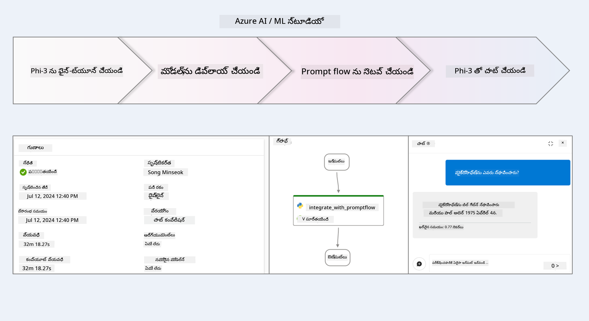

### పట్టిక

1. **[సన్నివేశం 1: Azure వనరులను సెట్ చేసి Fine-tuningకి సిద్ధం అవ్వడం](../../../../../../md/02.Application/01.TextAndChat/Phi3)**
    - [Azure Machine Learning వర్క్‌స్పేస్ సృష్టించండి](../../../../../../md/02.Application/01.TextAndChat/Phi3)
    - [Azure సబ్‌స్క్రిప్షన్‌లో GPU క్వాటా అభ్యర్థన చేయండి](../../../../../../md/02.Application/01.TextAndChat/Phi3)
    - [Role అసైన్‌మెంట్ జత చేయండి](../../../../../../md/02.Application/01.TextAndChat/Phi3)
    - [ప్రాజెక్ట్ సెట్ చేయండి](../../../../../../md/02.Application/01.TextAndChat/Phi3)
    - [Fine-tuning కోసం డేటాసెట్ సిద్ధం చేయండి](../../../../../../md/02.Application/01.TextAndChat/Phi3)

1. **[సన్నివేశం 2: Phi-3 నమూనాను Fine-tune చేసి Azure Machine Learning Studioలో డిప్లాయ్ చేయడం](../../../../../../md/02.Application/01.TextAndChat/Phi3)**
    - [Phi-3 నమూనాను Fine-tune చేయండి](../../../../../../md/02.Application/01.TextAndChat/Phi3)
    - [Fine-tuned Phi-3 నమూనాను డిప్లాయ్ చేయండి](../../../../../../md/02.Application/01.TextAndChat/Phi3)

1. **[సన్నివేశం 3: Prompt flowతో ఇంటిగ్రేట్ చేసి Azure AI Foundryలో మీ కస్టమ్ నమూనాతో చాట్ చేయడం](../../../../../../md/02.Application/01.TextAndChat/Phi3)**
    - [కస్టమ్ Phi-3 నమూనాను Prompt flowతో ఇంటిగ్రేట్ చేయండి](../../../../../../md/02.Application/01.TextAndChat/Phi3)
    - [మీ కస్టమ్ Phi-3 నమూనాతో చాట్ చేయండి](../../../../../../md/02.Application/01.TextAndChat/Phi3)

## సన్నివేశం 1: Azure వనరులను సెట్ చేసి Fine-tuningకి సిద్ధం అవ్వడం

### Azure Machine Learning వర్క్‌స్పేస్ సృష్టించండి

1. పోర్టల్ పేజీ టాప్‌లోని **search bar** లో *azure machine learning* టైప్ చేసి, కనిపించిన ఎంపికల నుండి **Azure Machine Learning**ని ఎంచుకోండి.

    

2. నావిగేషన్ మెనూ నుండి **+ Create**ను ఎంచుకోండి.

3. నావిగేషన్ మెనూ నుండి **New workspace** ఎంచుకోండి.

    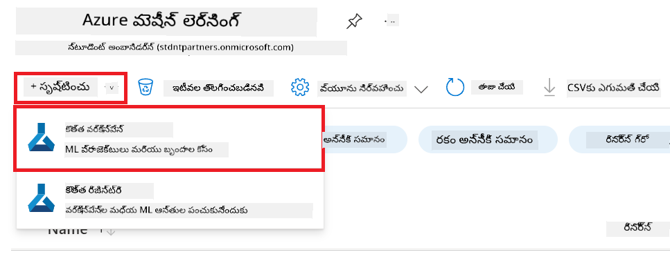

4. దిగువలాంటి పనులు చేయండి:

    - మీ Azure **Subscription** ఎంచుకోండి.
    - ఉపయోగించేందుకు **Resource group** ఎంచుకోండి (అవసరమైతే కొత్తదానిని సృష్టించండి).
    - **Workspace Name** నమోదు చేయండి. ఇది ప్రత్యేకమైన విలువ కావాలి.
    - మీరు ఉపయోగించాలనుకునే **Region** ఎంచుకోండి.
    - ఉపయోగించేందుకు **Storage account** ఎంచుకోండి (కొత్తదాని కావాలి అంటే సృష్టించండి).
    - ఉపయోగించేందుకు **Key vault** ఎంచుకోండి (తనిఖీకి అవసరం ఉంటే సృష్టించండి).
    - ఉపయోగించేందుకు **Application insights** ఎంచుకోండి (తనిఖీకి అవసరమైతే సృష్టించండి).
    - ఉపయోగించేందుకు **Container registry** ఎంచుకోండి (కొత్తదానిని సృష్టించవచ్చు).

    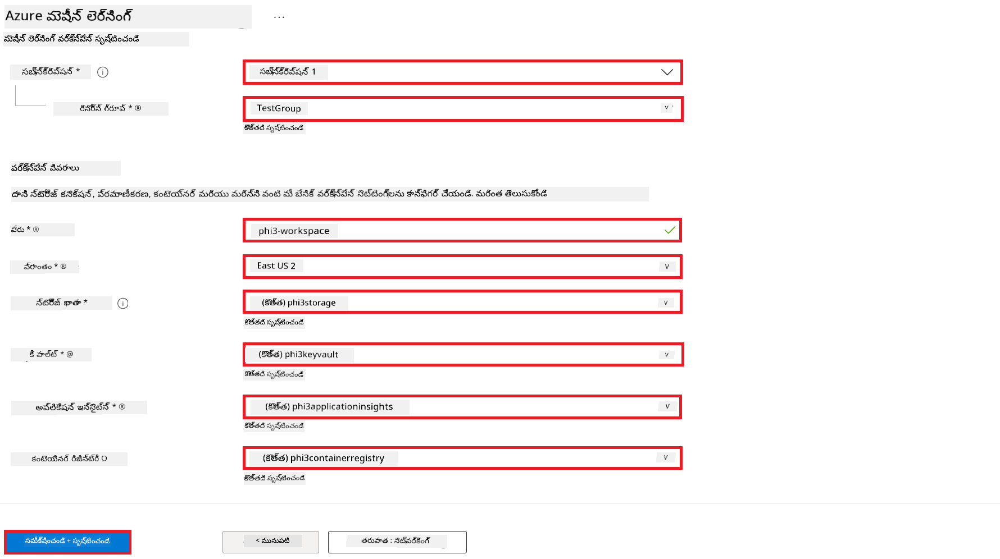

5. **Review + Create** ఎంచుకోండి.

6. **Create** ఎంచుకోండి.

### Azure సబ్‌స్క్రిప్షన్‌లో GPU క్వాటాలు అభ్యర్థించండి

ఈ పాఠంలో, మీరు GPUs ఉపయోగించి Phi-3 నమూనాను fine-tune చేసి డిప్లాయ్ చేయడం నేర్చుకుంటారు. Fine-tuning కోసం మీరు *Standard_NC24ads_A100_v4* GPU ఉపయోగించక, క్వాటా అభ్యర్థన అవసరం. డిప్లాయ్‌మెంట్ కోసం *Standard_NC6s_v3* GPU అవసరమైతే, క్వాటా అభ్యర్థన అవసరం.

> [!NOTE]
>
> కేవలం Pay-As-You-Go సబ్స్క్రిప్షన్లు (సాధారణ సబ్‌స్క్రిప్షన్ రకం)కి మాత్రమే GPU కేటాయింపు అందుబాటులో ఉంది; బెనిఫిట్ సబ్స్క్రిప్షన్లు ప్రస్తుతం మద్దతు లేవు.
>

1. [Azure ML Studio](https://ml.azure.com/home?wt.mc_id=studentamb_279723) సందర్శించండి.

1. *Standard NCADSA100v4 Family* క్వాటాను అభ్యర్థించడానికి ఈ క్రింది పనులు చేయండి:

    - ఎడమ వైపు టాబ్ నుండి **Quota** ఎంచుకోండి.
    - ఉపయోగించాల్సిన **Virtual machine family** ఎంచుకోండి. ఉదాహరణకు, *Standard NCADSA100v4 Family Cluster Dedicated vCPUs* ఎంచుకోండి; ఇది *Standard_NC24ads_A100_v4* GPU కలిగి ఉంటుంది.
    - నావిగేషన్ మెనూ నుండి **Request quota** ఎంచుకోండి.

        

    - Request quota పేజీలో మీరు కావలసిన **New cores limit** నమోదు చేయండి. ఉదాహరణకు, 24.
    - Request quota పేజీలో **Submit** ఎంచుకుని GPU క్వాటాను అభ్యర్థించండి.

1. *Standard NCSv3 Family* క్వాటాను అభ్యర్థించడానికి ఈ క్రింది పనులు చేయండి:

    - ఎడమ వైపు టాబ్ నుండి **Quota** ఎంచుకోండి.
    - ఉపయోగించాల్సిన **Virtual machine family** ఎంచుకోండి. ఉదాహరణకు, *Standard NCSv3 Family Cluster Dedicated vCPUs* ఎంచుకోండి; ఇది *Standard_NC6s_v3* GPU కలిగి ఉంటుంది.
    - నావిగేషన్ మెనూ నుండి **Request quota** ఎంచుకోండి.
    - Request quota పేజీలో మీరు కావలసిన **New cores limit** నమోదు చేయండి. ఉదాహరణకు, 24.
    - Request quota పేజీలో **Submit** ఎంచుకుని GPU క్వాటాను అభ్యర్థించండి.

### Role అసైన్‌మెంట్ జత చేయండి

మీ నమూనాలను fine-tune చేసి డిప్లాయ్ చేయడానికి, ముందు User Assigned Managed Identity (UAI)ని సృష్టించి దానికి సరైన అనుమతులు కల్పించాలి. ఈ UAI డిప్లాయ్‌మెంట్ సమయంలో authenticationకి ఉపయోగిస్తారు.

#### User Assigned Managed Identity(UAI) సృష్టించండి

1. పోర్టల్ పేజీ టాప్‌లోని **search bar** లో *managed identities* టైప్ చేసి కనిపించిన ఎంపికల నుండి **Managed Identities** ఎంచుకోండి.

    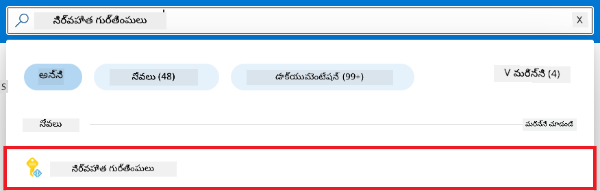

1. **+ Create** ఎంచుకోండి.

    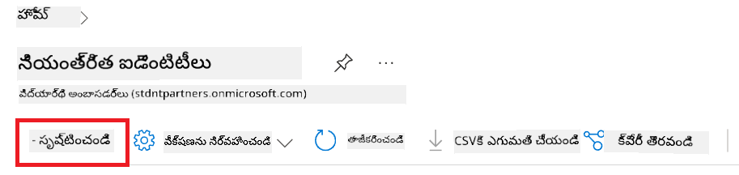

1. ఈ క్రింది పనులు చేయండి:

    - మీ Azure **Subscription** ఎంచుకోండి.
    - ఉపయోగించాల్సిన **Resource group** ఎంచుకోండి (కొత్తదానిని సృష్టించవచ్చు).
    - మీరు ఉపయోగించదలచుకున్న **Region** ఎంచుకోండి.
    - **Name** నమోదు చేయండి. ఇది ప్రత్యేకమైనది కావాలి.

    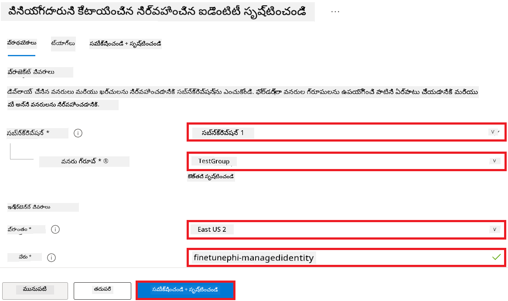

1. **Review + create** ఎంచుకోండి.

1. **+ Create** ఎంచుకోండి.

#### Managed Identityకి Contributor role అసైన్ చేయండి

1. మీరు సృష్టించిన Managed Identity వనరుకు నావిగేట్ అవ్వండి.

1. ఎడమ టాబ్ నుండి **Azure role assignments** ఎంచుకోండి.

1. నావిగేషన్ మెనూ నుండి **+Add role assignment** ఎంచుకోండి.

1. Add role assignment పేజీలో ఈ క్రింది పనులు చేయండి:
    - **Scope**ని **Resource group**కి సెట్ చేయండి.
    - మీ Azure **Subscription** ఎంచుకోండి.
    - ఉపయోగించాల్సిన **Resource group** ఎంచుకోండి.
    - **Role**ని **Contributor**గా ఎంచుకోండి.

    

2. **Save** ఎంచుకోండి.

#### Managed Identityకి Storage Blob Data Reader role అసైన్ చేయండి

1. పోర్టల్ పేజీ టాప్‌లోని **search bar** లో *storage accounts* టైప్ చేసి కనిపించిన ఎంపికల నుండి **Storage accounts** ఎంచుకోండి.

    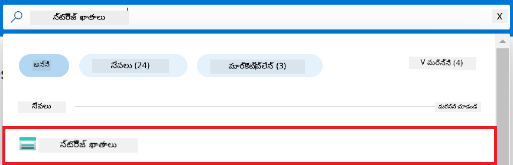

1. మీరు సృష్టించిన Azure Machine Learning వర్క్‌స్పేస్‌కు సంబంధించిన storage అకౌంట్ ఎంచుకోండి. ఉదాహరణకు, *finetunephistorage*.

1. Add role assignment పేజీకి నావిగేట్ అవ్వడానికి ఈ క్రింది పనులు చేయండి:

    - మీరు సృష్టించిన Azure Storage అకౌంట్ నావిగేట్ చేయండి.
    - ఎడమ టాబ్ నుండి **Access Control (IAM)** ఎంచుకోండి.
    - నావిగేషన్ మెనూ నుండి **+ Add** ఎంచుకోండి.
    - **Add role assignment** ఎంచుకోండి.

    

1. Add role assignment పేజీలో ఈ క్రింది పనులు చేయండి:

    - Role పేజీలో **search bar** లో *Storage Blob Data Reader* టైప్ చేసి, కనిపించిన ఎంపికల నుండి **Storage Blob Data Reader** ఎంచుకోండి.
    - Role పేజీలో **Next** ఎంచుకోండి.
    - Members పేజీలో **Assign access to**గా **Managed identity** ఎంచుకోండి.
    - Members పేజీలో **+ Select members** ఎంచుకోండి.
    - Select managed identities పేజీలో మీ Azure **Subscription** ఎంచుకోండి.
    - Select managed identities పేజీలో **Managed identity**గా **Manage Identity** ఎంచుకోండి.
    - మీరు సృష్టించిన Manage Identityని ఎంచుకోండి. ఉదాహరణకు, *finetunephi-managedidentity*.
    - Select managed identities పేజీలో **Select** ఎంచుకోండి.

    

1. **Review + assign** ఎంచుకోండి.

#### Managed Identityకి AcrPull role అసైన్ చేయండి

1. పోర్టల్ పేజీ టాప్‌లోని **search bar** లో *container registries* టైప్ చేసి కనిపించిన ఎంపికల నుండి **Container registries** ఎంచుకోండి.

    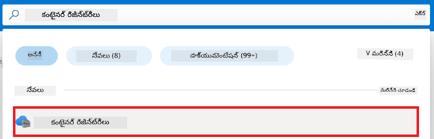

1. మీరు సృష్టించిన Azure Machine Learning వర్క్‌స్పేస్‌కు సంబంధించిన container registry ఎంచుకోండి. ఉదాహరణకు, *finetunephicontainerregistry*

1. Add role assignment పేజీకి నావిగేట్ అవ్వడానికి ఈ క్రింది పనులు చేయండి:

    - ఎడమ టాబ్ నుండి **Access Control (IAM)** ఎంచుకోండి.
    - నావిగేషన్ మెనూ నుండి **+ Add** ఎంచుకోండి.
    - **Add role assignment** ఎంచుకోండి.

1. Add role assignment పేజీలో ఈ క్రింది పనులు చేయండి:

    - Role పేజీలో **search bar** లో *AcrPull* టైప్ చేసి, కనిపించిన ఎంపికల నుండి **AcrPull** ఎంచుకోండి.
    - Role పేజీలో **Next** ఎంచుకోండి.
    - Members పేజీలో **Assign access to**గా **Managed identity** ఎంచుకోండి.
    - Members పేజీలో **+ Select members** ఎంచుకోండి.
    - Select managed identities పేజీలో మీ Azure **Subscription** ఎంచుకోండి.
    - Select managed identities పేజీలో **Managed identity**గా **Manage Identity** ఎంచుకోండి.
    - మీరు సృష్టించిన Manage Identityని ఎంచుకోండి. ఉదాహరణకు, *finetunephi-managedidentity*.
    - Select managed identities పేజీలో **Select** ఎంచుకోండి.
    - **Review + assign** ఎంచుకోండి.

### ప్రాజెక్ట్ సెట్ చేయండి

Fine-tuning కోసం అవసరమైన డేటాసెట్లను డౌన్‌లోడ్ చేయడానికి, మీరు లోకల్ ఎన్విరాన్మెంట్ సెట్ చేయాలి.

ఈ వ్యాయామంలో, మీరు

- పని చేయడానికి ఒక ఫోల్డర్ సృష్టించాలి.
- వర్చువల్ ఎన్విరాన్మెంట్ సృష్టించాలి.
- అవసరమైన ప్యాకేజీలను ఇన్స్టాల్ చేయాలి.
- డాటాసెట్ డౌన్‌లోడ్ చేయటానికి *download_dataset.py* ఫైల్ సృష్టించాలి.

#### పని Folder సృష్టించడానికి

1. ఒక టర్మినల్ విండో తెరవండి మరియు డిఫాల్ట్ పాత్‌లో *finetune-phi* అనే పేరుతో ఫోల్డర్ సృష్టించడానికి ఈ క్రింది కమాండ్ టైప్ చేయండి.

    ```console
    mkdir finetune-phi
    ```

2. మీరు సృష్టించిన *finetune-phi* ఫోల్డర్‌లో అన్వయించేందుకు మీ టెర్మినల్‌లో క్రింది కమాండ్‌ను టైప్ చేయండి.

    ```console
    cd finetune-phi
    ```

#### వర్చువల్ ఎన్విరాన్‌మెంట్ Create చేయండి

1. *.venv* అనే వర్చువల్ ఎన్విరాన్‌మెంట్‌ను సృష్టించేందుకు మీ టెర్మినల్‌లో క్రింది కమాండ్‌ను టైప్ చేయండి.

    ```console
    python -m venv .venv
    ```

2. వర్చువల్ ఎన్విరాన్‌మెంట్‌ను యాక్టివేట్ చేయడానికి మీ టెర్మినల్‌లో క్రింది కమాండ్‌ను టైప్ చేయండి.

    ```console
    .venv\Scripts\activate.bat
    ```

> [!NOTE]
> ఇది పని చేస్తే, కమాండ్ ప్రాంప్ట్ előtt *(.venv)* కనిపించాలి.

#### అవసరమైన ప్యాకేజీలను ఇన్‌స్టాల్ చేయండి

1. అవసరమైన ప్యాకేజీలను ఇన్‌స్టాల్ చేయడానికి మీ టెర్మినల్‌లో క్రింది కమాండ్లు టైప్ చేయండి.

    ```console
    pip install datasets==2.19.1
    ```

#### `donload_dataset.py` ను సృష్టించండి

> [!NOTE]
> పూర్తి ఫోల్డర్ నిర్మాణం:
>
> ```text
> └── YourUserName
> .    └── finetune-phi
> .        └── download_dataset.py
> ```

1. **Visual Studio Code** ను ఓపెన్ చేయండి.

1. మెను బార్ నుండి **File** ఎంచుకోండి.

1. **Open Folder** ఎంచుకోండి.

1. మీరు సృష్టించిన *finetune-phi* ఫోల్డర్‌ను ఎంచుకోండి, ఇది *C:\Users\yourUserName\finetune-phi* లో ఉంది.

    

1. Visual Studio Code ఎడమ ప్యానెల్లో, రైట్ క్లిక్ చేసి **New File** ఎంచుకొని *download_dataset.py* అనే కొత్త ఫైల్‌ను సృష్టించండి.

    

### ఫైన్-ట్యూనింగ్ కోసం డేటాసెట్ సిద్ధం చేయండి

ఈ వ్యాయామంలో, మీరు *download_dataset.py* ఫైల్ ను నడపి *ultrachat_200k* డేటాసెట్లను మీ స్థానిక వాతావరణానికి డౌన్‌లోడ్ చేస్తారు. ఆ డేటాసెట్లను ఉపయోగించి మీరు Azure Machine Learning లో Phi-3 మోడల్‌ను ఫైన్-ట్యూన్ చేస్తారు.

ఈ వ్యాయామంలో మీరు:

- డేటాసెట్లను డౌన్‌లోడ్ చేయడానికి *download_dataset.py* ఫైల్‌లో కోడ్‌ను జోడిస్తారు.
- డేటాసెట్లను స్థానిక వాతావరణానికి డౌన్‌లోడ్ చేయడానికి *download_dataset.py* ఫైల్‌ను నడుపుతారు.

#### *download_dataset.py* ఉపయోగించి మీ డేటాసెట్‌ను డౌన్‌లోడ్ చేయండి

1. Visual Studio Code లో *download_dataset.py* ఫైల్‌ను ఓపెన్ చేయండి.

1. *download_dataset.py* ఫైల్‌లో క్రింది కోడ్‌ను జోడించండి.

    ```python
    import json
    import os
    from datasets import load_dataset

    def load_and_split_dataset(dataset_name, config_name, split_ratio):
        """
        Load and split a dataset.
        """
        # పేర్కొన్న పేరు, కాన్ఫిగరేషన్ మరియు విభజన నిష్పత్తితో డేటాసెట్‌ను లోడ్ చేయండి
        dataset = load_dataset(dataset_name, config_name, split=split_ratio)
        print(f"Original dataset size: {len(dataset)}")
        
        # డేటాసెట్‌ను ట్రెయిన్ మరియు టెస్ట్ సెట్‌లుగా భాగించండి (80% ట్రెయిన్, 20% టెస్ట్)
        split_dataset = dataset.train_test_split(test_size=0.2)
        print(f"Train dataset size: {len(split_dataset['train'])}")
        print(f"Test dataset size: {len(split_dataset['test'])}")
        
        return split_dataset

    def save_dataset_to_jsonl(dataset, filepath):
        """
        Save a dataset to a JSONL file.
        """
        # డైరెక్టరీ లేదంటే సృష్టించండి
        os.makedirs(os.path.dirname(filepath), exist_ok=True)
        
        # ఫైల్‌ను రాత మోడ్‌లో ఓపెన్ చేయండి
        with open(filepath, 'w', encoding='utf-8') as f:
            # డేటాసెట్‌లో ప్రతి రికార్డుపై పునరావృతం చేయండి
            for record in dataset:
                # రికార్డ్‌ను JSON ఆబ్జెక్టుగా డంప్ చేసి ఫైల్‌కు రాయండి
                json.dump(record, f)
                # రికార్డులను విడగొట్టడానికి న్యువ్లైన్ క్యారెక్టర్ రాయండి
                f.write('\n')
        
        print(f"Dataset saved to {filepath}")

    def main():
        """
        Main function to load, split, and save the dataset.
        """
        # ULTRACHAT_200k డేటాసెట్‌ను ఒక నిర్దిష్ట కాన్ఫిగరేషన్ మరియు విభజన నిష్పత్తితో లోడ్ చేసి విభజించండి
        dataset = load_and_split_dataset("HuggingFaceH4/ultrachat_200k", 'default', 'train_sft[:1%]')
        
        # విభజన నుండి ట్రెయిన్ మరియు టెస్ట్ డేటాసెట్‌లను ఎక్స్‌ట్రాక్ట్ చేయండి
        train_dataset = dataset['train']
        test_dataset = dataset['test']

        # ట్రెయిన్ డేటాసెట్‌ను JSONL ఫైల్‌గా సేవ్ చేయండి
        save_dataset_to_jsonl(train_dataset, "data/train_data.jsonl")
        
        # టెస్ట్ డేటాసెట్‌ను వేరే JSONL ఫైల్‌గా సేవ్ చేయండి
        save_dataset_to_jsonl(test_dataset, "data/test_data.jsonl")

    if __name__ == "__main__":
        main()

    ```

1. స్క్రిప్ట్‌ను నడిపి డేటాసెట్‌ను మీ స్థానిక వాతావరణానికి డౌన్‌లోడ్ చేయడానికి మీ టెర్మినల్‌లో క్రింది కమాండ్‌ను టైప్ చేయండి.

    ```console
    python download_dataset.py
    ```

1. డేటాసెట్లు మీ స్థానిక *finetune-phi/data* డైరెక్టరీలో విజయవంతంగా సేవ్ అయ్యాయో లేదో నిర్ధారించండి.

> [!NOTE]
>
> #### డేటాసెట్ పరిమాణం మరియు ఫైన్-ట్యూనింగ్ సమయంపై గమనిక
>
> ఈ ట్యుటోరియల్‌లో, మీరు డేటాసెట్ యొక్క కేవలం 1% (`split='train[:1%]'`) మాత్రమే ఉపయోగిస్తున్నారు. ఇది డేటా పరిమాణాన్ని గణనీయంగా తగ్గిస్తుంది, అప్‌లోడ్ మరియు ఫైన్-ట్యూనింగ్ ప్రక్రియలను వేగవంతం చేస్తుంది. మీరు శిక్షణ సమయం మరియు మోడల్ పనితీరుకు సరైన Santulanam కోసం శాతం సర్దుబాటు చేయవచ్చు. చిన్న ఉపసетовును ఉపయోగించడం ఫైన్-ట్యూనింగ్ సమయాన్ని తగ్గిస్తుంది, ట్యుటోరియల్ కోసం ప్రక్రియను సులభతరం చేస్తుంది.

## సన్నివేశం 2: Phi-3 మోడల్‌ను ఫైన్-ట్యూన్ చేసి Azure Machine Learning Studio లో డిప్లాయ్ చేయండి

### Phi-3 మోడల్‌ను ఫైన్-ట్యూన్ చేయండి

ఈ వ్యాయామంలో, మీరు Azure Machine Learning Studio లో Phi-3 మోడల్‌ను ఫైన్-ట్యూన్ చేస్తారు.

ఈ వ్యాయామంలో, మీరు:

- ఫైన్-ట్యూనింగ్ కోసం కంప్యూటర్ క్లస్టర్‌ను సృష్టించండి.
- Azure Machine Learning Studio లో Phi-3 మోడల్‌ను ఫైన్-ట్యూన్ చేయండి.

#### ఫైన్-ట్యూనింగ్ కోసం కంప్యూటర్ క్లస్టర్‌ను సృష్టించండి

1. [Azure ML Studio](https://ml.azure.com/home?wt.mc_id=studentamb_279723) ను సందర్శించండి.

1. ఎడమ వైపు టాబ్ నుండి **Compute** ను ఎంచుకోండి.

1. నావిగేషన్ మెనూ నుండి **Compute clusters** ఎంచుకోండి.

1. **+ New** ఎంచుకోండి.

    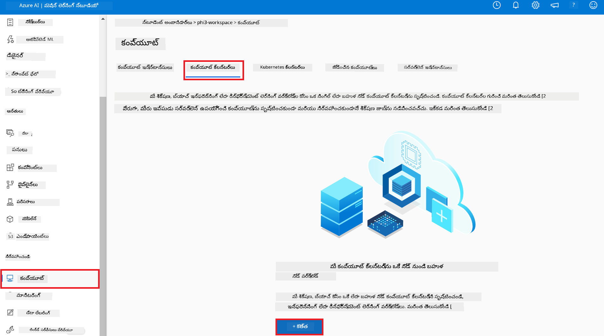

1. కింది పనులను చేయండి:

    - ఉపయోగించదలచుకున్న **Region** ను ఎంచుకోండి.
    - **Virtual machine tier** ను **Dedicated** గా ఎంచుకోండి.
    - **Virtual machine type** ను **GPU** గా ఎంచుకోండి.
    - **Virtual machine size** ఫిల్టర్‌ను **Select from all options** గా ఎంచుకోండి.
    - **Virtual machine size** ను **Standard_NC24ads_A100_v4** గా ఎంచుకోండి.

    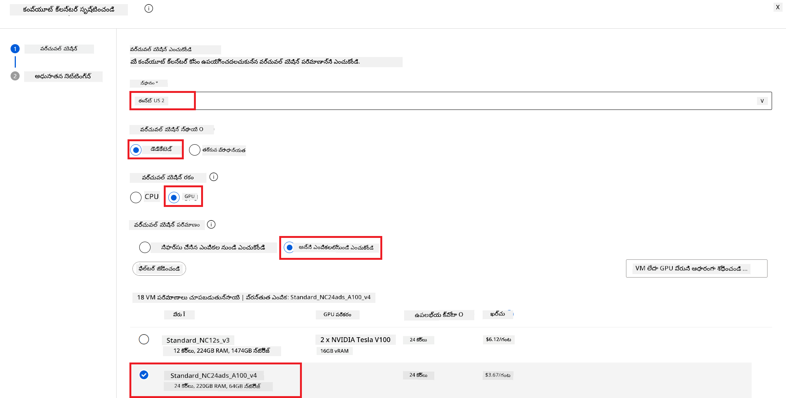

1. **Next** ఎంచుకోండి.

1. క్రింది పనులు చేయండి:

    - **Compute name** నమోదు చేయండి. ఇది ప్రత్యేకమైన విలువగా ఉండాలి.
    - **Minimum number of nodes** ను **0** గా ఎంచుకోండి.
    - **Maximum number of nodes** ను **1** గా ఎంచుకోండి.
    - **Idle seconds before scale down** ను **120** గా ఎంచుకోండి.

    

1. **Create** ఎంచుకోండి.

#### Phi-3 మోడల్‌ను ఫైన్-ట్యూన్ చేయండి

1. [Azure ML Studio](https://ml.azure.com/home?wt.mc_id=studentamb_279723) ను సందర్శించండి.

1. మీరు సృష్టించిన Azure Machine Learning వర్క్‌స్పేస్‌ను ఎంచుకోండి.

    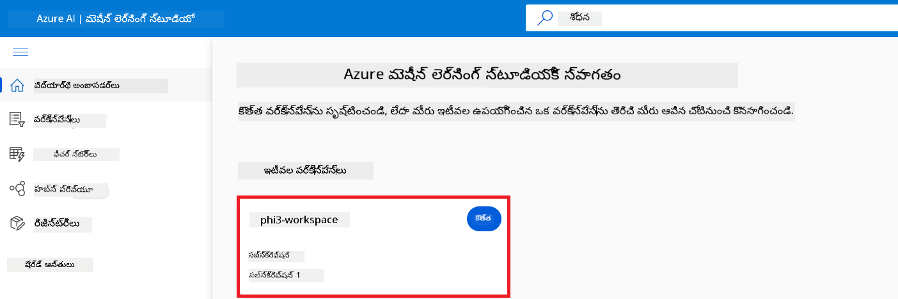

1. క్రింది పనులు చేయండి:

    - ఎడమ వైపు టాబ్ నుండి **Model catalog** ఎంచుకోండి.
    - **search bar** లో *phi-3-mini-4k* టైప్ చేసి కనిపించే ఎంపికల నుండి **Phi-3-mini-4k-instruct** ఎంచుకోండి.

    

1. నావిగేషన్ మెనూ నుండి **Fine-tune** ఎంచుకోండి.

    

1. క్రింది పనులు చేయండి:

    - **Select task type** ను **Chat completion** గా ఎంచుకోండి.
    - **+ Select data** ఎంచుకుని **Training data** అప్లోడ్ చేయండి.
    - వాలిడేషన్ డేటా అప్లోడ్ రకం ను **Provide different validation data** గా ఎంచుకోండి.
    - **+ Select data** ఎంచుకుని **Validation data** అప్లోడ్ చేయండి.

    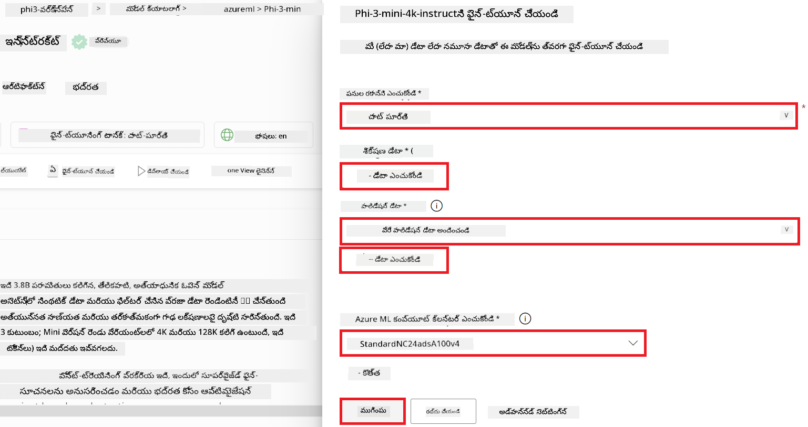

> [!TIP]
>
> మీరు **Advanced settings** ఎంచుకుని **learning_rate** మరియు **lr_scheduler_type** వంటి కాన్ఫిగరేషన్లను అనుకూలీకరించవచ్చు, మీ నిర్దిష్ట అవసరాలకు అనుగుణంగా ఫైన్-ట్యూనింగ్ ప్రక్రియను మెరుగుపరచడానికి.

1. **Finish** ఎంచుకోండి.

1. ఈ వ్యాయామంలో, మీరు విజయవంతంగా Azure Machine Learning ఉపయోగించి Phi-3 మోడల్‌ను ఫైన్-ట్యూన్ చేసారు. దయచేసి గమనించండి, ఫైన్-ట్యూనింగ్ ప్రక్రియకు గణనీయమైన సమయం పట్టవచ్చు. ఫైన్-ట్యూనింగ్ జాబ్ నడుపిన తర్వాత, అది పూర్తి కావడానికి వేచి ఉండాలి. Azure Machine Learning వర్క్‌స్పేస్ ఎడమ వైపు టాబ్‌లోని Jobs టాబ్‌లో ఫైన్-ట్యూనింగ్ జాబ్ స్థితిని మీరు పరిశీలించవచ్చు. తదుపరి శ్రేణిలో, మీరు ఫైన్-ట్యూన్ చేసిన మోడల్‌ను డిప్లాయ్ చేసి Prompt flow తో ఇంటిగ్రేట్ చేస్తారు.

    

### ఫైన్-ట్యూన్ చేసిన Phi-3 మోడల్‌ను డిప్లాయ్ చేయండి

ఫైన్-ట్యూన్ చేసిన Phi-3 మోడల్‌ను Prompt flow తో ఇంటిగ్రేట్ చేయడానికి, మీరు మోడల్‌ను రియల్ టైమ్ ఇన్పుట్ కోసం అందుబాటులో ఉండేలా డిప్లాయ్ చేయాలి. ఈ ప్రక్రియలో మోడల్‌ను రిజిస్టర్ చేయడం, ఆన్‌లైన్ ఎండ్పాయింట్ సృష్టించడం మరియు మోడల్‌ను డిప్లాయ్ చేయడం ఉంటుంది.

ఈ వ్యాయామంలో, మీరు:

- Azure Machine Learning వర్క్‌స్పేస్‌లో ఫైన్-ట్యూన్ చేసిన మోడల్‌ను రిజిస్టర్ చేయడం.
- ఆన్‌లైన్ ఎండ్పాయింట్ సృష్టించడం.
- రిజిస్టర్ అయిన ఫైన్-ట్యూన్ చేసిన Phi-3 మోడల్‌ను డిప్లాయ్ చేయడం.

#### ఫైన్-ట్యూన్ చేసిన మోడల్‌ను రిజిస్టర్ చేయండి

1. [Azure ML Studio](https://ml.azure.com/home?wt.mc_id=studentamb_279723) ను సందర్శించండి.

1. మీరు సృష్టించిన Azure Machine Learning వర్క్‌స్పేస్‌ను ఎంచుకోండి.

    

1. ఎడమ వైపు టాబ్ నుండి **Models** ఎంచుకోండి.
1. **+ Register** ఎంచుకోండి.
1. **From a job output** ఎంచుకోండి.

    

1. మీరు సృష్టించిన జాబ్‌ను ఎంచుకోండి.

    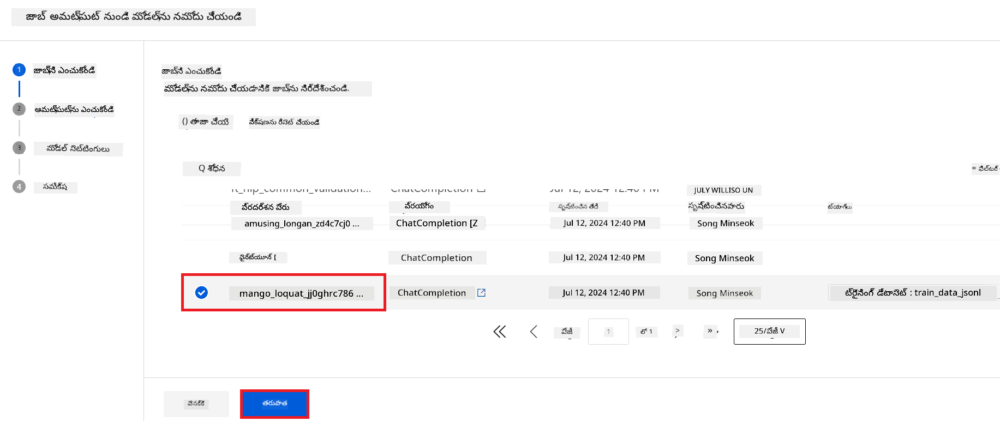

1. **Next** ఎంచుకోండి.

1. **Model type** ను **MLflow** గా ఎంచుకోండి.

1. **Job output** ఎంచుకోబడిందని నిర్ధారించుకోండి; ఇది ఆటోమేటిక్గా ఎంచుకోబడాలి.

    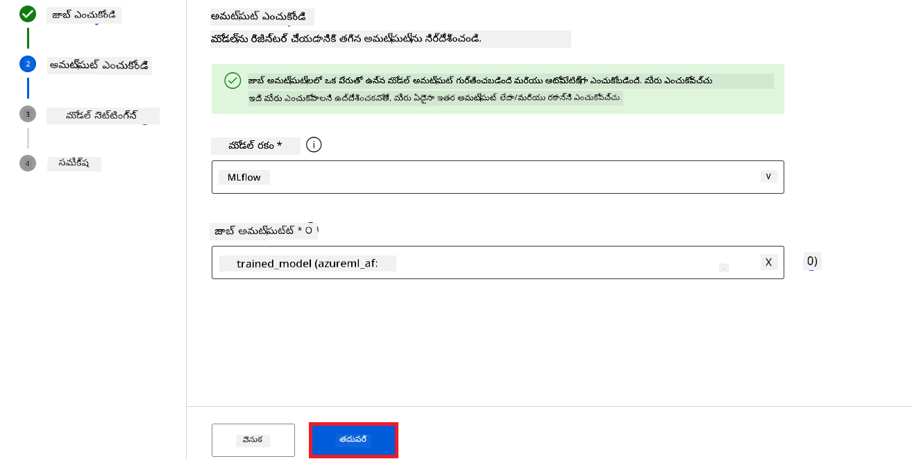

2. **Next** ఎంచుకోండి.

3. **Register** ఎంచుకోండి.

    

4. ఎడమ వైపు టాబ్ నుండి **Models** మెనూకి వెళ్లండి, అక్కడ మీరు మీ రిజిస్టర్ చేసిన మోడల్‌ను చూడవచ్చు.

    

#### ఫైన్-ట్యూన్ చేసిన మోడల్‌ను డిప్లాయ్ చేయండి

1. మీరు సృష్టించిన Azure Machine Learning వర్క్‌స్పేస్‌కు వెళ్లండి.

1. ఎడమ వైపు టాబ్ నుండి **Endpoints** ఎంచుకోండి.

1. నావిగేషన్ మెనూ నుండి **Real-time endpoints** ఎంచుకోండి.

    

1. **Create** ఎంచుకోండి.

1. మీరు సృష్టించిన రిజిస్టర్ చేసిన మోడల్‌ను ఎంచుకోండి.

    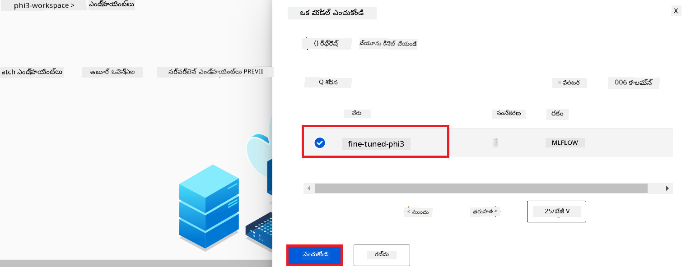

1. **Select** ఎంచుకోండి.

1. క్రింది పనులు చేయండి:

    - **Virtual machine** ను *Standard_NC6s_v3* గా ఎంచుకోండి.
    - మీరు ఉపయోగించదలచుకున్న **Instance count** ను ఎంచుకోండి. ఉదాహరణకు, *1*.
    - ఎండ్పాయింట్‌ను సృష్టించడానికి **Endpoint** ను **New** గా ఎంచుకోండి.
    - **Endpoint name** నమోదు చేయండి. ఇది ప్రత్యేకమైన విలువ కావాలి.
    - **Deployment name** నమోదు చేయండి. ఇది ప్రత్యేకమైన విలువ కావాలి.

    

1. **Deploy** ఎంచుకోండి.

> [!WARNING]
> మీ ఖాతాకు అదనపు ఛార్జీలను నివారించడానికి, Azure Machine Learning వర్క్‌స్పేస్‌లో సృష్టించిన ఎండ్పాయింట్‌ను తుడవండి.
>

#### Azure Machine Learning వర్క్‌స్పేస్‌లో డిప్లాయ్‌మెంట్ స్థితిని చెక్ చేయండి

1. మీరు సృష్టించిన Azure Machine Learning వర్క్‌స్పేస్‌కు వెళ్లండి.

1. ఎడమ వైపు టాబ్ నుండి **Endpoints** ను ఎంచుకోండి.

1. మీరు సృష్టించిన ఎండ్పాయింట్‌ను ఎంచుకోండి.

    

1. ఈ పేజీపై, మీరు డిప్లాయ్‌మెంట్ ప్రక్రియలో ఎండ్పాయింట్లను నిర్వహించవచ్చు.

> [!NOTE]
> డిప్లాయ్‌మెంట్ పూర్తయిన తరువాత, **Live traffic** ను **100%** గా సెట్ చేయండి. అది కాకుంటే, ట్రాఫిక్ సెట్టింగ్‌లను సవరించేందుకు **Update traffic** ను ఎంచుకోండి. ట్రాఫిక్ 0% గా ఉన్నప్పుడు మోడల్‌ను పరీక్షించలేరు.
>
> 
>

## సన్నివేశం 3: Prompt flow తో ఇంటిగ్రేట్ చేసి Azure AI Foundry లో మీ కస్టమ్ మోడల్‌తో చాట్ చేయండి

### కస్టమ్ Phi-3 మోడల్‌ను Prompt flow తో ఇంటిగ్రేట్ చేయండి

మీరు విజయవంతంగా ఫైన్-ట్యూన్ చేసిన మోడల్‌ను డిప్లాయ్ చేసిన తర్వాత, Prompt Flow తో దాన్ని ఇంటిగ్రేట్ చేసి, మీ కస్టమ్ Phi-3 మోడల్‌తో రియల్ టైమ్ అప్లికేషన్లకు ఉపయోగించవచ్చు, వివిధ ఇంటరాక్టివ్ టాస్కులను వీలుపరుస్తుంది.

ఈ వ్యాయామంలో, మీరు:

- Azure AI Foundry Hub సృష్టించండి.
- Azure AI Foundry ప్రాజెక్ట్ సృష్టించండి.
- Prompt flow సృష్టించండి.
- ఫైన్-ట్యూన్ చేసిన Phi-3 మోడల్‌కు ఒక కస్టమ్ కనెక్షన్ జోడించండి.
- Prompt flow ను మీ కస్టమ్ Phi-3 మోడల్‌తో చాట్ చేసేందుకు సెట్టప్స్ చేయండి.

> [!NOTE]
> మీరు Azure ML Studio ఉపయోగించి కూడా Promptflow తో ఇంటిగ్రేట్ చేయవచ్చు. అదే ఇంటిగ్రేషన్ ప్రక్రియ Azure ML Studio కు కూడా వర్తిస్తుంది.

#### Azure AI Foundry Hub సృష్టించండి

ప్రాజెక్ట్ సృష్టించే ముందు హబ్‌ను సృష్టించడం అవసరం. హబ్ ఒక రీసోర్స్ గ్రూప్‌లా పనిచేస్తుంది, ఇది Azure AI Foundry లో మీరు అనేక ప్రాజెక్టులను నిర్వహించడానికి మరియు ஒரడస్తు చేయడానికి అనుమతిస్తుంది.

1. [Azure AI Foundry](https://ai.azure.com/?WT.mc_id=aiml-137032-kinfeylo) ను సందర్శించండి.

1. ఎడమ వైపు టాబ్ నుండి **All hubs** ఎంచుకోండి.

1. నావిగేషన్ మెనూ నుండి **+ New hub** ఎంచుకోండి.
    

1. క్రింది పనులు చేయండి:

    - **హబ్ పేరు** నమోదు చేయండి. ఇది ప్రత్యేకమైన విలువ కావాలి.
    - మీ Azure **సబ్స్క్రిప్షన్** ను ఎంచుకోండి.
    - ఉపయోగించదలచిన **రిసోర్స్ గ్రూప్** ను ఎంచుకోండి (అవసరమైతే కొత్తది సృష్టించండి).
    - మీరు ఉపయోగించదలచిన **స్థానం** ను ఎంచుకోండి.
    - ఉపయోగించదలచిన **Azure AI సేవలను కనెక్ట్ చేయండి** ను ఎంచుకోండి (అవసరమైతే కొత్తది సృష్టించండి).
    - **Azure AI సెర్చ్ కనెక్ట్ చేయడం** ను **స్కిప్ చేయండి** అని ఎంచుకోండి.

    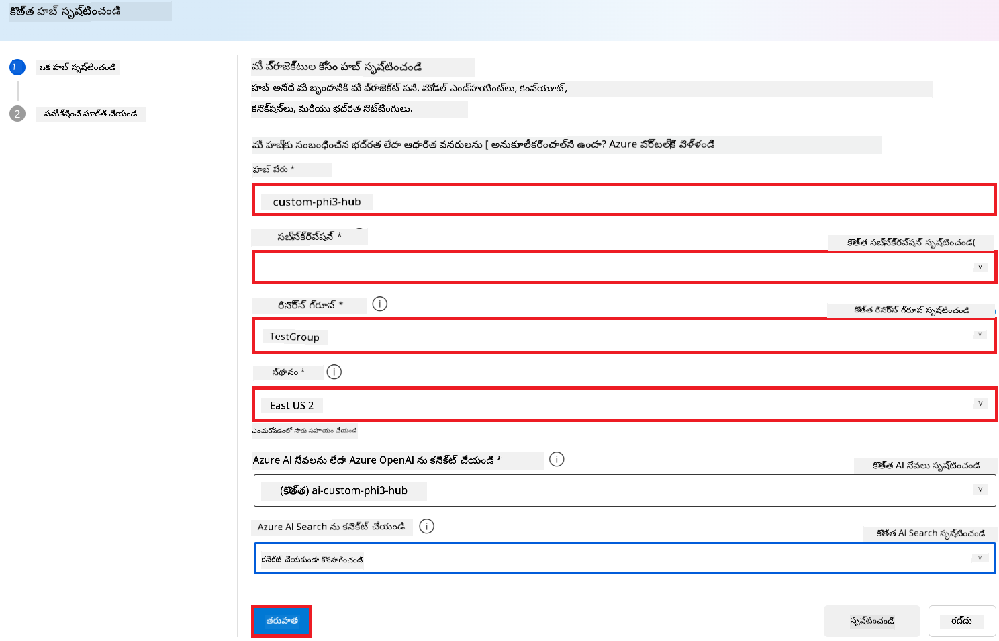

1. **తరువాత** ను ఎంచుకోండి.

#### Azure AI Foundry ప్రాజెక్ట్ సృష్టించండి

1. మీరు సృష్టించిన హబ్‌లో ఎడమ వైపు ట్యాబ్ నుండి **అన్ని ప్రాజెక్టులు** ను ఎంచుకోండి.

1. నావిగేషన్ మెనులో నుండి **+ కొత్త ప్రాజెక్ట్** ఎంచుకోండి.

    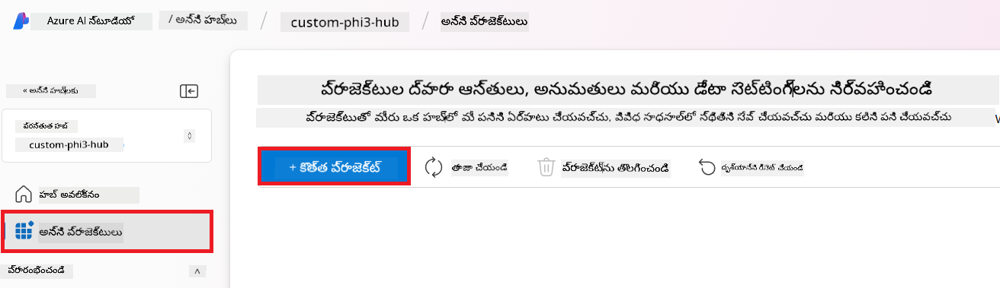

1. **ప్రాజెక్ట్ పేరు** నమోదు చేయండి. ఇది ప్రత్యేకమైన విలువ కావాలి.

    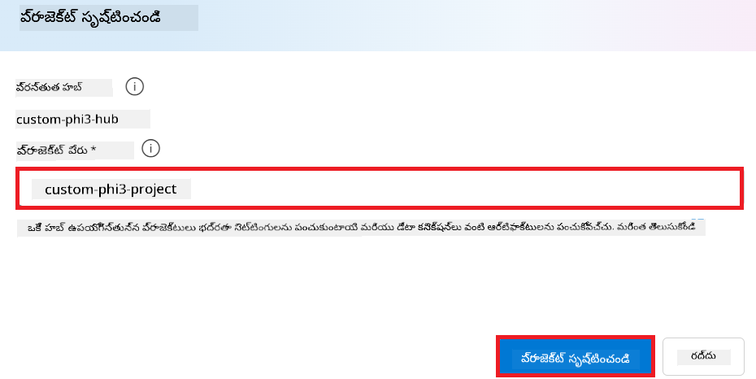

1. **ప్రాజెక్ట్ సృష్టించండి** ను ఎంచుకోండి.

#### ఫైన్-ట్యూన్ చేసిన Phi-3 మోడల్ కు కస్టమ్ కనెక్షన్ జోడించండి

మీ కస్టమ్ Phi-3 మోడల్ ను Prompt flow తో ఇంటిగ్రేట్ చేయాలంటే, మోడల్ యొక్క ఎండ్పాయింట్ మరియు కీని కస్టమ్ కనెక్షన్‌లో సంరక్షించాలి. దీని వల్ల Prompt flowలో మీ కస్టమ్ Phi-3 మోడల్‌కు యాక్సెస్ ఉంటుంది.

#### ఫైన్-ట్యూన్ చేసిన Phi-3 మోడల్ కోసం API కీ మరియు ఎండ్పాయింట్ URI సెటప్ చేయండి

1. [Azure ML Studio](https://ml.azure.com/home?WT.mc_id=aiml-137032-kinfeylo) ను సందర్శించండి.

1. మీరు సృష్టించిన Azure మెషీన్ లర్నింగ్ వర్క్‌స్పేస్ కి వెళ్లండి.

1. ఎడమ వైపు ట్యాబ్ నుండి **ఎండ్పాయింట్లు** ను ఎంచుకోండి.

    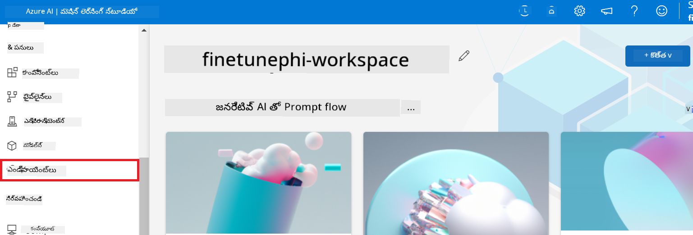

1. మీరు సృష్టించిన ఎండ్పాయింట్ ని ఎంచుకోండి.

    

1. నావిగేషన్ మెనూ నుండి **ఉపయోగించండి** ను ఎంచుకోండి.

1. మీ **REST ఎండ్పాయింట్** మరియు **ప్రాథమిక కీ** ని కాపీ చేసుకోండి.

    

#### కస్టమ్ కనెక్షన్ జోడించండి

1. [Azure AI Foundry](https://ai.azure.com/?WT.mc_id=aiml-137032-kinfeylo) ను సందర్శించండి.

1. మీరు సృష్టించిన Azure AI Foundry ప్రాజెక్ట్ కు వెళ్లండి.

1. మీరు సృష్టించిన ప్రాజెక్ట్ లో, ఎడమ వైపు ట్యాబ్ నుండి **సెట్టింగ్స్** ను ఎంచుకోండి.

1. **+ కొత్త కనెక్షన్** ను ఎంచుకోండి.

    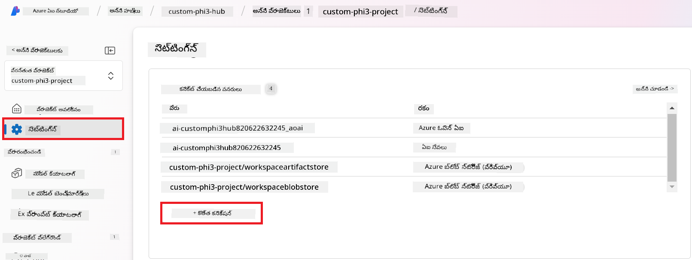

1. నావిగేషన్ మెనూ నుండి **కస్టమ్ కీస్**ను ఎంచుకోండి.

    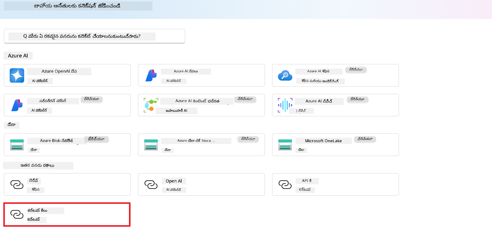

1. క్రింది పనులు చేయండి:

    - **+ కీ విలువ జత చేయండి**ను ఎంచుకోండి.
    - కీ పేరు గా **endpoint** ను నమోదు చేసి, Azure ML Studio నుండి కాపీ చేసిన ఎండ్పాయింట్ ను విలువ ఫీల్డ్ లో పేస్ట్ చేయండి.
    - మళ్ళీ **+ కీ విలువ జత చేయండి**ను ఎంచుకోండి.
    - కీ పేరు గా **key** ను నమోదు చేసి, Azure ML Studio నుండి కాపీ చేసిన కీని విలువ ఫీల్డ్ లో పేస్ట్ చేయండి.
    - కీలు జోడించిన తర్వాత, కీ డేటాను లీక్ కాకుండా **is secret** ఎంచుకోండి.

    

1. **కనెక్షన్ జోడించండి** ను ఎంచుకోండి.

#### Prompt flow సృష్టించండి

మీరు Azure AI Foundryలో కస్టమ్ కనెక్షన్ జోడించిన తర్వాత, క్రింది దశలను పాటించి Prompt flow సృష్టించండి. ఆపై ఈ Prompt flow ని కస్టమ్ కనెక్షన్ తో కనెక్ట్ చేసి, ఫైన్-ట్యూన్ చేసిన మోడల్‌ను Prompt flowలో ఉపయోగించవచ్చు.

1. మీరు సృష్టించిన Azure AI Foundry ప్రాజెక్ట్ కు వెళ్లండి.

1. ఎడమ వైపు ట్యాబ్ నుండి **Prompt flow** ను ఎంచుకోండి.

1. నావిగేషన్ మెనూ నుండి **+ సృష్టించండి** ను ఎంచుకోండి.

    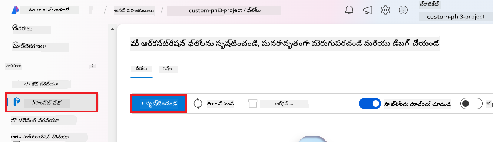

1. నావిగేషన్ మెనూ నుండి **చాట్ ఫ్లో** ను ఎంచుకోండి.

    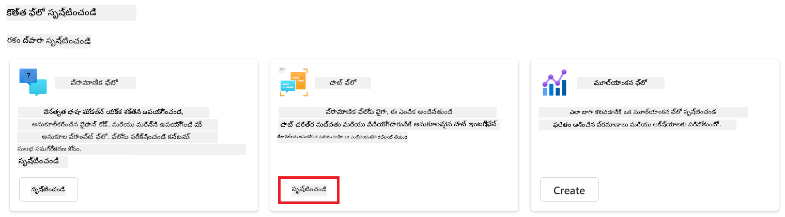

1. ఉపయోగించదలచిన **ఫోల్డర్ పేరు** ను నమోదు చేయండి.

    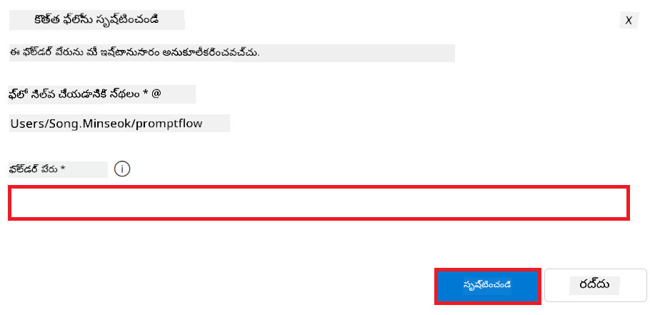

2. **సృష్టించండి** ను ఎంచుకోండి.

#### మీ కస్టమ్ Phi-3 మోడల్ తో చాట్ చేయటానికి Prompt flow సెట్ చేయండి

మీకు ఫైన్-ట్యూన్ చేసిన Phi-3 మోడల్ ను Prompt flowలో ఇంటిగ్రేట్ చేయాల్సి ఉంటుంది. అయితే, ప్రస్తుత Prompt flow ఈ లక్ష్యానికి ఎలాంటి రూపకల్పన కాకపోవడం వల్ల, మీరు Prompt flowని తిరిగి రూపొందించాలి.

1. Prompt flowలో, క్రింది పనులు నిర్వహించి ప్రస్తుత ఫ్లోని తిరిగి నిర్మించండి:

    - **రా ఫైల్ మోడ్** ను ఎంచుకోండి.
    - *flow.dag.yml* ఫైల్ లో ఉన్న అన్ని కోడ్ ను తొలగించండి.
    - క్రింది కోడ్ ను *flow.dag.yml* ఫైల్ లో జోడించండి.

        ```yml
        inputs:
          input_data:
            type: string
            default: "Who founded Microsoft?"

        outputs:
          answer:
            type: string
            reference: ${integrate_with_promptflow.output}

        nodes:
        - name: integrate_with_promptflow
          type: python
          source:
            type: code
            path: integrate_with_promptflow.py
          inputs:
            input_data: ${inputs.input_data}
        ```

    - **సేవ్ చేయండి** ను ఎంచుకోండి.

    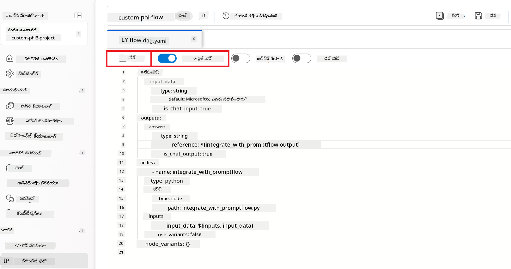

1. క్రింది కోడ్‌ను *integrate_with_promptflow.py* ఫైల్ లో జోడించి, Prompt flowలో మీ కస్టమ్ Phi-3 మోడల్ ఉపయోగించండి.

    ```python
    import logging
    import requests
    from promptflow import tool
    from promptflow.connections import CustomConnection

    # లాగింగ్ సెటప్
    logging.basicConfig(
        format="%(asctime)s - %(levelname)s - %(name)s - %(message)s",
        datefmt="%Y-%m-%d %H:%M:%S",
        level=logging.DEBUG
    )
    logger = logging.getLogger(__name__)

    def query_phi3_model(input_data: str, connection: CustomConnection) -> str:
        """
        Send a request to the Phi-3 model endpoint with the given input data using Custom Connection.
        """

        # "connection" అనేది కస్టమ్ కనెక్షన్ పేరు, "endpoint", "key" అనేవి కస్టమ్ కనెక్షన్ లోని కీలు
        endpoint_url = connection.endpoint
        api_key = connection.key

        headers = {
            "Content-Type": "application/json",
            "Authorization": f"Bearer {api_key}"
        }
        data = {
            "input_data": {
                "input_string": [
                    {"role": "user", "content": input_data}
                ],
                "parameters": {
                    "temperature": 0.7,
                    "max_new_tokens": 128
                }
            }
        }
        try:
            response = requests.post(endpoint_url, json=data, headers=headers)
            response.raise_for_status()
            
            # పూర్తి JSON ప్రతిస్పందనను లాగ్ చేయండి
            logger.debug(f"Full JSON response: {response.json()}")

            result = response.json()["output"]
            logger.info("Successfully received response from Azure ML Endpoint.")
            return result
        except requests.exceptions.RequestException as e:
            logger.error(f"Error querying Azure ML Endpoint: {e}")
            raise

    @tool
    def my_python_tool(input_data: str, connection: CustomConnection) -> str:
        """
        Tool function to process input data and query the Phi-3 model.
        """
        return query_phi3_model(input_data, connection)

    ```

    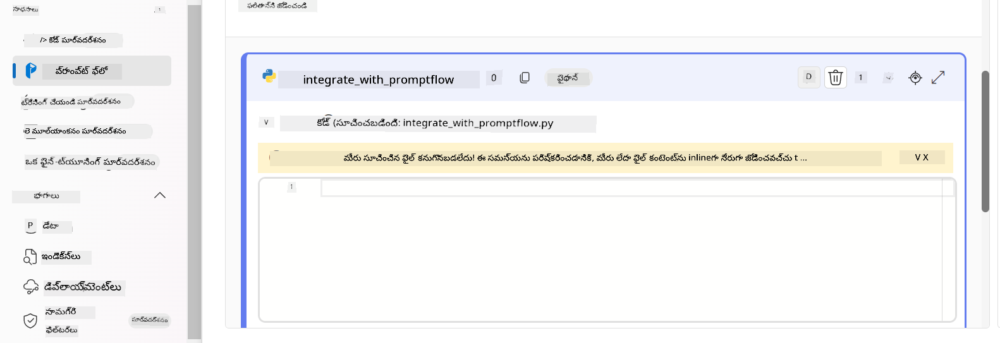

> [!NOTE]
> Azure AI Foundryలో Prompt flow ఉపయోగించే సందర్భంగా మరింత వివరమైన సమాచారానికి, మీరు [Azure AI Foundry లో Prompt flow](https://learn.microsoft.com/azure/ai-studio/how-to/prompt-flow) ను చూడవచ్చు.

1. **చాట్ ఇన్‌పుట్**, **చాట్ అవుట్పుట్** ను ఎంచుకుని మీ మోడల్ తో చాట్ ప్రారంభించండి.

    

1. ఇప్పుడు మీరు మీ కస్టమ్ Phi-3 మోడల్ తో చాట్ చేయడానికి సిద్ధంగా ఉన్నారు. తదుపరి వ్యాయామంలో, Prompt flow ప్రారంభించి, ఫైన్-ట్యూన్ చేసిన Phi-3 మోడల్ తో చాట్ చేయడం నేర్చుకుంటారు.

> [!NOTE]
>
> తిరిగి తయారు చేసిన ఫ్లో క్రింది చిత్రం లాగా ఉండాలి:
>
> 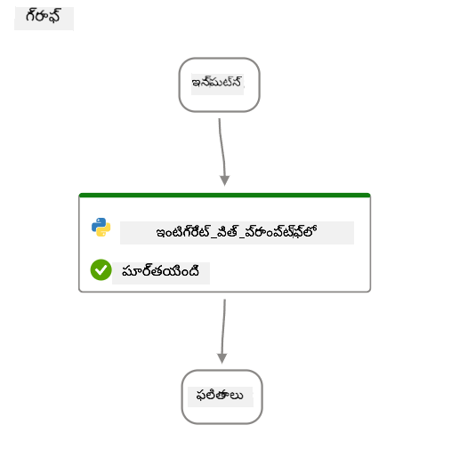
>

### మీ కస్టమ్ Phi-3 మోడల్ తో చాట్ చేయండి

మీరు ఫైన్-ట్యూన్ చేసి Prompt flow తో మీ కస్టమ్ Phi-3 మోడల్‌ను ఇంటిగ్రేట్ చేసిన తరువాత, దాన్ని ఉపయోగించి సంభాషణ ప్రారంభించడానికి సిద్ధంగా ఉన్నారు. ఈ వ్యాయామం మీ మోడల్ తో చాట్ సెట్టింగ్స్ ఏర్పాటు చేసి సంభాషణ ఎలా మొదలుపెట్టాలో చూపిస్తుంది. ఈ దశలను అనుసరిస్తూ మీరు మీ ఫైన్-ట్యూన్ చేసిన Phi-3 మోడల్ యొక్క సామర్థ్యాలను పూర్వకంగా ఉపయోగించవచ్చు.

- Prompt flow ఉపయోగించి మీ కస్టమ్ Phi-3 మోడల్ తో చాట్ చేయండి.

#### Prompt flow ప్రారంభించండి

1. Prompt flow ప్రారంభించడానికి **స్టార్ట్ కంప్యూట్ సెషన్స్** ను ఎంచుకోండి.

    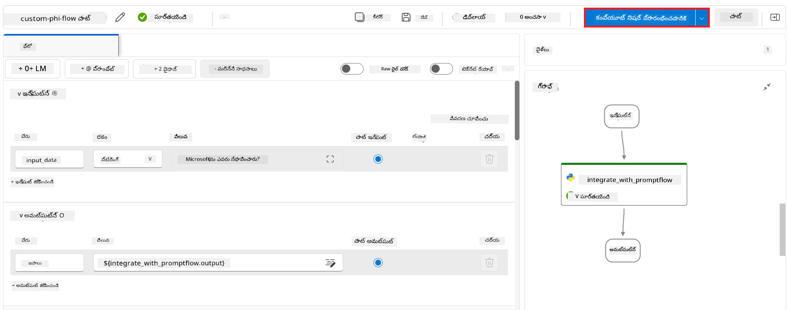

1. పారామీటర్లను అప్‌డేట్ చేయడానికి **వెలిడేట్ మరియు ఇన్‌పుట్ విన్యాసం** ను ఎంచుకోండి.

    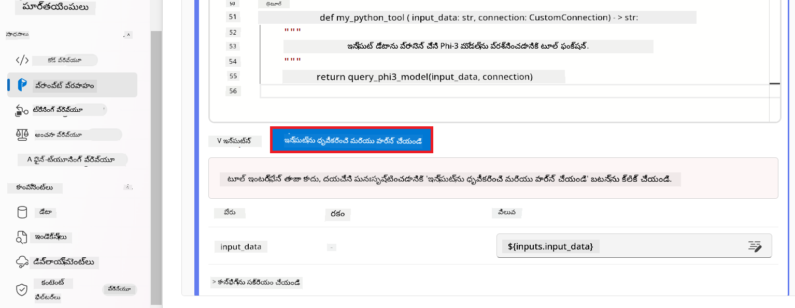

1. మీరు సృష్టించిన కస్టమ్ కానెక్షన్ కు చెందిన **కనెక్షన్** విలువను ఎంచుకోండి. ఉదాహరణకు, *connection*.

    

#### మీ కస్టమ్ మోడల్ తో చాట్ చేయండి

1. **చాట్** ను ఎంచుకోండి.

    

1. ఫలితాల ఉదాహరణగా: ఇప్పుడు మీరు మీ కస్టమ్ Phi-3 మోడల్ తో చాట్ చేయవచ్చు. ఫైన్-ట్యూనింగ్ కోసం ఉపయోగించిన డేటా ఆధారంగా ప్రశ్నలు అడగడం మంచిది.

    

---

<!-- CO-OP TRANSLATOR DISCLAIMER START -->
**వేదాంత సూచన**:  
ఈ డాక్యుమెంట్‌ను AI అనువాద సేవ [Co-op Translator](https://github.com/Azure/co-op-translator) ఉపయోగించి అనువదించామని తెలియజేస్తున్నాము. యథార్థతకు మనస్పూర్తిగా ప్రయత్నించినప్పటికీ, ఆటోమేటెడ్ అనువాదాల్లో పొరపాట్లు లేదా తప్పులు ఉండవచ్చు. ఈ డాక్యుమెంట్ యొక్క మౌలిక భాషలో ఉన్న అసలు ప్రతిని అధికారిక ఆధారంగా పరిగణించాలి. ముఖ్యమైన సమాచారం కోసం, నిపుణుల చేత చేసిన అనువాదాన్ని సిఫారసు చేసేది. ఈ అనువాదం ద్వారా వచ్చే ఏవైనా అపార్థాలు లేదా తప్పుదోహదాలకు మేము బాధ్యులు కాలేము.
<!-- CO-OP TRANSLATOR DISCLAIMER END -->