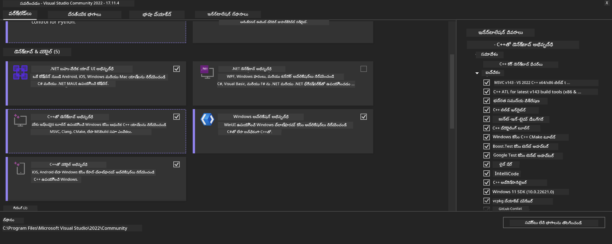
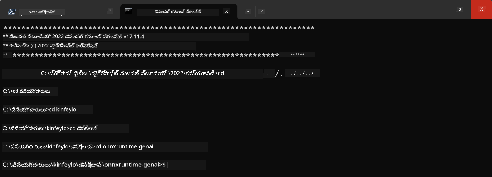

<!--
CO_OP_TRANSLATOR_METADATA:
{
  "original_hash": "b066fc29c1b2129df84e027cb75119ce",
  "translation_date": "2025-12-21T21:06:30+00:00",
  "source_file": "md/02.Application/01.TextAndChat/Phi3/ORTWindowGPUGuideline.md",
  "language_code": "te"
}
-->
# **OnnxRuntime GenAI Windows GPU కోసం మార్గదర్శకం**

ఈ మార్గదర్శకం Windows లో GPUs తో ONNX Runtime (ORT) ను సెటప్ చేసి ఉపయోగించడానికి దశలను అందిస్తుంది. ఇది మీ మోడళ్ల కోసం GPU ఆక్సిలరేషన్‌ను ఉపయోగించి ప్రదర్శన మరియు సామర్థ్యాన్ని మెరుగుపర్చడానికి మీకు సహాయపడటానికి రూపొందించబడింది.

The document provides guidance on:

- Environment Setup: CUDA, cuDNN, మరియు ONNX Runtime వంటి అవసరమైన డిపెండెన్సీలు ఎలా ఇన్‌స్టాల్ చేయాలో సూచనలు.
- Configuration: GPU వనరులను సమర్థవంతంగా ఉపయోగించడానికి పర్యావరణం మరియు ONNX Runtime ను ఎలా కాన్ఫిగర్ చేయాలో.
- Optimization Tips: ఉత్తమ పనితీరు కోసం మీ GPU సెట్టింగ్స్‌ను ఎలా సర్దుబాటు చేయాలో సూచనలు.

### **1. Python 3.10.x /3.11.8**

   ***Note*** మీ Python env కోసం [miniforge](https://github.com/conda-forge/miniforge/releases/latest/download/Miniforge3-Windows-x86_64.exe) ఉపయోగించమని సూచించబడుతుంది

   ```bash

   conda create -n pydev python==3.11.8

   conda activate pydev

   ```

   ***Reminder*** మీ సిస్టమ్‌లో Python ONNX సంబంధించిన ఏదైనా లైబ్రరీ ఇన్‌స్టాల్ చేసి ఉంటే దయచేసి అవన్నీ అన్‌ఇన్‌స్టాల్ చేయండి

### **2. Install CMake with winget**


   ```bash

   winget install -e --id Kitware.CMake

   ```

### **3. Install Visual Studio 2022 - Desktop Development with C++**

   ***Note*** మీరు కంపైల్ చేయకూడదనుకుంటే ఈ దశను దాటవేయవచ్చు




### **4. Install NVIDIA Driver**

1. **NVIDIA GPU డ్రైవర్**  [https://www.nvidia.com/en-us/drivers/](https://www.nvidia.com/en-us/drivers/)

2. **NVIDIA CUDA 12.4** [https://developer.nvidia.com/cuda-12-4-0-download-archive](https://developer.nvidia.com/cuda-12-4-0-download-archive)

3. **NVIDIA CUDNN 9.4**  [https://developer.nvidia.com/cudnn-downloads](https://developer.nvidia.com/cudnn-downloads)

***Reminder*** దయచేసి ఇన్‌స్టాలేషన్ సమయంలో డిఫాల్ట్ సెట్టింగ్స్ ఉపయోగించండి

### **5. Set NVIDIA Env**

NVIDIA CUDNN 9.4 యొక్క lib, bin, include ఫైళ్లను NVIDIA CUDA 12.4 యొక్క lib, bin, include కి కాపీ చేయండి

- కాపీ చేయండి *'C:\Program Files\NVIDIA\CUDNN\v9.4\bin\12.6'* ఫైళ్ళను  *'C:\Program Files\NVIDIA GPU Computing Toolkit\CUDA\v12.4\bin*
- కాపీ చేయండి *'C:\Program Files\NVIDIA\CUDNN\v9.4\include\12.6'* ఫైళ్ళను  *'C:\Program Files\NVIDIA GPU Computing Toolkit\CUDA\v12.4\include*
- కాపీ చేయండి *'C:\Program Files\NVIDIA\CUDNN\v9.4\lib\12.6'* ఫైళ్ళను  *'C:\Program Files\NVIDIA GPU Computing Toolkit\CUDA\v12.4\lib\x64'*

### **6. Download Phi-3.5-mini-instruct-onnx**


   ```bash

   winget install -e --id Git.Git

   winget install -e --id GitHub.GitLFS

   git lfs install

   git clone https://huggingface.co/microsoft/Phi-3.5-mini-instruct-onnx

   ```

### **7. InferencePhi35Instruct.ipynb ను నడపడం**

   [Notebook](../../../../code/09.UpdateSamples/Aug/ortgpu-phi35-instruct.ipynb) ని తెరిచి అమలు చేయండి 


### **8. Compile ORT GenAI GPU**


   ***Note*** 
   
   1. దయచేసి మొదట onnx, onnxruntime మరియు onnxruntime-genai కు సంబంధించిన అన్ని ప్యాకేజీలు అన్‌ఇన్‌స్టాల్ చేయండి

   
   ```bash

   pip list 
   
   ```

   ఆపై అన్ని onnxruntime లైబ్రరీలను అన్‌ఇన్‌స్టాల్ చేయండి, ఉదాహరణకి 


   ```bash

   pip uninstall onnxruntime

   pip uninstall onnxruntime-genai

   pip uninstall onnxruntume-genai-cuda
   
   ```

   2. Visual Studio ఎక్స్టెన్షన్ మద్దతు తనిఖీ చేయండి 

   Check C:\Program Files\NVIDIA GPU Computing Toolkit\CUDA\v12.4\extras ను తనిఖీ చేసి C:\Program Files\NVIDIA GPU Computing Toolkit\CUDA\v12.4\extras\visual_studio_integration కనుగొనబడిందో లేదో నిర్ధారించండి. 
   
   కనుగొనబడకపోతే ఇతర Cuda toolkit డ్రైవర్ ఫోల్డర్లను తనిఖీ చేసి visual_studio_integration ఫోల్డర్ మరియు దాని కంటెంట్‌ను C:\Program Files\NVIDIA GPU Computing Toolkit\CUDA\v12.4\extras\visual_studio_integration కు కాపీ చేయండి


   - మీరు కంపైల్ చేయకూడదనుకుంటే ఈ దశను వదిలేయవచ్చు


   ```bash

   git clone https://github.com/microsoft/onnxruntime-genai

   ```

   - డౌన్లోడ్ చేయండి [https://github.com/microsoft/onnxruntime/releases/download/v1.19.2/onnxruntime-win-x64-gpu-1.19.2.zip](https://github.com/microsoft/onnxruntime/releases/download/v1.19.2/onnxruntime-win-x64-gpu-1.19.2.zip)

   - onnxruntime-win-x64-gpu-1.19.2.zip ను అన్‌జిప్ చేసి, దాన్ని **ort** గా పేరు మార్చి, ort ఫోల్డర్‌ను onnxruntime-genai కి కాపీ చేయండి

   - Windows Terminal ఉపయోగించి, Developer Command Prompt for VS 2022 కి వెళ్లి onnxruntime-genai ఫోల్డర్‌లోకి వెళ్లండి



   - మీ python env తో దీన్ని కంపైల్ చేయండి

   
   ```bash

   cd onnxruntime-genai

   python build.py --use_cuda  --cuda_home "C:\Program Files\NVIDIA GPU Computing Toolkit\CUDA\v12.4" --config Release
 

   cd build/Windows/Release/Wheel

   pip install .whl

   ```

---

<!-- CO-OP TRANSLATOR DISCLAIMER START -->
నిరాకరణ:
ఈ పత్రాన్ని AI అనువాద సేవ Co‑op Translator (https://github.com/Azure/co-op-translator) ఉపయోగించి అనువదించబడింది. మేము ఖచ్చితత్వానికి ప్రయత్నించినప్పటికీ, స్వయంచాలక అనువాదాల్లో తప్పులు లేదా లోపాలు ఉండవచ్చు. అసలు భాషలో ఉన్న మూల పత్రాన్ని అధికారిక మూలంగా పరిగణించాలి. కీలకమైన సమాచారానికి వృత్తిపరమైన మానవ అనువాదాన్ని చేయించుకోవాలని సూచిస్తాం. ఈ అనువాదం వలన కలిగే ఏవైనా అపవ్యతులు లేదా తప్పుగా అర్థం చేసుకోవడాలకు మేము బాధ్యులం కాదు.
<!-- CO-OP TRANSLATOR DISCLAIMER END -->