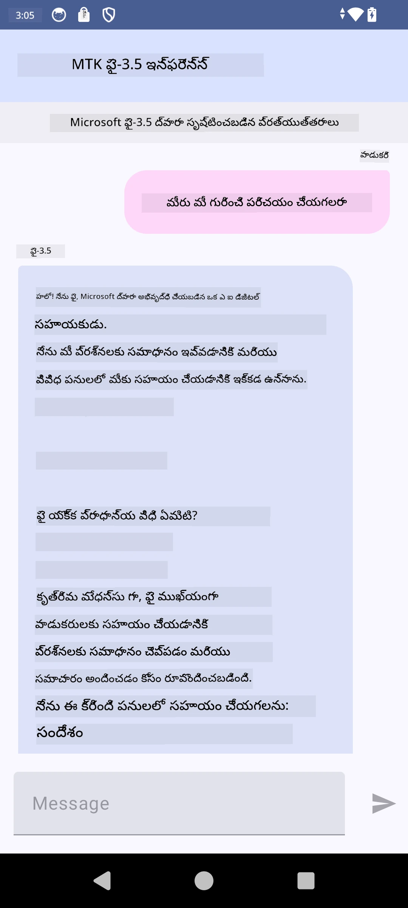

<!--
CO_OP_TRANSLATOR_METADATA:
{
  "original_hash": "c4fe7f589d179be96a5577b0b8cba6aa",
  "translation_date": "2025-12-21T21:37:12+00:00",
  "source_file": "md/02.Application/01.TextAndChat/Phi3/UsingPhi35TFLiteCreateAndroidApp.md",
  "language_code": "te"
}
-->
# **Microsoft Phi-3.5 tflite ఉపయోగించి Android యాప్ తయారు చేయడం**

ఇది Microsoft Phi-3.5 tflite మోడళ్లను ఉపయోగించే Android ఉదాహరణ.

## **📚 జ్ఞానం**

Android LLM Inference API ద్వారా మీరు Android అప్లికేషన్ల కోసం పెద్ద భాషా మోడళ్లను (LLMs) పూర్తిగా డివైస్‌పై నడపొచ్చు, ఇవి టెక్స్ట్ ఉత్పత్తి చేయడం, సహజ భాషా రూపంలో సమాచారం పొందడం, పత్రాలను సంగ్రహించడం వంటి విస్తృత పనులను నిర్వహించడానికి ఉపయోగించవచ్చు. ఈ టాస్క్‌లో పాఠ్యం-నుండి-పాఠ్యం (text-to-text) పెద్ద భాషా మోడళ్లకు అంతర్గత మద్దతు ఉంది, కాబట్టి మీరు తాజా on-device జనరేటివ్ AI మోడళ్లను మీ Android యాప్స్‌కి వర్తింపజేయవచ్చు.

Googld AI Edge Torch ఒక python లైబ్రరీ, ఇది PyTorch మోడళ్లను .tflite ఫార్మాట్‌గా మార్చడానికి మద్దతు ఇస్తుంది, తరువాత వాటిని TensorFlow Lite మరియు MediaPipe తో నడిపించవచ్చు. ఇది మోడళ్లను పూర్తిగా డివైస్‌పై నడపగల Android, iOS మరియు IoT అప్లికేషన్లను సాధ్యమవుతుంది. AI Edge Torch విస్తృత CPU కవరేజ్ అందిస్తుంది, ప్రారంభంగా GPU మరియు NPU మద్దతుతో. AI Edge Torch PyTorchతో బాగా సమన్వయంగా ఉండేందుకు ప్రయత్నిస్తుంది, torch.export() పై నిర్మించి Core ATen ఆపరేటర్లకు మంచి కవరేజ్ అందిస్తుంది.

## **🪬 మార్గదర్శకాలు**

### **🔥 Microsoft Phi-3.5ని tfliteకి మార్చడం**

0. ఈ నమూనా Android 14+ కోసం

1. Python 3.10.12 ఇన్‌స్టాల్ చేయండి

***Suggestion:*** మీ Python env ఇన్‌స్టాల్ చేయడానికి conda ఉపయోగించండి

2. Ubuntu 20.04 / 22.04 (దయచేసి [google ai-edge-torch](https://github.com/google-ai-edge/ai-edge-torch) పై దృష్టి పెట్టండి)

***Suggestion:*** మీ env సృష్టించడానికి Azure Linux VM లేదా 3rd party cloud vm ఉపయోగించండి

3. మీ Linux bash కి వెళ్లి, Python లైబ్రర리를 ఇన్‌స్టాల్ చేయండి

```bash

git clone https://github.com/google-ai-edge/ai-edge-torch.git

cd ai-edge-torch

pip install -r requirements.txt -U 

pip install tensorflow-cpu -U

pip install -e .

```

4. Hugging face నుండి Microsoft-3.5-Instruct డౌన్‌లోడ్ చేయండి


```bash

git lfs install

git clone  https://huggingface.co/microsoft/Phi-3.5-mini-instruct

```

5. Microsoft Phi-3.5 ను tfliteకి మార్చండి


```bash

python ai-edge-torch/ai_edge_torch/generative/examples/phi/convert_phi3_to_tflite.py --checkpoint_path  Your Microsoft Phi-3.5-mini-instruct path --tflite_path Your Microsoft Phi-3.5-mini-instruct tflite path  --prefill_seq_len 1024 --kv_cache_max_len 1280 --quantize True

```


### **🔥 Microsoft Phi-3.5 ని Android Mediapipe బండిల్‌కు మార్చడం**

దయచేసి ముందు mediapipe ను ఇన్‌స్టాల్ చేయండి

```bash

pip install mediapipe

```

ఈ కోడ్‌ను [మీ నోట్‌బుక్](../../../../code/09.UpdateSamples/Aug/Android/convert/convert_phi.ipynb)లో నడపండి


```python

import mediapipe as mp
from mediapipe.tasks.python.genai import bundler

config = bundler.BundleConfig(
    tflite_model='Your Phi-3.5 tflite model path',
    tokenizer_model='Your Phi-3.5 tokenizer model path',
    start_token='start_token',
    stop_tokens=[STOP_TOKENS],
    output_filename='Your Phi-3.5 task model path',
    enable_bytes_to_unicode_mapping=True or Flase,
)
bundler.create_bundle(config)

```


### **🔥 adb push ద్వారా టాస్క్ మోడల్‌ను మీ Android డివైస్ మార్గానికి పంపడం**


```bash

adb shell rm -r /data/local/tmp/llm/ # మునుపటి లోడ్ చేసిన మోడల్స్‌ను తీసివేయండి

adb shell mkdir -p /data/local/tmp/llm/

adb push 'Your Phi-3.5 task model path' /data/local/tmp/llm/phi3.task

```

### **🔥 మీ Android కోడ్ నడపడం**



---

<!-- CO-OP TRANSLATOR DISCLAIMER START -->
బాధ్యతా నిరాకరణ:
ఈ పత్రాన్ని AI అనువాద సేవ Co‑op Translator (https://github.com/Azure/co-op-translator) ద్వారా అనువదించారు. మేము ఖచ్చితత్వానికి యత్నించినప్పటికీ, ఆటోమేటెడ్ అనువాదాల్లో తప్పులు లేదా అసమర్థతలు ఉండవచ్చు. మూల పత్రాన్ని దాని స్వదేశీ భాషలో ఉన్న వెర్షన్‌ను అధికారిక మూలంగా పరిగణించాలి. కీలకమైన సమాచారం కోసం వృత్తిపరమైన మానవ అనువాదాన్ని సిఫార్సు చేయబడుతుంది. ఈ అనువాదం ఉపయోగం వల్ల కలిగిన ఏవైనా అపార్థాలు లేదా తప్పైన అర్థాల కోసం మేము బాధ్యులు కాదని తెలియజేస్తున్నాము.
<!-- CO-OP TRANSLATOR DISCLAIMER END -->