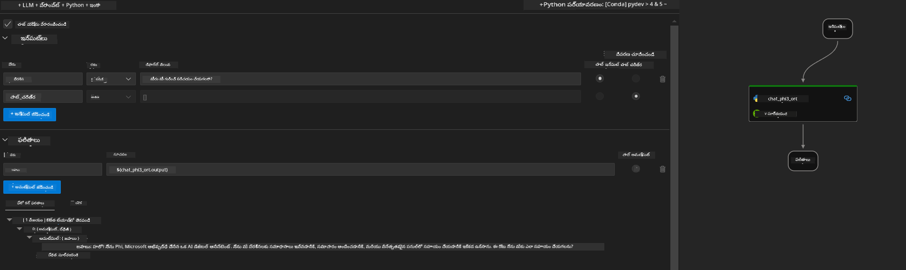

<!--
CO_OP_TRANSLATOR_METADATA:
{
  "original_hash": "92e7dac1e5af0dd7c94170fdaf6860fe",
  "translation_date": "2025-12-21T21:41:50+00:00",
  "source_file": "md/02.Application/01.TextAndChat/Phi3/UsingPromptFlowWithONNX.md",
  "language_code": "te"
}
-->
# Windows GPU ను ఉపయోగించి Phi-3.5-Instruct ONNX తో Prompt flow పరిష్కారాన్ని సృష్టించడం

కింది డాక్యుమెంట్ Phi-3 మోడళ్ల ఆధారంగా AI అప్లికేషన్లను అభివృద్ధి చేయడానికి ONNX (Open Neural Network Exchange) తో PromptFlow ను ఎలా ఉపయోగించాలో ఒక ఉదాహరణగా ఉంది.

PromptFlow అనేది ఐడియేషన్ మరియు ప్రోటోటైపింగ్ నుండి టెస్టింగ్ మరియు మూల్యాంకన వరకు LLM-ఆధారిత (Large Language Model) AI అప్లికేషన్ల ఎండ్-టు-ఎండ్ అభివృద్ధి చక్రాన్ని సులభతరం చేయడానికి రూపొందించిన ఒక అభివృద్ధి సాధనాల సమాహారం.

PromptFlow ను ONNX తో ఇంటిగ్రేట్ చేయడం ద్వారా డెవలపర్లు చేయగలిగే విషయాలు:

- Optimize Model Performance: ONNX ను సమర్థవంతమైన మోడల్ ఇన్ఫరెన్స్ మరియు డిప్లాయ్‌మెంట్ కోసం వినియోగించండి.
- Simplify Development: Workflow ను నిర్వహించడానికి మరియు పునరావృత పనులను ఆటోమేట్ చేయడానికి PromptFlow ను ఉపయోగించండి.
- Enhance Collaboration: ఏకైక అభివృద్ధి వాతావరణాన్ని అందించడం ద్వారా టీమ్ సభ్యుల మద్య మెరుగైన సహకారాన్ని సులభతరం చేయండి.

**Prompt flow** అనేది ఐడియేషన్, ప్రోటోటైపింగ్, టెస్టింగ్, మూల్యాంకన నుంచి ఉత్పత్తి డిప్లాయ్‌మెంట్ మరియు మానిటరింగ్ వరకు LLM-ఆధారిత AI అప్లికేషన్ల ఎండ్-టు-ఎండ్ అభివృద్ధి చక్రాన్ని సరళీకృతం చేయడానికి రూపొందించిన అభివృద్ధి సాధనాల సమాహారం. ఇది prompt ఇంజినీరింగ్‌ను చాలా సులభతరం చేస్తుంది మరియు మీకు ప్రొడక్షన్-నాణ్యత గల LLM అనువర్తనాలను నిర్మించడానికి సహాయపడుతుంది.

Prompt flow OpenAI, Azure OpenAI Service, మరియు కస్టమైజబుల్ మోడల్స్ (Huggingface, local LLM/SLM) కు కనెక్ట్ కావచ్చు. మేము Phi-3.5 యొక్క క్వాంటైజ్డ్ ONNX మోడల్‌ను లోకల్ అప్లికేషన్లకు డిప్లాయ్ చేయాలని ఆశిస్తున్నాము. Prompt flow మాకు మా వ్యాపారాన్ని మెరుగ్గా ప్రణాళిక గావించడంలో మరియు Phi-3.5 ఆధారిత లోకల్ పరిష్కారాలను పూర్తి చేయడంలో సహాయపడుతుంది. ఈ ఉదాహరణలో, మేము Windows GPU ఆధారిత Prompt flow పరిష్కారాన్ని పూర్తి చేయడానికి ONNX Runtime GenAI Library ను కలపబోతున్నాము.

## **సంస్థాపన**

### **Windows GPU కొరకు ONNX Runtime GenAI**

Windows GPU కోసం ONNX Runtime GenAI అమర్చడానికి ఈ మార్గదర్శకాన్ని చదవండి  [ఇక్కడ క్లిక్ చేయండి](./ORTWindowGPUGuideline.md)

### **VSCodeలో Prompt flow సెటప్ చేయండి**

1. Install Prompt flow VS Code Extension


2. After install Prompt flow VS Code Extension， click the extension，and choose **Installation dependencies** follow this guideline to install Prompt flow SDK in your env


3. Download [నమూనా కోడ్](../../../../../../code/09.UpdateSamples/Aug/pf/onnx_inference_pf) and use VS Code to open this sample


4. Open **flow.dag.yaml** to choose your Python env


   Open **chat_phi3_ort.py** to change your Phi-3.5-instruct ONNX Model location


5. Run your prompt flow to testing

Open **flow.dag.yaml** click visual editor


after click this,and run it to test



1. You can run batch in terminal to check more result


```bash

pf run create --file batch_run.yaml --stream --name 'Your eval qa name'    

```

You can check results in your default browser


---

<!-- CO-OP TRANSLATOR DISCLAIMER START -->
నిరాకరణ:
ఈ పత్రాన్ని AI అనువాద సేవ [Co-op Translator](https://github.com/Azure/co-op-translator) ఉపయోగించి అనువదించబడింది. మేము ఖచ్చితత్వానికి ప్రయత్నించినప్పటికీ, ఆటోమేటెడ్ అనువాదాల్లో తప్పులు లేదా లోపాలు ఉండవచ్చని దయచేసి గమనించండి. మూల పత్రాన్ని దాని మాతృభాషలో ఉన్న సంస్కరణను అధికారిక మూలంగా తీసుకోవాలి. కీలక సమాచారానికి, వృత్తిపరమైన మానవ అనువాదం పొందాలని సూచిస్తాము. ఈ అనువాదం ఉపయోగించడంతో ఏర్పడిన ఏవైనా అపార్థాలు లేదా తప్పుగా అర్థం చేసుకోవడాలకు మేము బాధ్యులు కాదని తెలియజేస్తాం.
<!-- CO-OP TRANSLATOR DISCLAIMER END -->