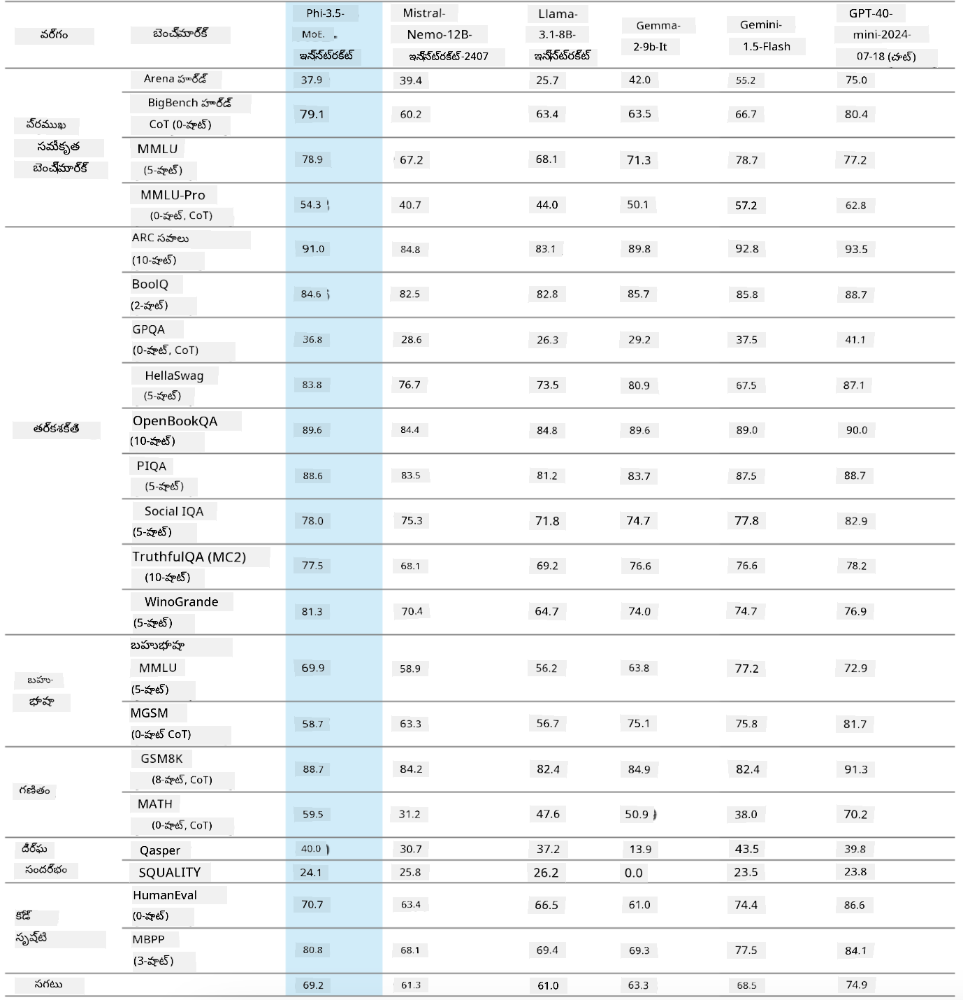
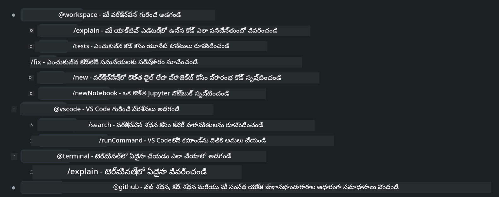
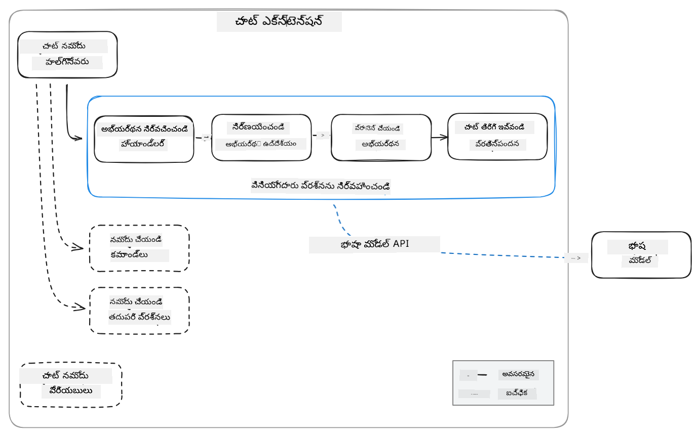
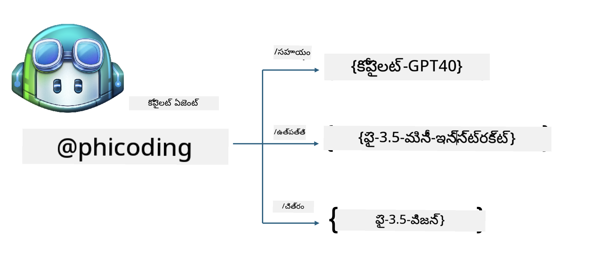
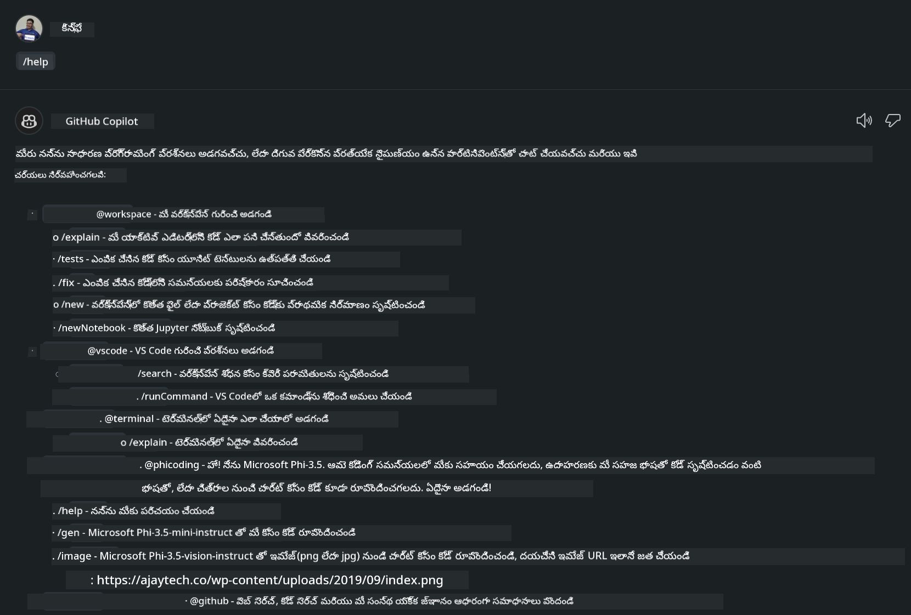
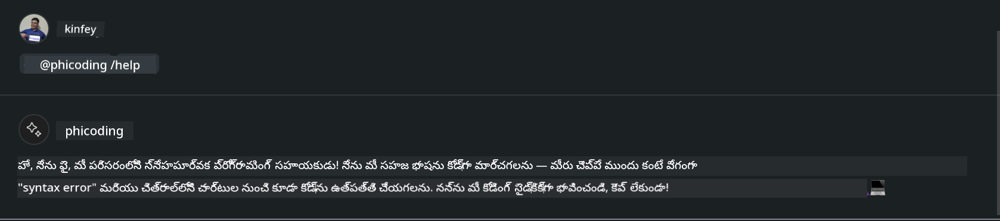
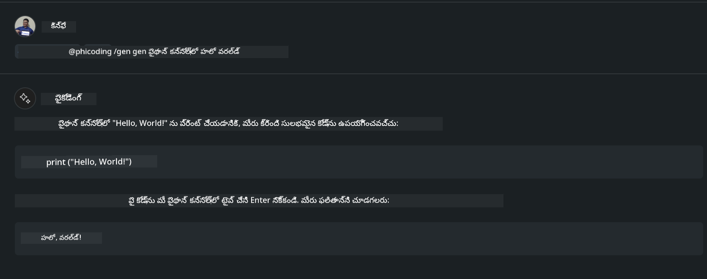

<!--
CO_OP_TRANSLATOR_METADATA:
{
  "original_hash": "35bf81388ac6917277b8d9a0c39bdc70",
  "translation_date": "2025-12-21T19:18:38+00:00",
  "source_file": "md/02.Application/02.Code/Phi3/CreateVSCodeChatAgentWithGitHubModels.md",
  "language_code": "te"
}
-->
# **మీ సొంత Visual Studio Code చాట్ Copilot ఏజెంట్‌ను GitHub Models ద్వారా Phi-3.5 తో తయారుచేసుకోండి**

మీరు Visual Studio Code Copilot ఉపయోగిస్తున్నారా? ముఖ్యంగా చాట్‌లో, మీరు వివిధ ఏజెంట్స్‌ను ఉపయోగించి Visual Studio Codeలో ప్రాజెక్టులను సృష్టించడం, రాయడం, మరియు నిర్వహించడం సామర్థ్యాన్ని మెరుగుపరచుకోవచ్చు. Visual Studio Code ఒక APIని అందిస్తుంది ఇది కంపెనీలు మరియు వ్యక్తులు వారి బిజినెస్ ఆధారంగా వివిధ ఏజెంట్స్‌ని సృష్టించి వివిధ స్వంత రంగాల్లో వారి సామర్థ్యాలను విస్తరించడానికి అనుమతిస్తుంది. ఈ ఆర్టికల్‌లో, మేము మీ స్వంత Visual Studio Code ఏజెంట్‌ను సృష్టించడానికి GitHub Models లోని **Phi-3.5-mini-instruct (128k)** మరియు **Phi-3.5-vision-instruct (128k)** పై దృష్టి పెట్టబోతున్నాము.

## **GitHub Models上的 Phi-3.5 గురించి**

మనం తెలుసుకున్నాం कि Phi-3/3.5-mini-instruct Phi-3/3.5 కుటుంబంలో బలమైన కోడ్ అర్థం చేసుకోవడం మరియు రూపొందించే సామర్థ్యాలను కలిగి ఉంది, మరియు ఇది Gemma-2-9b మరియు Mistral-Nemo-12B-instruct-2407 పై కొన్ని ప్రయోజనాలు కలిగి ఉంది.



తాజా GitHub Models ఇప్పటికే Phi-3.5-mini-instruct (128k) మరియు Phi-3.5-vision-instruct (128k) మోడల్స్‌కు యాక్సెస్‌ను అందిస్తున్నాయి. డెవలపర్లు వాటిని OpenAI SDK, Azure AI Inference SDK, మరియు REST API ద్వారా యాక్సెస్ చేయవచ్చు.


***గమనిక:*** ఇక్కడ Azure AI Inference SDK ఉపయోగించడం సిఫార్సు చేయబడుతుంది, ఎందుకంటే ఇది ఉత్పత్తి వాతావరణంలో Azure Model Catalog తో మెరుగ్గా స్విచ్ చేయగలదు

కింది ఫలితాలు GitHub Models తో డాకింగ్ చేసిన తర్వాత కోడ్ జనరేషన్ దృశ్యంలో **Phi-3.5-mini-instruct (128k)** మరియు **Phi-3.5-vision-instruct (128k)** యొక్క వర్క్స్‌ను సూచిస్తాయి, మరియు క్రింది ఉదాహరణలకు కూడా తయారుచేస్తాయి

**డెమో: GitHub Models Phi-3.5-mini-instruct (128k) ప్రాంప్ట్ ద్వారా కోడ్ రూపొందించడం** ([ఈ లింక్‌ను క్లిక్ చేయండి](../../../../code/09.UpdateSamples/Aug/ghmodel_phi35_instruct_demo.ipynb))

**డెమో: GitHub Models Phi-3.5-vision-instruct (128k) ఇమేజ్ నుండి కోడ్ రూపొందించడం** ([ఈ లింక్‌ను క్లిక్ చేయండి](../../../../code/09.UpdateSamples/Aug/ghmodel_phi35_vision_demo.ipynb))


## **GitHub Copilot చాట్ ఏజెంట్ గురించి**

GitHub Copilot చాట్ ఏజెంట్ కోడ్ ఆధారంగా వివిధ ప్రాజెక్ట్ దృశ్యాలలో వివిధ పనులను పూర్తిచేయగలదు. సిస్టమ్‌లో నాలుగు ఏజెంట్లు ఉన్నాయి: workspace, github, terminal, vscode



ఏజెంట్ పేరును ‘@’ తో జోడించడం ద్వారా, మీరు సంబంధిత పని త్వరగా పూర్తి చేయవచ్చు. సంస్థల కోసం, మీరు మీ సొంత బిజినెస్-సంబంధిత కంటెంట్‌లను (అవసరాలు, కోడింగ్, టెస్ట్ స్పెసిఫికేషన్లు, విడుదల వంటి) జోడిస్తే, GitHub Copilot ఆధారంగా మీరు మరింత శక్తివంతమైన సంస్థా ప్రైవేట్ ఫంక్షన్లను పొందవచ్చు.

Visua Studio Code Chat Agent ఇప్పుడు అధికారికంగా దాని APIని విడుదల చేసింది, ఇది సంస్థలు లేదా సంస్థా డెవలపర్లు వివిధ సాఫ్ట్వేర్ బిజినెస్ ఎకోసిస్టమ్‌ల ఆధారంగా ఏజెంట్లను అభివృద్ధి చేయడానికి అనుమతిస్తుంది. Visual Studio Code Extension Development అభివృద్ధి విధానం ఆధారంగా, మీరు Visual Studio Code Chat Agent API ఇంటర్‌ఫేస్‌కి సులభంగా యాక్సెస్ పొందవచ్చు. మేము ఈ ప్రక్రియ ఆధారంగా అభివృద్ధి చేయవచ్చు



అభివృద్ధి దృశ్యం తృతీయ-పక్ష మోడల్ APIs (ఉదాహరణకు GitHub Models, Azure Model Catalog, మరియు ఓపెన్ సోర్స్ మోడల్స్ ఆధారంగా స్వయం-నిర్మిత సర్వీసులు)కి యాక్సెస్‌ను మద్దతు ఇవ్వగలదు మరియు GitHub Copilot అందించే gpt-35-turbo, gpt-4, మరియు gpt-4o మోడల్స్‌ను కూడా ఉపయోగించవచ్చు.

## **Phi-3.5 ఆధారంగా @phicoding అనే ఏజెంట్ జోడించండి**

మేము Phi-3.5 యొక్క ప్రోగ్రామింగ్ సామర్థ్యాలను ఒకీకరించి కోడ్ రాయడం, ఇమేజ్ జనరేషన్ కోడ్ మరియు ఇతర పనులను పూర్తి చేయడానికి ప్రయత్నిస్తున్నాము. Phi-3.5 చుట్టూ నిర్మించిన ఒక ఏజెంట్ - @PHI పూర్తి చేసి, కింది కొన్ని ఫంక్షన్లు ఉన్నాయి

1. GitHub Copilot ద్వారా అందించే GPT-4o ఆధారంగా **@phicoding /help** కమాండ్ ద్వారా స్వీయ పరిచయాన్ని రూపొందించడం
2. **Phi-3.5-mini-instruct (128k)** ఆధారంగా వివిధ ప్రోగ్రామింగ్ భాషల కోసం కోడ్ తయారుచేయడం **@phicoding /gen** కమాండ్ ద్వారా
3. **Phi-3.5-vision-instruct (128k)** ఆధారంగా ఇమేజ్ కంప్లీషన్ మరియు కోడ్ ఉత్పత్తి **@phicoding /image** కమాండ్ ద్వారా



## **సంబంధిత దశలు**

1. npm ఉపయోగించి Visual Studio Code Extension అభివృద్ధి మద్దతును ఇన్‌స్టాల్ చేయండి

```bash

npm install --global yo generator-code 

```
2. Create a Visual Studio Code Extension plugin (using Typescript development mode, named phiext)


```bash

yo code 

```

3. Open the created project and modify package.json. Here are the related instructions and configurations, as well as the configuration of GitHub Models. Note that you need to add your GitHub Models token here.


```json

{
  "name": "phiext",
  "displayName": "phiext",
  "description": "",
  "version": "0.0.1",
  "engines": {
    "vscode": "^1.93.0"
  },
  "categories": [
    "AI",
    "Chat"
  ],
  "activationEvents": [],
  "enabledApiProposals": [
      "chatVariableResolver"
  ],
  "main": "./dist/extension.js",
  "contributes": {
    "chatParticipants": [
        {
            "id": "chat.phicoding",
            "name": "phicoding",
            "description": "Hey! I am Microsoft Phi-3.5, She can help me with coding problems, such as generation code with your natural language, or even generation code about chart from images. Just ask me anything!",
            "isSticky": true,
            "commands": [
                {
                    "name": "help",
                    "description": "Introduce myself to you"
                },
                {
                    "name": "gen",
                    "description": "Generate code for you with Microsoft Phi-3.5-mini-instruct"
                },
                {
                    "name": "image",
                    "description": "Generate code for chart from image(png or jpg) with Microsoft Phi-3.5-vision-instruct, please add image url like this : https://ajaytech.co/wp-content/uploads/2019/09/index.png"
                }
            ]
        }
    ],
    "commands": [
        {
            "command": "phicoding.namesInEditor",
            "title": "Use Microsoft Phi 3.5 in Editor"
        }
    ],
    "configuration": {
      "type": "object",
      "title": "githubmodels",
      "properties": {
        "githubmodels.endpoint": {
          "type": "string",
          "default": "https://models.inference.ai.azure.com",
          "description": "Your GitHub Models Endpoint",
          "order": 0
        },
        "githubmodels.api_key": {
          "type": "string",
          "default": "Your GitHub Models Token",
          "description": "Your GitHub Models Token",
          "order": 1
        },
        "githubmodels.phi35instruct": {
          "type": "string",
          "default": "Phi-3.5-mini-instruct",
          "description": "Your Phi-35-Instruct Model",
          "order": 2
        },
        "githubmodels.phi35vision": {
          "type": "string",
          "default": "Phi-3.5-vision-instruct",
          "description": "Your Phi-35-Vision Model",
          "order": 3
        }
      }
    }
  },
  "scripts": {
    "vscode:prepublish": "npm run package",
    "compile": "webpack",
    "watch": "webpack --watch",
    "package": "webpack --mode production --devtool hidden-source-map",
    "compile-tests": "tsc -p . --outDir out",
    "watch-tests": "tsc -p . -w --outDir out",
    "pretest": "npm run compile-tests && npm run compile && npm run lint",
    "lint": "eslint src",
    "test": "vscode-test"
  },
  "devDependencies": {
    "@types/vscode": "^1.93.0",
    "@types/mocha": "^10.0.7",
    "@types/node": "20.x",
    "@typescript-eslint/eslint-plugin": "^8.3.0",
    "@typescript-eslint/parser": "^8.3.0",
    "eslint": "^9.9.1",
    "typescript": "^5.5.4",
    "ts-loader": "^9.5.1",
    "webpack": "^5.94.0",
    "webpack-cli": "^5.1.4",
    "@vscode/test-cli": "^0.0.10",
    "@vscode/test-electron": "^2.4.1"
  },
  "dependencies": {
    "@types/node-fetch": "^2.6.11",
    "node-fetch": "^3.3.2",
    "@azure-rest/ai-inference": "latest",
    "@azure/core-auth": "latest",
    "@azure/core-sse": "latest"
  }
}


```

4. Modify src/extension.ts


```typescript

// 'vscode' మాడ్యూల్‌లో VS Code యొక్క విస్తరణ API ఉంటుంది
// మాడ్యూల్‌ను దిగుమతి చేసుకుని క్రింది మీ కోడ్‌లో దానిని ప్రత్యాయ పేరుగా 'vscode'గా సూచించండి
import * as vscode from 'vscode';
import ModelClient from "@azure-rest/ai-inference";
import { AzureKeyCredential } from "@azure/core-auth";


interface IPhiChatResult extends vscode.ChatResult {
    metadata: {
        command: string;
    };
}


const MODEL_SELECTOR: vscode.LanguageModelChatSelector = { vendor: 'copilot', family: 'gpt-4o' };

function isValidImageUrl(url: string): boolean {
    const regex = /^(https?:\/\/.*\.(?:png|jpg))$/i;
    return regex.test(url);
}
  

// మీ ఎక్స్‌టెన్షన్ యాక్టివేట్ అయినప్పుడు ఈ విధానాన్ని పిలుస్తారు
// కమాండ్ మొదటి సారి అమలైన సమయంలో మీ ఎక్స్‌టెన్షన్ యాక్టివేట్ అవుతుంది
export function activate(context: vscode.ExtensionContext) {

    const codinghandler: vscode.ChatRequestHandler = async (request: vscode.ChatRequest, context: vscode.ChatContext, stream: vscode.ChatResponseStream, token: vscode.CancellationToken): Promise<IPhiChatResult> => {


        const config : any = vscode.workspace.getConfiguration('githubmodels');
        const endPoint: string = config.get('endpoint');
        const apiKey: string = config.get('api_key');
        const phi35instruct: string = config.get('phi35instruct');
        const phi35vision: string = config.get('phi35vision');
        
        if (request.command === 'help') {

            const content = "Welcome to Coding assistant with Microsoft Phi-3.5"; 
            stream.progress(content);


            try {
                const [model] = await vscode.lm.selectChatModels(MODEL_SELECTOR);
                if (model) {
                    const messages = [
                        vscode.LanguageModelChatMessage.User("Please help me express this content in a humorous way: I am a programming assistant who can help you convert natural language into code and generate code based on the charts in the images. output format like this : Hey I am Phi ......")
                    ];
                    const chatResponse = await model.sendRequest(messages, {}, token);
                    for await (const fragment of chatResponse.text) {
                        stream.markdown(fragment);
                    }
                }
            } catch(err) {
                console.log(err);
            }


            return { metadata: { command: 'help' } };

        }

        
        if (request.command === 'gen') {

            const content = "Welcome to use phi-3.5 to generate code";

            stream.progress(content);

            const client = new ModelClient(endPoint, new AzureKeyCredential(apiKey));

            const response = await client.path("/chat/completions").post({
              body: {
                messages: [
                  { role:"system", content: "You are a coding assistant.Help answer all code generation questions." },
                  { role:"user", content: request.prompt }
                ],
                model: phi35instruct,
                temperature: 0.4,
                max_tokens: 1000,
                top_p: 1.
              }
            });

            stream.markdown(response.body.choices[0].message.content);

            return { metadata: { command: 'gen' } };

        }


        
        if (request.command === 'image') {


            const content = "Welcome to use phi-3.5 to generate code from image(png or jpg),image url like this:https://ajaytech.co/wp-content/uploads/2019/09/index.png";

            stream.progress(content);

            if (!isValidImageUrl(request.prompt)) {
                stream.markdown('Please provide a valid image URL');
                return { metadata: { command: 'image' } };
            }
            else
            {

                const client = new ModelClient(endPoint, new AzureKeyCredential(apiKey));
    
                const response = await client.path("/chat/completions").post({
                    body: {
                      messages: [
                        { role: "system", content: "You are a helpful assistant that describes images in details." },
                        { role: "user", content: [
                            { type: "text", text: "Please generate code according to the chart in the picture according to the following requirements\n1. Keep all information in the chart, including data and text\n2. Do not generate additional information that is not included in the chart\n3. Please extract data from the picture, do not generate it from csv\n4. Please save the regenerated chart as a chart and save it to ./output/demo.png"},
                            { type: "image_url", image_url: {url: request.prompt}
                            }
                          ]
                        }
                      ],
                      model: phi35vision,
                      temperature: 0.4,
                      max_tokens: 2048,
                      top_p: 1.
                    }
                  });
    
                
                stream.markdown(response.body.choices[0].message.content);
    
                return { metadata: { command: 'image' } };
            }


        }


        return { metadata: { command: '' } };
    };


    const phi_ext = vscode.chat.createChatParticipant("chat.phicoding", codinghandler);

    phi_ext.iconPath = new vscode.ThemeIcon('sparkle');


    phi_ext.followupProvider = {
        provideFollowups(result: IPhiChatResult, context: vscode.ChatContext, token: vscode.CancellationToken) {
            return [{
                prompt: 'Let us coding with Phi-3.5 😋😋😋😋',
                label: vscode.l10n.t('Enjoy coding with Phi-3.5'),
                command: 'help'
            } satisfies vscode.ChatFollowup];
        }
    };

    context.subscriptions.push(phi_ext);
}

// మీ ఎక్స్‌టెన్షన్ డియాక్టివేట్ అయినప్పుడు ఈ విధానాన్ని పిలుస్తారు
export function deactivate() {}


```

6. Running

***/help***



***@phicoding /help***



***@phicoding /gen***




***@phicoding /image***


You can download sample code :[ఇక్కడ క్లిక్ చేయండి](../../../../../../code/09.UpdateSamples/Aug/vscode)

## **వనరులు**

1. GitHub Models కు సైన్ అప్ చేయండి [https://gh.io/models](https://gh.io/models)

2. Visual Studio Code Extension Development గురించి తెలుసుకోండి [https://code.visualstudio.com/api/get-started/your-first-extension](https://code.visualstudio.com/api/get-started/your-first-extension)

3. Visual Studio Code Coilot Chat API గురించి తెలుసుకోండి [https://code.visualstudio.com/api/extension-guides/chat](https://code.visualstudio.com/api/extension-guides/chat)

---

<!-- CO-OP TRANSLATOR DISCLAIMER START -->
నిరాకరణ:
ఈ పత్రాన్ని AI అనువాద సేవ [Co-op Translator](https://github.com/Azure/co-op-translator) ఉపయోగించి అనువదించబడింది. మేము ఖచ్చితత్వానికి ప్రయత్నించినప్పటికీ, స్వయంచాలక అనువాదాల్లో పొరపాట్లు లేదా అసత్యతలు ఉండవచ్చు అని దయచేసి గమనించండి. దాని స్థానిక భాషలోని మూల పత్రమే అధికారిక మూలంగా పరిగణించబడాలి. కీలకమైన సమాచారానికి వృత్తిపరమైన మానవ అనువాదం చేయించుకోవడం సూచనీయమే. ఈ అనువాదాన్ని ఉపయోగించడంవల్ల ఏర్పడిన ఏవైనా అపార్థాలు లేదా తప్పుదారితనాలకు మేము బాధ్యులం కాదని స్పష్టం చేసుకుంటాము.
<!-- CO-OP TRANSLATOR DISCLAIMER END -->