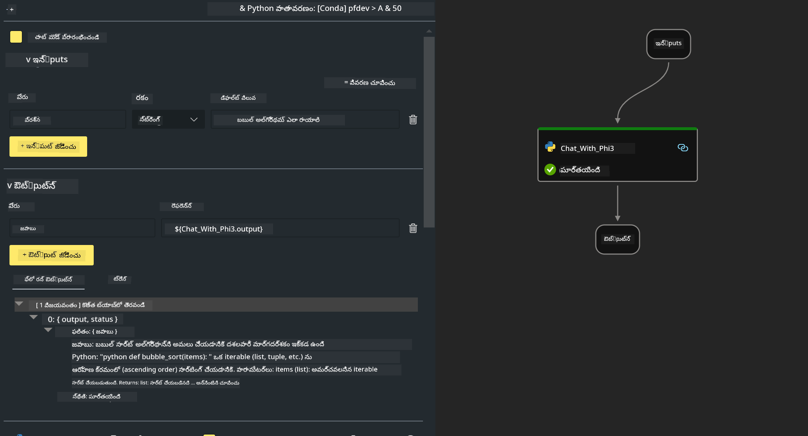

<!--
CO_OP_TRANSLATOR_METADATA:
{
  "original_hash": "bc29f7fe7fc16bed6932733eac8c81b8",
  "translation_date": "2025-12-21T19:43:35+00:00",
  "source_file": "md/02.Application/02.Code/Phi3/VSCodeExt/HOL/AIPC/02.PromptflowWithNPU.md",
  "language_code": "te"
}
-->
# **ల్యాబ్ 2 -  Prompt flow ను Phi-3-mini తో AIPCలో నడిపించడం**

## **Prompt flow అంటే ఏమిటి**

Prompt flow అనేది LLM ఆధారిత AI అప్లికేషన్ల యొక్క ఐడియేషన్, ప్రోటోటైపింగ్, టెస్టింగ్, మూల్యాంకనం నుండి ప్రొడక్షన్ డిప్లాయ్‌మెంట్ మరియు మానిటరింగ్ వరకు ఎండ్-టు-ఎండ్ డెవలప్‌మెంట్ చక్రాన్ని సరళీకృత చేయడానికి రూపొందించిన డెవలప్‌మెంట్ టూల్స్ సూట్. ఇది prompt ఇంజనీరింగ్‌ని చాలా సులభతరం చేస్తుంది మరియు మీరు ప్రొడక్షన్ నాణ్యతతో LLM అప్లికేషన్లను నిర్మించగలుగుతారు.

Prompt flow ద్వారా, మీరు చేయగలరు:

- LLMs, prompts, Python కోడ్ మరియు ఇతర సాధనాలను అమలు చేయదగిన వర్క్‌ఫ్లోలో లింక్ చేసే ఫ్లోలను సృష్టించండి.

- ప్రత్యేకంగా LLMs తో ఉన్న ఇంటరాక్షన్‌ను సులభంగా డీబగ్ చేసి, తిరిగి పునరావృతం చేయండి.

- పెద్ద డేటాసెట్‌లతో మీ ఫ్లోలను మూల్యాంకనం చేసి, నాణ్యత మరియు పనితీరు మెట్రిక్స్‌లను లెక్కించండి.

- మీ ఫ్లోకి నాణ్యత నిర్ధారించడానికి టెస్టింగ్ మరియు మూల్యాంకనాన్ని CI/CD సిస్టమ్‌లో ఇంటిగ్రేట్ చేయండి.

- మీకు ఇష్టమైన సర్వింగ్ ప్లాట్‌ఫార్మ్‌కు లేదా మీ యాప్ కోడ్ బేస్‌కు మీ ఫ్లోలను సులభంగా డిప్లాయ్ చేయండి.

- (ఐచ్ఛికం కాన్ కానీ అత్యంత సిఫార్సు చేయబడింది) Azure AI లోని cloud వెర్షన్ యొక్క Prompt flow ను ఉపయోగించి మీ టీమ్‌తో సహకరించండి.

## **AIPC అంటే ఏమిటి**

AI PCలో CPU, GPU మరియు NPU ఉంటాయి, ప్రతి ఒక్కటి నిర్దిష్ట AI అలసించు సామర్థ్యాలతో. NPU లేదా న్యూరల్ ప్రాసెస్సింగ్ యూనిట్ అనేది ప్రత్యేకమైన యాక్సిలరేటర్, ఇది cloudలో డేటాను పంపకుండా మీ PCలోనే artificial intelligence (AI) మరియు machine learning (ML) పనులను నిర్వహిస్తుంది. GPU మరియు CPU కూడా ఈ వర్క్‌లోడ్స్‌ను ప్రాసెస్ చేయగలవు, కాని NPU తక్కువ శక్తి ఖర్చుతో AI లెక్కింపు పనులలో ప్రత్యేకంగా మంచిది. AI PC మన కంప్యూటర్లు ఎలా పని చేస్తున్నాయనే విషయములో ఒక ప్రాముఖ్యమైన మార్పును సూచిస్తుంది. ఇది ముందు ఉండని సమస్యకు పరిష్కారం కాదు; బదులుగా ఇది ప్రతిరోజూ PC వినియోగాల కోసం పెద్ద మెరుగుదల్టివ్వడానికి వాగ్దానం చేస్తుంది.

ఇది ఎలా పనిచేస్తుంది? ప్రజాస్వామ్యంగా ట్రెయిన్ చేసిన భారీ large language models (LLMs) మరియు జనరేటివ్ AIతో తులనిస్తే, మీ PC మీద జరుగనున్న AI ప్రతి స్థాయిలోనే మరింత అందుబాటులో ఉంది. కాన్సెప్ట్ అనలోచన సులభంగా గ్రహించదగినది, మరియు ఇది మీ డేటాపై ట్రెయిన్ అయ్యే కారణంగా, క్లౌడ్ యాక్సెస్ అవసరం లేకుండానే లాభాలు వెంటనే విస్తృత జనాభాకు ఆహ్లాదకరంగా ఉంటాయి.

近ర కాలంలో, AI PC ప్రపంచం వ్యక్తిగత అసిస్టెంట్లు మరియు మరింత చిన్న AI మోడల్స్ మీ PCపై నేరుగా నడుస్తుండటం, మీ డేటా ఉపయోగించి మీ ప్రతి రోజు చేసే పనులకు వ్యక్తిగత, ప్రైవేటు, మరింత సురక్షిత AI అభివృద్ధులను అందించడం— సమావేశం నోట్స్ తీసుకోవటం, ఫాంటసీ ఫుట్బాల్ లీగ్ ను ఏర్పాటు చేయటం, ఫోటో మరియు వీడియో ఎడిటింగ్ కోసం ఆటోమెటిక్ ఎంహాన్స్మెంట్స్, లేదా కుటుంబ మీటింగ్ కోసం అందరి రాక-పోక సమయాల ఆధారంగా ఉత్తమ యాత్రాపథం తీర్చిదిద్దడం వంటి వాటిని కలిగి ఉంటుంది.

## **AIPCలో జనరేషన్ కోడ్ ఫ్లోలను నిర్మించడం**

***Note*** ：If you have not completed the environment installation , please visit [Lab 0 -Installations](./01.Installations.md)

1. Visual Studio Code లో Prompt flow Extension ను ఓపెన్ చేయండి మరియు ఒక ఖాళీ ఫ్లో ప్రాజెక్ట్ సృష్టించండి


2. ఇన్పుట్లు మరియు ఔట్‌పుట్ పరామితుల్ని జోడించండి మరియు Python కోడ్‌ను కొత్త ఫ్లోగా జత చేయండి




You can refer to this structure (flow.dag.yaml) to construct your flow

```yaml

inputs:
  question:
    type: string
    default: how to write Bubble Algorithm
outputs:
  answer:
    type: string
    reference: ${Chat_With_Phi3.output}
nodes:
- name: Chat_With_Phi3
  type: python
  source:
    type: code
    path: Chat_With_Phi3.py
  inputs:
    question: ${inputs.question}


```

3. ***Chat_With_Phi3.py*** లో కోడ్ జోడించండి


```python


from promptflow.core import tool

# torchను దిగుమతి చేయండి
from transformers import AutoTokenizer, pipeline,TextStreamer
import intel_npu_acceleration_library as npu_lib

import warnings

import asyncio
import platform

class Phi3CodeAgent:
    
    model = None
    tokenizer = None
    text_streamer = None
    
    model_id = "microsoft/Phi-3-mini-4k-instruct"

    @staticmethod
    def init_phi3():
        
        if Phi3CodeAgent.model is None or Phi3CodeAgent.tokenizer is None or Phi3CodeAgent.text_streamer is None:
            Phi3CodeAgent.model = npu_lib.NPUModelForCausalLM.from_pretrained(
                                    Phi3CodeAgent.model_id,
                                    torch_dtype="auto",
                                    dtype=npu_lib.int4,
                                    trust_remote_code=True
                                )
            Phi3CodeAgent.tokenizer = AutoTokenizer.from_pretrained(Phi3CodeAgent.model_id)
            Phi3CodeAgent.text_streamer = TextStreamer(Phi3CodeAgent.tokenizer, skip_prompt=True)

    

    @staticmethod
    def chat_with_phi3(prompt):
        
        Phi3CodeAgent.init_phi3()

        messages = "<|system|>You are a AI Python coding assistant. Please help me to generate code in Python.The answer only genertated Python code, but any comments and instructions do not need to be generated<|end|><|user|>" + prompt +"<|end|><|assistant|>"


        generation_args = {
            "max_new_tokens": 1024,
            "return_full_text": False,
            "temperature": 0.3,
            "do_sample": False,
            "streamer": Phi3CodeAgent.text_streamer,
        }

        pipe = pipeline(
            "text-generation",
            model=Phi3CodeAgent.model,
            tokenizer=Phi3CodeAgent.tokenizer,
            # **సృష్టి_ఆర్గ్యుమెంట్లు
        )

        result = ''

        with warnings.catch_warnings():
            warnings.simplefilter("ignore")
            response = pipe(messages, **generation_args)
            result =response[0]['generated_text']
            return result


@tool
def my_python_tool(question: str) -> str:
    if platform.system() == 'Windows':
        asyncio.set_event_loop_policy(asyncio.WindowsSelectorEventLoopPolicy())
    return Phi3CodeAgent.chat_with_phi3(question)


```

4. జనరేషన్ కోడ్ సరిగ్గా ఉందో లేదో తనిఖీ చేయడానికి మీరు Debug లేదా Run నుండి ఫ్లోని పరీక్షించవచ్చు


5. టెర్మినల్‌లో డెవలప్‌మెంట్ APIగా ఫ్లో నడపండి

```

pf flow serve --source ./ --port 8080 --host localhost   

```

మీరు దీన్ని Postman / Thunder Clientలో పరీక్షించవచ్చు


### **గమనిక**

1. మొదటి రన్ చాలా సమయం తీసుకుంటుంది. phi-3 మోడల్‌ను Hugging face CLI నుండి డౌన్‌లోడ్ చేయాలని సిఫార్సు చేయబడుతుంది.

2. Intel NPU యొక్క పరిమిత కంప్యూటింగ్ శక్తిని దృష్టిలో ఉంచుకుని, Phi-3-mini-4k-instruct ఉపయోగించడం సిఫార్సు చేయబడుతుంది

3. INT4 క్వాంటైజేషన్ కోసం Intel NPU Acceleration ను ఉపయోగిస్తాము, కానీ మీరు సేవను మళ్ళీ నడిపిస్తే cache మరియు nc_workshop ఫోల్డర్లను డిలీట్ చేయాలి.

## **వనరులు**

1. Promptflow నేర్చుకోండి [https://microsoft.github.io/promptflow/](https://microsoft.github.io/promptflow/)

2. Intel NPU Acceleration గురించి తెలుసుకోండి [https://github.com/intel/intel-npu-acceleration-library](https://github.com/intel/intel-npu-acceleration-library)

3. నమూనా కోడ్, డౌన్లోడ్ చేయండి [లోకల్ NPU ఏజెంట్ నమూనా కోడ్](../../../../../../../../../code/07.Lab/01/AIPC)

---

<!-- CO-OP TRANSLATOR DISCLAIMER START -->
నిరాకరణ:

ఈ పత్రం AI అనువాద సేవ [Co-op Translator](https://github.com/Azure/co-op-translator) ద్వారా అనువదించబడింది. మేము ఖచ్చితత్వానికి శ్రద్ధ వహించినప్పటికీ, స్వయంచాలక అనువాదాల్లో పొరపడుటలు లేదా తప్పులుండకపోవచ్చని దయచేసి గమనించండి. అసలు పత్రాన్ని దాని స్వదేశీ (మూల) భాషలో ఉన్న రూపాన్ని అధికారిక మూలంగా పరిగణించాలి. కీలకమైన సమాచారం కోసం వృత్తిపరమైన మానవ అనువాదం సూచించబడుతుంది. ఈ అనువాదం ఉపయోగించడం వల్ల ఏర్పడిన ఏమైనా అపవ్యాఖ్యలు లేదా తప్పైన అర్థాల కోసం మేము బాధ్యులు కాదు.
<!-- CO-OP TRANSLATOR DISCLAIMER END -->