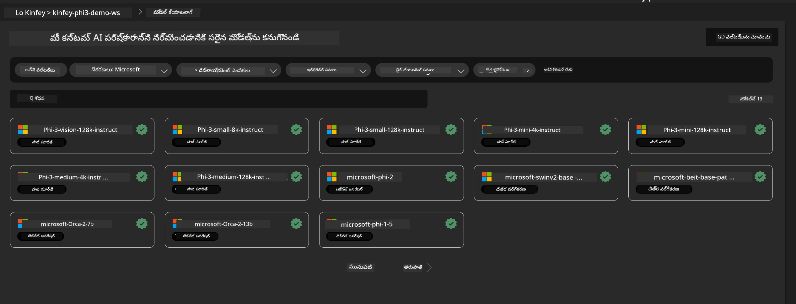
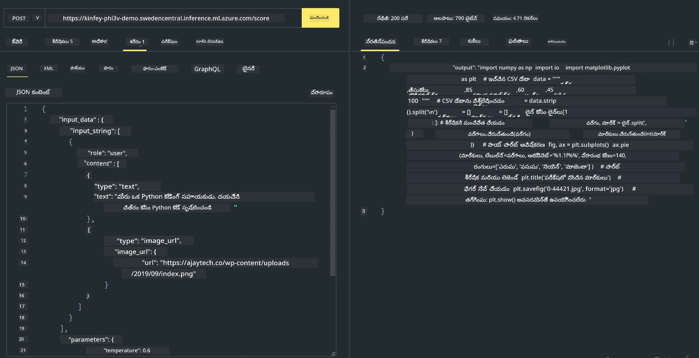

# **ల్యాబ్ 3 - Phi-3-vision ను Azure Machine Learning Service లో డిప్లాయ్ చేయడం**

మేము NPU ను ఉపయోగించి లోకల్ కోడ్ యొక్క ఉత్పత్తి డిప్లాయ్‌మెంట్‌ను పూర్తిします, తరువాత దానిద్వారా PHI-3-VISION ను పరిచయం చేసి చిత్రాల ద్వారా కోడ్ ఉత్పత్తి చేయగలిగే సామర్థ్యాన్ని జోడించాలని అనుకుంటున్నాము.

ఈ పరిచయంలో, మేము Azure Machine Learning Service లో Model As Service Phi-3 Vision సేవను వేగంగా నిర్మించవచ్చు.

***గమనిక***： Phi-3 Vision వేగంగా కంటెంట్ ఉత్పత్తి చేయడానికి గణన శక్తి అవసరం. దీన్ని సాధించడానికి మాకు క్లౌడ్ కంప్యూటింగ్ శక్తి అవసరం.


### **1. Azure Machine Learning Service ఏర్పాటుచేయండి**

మాకు Azure Portal లో ఒక Azure Machine Learning Service సృష్టించాల్సి ఉంటుంది. ఎలా చేయాలో తెలుసుకోవాలంటే, దయచేసి ఈ లింక్‌ను చూడండి [https://learn.microsoft.com/azure/machine-learning/quickstart-create-resources?view=azureml-api-2](https://learn.microsoft.com/azure/machine-learning/quickstart-create-resources?view=azureml-api-2)


### **2. Azure Machine Learning Service లో Phi-3 Vision ను ఎంచుకోండి**




### **3. Azureలో Phi-3-Vision ను డిప్లాయ్ చేయండి**


### **4. Postman లో ఎండ్‌పాయింట్ ను పరీక్షించండి**





***గమనిక***

1. ప్రసారం చేయాల్సిన ప్యారామీటర్లు Authorization, azureml-model-deployment, మరియు Content-Type ని కలిగి ఉండాలి. వాటిని పొందడానికి మీరు డిప్లాయ్‌మెంట్ సమాచారాన్ని తనిఖీ చేయాలి.

2. ప్యారామీటర్లు ప్రసారం చేయడానికి, Phi-3-Vision కు ఒక చిత్ర లింక్‌ను ప్రసారం చేయాల్సి ఉంటుంది. ప్యారామీటర్లు ప్రసారం చేయడానికి GPT-4-Vision పద్ధతిని గమనించండి, ఉదాహరణకు

```json

{
  "input_data":{
    "input_string":[
      {
        "role":"user",
        "content":[ 
          {
            "type": "text",
            "text": "You are a Python coding assistant.Please create Python code for image "
          },
          {
              "type": "image_url",
              "image_url": {
                "url": "https://ajaytech.co/wp-content/uploads/2019/09/index.png"
              }
          }
        ]
      }
    ],
    "parameters":{
          "temperature": 0.6,
          "top_p": 0.9,
          "do_sample": false,
          "max_new_tokens": 2048
    }
  }
}

```

3. Post పద్ధతిని ఉపయోగించి **/score** ను పిలవండి

**అభినందనలు** ！మీరు వేగవంతమైన PHI-3-VISION డిప్లాయ్‌మెంట్‌ను పూర్తి చేసి చిత్రాలను ఉపయోగించి కోడ్‌ను ఎలా ఉత్పత్తి చేయాలో పరీక్షించారు. తర్వాత, మేము NPUలు మరియు క్లౌడ్‌లను కలిపి అనువర్తనాలను నిర్మించవచ్చు

---

<!-- CO-OP TRANSLATOR DISCLAIMER START -->
**స్పష్టీకరణ**:
ఈ డాక్యుమెంట్‌ను AI అనువాద సేవ [Co-op Translator](https://github.com/Azure/co-op-translator) ద్వారా అనువదించబడింది. మేము ఖచ్చితత్వానికి ప్రయత్నించినప్పటికీ, స్వయంచాలక అనువాదాల్లో తప్పిదాలు లేదా అసత్యతలు ఉండవచ్చని దయచేసి గమనించండి. దాని స్థానిక భాషలోని అసలు డాక్యుమెంట్‌ను అధికారిక మూలంగా భావించాలి. కీలకమైన సమాచారం కోసం, నిపుణులైన మానవ అనువాదాన్ని చేయించుకోవాలని సిఫార్సు చేయబడుతుంది. ఈ అనువాదాన్ని ఉపయోగించడం వలన కలిగిన ఏవైనా అపార్థాలు లేదా తప్పుగా అర్థం చేసుకోవడంపై మేము బాధ్యత వహించము.
<!-- CO-OP TRANSLATOR DISCLAIMER END -->