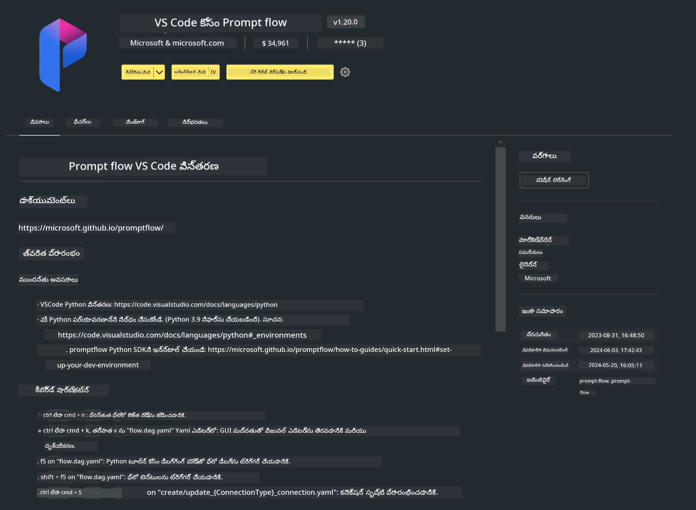

<!--
CO_OP_TRANSLATOR_METADATA:
{
  "original_hash": "4b16264917d9b93169745d92b8ce8c65",
  "translation_date": "2025-12-21T20:07:57+00:00",
  "source_file": "md/02.Application/02.Code/Phi3/VSCodeExt/HOL/Apple/01.Installations.md",
  "language_code": "te"
}
-->
# **ల్యాబ్ 0 - సంస్థాపన**

ల్యాబ్‌లోకి ప్రవేశించినప్పుడు, సంబంధించిన పరిసరాలను కాన్ఫిగర్ చేయాల్సి ఉంటుంది :


### **1. Python 3.11+**

Python పరిసరాలను కాన్ఫిగర్ చేయడానికి miniforge ను ఉపయోగించడం సూచించబడుతుంది

miniforge ను కాన్ఫిగర్ చేయడానికి, దయచేసి [https://github.com/conda-forge/miniforge](https://github.com/conda-forge/miniforge) ను చూడండి

miniforge ను కాన్ఫిగర్ చేసిన తర్వాత, PowerShell లో క్రింది కమాండ్ ను అమలు చేయండి

```bash

conda create -n pyenv python==3.11.8 -y

conda activate pyenv

```


### **2. Prompt flow SDK ఇన్‌స్టాల్ చేయండి**

ల్యాబ్ 1లో, మేము Prompt flowని ఉపయోగిస్తాము, అందుచేత Prompt flow SDKను కాన్ఫిగర్ చేయాల్సి ఉంటుంది.

```bash

pip install promptflow --upgrade

```

ఈ కమాండ్‌లో మీరు promptflow sdk ను తనిఖీ చేయవచ్చు


```bash

pf --version

```

### **3. Visual Studio Code Prompt flow Extension ఇన్‌స్టాల్ చేయండి**



### **4. Apple యొక్క MLX ఫ్రేమ్‌వర్క్**

MLX అనేది Apple సిలికాన్‌పై యంత్ర అభ్యాస (machine learning) పరిశోధన కోసం Apple machine learning research ద్వారా పరిచయం చేయబడిన ఒక array ఫ్రేమ్‌వర్క్. మీరు **Apple MLX ఫ్రేమ్‌వర్క్** ను Apple Silicon తో LLM / SLM వేగవంతం చేయడానికి ఉపయోగించవచ్చు. మరింత తెలుసుకోవాలనుకుంటే, మీరు చదవవచ్చు [https://github.com/microsoft/PhiCookBook/blob/main/md/01.Introduction/03/MLX_Inference.md](https://github.com/microsoft/PhiCookBook/blob/main/md/01.Introduction/03/MLX_Inference.md).

bash లో MLX ఫ్రేమ్‌వర్క్ లైబ్రరీని ఇన్‌స్టాల్ చేయండి


```bash

pip install mlx-lm

```


### **5. ఇతర Python లైబ్రరీలు**


requirements.txt ఫైల్‌ను సృష్టించి ఈ కంటెంట్‌ని చేర్చండి

```txt

notebook
numpy 
scipy 
scikit-learn 
matplotlib 
pandas 
pillow 
graphviz

```


### **6. NVM ను ఇన్‌స్టాల్ చేయండి**

PowerShell లో nvm ను ఇన్‌స్టాల్ చేయండి 


```bash

brew install nvm

```

nodejs 18.20 ని ఇన్‌స్టాల్ చేయండి


```bash

nvm install 18.20.0

nvm use 18.20.0

```

### **7. Visual Studio Code Development Support ను ఇన్‌స్టాల్ చేయండి**


```bash

npm install --global yo generator-code

```

అభినందనలు! మీరు SDK ని విజయవంతంగా కాన్ఫిగర్ చేసారు. తదుపరి, ప్రాయోగిక దశలకి కొనసాగండి.

---

<!-- CO-OP TRANSLATOR DISCLAIMER START -->
నిరాకరణ:
ఈ డాక్యుమెంట్‌ను AI అనువాద సేవ [Co-op Translator](https://github.com/Azure/co-op-translator) ఉపయోగించి అనువదించబడింది. మేము ఖచ్చితత్వానికి ప్రయత్నించినా, స్వయంచాలక అనువాదాల్లో పొరపాట్లు లేదా అసమతుల్యాలు ఉండవచ్చును అన్న విషయాన్ని దయచేసి గమనించండి. మూల డాక్యుమెంట్‌ను దాని స్థానిక భాషలోనే అధికారిక మూలంగా పరిగణించాలి. కీలకమైన సమాచారానికి వృత్తిపరమైన మానవ అనువాదాన్ని సిఫార్సు చేయబడుతుంది. ఈ అనువాదాన్ని ఉపయోగించడం వల్ల కలిగే ఏదైనా అవగాహనా లోపాలు లేదా తప్పుదిట్టతలకి మేము బాధ్యత వహించము.
<!-- CO-OP TRANSLATOR DISCLAIMER END -->