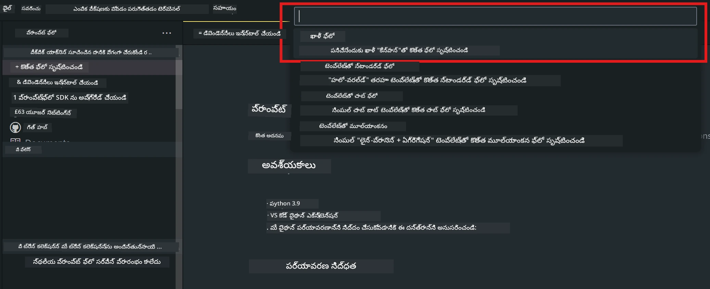
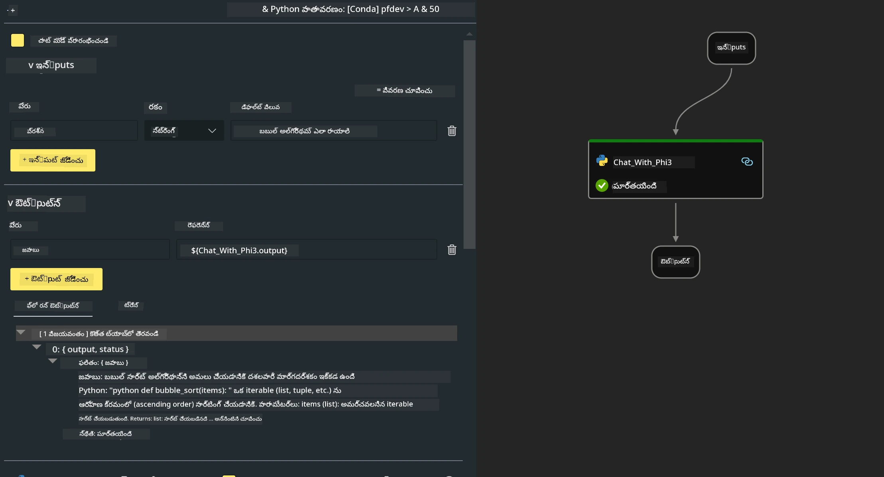
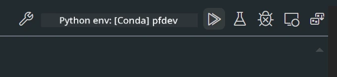

# **Lab 2 -  Run Prompt flow with Phi-3-mini in AIPC**

## **Prompt flow అంటే ఏమిటి**

Prompt flow అనేది LLM-ఆధారిత AI అప్లికేషన్ల ఆరంభ ఆలోచనలు, ప్రోటోటైపింగ్, టెస్టింగ్, మూల్యాంకనం నుండి ప్రొడక్షన్ డిప్లాయ్‌మెంట్ మరియు మానిటరింగ్ వరకు ఎండ్-టు-ఎండ్ అభివృద్ధి చక్రాన్ని సమర్థవంతంగా చేయడానికి రూపొందించిన అభివృద్ధి సాధనాల సూట్. ఇది prompt ఇంజనీరింగ్‌ను చాలా సులభం చేస్తుంది మరియు మీరు ప్రొడక్షన్-క్వాలిటీతో LLM యాప్‌లను నిర్మించగలుగుతారు.

Prompt flow ద్వారా, మీరు చేయగలుగుతారు:

- LLMs, prompts, Python కోడ్ మరియు ఇతర టూల్స్‌ను కలిసి ఒక ఎగ్జిక్యూటబుల్ వర్క్‌ఫ్లోలో లింక్ చేసే flows సృష్టించండి.

- మీ ఫ్లోల్ని, বিশেষంగా LLMs తో ఇంటరాక్షన్‌ను సులభంగా డీబగ్ చేసి పునరావృతం చేయండి.

- మీ ఫ్లోల్ని మూల్యాంకనం చేసి, పెద్ద datasetలతో నాణ్యత మరియు పననితీరు మెట్రిక్స్‌లను గణించండి.

- మీ ఫ్లో యొక్క నాణ్యతను నిర్ధారించడానికి టెస్టింగ్ మరియు మూల్యాంకనాన్ని మీ CI/CD సిస్టమ్‌లో సమీకరించండి.

- మీరు ఎంచుకున్న సర్వింగ్ ప్లాట్‌ఫారమ్‌కు లేదా మీ అప్లికేషన్ కోడ్ బేస్‌లో సులభంగా మీ ఫ్లోలను డిప్లాయ్ చేయండి.

- (ఐచ్ఛికంగా కానీ బలంగా సిఫార్సు చేయబడింది) Azure AI లోని cloud వెర్షన్ ఉపయోగించి మీ బృందంతో సహకరించండి.


## **Apple Siliconపై generation కోడ్ ఫ్లోలు నిర్మించడం**

***గమనిక*** ：If you have not completed the environment installation , please visit [Lab 0 -Installations](./01.Installations.md)

1. Visual Studio Codeలో Prompt flow Extension ను తెరిచి ఒక ఖాళీ ఫ్లో ప్రాజెక్ట్‌ని సృష్టించండి



2. Inputs మరియు Outputs పరామితులను జోడించి Python Codeని కొత్త ఫ్లోగా జోడించండి




You can refer to this structure (flow.dag.yaml) to construct your flow

```yaml

inputs:
  prompt:
    type: string
    default: Write python code for Fibonacci serie. Please use markdown as output
outputs:
  result:
    type: string
    reference: ${gen_code_by_phi3.output}
nodes:
- name: gen_code_by_phi3
  type: python
  source:
    type: code
    path: gen_code_by_phi3.py
  inputs:
    prompt: ${inputs.prompt}


```

3. phi-3-mini ని క్వాంటైజ్ చేయండి

మేము స్థానిక పరికరాలలో SLM ను మెరుగ్గా నడపగలగాలని ఆశిస్తున్నాము. సాధారణంగా, మేము మోడల్‌ను క్వాంటైజ్ చేస్తాము (INT4, FP16, FP32)


```bash

python -m mlx_lm.convert --hf-path microsoft/Phi-3-mini-4k-instruct

```

**గమనిక:** default folder is mlx_model 

4. ***Chat_With_Phi3.py*** లో కోడ్ జోడించండి


```python


from promptflow import tool

from mlx_lm import load, generate


# కోడ్ సేవ్ చేసిన తర్వాత టూల్ ఫంక్షన్ ఆర్గుమెంట్ల ఆధారంగా ఇన్పుట్స్ విభాగం మార్చబడుతుంది
# ఆర్గుమెంట్స్ మరియు రిటర్న్ విలువకు టైపు జోడించడం సిస్టమ్‌కు టైపులను సరిగా చూపించడానికి సహాయపడుతుంది
# అవసరానికి అనుగుణంగా ఫంక్షన్ పేరు/సిగ్నేచర్‌ను నవీకరించండి
@tool
def my_python_tool(prompt: str) -> str:

    model_id = './mlx_model_phi3_mini'

    model, tokenizer = load(model_id)

    # <|user|>\nFibonacci సిరీస్‌కు Python కోడ్ రాయండి. దయచేసి అవుట్‌పుట్‌గా Markdown ఉపయోగించండి<|end|>\n<|assistant|>

    response = generate(model, tokenizer, prompt="<|user|>\n" + prompt  + "<|end|>\n<|assistant|>", max_tokens=2048, verbose=True)

    return response


```

4. మీరు Debug లేదా Run ద్వారా ఫ్లోని పరీక్షించి జనరేషన్ కోడ్ సరైనదేనా అన్నది తనిఖీ చేయవచ్చు



5. టెర్మినల్‌లో అభివృద్ధి API గా ఫ్లో నడపండి

```

pf flow serve --source ./ --port 8080 --host localhost   

```

దీనిని Postman / Thunder Client లో పరీక్షించవచ్చు


### **గమనిక**

1. మొదటి రన్ ఎక్కువ సమయం తీసుకుంటుంది. phi-3 మోడల్‌ను Hugging face CLI నుంచి డౌన్లోడ్ చేయాలని సిఫార్సు చేయబడుతుంది.

2. Intel NPU యొక్క పరిమిత కంప్యూటింగ్ శక్తిని పరిగణలోకి తీసుకొని, Phi-3-mini-4k-instruct వాడటం సిఫార్సు చేయబడుతుంది.

3. INT4 మార్పిడి కోసం మేము Intel NPU Acceleration ను ఉపయోగిస్తాము, కానీ మీరు సర్వీస్‌ను మళ్లీ దర్శకత్వం వహిస్తే, cache మరియు nc_workshop ఫోల్డర్లను తొలగించాల్సి ఉంటుంది.


## **Resources**

1. Promptflow గురించి తెలుసుకోండి [https://microsoft.github.io/promptflow/](https://microsoft.github.io/promptflow/)

2. Intel NPU Acceleration గురించి తెలుసుకోండి [https://github.com/intel/intel-npu-acceleration-library](https://github.com/intel/intel-npu-acceleration-library)

3. సాంపుల్ కోడ్, డౌన్లోడ్ చేయండి [Local NPU Agent Sample Code](../../../../../../../../../code/07.Lab/01/AIPC/local-npu-agent)

---

<!-- CO-OP TRANSLATOR DISCLAIMER START -->
నిరాకరణ:
ఈ పత్రం AI అనువాద సేవ [Co-op Translator](https://github.com/Azure/co-op-translator) ఉపయోగించి అనువదించబడింది. మేము ఖచ్చితత్వానికి ప్రయత్నించినప్పటికీ, స్వయంచాలక అనువాదాల్లో తప్పులు లేదా లోపాలు ఉండవచ్చు என்பதை దయచేసి గమనించండి. దాని మాతృభాషలోని మూల పత్రాన్ని అధికారిక ప్రామాణికంగా పరిగణించాలి. ముఖ్యమైన సమాచారానికి వృత్తిపరులైన మానవ అనువాదాన్ని సిఫార్సు చేయబడుతుంది. ఈ అనువాదాన్ని ఉపయోగించడంవల్ల ఉత్పన్నమయ్యే ఏవైనా అపవర్థనలు లేదా తప్పుడు అర్థములకు మేము బాధ్యులు కారు.
<!-- CO-OP TRANSLATOR DISCLAIMER END -->