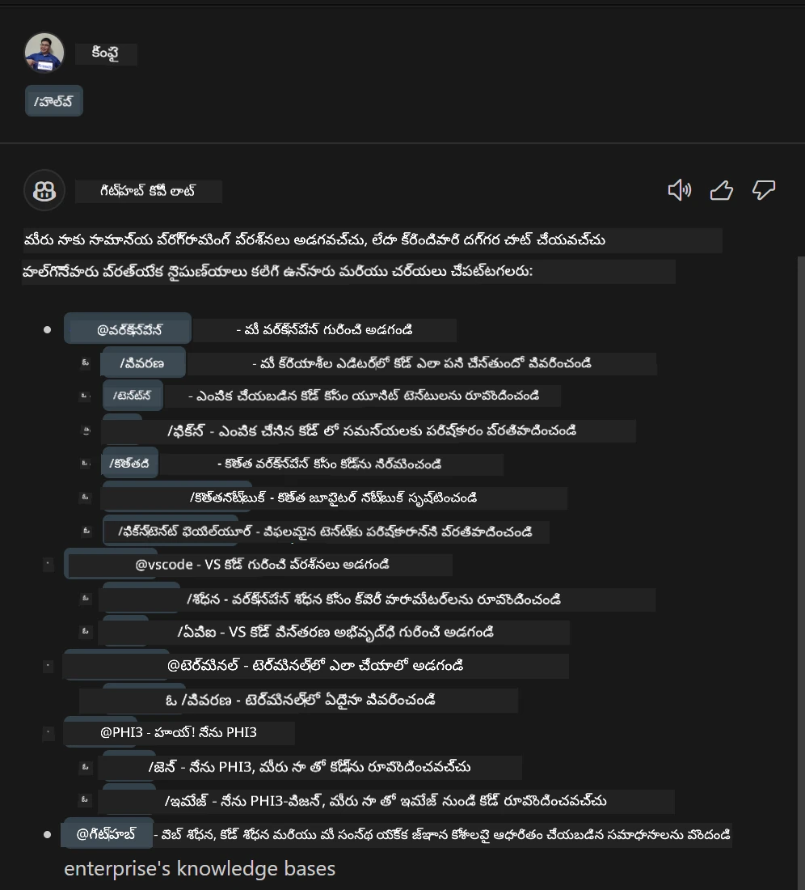
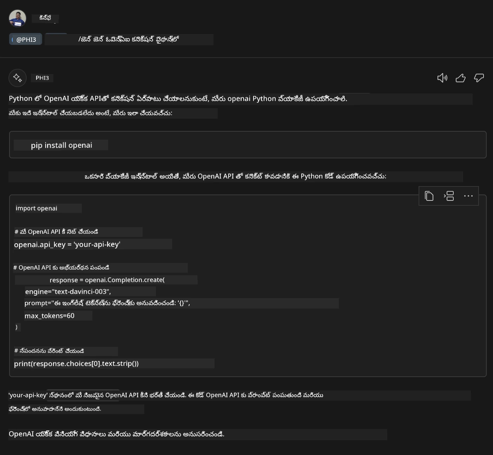
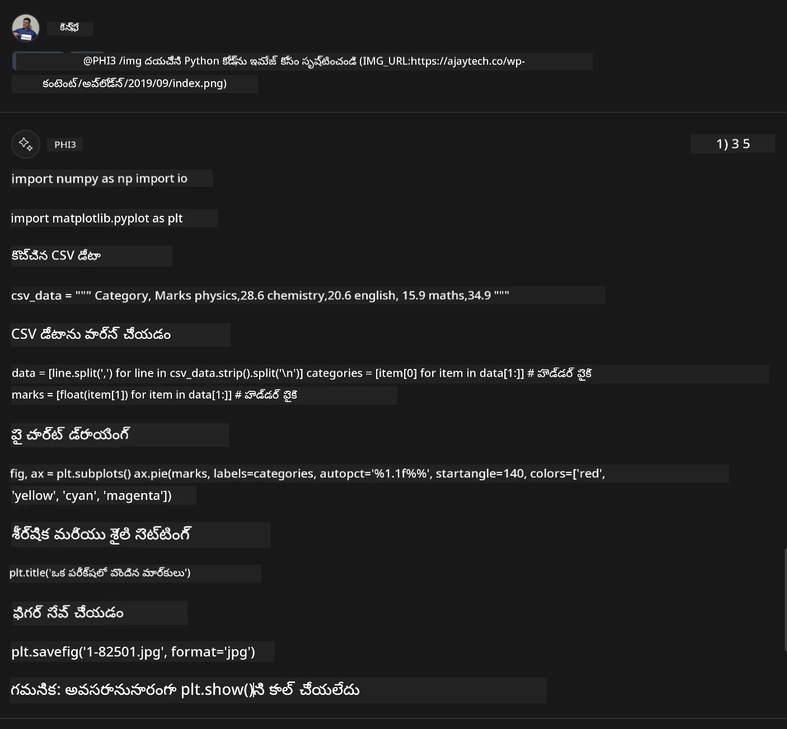

<!--
CO_OP_TRANSLATOR_METADATA:
{
  "original_hash": "df19a4d9fe96fe7335665bede9298a62",
  "translation_date": "2025-12-21T20:13:17+00:00",
  "source_file": "md/02.Application/02.Code/Phi3/VSCodeExt/HOL/Apple/04.CreatePhi3AgentInVSCode.md",
  "language_code": "te"
}
-->
# **Lab 3 - GitHub Copilot Chat‌లో @PHI3 ఏజెంట్‌ను సృష్టించండి**

Visual Studio Code Copilot Chat‌లో, మీరు మొత్తం ప్రాజెక్టును @workspace ద్వారా నిర్వహించవచ్చు. ఎంటర్ప్రైజ్ సందర్భాల్లో, Copilot Chat యొక్క ఏజెంట్‌ను మరింత అనుకూలీకరించవచ్చు. 

In the last Lab, we combined MX framework and cloud to complete a Visual Studio Code Extension for Phi3 Agent.



### **1. VSCode డెవలప్మెంట్ ఎక్స్టెన్షన్ సృష్టించండి**

దయచేసి ఈ లింక్‌ను సందర్శించండి [https://code.visualstudio.com/api/get-started/your-first-extension] ఎక్స్‌టెన్షన్ ప్రాజెక్ట్ సృష్టించడానికి

***గమనిక:*** దయచేసి ఈ ప్రాజెక్ట్‌కు సాంకేతిక పరిష్కారంగా Typescript, WebPack ను ఉపయోగించండి

### **2. Add vscode.d.ts**

The Visual Studio Code Chat API has not yet been merged into the code API, but is now added via extensions.


vscode.d.ts డౌన్‌లోడ్ చేయండి [https://github.com/microsoft/vscode/blob/main/src/vscode-dts/vscode.d.ts](https://github.com/microsoft/vscode/blob/main/src/vscode-dts/vscode.d.ts)


***గమనిక:*** దయచేసి దీన్ని Visual Studio Code Insiders 1.90+లో నడపండి


### **3. package.json నవీకరించండి**

```json

{
  "name": "phi3ext",
  "displayName": "phi3ext",
  "description": "",
  "version": "0.0.1",
  "engines": {
    "vscode": "^1.90.0"
  },
  "categories": [
      "AI",
      "Chat"
  ],
  "activationEvents": [],
  "enabledApiProposals": [
      "chatVariableResolver"
  ],
  "main": "./dist/extension.js",
  "contributes": {
      "chatParticipants": [
          {
              "id": "chat.PHI3",
              "name": "PHI3",
              "description": "Hey! I am PHI3",
              "isSticky": true,
              "commands": [
                  {
                      "name": "gen",
                      "description": "I am PHI3, you can gen code with me"
                  },
                  {
                      "name": "img",
                      "description": "I am PHI3-vision, you can gen code from img with me"
                  }
              ]
          }
      ],
      "commands": [
          {
              "command": "PHI3.namesInEditor",
              "title": "Use PHI3 in Editor"
          }
      ]
  },  
  "scripts": {
    "vscode:prepublish": "npm run package",
    "compile": "webpack",
    "watch": "webpack --watch",
    "package": "webpack --mode production --devtool hidden-source-map",
    "compile-tests": "tsc -p . --outDir out",
    "watch-tests": "tsc -p . -w --outDir out",
    "pretest": "npm run compile-tests && npm run compile && npm run lint",
    "lint": "eslint src --ext ts",
    "test": "vscode-test"
  },
  "devDependencies": {
    "@types/vscode": "^1.90.0",
    "@types/mocha": "^10.0.6",
    "@types/node": "18.x",
    "@typescript-eslint/eslint-plugin": "^7.11.0",
    "@typescript-eslint/parser": "^7.11.0",
    "eslint": "^8.57.0",
    "typescript": "^5.4.5",
    "ts-loader": "^9.5.1",
    "webpack": "^5.91.0",
    "webpack-cli": "^5.1.4",
    "@vscode/test-cli": "^0.0.9",
    "@vscode/test-electron": "^2.4.0"
  },
  "dependencies": {
    "@types/node-fetch": "^2.6.11",
    "node-fetch": "^3.3.2"
  }
}

```

You can run **npm install** in terminal and debug your extension to test.

***సాంపుల్ కోడ్ డౌన్‌లోడ్ చేయండి*** [ఇక్కడ క్లిక్ చేయండి](../../../../../../../../../code/07.Lab/01/Apple)


### **4. src/extension.ts మార్చండి**


```ts

// 'vscode' మాడ్యూల్‌లో VS Code విస్తరణ API ఉంటుంది
// ఈ మాడ్యూల్‌ను దిగుమతి చేసుకుని క్రింద మీ కోడ్‌లో vscode అనే ఉపనామంతో సూచించండి
import * as vscode from 'vscode';


interface IPHI3ChatResult extends vscode.ChatResult {
    metadata: {
        command: string;
    }
}


// ఈ విధానం మీ విస్తరణ సక్రియమయ్యినప్పుడు పిలవబడుతుంది
// మీ విస్తరణ ఆ ఆదేశం మొదటిసారి అమలు చేయబడినప్పుడే సక్రియమవుతుంది
export function activate(extcontext: vscode.ExtensionContext) {


	// SHEIN చాట్ హ్యాండ్లర్‌ను నిర్వచించండి.
	const phi3handler: vscode.ChatRequestHandler = async (request: vscode.ChatRequest, context: vscode.ChatContext, stream: vscode.ChatResponseStream, token: vscode.CancellationToken): Promise<IPHI3ChatResult> => {

		if (request.command == 'gen') {

			const content = "Welcome to Phi-3 to gen code";

			const result = await gen(request.prompt);

			const code = result;
			
			
			stream.markdown(code)


            return { metadata: { command: 'gen' } };

		}
		if (request.command == 'img') {

			const content = "Welcome to Phi-3 vision to gen code in image";

			const prompt = request.prompt;

			if(prompt.indexOf("(IMG_URL:")>-1){

				const img_url = prompt.split("(IMG_URL:")[1].split(")")[0];
				const question = prompt.split("(IMG_URL:")[0];
				const tmp = question;

				const result = await genImage(question,img_url);
	
				const code = result;
				
				
				stream.markdown(code)
	
	
				return { metadata: { command: 'img' } };
			}
			else
			{
				var result = "Please ask question like this Your question (IMG_URL:https://example.com/image.jpg)";
				stream.markdown(result);
			}


            return { metadata: { command: 'img' } };

		}


		return { metadata: { command: '' } };

	}


	const phi3 = vscode.chat.createChatParticipant("chat.PHI3", phi3handler);

	phi3.iconPath = new vscode.ThemeIcon('sparkle');


    phi3.followupProvider = {
        provideFollowups(result: IPHI3ChatResult, context: vscode.ChatContext, token: vscode.CancellationToken) {
            return [{
                prompt: 'let us code with Phi-3 Family',
                label: vscode.l10n.t('Dev with Phi-3 Family'),
                command: 'help'
            } satisfies vscode.ChatFollowup];
        }
    };

	extcontext.subscriptions.push(phi3);
}


interface GenCode {
	prompt: string;
}

interface ImgGenCodeResponse {
	output: string;
}


interface GenCodeResponse {
	result: string;
}

async function gen(prompt: string) {

	const postData: GenCode = {
		prompt: prompt
	};
	const response = await fetch('http://localhost:8080/score', {
		method: 'POST',
		body: JSON.stringify(postData),
		headers: { 'Content-Type': 'application/json' }
	});
	const post = await response.json();
	const resultResponse = post as GenCodeResponse;
	return resultResponse.result;
}

async function genImage(prompt: string, img_url: string) {

	// const postData: GenCode = {
	// 	question: prompt
	// };
	const response = await fetch('Your Phi-3 Endpoint', {
		method: 'POST',
		body: JSON.stringify({
			"input_data":{
			  "input_string":[
				{
				  "role":"user",
				  "content":[ 
					{
					  "type": "text",
					  "text": prompt
					},
					{
						"type": "image_url",
						"image_url": {
						  "url": img_url
						}
					}
				  ]
				}
			  ],
			  "parameters":{
					"temperature": 0.6,
					"top_p": 0.9,
					"do_sample": false,
					"max_new_tokens": 2048
			  }
			}
		}),
		headers: { 'Content-Type': 'application/json', 'Authorization' : 'Bearer Your Phi-3-Vision Endpoint Key', 'azureml-model-deployment': 'Your Phi-3-Vision Deployment Name' }
	});
	const post = await response.json();
	const resultResponse = post as ImgGenCodeResponse;
	return resultResponse.output;
}

// మీ విస్తరణ నిష్క్రియం అయ్యినప్పుడు ఈ విధానం పిలవబడుతుంది
export function deactivate() {}


```

అభినందనలు ! మీరు అన్ని ల్యాబ్‌లను పూర్తిచేసినారు. ఇది మీకు Phi-3 ఫ్యామిలీని మరియు GitHub Copilot Chat‌ను ఎలా ఉపయోగించాలో అర్థం చేసుకోవడంలో సహాయపడుతుందని ఆశిస్తున్నాను.

మీరు ప్రయత్నించవచ్చు ***@PHI3 /gen*** 



మీరు ప్రయత్నించవచ్చు ***@PHI3 /img*** 



---

<!-- CO-OP TRANSLATOR DISCLAIMER START -->
స్పష్టీకరణ:
ఈ పత్రం AI అనువాద సేవ Co‑op Translator (https://github.com/Azure/co-op-translator) ఉపయోగించి అనువదించబడింది. మేము ఖచ్చితత్వానికి ప్రయత్నించినప్పటికీ, ఆటోమేటెడ్ అనువాదాల్లో లోపాలు లేదా తప్పిదాలు ఉండవచ్చు. మూల పత్రాన్ని దాని మాతృభాషలో ఉన్న అధికారిక మూలంగా పరిగణించాలి. కీలకమైన సమాచారానికి వృత్తిపరమైన మానవ అనువాదాన్ని సిఫార్సు చేయబడింది. ఈ అనువాదాన్ని ఉపయోగించడంవల్ల ఏర్పడిన ఏవైనా అవగాహనా లోపాలు లేదా తప్పుగా అర్థంకోల్పనలకు మాకు బాధ్యత ఉండదు.
<!-- CO-OP TRANSLATOR DISCLAIMER END -->