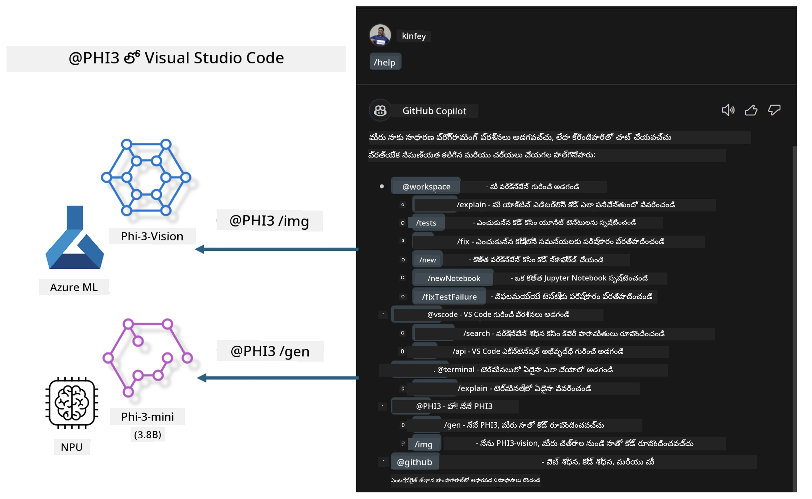

# **మీ స్వంత Visual Studio Code GitHub Copilot Chatని Microsoft Phi-3 ఫ్యామిలీతో నిర్మించండి**

మీరు GitHub Copilot Chat‌లోని workspace agent ను ఉపయోగించారా? మీ టీమ్ యొక్క కోడ్ ఏజంట్ ను నిర్మించాలనుకుంటున్నారా? ఈ హ్యాండ్స్-ఆన్ ల్యాబ్ ఓపెన్ సోర్స్ మోడల్ ను కలిపి ఎంటర్‌ప్రైజ్-స్థాయి కోడ్ బిజినెస్ ఏజంట్ ను నిర్మిస్తుందని ఆశిస్తుంది.

## **ప్రాథమికం**

### **Microsoft Phi-3ని ఎందుకు ఎంచుకోవాలి**

Phi-3 ఒక ఫ్యామిలీ సిరీస్, ఇందులో వివిధ శిక్షణ పారామితులను ఆధారంగా text generation, dialogue completion, మరియు code generation కోసం phi-3-mini, phi-3-small, మరియు phi-3-medium ఉన్నాయి. Vision ఆధారంగా phi-3-vision కూడా ఉంది. ఇది ఆఫ్‌లైన్ జనరేటివ్ AI పరిష్కారాలు enterprises లేదా వివిధ జట్ల కోసం సృష్టించడానికి అనుకూలం.

ఇది చదవాలని సూచించబడింది [https://github.com/microsoft/PhiCookBook/blob/main/md/01.Introduction/01/01.PhiFamily.md](https://github.com/microsoft/PhiCookBook/blob/main/md/01.Introduction/01/01.PhiFamily.md)

### **Microsoft GitHub Copilot Chat**

GitHub Copilot Chat ఎక్స్‌టెన్షన్ మీకు చాట్ ఇంటర్ఫేస్‌ను ఇస్తుంది, ఇది మీరు GitHub Copilot తో փոխిక్రియ చేయడానికి మరియు కోడింగ్-సంబంధిత ప్రశ్నలకు సమాధానాలు VS Code లో నేరుగా పొందడానికి సహాయపడుతుంది, డాక్యుమెంటేషన్ ని నావిగేట్ చేయాల్సిన అవసరం లేకుండా లేదా ఆన్లైన్ ఫోరమ్లను శోధించాల్సిన అవసరం లేకుండా.

Copilot Chat జనరేట చేసిన సమాధానానికి స్పష్టతను జోడించడానికి syntax highlighting, indentation, మరియు ఇతర ఫార్మాటింగ్ ఫీచర్లు ఉపయోగించవచ్చు. వినియోగదారుని ప్రశ్న ధోరణిపై ఆధారపడి, ఫలితం Copilot సమాధానం సృష్టించేటప్పుడు ఉపయోగించిన కంటెక్స్ట్‌కు లింకులు లేదా కోడ్ ఉదాహరణలు ఉండవచ్చు, వంటి సోర్స్ కోడ్ ఫైళ్లు లేదా డాక్యుమెంటేషన్, లేదా VS Code ఫంక్షనాలిటీకి 접근ించే బటన్లు.

- Copilot Chat మీ డెవలపర్ ఫ్లోలో లీన్గానే ఇంటిగ్రేట్ అవుతుంది మరియు మీరు అవసరమయ్యే చోట సహాయపడుతుంది:

- ఎడిటర్ లేదా టెర్మినలులో నేరుగా ఇన్‌లైన్ చాట్ సంభాషణను ప్రారంభించి కోడింగ్ చేస్తున్న సమయంలో సహాయం పొందండి

- ఎప్పుడైనా మీ పక్కన ఉన్న AI అసిస్టెంట్‌గా సహాయం చేయడానికి Chat view ను ఉపయోగించండి

- త్వరిత ప్రశ్న అడిగి మీ పనికి తిరిగి వెళ్లడానికి Quick Chat ప్రారంభించండి

GitHub Copilot Chat ను మీరు వివిధ పరిస్థतులలో ఉపయోగించవచ్చు, ఉదాహరణకు:

- సమస్యను ఉత్తమంగా పరిష్కరించడానికి సంబంధించిన కోడింగ్ ప్రశ్నలకు సమాధానం ఇవ్వడం

- ఇతరరి కోడ్ని వివరణ చేయడం మరియు మెరుగుల సూచనలు ఇవ్వడం

- కోడ్ ఫిక్స్‌లను సూచించడం

- యూనిట్ టెస్ట్ కేసులను తయారు చేయడం

- కోడ్ డాక్యుమెంటేషన్ రూపొందించడం

ఇది చదవాలని సూచించబడింది [https://code.visualstudio.com/docs/copilot/copilot-chat](https://code.visualstudio.com/docs/copilot/copilot-chat?WT.mc_id=aiml-137032-kinfeylo)

###  **Microsoft GitHub Copilot Chat @workspace**

Copilot Chatలో **@workspace**ను సూచించటం ద్వారా మీ మొత్తం కోడ్‌బేస్ గురించి ప్రశ్నలు అడగవచ్చు. ప్రశ్న ఆధారంగా, Copilot నిర్వచితంగా సంబంధిత ఫైళ్లను మరియు సింబల్స్‌ను తెచ్చుకుంటుంది, వాటిని అది తన సమాధానంలో లింకులు మరియు కోడ్ ఉదాహరణలుగా సూచిస్తుంది.

మీ ప్రశ్నకు సమాధానం చెప్పడానికి, **@workspace** VS Code లో కోడ్బేస్ నావిగేట్ చేయేటప్పుడు డెవలపర్ ఉపయోగించే అదే మూలాలను శోధిస్తుంది:

- .gitignore ఫైల్ ద్వారా నిర్లక్ష్యం చేయబడ్డ ఫైళ్లు తప్ప, వర్క్‌స్పేస్‌లోని అన్ని ఫైళ్లు

- ఒకదాని లోపల మరొక డైరెక్టరీని కలిగిన ఫోల్డర్ మరియు ఫైల్ పేర్లతో డైరెక్టరీ నిర్మాణం

- వర్క్‌స్పేస్ ఒక GitHub రిపోజిటరీగా ఉన్నా మరియు code search ద్వారా ఇండెక్స్ చేయబడినట్లయితే GitHub యొక్క కోడ్ శోధన ఇండెక్స్

- వర్క్‌స్పేస్‌లోని సింబల్స్ మరియు నిర్వచనాలు

- ప్రస్తుతం సెలెక్ట్ చేసిన టెక్స్ట్ లేదా యాక్టివ్ ఎడిటర్లో కనిపిస్తున్న టెక్స్ట్

గమనిక: .gitignore బైపాస్ అవుతుంది మీరు ఒక ఫైల్ తెరిచివుంటే లేదా నిర్లక్ష్యం చేయబడ్డ ఫైల్‌లో టెక్స్ట్ సెలెక్ట్ చేసినట్లయితే.

ఇది చదవాలని సూచించబడింది [[https://code.visualstudio.com/docs/copilot/copilot-chat](https://code.visualstudio.com/docs/copilot/workspace-context?WT.mc_id=aiml-137032-kinfeylo)]

## **ఈ ప్రయోగశాల గురించి మరింత తెలుసుకోండి**

GitHub Copilot సంస్థలలో ప్రోగ్రామ్మింగ్ సామర్థ్యాన్ని గణనీయంగా మెరుగుపరచింది, మరియు ప్రతి సంస్థ GitHub Copilot కు సంబంధించిన ఫంక్షన్లను అనుకూలీకరించాలని ఆశిస్తుంది. అనేక సంస్థలు తమ బిజినెస్ సన్నివేశాలపై ఆధారపడి GitHub Copilot వంటి ఇన్‌కస్టమ్ ఎక్స్‌టెన్షన్లను ఓపెన్ సోర్స్ మోడల్స్ ఉపయోగించి అనుకూలీకరించారు. సంస్థలకు అనుకూలీకరించిన ఎక్స్‌టెన్షన్లు నియంత్రించడానికి సులభంగా ఉంటాయి, కానీ ఇది యూజర్ అనుభవాన్ని ప్రభావితం కూడా చేస్తుంది. చివరికి, సాధారణ సన్నివేశాలు మరియు ప్రొఫెషనలిజం ఎలాగున్నదో GitHub Copilot దానిలో బలంగా ఉంటుంది. అనుభవాన్ని స్థిరంగా ఉంచగలిగితే, సంస్థ యొక్క స్వంత ఎక్స్‌టెన్షన్‌ను అనుకూలీకరించడం మంచిది. GitHub Copilot Chat సంస్థలకు చాట్ అనుభవాన్ని విస్తరించేందుకు సంబంధిత API లను అందిస్తుంది. స్థిరమైన అనుభవాన్ని నిలిపివేయడం మరియు అనుకూల ఫంక్షన్లను కలిగి ఉండటం మంచిది.

ఈ ల్యాబ్ ప్రధానంగా Phi-3 మోడల్‌ను స్థానిక NPU మరియు Azure హైబ్రిడ్‌తో కలిపి GitHub Copilot Chat లో కస్టమ్ ఏజంట్ ***@PHI3*** ను నిర్మించి ఎంటర్‌ప్రైజ్ డెవలపర్లకు కోడ్ జనరేషన్***(@PHI3 /gen)***ను పూర్తి చేయడంలో మరియు చిత్రాల ఆధారంగా కోడ్ రూపొందించడంలో సహాయపడుతుంది ***(@PHI3 /img)***.

### ***గమనిక:*** 

ఈ ల్యాబ్ ప్రస్తుతం Intel CPU మరియు Apple Silicon పై AIPC లో అమలు చేయబడింది. మేము ఒప్పందంగా Qualcomm వెర్షన్ NPU ను అప్డేట్ చేయడం కొనసాగిస్తాము.

## **ప్రయోగశాల**

| Name | Description | AIPC | Apple |
| ------------ | ----------- | -------- |-------- |
| Lab0 - Installations(✅) | సంబంధిత పరిసరాలు మరియు ఇన్స్టాలేషన్ టూల్స్‌ను సెట్టప్ మరియు ఇన్స్టాల్ చేయండి | [వెళ్ళండి](./HOL/AIPC/01.Installations.md) |[వెళ్ళండి](./HOL/Apple/01.Installations.md) |
| Lab1 - Run Prompt flow with Phi-3-mini (✅) | AIPC / Apple Silicon తో కలిపి స్థానిక NPU ఉపయోగించి Phi-3-mini ద్వారా కోడ్ జనరేషన్ సృష్టించడం | [వెళ్ళండి](./HOL/AIPC/02.PromptflowWithNPU.md) |  [వెళ్ళండి](./HOL/Apple/02.PromptflowWithMLX.md) |
| Lab2 - Deploy Phi-3-vision on Azure Machine Learning Service(✅) | Azure Machine Learning Service యొక్క Model Catalog - Phi-3-vision ఇమేజ్ ను డిప్లాయ్ చేసి కోడ్ ఉత్పత్తి చేయడం | [వెళ్ళండి](./HOL/AIPC/03.DeployPhi3VisionOnAzure.md) |[వెళ్ళండి](./HOL/Apple/03.DeployPhi3VisionOnAzure.md) |
| Lab3 - Create a @phi-3 agent in GitHub Copilot Chat(✅)  | GitHub Copilot Chat లో కస్టమ్ Phi-3 ఏజెంట్ ను సృష్టించి కోడ్ జనరేషన్, గ్రాఫ్ జనరేషన్ కోడ్, RAG, మొదలైనవి పూర్తి చేయడం | [వెళ్ళండి](./HOL/AIPC/04.CreatePhi3AgentInVSCode.md) | [వెళ్ళండి](./HOL/Apple/04.CreatePhi3AgentInVSCode.md) |
| Sample Code (✅)  | సాంపుల్ కోడ్ డౌన్లోడ్ చేయండి | [వెళ్ళండి](../../../../../../../code/07.Lab/01/AIPC) | [వెళ్ళండి](../../../../../../../code/07.Lab/01/Apple) |

## **వనరులు**

1. Phi-3 Cookbook [https://github.com/microsoft/Phi-3CookBook](https://github.com/microsoft/Phi-3CookBook)

2. GitHub Copilot గురించి మరింత తెలుసుకోండి [https://learn.microsoft.com/training/paths/copilot/](https://learn.microsoft.com/training/paths/copilot/?WT.mc_id=aiml-137032-kinfeylo)

3. GitHub Copilot Chat గురించి మరింత తెలుసుకోండి [https://learn.microsoft.com/training/paths/accelerate-app-development-using-github-copilot/](https://learn.microsoft.com/training/paths/accelerate-app-development-using-github-copilot/?WT.mc_id=aiml-137032-kinfeylo)

4. GitHub Copilot Chat API గురించి మరింత తెలుసుకోండి [https://code.visualstudio.com/api/extension-guides/chat](https://code.visualstudio.com/api/extension-guides/chat?WT.mc_id=aiml-137032-kinfeylo)

5. Azure AI Foundry గురించి మరింత తెలుసుకోండి [https://learn.microsoft.com/training/paths/create-custom-copilots-ai-studio/](https://learn.microsoft.com/training/paths/create-custom-copilots-ai-studio/?WT.mc_id=aiml-137032-kinfeylo)

6. Azure AI Foundry యొక్క Model Catalog గురించి మరింత తెలుసుకోండి [https://learn.microsoft.com/azure/ai-studio/how-to/model-catalog-overview](https://learn.microsoft.com/azure/ai-studio/how-to/model-catalog-overview)

---

<!-- CO-OP TRANSLATOR DISCLAIMER START -->
బాధ్యతా మినహాయింపు:
ఈ పత్రాన్ని AI అనువాద సేవ Co-op Translator (https://github.com/Azure/co-op-translator) ఉపయోగించి అనువదించబడింది. మేము ఖచ్చితత్వానికి ప్రయత్నించినప్పటికీ, ఆటోమేటెడ్ అనువాదాలలో తప్పులు లేదా పొరపాట్లు ఉండవచ్చు. మూల పత్రాన్ని దాని స్థానిక భాషలోని కాప్యంగా అధికారిక మూలంగా పరిగణించండి. కీలకమైన సమాచారానికి నైపుణ్యం కలిగిన మానవ అనువాదాన్ని ఉపయోగించడం సూచించబడుతుంది. ఈ అనువాదం వాడకం వల్ల కలిగే ఏవైనా అపార్థాలు లేదా తప్పుగా అర్థం చేసుకోవడంపై మేము బాధ్యులం కాలేము.
<!-- CO-OP TRANSLATOR DISCLAIMER END -->