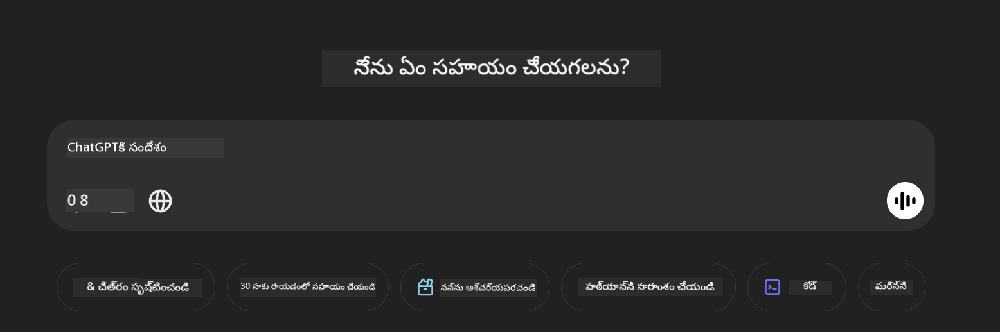

<!--
CO_OP_TRANSLATOR_METADATA:
{
  "original_hash": "83b94a515637dffaea3bae99278561a6",
  "translation_date": "2025-12-21T22:04:48+00:00",
  "source_file": "md/02.Application/04.Vision/Phi4/CreateFrontend/README.md",
  "language_code": "te"
}
-->
## **Phi-4-multimodal ఉపయోగించి చిత్రాలను చదివి కోడ్ ఉత్పత్తి చేయండి**

Phi-4-multimodalకి బలమైన చిత్రం పఠన సామర్థ్యం ఉంది. క్రింది ఫంక్షన్లను అమలు చేయడానికి Python ఉపయోగించుకుందాం. చిత్రం ఒక ChatGPT పేజీ.



### **నమూనా కోడ్**


```python

import requests
import torch
from PIL import Image
import soundfile
from transformers import AutoModelForCausalLM, AutoProcessor, GenerationConfig,pipeline,AutoTokenizer

model_path = 'Your Phi-4-multimodal location'

kwargs = {}
kwargs['torch_dtype'] = torch.bfloat16

processor = AutoProcessor.from_pretrained(model_path, trust_remote_code=True)

model = AutoModelForCausalLM.from_pretrained(
    model_path,
    trust_remote_code=True,
    torch_dtype='auto',
    _attn_implementation='flash_attention_2',
).cuda()

generation_config = GenerationConfig.from_pretrained(model_path, 'generation_config.json')

user_prompt = '<|user|>'
assistant_prompt = '<|assistant|>'
prompt_suffix = '<|end|>'

prompt = f'{user_prompt}Can you generate HTML + JS code about this image <|image_1|> ? Please step by step {prompt_suffix}{assistant_prompt}'

image = Image.open("./demo.png")

inputs = processor(text=prompt, images=[image], return_tensors='pt').to('cuda:0')

generate_ids = model.generate(
    **inputs,
    max_new_tokens=4096,
    generation_config=generation_config,
)

generate_ids = generate_ids[:, inputs['input_ids'].shape[1] :]

response = processor.batch_decode(
    generate_ids, skip_special_tokens=True, clean_up_tokenization_spaces=False
)[0]

print(response)

```

---

<!-- CO-OP TRANSLATOR DISCLAIMER START -->
నిరాకరణ:

ఈ పత్రాన్ని AI అనువాద సేవ [Co-op Translator](https://github.com/Azure/co-op-translator) ఉపయోగించి అనువదించబడింది. మేము ఖచ్చితత్వానికి ప్రయత్నించినప్పటికీ, ఆటోమేటెడ్ అనువాదాల్లో పొరపాట్లు లేదా లోపాలు ఉండొచ్చు అని దయచేసి గమనించండి. మూల పత్రాన్ని దాని స్థానిక భాషలో ఉన్నదే అధికారిక మూలంగా పరిగణించాలి. ముఖ్యమైన సమాచారం కోసం, ప్రొఫెషనల్ మానవ అనువాదాన్ని ఉపయోగించాలని సూచిస్తాము. ఈ అనువాదం ఉపయోగించటం వలన కలిగే ఏవైనా అవగాహనా లోపాలు లేదా తప్పుదిద్దుబాట్ల కోసం మేము బాధ్యులు కాదని తెలియజేస్తున్నాము.
<!-- CO-OP TRANSLATOR DISCLAIMER END -->