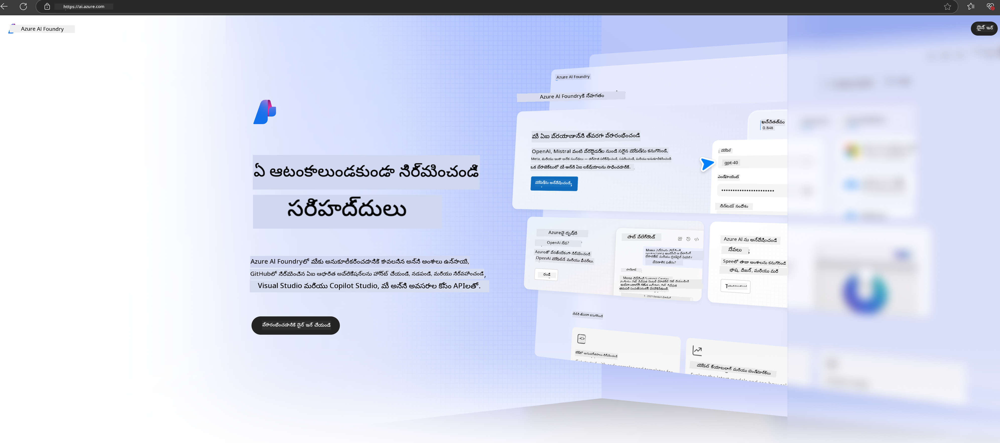

<!--
CO_OP_TRANSLATOR_METADATA:
{
  "original_hash": "3a1e48b628022485aac989c9f733e792",
  "translation_date": "2025-12-21T19:11:30+00:00",
  "source_file": "md/02.QuickStart/AzureAIFoundry_QuickStart.md",
  "language_code": "te"
}
-->
# **Azure AI Foundryలో Phi-3 ను ఉపయోగించడం**

Generative AI అభివృద్ధితో, మేము వివిధ LLM మరియు SLM, సంస్థా డేటా ఇంటిగ్రేషన్, ఫైన్‑ట్యూనింగ్/RAG ఆపరేషన్లు మరియు LLM మరియు SLM సమీకరణ తరువాత వివిధ సంస్థల వ్యాపారాల మూల్యాంకనాన్ని నిర్వహించడానికి ఒక ఐక్య వేదికను ఉపయోగించాలని ఆశిస్తున్నాం, తద్వారా జనరేటివ్ AI ద్వారా స్మార్ట్ అప్లికేషన్లు మెరుగ్గా అమలు చేయబడగలవు. [Azure AI Foundry](https://ai.azure.com) ఒక సంస్థాత్మక స్థాయి జనరేటివ్ AI అప్లికేషన్ వేదిక.

Azure AI Foundry ద్వారా మీరు పెద్ద భాషా మోడల్ (LLM) ప్రతిస్పందనలను మూల్యాంకనం చేయవచ్చు మరియు మెరుగైన పనితీరుకోసం prompt flow తో ప్రాంప్ట్ అప్లికేషన్ భాగాలను ఆర్కెస్ట్రేట్ చేయవచ్చు. ఈ వేదిక భావనలకు నిరూపణలను సులభంగా పూర్తి ఉత్పత్తిలోకి మార్పు చేయడానికి స్కేలబిలిటీని సౌకర్యవంతంగా పెంచుతుంది. నిరంతరం మానిటరింగ్ మరియు మెరుగుదల దీర్ఘకాలిక విజయాన్ని సమర్థిస్తోంది.

సింపుల్ స్టెప్స్ ద్వారా మేము Phi-3 మోడల్‌ను Azure AI Foundryలో త్వరగా డిప్లాయ్ చేయవచ్చు, మరియు తర్వాత Playground/Chat, Fine-tuning, మూల్యాంకనం మరియు Phi-3 కు సంబంధించిన ఇతర పనులను Azure AI Foundry ద్వారా పూర్తి చేయవచ్చు.

## **1. సిద్ధత**

మీ యంత్రంపై ఇప్పటికే [Azure Developer CLI](https://learn.microsoft.com/azure/developer/azure-developer-cli/overview?WT.mc_id=aiml-138114-kinfeylo) ఇన్స్టాల్ చేసి ఉంటే, ఈ టెంప్లేట్‌ను ఉపయోగించడం కొత్త డైరెక్టరీలో ఈ కమాండ్‌ను 실행ించడం మాత్రమే.

## Manual Creation

Microsoft Azure AI Foundry ప్రాజెక్ట్ మరియు హబ్ సృష్టించడం మీ AI పనులను సమగ్రముగా నిర్వహించడానికి మరియు ఏర్పాటు చేయడానికి అద్భుతమైన విధానం. మీను ప్రారంభించడానికి ఇక్కడ స్టెప్-బై-స్టెప్ మార్గదర్శనం ఉంది:

### Creating a Project in Azure AI Foundry

1. **Go to Azure AI Foundry**: Azure AI Foundry పోర్టల్‌లో సైన్ ఇన్ చేయండి.
2. **Create a Project**:
   - మీరు ఒక ప్రాజెక్టులో ఉన్నట్లయితే, హోం పేజీకి చేరడానికి పేజీ పైఎడమకు "Azure AI Foundry" ను ఎంచుకోండి.
   - "+ Create project" ను ఎంచుకోండి.
   - ప్రాజెక్ట్ కోసం ఒక పేరు నమోదు చేయండి.
   - మీకు ఒక హబ్ ఉంటే, అది డిఫాల్ట్‌గా ఎంచుకునబడుతుంది. ఒకటి కన్నా ఎక్కువ హబ్‌లకు మీకు యాక్సెస్ ఉంటే, డ్రాప్డౌన్ నుండి వేరొకటి ఎంచుకోవచ్చు. కొత్త హబ్ సృష్టించాలనుకుంటే, "Create new hub" ను ఎంచుకుని ఒక పేరు అందించండి.
   - "Create" ను ఎంచుకోండి.

### Creating a Hub in Azure AI Foundry

1. **Go to Azure AI Foundry**: మీ Azure ఖాతాతో సైన్ ఇన్ చేయండి.
2. **Create a Hub**:
   - ఎడమ మెనూ నుండి Management center ను ఎంచుకోండి.
   - "All resources" ను ఎంచుకుని, "+ New project" పక్కన ఉన్న దిగువ బాణాన్ని ఎంచుకుని "+ New hub" ను ఎంచుకోండి.
   - "Create a new hub" డైలాగ్‌లో, మీ హబ్ కోసం ఒక పేరు (ఉదాహరణకు contoso-hub) నమోదు చేసి ఇతర ఫీల్డ్‌లను అవసరమైతే మార్చండి.
   - "Next" ను ఎంచుకుని సమాచారాన్ని సమీక్షించి, ఆపై "Create" ను ఎంచుకోండి.

వివరమైన సూచనల కొరకు, మీరు అధికారిక [Microsoft documentation](https://learn.microsoft.com/azure/ai-studio/how-to/create-projects) ను చూడవచ్చు.

సక్సెస్‌గా సృష్టించిన తర్వాత, మీరు [ai.azure.com](https://ai.azure.com/) ద్వారా మీరు సృష్టించిన స్టూడియోకు ప్రవేశించవచ్చు

ఒక AI Foundry లో ఒకటి కంటే ఎక్కువ ప్రాజెక్ట్‌లు ఉండవచ్చు. తయారుచేసుకోవడానికి AI Foundry లో ఒక ప్రాజెక్టును సృష్టించండి.

Create Azure AI Foundry [QuickStarts](https://learn.microsoft.com/azure/ai-studio/quickstarts/get-started-code)

## **2. Azure AI Foundryలో Phi మోడల్‌ను డిప్లాయ్ చేయడం**

ప్రాజెక్ట్ యొక్క Explore ఎంపికను క్లిక్ చేసి Model Catalog లోకి ప్రవేశించి Phi-3 ను ఎంచుకోండి

Select Phi-3-mini-4k-instruct

Click 'Deploy' to deploy the Phi-3-mini-4k-instruct model

> [!NOTE]
>
> మీరు డిప్లాయ్ చేస్తున్నప్పుడు కంప్యూటింగ్ శక్తిని ఎంచుకోవచ్చు

## **3. Azure AI Foundryలో Playground లో Phi తో చాట్ చేయడం**

డిప్లాయ్‌మెంట్ పేజీకి వెళ్లి Playground ఎంచుకొని Azure AI Foundryలోని Phi-3 తో చాట్ చేయండి

## **4. Azure AI Foundry నుండి మోడల్‌ను డిప్లాయ్ చేయడం**

Azure Model Catalog నుండి మోడల్‌ను డిప్లాయ్ చేయడానికి, మీరు ఈ స్టెప్స్ ను అనుసరించవచ్చు:

- Azure AI Foundryలో సైన్ ఇన్ చేయండి.
- Azure AI Foundry మోడల్ క్యాటలాగ్ నుండి మీరు డిప్లాయ్ చేయదలచిన మోడల్‌ను ఎంచుకోండి.
- మోడల్ యొక్క Details పేజీపై, Deploy ను ఎంచుకుని ఆపై Serverless API with Azure AI Content Safety ను ఎంచుకోండి.
- మీరు మీ మోడల్స్‌ను డిప్లాయ్ చేయదలచిన ప్రాజెక్ట్‌ను ఎంచుకోండి. Serverless API ఆఫర్ ను ఉపయోగించాలంటే, మీ వర్క్‌స్పేస్ East US 2 లేదా Sweden Central రీజియన్లలో ఉండాలి. మీరు Deployment name ను అనుకూలీకరించవచ్చు.
- deployment wizard పై, Pricing and terms ను ఎంచుకుని ఉపయోగ ఖర్చుల మరియు వాడక నిబంధనలు గురించి తెలుసుకోండి.
- Deploy ను ఎంచుకోండి. డిప్లాయ్‌మెంట్ రెడీ అవ్వేవరకు వేచి ఉండండి మరియు మీరు Deployments పేజీకి రీడైరెక్ట్ చేయబడతారు.
- మోడల్‌తో ఇంటరాక్ట్ చేయడం ప్రారంభించడానికి Open in playground ను ఎంచుకోండి.
- మీరు Deployments పేజీకి తిరిగి వచ్చి, డిప్లాయ్‌మెంట్‌ను ఎంచుకుని endpoint యొక్క Target URL మరియు Secret Key ను గమనించవచ్చు, ఇవి మీరు డిప్లాయ్‌మెంట్‌ను కాల్ చేసి కంప్లీషన్లు తయారుచేయడానికి ఉపయోగించవచ్చు.
- మీరు ఎప్పుడైనా Build ట్యాబ్‌కు నెటిగేట్ చేసుకుని Components విభాగం నుండి Deployments ను ఎంచుకోవడం ద్వారా endpoint యొక్క వివరాలు, URL, మరియు access keys ను పొందవచ్చు.

> [!NOTE]
> దయచేసి గమనించండి: ఈ స్టెప్స్ నిర్వహించడానికి మీ ఖాతాకు Resource Group పై Azure AI Developer role పరమిషన్లు ఉండాలి.

## **5. Azure AI Foundryలో Phi API ఉపయోగించడం**

Postman GET ద్వారా మీరు https://{Your project name}.region.inference.ml.azure.com/swagger.json ను యాక్సెస్ చేసి Key తో కలిపి అందిస్తున్న ఇంటర్‌ఫేస్‌ల గురించి తెలుసుకోవచ్చు

మీరు ప్రశ్నా పారామీటర్లను అనుకూలంగా పొందవచ్చు, అలాగే రిస్పాన్స్ పారామీటర్లను కూడా పొందవచ్చు.

---

<!-- CO-OP TRANSLATOR DISCLAIMER START -->
నిరాకరణ:
ఈ పత్రాన్ని AI అనువాద సేవ Co‑op Translator (https://github.com/Azure/co-op-translator) ఉపయోగించి అనువదించారు. మేము ఖచ్చితత్వానికి ప్రయత్నించినప్పటికీ, స్వయంచాలక అనువాదాల్లో తప్పులు లేదా అపరిశుద్ధతలు ఉండవచ్చు అన్న విషయాన్ని దయచేసి గమనించండి. మూల పత్రాన్ని దాని స్థానిక భాషలోనే అధికారిక మూలంగా పరిగణించాలి. కీలకమైన సమాచారానికి ప్రొఫెషనల్ మానవ అనువాదాన్ని సూచించబడుతుంది. ఈ అనువాదం ఉపయోగం ద్వారా ఏర్పడిన ఏవైనా అపార్థాలు లేదా తప్పుగా అర్థం చేసుకోవడాలకు మేము బాధ్యులం కదామనే సమాచారాన్ని తెలియజేస్తున్నాం.
<!-- CO-OP TRANSLATOR DISCLAIMER END -->