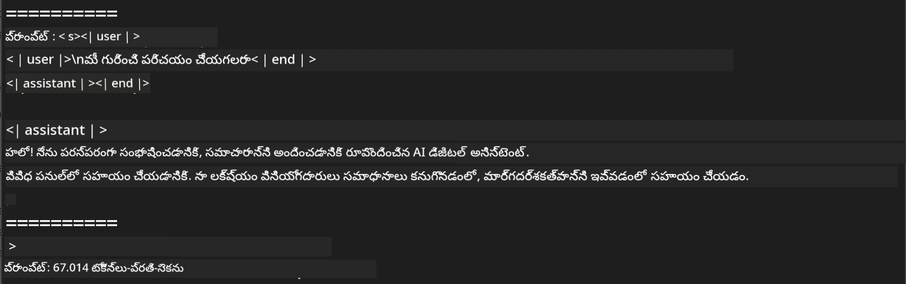

<!--
CO_OP_TRANSLATOR_METADATA:
{
  "original_hash": "dcb656f3d206fc4968e236deec5d4384",
  "translation_date": "2025-12-21T22:12:06+00:00",
  "source_file": "md/03.FineTuning/03.Inference/MLX_Inference.md",
  "language_code": "te"
}
-->
# **Apple MLX ఫ్రేమ్‌వర్క్‌తో Phi-3 ఇన్ఫరెన్స్**

## **MLX ఫ్రేమ్‌వర్క్ అంటే ఏమిటి**

MLX అనేది Apple సిలికాన్‌పై యంత్ర అభ్యాస (machine learning) పరిశోధన కోసం Apple machine learning research ద్వారా అందించిన ఒక array ఫ్రేమ్‌వర్క్.

MLX ను machine learning పరిశోధకులు కోసం machine learning పరిశోధకులు రూపొందించారు. ఈ ఫ్రేమ్‌వర్క్ వినియోగదారులకు సరళంగా ఉండేలా, ఇంకా మోడళ్లను శిక్షణ ఇవ్వడం మరియు నిర్గమించడానికి సమర్థవంతంగా ఉండేలా ఉద్దేశించబడింది. ఫ్రేమ్‌వర్క్ స్వీయ అమరిక కూడా భావాత్మకంగా సరళమైనది. పరిశోధకులు త్వరగా కొత్త ఆలోచనలను అన్వేషించేందుకు MLX ను విస్తరించటం మరియు మెరుగుపరచటం సులభంగా ఉండేలా చేయాలని మన యోజన.

LLMs ను MLX ద్వారా Apple Silicon డివైజుల్లో వేగవంతం చేయగలవు, మరియు మోడళ్లను స్థానికంగా చాలా సౌకర్యవంతంగా నడపవచ్చు.

## **MLX ఉపయోగించి Phi-3-mini ఇన్ఫరెన్స్ చేయడం**

### **1. మీ MLX env సెటప్ చేయండి**

1. Python 3.11.x
2. MLX లైబ్రరీని ఇన్‌స్టాల్ చేయండి


```bash

pip install mlx-lm

```

### **2. MLX తో Terminalలో Phi-3-mini నడుపటం**


```bash

python -m mlx_lm.generate --model microsoft/Phi-3-mini-4k-instruct --max-token 2048 --prompt  "<|user|>\nCan you introduce yourself<|end|>\n<|assistant|>"

```

ఫలితం (నా env Apple M1 Max,64GB) ఇదే



### **3. Terminalలో MLX తో Phi-3-mini ను క్వాంటైజ్ చేయడం**


```bash

python -m mlx_lm.convert --hf-path microsoft/Phi-3-mini-4k-instruct

```

***గమనిక：*** మోడల్‌ను mlx_lm.convert ద్వారా క్వాంటైజ్ చేయవచ్చు, మరియు డిఫాల్ట్ క్వాంటైజేషన్ INT4. ఈ ఉదాహరణలో Phi-3-mini ను INT4 కు క్వాంటైజ్ చేయడం చూపబడింది

మోడల్‌ను mlx_lm.convert ద్వారా క్వాంటైజ్ చేయవచ్చు, మరియు డిఫాల్ట్ క్వాంటైజేషన్ INT4. ఈ ఉదాహరణలో Phi-3-mini ను INT4 లోకి క్వాంటైజ్ చేయడం చూపిస్తున్నారు. క్వాంటైజ్ అనంతరం అది డిఫాల్ట్ డైరెక్టరీ ./mlx_model లో నిల్వ అవుతుంది

మేము టెర్మినల్ నుండి MLX తో క్వాంటైజ్ చేయబడిన మోడల్‌ను పరీక్షించవచ్చు


```bash

python -m mlx_lm.generate --model ./mlx_model/ --max-token 2048 --prompt  "<|user|>\nCan you introduce yourself<|end|>\n<|assistant|>"

```

ఫలితం ఇది


### **4. Jupyter Notebookలో MLXతో Phi-3-mini నడపడం**


***గమనిక:*** దయచేసి ఈ ఉదాహరణను చదవండి [ఈ లింక్‌పై క్లిక్ చేయండి](../../../code/03.Inference/MLX/MLX_DEMO.ipynb)


## **వనరులు**

1. Apple MLX ఫ్రేమ్‌వర్క్ గురించి తెలుసుకోండి [https://ml-explore.github.io](https://ml-explore.github.io/mlx/build/html/index.html)

2. Apple MLX GitHub రిపోజిటరీ [https://github.com/ml-explore](https://github.com/ml-explore)

---

<!-- CO-OP TRANSLATOR DISCLAIMER START -->
స్పష్టీకరణ:
ఈ పత్రాన్ని AI అనువాద సేవ (Co-op Translator — https://github.com/Azure/co-op-translator) ద్వారా అనువదించబడింది. మేము ఖచ్చితత్వానికి శ్రమిస్తున్నప్పటికీ, ఆటోమేటెడ్ అనువాదాలలో పొరపాట్లు లేదా లోపాలు ఉండవచ్చని గమనించండి. మూల భాషలో ఉన్న అసలు పత్రాన్ని అధికారిక మూలంగా పరిగణించాలి. కీలకమైన సమాచారం కోసం వృత్తిపరమైన మానవ అనువాదం చేయించుకోవాలని సూచిస్తున్నాము. ఈ అనువాదాన్ని ఉపయోగించుట వల్ల కలిగే ఏవైనా అపార్థాలు లేదా తప్పు అర్థాల కోసం మేము బాధ్యులు కాదాన్ని తెలియజేస్తున్నాము.
<!-- CO-OP TRANSLATOR DISCLAIMER END -->