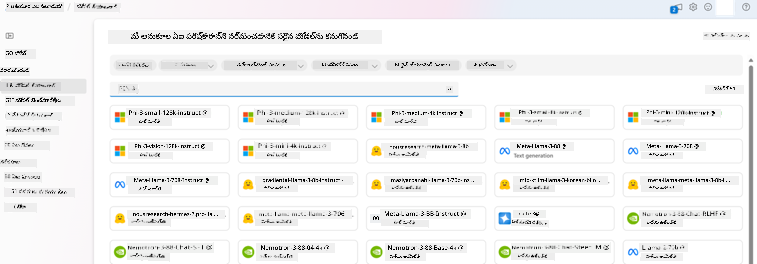
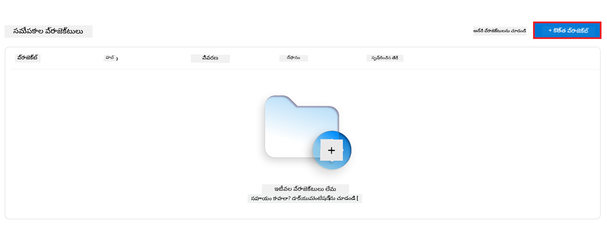
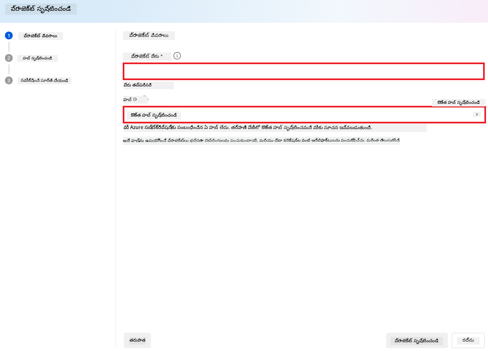
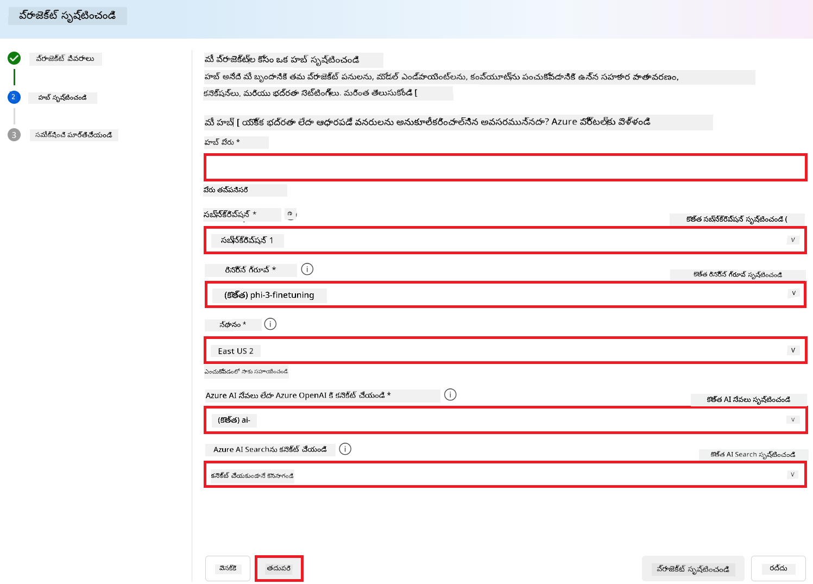
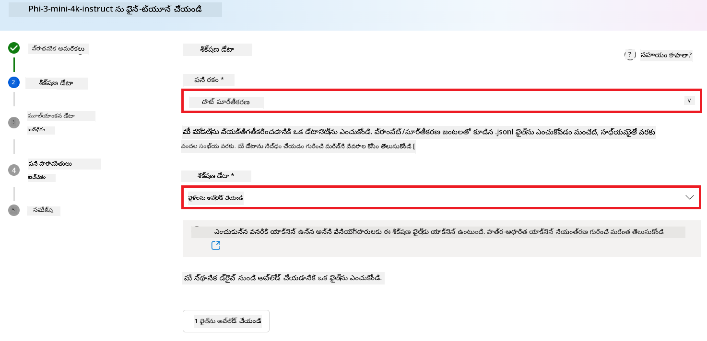

<!--
CO_OP_TRANSLATOR_METADATA:
{
  "original_hash": "c1559c5af6caccf6f623fd43a6b3a9a3",
  "translation_date": "2025-12-21T17:01:29+00:00",
  "source_file": "md/03.FineTuning/FineTuning_AIFoundry.md",
  "language_code": "te"
}
-->
# Azure AI Foundryతో Phi-3 ఫైన్-ట్యూనింగ్

 మనము Azure AI Foundry ఉపయోగించి Microsoft యొక్క Phi-3 Mini భాషా మోడల్‌ను ఎలా ఫైన్-ట్యూన్ చేయాలో పరిశీలిద్దాం. ఫైన్-ట్యూనింగ్ ద్వారా మీరు Phi-3 Miniను నిర్దిష్ట పనులకు అనుగుణంగా మార్చగలుగుతారు, దీని ద్వారా అది మరింత శక్తివంతమైనది మరియు సందర్భానుకూలంగా మారుతుంది.

## పరిగణించవలసిన అంశాలు

- **సాధ్యతలు:** ఎటువంటి మోడళ్లు ఫైన్-ట్యూనబుల్? బేస్ మోడల్‌ను ఏమి చేయడానికి ఫైన్-ట్యూన్ చేయవచ్చు?
- **ఖర్చు:** ఫైన్-ట్యూనింగ్ కోసం ధర మోడల్ ఏంటి?
**అనుకూలతా పరిమాణం:** బేస్ మోడల్‌ను ఎంతవరకు మార్చవచ్చు – మరియు ఏ విధాలుగా?
- **సౌకర్యం:** ఫైన్-ట్యూనింగ్ ఎలా జరుగుతుంది – నాకు ప్రత్యేక కోడ్ రాయాల్సిన అవసరముందా? నా స్వంత కంప్యూట్‌ను తీసుకురావాల్సిన అవసరముందా?
- **సురక్షత:** ఫైన్-ట్యూన్ చేసిన మోడల్స్‌కు సురక్షత సంబంధిత ప్రమాదాలు ఉంటాయి – అవి అనిర్దిష్ట నష్టం వెదజల్లకుండా ఏవైనా గార్డ్‌రైల్స్ ఉన్నాయా?



## ఫైన్-ట్యూనింగ్‌కు సిద్ధత

### ముందస్తు అవసరాలు

> [!NOTE]
> Phi-3 కుటుంబపు మోడల్స్‌కు, pay-as-you-go మోడల్ ఫైన్-ట్యూన్ ఆఫరింగ్ కేవలం **East US 2** ప్రాంతాల్లో సృష్టించిన హబ్‌లలో మాత్రమే అందుబాటులో ఉంటుంది.

- ఒక Azure subscription. మీకు Azure subscription లేకపోతే, ప్రారంభించడానికి ఒక [paid Azure account](https://azure.microsoft.com/pricing/purchase-options/pay-as-you-go) సృష్టించండి.

- ఒక [AI Foundry ప్రాజెక్ట్](https://ai.azure.com?WT.mc_id=aiml-138114-kinfeylo).
- Azure role-based access controls (Azure RBAC) Azure AI Foundryలో కార్యాచరణలకు యాక్సెస్‌ని దయచేసి ఇవ్వడానికి ఉపయోగిస్తారు. ఈ ఆర్టికల్‌లోని దశలను అమలు చేసేందుకు, మీ వాడుకరి ఖాతాకు రిసోర్స్ గ్రూప్‌లో __Azure AI Developer role__ అప్పగించబడాలి.

### సబ్స్క్రిప్షన్ ప్రొవైడర్ నమోదు

సబ్స్క్రిప్షన్ `Microsoft.Network` రిసోర్స్ ప్రొవైడర్‌కు నమోదు చేయబడిందని నిర్ధారించుకోండి.

1. [Azure portal](https://portal.azure.com) లో సైన్-ఇన్ చేయండి.
1. ఎడమ మెనూల నుంచి **Subscriptions**ని ఎంచుకోండి.
1. మీరు ఉపయోగించదలచిన subscriptionని ఎంచుకోండి.
1. ఎడమ మెనుడులోని **AI project settings** > **Resource providers**ను ఎంచుకోండి.
1. జాబితాలో **Microsoft.Network** ఉందో లేదో నిర్ధారించండి. లేకపోతే దానిని జోడించండి.

### డేటా సిద్ధత

మీ మోడల్‌ను ఫైన్-ట్యూన్ చేయడానికి మీ శిక్షణ మరియు ధ్రువీకరణ డేటాను సిద్ధం చేయండి. మీ శిక్షణ డేటా మరియు ధృవీకరణ డేటా సెట్‌లు మీరు మోడల్‌ను ఎలా పని చేయించాలనుకుంటున్నారో దానికి సంబంధించిన ఇన్‌పుట్ మరియు అవుట్‌పుట్ ఉదాహరణలను కలిగి ఉండాలి.

అనుకూలంగా ఫైన్-ట్యూన్ చేయడానికి, మీ అన్ని శిక్షణ ఉదాహరణలు అంచనా కోసం ఆశించే ఫార్మాట్‌ను అనుసరించాలి. సమతుల్యమైన మరియు వైవిధ్యభరితమైన డేటాసెట్‌ను నిర్ధారించండి.

దీనిలో డేటా సమతుల్యాన్ని ఉంచడం, వివిధ పరిస్థితులను చేర్చడం, మరియు వాస్తవ ప్రపంచూయింత ఆశించిన ఫలితాలకు అనుగుణంగా శిక్షణ డేటాను périodically సవరించడం వంటివి ఉంటాయి, ఇవి చివరికి మోడల్ ప్రతిస్పందనలను మరింత ఖచ్చితంగా మరియు సమతుల్యంగా చేస్తాయి.

విభిన్న మోడల్ రకాలకి శిక్షణ డేటా వేర్వేరు ఫార్మాట్ అవసరం.

### చాట్ కంప్లీషన్

మీరు ఉపయోగించే శిక్షణ మరియు ధృవీకరణ డేటా **అవస్యంగా** JSON Lines (JSONL) డాక్యుమెంట్ ఫార్మాట్‌లో ఉండాలి. `Phi-3-mini-128k-instruct` కోసం ఫైన్-ట్యూనింగ్ datasets Chat completions API ద్వారా ఉపయోగించే సంభాషణాత్మక ఫార్మాట్‌లో ఉండాలి.

### ఉదాహరణ ఫైల్ ఫార్మాట్

```json
    {"messages": [{"role": "system", "content": "You are an Xbox customer support agent whose primary goal is to help users with issues they are experiencing with their Xbox devices. You are friendly and concise. You only provide factual answers to queries, and do not provide answers that are not related to Xbox."}, {"role": "user", "content": "Is Xbox better than PlayStation?"}, {"role": "assistant", "content": "I apologize, but I cannot provide personal opinions. My primary job is to assist you with any issues related to your Xbox device. Do you have any Xbox-related issues that need addressing?"}]}
    {"messages": [{"role": "system", "content": "You are an Xbox customer support agent whose primary goal is to help users with issues they are experiencing with their Xbox devices. You are friendly and concise. You only provide factual answers to queries, and do not provide answers that are not related to Xbox."}, {"role": "user", "content": "Can I play PC games on my Xbox?"}, {"role": "assistant", "content": "While Xbox consoles don't natively support PC games, they can play an array of Xbox games, many of which are also available on PC. Can I assist you with finding games compatible with your Xbox device?"}]}
    {"messages": [{"role": "system", "content": "You are an Xbox customer support agent whose primary goal is to help users with issues they are experiencing with their Xbox devices. You are friendly and concise. You only provide factual answers to queries, and do not provide answers that are not related to Xbox."}, {"role": "user", "content": "I'm having trouble connecting my Xbox to the Wi-Fi."}, {"role": "assistant", "content": "No worries, let's go through the network settings on your Xbox. Can you please tell me what happens when you try to connect it to the Wi-Fi?"}]}
```

సపోర్ట్ చేయబడిన ఫైల్ టाइప్ JSON Lines. ఫైల్స్ డిఫాల్ట్ డాటాస్టోర్లో అప్‌లోడ్ చేయబడతాయి మరియు మీ ప్రాజెక్టులో అందుబాటులో ఉంటాయి.

## Azure AI Foundryతో Phi-3 ఫైన్-ట్యూనింగ్

Azure AI Foundry ద్వారా మీరు పెద్ద భాషా మోడల్స్‌ను మీ వ్యక్తిగత డేటాసెట్‌లకు అనుగుణంగా మార్చుకోవచ్చు, దీనిని ఫైన్-ట్యూనింగ్ అని పిలుస్తారు. ఫైన్-ట్యూనింగ్ ద్వారా నిర్దిష్ట పనుల మరియు అనువర్తనాల కోసం అనుకూలీకరణ మరియు ఆప్టిమైజేషన్ సాధ్యమవుతుంది. ఇది మెరుగైన పనితనం, ఖర్చు సామర్ధ్యత, తగ్గిన లేటెన్సీ మరియు ఆవర్తిత అవుట్‌పుట్‌లను అందిస్తుంది.


### కొత్త ప్రాజెక్ట్ సృష్టించండి

1. [Azure AI Foundry](https://ai.azure.com) లో సైన్-ఇన్ చేయండి.

1. Azure AI Foundryలో కొత్త ప్రాజెక్ట్ సృష్టించడానికి **+New project**ను ఎంచుకోండి.

    

1. క్రింది పనులను చేయండి:

    - ప్రాజెక్ట్ **Hub name**. ఇది ప్రత్యేకమైన విలువగా ఉండాలి.
    - ఉపయోగించడానికి **Hub**ని ఎంచుకోండి (అవసరమైతే కొత్తది సృష్టించండి).

    

1. కొత్త హబ్ సృష్టించడానికి క్రింది పనులు చేయండి:

    - **Hub name**ని ఎంటర్ చేయండి. ఇది ప్రత్యేకమైనవిగా ఉండాలి.
    - మీ Azure **Subscription**ని ఎంచుకోండి.
    - ఉపయోగించడానికి **Resource group**ను ఎంచుకోండి (అవసరమైతే కొత్తది సృష్టించండి).
    - మీరు ఉపయోగించదలిచిన **Location**ని ఎంచుకోండి.
    - ఉపయోగించడానికి **Connect Azure AI Services**ని ఎంచుకోండి (అవసరమైతే కొత్తది సృష్టించండి).
    - **Connect Azure AI Search**కి **Skip connecting**ని ఎంచుకోండి.

    

1. **Next**ని ఎంచుకోండి.
1. **Create a project**ని ఎంచుకోండి.

### డేటా తయారీ

ఫైన్-ట్యూనింగ్ ప్రారంభించే ముందు, మీ టాస్క్‌కు సంబంధీసిన డేటాసెట్‌ను సేకరించండి లేదా రూపొందించండి, ఉదాహరణకు చాట్ సూచనలు, ప్రశ్న-జవాబు జతలు, లేదా ఏదైనా ఇతర సంబంధిత టెక్స్ట్ డేటా. ఈ డేటాను శుభ్రం చేయండి మరియు ముందస్తుగా ప్రాసెస్ చేయండి — శబ్దాన్ని తొలగించడం, లేమి విలువలు హ్యాండిల్ చేయడం, మరియు టెక్స్ట్‌ను టోకెనైజ్ చేయడం.

### Azure AI Foundryలో Phi-3 మోడల్స్‌ను ఫైన్-ట్యూన్ చేయండి

> [!NOTE]
> Phi-3 మోడల్స్ ఫైన్-ట్యూనింగ్ ప్రస్తుతం East US 2లోని ప్రాజెక్ట్‌లలో మాత్రమే మద్దతు పొందుతాయి.

1. ఎడమ పక్క ట్యాబ్ నుండి **Model catalog**ని ఎంచుకోండి.

1. **search bar**లో *phi-3* టైప్ చేసి మీరు ఉపయోగించదలిచిన phi-3 మోడల్‌ను ఎంచుకోండి.

    

1. **Fine-tune**ని ఎంచుకోండి.

    

1. **Fine-tuned model name**ని నమోదు చేయండి.

    

1. **Next**ని ఎంచుకోండి.

1. క్రింది పనులు చేయండి:

    - **task type**గా **Chat completion**ను ఎంచుకోండి.
    - మీరు ఉపయోగించదలిచే **Training data**ను ఎంచుకోండి. మీరు దానిని Azure AI Foundry యొక్క డేటా ద్వారా లేదా మీ లోకల్ పరిసరాల నుండి అప్‌లోడ్ చేయవచ్చు.

    

1. **Next**ని ఎంచుకోండి.

1. మీరు ఉపయోగించదలిచే **Validation data**ని అప్‌లోడ్ చేయండి. లేదా మీరు **Automatic split of training data**ని ఎంచుకోవచ్చు.

    

1. **Next**ని ఎంచుకోండి.

1. క్రింది పనులు చేయండి:

    - మీరు ఉపయోగించదలిచే **Batch size multiplier**ని ఎంచుకోండి.
    - మీరు ఉపయోగించదలిచే **Learning rate**ని ఎంచుకోండి.
    - మీరు ఉపయోగించదలిచే **Epochs**ని ఎంచుకోండి.

    

1. ఫైన్-ట్యూనింగ్ ప్రక్రియ ప్రారంభించడానికి **Submit**ని ఎంచుకోండి.

    


1. మీ మోడల్ ఫైన్-ట్యూన్ అయిన తరువాత, స్టేటస్ **Completed** గా చూపించబడుతుంది, క్రింద ఇచ్చిన చిత్రం అంతరంగంలో చూపించినట్లు. ఇప్పుడు మీరు మోడల్‌ను డిప్లాయ్ చేయవచ్చు మరియు మీ స్వంత అప్లికేషన్‌లో, ప్లేగ్రౌండ్లో లేదా ప్రాంప్ట్ ఫ్లోలో ఉపయోగించవచ్చు. మరిన్ని వివరాలకి, చూడండి [How to deploy Phi-3 family of small language models with Azure AI Foundry](https://learn.microsoft.com/azure/ai-studio/how-to/deploy-models-phi-3?tabs=phi-3-5&pivots=programming-language-python).

    

> [!NOTE]
> Phi-3 ఫైన్-ట్యూన్ గురించి మరింత విపులమైన సమాచారానికి దయచేసి [Fine-tune Phi-3 models in Azure AI Foundry](https://learn.microsoft.com/azure/ai-studio/how-to/fine-tune-phi-3?tabs=phi-3-mini) చూడండి.

## మీ ఫైన్-ట్యూన్ చేసిన మోడల్స్‌ని క్లీనప్ చేయడం

మీరు Azure AI Foundryలోని ఫైన్-ట్యూనింగ్ మోడల్ జాబితా నుండి లేదా మోడల్ వివరాలు పేజీ నుండి ఒక ఫైన్-ట్యూన్ చేసిన మోడల్‌ను తీసివేయగలరు. Fine-tuning పేజీలో నుంచి తీసివేయవలసిన ఫైన్-ట్యూన్ చేసిన మోడల్‌ను ఎంచుకుని, తరువాత Delete బటన్‌ను ఎంచుకుని మీ ఫైన్-ట్యూన్ చేసిన మోడల్‌ను తొలగించండి.

> [!NOTE]
> ఒక కస్టమ్ మోడల్‌కు ప్రస్తుతం ఒక డిప్లాయ్మెంట్ ఉన్నట్లయితే దాన్ని మీరు తొలగించలేరు. మీరు మీ మోడల్ డిప్లాయ్మెంట్‌ను ముందుగా తొలగించిన తరువాతే మీ కస్టమ్ మోడల్‌ను తొలగించగలరు.

## ఖర్చు మరియు కోటాస్

### సర్వీస్‌గా ఫైన్-ట్యూన్ చేసిన Phi-3 మోడల్స్ కోసం ఖర్చు మరియు కోటా పరిగణనలు

సర్వీస్‌గా ఫైన్-ట్యూన్ చేసిన Phi మోడల్స్ Microsoft ద్వారా అందించబడి Azure AI Foundryతో సమగ్రింపజేయబడతాయి. మీరు ఈ మోడల్స్‌ను డిప్లాయ్ చేయుడానికి లేదా ఫైన్-ట్యూన్ చేయడానికి ధరను deployment wizardలోని Pricing and terms టాబ్‌లో చూడవచ్చు. మరింత సమాచారం కోసం [deploying](https://learn.microsoft.com/azure/ai-studio/how-to/deploy-models-phi-3?tabs=phi-3-5&pivots=programming-language-python) చూడండి.

## కంటెంట్ ఫిల్టరింగ్

pay-as-you-goతో సర్వీస్‌గా డిప్లాయ్ చేయబడిన మోడల్స్ Azure AI Content Safety ద్వారా రక్షించబడతాయి. రియల్- టైకెండ్ ఎండ్పాయింట్లకు డిప్లాయ్ చేసినప్పుడు, మీరు ఈ సామర్థ్యాన్ని opt out చేసుకోవచ్చు. Azure AI content safety ఎనేబుల్ చేయబడ్డపుడు, ప్రాంప్ట్ మరియు కం플ీషన్ రెండూ హానికరమైన కంటెంట్ యొక్క అవుట్పుట్‌ను గుర్తించి నివారణ చేయడానికి క్లాసిఫికేషన్ మోడల్స్ యొక్క ఒక సమూహం ద్వారా పంపబడతాయి. కంటెంట్ ఫిల్టర్ వ్యవస్థ ఇన్‌పుట్ ప్రాంప్ట్‌లు మరియు అవుట్‌పుట్ కంప్లీషన్లలో సంభవించగల ప్రత్యేక శ్రేణుల హానికరమైన కంటెంట్‌ను గుర్తించి చర్య తీసుకుంటుంది. [Azure AI Content Safety](https://learn.microsoft.com/azure/ai-studio/concepts/content-filtering) గురించి మరింత తెలుసుకోండి.

**ఫైన్-ట్యూనింగ్ కాన్ఫిగరేషన్**

హైపర్పారామీటర్లు: లెర్నింగ్ రేటు, బ్యాచ్ సైజ్, శిక్షణ epochs సంఖ్య వంటి హైపర్పారామీటర్లను నిర్వచించండి.

**లాస్ ఫంక్షన్**

మీ టాస్క్ కోసం సరైన లాస్ ఫంక్షన్‌ను ఎంచుకోండి (ఉదాహరణకు, cross-entropy).

**ఆప్టిమైజర్**

శిక్షణ సమయంలో గ్రేడియంట్ అప్‌డేట్‌ల కోసం ఒక ఆప్టిమైజర్ (ఉదాహరణకు, Adam) ఎంచుకోండి.

**ఫైన్-ట్యూనింగ్ ప్రక్రియ**

- ప్రీ-ట్రెయిన్డ్ మోడల్ లోడ్ చేయండి: Phi-3 Mini checkpointని లోడ్ చేయండి.
- కస్టమ్ లేయర్స్ జోడించండి: టాస్క్-స్పెసిఫిక్ లేయర్లు (ఉదాహరణకు, చాట్ సూచనల కోసం క్లాసిఫికేషన్ హెడ్ని) జోడించండి.

**మోడల్‌ను శిక్షణ చేయండి**
మీ సిద్ధమైన డేటాసెట్ ఉపయోగించి మోడల్‌ను ఫైన్-ట్యూన్ చేయండి. శిక్షణ పురోగతిని మానిటర్ చేయండి మరియు అవసరమైతే హైపర్పారామీటర్లు సవరించండి.

**మూల్యాంకన మరియు ధృవీకరణ**

ధృవీకరణ సెట్: మీ డేటాను శిక్షణ మరియు ధృవీకరణ సెట్‌లుగా విడగొట్టండి.

**పనితీరు మూల్యాంకన చేయండి**

మోడల్ పనితీరును అంచనావేయడానికి accuracy, F1-score, లేదా perplexity వంటి మెట్రిక్స్‌ను ఉపయోగించండి.

## ఫైన్-ట్యూన్ చేసిన మోడల్‌ను సేవ్ చేయండి

**చెక్‌పాయింట్**
భవిష్యత్తు ఉపయోగం కోసం ఫైన్-ట్యూన్ చేసిన మోడల్ చెక్‌పాయింట్‌ను సేవ్ చేయండి.

## డిప్లాయ్‌మెంట్

- వెబ్ సర్వీస్‌గా డిప్లాయ్ చేయండి: మీ ఫైన్-ట్యూన్ చేసిన మోడల్‌ను Azure AI Foundryలో వెబ్ సర్వీస్‌గా డిప్లాయ్ చేయండి.
- ఎండ్పాయింట్‌ను పరీక్షించండి: డిప్లాయ్ చేసిన ఎండ్పాయింట్‌కు టెస్ట్ క్వెరీలను పంపి దాని ఫంక్షనాలిటీని ధృవీకరించండి.

## పునరావృతం చేసి మెరుగుపరచండి

పునరావృతం: పనితనం తృప్తికరంగా లేకపోతే, హైపర్పారామీటర్లు సవరించడం, మరింత డేటా జోడించడం, లేదా అదనపు epochs కోసం ఫైన్-ట్యూన్ చేయడం ద్వారా పునరావృత్తి చేయండి.

## మానిటర్ చేసి మెరుగుపరచండి

నిరంతరం మోడల్ ప్రవర్తనను మానిటర్ చేయండి మరియు అవసరమైతే సవరించండి.

## అనుకూలీకరించి విస్తరించండి

కస్టమ్ టాస్క్స్: Phi-3 Miniను చాట్ సూచనల కంటే మరో వివిధ పనులకూ ఫైన్-ట్యూన్ చేయవచ్చు. ఇతర ఉపయోగాలని అన్వేషించండి!
ప్రయోగించండి: పనితనాన్ని మెరుగుపరచడానికి వేర్వేరు ఆర్కిటెక్చర్లు, లేయర్ కలయికలు, మరియు تکنیکలు ప్రయత్నించండి.

> [!NOTE]
> ఫైన్-ట్యూనింగ్ ఒక పునరావృత ప్రక్రియ. ఉత్తమ ఫలితాల కోసం ప్రయోగించండి, నేర్చుకోండి, మరియు మీ టాస్క్‌కు అనుగుణంగా మీ మోడల్‌ను అనువర్తించండి!

---

<!-- CO-OP TRANSLATOR DISCLAIMER START -->
నిరాకరణ:
ఈ డాక్యుమెంట్‌ను AI అనువాద సేవ [Co-op Translator](https://github.com/Azure/co-op-translator) ఉపయోగించి అనువదించబడింది. మేము ఖచ్చితత్వానికి ప్రయత్నించినప్పటికీ, స్వయంచాలక అనువాదాల్లో పొరపాట్లు లేదా తప్పిదాలు ఉండవచ్చు అని దయచేసి గమనించండి. అసలు పత్రాన్ని దాని స్థానిక భాషలో ఉన్న మూల వచనం అధికారిక మూలంగా పరిగణించాలి. కీలకమైన సమాచారానికి వృత్తిపరమైన మానవ అనువాదాన్ని సూచిస్తాము. ఈ అనువాదం వినియోగం వల్ల ఉత్పన్నమయ్యే ఏవైనా అపార్థాలు లేదా తప్పుగా అర్థం చేసుకోవడాల కోసం మేము బాధ్యత వహించము.
<!-- CO-OP TRANSLATOR DISCLAIMER END -->