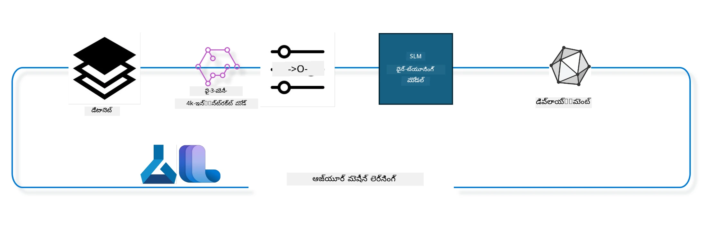

<!--
CO_OP_TRANSLATOR_METADATA:
{
  "original_hash": "944949f040e61b2ea25b3460f7394fd4",
  "translation_date": "2025-12-21T17:34:39+00:00",
  "source_file": "md/03.FineTuning/FineTuning_MLSDK.md",
  "language_code": "te"
}
-->
## Azure ML సిస్టమ్ రిజిస్ట్రీ నుండి చాట్-కంప్లీషన్ కంపోనెంట్లను ఉపయోగించి మోడల్‌ను ఫైన్-ట్యూన్ చేయడం ఎలా

In this example we will undertake fine tuning of the Phi-3-mini-4k-instruct model to complete a conversation between 2 people using ultrachat_200k dataset.



The example will show you how to undertake fine tuning using the Azure ML SDK and Python and then deploy the fine tuned model to an online endpoint for real time inference.

### శిక్షణ డేటా

We will use the ultrachat_200k dataset. This is a heavily filtered version of the UltraChat dataset and was used to train Zephyr-7B-β, a state of the art 7b chat model.

### మోడల్

We will use the Phi-3-mini-4k-instruct model to show how user can finetune a model for chat-completion task. If you opened this notebook from a specific model card, remember to replace the specific model name.

### పనులు

- ఫైన్-ట్యూన్ చేయడానికి ఒక మోడల్ ఎంచుకోండి.
- శిక్షణ డేటాను ఎంచుకుని పరిశీలించండి.
- ఫైన్ ట్యూన్ జాబ్‌ను కాన్ఫిగర్ చేయండి.
- ఫైన్ ట్యూన్ జాబ్‌ని నడపండి.
- శిక్షణ మరియు మూల్యాంకన మెట్రిక్స్‌ను సమీక్షించండి.
- ఫైన్-ట్యూన్ చేసిన మోడల్‌ను రిజిస్టర్ చేయండి.
- రియల్-టైమ్ ఇన్ఫెరెన్స్ కోసం ఫైన్-ట్యూన్ చేసిన మోడల్‌ను డిప్లాయ్ చేయండి.
- వనరులను శుభ్రం చేయండి.

## 1. ముందస్తు అవసరాలను అమర్చడం

- డిపెండెన్సీలు ఇన్స్టాల్ చేయండి
- AzureML Workspace కు కనెక్ట్ అవ్వండి. Learn more at set up SDK authentication. Replace <WORKSPACE_NAME>, <RESOURCE_GROUP> and <SUBSCRIPTION_ID> below.
- azureml system registry కు కనెక్ట్ అవ్వండి
- ఐచ్ఛికంగా ఒక ఎక్స్‌పెరిమెంట్ పేరు సెట్ చేయండి
- Compute ను తనిఖీ చేయండి లేదా క్రియేట్ చేయండి.

> [!NOTE]
> Requirements a single GPU node can have multiple GPU cards. For example, in one node of Standard_NC24rs_v3 there are 4 NVIDIA V100 GPUs while in Standard_NC12s_v3, there are 2 NVIDIA V100 GPUs. Refer to the docs for this information. The number of GPU cards per node is set in the param gpus_per_node below. Setting this value correctly will ensure utilization of all GPUs in the node. The recommended GPU compute SKUs can be found here and here.

### Python Libraries

Install dependencies by running below cell. This is not an optional step if running in a new environment.

```bash
pip install azure-ai-ml
pip install azure-identity
pip install datasets==2.9.0
pip install mlflow
pip install azureml-mlflow
```

### Interacting with Azure ML

1. This Python script is used to interact with Azure Machine Learning (Azure ML) service. Here's a breakdown of what it does:

    - It imports necessary modules from the azure.ai.ml, azure.identity, and azure.ai.ml.entities packages. It also imports the time module.

    - It tries to authenticate using DefaultAzureCredential(), which provides a simplified authentication experience to quickly start developing applications run in the Azure cloud. If this fails, it falls back to InteractiveBrowserCredential(), which provides an interactive login prompt.

    - It then tries to create an MLClient instance using the from_config method, which reads the configuration from the default config file (config.json). If this fails, it creates an MLClient instance by manually providing the subscription_id, resource_group_name, and workspace_name.

    - It creates another MLClient instance, this time for the Azure ML registry named "azureml". This registry is where models, fine-tuning pipelines, and environments are stored.

    - It sets the experiment_name to "chat_completion_Phi-3-mini-4k-instruct".

    - It generates a unique timestamp by converting the current time (in seconds since the epoch, as a floating point number) to an integer and then to a string. This timestamp can be used for creating unique names and versions.

    ```python
    # Azure ML మరియు Azure Identity నుండి అవసరమైన మాడ్యూల్స్‌ను దిగుమతి చేయండి
    from azure.ai.ml import MLClient
    from azure.identity import (
        DefaultAzureCredential,
        InteractiveBrowserCredential,
    )
    from azure.ai.ml.entities import AmlCompute
    import time  # time మాడ్యూల్‌ను దిగుమతి చేయండి
    
    # DefaultAzureCredential ఉపయోగించి ప్రామాణీకరణ చేయడానికి ప్రయత్నించండి
    try:
        credential = DefaultAzureCredential()
        credential.get_token("https://management.azure.com/.default")
    except Exception as ex:  # DefaultAzureCredential విఫలమైతే, InteractiveBrowserCredential ఉపయోగించండి
        credential = InteractiveBrowserCredential()
    
    # డిఫాల్ట్ కాన్ఫిగ్ ఫైల్ ఉపయోగించి MLClient ఇన్స్టాన్స్ సృష్టించడానికి ప్రయత్నించండి
    try:
        workspace_ml_client = MLClient.from_config(credential=credential)
    except:  # అది విఫలమైతే, వివరాలను మాన్యువల్‌గా అందించడం ద్వారా MLClient ఇన్స్టాన్స్‌ను సృష్టించండి
        workspace_ml_client = MLClient(
            credential,
            subscription_id="<SUBSCRIPTION_ID>",
            resource_group_name="<RESOURCE_GROUP>",
            workspace_name="<WORKSPACE_NAME>",
        )
    
    # "azureml" అనే Azure ML రిజిస్ట్రీ కోసం మరో MLClient ఇన్స్టాన్స్ సృష్టించండి
    # ఈ రిజిస్ట్రీలో మోడల్స్, ఫైన్‑ట్యూనింగ్ పైప్‌లైన్‌లు మరియు ఎన్విరాన్మెంట్స్ నిల్వ ఉంటాయి
    registry_ml_client = MLClient(credential, registry_name="azureml")
    
    # ఎక్స్‌పెరిమెంట్ పేరును సెట్ చేయండి
    experiment_name = "chat_completion_Phi-3-mini-4k-instruct"
    
    # అనన్యంగా ఉండాల్సిన పేర్లు మరియు వెర్షన్ల కోసం ఉపయోగించుకునే ఒక ప్రత్యేక టైమ్‌స్టాంప్‌ని ఉత్పత్తి చేయండి
    timestamp = str(int(time.time()))
    ```

## 2. ఫౌండేషన్ మోడల్‌ను ఫైన్-ట్యూన్ చేయడానికి ఎంచుకోండి

1. Phi-3-mini-4k-instruct is a 3.8B parameters, lightweight, state-of-the-art open model built upon datasets used for Phi-2. The model belongs to the Phi-3 model family, and the Mini version comes in two variants 4K and 128K which is the context length (in tokens) it can support, we need to finetune the model for our specific purpose in order to use it. You can browse these models in the Model Catalog in the AzureML Studio, filtering by the chat-completion task. In this example, we use the Phi-3-mini-4k-instruct model. If you have opened this notebook for a different model, replace the model name and version accordingly.

    > [!NOTE]
    > the model id property of the model. This will be passed as input to the fine tuning job. This is also available as the Asset ID field in model details page in AzureML Studio Model Catalog.

2. This Python script is interacting with Azure Machine Learning (Azure ML) service. Here's a breakdown of what it does:

    - It sets the model_name to "Phi-3-mini-4k-instruct".

    - It uses the get method of the models property of the registry_ml_client object to retrieve the latest version of the model with the specified name from the Azure ML registry. The get method is called with two arguments: the name of the model and a label specifying that the latest version of the model should be retrieved.

    - It prints a message to the console indicating the name, version, and id of the model that will be used for fine-tuning. The format method of the string is used to insert the name, version, and id of the model into the message. The name, version, and id of the model are accessed as properties of the foundation_model object.

    ```python
    # మోడల్ పేరు సెట్ చేయండి
    model_name = "Phi-3-mini-4k-instruct"
    
    # Azure ML రిజిస్ట్రీ నుండి మోడల్ యొక్క తాజా వెర్షన్ పొందండి
    foundation_model = registry_ml_client.models.get(model_name, label="latest")
    
    # మోడల్ పేరు, వెర్షన్ మరియు ఐడిని ప్రింట్ చేయండి
    # ట్రాకింగ్ మరియు డీబగ్గింగ్ కోసం ఈ సమాచారం ఉపయోగకరంగా ఉంటుంది
    print(
        "\n\nUsing model name: {0}, version: {1}, id: {2} for fine tuning".format(
            foundation_model.name, foundation_model.version, foundation_model.id
        )
    )
    ```

## 3. Create a compute to be used with the job

The finetune job works ONLY with GPU compute. The size of the compute depends on how big the model is and in most cases it becomes tricky to identify the right compute for the job. In this cell, we guide the user to select the right compute for the job.

> [!NOTE]
> The computes listed below work with the most optimized configuration. Any changes to the configuration might lead to Cuda Out Of Memory error. In such cases, try to upgrade the compute to a bigger compute size.

> [!NOTE]
> While selecting the compute_cluster_size below, make sure the compute is available in your resource group. If a particular compute is not available you can make a request to get access to the compute resources.

### Checking Model for Fine Tuning Support

1. This Python script is interacting with an Azure Machine Learning (Azure ML) model. Here's a breakdown of what it does:

    - It imports the ast module, which provides functions to process trees of the Python abstract syntax grammar.

    - It checks if the foundation_model object (which represents a model in Azure ML) has a tag named finetune_compute_allow_list. Tags in Azure ML are key-value pairs that you can create and use to filter and sort models.

    - If the finetune_compute_allow_list tag is present, it uses the ast.literal_eval function to safely parse the tag's value (a string) into a Python list. This list is then assigned to the computes_allow_list variable. It then prints a message indicating that a compute should be created from the list.

    - If the finetune_compute_allow_list tag is not present, it sets computes_allow_list to None and prints a message indicating that the finetune_compute_allow_list tag is not part of the model's tags.

    - In summary, this script is checking for a specific tag in the model's metadata, converting the tag's value to a list if it exists, and providing feedback to the user accordingly.

    ```python
    # Python యొక్క అబ్స్ట్రాక్ట్ సింటాక్స్ వాక్యరచనా చెట్లను ప్రాసెస్ చేయడానికి ఫంక్షన్లు అందించే ast మాడ్యూల్‌ను దిగుమతి చేయండి
    import ast
    
    # మోడల్ ట్యాగ్‌లలో 'finetune_compute_allow_list' ట్యాగ్ ఉన్నదో లేదో తనిఖీ చేయండి
    if "finetune_compute_allow_list" in foundation_model.tags:
        # ట్యాగ్ ఉండితే, ట్యాగ్ విలువను (ఒక స్ట్రింగ్) సురక్షితంగా Python లిస్టుగా పార్స్ చేయడానికి ast.literal_eval ను ఉపయోగించండి
        computes_allow_list = ast.literal_eval(
            foundation_model.tags["finetune_compute_allow_list"]
        )  # స్ట్రింగ్‌ను Python లిస్టుగా మార్చండి
        # లిస్ట్ నుంచి ఒక compute సృష్టించాలి అని సూచించే సందేశాన్ని ప్రింట్ చేయండి
        print(f"Please create a compute from the above list - {computes_allow_list}")
    else:
        # ట్యాగ్ ఉండకపోతే, computes_allow_list ని None గా సెట్ చేయండి
        computes_allow_list = None
        # మోడల్ ట్యాగ్‌లలో 'finetune_compute_allow_list' ట్యాగ్ భాగంగా లేదు అని సూచించే సందేశాన్ని ప్రింట్ చేయండి
        print("`finetune_compute_allow_list` is not part of model tags")
    ```

### Checking Compute Instance

1. This Python script is interacting with Azure Machine Learning (Azure ML) service and performing several checks on a compute instance. Here's a breakdown of what it does:

    - It tries to retrieve the compute instance with the name stored in compute_cluster from the Azure ML workspace. If the compute instance's provisioning state is "failed", it raises a ValueError.

    - It checks if computes_allow_list is not None. If it's not, it converts all the compute sizes in the list to lowercase and checks if the size of the current compute instance is in the list. If it's not, it raises a ValueError.

    - If computes_allow_list is None, it checks if the size of the compute instance is in a list of unsupported GPU VM sizes. If it is, it raises a ValueError.

    - It retrieves a list of all available compute sizes in the workspace. It then iterates over this list, and for each compute size, it checks if its name matches the size of the current compute instance. If it does, it retrieves the number of GPUs for that compute size and sets gpu_count_found to True.

    - If gpu_count_found is True, it prints the number of GPUs in the compute instance. If gpu_count_found is False, it raises a ValueError.

    
    ```python
    # ఎక్సెప్షన్ సందేశాన్ని ప్రింట్ చేయండి
    print(e)
    # కంప్యూట్ పరిమాణం వర్క్‌స్పేస్‌లో అందుబాటులో లేకపోతే ValueError ను ఎగరవేయండి
    raise ValueError(
        f"WARNING! Compute size {compute_cluster_size} not available in workspace"
    )
    
    # Azure ML వర్క్‌స్పేస్ నుండి కంప్యూట్ ఇన్స్టాన్స్‌ను పొందండి
    compute = workspace_ml_client.compute.get(compute_cluster)
    # కంప్యూట్ ఇన్స్టాన్స్ యొక్క ప్రొవిజనింగ్ స్థితి "failed" ఉందో అని తనిఖీ చేయండి
    if compute.provisioning_state.lower() == "failed":
        # ప్రొవిజనింగ్ స్థితి "failed" అయితే ValueError ను ఎగరవేయండి
        raise ValueError(
            f"Provisioning failed, Compute '{compute_cluster}' is in failed state. "
            f"please try creating a different compute"
        )
    
    # computes_allow_list None కాదని తనిఖీ చేయండి
    if computes_allow_list is not None:
        # computes_allow_list లోని అన్ని కంప్యూట్ పరిమాణాలను చిన్నఅక్షరాలుగా మార్చండి
        computes_allow_list_lower_case = [x.lower() for x in computes_allow_list]
        # కంప్యూట్ ఇన్స్టాన్స్ పరిమాణం computes_allow_list_lower_case లో ఉందో తనిఖీ చేయండి
        if compute.size.lower() not in computes_allow_list_lower_case:
            # కంప్యూట్ ఇన్స్టాన్స్ పరిమాణం computes_allow_list_lower_case లో లేకపోతే ValueError ను ఎగరవేయండి
            raise ValueError(
                f"VM size {compute.size} is not in the allow-listed computes for finetuning"
            )
    else:
        # అసమర్ధిత GPU VM పరిమాణాల జాబితాను నిర్వచించండి
        unsupported_gpu_vm_list = [
            "standard_nc6",
            "standard_nc12",
            "standard_nc24",
            "standard_nc24r",
        ]
        # కంప్యూట్ ఇన్స్టాన్స్ పరిమాణం unsupported_gpu_vm_list లో ఉందో తనిఖీ చేయండి
        if compute.size.lower() in unsupported_gpu_vm_list:
            # కంప్యూట్ ఇన్స్టాన్స్ పరిమాణం unsupported_gpu_vm_list లో ఉంటే ValueError ను ఎగరవేయండి
            raise ValueError(
                f"VM size {compute.size} is currently not supported for finetuning"
            )
    
    # GPUల సంఖ్య కనుగొనబడిందా అని తెలుసుకోవడానికి ఒక ఫ్లాగ్‌ను ప్రారంభించండి
    gpu_count_found = False
    # వర్క్‌స్పేస్‌లో అందుబాటులో ఉన్న అన్ని కంప్యూట్ పరిమాణాల జాబితాను పొందండి
    workspace_compute_sku_list = workspace_ml_client.compute.list_sizes()
    available_sku_sizes = []
    # అందుబాటులో ఉన్న కంప్యూట్ పరిమాణాల జాబితాపైన పునరావృతంగా తిరగండి
    for compute_sku in workspace_compute_sku_list:
        available_sku_sizes.append(compute_sku.name)
        # కంప్యూట్ పరిమాణం యొక్క పేరు కంప్యూట్ ఇన్స్టాన్స్ పరిమాణానికి సరిపోతుందో లేదో తనిఖీ చేయండి
        if compute_sku.name.lower() == compute.size.lower():
            # అలాంటిదైతే ఆ కంప్యూట్ పరిమాణానికి చెందిన GPUల సంఖ్యను పొందండి మరియు gpu_count_found ను True గా సెట్ చేయండి
            gpus_per_node = compute_sku.gpus
            gpu_count_found = True
    # gpu_count_found True అయితే, కంప్యూట్ ఇన్స్టాన్స్‌లోని GPUల సంఖ్యను ప్రింట్ చేయండి
    if gpu_count_found:
        print(f"Number of GPU's in compute {compute.size}: {gpus_per_node}")
    else:
        # gpu_count_found False అయితే, ValueError ను ఎగరవేయండి
        raise ValueError(
            f"Number of GPU's in compute {compute.size} not found. Available skus are: {available_sku_sizes}."
            f"This should not happen. Please check the selected compute cluster: {compute_cluster} and try again."
        )
    ```

## 4. Pick the dataset for fine-tuning the model

1. We use the ultrachat_200k dataset. The dataset has four splits, suitable for Supervised fine-tuning (sft).
Generation ranking (gen). The number of examples per split is shown as follows:

    ```bash
    train_sft test_sft  train_gen  test_gen
    207865  23110  256032  28304
    ```

1. The next few cells show basic data preparation for fine tuning:

### Visualize some data rows

We want this sample to run quickly, so save train_sft, test_sft files containing 5% of the already trimmed rows. This means the fine tuned model will have lower accuracy, hence it should not be put to real-world use.
The download-dataset.py is used to download the ultrachat_200k dataset and transform the dataset into finetune pipeline component consumable format. Also as the dataset is large, hence we here have only part of the dataset.

1. Running the below script only downloads 5% of the data. This can be increased by changing dataset_split_pc parameter to desired percentage.

    > [!NOTE]
    > Some language models have different language codes and hence the column names in the dataset should reflect the same.

1. Here is an example of how the data should look like
The chat-completion dataset is stored in parquet format with each entry using the following schema:

    - This is a JSON (JavaScript Object Notation) document, which is a popular data interchange format. It's not executable code, but a way to store and transport data. Here's a breakdown of its structure:

    - "prompt": This key holds a string value that represents a task or question posed to an AI assistant.

    - "messages": This key holds an array of objects. Each object represents a message in a conversation between a user and an AI assistant. Each message object has two keys:

    - "content": This key holds a string value that represents the content of the message.
    - "role": This key holds a string value that represents the role of the entity that sent the message. It can be either "user" or "assistant".
    - "prompt_id": This key holds a string value that represents a unique identifier for the prompt.

1. In this specific JSON document, a conversation is represented where a user asks an AI assistant to create a protagonist for a dystopian story. The assistant responds, and the user then asks for more details. The assistant agrees to provide more details. The entire conversation is associated with a specific prompt id.

    ```python
    {
        // The task or question posed to an AI assistant
        "prompt": "Create a fully-developed protagonist who is challenged to survive within a dystopian society under the rule of a tyrant. ...",
        
        // An array of objects, each representing a message in a conversation between a user and an AI assistant
        "messages":[
            {
                // The content of the user's message
                "content": "Create a fully-developed protagonist who is challenged to survive within a dystopian society under the rule of a tyrant. ...",
                // The role of the entity that sent the message
                "role": "user"
            },
            {
                // The content of the assistant's message
                "content": "Name: Ava\n\n Ava was just 16 years old when the world as she knew it came crashing down. The government had collapsed, leaving behind a chaotic and lawless society. ...",
                // The role of the entity that sent the message
                "role": "assistant"
            },
            {
                // The content of the user's message
                "content": "Wow, Ava's story is so intense and inspiring! Can you provide me with more details.  ...",
                // The role of the entity that sent the message
                "role": "user"
            }, 
            {
                // The content of the assistant's message
                "content": "Certainly! ....",
                // The role of the entity that sent the message
                "role": "assistant"
            }
        ],
        
        // A unique identifier for the prompt
        "prompt_id": "d938b65dfe31f05f80eb8572964c6673eddbd68eff3db6bd234d7f1e3b86c2af"
    }
    ```

### Download Data

1. This Python script is used to download a dataset using a helper script named download-dataset.py. Here's a breakdown of what it does:

    - It imports the os module, which provides a portable way of using operating system dependent functionality.

    - It uses the os.system function to run the download-dataset.py script in the shell with specific command-line arguments. The arguments specify the dataset to download (HuggingFaceH4/ultrachat_200k), the directory to download it to (ultrachat_200k_dataset), and the percentage of the dataset to split (5). The os.system function returns the exit status of the command it executed; this status is stored in the exit_status variable.

    - It checks if exit_status is not 0. In Unix-like operating systems, an exit status of 0 usually indicates that a command has succeeded, while any other number indicates an error. If exit_status is not 0, it raises an Exception with a message indicating that there was an error downloading the dataset.
    
    ```python
    # ఆపరేటింగ్ సిస్టమ్ ఆధారిత సదుపాయాలను ఉపయోగించేందుకు మార్గం ఇచ్చే os మాడ్యూల్‌ను దిగుమతి చేయండి
    import os
    
    # os.system ఫంక్షన్‌ను ఉపయోగించి download-dataset.py స్క్రిప్ట్‌ను షెల్‌లో నిర్దిష్ట కమాండ్-లైన్ ఆర్గ్యుమెంట్లతో నడపండి
    # ఆ ఆర్గ్యుమెంట్లు డౌన్‌లోడ్ చేయవలసిన డేటాసెట్‌ను (HuggingFaceH4/ultrachat_200k), దాన్ని డౌన్‌లోడ్ చేయవలసిన డైరెక్టరీని (ultrachat_200k_dataset), మరియు డేటాసెట్‌ను విభజించవలసిన శాతాన్ని (5) సూచిస్తాయి
    # os.system ఫంక్షన్ అది అమలు చేసిన కమాండ్ యొక్క ఎగ్జిట్ స్టేటస్‌ను తిరిగి ఇస్తుంది; ఈ స్థితి exit_status వేరియబుల్‌లో నిల్వ చేయబడుతుంది
    exit_status = os.system(
        "python ./download-dataset.py --dataset HuggingFaceH4/ultrachat_200k --download_dir ultrachat_200k_dataset --dataset_split_pc 5"
    )
    
    # exit_status 0 కాదో తనిఖీ చేయండి
    # Unix-లాంటి ఆపరేటింగ్ సిస్టమ్స్‌లో, exit స్టేటస్ 0 సాధారణంగా ఆ కమాండ్ విజయవంతమైందని సూచిస్తుంది, ఇతర ఏ సంఖ్య అయినా లోపాన్ని సూచిస్తుంది
    # exit_status 0 కాకపోతే, డేటాసెట్ డౌన్‌లోడ్‌లో పొరపాటు ఉందని తెలియజేసే సందేశంతో Exception‌నుపైకి ఎత్తండి
    if exit_status != 0:
        raise Exception("Error downloading dataset")
    ```

### Loading Data into a DataFrame

1. This Python script is loading a JSON Lines file into a pandas DataFrame and displaying the first 5 rows. Here's a breakdown of what it does:

    - It imports the pandas library, which is a powerful data manipulation and analysis library.

    - It sets the maximum column width for pandas' display options to 0. This means that the full text of each column will be displayed without truncation when the DataFrame is printed.
    - ఇది pd.read_json ఫంక్షన్‌ని ఉపయోగించి ultrachat_200k_dataset డైరెక్టరీలోని train_sft.jsonl ఫైల్‌ను DataFrame లో లోడ్ చేస్తుంది. lines=True ఆర్గుమెంట్ ఫైల్ JSON Lines ఫార్మాట్‌లో ఉందని సూచిస్తుంది, ప్రతి లైన్ ఒక వేరే JSON ఆబ్జెక్ట్ అవుతుంది.

    - ఇది head మెతడ్‌ని ఉపయోగించి DataFrame యొక్క మొదటి 5 వరుసలను ప్రదర్శిస్తుంది. DataFrame వద్ద 5 కంటే తక్కువ వరుసలు ఉంటే, అవన్నీ ప్రదర్శిస్తాయి.

    - మొత్తం మీద, ఈ స్క్రిప్ట్ ఒక JSON Lines ఫైల్‌ను DataFrame లోలోడ్ చేసి, మొత్తం కాలమ్ టెక్స్ట్‌తో మొదటి 5 వరుసలను ప్రదర్శిస్తుంది.
    
    ```python
    # pandas లైబ్రరీని దిగుమతి చేయండి, ఇది శక్తివంతమైన డేటా మానిప్యులేషన్ మరియు విశ్లేషణ లైబ్రరీ
    import pandas as pd
    
    # pandas యొక్క ప్రదర్శన ఆప్షన్ల కోసం గరిష్ఠ కాలమ్ వెడల్పును 0 గా సెట్ చేయండి
    # ఇది DataFrame ముద్రించినప్పుడు ప్రతి కాలమ్ యొక్క పూర్తి టెక్స్ట్ సంక్షిప్తం లేకుండా ప్రదర్శించబడుతుందని అర్థం
    pd.set_option("display.max_colwidth", 0)
    
    # pd.read_json ఫంక్షన్‌ను ఉపయోగించి ultrachat_200k_dataset డైరెక్టరీలోని train_sft.jsonl ఫైల్‌ను DataFrame లో లోడ్ చేయండి
    # lines=True ఆర్గ్యూమెంట్ ఫైల్ JSON Lines ఫార్మాట్‌లో ఉందని సూచిస్తుంది, ఇందులో ప్రతి లైన్ ఒక వేరే JSON ఆబ్జెక్ట్ అవుతుంది
    df = pd.read_json("./ultrachat_200k_dataset/train_sft.jsonl", lines=True)
    
    # head మెథడ్‌ను ఉపయోగించి DataFrame యొక్క మొదటి 5 వరుసలను ప్రదర్శించండి
    # DataFrameలో 5 కంటే తక్కువ వరుసలు ఉంటే, అవన్నింటినీ ప్రదర్శిస్తుంది
    df.head()
    ```

## 5. ఫైన్-ట్యూనింగ్ జాబ్‌ను మోడల్ మరియు డేటాను ఇన్పుట్‌లుగా ఉపయోగించి సమర్పించండి

chat-completion pipeline component‌ను ఉపయోగించే జాబ్‌ని సృష్టించండి. ఫైన్‑ట్యూనింగ్‌కు మద్దతు చేసే అన్ని పారామీటర్లు గురించి మరింత తెలుసుకోండి.

### ఫైన్‌ట్యూన్ పరిధులు నిర్వచించండి

1. ఫైన్‌ట్యూన్ పరిధులను 2 విభాగాలుగా గుంపు చేయవచ్చు - ట్రైనింగ్ పారామీటర్లు, ఆప్టిమైజేషన్ పారామీటర్లు

1. ట్రైనింగ్ పారామీటర్లు క్రిందిప్రకారంగా ట్రైనింగ్ Asppects ను నిర్వచిస్తాయి -

    - ఉపయోగించవలసిన optimizer, scheduler
    - ఫైన్‌ట్యూన్‌ను ఆప్టిమైజ్ చేయడానికి metric
    - ట్రైనింగ్ స్టెప్‌ల సంఖ్య, బ్యాచ్ సైజ్ మొదలైనవి
    - ఆప్టిమైజేషన్ పరిధులు GPU మెమరిని ఆప్టిమైజ్ చేసి కంప్యూట్ వనరులను సమర్థంగా ఉపయోగించడంలో సహాయపడతాయి.

1. కింది వాటి కొంచెం ఉదాహరణలు ఈ విభాగానికి చెందుతాయి. ఆప్టిమైజేషన్ పారామీటర్లు ప్రతి మోడల్‌కు భిన్నంగా ఉంటాయి మరియు ఈ వైవిధ్యాలను నిర్వహించడానికి మోడల్‌తో ప్యాకేజ్ చేయబడ్డాయి.

    - deepspeed మరియు LoRA ను ఎనేబుల్ చేయండి
    - మిక్స్డ్ ప్రిసిషన్ ట్రైనింగ్‌ను ఎనేబుల్ చేయండి
    - మల్టీ-నోడ్ ట్రైనింగ్‌ను ఎనేబుల్ చేయండి

> [!NOTE]
> Supervised finetuning may result in loosing alignment or catastrophic forgetting. We recommend checking for this issue and running an alignment stage after you finetune.

### ఫైన్ ట్యూనింగ్ ప్యారామీటర్లు

1. ఈ Python స్క్రిప్ట్ ఒక మెషీన్ లెర్నింగ్ మోడల్‌ను ఫైన్‑ట్యూన్ చేయడానికి అవసరమైన పారామీటర్లను సెటప్ చేస్తోంది. దీని వివరణ ఇక్కడ ఉంది:

    - ఇది ట్రైనింగ్ epochs సంఖ్య, ట్రైనింగ్ మరియు అలోచన కోసం బ్యాచ్ సైజ్‌లు, learning rate, learning rate scheduler రకం వంటి డిఫాల్ట్ ట్రైనింగ్ పారామీటర్లను సెటప్ చేస్తుంది.

    - ఇది LoRa వరకూ మరియు DeepSpeed మరియు DeepSpeed స్టేజ్ వంటి డిఫాల్ట్ ఆప్టిమైజేషన్ పారామీటర్లను సెటప్ చేస్తుంది.

    - ట్రైనింగ్ మరియు ఆప్టిమైజేషన్ పారామీటర్లను finetune_parameters అనే ఒకే డిక్షనరీలో కలిపిస్తుంది.

    - foundation_model వద్ద ఏదైనా మోడల్-నిర్దిష్ట డిఫాల్ట్ పారామీటర్లు ఉన్నాయో లేదో తనిఖీ చేస్తుంది. ఉంటే, ఒక వార్నింగ్ మెసేజ్ ప్రింట్ చేసి, finetune_parameters డిక్షనరీని ఈ మోడల్-స్పెసిఫిక్ డిఫాల్ట్‌లతో అప్‌డేట్ చేస్తుంది. ast.literal_eval ఫంక్షన్ మోడల్-స్పెసిఫిక్ డిఫాల్ట్‌లను స్ట్రింగ్ నుండి Python డిక్షనరీగా మార్చడానికి ఉపయోగించబడుతుంది.

    - నడిపించడానికి ఉపయోగించదగ్గ ఫైనల్ ఫైన్‑ట్యూనింగ్ పారామీటర్లను ప్రింట్ చేస్తుంది.

    - సంగ్రహంగా, ఈ స్క్రిప్ట్ ఫైన్‑ట్యూనింగ్ కోసం పారామీటర్లను సెటప్ చేసి, డిఫాల్ట్‌లను మోడల్-నిర్దిష్టవిలువలతో ఓవర్‌రైడ్ చేయగల సామర్థ్యంతో అవి ప్రదర్శిస్తుంది.

    ```python
    # డిఫాల్ట్ శిక్షణ పరామితులను ఏర్పాటు చేయండి — ఉదాహరణకు శిక్షణ epochs సంఖ్య, శిక్షణ మరియు మూల్యాంకన కోసం బాచ్ పరిమాణాలు, లర్నింగ్ రేట్ మరియు లర్నింగ్ రేట్ షెడ్యూలర్ రకం
    training_parameters = dict(
        num_train_epochs=3,
        per_device_train_batch_size=1,
        per_device_eval_batch_size=1,
        learning_rate=5e-6,
        lr_scheduler_type="cosine",
    )
    
    # డిఫాల్ట్ ఆప్టిమైజేషన్ పరామితులను ఏర్పాటు చేయండి — ఉదాహరణకు Layer-wise Relevance Propagation (LoRa) మరియు DeepSpeed వర్తింప చేయాలా మరియు DeepSpeed స్టేజ్
    optimization_parameters = dict(
        apply_lora="true",
        apply_deepspeed="true",
        deepspeed_stage=2,
    )
    
    # శిక్షణ మరియు ఆప్టిమైజేషన్ పారామితులను finetune_parameters అనే ఒకే డిక్షనరీలో కలపండి
    finetune_parameters = {**training_parameters, **optimization_parameters}
    
    # foundation_model వద్ద ఏవైనా మోడల్-స్పెసిఫిక్ డిఫాల్ట్ పరామితులు ఉన్నాయా అని తనిఖీ చేయండి
    # అవి ఉన్నట్లయితే, హెచ్చరిక సందేశాన్ని ప్రింట్ చేసి, finetune_parameters డిక్షనరీని ఈ మోడల్-స్పెసిఫిక్ డిఫాల్ట్స్‌తో నవీకరించండి
    # model-specific డిఫాల్ట్స్‌ను స్ట్రింగ్ నుంచి Python డిక్షనరీగా మార్చడానికి ast.literal_eval ఫంక్షన్ ఉపయోగిస్తారు
    if "model_specific_defaults" in foundation_model.tags:
        print("Warning! Model specific defaults exist. The defaults could be overridden.")
        finetune_parameters.update(
            ast.literal_eval(  # స్ట్రింగ్‌ను Python డిక్షనరీగా మార్చండి
                foundation_model.tags["model_specific_defaults"]
            )
        )
    
    # రన్ కోసం ఉపయోగించబడనున్న చివరి ఫైన్-ట్యూనింగ్ పరామితుల సెట్‌ని ప్రింట్ చేయండి
    print(
        f"The following finetune parameters are going to be set for the run: {finetune_parameters}"
    )
    ```

### ట్రైనింగ్ పైప్‌లైన్

1. ఈ Python స్క్రిప్ట్ ఒక మెషీన్‑లెర్నింగ్ ట్రైనింగ్ పైప్‌లైన్ కోసం ప్రదర్శన పేరు (display name) రూపొందించడానికి ఒక ఫంక్షన్ నిర్వచిస్తోంది, ఆపై ఆ ఫంక్షన్‌ను కాల్ చేసి ప్రదర్శన పేరును జెనరేట్ చేసి ప్రింట్ చేస్తోంది. దీని వివరణ ఈ క్రింది విధంగా ఉంది:

1. get_pipeline_display_name ఫంక్షన్ నిర్వచించబడుతుంది. ఈ ఫంక్షన్ ట్రైనింగ్ పైపు‌లైన్‌కు సంబంధించిన వివిధ పారామీటర్ల ఆధారంగా display name రూపొందిస్తుందని పని చేస్తుంది.

1. ఫంక్షన్ లోపల, per-device బ్యాచ్ సైజ్, gradient accumulation steps సంఖ్య, ప్రతి నోడ్‌కు GPUs సంఖ్య మరియు ఫైన్‑ట్యూన్‌కు ఉపయోగించే నోడ్ల సంఖ్యను గుణించి మొత్తం బ్యాచ్ సైజ్ ను లెక్కిస్తుంది.

1. ఇది learning rate scheduler రకం, DeepSpeed వర్తించబోతుందా, DeepSpeed స్టేజ్, Layer-wise Relevance Propagation (LoRa) వర్తిస్తుందా, నిల్వ చేయవలసిన మోడల్ చెక్పాయింట్‌ల పరిమితి, మరియు గరిష్ఠ సీక్వెన్స్ లెంగ్త్ వంటి వివిధ ఇతర పారామీటర్లను పొందుతుంది.

1. ఇవి అన్ని హైఫన్లతో వేరుచేసి చేర్చిన ఒక స్ట్రింగ్ గా నిర్మిస్తుంది. DeepSpeed లేదా LoRa వర్తిస్తుంటే, స్ట్రింగ్‌లో "ds" తరువాత DeepSpeed స్టేజ్ లేదా "lora" ఉంటుంది. లేదైతే "nods" లేదా "nolora" ఉంటుంది.

1. ఈ ఫంక్షన్ ఈ స్ట్రింగ్‌ను తిరిగి ఇస్తుంది, ఇది ట్రైనింగ్ పైప్‌లైన్ కోసం display name గా పనిచేస్తుంది.

1. ఫంక్షన్ నిర్వచించిన తర్వాత, దీన్ని కాల్ చేసి display name ను రూపొందించి, ఆ display name ను ప్రింట్ చేస్తుంది.

1. సంగ్రహంగా, ఈ స్క్రిప్ట్ వివిధ పారామీటర్ల ఆధారంగా ట్రైనింగ్ పైప్‌లైన్ కోసం ఒక display name ను రూపొందించి, ఆ display name ను ప్రింట్ చేస్తుంది.

    ```python
    # ట్రైనింగ్ పైప్‌లైన్ కోసం డిస్ప్లే పేరును ఉత్పత్తి చేసే ఒక ఫంక్షన్‌ను నిర్వచించండి
    def get_pipeline_display_name():
        # ప్రతి డివైస్ బ్యాచ్ సైజ్‌ను, గ్రేడియెంట్ అక్యుమ్యులేషన్ స్టెప్స్ సంఖ్యను, ప్రతి నోడ్‌కు ఉన్న GPUs సంఖ్యను మరియు ఫైన్-ట్యూనింగ్ కోసం ఉపయోగించిన నోడ్స్ సంఖ్యను గుణిస్తున్నందున మొత్తం బ్యాచ్ సైజ్‌ను లెక్కించండి
        batch_size = (
            int(finetune_parameters.get("per_device_train_batch_size", 1))
            * int(finetune_parameters.get("gradient_accumulation_steps", 1))
            * int(gpus_per_node)
            * int(finetune_parameters.get("num_nodes_finetune", 1))
        )
        # లెర్నింగ్ రేట్ షెడ్యూలర్ రకాన్ని పొందండి
        scheduler = finetune_parameters.get("lr_scheduler_type", "linear")
        # DeepSpeed వర్తించిందా తెలుసుకోండి
        deepspeed = finetune_parameters.get("apply_deepspeed", "false")
        # DeepSpeed దశను పొందండి
        ds_stage = finetune_parameters.get("deepspeed_stage", "2")
        # DeepSpeed వర్తించబడితే, డిస్ప్లే పేరులో DeepSpeed దశకు అనుగుణంగా "ds"ని చేర్చండి; లేకపోతే "nods"ని చేర్చండి
        if deepspeed == "true":
            ds_string = f"ds{ds_stage}"
        else:
            ds_string = "nods"
        # Layer-wise Relevance Propagation (LoRa) వర్తించిందా తెలుసుకోండి
        lora = finetune_parameters.get("apply_lora", "false")
        # LoRa వర్తించబడితే, డిస్ప్లే పేరులో "lora"ని చేర్చండి; లేకపోతే "nolora"ని చేర్చండి
        if lora == "true":
            lora_string = "lora"
        else:
            lora_string = "nolora"
        # నిలుపుకోవాల్సిన మోడల్ చెక్‌పాయింట్ల సంఖ్యపై పరిమితిని పొందండి
        save_limit = finetune_parameters.get("save_total_limit", -1)
        # గరిష్ట సీక్వెన్స్ పొడవును పొందండి
        seq_len = finetune_parameters.get("max_seq_length", -1)
        # ఈ అన్ని పరామితులను హైఫెన్లతో విడగొట్టి జతచేసి డిస్ప్లే పేరును నిర్మించండి
        return (
            model_name
            + "-"
            + "ultrachat"
            + "-"
            + f"bs{batch_size}"
            + "-"
            + f"{scheduler}"
            + "-"
            + ds_string
            + "-"
            + lora_string
            + f"-save_limit{save_limit}"
            + f"-seqlen{seq_len}"
        )
    
    # డిస్ప్లే పేరు ఉత్పత్తి చేయడానికి ఆ ఫంక్షన్‌ను పిలవండి
    pipeline_display_name = get_pipeline_display_name()
    # డిస్ప్లే పేరును ప్రింట్ చేయండి
    print(f"Display name used for the run: {pipeline_display_name}")
    ```

### పైప్‌లైన్ ను కాంఫిగర్ చేయడం

ఈ Python స్క్రిప్ట్ Azure Machine Learning SDK ఉపయోగించి ఒక మెషీన్‑లెర్నింగ్ పైప్‌లైన్‌ను నిర్వచించి, కాంఫిగర్ చేస్తోంది. దీని వివరణ ఇక్కడ ఉంది:

1. ఇది Azure AI ML SDK నుండి అవసరమైన మాడ్యూల్స్‌ను ఇంపోర్ట్ చేస్తుంది.

1. ఇది రిజిస్ట్రీ నుండి "chat_completion_pipeline" అనే pipeline component ను పొందుతుంది.

1. ఇది `@pipeline` డెకొరేటర్ మరియు `create_pipeline` ఫంక్షన్‌ను ఉపయోగించి ఒక pipeline job ను నిర్వచిస్తుంది. పైప్‌లైన్ పేరు `pipeline_display_name` గా సెటప్ చేయబడుతుంది.

1. `create_pipeline` ఫంక్షన్ లోపల, ఇది వివిధ పారామీటర్లతో fetched pipeline component ను ఇనిషియలైజ్ చేస్తుంది, అందులో మోడల్ పాత్, వివిధ దశల కోసం compute క్లస్టర్స్, ట్రైనింగ్ మరియు టెస్టింగ్ dataset స్ప్లిట్స్, ఫైన్‑ట్యూనింగ్ కోసం ఉపయోగించాల్సిన GPUs సంఖ్య, మరియు ఇతర ఫైన్‑ట్యూనింగ్ పారామీటర్లు ఉన్నాయి.

1. ఫైన్‑ట్యూనింగ్ జాబ్ యొక్క అవుట్పుట్‌ను పైప్‌లైన్ జాబ్ అవుట్పుట్‌కు మ్యాప్ చేస్తుంది. తద్వారా ఫైన్‑ట్యూన్డ్ మోడల్‌ను సులభంగా రిజిస్టర్ చేయడం సులభమవుతుంది, ఇది మోడల్‌ను online లేదా batch endpoint కు డిప్లాయ్ చేయడానికి అవసరం.

1. `create_pipeline` ఫంక్షన్ ను కాల్ చేసి పైప్‌లైన్ యొక్క ఒక ఇన్‌స్టెన్స్‌ను సృష్టిస్తుంది.

1. పైప్‌లైన్ యొక్క `force_rerun` సెట్టింగ్‌ను `True` గా సెట్చేస్తుంది, అంటే ముందటి జాబ్‌ల నుండి క్యాష్ అయిన ఫలితాలు ఉపయోగించబడవు.

1. పైప్‌లైన్ యొక్క `continue_on_step_failure` సెట్టింగ్‌ను `False` గా సెట్చేస్తుంది, అంటే ఏదైనా స్టెప్ ఫెయిల్ అయినా పైప్‌లైన్ ఆగిపోతుంది.

1. సంగ్రహంగా, ఈ స్క్రిప్ట్ Azure Machine Learning SDK ఉపయోగించి chat completion టాస్క్ కోసం ఒక మెషీన్‑లెర్నింగ్ పైప్‌లైన్‌ను నిర్వచించి, కాంఫిగర్ చేస్తుంది.

    ```python
    # Azure AI ML SDK నుండి అవసరమైన మాడ్యూల్స్‌ను దిగుమతి చేయండి
    from azure.ai.ml.dsl import pipeline
    from azure.ai.ml import Input
    
    # రిజిస్ట్రీ నుండి "chat_completion_pipeline" అనే పేరుతో ఉన్న పైప్‌లైన్ కంపోనెంట్‌ను తెచ్చుకోండి
    pipeline_component_func = registry_ml_client.components.get(
        name="chat_completion_pipeline", label="latest"
    )
    
    # @pipeline డెకరేటర్ మరియు create_pipeline ఫంక్షన్ ఉపయోగించి పైప్‌లైన్ జాబ్‌ను నిర్వచించండి
    # పైప్‌లైన్ పేరు pipeline_display_name గా సెట్ చేయబడింది
    @pipeline(name=pipeline_display_name)
    def create_pipeline():
        # తీసుకొచ్చిన పైప్‌లైన్ కంపోనెంట్‌ను వివిధ పారామీటర్లతో ప్రారంభించండి
        # వీటిలో మోడల్ పాథ్, వివిధ దశల కోసం కంప్యూట్ క్లస్టర్లు, ట్రైనింగ్ మరియు టెస్టింగ్ కోసం డేటాసెట్ విభాగాలు, ఫైన్‑ట్యూనింగ్ కోసం ఉపయోగించే GPUల సంఖ్య మరియు ఇతర ఫైన్‑ట్యూనింగ్ పరామితులు ఉంటాయి
        chat_completion_pipeline = pipeline_component_func(
            mlflow_model_path=foundation_model.id,
            compute_model_import=compute_cluster,
            compute_preprocess=compute_cluster,
            compute_finetune=compute_cluster,
            compute_model_evaluation=compute_cluster,
            # డేటాసెట్ విభాగాలను పారామీటర్లకు మ్యాప్ చేయండి
            train_file_path=Input(
                type="uri_file", path="./ultrachat_200k_dataset/train_sft.jsonl"
            ),
            test_file_path=Input(
                type="uri_file", path="./ultrachat_200k_dataset/test_sft.jsonl"
            ),
            # శిక్షణ సెట్టింగులు
            number_of_gpu_to_use_finetuning=gpus_per_node,  # కంప్యూట్‌లో అందుబాటులో ఉన్న GPUల సంఖ్యకు సెట్ చేయండి
            **finetune_parameters
        )
        return {
            # ఫైన్‑ట్యూనింగ్ జాబ్ అవుట్‌పుట్‌ను పైప్‌లైన్ జాబ్ అవుట్‌పుట్‌కు మ్యాప్ చేయండి
            # ఫైన్‑ట్యూన్డ్ మోడల్‌ను సులభంగా రిజిస్టర్ చేయడానికి ఇది చేయబడుతుంది
            # మోడల్‌ను ఆన్‌లైన్ లేదా బ్యాచ్ ఎండ్‌పాయింట్‌లో డిప్లాయ్ చేయడానికి మోడల్‌ను రిజిస్టర్ చేయడం అవసరం
            "trained_model": chat_completion_pipeline.outputs.mlflow_model_folder
        }
    
    # create_pipeline ఫంక్షన్‌ను పిలిచి పైప్‌లైన్ ఇన్స్టాన్స్‌ను సృష్టించండి
    pipeline_object = create_pipeline()
    
    # మునుపటి జాబ్స్ నుండి క్యాచ్డ్ ఫలితాలను ఉపయోగించవద్దు
    pipeline_object.settings.force_rerun = True
    
    # స్టెప్ విఫలమైనా కొనసాగించడం ఎంపికను False గా సెట్ చేయండి
    # అంటే ఏదైనా స్టెప్ విఫలమైతే పైప్‌లైన్ ఆగిపోతుంది
    pipeline_object.settings.continue_on_step_failure = False
    ```

### జాబ్‌ను సమర్పించడం

1. ఈ Python స్క్రిప్ట్ ఒక మెషీన్‑లెర్నింగ్ పైప్‌లైన్ జాబ్‌ను Azure Machine Learning వర్క్‌స్పేస్‌కి సమర్పించి, ఆపై జాబ్ పూర్తి కాక వరకు వేచిచూస్తుంది. దీని వివరణ ఇలా ఉంది:

    - ఇది workspace_ml_client లోని jobs యొక్క create_or_update మెతడ్‌ను పిలిచి పైప్‌లైన్ జాబ్‌ను సమర్పిస్తుంది. ఎటు పైప్‌లైన్ నడపాలో pipeline_object ద్వారా మరియు ఈజperiment పేరును experiment_name ద్వారా పేర్కొంటుంది.

    - తర్వాత ఇది workspace_ml_client లోని jobs యొక్క stream మెతడ్‌ను పిలిచి పైప్‌లైన్ జాబ్ పూర్తి అయ్యే వరకు వేచిచూస్తుంది. వేచించవలసిన జాబ్ pipeline_job యొక్క name అట్రిబ్యూట్ ద్వారా పేర్కొంటుంది.

    - సంగ్రహంగా, ఈ స్క్రిప్ట్ ఒక మెషీన్‑లెర్నింగ్ పైప్‌లైన్ జాబ్‌ను Azure Machine Learning వర్క్‌స్పేస్‌కు సమర్పిస్తుంది మరియు ఆ జాబ్ పూర్తి కాని వరకు ఎదురు చూస్తుంది.

    ```python
    # Azure Machine Learning వర్క్‌స్పేస్‌కు పైప్‌లైన్ జాబ్‌ను సమర్పించండి
    # నడిపించవలసిన పైప్‌లైన్ pipeline_object ద్వారా నిర్దేశించబడింది
    # జాబ్ నడిపే ప్రయోగం experiment_name ద్వారా నిర్దేశించబడింది
    pipeline_job = workspace_ml_client.jobs.create_or_update(
        pipeline_object, experiment_name=experiment_name
    )
    
    # పైప్‌లైన్ జాబ్ పూర్తి అయ్యే వరకు వేచి ఉండండి
    # వేచి ఉండాల్సిన జాబ్ pipeline_job ఆబ్జెక్ట్ యొక్క name అట్రిబ్యూట్ ద్వారా నిర్దేశించబడింది
    workspace_ml_client.jobs.stream(pipeline_job.name)
    ```

## 6. ఫైన్‑ట్యూన్ చేసిన మోడల్‌ను వర్క్‌స్పేస్‌లో రిజిస్టర్ చేయండి

ఫైన్‑ట్యూనింగ్ జాబ్ అవుట్పుట్ నుండి మోడల్‌ను రిజిస్టర్ చేస్తాము. ఇది ఫైన్‑ట్యూన్డ్ మోడల్ మరియు ఫైన్‑ట్యూనింగ్ జాబ్ మధ్య లినియేజ్‌ను ట్రాక్ చేస్తుంది. ఫైన్‑ట్యూనింగ్ జాబ్ ఇంకా ఫౌండేషన్ మోడల్, డేటా మరియు ట్రైనింగ్ కోడ్ కు లినియేజ్‌ను ట్రాక్ చేస్తుంది.

### ML మోడల్‌ను రిజిస్టర్ చేయడం

1. ఈ Python స్క్రిప్ట్ Azure Machine Learning pipeline లో ట్రెయిన చేసిన మెషీన్‑లెర్నింగ్ మోడల్‌ను రిజిస్టర్ చేస్తోంది. దీని వివరణ:

    - ఇది Azure AI ML SDK నుండి అవసరమైన మాడ్యూల్స్‌ను ఇంపోర్ట్ చేస్తుంది.

    - pipeline job నుండి trained_model అవుట్పుట్ లభ్యమవుతుందో లేదో workspace_ml_client లోని jobs యొక్క get మెతడ్‌ను పిలిచి దాని outputs అట్రిబ్యూట్‌ను యాక్సెస్ చేసి తనిఖీ చేస్తుంది.

    - pipeline job పేరును మరియు అవుట్పుట్ పేరు ("trained_model") ఉపయోగించి ట్రెయిన్డ్ మోడల్ పాత్ ను ఫార్మాట్ చేసి కనిపెట్టుతుంది.

    - మూల మోడల్ పేరుకు "-ultrachat-200k" ని జతచేసి, మరియు స్లాష్‌లను హైఫెన్లుగా మార్చి ఫైన్‑ట్యూన్డ్ మోడల్‌కు ఒక పేరు నిర్వచిస్తుంది.

    - Model ఆబ్జెక్ట్ ను వివిధ పారామీటర్లతో సిధ్దం చేస్తుంది, అందులో మోడల్‌కు పాత్, మోడల్ రకం (MLflow model), మోడల్ పేరు మరియు వెర్షన్, మరియు మోడల్ వివరణ ఉన్నాయి.

    - ఇది workspace_ml_client లోని models యొక్క create_or_update మెతడ్‌ను పిలిచి Model ఆబ్జెక్ట్‌తో మోడల్‌ను రిజిస్టర్ చేస్తుంది.

    - రిజిస్టర్ అయిన మోడల్‌ను ప్రింట్ చేస్తుంది.

1. సంగ్రహంగా, ఈ స్క్రిప్ట్ Azure Machine Learning pipeline లో ట్రెయిన చేసిన ఒక మెషీన్‑లెర్నింగ్ మోడల్‌ను రిజిస్టర్ చేస్తుంది.
    
    ```python
    # Azure AI ML SDK నుండి అవసరమైన మాడ్యూల్‌లను దిగుమతి చేయండి
    from azure.ai.ml.entities import Model
    from azure.ai.ml.constants import AssetTypes
    
    # పైప్‌లైన్ జాబ్ నుండి `trained_model` అవుట్‌పుట్ అందుబాటులో ఉందో లేదో తనిఖీ చేయండి
    print("pipeline job outputs: ", workspace_ml_client.jobs.get(pipeline_job.name).outputs)
    
    # పైప్‌లైన్ జాబ్ యొక్క పేరు మరియు అవుట్‌పుట్ పేరుతో ("trained_model") స్ట్రింగ్‌ను ఫార్మాట్ చేసి ట్రెయిన్డ్ మోడల్‌కు మార్గం నిర్మించండి
    model_path_from_job = "azureml://jobs/{0}/outputs/{1}".format(
        pipeline_job.name, "trained_model"
    )
    
    # ఒరిజినల్ మోడల్ పేరుకు "-ultrachat-200k" జోడించి ఫైన్-ట్యూన్ చేసిన మోడల్‌కి పేరు నిర్వచించండి మరియు అన్ని స్లాష్‌లను హైఫెన్లతో మార్చండి
    finetuned_model_name = model_name + "-ultrachat-200k"
    finetuned_model_name = finetuned_model_name.replace("/", "-")
    
    print("path to register model: ", model_path_from_job)
    
    # వివిధ పరామితులతో Model ఆబ్జెక్ట్‌ను సృష్టించి మోడల్‌ను నమోదు చేయడానికి సిద్ధం అవ్వండి
    # ఇందులో మోడల్‌కు మార్గం, మోడల్ రకం (MLflow మోడల్), మోడల్ పేరు మరియు వెర్షన్, మరియు మోడల్ వివరణ ఉన్నాయి
    prepare_to_register_model = Model(
        path=model_path_from_job,
        type=AssetTypes.MLFLOW_MODEL,
        name=finetuned_model_name,
        version=timestamp,  # వెర్షన్ ఘర్షణను నివారించడానికి వెర్షన్‌గా టైమ్‌స్టాంప్‌ను ఉపయోగించండి
        description=model_name + " fine tuned model for ultrachat 200k chat-completion",
    )
    
    print("prepare to register model: \n", prepare_to_register_model)
    
    # workspace_ml_clientలోని models ఆబ్జెక్ట్ యొక్క create_or_update మెథడ్‌ను Model ఆబ్జెక్ట్‌ను ఆర్గ్యుమెంట్‌గా అందించి మోడల్‌ను నమోదు చేయండి
    registered_model = workspace_ml_client.models.create_or_update(
        prepare_to_register_model
    )
    
    # నమోదు చేసిన మోడల్‌ను ప్రింట్ చేయండి
    print("registered model: \n", registered_model)
    ```

## 7. ఫైన్‑ట్యూన్డ్ మోడల్‌ను online endpoint కి డిప్లాయ్ చేయండి

Online endpoints ఒక స్థిరమైన REST API ని కలిగిస్తాయి, ఇవి మోడల్‌ను ఉపయోగించాల్సిన అప్లికేషన్లతో ఇంటిగ్రేట్ చేయడానికి ఉపయోగపడతాయి.

### ఎండ్‌పాయింట్ నిర్వహణ

1. ఈ Python స్క్రిప్ట్ ఒక రిజిస్టర్ చేసిన మోడల్ కోసం Azure Machine Learningలో managed online endpoint ను సృష్టిస్తుంది. దీని వివరణ:

    - ఇది Azure AI ML SDK నుండి అవసరమైన మాడ్యూల్స్‌ను ఇంపోర్ట్ చేస్తుంది.

    - online endpoint కు ఒక ప్రత్యేకమైన పేరు నిర్వచించడానికి "ultrachat-completion-" స్ట్రింగ్‌కు timestamp జత చేస్తుంది.

    - ManagedOnlineEndpoint ఆబ్జెక్ట్‌ను పేరు, వివరణ, మరియు authentication mode ("key") వంటి వివిధ పారామీటర్లతో సృష్టించి online endpoint సృష్టించేందుకు సిద్ధం అవుతుంది.

    - ఇది workspace_ml_client యొక్క begin_create_or_update మెతడ్‌ను పిలిచి online endpoint ను సృష్టించి, wait మెతడ్‌ను పిలిచి క్రియేటి ఆపరేషన్ పూర్తయ్యే వరకు వేచి ఉంటుంది.

1. సంగ్రహంగా, ఈ స్క్రిప్ట్ ఒక రిజిస్టర్ చేసిన మోడల్ కోసం Azure Machine Learningలో ఒక managed online endpoint ను సృష్టిస్తోంది.

    ```python
    # Azure AI ML SDK నుండి అవసరమైన మాడ్యూల్‌లను దిగుమతి చేసుకోండి
    from azure.ai.ml.entities import (
        ManagedOnlineEndpoint,
        ManagedOnlineDeployment,
        ProbeSettings,
        OnlineRequestSettings,
    )
    
    # "ultrachat-completion-" స్ట్రింగ్‌కు టైమ్‌స్టాంప్ జతచేసి ఆన్‌లైన్ ఎండ్‌పాయింట్‌కు ప్రత్యేకమైన పేరు నిర్వచించండి
    online_endpoint_name = "ultrachat-completion-" + timestamp
    
    # వివిధ పారామీటర్లతో ManagedOnlineEndpoint ఆబ్జెక్ట్‌ను సృష్టించడం ద్వారా ఆన్‌లైన్ ఎండ్‌పాయింట్‌ను సృష్టే కోసం సిద్ధం చేయండి
    # ఇవిలో ఎండ్‌పాయింట్ పేరు, ఎండ్‌పాయింట్ వివరణ, మరియు ప్రామాణీకరణ మోడ్ ("key") ఉన్నాయి
    endpoint = ManagedOnlineEndpoint(
        name=online_endpoint_name,
        description="Online endpoint for "
        + registered_model.name
        + ", fine tuned model for ultrachat-200k-chat-completion",
        auth_mode="key",
    )
    
    # ManagedOnlineEndpoint ఆబ్జెక్ట్‌ను ఆర్గ్యుమెంటుగా ఇచ్చి workspace_ml_client యొక్క begin_create_or_update మెథడ్‌ను పిలవడం ద్వారా ఆన్‌లైన్ ఎండ్‌పాయింట్‌ను సృష్టించండి
    # తర్వాత wait మెథడ్‌ను పిలవడం ద్వారా సృష్టి ఆపరేషన్ పూర్తి కావడానికి వేచి ఉండండి
    workspace_ml_client.begin_create_or_update(endpoint).wait()
    ```

> [!NOTE]
> You can find here the list of SKU's supported for deployment - [Managed online endpoints SKU list](https://learn.microsoft.com/azure/machine-learning/reference-managed-online-endpoints-vm-sku-list)

### ML మోడల్‌ను డిప్లాయ్ చేయడం

1. ఈ Python స్క్రిప్ట్ ఒక రిజిస్టర్ చేసుకున్న మెషీన్‑లెర్నింగ్ మోడల్‌ను Azure Machine Learningలో managed online endpoint కు డిప్లాయ్ చేస్తోంది. దీని వివరణ:

    - ఇది Python యొక్క ast మాడ్యూల్‌ను ఇంపోర్ట్ చేస్తుంది, ఇది Python abstract syntax grammar ట్రీలను ప్రాసెస్ చేయడానికి ఫంక్షన్లను అందిస్తుంది.

    - డిప్లాయ్మెంట్ కోసం instance type ను "Standard_NC6s_v3" గా సెట్చేస్తుంది.

    - foundation model లో inference_compute_allow_list ట్యాగ్ ఉన్నదో లేదో తనిఖీ చేస్తుంది. ఉంటే, ట్యాగ్ విలువను స్ట్రింగ్ నుండి Python లిస్ట్ గా మార్చి inference_computes_allow_list కు అప్పగిస్తుంది. లేకపోతే, inference_computes_allow_list ను None గా సెట్చేస్తుంది.

    - సూచించిన instance type ఆ allow list లో ఉందో లేదో తనిఖీ చేస్తుంది. లేకపోతే, వినియోగదారుని నిర్ణీత allow list లోని instance type ఒకదాన్ని ఎంపిక చేసుకోవాలని సూచిస్తుంది.

    - ManagedOnlineDeployment ఆబ్జెక్ట్ ను వివిధ పారామీటర్లతో సృష్టించడానికి సిద్ధం అవుతుంది, అందులో deployment పేరు, endpoint పేరు, మోడల్ ID, instance టైపు మరియు కౌంట్, liveness probe సెట్టింగ్స్, మరియు request సెట్టింగ్స్ ఉన్నాయి.

    - ఇది workspace_ml_client యొక్క begin_create_or_update మెతడ్‌ను పిలిచి deployment ను సృష్టిస్తుంది, మరియు wait మెతడ్‌ని పిలిచి క్రియేషన్ పూర్తి అయ్యే వరకు వేచి ఉంటుంది.

    - ఎండ్‌పాయింట్ ట్రాఫిక్‌ను "demo" deployment కి 100% డైరక్ట్ చేసే విధంగా సెట్ర్ చేస్తుంది.

    - endpoint ఆబ్జెక్ట్‌ను workspace_ml_client యొక్క begin_create_or_update మెతడ్‌తో అప్‌డేట్ చేసి, result మెతడ్‌ను పిలిచి అప్‌డేట్ ఆపరేషన్ పూర్తి అయ్యే వరకు వేచి ఉంటుందిఅని చెప్పబడింది.

1. సంగ్రహంగా, ఈ స్క్రిప్ట్ ఒక రిజిస్టర్ చేసిన మెషీన్‑లెర్నింగ్ మోడల్‌ను Azure Machine Learningలో managed online endpoint కు డిప్లాయ్ చేస్తుంది.

    ```python
    # Python అబ్స్ట్రాక్ట్ సింటాక్స్ వ్యాకరణ యొక్క చెట్లను ప్రాసెస్ చేయడానికి ఫంక్షన్లు అందించే ast మాడ్యూల్‌ను దిగుమతి చేయండి
    import ast
    
    # డిప్లాయ్‌మెంట్ కోసం ఇన్‌స్టాన్స్ రకాన్ని సెట్ చేయండి
    instance_type = "Standard_NC6s_v3"
    
    # ఫౌండేషన్ మోడల్‌లో `inference_compute_allow_list` ట్యాగ్ ఉందో లేదో తనిఖీ చేయండి
    if "inference_compute_allow_list" in foundation_model.tags:
        # అది ఉంటే, ట్యాగ్ విలువను స్ట్రింగ్ నుండి Python లిస్ట్‌గా మార్చి దాన్ని `inference_computes_allow_list` కు కేటాయించండి
        inference_computes_allow_list = ast.literal_eval(
            foundation_model.tags["inference_compute_allow_list"]
        )
        print(f"Please create a compute from the above list - {computes_allow_list}")
    else:
        # అది లేకపోతే, `inference_computes_allow_list` ను `None`గా సెట్ చేయండి
        inference_computes_allow_list = None
        print("`inference_compute_allow_list` is not part of model tags")
    
    # నిర్దిష్ట ఇన్‌స్టాన్స్ రకం అనుమతుల జాబితాలో ఉందో లేదో తనిఖీ చేయండి
    if (
        inference_computes_allow_list is not None
        and instance_type not in inference_computes_allow_list
    ):
        print(
            f"`instance_type` is not in the allow listed compute. Please select a value from {inference_computes_allow_list}"
        )
    
    # వివిధ పారామితులతో ఒక `ManagedOnlineDeployment` ఆబ్జెక్ట్‌ను సృష్టించి డిప్లాయ్‌మెంట్ సృష్టి కోసం సిద్ధం అవ్వండి
    demo_deployment = ManagedOnlineDeployment(
        name="demo",
        endpoint_name=online_endpoint_name,
        model=registered_model.id,
        instance_type=instance_type,
        instance_count=1,
        liveness_probe=ProbeSettings(initial_delay=600),
        request_settings=OnlineRequestSettings(request_timeout_ms=90000),
    )
    
    # `ManagedOnlineDeployment` ఆబ్జెక్టును ఆర్గ్యుమెంటుగా ఇచ్చి `workspace_ml_client` యొక్క `begin_create_or_update` మెథడ్‌ను పిలవడం ద్వారా డిప్లాయ్‌మెంట్‌ను సృష్టించండి
    # తర్వాత సృష్టి ఆపరేషన్ పూర్తి అయ్యేవరకు `wait` మెథడ్‌ను పిలవడం ద్వారా వేచి ఉండండి
    workspace_ml_client.online_deployments.begin_create_or_update(demo_deployment).wait()
    
    # ఎండ్‌పాయింట్ ట్రాఫిక్‌ను సెట్ చేసి ట్రాఫిక్ యొక్క 100%ని "demo" డిప్లాయ్‌మెంట్‌కి దారితీసేలా చేయండి
    endpoint.traffic = {"demo": 100}
    
    # `endpoint` ఆబ్జెక్టును ఆర్గ్యుమెంటుగా ఇచ్చి `workspace_ml_client` యొక్క `begin_create_or_update` మెథడ్‌ను పిలవడం ద్వారా ఎండ్‌పాయింట్‌ను అప్డేట్ చేయండి
    # తర్వాత అప్డేట్ ఆపరేషన్ పూర్తవడానికి `result` మెథడ్‌ను పిలవించి వేచి ఉండండి
    workspace_ml_client.begin_create_or_update(endpoint).result()
    ```

## 8. నమూనా డేటాతో ఎండ్‌పాయింట్‌ను పరీక్షించండి

పరీక్ష dataset నుండి కొన్ని నమూనా డేటాను తీసుకుని online endpoint కు ఇన్ఫరెన్సు కోసం సమర్పిస్తాము. ఆపై స్కోర్ అయ్యిన లేబుల్‌లను గ్రౌండ్‑ట్రూత్ లేబుల్స్‌తో పాటు చూపిస్తాము

### ఫలితాలు చదవడం

1. ఈ Python స్క్రిప్ట్ ఒక JSON Lines ఫైల్‌ను pandas DataFrame లో చదివి, ఒక రాండమ్ నమూనాను తీసుకొని, మరియు ఇండెక్స్‌ను రీసెట్ చేస్తోంది. దీని వివరణ:

    - ఇది ఫైల్ ./ultrachat_200k_dataset/test_gen.jsonl ను pandas DataFrame లోకి చదువుతుంది. read_json ఫంక్షన్.lines=True ఆర్గుమెంట్‌తో ఉపయోగించినది ఎందుకంటే ఫైల్ JSON Lines ఫార్మాట్‌లో ఉంది, ప్రతి లైన్ ఒక వేరే JSON ఆబ్జెక్ట్ అవుతుంది.

    - ఇది DataFrame నుండి ఒక రాండమ్ నమూనా (sample)గా 1 వరుసను తీసుకుంటుంది. sample ఫంక్షన్ n=1 ఆర్గుమెంట్‌తో ఉపయోగించి గుర్తించిన వరుసల సంఖ్యను నిర్దేశిస్తుంది.

    - ఇది DataFrame యొక్క ఇండెక్స్‌ను రీసెట్ చేస్తుంది. reset_index ఫంక్షన్ drop=True ఆర్గుమెంట్‌తో ఉపయోగించి మూల ఇండెక్స్‌ను తొలగించి డిఫాల్ట్ ఇన్టిజర్ ఇండెక్స్‌తో మార్చుతుంది.

    - ఇది head ఫంక్షన్ 2 ఆర్గుమెంట్‌తో DataFrame యొక్క మొదటి 2 వరుసలను ప్రదర్శిస్తుంది. అయితే, సాంప్లింగ్ తరువాత DataFrame లో ఒక్కనే వరుస ఉండటనై ఇది ఆ ఒక్క వరుసని మాత్రమే ప్రదర్శిస్తుంది.

1. సంగ్రహంగా, ఈ స్క్రిప్ట్ ఒక JSON Lines ఫైల్‌ను pandas DataFrame లోకి చదివి, 1 వరుస రాండమ్ సాంపుల్ తీసుకొని, ఇండెక్స్‌ను రీసెట్ చేసి, మొదటి వరుసను ప్రదర్శిస్తుంది.
    
    ```python
    # pandas లైబ్రరీను దిగుమతి చేయండి
    import pandas as pd
    
    # JSON Lines ఫైల్ './ultrachat_200k_dataset/test_gen.jsonl' ను pandas DataFrameలోకి చదవండి
    # 'lines=True' ఆర్గ్యుమెంట్ ఫైల్ JSON Lines ఫార్మాట్‌లో ఉందని సూచిస్తుంది, ఇక్కడ ప్రతి లైన్ ఒక ప్రత్యేక JSON ఆబ్జెక్ట్
    test_df = pd.read_json("./ultrachat_200k_dataset/test_gen.jsonl", lines=True)
    
    # DataFrame నుంచి 1 వరుసను యాదృచ్ఛిక నమూనాగా తీసుకోండి
    # 'n=1' ఆర్గ్యుమెంట్ ఎన్ని యాదృచ్ఛిక వరుసలు ఎంపిక చేయాలో నిర్దేశిస్తుంది
    test_df = test_df.sample(n=1)
    
    # DataFrame యొక్క ఇండెక్స్‌ను రీసెట్ చేయండి
    # 'drop=True' ఆర్గ్యుమెంట్ మూల ఇండెక్స్‌ను తొలగించి డిఫాల్ట్ పూర్తి సంఖ్యా విలువలతో కొత్త ఇండెక్స్‌తో మార్చవలసిందని సూచిస్తుంది
    # 'inplace=True' ఆర్గ్యుమెంట్ DataFrameని ప్రస్తుత ఆకారంలోనే (కొత్త ఆబ్జెక్ట్ సృష్టించకుండా) మార్చాలని సూచిస్తుంది
    test_df.reset_index(drop=True, inplace=True)
    
    # DataFrame యొక్క ముందు 2 వరుసలను ప్రదర్శించండి
    # అయితే, నమూనా తీసుకున్న తర్వాత DataFrameలో ఒక్కే ఒక్క వరుస మాత్రమే ఉన్నందున ఇది ఆ ఒక్క వరుసని మాత్రమే ప్రదర్శిస్తుంది
    test_df.head(2)
    ```

### JSON ఆబ్జెక్ట్ సృష్టించడం

1. ఈ Python స్క్రిప్ట్ నిర్దిష్ట పారామీటర్లతో ఒక JSON ఆబ్జెక్ట్‌ను సృష్టించి దాన్ని ఫైల్‌గా సేవ్ చేస్తోంది. దీని వివరణ:

    - ఇది json మాడ్యూల్‌ను ఇంపోర్ట్ చేస్తుంది, ఇది JSON డేటాతో పని చేయడానికి ఫంక్షన్లను అందిస్తుంది.
    - ఇది machine learning మోడల్ కోసం పారామీటర్లను సూచించే కీలు మరియు విలువలతో ఒక డిక్షనరీ parameters ను సృష్టిస్తుంది. కీలు "temperature", "top_p", "do_sample", మరియు "max_new_tokens" మరియు వాటి అనుగుణమైన విలువలు వరుసగా 0.6, 0.9, True, మరియు 200.

    - ఇది మరొక డిక్షనరీ test_json ను రెండు కీలు కలిగిగా సృష్టిస్తుంది: "input_data" మరియు "params". "input_data" విలువ మరో డిక్షనరీగా ఉంటుంది, అందులో కీలు "input_string" మరియు "parameters". "input_string" విలువ test_df DataFrame నుండి మొదటి సందేశాన్ని కలిగించే జాబితా. "parameters" విలువ ముందుగా సృష్టించిన parameters డిక్షనరీ. "params" విలువ ఖాళీ డిక్షనరీ.

    - ఇది sample_score.json అనే పేరున్న ఫైల్‌ను ఓపెన్ చేస్తుంది
    
    ```python
    # json మాడ్యూల్‌ను దిగుమతి చేయండి, ఇది JSON డేటాతో పని చేయడానికి ఫంక్షన్లు అందిస్తుంది
    import json
    
    # `parameters` అనే డిక్షనరీని, మెషిన్ లెర్నింగ్ మోడల్ కోసం పారామీటర్లను సూచించే కీలు మరియు వాటి విలువలతో సృష్టించండి
    # కీలు "temperature", "top_p", "do_sample", మరియు "max_new_tokens" అవి, మరియు వాటి సరిపోయే విలువలు వరుసగా 0.6, 0.9, True, మరియు 200
    parameters = {
        "temperature": 0.6,
        "top_p": 0.9,
        "do_sample": True,
        "max_new_tokens": 200,
    }
    
    # `test_json` అనే మరో డిక్షనరీని సృష్టించండి, దీని రెండు కీలు: "input_data" మరియు "params"
    # "input_data" యొక్క విలువు ఇంకొక డిక్షనరీ, దీనిలో కీలు "input_string" మరియు "parameters" ఉన్నాయి
    # "input_string" యొక్క విలువు `test_df` DataFrame నుండి మొదటి సందేశాన్ని కలిగిన జాబితా
    # "parameters" యొక్క విలువు ముందుగా సృష్టించిన `parameters` డిక్షనరీ
    # "params" యొక్క విలువు ఖాళీ డిక్షనరీ
    test_json = {
        "input_data": {
            "input_string": [test_df["messages"][0]],
            "parameters": parameters,
        },
        "params": {},
    }
    
    # `./ultrachat_200k_dataset` ఫోల్డర్‌లోని `sample_score.json` అనే ఫైల్‌ను రాసే మోడ్‌లో తెరుచండి
    with open("./ultrachat_200k_dataset/sample_score.json", "w") as f:
        # `json.dump` ఫంక్షన్ ఉపయోగించి `test_json` డిక్షనరీని JSON ఫార్మాట్లో ఫైల్‌కు రాయండి
        json.dump(test_json, f)
    ```

### ఎండ్‌పాయింట్‌ను పిలవడం

1. ఈ Python స్క్రిప్ట్ Azure Machine Learning లో ఒక ఆన్‌లైన్ ఎండ్‌పాయింట్‌ను ఉపయోగించి ఒక JSON ఫైల్‌ను స్కోర్ చేయడానికి పిలుస్తోంది. ఇది చేసే పనుల వివరణ ఇక్కడ ఉంది:

    - ఇది workspace_ml_client ఆబ్జెక్ట్ యొక్క online_endpoints ప్రాపర్టీ యొక్క invoke method ను పిలుస్తుంది. ఈ method ఆన్‌లైన్ ఎండ్‌పాయింట్‌కి అభ్యర్థన పంపడానికి మరియు స్పందన పొందడానికి ఉపయోగిస్తారు.

    - ఇది endpoint_name మరియు deployment_name చూస్తూ ఎండ్‌పాయింట్ పేరు మరియు డిప్లాయ్‌మెంట్‌ను పేర్కొంటుంది. ఈ సందర్భంలో, ఎండ్‌పాయింట్ పేరు online_endpoint_name వేరియబుల్‌లో నిల్వ చేయబడింది మరియు డిప్లాయ్‌మెంట్ పేరు "demo".

    - ఇది request_file ఆర్జుమెంట్తో స్కోర్ చేయాల్సిన JSON ఫైల్‌కి పాథ్‌ను సూచిస్తుంది. ఈ సందర్భంలో ఫైల్ ./ultrachat_200k_dataset/sample_score.json.

    - ఇది ఎండ్‌పాయింట్ నుండి వచ్చిన స్పందనను response వేరియబుల్‌లో నిల్వ చేస్తుంది.

    - ఇది రా స్పందనను ప్రింట్ చేస్తుంది.

1. సారాంశంగా, ఈ స్క్రిప్ట్ Azure Machine Learning లో ఒక ఆన్‌లైన్ ఎండ్‌పాయింట్‌ను పిలవడంతో ఒక JSON ఫైల్‌ను స్కోర్ చేయించి వచ్చిన స్పందనను ప్రింట్ చేస్తోంది.

    ```python
    # Azure Machine Learningలో ఆన్‌లైన్ ఎండ్‌పాయింట్‌ను పిలిచి `sample_score.json` ఫైల్‌ను స్కోర్ చేయండి
    # `workspace_ml_client` ఆబ్జెక్ట్ యొక్క `online_endpoints` ప్రాపర్టీకి చెందిన `invoke` మెథడ్ ఆన్‌లైన్ ఎండ్‌పాయింట్‌కు అభ్యర్థన పంపడానికి మరియు ప్రతిస్పందన పొందడానికి ఉపయోగించబడుతుంది
    # `endpoint_name` ఆర్గ్యుమెంట్ ఎండ్‌పాయింట్ పేరును నిర్దేశిస్తుంది, అది `online_endpoint_name` వేరియబుల్‌లో నిల్వ ఉంటుంది
    # `deployment_name` ఆర్గ్యుమెంట్ డిప్లాయ్‌మెంట్ పేరును సూచిస్తుంది, అది "demo"
    # `request_file` ఆర్గ్యుమెంట్ స్కోర్ చేయవలసిన JSON ఫైల్‌కు మార్గాన్ని సూచిస్తుంది, అది `./ultrachat_200k_dataset/sample_score.json`
    response = workspace_ml_client.online_endpoints.invoke(
        endpoint_name=online_endpoint_name,
        deployment_name="demo",
        request_file="./ultrachat_200k_dataset/sample_score.json",
    )
    
    # ఎండ్‌పాయింట్ నుండి ముడి (raw) ప్రతిస్పందనను ప్రింట్ చేయండి
    print("raw response: \n", response, "\n")
    ```

## 9. ఆన్‌లైన్ ఎండ్‌పాయింట్‌ను حذف చేయడం

1. ఎండ్‌పాయింట్‌ను తొలగించటాన్ని మర్చిపోకండి, లేకపోతే ఎండ్‌పాయింట్ ఉపయోగించే కంప్యూట్ కోసం బిలింగ్ మీటర్ నడుస్తూనే ఉంటుంది. ఈ Python కోడ్ లైన్ Azure Machine Learning లో ఒక ఆన్‌లైన్ ఎండ్‌పాయింట్‌ను తొలగిస్తోంది. ఇది చేసే పనుల వివరణ ఇక్కడ ఉంది:

    - ఇది workspace_ml_client ఆబ్జెక్ట్ యొక్క online_endpoints ప్రాపర్టీ యొక్క begin_delete method ని పిలుస్తుంది. ఈ method ఆన్‌లైన్ ఎండ్‌పాయింట్ తొలగింపును ప్రారంభించడానికి ఉపయోగిస్తారు.

    - ఇది name ఆర్గుమెంట్తో తొలగించవలసిన ఎండ్‌పాయింట్ పేరును పేర్కొంటుంది. ఈ సందర్భంలో, ఎండ్‌పాయింట్ పేరు online_endpoint_name వేరియబుల్‌లో నిల్వ ఉంది.

    - ఇది wait method ను పిలిచి తొలగింపు ఆపరేషన్ పూర్తి అయ్యే వరకు ఆపరాత్మకంగా వేచివుంటుంది. ఇది బ్లాకింగ్ ఆపరేషన్, అంటే తొలగింపు పూర్తయ్యే వరకు స్క్రిప్ట్ కొనసాగదు.

    - సారాంశంగా, ఈ కోడ్ లైన్ Azure Machine Learning లో ఒక ఆన్‌లైన్ ఎండ్‌పాయింట్ తొలగింపును ప్రారంభించి ఆ ఆపరేషన్ పూర్తయ్యేవరకు వేచి ఉంటుంది.

    ```python
    # Azure Machine Learningలో ఆన్‌లైన్ ఎండ్‌పాయింట్‌ను తొలగించండి
    # `workspace_ml_client` ఆబ్జెక్ట్ యొక్క `online_endpoints` ప్రాపర్టీలోని `begin_delete` మెథడ్‌ను ఆన్‌లైన్ ఎండ్‌పాయింట్ తొలగింపును ప్రారంభించడానికి ఉపయోగిస్తారు
    # `name` ఆర్గ్యుమెంట్ తొలగించవలసిన ఎండ్‌పాయింట్ యొక్క పేరును నిర్దేశిస్తుంది, ఇది `online_endpoint_name` వేరియబుల్‌లో నిల్వ ఉంటుంది
    # తొలగింపు ఆపరేషన్ పూర్తి కావడానికి వేచిచూడడానికి `wait` మెథడ్‌ను పిలుస్తారు. ఇది ఒక బ్లాకింగ్ ఆపరేషన్, అంటే తొలగింపు పూర్తయ్యే వరకు స్క్రిప్ట్ కొనసాగకుండా నిరోధిస్తుంది
    workspace_ml_client.online_endpoints.begin_delete(name=online_endpoint_name).wait()
    ```

---

<!-- CO-OP TRANSLATOR DISCLAIMER START -->
నిరాకరణ:
ఈ పత్రాన్ని AI అనువాద సేవ [Co-op Translator](https://github.com/Azure/co-op-translator) ద్వారా అనువదించబడింది. మేము ఖచ్చితత్వానికి ప్రయత్నించినప్పటికీ, స్వయంచాలక అనువాదాల్లో తప్పులు లేదా అస్పష్టతలు ఉండవచ్చని దయచేసి గమనించండి. మూల పత్రాన్ని దాని స్థానిక భాషలోని రూపంలో అధికారిక మూలంగా పరిగణించాలి. ముఖ్యమైన సమాచారం కోసం వృత్తిపరమైన మానవ అనువాదం చేయించుకోవాలని సూచిస్తాము. ఈ అనువాదాన్ని ఉపయోగించడం వలన ఏర్పడిన ఏవైనా అపార్థనలకు లేదా తప్పుగా అర్థం చేసుకోవడాలకు మేము బాధ్యులేము.
<!-- CO-OP TRANSLATOR DISCLAIMER END -->