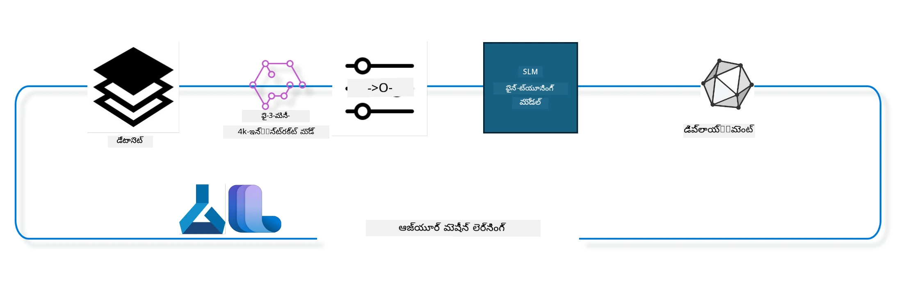

## Azure ML సిస్టమ్ రిజిస్ట్రీ నుండి chat-completion కంపోనెంట్లను ఉపయోగించి మోడల్‌ను fine-tune చేయడం ఎలా

ఈ ఉదాహరణలో, మనం ultrachat_200k dataset ఉపయోగించి 2 మందికి మధ్య సంభాషణను పూర్తి చేయడానికి Phi-3-mini-4k-instruct మోడల్‌ను fine tuning చేయబోతున్నాం.



ఈ ఉదాహరణలో, మీరు Azure ML SDK మరియు Python ఉపయోగించి fine tuning ఎలా చేయాలో మరియు ఆపై fine tuned మోడల్‌ను రియల్ టైమ్ ఇన్ఫరెన్స్ కోసం ఆన్‌లైన్ ఎండ్పాయింట్‌కు ఎలా డిప్లాయ్ చేయాలో చూపబడుతుంది.

### శిక్షణ డేటా

మేము ultrachat_200k datasetను ఉపయోగిస్తాము. ఇది UltraChat dataset నుండి గణనీయంగా ఫిల్టర్ చేయబడిన వెర్షన్ మరియు Zephyr-7B-β, ఒక ఆధునిక 7b చాట్ మోడల్‌ను శిక్షణకు ఉపయోగించబడింది.

### మోడల్

మేము Phi-3-mini-4k-instruct మోడల్‌ను చాట్-కంప్లీషన్ టాస్క్ కోసం ఎలా fine tune చేయాలో చూపించడానికి ఉపయోగిస్తాం. మీరు ఈ నోట్‌బుక్‌ను ఒక నిర్దిష్ట మోడల్ కార్డ్ నుండి తెరవగా, ఆ మోడల్ పేరు మార్చుకోవడం మర్చిపోకండి.

### పనులు

- fined tune చేయడానికి ఒక మోడల్ ఎంచుకోండి.
- శిక్షణ డేటాను ఎంచుకొని పరిశీలించండి.
- fined tuning పనిని ఆకృతీకరించండి.
- fined tuning పని నడిపించండి.
- శిక్షణ మరియు అంచనా మెట్రిక్స్‌ని సమీక్షించండి.
- fined tuned మోడల్‌ను రిజిస్టర్ చేయండి.
- రియల్ టైమ్ ఇన్ఫరెన్స్ కోసం fined tuned మోడల్‌ను డిప్లాయ్ చేయండి.
- వనరులను శుభ్రపరచండి.

## 1. ముందస్తు అవసరాలు సెటప్ చేయండి

- డిపెండెన్సీలు ఇన్‌స్టాల్ చేయండి
- AzureML వర్క్‌స్పేస్‌తో కలపండి. SDK authentication సెటప్ గురించి మరిన్ని తెలుసుకోండి. కింది <WORKSPACE_NAME>, <RESOURCE_GROUP>, మరియు <SUBSCRIPTION_ID> ను మార్చండి.
- azureml సిస్టమ్ రిజిస్ట్రీతో కలపండి
- ఐచ్ఛిక ప్రయోగం పేరును సెటప్ చేయండి
- కంప్యూట్‌ని చెక్ చేయండి లేదా క్రియేట్ చేయండి.

> [!NOTE]
> ఒక GPU núడ్‌లో అనేక GPU కార్డులు ఉండవచ్చు. ఉదాహరణకు, Standard_NC24rs_v3 núడ్‌లో 4 NVIDIA V100 GPUs ఉంటే, Standard_NC12s_v3 núడ్‌లో 2 NVIDIA V100 GPUs ఉంటాయి. ఈ సమాచారం కోసం డాక్స్‌ను చూడండి. núడ్‌కు GPU కార్డుల సంఖ్య param gpus_per_node లో సెట్ చేయబడింది. దీన్ని సరిగా సెట్ చేయడం núడ్‌లోని అన్ని GPUs వినియోగాన్ని నిర్ధారిస్తుంది. సిఫార్సు చేసిన GPU compute SKUs ఇక్కడ మరియు ఇక్కడ చూడండి.

### Python లైబ్రరీలు

క్రింది సેલ్ని రన్ చేసి డిపెండెన్సీలు ఇన్‌స్టాల్ చేయండి. ఇది కొత్త environmentలోకి రన్ చేస్తున్నప్పుడు తప్పనిసరి స్టెప్.

```bash
pip install azure-ai-ml
pip install azure-identity
pip install datasets==2.9.0
pip install mlflow
pip install azureml-mlflow
```

### Azure ML తో ఇంటరాక్ట్ చేయడం

1. ఈ Python స్క్రిప్ట్ Azure Machine Learning (Azure ML) సర్వీస్‌తో ఇంటరాక్ట్ చేయడానికి వాడబడుతుంది. ఇది ఏ పనులు చేస్తుందో వివరంగా:

    - azure.ai.ml, azure.identity, మరియు azure.ai.ml.entities ప్యాకేజీలు నుండి అవసరమైన మాడ్యూల్స్‌ను దిగుమతి (import) చేస్తుంది. time మాడ్యూల్ కూడా దిగుమతి అవుతుంది.

    - DefaultAzureCredential() ఉపయోగించి authenticate అవ్వడానికి ప్రయత్నిస్తుంది, ఇది Azure క్లౌడ్‌లో అప్లికేషన్లు త్వరగా అభివృద్ధి ప్రారంభించేందుకు సులభమైన authentication అనుభవాన్ని ఇస్తుంది. అది విఫలమైతే, InteractiveBrowserCredential() ద్వారా ఇంటరాక్టివ్ లాగిన్ ప్రాంప్ట్ అందిస్తుంది.

    - తరువాత from_config మెథడ్ ఉపయోగించి MLClient instance సృష్టిస్తుంది, ఇది డిఫాల్ట్ config ఫైల్ (config.json) నుండి కాన్ఫిగరేషన్ చదువుతుంది. అది విఫలమైతే, subscription_id, resource_group_name, మరియు workspace_name ను చేతితో అందించి MLClient instance సృష్టిస్తుంది.

    - మరో MLClient instance, ఈసారి "azureml" అనే Azure ML రిజిస్ట్రీ కోసం సృష్టిస్తుంది. ఈ రిజిస్ట్రీలో మోడల్స్, fined-tuning పైప్లైన్స్, మరియు ఎన్విరాన్మెంట్లు ఉంటాయి.

    - experiment_name ను "chat_completion_Phi-3-mini-4k-instruct" గా సెట్ చేస్తుంది.

    - ప్రస్తుత సమయాన్ని (సెకండ్లలో) యూనిక్ టైమ్‌స్టాంప్‌గా ఉత్పత్తి చేస్తుంది, ఇది అంకెలుగా మార్చి, ఆ సంఖ్యను స్ట్రింగ్‌గా మార్చుతుంది. ఈ టైమ్‌స్టాంప్‌ను యూనిక్ పేర్లు మరియు వర్షన్లు సృష్టించేందుకు ఉపయోగించవచ్చు.

    ```python
    # Azure ML మరియు Azure Identity నుండి అవసరమైన మాడ్యూల్స్‌ను దిగుమతి చేసుకోండి
    from azure.ai.ml import MLClient
    from azure.identity import (
        DefaultAzureCredential,
        InteractiveBrowserCredential,
    )
    from azure.ai.ml.entities import AmlCompute
    import time  # టైమ్ మాడ్యూల్‌ను దిగుమతి చేసుకోండి
    
    # DefaultAzureCredential ఉపయోగించి ధృవీకరణ చేయాలని ప్రయత్నించండి
    try:
        credential = DefaultAzureCredential()
        credential.get_token("https://management.azure.com/.default")
    except Exception as ex:  # DefaultAzureCredential విఫలమైతే, InteractiveBrowserCredential ఉపయోగించండి
        credential = InteractiveBrowserCredential()
    
    # డిఫాల్ట్ కాన్ఫిగరేషన్ ఫైల్ ఉపయోగించి MLClient ఇన్స్టాన్స్‌ను సృష్టించడానికి ప్రయత్నించండి
    try:
        workspace_ml_client = MLClient.from_config(credential=credential)
    except:  # అది విఫలమైతే, వివరాలను మానually ఇవ్వడం ద్వారా MLClient ఇన్స్టాన్స్‌ను సృష్టించండి
        workspace_ml_client = MLClient(
            credential,
            subscription_id="<SUBSCRIPTION_ID>",
            resource_group_name="<RESOURCE_GROUP>",
            workspace_name="<WORKSPACE_NAME>",
        )
    
    # "azureml" అనే Azure ML రిజిస్ట్రీ కోసం మరో MLClient ఇన్స్టాన్స్‌ను సృష్టించండి
    # ఈ రిజిస్ట్రీలో మోడల్స్, ఫైన్-ట్యూనింగ్ పైప్లైన్లు, మరియు ఎన్విరన్మెంట్స్ నిల్వ చేయబడతాయి
    registry_ml_client = MLClient(credential, registry_name="azureml")
    
    # ప్రయోగం పేరును సెట్ చేయండి
    experiment_name = "chat_completion_Phi-3-mini-4k-instruct"
    
    # ప్రత్యేకంగా ఉండే పేర్లు మరియు ఆవిర్భావాల కోసం ఉపయోగించే ప్రత్యేక టైమ్స్‌టాంప్‌ను సృష్టించండి
    timestamp = str(int(time.time()))
    ```

## 2. fined tune చేయడానికి ఫౌండేషన్ మోడల్ ఎంచుకోండి

1. Phi-3-mini-4k-instruct 3.8 బిలియన్ పారామీటర్స్ గల, లైట్‌వెయిట్, ఆధునిక ఓపెన్ మోడల్, Phi-2 కోసం ఉపయోగించిన డేటాసెట్స్ పైన నిర్మించబడింది. ఈ మోడల్ Phi-3 మోడల్ కుటుంబానికి చెందినది, Mini వర్షన్ రెండు వెరియంట్లలో వస్తుంది: 4K మరియు 128K, ఇది మద్దతు ఇచ్చే కాంటెక్స్ట్ పొడవు (టోకెన్లలో). మా ప్రత్యేక అవసరానికి fined tune చేయాల్సి ఉంటుంది. మీరు AzureML స్టూడియోలో Model Catalogలో ఈ మోడల్స్‌ని చాట్-కంప్లీషన్ టాస్క్ ఫిల్టర్ చేయడం ద్వారా బ్రౌజ్ చేయవచ్చు. ఈ ఉదాహరణలో మేము Phi-3-mini-4k-instruct మోడల్‌ను ఉపయోగిస్తాం. మీరు వేరే మోడల్ కోసం ఈ నోట్‌బుక్ తెరిచినట్లయితే, మోడల్ పేరు మరియు వర్షన్ మార్చండి.

> [!NOTE]
> మోడల్ id లక్షణం. ఈ లక్షణం fined tuning జాబ్‌కి ఇన్పుట్‌గా పంపబడుతుంది. ఇది AzureML స్టూడియో Model Catalogలో మోడల్ డిటెయిల్స్ పేజీలో Asset ID ఫీల్డ్‌గా కూడా ఉంటుంది.

2. ఈ Python స్క్రిప్ట్ Azure Machine Learning (Azure ML) సర్వీస్‌తో ఇంటరాక్ట్ చేస్తుంది. ఏమి చేస్తుందో ఇక్కడ వివరణ:

    - model_name ను "Phi-3-mini-4k-instruct" గా సెట్ చేస్తుంది.

    - registry_ml_client యొక్క models ప్రాపర్టీ get మెథడ్ ఉపయోగించి, Azure ML రిజిస్ట్రీ నుండి ఆ పేరుతో ఉన్న తాజా మోడల్ వర్షన్‌ను తీసుకువస్తుంది. get మెథడ్ రెండు ఆర్గ్యుమెంట్లతో పిలవబడుతుంది: మోడల్ పేరు మరియు తాజా వర్షన్ తీసుకోవాలనే లేబుల్.

    - fined tuning కోసం ఉపయోగించబోయే మోడల్ పేరు, వర్షన్, మరియు id ను కన్‌సోల్‌లో ప్రింట్ చేస్తుంది. string యొక్క format మెథడ్ ఉపయోగించి మోడల్ పేరు, వర్షన్, మరియు id ను మెసేజ్‌లో చేర్చుతుంది. ఈ విలువలు foundation_model ఆబ్జెక్ట్‌లో ప్రాపర్టీలుగా ఉంటాయి.

    ```python
    # మోడల్ పేరును సెట్ చేయండి
    model_name = "Phi-3-mini-4k-instruct"
    
    # Azure ML రిజిస్ట్రి నుండి మోడల్ తాజా వెర్షన్‌ని పొందండి
    foundation_model = registry_ml_client.models.get(model_name, label="latest")
    
    # మోడల్ పేరు, వెర్షన్, మరియు id ను ప్రింట్ చేయండి
    # ట్రాకింగ్ మరియు డీబగ్ కోసం ఈ సమాచారం ఉపయోగకరం
    print(
        "\n\nUsing model name: {0}, version: {1}, id: {2} for fine tuning".format(
            foundation_model.name, foundation_model.version, foundation_model.id
        )
    )
    ```

## 3. జాబ్‌కి ఉపయోగించాల్సిన compute క్రియేట్ చేయండి

fined tuning జాబ్ GPU compute తోనే పని చేస్తుంది. compute పరిమాణం మోడల్ పరిమాణంపై ఆధారపడి ఉంటుంది మరియు సరైన compute ఎంచుకోవడం చాలా సవాలు అవుతుంది. ఈ సెల్‌లో, వినియోగదారుని సరైన compute ఎంచుకునేందుకు మార్గనిర్దేశం చేస్తుంది.

> [!NOTE]
> క్రింది computeలు అత్యంత ఆప్టిమైజ్డ్ కాన్ఫిగరేషన్‌తో పనిచేస్తాయి. కాన్ఫిగరేషన్‌ను మార్చడం Cuda Out Of Memory పొరపాటు కలిగించవచ్చు. అలాంటి సందర్భాల్లో, compute ని పెద్ద సైజ్‌కు అప్‌గ్రేడ్ చేయడం ప్రయత్నించండి.

> [!NOTE]
> కింద compute_cluster_size ఎంచుకునేటప్పుడు, compute మీ రిసోర్స్ గ్రూప్‌లో అందుబాటులో ఉందో లేదో చెక్ చేయండి. ఒక compute అందుబాటులో లేకపోతే compute వనరులకు యాక్సెస్ కోసం అభ్యర్థన చేయవచ్చు.

### fined tuning మద్దతు కోసం మోడల్ తనిఖీ

1. ఈ Python స్క్రిప్ట్ Azure Machine Learning (Azure ML) మోడల్‌తో ఇంటరాక్ట్ చేస్తుంది. ఏమి చేస్తుందో వివరణ:

    - ast మాడ్యూల్‌ని దిగుమతి చేయించుకుంటుంది, ఇది Python abstract syntax grammar ట్రీలను ప్రాసెస్ చేసే ఫంక్షన్స్‌ని అందిస్తుంది.

    - foundation_model ఆబ్జెక్ట్ (Azure ML లో మోడల్) finetune_compute_allow_list అనే ట్యాగ్ కలిగి ఉందా చూసుకుంటుంది. Azure ML లో ట్యాగ్స్ key-value జంటలు, ఇవి మోడల్స్‌ను ఫిల్టర్ చేయడానికి ఉపయోగించబడతాయి.

    - finetune_compute_allow_list ట్యాగ్ ఉంటే, ast.literal_eval ఫంక్షన్ ఉపయోగించి దాని విలువ (స్ట్రింగ్) ను సురక్షితంగా Python లిస్ట్‌గా పarsi చేస్తుంది. ఆ లిస్ట్‌ను computes_allow_list కి అసైన్ చేస్తుంది. ఆపై compute లిస్ట్ నుండి క్రియేట్ చేయాలని సందేశం ప్రింట్ చేస్తుంది.

    - finetune_compute_allow_list ట్యాగ్ లేకపోతే, computes_allow_list ను None గా సెట్ చేసి, ట్యాగ్ మోడల్ ట్యాగ్స్‌లో নেই అని సందేశం ప్రింట్ చేస్తుంది.

    - సారాంశంగా, ఈ స్క్రిప్ట్ మోడల్ మెటాడేటాలో ఒక ప్రత్యేక ట్యాగ్ ఉందో లేదో తనిఖీ చేస్తుంది, ఉంటే దాన్ని లిస్ట్‌గా మార్చి అవసరమైన సందేశం ఇస్తుంది.

    ```python
    # Python సారాంశ సింటాక్స్ వ్యాకరణపు వృక్షాలను ప్రాసెస్ చేయడానికి ఫంక్షన్స్ కలిగిన ast మాడ్యూల్‌ను దిగుమతి చేసుకోండి
    import ast
    
    # మోడల్ ట్యాగ్‌లలో 'finetune_compute_allow_list' ట్యాగ్ ఉందో లేదో తనిఖీ చేయండి
    if "finetune_compute_allow_list" in foundation_model.tags:
        # ట్యాగ్ ఉన్నట్లయితే, ast.literal_eval ఉపయోగించి ట్యాగ్ విలువ (ఒక స్ట్రింగ్) ను సురక్షితంగా Python జాబితాగా పార్స్ చేయండి
        computes_allow_list = ast.literal_eval(
            foundation_model.tags["finetune_compute_allow_list"]
        )  # స్ట్రింగ్‌ను Python జాబితాగా మార్చండి
        # జాబితాలోనుండి కంప్యూట్ సృష్టించుకోవాలి అనే సందేశాన్ని ముద్రించండి
        print(f"Please create a compute from the above list - {computes_allow_list}")
    else:
        # ట్యాగ్ లేకపోతే, computes_allow_list ని None గా సెట్ చేయండి
        computes_allow_list = None
        # 'finetune_compute_allow_list' ట్యాగ్ మోడల్ ట్యాగ్‌లలో భాగం కాకపోవచ్చని సందేశాన్ని ముద్రించండి
        print("`finetune_compute_allow_list` is not part of model tags")
    ```

### Compute Instance తనిఖీ

1. ఈ Python స్క్రిప్ట్ Azure Machine Learning (Azure ML) సేవతో ఇంటరాక్ట్ చేసి compute instance పై అనేక తనిఖీలు చేస్తుంది. వివరణ:

    - Azure ML వర్క్‌స్పేస్ నుండి compute_cluster అనే పేరుతో compute instance తీసుకురావడానికి ప్రయత్నిస్తుంది. compute instance provisioning స్థితి "failed" అయితే, ValueError పొడిగిస్తుంది.

    - computes_allow_list None కాకపోతే, లిస్ట్‌లోని compute సైజులను lowercaseగా మార్చి ప్రస్తుత compute instance యొక్క సైజు ఆ లిస్ట్‌లో ఉందో లేదో తనిఖీ చేస్తుంది. లేకపోతే ValueError పొడిగిస్తుంది.

    - computes_allow_list None అయితే, compute instance సైజు అనుకూల GPU VM సైజుల లిస్ట్‌లో ఉందా తనిఖీ చేసి ఉంటే ValueError పోడిగిస్తుంది.

    - వర్క్‌స్పేస్‌లో అందుబాటులో ఉన్న compute sizes లిస్ట్ తీసుకుని, వాటిలో ప్రస్తుత compute instance సైజుతో సరిపోల్చి GPU ల సంఖ్యను పొందుతుంది మరియు gpu_count_found ను True గా సెట్ చేస్తుంది.

    - gpu_count_found True అయితే compute instance లో GPUs సంఖ్య ప్రింట్ చేస్తుంది. లేనప్పుడు ValueError పోడిగిస్తుంది.

    - సారాంశంగా, ఈ స్క్రిప్ట్ Azure ML వర్క్‌స్పేస్ compute instance పై provisioning స్థితి, అనుమతించబడిన లేదా బహిష్కృత లిస్ట్‌లతో సైజు తనిఖీలు మరియు GPUs సంఖ్య తనిఖీ చేస్తుంది.

    ```python
    # Exception సందేశం ముద్రించండి
    print(e)
    # వర్క్‌స్పేస్‌లో కంప్యూట్ సైజ్ అందుబాటులో లేకపోతే ValueError ను ఎగిరించండి
    raise ValueError(
        f"WARNING! Compute size {compute_cluster_size} not available in workspace"
    )
    
    # Azure ML వర్క్‌స్పేస్ నుండి కంప్యూట్ ఇన్స్టాన్స్‌ను పొందండి
    compute = workspace_ml_client.compute.get(compute_cluster)
    # కంప్యూట్ ఇన్స్టాన్స్ యొక్క ప్రోవిజనింగ్ స్థితి "failed" అని తనిఖీ చేయండి
    if compute.provisioning_state.lower() == "failed":
        # ప్రోవిజనింగ్ స్థితి "failed" అయితే ValueError ను ఎగిరించండి
        raise ValueError(
            f"Provisioning failed, Compute '{compute_cluster}' is in failed state. "
            f"please try creating a different compute"
        )
    
    # computes_allow_list None కాకపోవచ్చో లేదో తనిఖీ చేయండి
    if computes_allow_list is not None:
        # computes_allow_listలోని అన్ని కంప్యూట్ సైజులను కిందటి అక్షరాలుగా మార్చండి
        computes_allow_list_lower_case = [x.lower() for x in computes_allow_list]
        # computes_allow_list_lower_caseలో కంప్యూట్ ఇన్స్టాన్స్ యొక్క సైజ్ ఉందో లేదో తనిఖీ చేయండి
        if compute.size.lower() not in computes_allow_list_lower_case:
            # computes_allow_list_lower_caseలో కంప్యూట్ ఇన్స్టాన్స్ సైజ్ లేకపోతే ValueError ను ఎగిరించండి
            raise ValueError(
                f"VM size {compute.size} is not in the allow-listed computes for finetuning"
            )
    else:
        # మద్దతు లేని GPU VM సైజుల జాబితాను నిర్వచించండి
        unsupported_gpu_vm_list = [
            "standard_nc6",
            "standard_nc12",
            "standard_nc24",
            "standard_nc24r",
        ]
        # unsupported_gpu_vm_listలో కంప్యూట్ ఇన్స్టాన్స్ యొక్క సైజ్ ఉందో లేదో తనిఖీ చేయండి
        if compute.size.lower() in unsupported_gpu_vm_list:
            # unsupported_gpu_vm_listలో కంప్యూట్ ఇన్స్టాన్స్ యొక్క సైజ్ ఉన్నట్లయితే ValueError ను ఎగిరించండి
            raise ValueError(
                f"VM size {compute.size} is currently not supported for finetuning"
            )
    
    # కంప్యూట్ ఇన్స్టాన్స్‌లో GPU ల సంఖ్య కనిపెట్టబడిందా అనే ఫ్లాగ్ ప్రారంభించండి
    gpu_count_found = False
    # వర్క్‌స్పేస్‌లో అందుబాటులో ఉన్న అన్ని కంప్యూట్ సైజుల జాబితాను పొందండి
    workspace_compute_sku_list = workspace_ml_client.compute.list_sizes()
    available_sku_sizes = []
    # అందుబాటులో ఉన్న కంప్యూట్ సైజుల జాబితాలో విన్యాస్ చేయండి
    for compute_sku in workspace_compute_sku_list:
        available_sku_sizes.append(compute_sku.name)
        # compute size పేరు కంప్యూట్ ఇన్స్టాన్స్ సైజ్‌తో సరిపోలుతుందో లేదో తనిఖీ చేయండి
        if compute_sku.name.lower() == compute.size.lower():
            # సరిపోతే ఆ compute size కోసం GPU ల సంఖ్యను పొందించి gpu_count_found ను True గా సెట్ చేయండి
            gpus_per_node = compute_sku.gpus
            gpu_count_found = True
    # gpu_count_found True అయితే కంప్యూట్ ఇన్స్టాన్స్‌లో GPUల సంఖ్యను ముద్రించండి
    if gpu_count_found:
        print(f"Number of GPU's in compute {compute.size}: {gpus_per_node}")
    else:
        # gpu_count_found False అయితే ValueError ను ఎగిరించండి
        raise ValueError(
            f"Number of GPU's in compute {compute.size} not found. Available skus are: {available_sku_sizes}."
            f"This should not happen. Please check the selected compute cluster: {compute_cluster} and try again."
        )
    ```

## 4. fined tuning కోసం dataset ఎంచుకోండి

1. మేము ultrachat_200k datasetను ఉపయోగిస్తాము. dataset నాలుగు పార్ట్స్ కలిగి ఉంది, Supervised fined-tuning (sft) కి అనుకూలం.
Generation ranking (gen). ప్రతి స్ప్లిట్‌కు ఉదాహరణల సంఖ్య ఇలా ఉంది:

    ```bash
    train_sft test_sft  train_gen  test_gen
    207865  23110  256032  28304
    ```

1. తదుపరి కొన్ని సెల్స్ fined tuning కోసం ప్రాథమిక డేటా సిద్ధం చూపిస్తాయి:

### కొన్ని డేటా రౌస్‌ను దర్శించండి

ఈ నమూనాను వేగంగా రన్ చేయాలంటే, train_sft, test_sft ఫైళ్ళను ఇప్పటికే త్రిమ్మిన రోల్స్‌లో 5% సమాచారంతో సేవ్ చేయండి. దీని వల్ల fined tuned మోడల్ సున్నా కంటే తక్కువ ఖచ్చితత్వం ఉండవచ్చు కాబట్టి, వాస్తవ ప్రపంచ ఉపయోగానికి వాడకూడదు.
download-dataset.py ultrachat_200k datasetను డౌన్లోడ్ చేసి fined tune పైప్లైన్ కంపోనెంట్ ద్వారా వాడుకునే ఫార్మాట్‌గా మార్చడానికి ఉపయోగిస్తారు. dataset పెద్దది కావడంతో ఇక్కడ dataset యొక్క ఒక భాగం మాత్రమే ఉంది.

1. క్రింది స్క్రిప్ట్ 5% మాత్రమే డేటాను డౌన్లోడ్ చేస్తుంది. ఇది dataset_split_pc పరామితి మార్చి పెంచవచ్చు.

> [!NOTE]
> కొంత భాషా మోడల్స్ వివిధ భాషా కోడ్స్ కలిగి ఉంటాయి. అందుకే dataset‌లోని కాలమ్ పేర్లు అదే భాషా కోడ్లను సూచించాలి.

1. డేటా ఈ విధంగా ఉండాలి:
చాట్-కంప్లీషన్ dataset parquet ఫార్మాట్‌లో ఉంటుంది, ప్రతి ఎంట్రీలో ఈ స్కీమా ఉంటుంది:

    - ఇది JSON (JavaScript Object Notation) డాక్యుమెంట్, ఇది ప్రాచుర్యం పొందిన డేటా బదిలీ ఫార్మాట్. ఇది ఎగ్జెక్స్యూటబుల్ కోడ్ కాదు, కానీ డేటా నిల్వ మరియు బదిలీకి ఉపయుక్తం. దీనివివరాలు:

    - "prompt": ఇది AI అసిస్టెంట్‌కు ఇచ్చే టాస్క్ లేదా ప్రశ్న ని సూచించే స్ట్రింగ్ విలువ.

    - "messages": ఇది array ఆబ్జెక్ట్స్ కలిగిన కీ. ప్రతి ఆబ్జెక్ట్ ఒక సంభాషణలో ఒక సందేశాన్ని సూచిస్తుంది, యూజర్ మరియు AI అసిస్టెంట్ మధ్య. ప్రతీ సందేశ ఆబ్జెక్ట్‌కు రెండు కీలు:

    - "content": సందేశం యొక్క కంటెంట్ స్ట్రింగ్ విలువ.
    - "role": సందేశాన్ని పంపిన పార్థివుని పాత్ర స్ట్రింగ్ విలువ, ఇది "user" లేదా "assistant" కావచ్చు.
    - "prompt_id": ప్రతి prompt కి యూనిక్ ఐడెంటిఫైయర్.

1. ఈ ప్రత్యేక JSON డాక్యుమెంట్‌లో, ఒక సంభాషణ ఉంది, యూజర్ ఒక డిస్టోపియన్ కథ కోసం ప్రోటగోనిస్ట్ సృష్టించమని ఆదేశిస్తాడు. అసిస్టెంట్ ప్రతిస్పందిస్తుంది, యూజర్ మరిన్ని వివరాలు అడగడం జరుగుతుంది. అసిస్టెంట్ మరింత వివరాలు ఇవ్వడానికి అంగీకరిస్తుంది. మొత్తం సంభాషణ ఒక ప్రత్యేక prompt idకి సంబంధించినది.

    ```python
    {
        // The task or question posed to an AI assistant
        "prompt": "Create a fully-developed protagonist who is challenged to survive within a dystopian society under the rule of a tyrant. ...",
        
        // An array of objects, each representing a message in a conversation between a user and an AI assistant
        "messages":[
            {
                // The content of the user's message
                "content": "Create a fully-developed protagonist who is challenged to survive within a dystopian society under the rule of a tyrant. ...",
                // The role of the entity that sent the message
                "role": "user"
            },
            {
                // The content of the assistant's message
                "content": "Name: Ava\n\n Ava was just 16 years old when the world as she knew it came crashing down. The government had collapsed, leaving behind a chaotic and lawless society. ...",
                // The role of the entity that sent the message
                "role": "assistant"
            },
            {
                // The content of the user's message
                "content": "Wow, Ava's story is so intense and inspiring! Can you provide me with more details.  ...",
                // The role of the entity that sent the message
                "role": "user"
            }, 
            {
                // The content of the assistant's message
                "content": "Certainly! ....",
                // The role of the entity that sent the message
                "role": "assistant"
            }
        ],
        
        // A unique identifier for the prompt
        "prompt_id": "d938b65dfe31f05f80eb8572964c6673eddbd68eff3db6bd234d7f1e3b86c2af"
    }
    ```

### డేటా డౌన్లోడ్ చేయడం

1. ఈ Python స్క్రిప్ట్ download-dataset.py అనే సహాయక స్క్రిప్ట్ ఉపయోగించి dataset డౌన్లోడ్ చేస్తుంది. వివరణ:

    - os మాడ్యూల్ దిగుమతి చేసుకుంటుంది, ఇది ఆపరేటింగ్ సిస్టమ్ ఆధారిత ఫంక్షనాలిటీ అందిస్తుంది.

    - os.system ఫంక్షన్ ఉపయోగించి download-dataset.py స్క్రిప్ట్‌ను షెల్లో Run చేస్తుంది, ఆర్గ్యుమెంట్లతో: dataset పేరు (HuggingFaceH4/ultrachat_200k), డౌన్లోడ్ డైరెక్టరీ (ultrachat_200k_dataset), dataset విభజన శాతం (5). os.system ఆదేశం ఎగ్జిట్ స్టేటస్‌ను exit_status లో నిల్వ చేస్తుంది.

    - exit_status 0 కాకుంటే (0 అంటే సఫలం, దాని వెలుపల ఎర్రర్) Exception పొడిగించి dataset డౌన్లోడ్ లో పొరపాటు ఉందని తెలుస్తుంది.

    - సారాంశంగా, dataset డౌన్లోడ్ కోసం సహాయక స్క్రిప్ట్‌ను పిలిచి, అది విఫలమైతే ఎర్రర్ ప్రదర్శిస్తుంది.

    ```python
    # ఆపరేటింగ్ సిస్టమ్ ఆధారిత ఫంక్షనాలిటీ ఉపయోగించే మార్గాన్ని అందించే os మాడ్యూల్‌ను దిగుమతి చేసుకోండి
    import os
    
    # os.system ఫంక్షన్‌ను ఉపయోగించి download-dataset.py స్క్రిప్ట్‌ను స్పెసిఫిక్ కమాండ్-లైన్ ఆర్గ్యుమెంట్లతో షెల్‌లో నడపండి
    # ఆర్గ్యుమెంట్లు డౌన్లోడ్ చేయవలసిన డేటాసెట్ (HuggingFaceH4/ultrachat_200k), డౌన్లోడ్ చేయాల్సిన డైరెక్టరీ (ultrachat_200k_dataset), మరియు డేటాసెట్‌ను విభజించాల్సిన శాతం (5) ను పేర్కొంటాయి
    # os.system ఫంక్షన్ ఎగ్జిక్యూట్ చేసిన కమాండ్ యొక్క ఎక్సిట్ స్థితిని తిరిగి ఇస్తుంది; ఈ స్థితిని exit_status వేరియబుల్‌లో నిల్వ చేస్తుంది
    exit_status = os.system(
        "python ./download-dataset.py --dataset HuggingFaceH4/ultrachat_200k --download_dir ultrachat_200k_dataset --dataset_split_pc 5"
    )
    
    # exit_status 0 కాకపోతే తనిఖీ చేయండి
    # యూనిక్స్-ఇలాంటి ఆపరేటింగ్ సిస్టమ్‌లలో, 0 ఎగ్జిట్ స్థితి సాధారణంగా ఆదేశం విజయవంతమయినట్లు సూచిస్తుంది, మరే ఇతర సంఖ్య లోపాన్ని సూచిస్తుంది
    # exit_status 0 కాకపోతే, డేటాసెట్ డౌన్లోడ్‌లో లోపం ఉన్నట్లు సూచిస్తూ Exception ని కొట్టండి
    if exit_status != 0:
        raise Exception("Error downloading dataset")
    ```

### డేటాను DataFrame లో లోడ్ చేయడం
1. ఈ Python స్క్రిప్ట్ ఒక JSON Lines ఫైల్‌ని pandas DataFrameలో లోడ్ చేస్తోంది మరియు మొదటి 5 వరుసలను ప్రదర్శిస్తోంది. ఇది చేసే పనిని క్రింద వివరించాము:

    - ఇది pandas లైబ్రరీని ఇంపోర్ట్ చేస్తుంది, ఇది శక్తివంతమైన డేటా నిర్వహణ మరియు విశ్లేషణ లైబ్రరీ.

    - pandas ప్రదర్శన ఎంపికల కోసం గరిష్ట కాలమ్ వెడల్పును 0 గా సెట్ చేస్తుంది. దీని అందువలన DataFrame ముద్రించినప్పుడు ప్రతి కాలమ్ యొక్క పూర్తి పాఠ్యం సంక్షిప్తం కాకుండా చూపబడుతుంది.

    - ఇది pd.read_json ఫంక్షన్ ఉపయోగించి ultrachat_200k_dataset డైరెక్టరీలోని train_sft.jsonl ఫైల్‌ను DataFrameగా లోడ్ చేస్తుంది. lines=True ఆర్గ్యూమెంట్-file ఫార్మాట్ JSON Lines అని సూచిస్తుంది, అందులో ప్రతి వరుస ఒక ప్రత్యేక JSON ఆబ్జెక్ట్.

    - ఇది head పద్ధతిని ఉపయోగించి DataFrame యొక్క మొదటి 5 వరుసలను ప్రదర్శిస్తుంది. DataFrameలో 5 కంటే తక్కువ వరుసలు ఉన్నా అవన్నీ ప్రదర్శించబడతాయి.

    - సారాంశంగా, ఈ స్క్రిప్ట్ JSON Lines ఫైల్‌ను DataFrameలో లోడ్ చేసి మొదటి 5 వరుసలు పూర్తి కాలమ్ పాఠ్యంతో ప్రదర్శిస్తోంది.
    
    ```python
    # పవర్‌ఫుల్ డేటా మానిప్యులేషన్ మరియు విశ్లేషణ లైబ్రరీ అయిన pandas లైబ్రరీని ఇంపోర్ట్ చేయండి
    import pandas as pd
    
    # pandas ప్రదర్శన ఎంపికల కోసం గరిష్ట కాలమ్ వెడల్పును 0 గా సెట్ చేయండి
    # దీని అర్థం డేటాఫ్రేమ్ ముద్రించబడినప్పుడు ప్రతి కాలమ్ పూర్తి వచనం కట్ లేకుండా ప్రదర్శించబడుతుంది
    pd.set_option("display.max_colwidth", 0)
    
    # pd.read_json ఫంక్షన్‌ని ఉపయోగించి ultrachat_200k_dataset డైరెక్టరీ నుండి train_sft.jsonl ఫైల్‌ని డేటాఫ్రేమ్‌గా లోడ్ చేయండి
    # lines=True ఆర్గ్యూమెంట్ అంటే ఫైల్ JSON Lines ఫార్మాట్‌లో ఉంది, అంటే ప్రతి పంక్తి విడి JSON ఆబ్జెక్ట్
    df = pd.read_json("./ultrachat_200k_dataset/train_sft.jsonl", lines=True)
    
    # head మిథడ్‌ని ఉపయోగించి డేటాఫ్రేమ్ మొదటి 5 వరుసలను ప్రదర్శించండి
    # డేటాఫ్రేమ్‌లో 5 కంటే తక్కువ వరుసలు ఉన్నట్లయితే, అవందిని కట్టించివే ప్రదర్శిస్తుంది
    df.head()
    ```

## 5. మోడల్ మరియు డేటా ఇన్‌పుట్‌లుగా ఉపయోగించి ఫైన్ ట్యూనింగ్ ఉద్యోగాన్ని సమర్పించండి

chat-completion పైప్లైన్ భాగాన్ని ఉపయోగించే ఉద్యోగాన్ని సృష్టించండి. ఫైన్ ట్యూనింగ్‌కు మద్దతు ఇచ్చే అన్ని పరామితుల గురించి మరింత తెలుసుకోండి.

### ఫైన్ ట్యూన్ పరామితులను నిర్వచించండి

1. ఫైన్ ట్యూన్ పరామితులు 2 వర్గాలుగా గుంపు చెయ్యవచ్చు - శిక్షణ పరామితులు, ఆప్టిమైజేషన్ పరామితులు

1. శిక్షణ పరామితులు శిక్షణ అంశాలను నిర్వచిస్తాయి, ఉదాహరణకు -

    - ఉపయోగించవలసిన ఆప్టిమైజర్, షెడ్యూలర్
    - ఫైన్ ట్యూన్‌ను ఆప్టిమైజ్ చేయవలసిన మెట్రిక్
    - శిక్షణ దశల సంఖ్య, బ్యాచ్ సైజ్ మొదలైనవి
    - ఆప్టిమైజేషన్ పరామితులు GPU మెమరీని ఆప్టిమైజ్ చేసి కంప్యూట్ వనరులను సమర్థవంతంగా ఉపయోగించడంలో సహాయపడతాయి.

1. ఈ వర్గానికి చెందే కొన్ని పరామితులు క్రింద ఉన్నాయి. ఆప్టిమైజేషన్ పరామితులు ప్రతి మోడల్ కొరకు భిన్నంగా ఉంటాయి మరియు ఈ భిన్నతలను నిర్వహించేందుకు మోడల్‌తో పాటుగా ప్యాకేజ్డ్ ఉంటాయి.

    - deepspeed మరియు LoRA ని ప్రారంభించండి
    - మిక్స్డ్ ప్రిసిషన్ శిక్షణ ప్రారంభించండి
    - మల్టీ-నోడ్ శిక్షణ ప్రారంభించండి

> [!NOTE]
> సూపర్వైజ్డ్ ఫైన్ ట్యూనింగ్ సరైన సమన్వయం కోల్పోవడం లేదా అంతర్గత భరిహారం (catastrophic forgetting) లాంటి సమస్యలకు దారి తీస్తుంది. ఈ సమస్యను పరిక్షించటం మరియు ఫైన్ ట్యూనింగ్ తర్వాత సమన్వయ దశను నిర్వహించటాన్ని మేము సిఫార్సు చేస్తున్నాము.

### ఫైన్ ట్యూనింగ్ పరామితులు

1. ఈ Python స్క్రిప్ట్ మషీన్ లెర్నింగ్ మోడల్‌ను ఫైన్ ట్యూన్ చేయడానికి పరామితులను సెట్ చేస్తోంది. దీని పని క్రింద ఉంది:

    - ఇది డిఫాల్ట్ శిక్షణ పరామితులను సెట్ చేస్తుంది, అంటే శిక్షణ ఎపాక్‌ల సంఖ్య, శిక్షణ మరియు మూల్యాంకన బ్యాచ్ సైజులు, లెర్నింగ్ రేటు మరియు లెర్నింగ్ రేటు షెడ్యూలర్ టైపు.

    - ఇది డిఫాల్ట్ ఆప్టిమైజేషన్ పరామితులను సెట్ చేస్తుంది, ఉదాహరణకు Layer-wise Relevance Propagation (LoRa), DeepSpeed, మరియు DeepSpeed దశ.

    - ఈ శిక్షణ మరియు ఆప్టిమైజేషన్ పరామితులను finetune_parameters అనే ఒకే డిక్షనరీలో కలిపేస్తుంది.

    - foundation_modelకి మోడల్-స్పెసిఫిక్ డిఫాల్ట్ పరామితులు ఉన్నాయా లేదా అని తనిఖీ చేస్తుంది. ఉంటే, హెచ్చరిక సందేశాన్ని ముద్రించి, ఆ మోడల్-స్పెసిఫిక్ డిఫాల్ట్‌లతో finetune_parameters డిక్షనరీని నవీకరిస్తుంది. ast.literal_eval ఫంక్షన్ మోడల్-స్పెసిఫిక్ డిఫాల్ట్‌లను స్ట్రింగ్ నుండి పైన Python డిక్షనరీగా మార్చడానికి ఉపయోగిస్తారు.

    - రన్ కోసం ఉపయోగించబడబోయే తుది ఫైన్ ట్యూన్ పరామితులను ముద్రిస్తుంది.

    - సారాంశంగా, ఈ స్క్రిప్ట్ మషీన్ లెర్నింగ్ మోడల్ ఫైన్ ట్యూనింగ్‌కు పరామితులను సెట్ చేసి ప్రదర్శిస్తోంది, మరియు డిఫాల్ట్ పరామితులను మోడల్-స్పెసిఫిక్ పరామితులతో మార్చే సామర్థ్యం కలిగి ఉంది.

    ```python
    # శిక్షణ_epochs సంఖ్య, శిక్షణ మరియు మూల్యాంకనానికి బ్యాచ్_sizes, నేర్చుకునే రేటు, మరియు నేర్చుకునే రేటు షెడ్యూలర్ రకం వంటి డిఫాల్ట్ శిక్షణ పారామితులను సెట్ చేయండి
    training_parameters = dict(
        num_train_epochs=3,
        per_device_train_batch_size=1,
        per_device_eval_batch_size=1,
        learning_rate=5e-6,
        lr_scheduler_type="cosine",
    )
    
    # లేయర్-వైస్ రిలెవెన్స్ ప్రొపగేషన్ (LoRa) మరియు డీప్‌స్పీడ్ ను అన్వయించాలా మరియు డీప్‌స్పీడ్ దశ వంటి డిఫాల్ట్ ఆప్టిమైజేషన్ పారామితులను సెట్ చేయండి
    optimization_parameters = dict(
        apply_lora="true",
        apply_deepspeed="true",
        deepspeed_stage=2,
    )
    
    # శిక్షణ మరియు ఆప్టిమైజేషన్ పారామితులను finetune_parameters అనే ఒకే డిక్షనరీలో కలపండి
    finetune_parameters = {**training_parameters, **optimization_parameters}
    
    # ఫౌండేషన్ మోడల్ కు ఏవైనా మోడల్-స్పెసిఫిక్ డిఫాల్ట్ పారామితులు ఉన్నాయా అని తనిఖీ చేయండి
    # ఉంటే, హెచ్చరిక సందేశాన్ని ముద్రించి, ఆ మోడల్-స్పెసిఫిక్ డిఫాల్ట్స్ తో finetune_parameters డిక్షనరీను నవీకరించండి
    # ast.literal_eval ఫంక్షన్ మోడల్-స్పెసిఫిక్ డిఫాల్ట్స్ ని స్ట్రింగ్ నుండి పైథాన్ డిక్షనరీ‌గా మార్చడానికి ఉపయోగిస్తారు
    if "model_specific_defaults" in foundation_model.tags:
        print("Warning! Model specific defaults exist. The defaults could be overridden.")
        finetune_parameters.update(
            ast.literal_eval(  # స్ట్రింగ్ ను పైథాన్ డిక్షనరీగా మార్చండి
                foundation_model.tags["model_specific_defaults"]
            )
        )
    
    # రన్ కొరకు ఉపయోగించబోయే తుది ఫైన్-ట్యూనింగ్ పారామితుల సముదాయాన్ని ముద్రించండి
    print(
        f"The following finetune parameters are going to be set for the run: {finetune_parameters}"
    )
    ```

### శిక్షణ పైప్లైన్

1. ఈ Python స్క్రిప్ట్ ఒక మషీన్ లెర్నింగ్ శిక్షణ పైప్లైన్‌కి ప్రదర్శన పేరును ఉత్పత్తి చేసే ఫంక్షన్ నిర్వచిస్తూ, ఆ ఫంక్షన్‌ను పిలుస్తూ, ఆ ప్రదర్శన పేరును ముద్రిస్తోంది. ఇదిగో దీని పని వివరాలు:

1. get_pipeline_display_name అనే ఫంక్షన్ నిర్వచించబడింది. ఈ ఫంక్షన్ శిక్షణ పైప్లైన్‌కు సంబంధించి వివిధ పరామితుల ఆధారంగా ప్రదర్శన పేరును ఉత్పత్తి చేస్తుంది.

1. ఫంక్షన్ లోపల, మొత్తం బ్యాచ్ సైజును పరికరం ఒక్కో బ్యాచ్ సైజ్, గ్రేడియంట్ సమాహరణ దశల సంఖ్య, నోడ్ ఒక్కొక్కటికి GPUల సంఖ్య, మరియు ఫైన్ ట్యూనింగ్ కోసం ఉపయోగించే నోడ్‌ల సంఖ్యను గుణించి లెక్కిస్తుంది.

1. learning rate scheduler type, DeepSpeed వాడుతున్నారా, DeepSpeed దశ, LoRa ఎందుతున్నారా, మోడల్ చెక్‌పాయింట్ల పరిమితి, గరిష్ట సీక్వెన్స్ పొడవు వంటి ఇతర పరామితులను పొందుతుంది.

1. ఈ పరామితులన్నింటిని హైఫెన్‌లతో విడదీసిన స్ట్రింగ్‌గా తయారుచేస్తుంది. DeepSpeed లేదా LoRa ఉపయోగిస్తే, స్ట్రింగ్‌లో "ds" తరువాత DeepSpeed దశ, లేదా "lora" ఉంటాయి. వద్దా అయితే "nods" లేదా "nolora" వుంటాయి.

1. ఈ స్ట్రింగ్ ఈ ఫంక్షన్ ద్వారా తిరిగి ఇవ్వబడుతుంది, ఇది శిక్షణ పైప్లైన్‌కు ప్రదర్శన పేరుగా పనిచేస్తుంది.

1. ఫంక్షన్ నిర్వచించిన తర్వాత, దాన్ని పిలిచి ప్రదర్శన పేరు ఉత్పత్తి చేసి ముద్రిస్తుంది.

1. సారాంశంగా, ఈ స్క్రిప్ట్ వివిధ పరామితుల ఆధారంగా మషీన్ లెర్నింగ్ శిక్షణ పైప్లైన్‌కు ప్రదర్శన పేరును ఉత్పత్తి చేసి, ఆ ప్రదర్శన పేరును ముద్రిస్తోంది.

    ```python
    # శిక్షణ పైప్‌లైన్ కోసం ప్రదర్శన పేరును సృష్టించడానికి ఒక ఫంక్షన్ నిర్వచించండి
    def get_pipeline_display_name():
        # పర్-డివైస్ బ్యాచ్ సైజ్, గ్రేడియంట్ అక్మ్యూలేషన్ స్టెప్స్ సంఖ్య, ప్రతి నోడ్‌కు GPUల సంఖ్య మరియు ఫైన్-ట్యూనింగ్ కోసం వాడిన నోడ్ల సంఖ్యను గుణించి మొత్తం బ్యాచ్ సైజ్‌ను లెక్కించండి
        batch_size = (
            int(finetune_parameters.get("per_device_train_batch_size", 1))
            * int(finetune_parameters.get("gradient_accumulation_steps", 1))
            * int(gpus_per_node)
            * int(finetune_parameters.get("num_nodes_finetune", 1))
        )
        # లెర్నింగ్ రేట్ షెడ్యూలర్ రకాన్ని పొందండి
        scheduler = finetune_parameters.get("lr_scheduler_type", "linear")
        # డీప్‌స్పీడ్ వర్తింపబడిందా చెక్ చేసుకోండి
        deepspeed = finetune_parameters.get("apply_deepspeed", "false")
        # డీప్‌స్పీడ్ దశను పొందండి
        ds_stage = finetune_parameters.get("deepspeed_stage", "2")
        # డీప్‌స్పీడ్ వర్తింపబడితే, ప్రదర్శన పేరులో "ds" మరియు డీప్‌స్పీడ్ దశని చేర్చండి; లేకపోతే "nods" ను చేర్చండి
        if deepspeed == "true":
            ds_string = f"ds{ds_stage}"
        else:
            ds_string = "nods"
        # లేయర్-వైజ్ రిలెవెన్స్ ప్రొపగేషన్ (LoRa) వర్తింపబడిందా చెక్ చేసుకోండి
        lora = finetune_parameters.get("apply_lora", "false")
        # LoRa వర్తింపబడితే, ప్రదర్శన పేరులో "lora"ని చేర్చండి; లేకపోతే "nolora"ను చేర్చండి
        if lora == "true":
            lora_string = "lora"
        else:
            lora_string = "nolora"
        # ఉంచవలసిన మోడల్ చెక్పాయింట్ల గరిష్ట సంఖ్యను పొందండి
        save_limit = finetune_parameters.get("save_total_limit", -1)
        # గరిష్ట సీక్వెన్స్ పొడవును పొందండి
        seq_len = finetune_parameters.get("max_seq_length", -1)
        # ఈ అన్ని పారామితులను హైఫెన్లతో విభజించి కలిపి ప్రదర్శన పేరు నిర్మించండి
        return (
            model_name
            + "-"
            + "ultrachat"
            + "-"
            + f"bs{batch_size}"
            + "-"
            + f"{scheduler}"
            + "-"
            + ds_string
            + "-"
            + lora_string
            + f"-save_limit{save_limit}"
            + f"-seqlen{seq_len}"
        )
    
    # ప్రదర్శన పేరు సృష్టించడానికి ఫంక్షన్‌ను పిలవండి
    pipeline_display_name = get_pipeline_display_name()
    # ప్రదర్శన పేరును ముద్రించండి
    print(f"Display name used for the run: {pipeline_display_name}")
    ```

### పైప్లైన్ కాన్ఫిగర్ చేయడం

ఈ Python స్క్రిప్ట్ Azure Machine Learning SDK ఉపయోగించి మషీన్ లెర్నింగ్ పైప్లైన్‌ను నిర్వచించి కన్ఫిగర్ చేస్తోంది. దీని పని వివరాలు:

1. Azure AI ML SDK నుండి అవసరమైన మాడ్యూల్స్‌ను ఇంపోర్ట్ చేస్తుంది.

1. రిజిస్ట్‌రీ నుండి "chat_completion_pipeline" అనే పైప్లైన్ భాగాన్ని పొందుతుంది.

1. `@pipeline` డెకొరేటర్‌తో మరియు `create_pipeline` ఫంక్షన్‌తో పైప్లైన్ ఉద్యోగాన్ని నిర్వచిస్తుంది. పైప్లైన్ పేరు `pipeline_display_name` గా సెట్ చేయబడింది.

1. `create_pipeline` ఫంక్షన్‌లో, పొందిన పైప్లైన్ భాగాన్ని వివిధ పరామితులతో ప్రారంభిస్తుంది, అందులో మోడల్ పాథ్, వివిధ దశల కోసం కంప్యూట్ క్లస్టర్లు, శిక్షణ మరియు పరీక్ష కోసం డేటాసెట్ విడివిడిగా, ఫైన్ ట్యూనింగ్ కోసం GPUల సంఖ్య మరియు ఇతర ఫైన్ ట్యూనింగ్ పరామితులు ఉన్నాయి.

1. ఫైన్ ట్యూనింగ్ ఉద్యోగం అవుట్‌పుట్‌ను పైప్లైన్ ఉద్యోగం అవుట్‌పుట్‌గా మ్యాప్ చేస్తుంది. దీని ద్వారా ఫైన్ ట్యూన్డ్ మోడల్ సులభంగా రిజిస్టర్ చేయొచ్చు, ఇది ఆన్‌లైన్ లేదా బ్యాచ్ ఎండ్‌పాయింట్‌కు మోడల్‌ను డిప్లాయ్ చేయడానికి అవసరం.

1. `create_pipeline` ఫంక్షన్‌ను పిలవడం ద్వారా పైప్లైన్ యొక్క ఉదాహరణను సృష్టిస్తుంది.

1. పైప్లైన్ యొక్క `force_rerun` సెట్టింగ్‌ను `True` గా సెట్ చేస్తుంది, అంటే గత ఉద్యోగాల క్యాష్ చేసిన ఫలితాలు ఉపయోగించబడవు.

1. పైప్లైన్ యొక్క `continue_on_step_failure` సెట్టింగ్‌ను `False` గా సెట్ చేస్తుంది, అంటే ఏదైనా దశ విఫలమైతే పైప్లైన్ ఆపేస్తుంది.

1. సారాంశంగా, ఈ స్క్రిప్ట్ Azure Machine Learning SDK ఉపయోగించి చాట్ కంప్లీషన్ టాస్క్ కోసం మషీన్ లెర్నింగ్ పైప్లైన్‌ని నిర్వచించి కన్ఫిగర్ చేస్తోంది.

    ```python
    # Azure AI ML SDK నుండి అవసరమైన మాడ్యూల్స్‌ను దిగుమతి చేసుకోండి
    from azure.ai.ml.dsl import pipeline
    from azure.ai.ml import Input
    
    # రిజిస్ట్రరీ నుండి "chat_completion_pipeline" అనే పైప్‌లైన్ కంపోనెంట్‌ను పొందండి
    pipeline_component_func = registry_ml_client.components.get(
        name="chat_completion_pipeline", label="latest"
    )
    
    # @pipeline డెకొరేటర్ మరియు create_pipeline ఫంక్షన్ ఉపయోగించి పైప్‌లైన్ జాబ్‌ను నిర్వచించండి
    # పైప్‌లైన్ పేరు pipeline_display_name గా సెట్ చేయబడింది
    @pipeline(name=pipeline_display_name)
    def create_pipeline():
        # వివిధ ప్యారామీటర్లతో పొందిన పైప్‌లైన్ కంపోనెంట్ను ప్రారంభించండి
        # వీటిలో మోడల్ పాత్, వివిధ దశల కోసం కంప్యూట్ క్లస్టర్లు, శిక్షణ మరియు పరీక్ష కోసం డేటాసెట్ భాగాలు, ఫైన్-ట్యూనింగ్ కోసం ఉపయోగించే GPUల సంఖ్య మరియు ఇతర ఫైన్-ట్యూనింగ్ పరామితులు ఉన్నాయి
        chat_completion_pipeline = pipeline_component_func(
            mlflow_model_path=foundation_model.id,
            compute_model_import=compute_cluster,
            compute_preprocess=compute_cluster,
            compute_finetune=compute_cluster,
            compute_model_evaluation=compute_cluster,
            # డేటాసెట్ భాగాలను ప్యారామీటర్లకు మ్యాప్ చేయండి
            train_file_path=Input(
                type="uri_file", path="./ultrachat_200k_dataset/train_sft.jsonl"
            ),
            test_file_path=Input(
                type="uri_file", path="./ultrachat_200k_dataset/test_sft.jsonl"
            ),
            # శిక్షణ సెట్ింగ్స్
            number_of_gpu_to_use_finetuning=gpus_per_node,  # కంప్యూట్‌లో అందుబాటులో ఉన్న GPUల సంఖ్యగా సెట్ చేయండి
            **finetune_parameters
        )
        return {
            # ఫైన్ ట్యూనింగ్ జాబ్ అవుట్‌పుట్‌ను పైప్‌లైన్ జాబ్ అవుట్‌పుట్‌కు మ్యాప్ చేయండి
            # తద్వారా ఫైన్ ట్యూన్ చేసిన మోడల్‌ను సులభంగా రిజిస్టర్ చేయవచ్చు
            # మోడల్‌ను ఆన్‌లైన్ లేదా బ్యాచ్ ఎండ్‌పాయింట్‌కు మినహాయించడానికి రిజిస్టర్ చేయడం అవసరం
            "trained_model": chat_completion_pipeline.outputs.mlflow_model_folder
        }
    
    # create_pipeline ఫంక్షన్‌ను పిలిచి పైప్‌లైన్实例ని సృష్టించండి
    pipeline_object = create_pipeline()
    
    # గత జాబ్‌ల నుండి క్యాష్ అయిన ఫలితాలను ఉపయోగించవద్దు
    pipeline_object.settings.force_rerun = True
    
    # స్టెప్ విఫలమైతే కొనసాగింపు సెట్‌ను Falseగా పెట్టండి
    # అంటే ఏదైనా స్టెప్ విఫలమైతే పైప్‌లైన్ ఆగిపోతుంది
    pipeline_object.settings.continue_on_step_failure = False
    ```

### ఉద్యోగం సమర్పించటం

1. ఈ Python స్క్రిప్ట్ Azure Machine Learning వర్క్‌స్పేస్‌కు మషీన్ లెర్నింగ్ పైప్లైన్ ఉద్యోగాన్ని సమర్పించి, ఆ తర్వాత ఉద్యోగం పూర్తయ్యేవరకు వేచి ఉంది. దీని పని వివరాలు:

    - ఇది workspace_ml_clientలోని jobs ఆబ్జెక్ట్ యొక్క create_or_update పద్ధతి పిలిసి పైప్లైన్ ఉద్యోగాన్ని సమర్పిస్తుంది. పిలవబడే పైప్లైన్ ఫంక్షన్ pipeline_object ద్వారా సూచింపబడింది మరియు ఉద్యోగం ఎక్స్‌పెరీమెంట్ పేరు experiment_name ద్వారా ట్యాగ్ చేయబడింది.

    - ఆ తర్వాత ఇది jobs ఆబ్జెక్ట్ యొక్క stream పద్ధతి పిలిసి pipeline_job ఆబ్జెక్ట్ పేరు ఉపయోగించి పైప్లైన్ ఉద్యోగం పూర్తయ్యే వరకు వేడుకుంది.

    - సారాంశంగా, ఈ స్క్రిప్ట్ Azure Machine Learning వర్క్‌స్పేస్‌కు మషీన్ లెర్నింగ్ పైప్లైన్ ఉద్యోగాన్ని సమర్పించి, ఆ తర్వాత సినిమాను పూర్తయ్యేవరకు వేచిచూస్తుంది.

    ```python
    # Azure మెషీన్ లెర్నింగ్ వర్క్‌స్పేస్‌కు పైప్లైన్ ఉద్యోగాన్ని సమర్పించండి
    # నడపాల్సిన పైప్లైన్ pipeline_object ద్వారా సూచించబడింది
    # ఉద్యోగం నడిపే ప్రయోగం experiment_name ద్వారా సూచించబడింది
    pipeline_job = workspace_ml_client.jobs.create_or_update(
        pipeline_object, experiment_name=experiment_name
    )
    
    # పైప్లైన్ ఉద్యోగం పూర్తయ్యేవరకు వేచి ఉండండి
    # వేచివుండాల్సిన ఉద్యోగం pipeline_job ఆబ్జెక్ట్ యొక్క name లక్షణం ద్వారా సూచించబడింది
    workspace_ml_client.jobs.stream(pipeline_job.name)
    ```

## 6. ఫైన్ ట్యూన్ చేసిన మోడల్‌ను వర్క్‌స్పేస్‌లో రిజిస్టర్ చేయండి

మేము ఫైన్ ట్యూనింగ్ ఉద్యోగం అవుట్‌పుట్ నుండి మోడల్‌ను రిజిస్టర్ చేస్తాము. ఇది ఫైన్ ట్యూన్ చేసిన మోడల్ మరియు ఫైన్ ట్యూనింగ్ ఉద్యోగం మధ్య లినియేజ్‌ను ట్రాక్ చేస్తుంది. ఫైన్ ట్యూనింగ్ ఉద్యోగం, అదనంగా, ఫౌండేషన్ మోడల్, డేటా మరియు శిక్షణ కోడ్‌కు లినియేజ్‌ను ట్రాక్ చేస్తుంది.

### ML మోడల్ రిజిస్ట్రేషన్

1. ఈ Python స్క్రిప్ట్ Azure Machine Learning పైప్లైన్‌లో శిక్షణ పొందిన మషీన్ లెర్నింగ్ మోడల్‌ను రిజిస్టర్ చేస్తోంది. దీని పని క్రింద ఉంది:

    - Azure AI ML SDK నుండి అవసరమైన మాడ్యూల్స్‌ను ఇంపోర్ట్ చేస్తుంది.

    - pipeline_job నుంచి trained_model అవుట్‌పుట్ అందుబాటులో ఉందా అని workspace_ml_clientలో jobs ఆబ్జెక్ట్ get పద్ధతి ద్వారా తనిఖీ చేస్తుంది మరియు దాని outputs గుణాలను యాక్సెస్ చేస్తుంది.

    - pipeline Job పేరు మరియు అవుట్‌పుట్ పేరు ("trained_model") తో ఫార్మాట్ చేసిన స్ట్రింగ్‌ని ఉపయోగించి శిక్షణ పొందిన మోడల్‌కు ఒక పాథ్ రూపొందిస్తుంది.

    - ఫైన్ ట్యూన్ చేసిన మోడల్‌కు పేరు నిర్వచిస్తుంది, મૂળ మోడల్ పేరుకు "-ultrachat-200k" జత చేసి, ఏమైనా స్లాష్‌లను హెఫన్లతో మారుస్తుంది.

    - Model ఆబ్జెక్టును సృష్టించి, మోడల్ పాథ్, మోడల్ రకం (MLflow మోడల్), పేరు, వెర్షన్, మరియు వివరణతో మోడల్‌ను రిజిస్టర్ చేయడానికి సిద్ధంగా ఉంటుంది.

    - workspace_ml_clientలో models ఆబ్జెక్ట్ create_or_update పద్ధతి పిలిచి Model ఆబ్జెక్ట్‌ని ఆర్గ్యుమెంట్‌గా పంపించి మోడల్ రిజిస్టర్ చేస్తుంది.

    - రిజిస్టర్ చేసిన మోడల్‌ను ప్రింట్ చేస్తుంది.

1. సారాంశంగా, ఈ స్క్రిప్ట్ Azure Machine Learning పైప్లైన్‌లో శిక్షణ పొందిన మషీన్ లెర్నింగ్ మోడల్‌ను రిజిస్టర్ చేస్తోంది.
    
    ```python
    # Azure AI ML SDK నుండి అవసరమైన మాడ్యూల్స్‌ను దిగుమతి చేయండి
    from azure.ai.ml.entities import Model
    from azure.ai.ml.constants import AssetTypes
    
    # pipeline job నుండి `trained_model` అవుట్పుట్ అందుబాటులో ఉందా అని తనిఖీ చేయండి
    print("pipeline job outputs: ", workspace_ml_client.jobs.get(pipeline_job.name).outputs)
    
    # pipeline job పేరు మరియు అవుట్పుట్ పేరు ("trained_model") తో స్ట్రింగ్‌ను ఫార్మాట్ చేసి శిక్షణ పొందిన మోడల్‌కు మార్గాన్ని నిర్మించండి
    model_path_from_job = "azureml://jobs/{0}/outputs/{1}".format(
        pipeline_job.name, "trained_model"
    )
    
    # అసలు మోడల్ పేరుకు "-ultrachat-200k" జోడించి, ఎక్కడైనా "/" ఉంటే వాటిని హైఫెన్లతో మార్చి ఫైన్-ట్యూన్ చేసిన మోడల్‌కు పేరు నిర్వచించండి
    finetuned_model_name = model_name + "-ultrachat-200k"
    finetuned_model_name = finetuned_model_name.replace("/", "-")
    
    print("path to register model: ", model_path_from_job)
    
    # వివిధ ప్యారామీటర్లతో Model ఆబ్జెక్ట్ సృష్టించడం ద్వారా మోడల్ రిజిస్టర్ చేయడానికి సిద్ధమైనంతగా తయారు చేయండి
    # వీటిలో మోడల్ మార్గం, మోడల్ రకం (MLflow మోడల్), మోడల్ పేరు మరియు వెర్షన్, మరియు మోడల్ వివరణ ఉంటాయి
    prepare_to_register_model = Model(
        path=model_path_from_job,
        type=AssetTypes.MLFLOW_MODEL,
        name=finetuned_model_name,
        version=timestamp,  # వెర్షన్ వ్యత్యాసం నివారించడానికి టైము‍స్టాంప్‌ను వెర్షన్‌గా ఉపయోగించండి
        description=model_name + " fine tuned model for ultrachat 200k chat-completion",
    )
    
    print("prepare to register model: \n", prepare_to_register_model)
    
    # Model ఆబ్జెక్టును ఆర్గ్యుమెంట్‌గా తీసుకుని workspace_ml_client లోని models objekct యొక్క create_or_update పద్ధతిని పిలవడం ద్వారా మోడల్‌ను రిజిస్టర్ చేయండి
    registered_model = workspace_ml_client.models.create_or_update(
        prepare_to_register_model
    )
    
    # రిజిస్టర్ అయిన మోడల్‌ను ప్రింట్ చేయండి
    print("registered model: \n", registered_model)
    ```

## 7. ఫైన్ ట్యూన్డ్ మోడల్‌ను ఆన్‌లైన్ ఎండ్‌పాయింట్‌కు డిప్లాయ్ చేయండి

ఆన్‌లైన్ ఎండ్‌పాయింట్లు ఒక దీర్ఘకాల REST APIని అందిస్తాయి, దీనిని మోడల్ ఉపయోగించాల్సిన అప్లికేషన్లు ఇంటిగ్రేట్ చేసుకోవచ్చు.

### ఎండ్‌పాయింట్ నిర్వహణ

1. ఈ Python స్క్రిప్ట్ Azure Machine Learningలో రిజిస్టర్ చేసిన మోడల్ కోసం ఒక నిర్వహిత ఆన్‌లైన్ ఎండ్‌పాయింట్ సృష్టిస్తోంది. దీని పని వివరాలు:

    - Azure AI ML SDK నుండి అవసరమైన మాడ్యూల్స్‌ను ఇంపోర్ట్ చేస్తుంది.

    - "ultrachat-completion-" కు టైమ్‌స్టాంప్ జత చేసి ఆన్‌లైన్ ఎండ్‌పాయింట్ కు ఒక ప్రత్యేక పేరు నిర్వచిస్తుంది.

    - ManagedOnlineEndpoint ఆబ్జెక్ట్ సృష్టించడం ద్వారా ఆన్‌లైన్ ఎండ్‌పాయింట్ సృష్టించడానికి సిద్దం అవుతోంది, ఇందులో ఎండ్‌పాయింట్ పేరు, వివరణ, మరియు ప్రామాణికరణ మోడ్ ("key") ఉన్నాయి.

    - workspace_ml_clientలో begin_create_or_update పద్ధతిని పిలిచి ManagedOnlineEndpoint ఆబ్జెక్ట్‌ను పంపించి ఆన్‌లైన్ ఎండ్‌పాయింట్ సృష్టిస్తుంది. ఆపరేషన్ పూర్తయ్యేవరకు wait పద్ధతిని పిలుస్తూ ఎదురుచూస్తుంది.

1. సారాంశంగా, ఈ స్క్రిప్ట్ Azure Machine Learningలో రిజిస్టర్ అయిన మోడల్ కోసం నిర్వహిత ఆన్‌లైన్ ఎండ్‌పాయింట్‌ను సృష్టిస్తోంది.

    ```python
    # Azure AI ML SDK నుండి అవసరమైన మాడ్యూల్స్‌ను దిగుమతి చేసుకోండి
    from azure.ai.ml.entities import (
        ManagedOnlineEndpoint,
        ManagedOnlineDeployment,
        ProbeSettings,
        OnlineRequestSettings,
    )
    
    # "ultrachat-completion-" స్ట్రింగ్‌కు టైమ్స్టాంప్ జోడించి ఆన్‌లైన్ ఎండ్పాయింట్‌కు ప్రత్యేకమైన పేరు నిర్వచించండి
    online_endpoint_name = "ultrachat-completion-" + timestamp
    
    # విభిన్న పారామీటర్లతో ManagedOnlineEndpoint ఆబ్జెక్ట్‌ను సృష్టించడం ద్వారా ఆన్‌లైన్ ఎండ్పాయింట్ సృష్టించడానికి సిద్ధం అవ్వండి
    # ఇందులో ఎండ్పాయింట్ పేరు, ఎండ్పాయింట్ వివరణ, మరియు నిర్ధారణ మోడ్ ("key") ఉంటాయి
    endpoint = ManagedOnlineEndpoint(
        name=online_endpoint_name,
        description="Online endpoint for "
        + registered_model.name
        + ", fine tuned model for ultrachat-200k-chat-completion",
        auth_mode="key",
    )
    
    # ManagedOnlineEndpoint ఆబ్జెక్టును ఆర్గ్యుమెంట్‌గా workspace_ml_client యొక్క begin_create_or_update పద్ధతిని పిలిచి ఆన్‌లైన్ ఎండ్పాయింట్‌ను సృష్టించండి
    # ఆపై wait పద్ధతిని పిలిచి సృష్టింపు ప్రక్రియ పూర్తి కావడానికి వేచి ఉందండి
    workspace_ml_client.begin_create_or_update(endpoint).wait()
    ```

> [!NOTE]
> మీరు ఇక్కడ డిప్లాయ్‌మెంట్‌కు మద్దతు ఇచ్చే SKU ల జాబితాను చూడవచ్చు - [Managed online endpoints SKU list](https://learn.microsoft.com/azure/machine-learning/reference-managed-online-endpoints-vm-sku-list)

### ML మోడల్ డిప్లాయ్ చేయడం

1. ఈ Python స్క్రిప్ట్ Azure Machine Learningలో నిర్వహిత ఆన్‌లైన్ ఎండ్‌పాయింట్‌కు రిజిస్టర్ చేసిన మషీన్ లెర్నింగ్ మోడల్‌ను డిప్లాయ్ చేస్తోంది. దీని పని వివరాలు:

    - Python abstract syntax grammar చెయ్యి ప్రాసెస్ చేయడానికి ast మాడ్యూల్‌ను ఇంపోర్ట్ చేస్తుంది.

    - డిప్లాయ్‌మెంట్ ఈన్స్టాన్స్ టైపును "Standard_NC6s_v3" గా సెట్ చేస్తుంది.

    - foundation modelలో inference_compute_allow_list ట్యాగ్ ఉందా అని తనిఖీ చేస్తుంది. ఉంటే, ఆ ట్యాగ్ విలువను స్ట్రింగ్ నుండి Python లిస్ట్‌గా మారుస్తుంది మరియు inference_computes_allow_listకి అప్పగిస్తుంది. లేకపోతే, ఇది None గా సెట్ చేస్తుంది.

    - ఇవ్వబడిన instance type ఆ లిస్ట్‌లో ఉందా లేదా అని తనిఖీ చేస్తుంది. లేకపోతే, వాడుకరిని అనుమతించే లిస్ట్ నుండి instance type ఎంచుకోవాలని నోటీసు ఇస్తుంది.

    - ManagedOnlineDeployment ఆబ్జెక్ట్ సృష్టించి డిప్లాయ్‌మెంట్‌ కోసం సిద్ధం అవుతోంది, ఇందులో డిప్లాయ్‌మెంట్ పేరు, ఎండ్‌పాయింట్ పేరు, మోడల్ ID, instance type మరియు కౌంట్, లైవ్‌నెస్ ప్రోబ్ సెట్టింగ్స్, రిక్వెస్ట్ సెట్టింగ్స్ ఉన్నాయి.

    - workspace_ml_clientలో begin_create_or_update పద్ధతి పిలిచి ManagedOnlineDeployment ఆబ్జెక్ట్‌ను పంపించి డిప్లాయ్‌మెంట్ సృష్టిస్తుంది. ఆపరేషన్ పూర్తయ్యేవరకు wait పద్ధతిని పిలుస్తూ ఎదురుచూస్తుంది.

    - ఎండ్‌పాయింట్ ట్రాఫిక్‌ను "demo" డిప్లాయ్‌మెంట్‌కు 100% దారి చేస్తుంది.

    - ఎండ్‌పాయింట్‌ను నవీకరించడానికి begin_create_or_update పద్ధతి పిలిచి మార్పులను అప్డేట్ చేసి ఆపరేషన్ ఫలితాన్ని పొందుతుంది.

1. సారాంశంగా, ఈ స్క్రిప్ట్ Azure Machine Learningలో నిర్వహిత ఆన్‌లైన్ ఎండ్‌పాయింట్‌కు రిజిస్టర్ చేసిన మాషీన్ లెర్నింగ్ మోడల్‌ను డిప్లాయ్ చేస్తోంది.

    ```python
    # Python సంక్షిప్త వాక్యవ్యాకరణ వృక్షాలను ప్రాసెస్ చేయడానికి ఫంక్షన్లు అందించే ast మాడ్యూల్ ని దిగుమతి చేయండి
    import ast
    
    # డిప్లాయ్‌మెంట్ కోసం ఇన్స్టాన్స్ రకం సెట్ చేయండి
    instance_type = "Standard_NC6s_v3"
    
    # ఫౌండేషన్ మోడల్‌లో `inference_compute_allow_list` ట్యాగ్ ఉన్నదా అని తనిఖీ చేయండి
    if "inference_compute_allow_list" in foundation_model.tags:
        # ఉన్నట్లయితే, ట్యాగ్ విలువను స్ట్రింగ్ నుండి Python లిస్ట్‌గా మార్చి `inference_computes_allow_list` కు కేటాయించండి
        inference_computes_allow_list = ast.literal_eval(
            foundation_model.tags["inference_compute_allow_list"]
        )
        print(f"Please create a compute from the above list - {computes_allow_list}")
    else:
        # లేనివైతే, `inference_computes_allow_list` ను `None` గా సెట్ చేయండి
        inference_computes_allow_list = None
        print("`inference_compute_allow_list` is not part of model tags")
    
    # నిర్దిష్టమైన ఇన్స్టాన్స్ రకం అనుమతిపత్రంలో ఉందా అని తనిఖీ చేయండి
    if (
        inference_computes_allow_list is not None
        and instance_type not in inference_computes_allow_list
    ):
        print(
            f"`instance_type` is not in the allow listed compute. Please select a value from {inference_computes_allow_list}"
        )
    
    # వివిధ పారామితులతో `ManagedOnlineDeployment` ఆబ్జెక్ట్ సృష్టించి డిప్లాయ్‌మెంట్ సృష్టించడానికి సిద్ధపడండి
    demo_deployment = ManagedOnlineDeployment(
        name="demo",
        endpoint_name=online_endpoint_name,
        model=registered_model.id,
        instance_type=instance_type,
        instance_count=1,
        liveness_probe=ProbeSettings(initial_delay=600),
        request_settings=OnlineRequestSettings(request_timeout_ms=90000),
    )
    
    # `ManagedOnlineDeployment` ఆబ్జెక్టుతో `workspace_ml_client` యొక్క `begin_create_or_update` మెథడ్‌ను పిలిచి డిప్లాయ్‌మెంట్ సృష్టించండి
    # ఆపరేషన్ పూర్తి కావడానికి `wait` మెథడ్‌ను పిలిచి వేచి ఉండండి
    workspace_ml_client.online_deployments.begin_create_or_update(demo_deployment).wait()
    
    # ఎండ్‌పాయింట్ ట్రాఫిక్‌ను "demo" డిప్లాయ్‌మెంట్‌కు 100% నేరుగా మార్చండి
    endpoint.traffic = {"demo": 100}
    
    # `endpoint` ఆబ్జెక్టుతో `workspace_ml_client` యొక్క `begin_create_or_update` మెథడ్‌ను పిలిచి ఎండ్‌పాయింట్‌ని అప్‌డేట్ చేయండి
    # అప్‌డేట్ ఆపరేషన్ పూర్తి కావడానికి `result` మెథడ్‌ను పిలిచి వేచి ఉండండి
    workspace_ml_client.begin_create_or_update(endpoint).result()
    ```

## 8. నమూనా డేటాతో ఎండ్‌పాయింట్‌ను పరీక్షించండి

మేము టెస్టు డేటాసెట్ నుంచి కొన్ని నమూనాల డేటాను తీసుకుని, ఆన్‌లైన్ ఎండ్‌పాయింట్‌కి ఇన్ఫెరెన్స్ కోసం సమర్పిస్తాము. ఆపై స్కోరు చేసిన లేబుల్స్‌ను గ్రౌండ్ ట్రూత్ లేబుల్స్‌తో పాటు ప్రదర్శిస్తాము.

### ఫలితాలను చదవడం

1. ఈ Python స్క్రిప్ట్ JSON Lines ఫైల్‌ను pandas DataFrameలో చదవడం, ఒక రాండమ్ నమూనా తీసుకోవడం మరియు ఇండెక్స్ రీసెట్ చేయడం చేస్తున్నది. దీని పని క్రింద ఉంది:

    - "./ultrachat_200k_dataset/test_gen.jsonl" ఫైల్‌ను pandas DataFrameలో చదువుతుంది. read_json ఫంక్షన్‌లో lines=True అయితే, ఫైల్ JSON Lines ఫార్మాట్‌లో ఉన్నట్లు సూచిస్తుంది, అందులో ప్రతి పంక్తి ఒక পৃথక JSON ఆబ్జెక్ట్.

    - DataFrame నుంచి యాదృచ్ఛికంగా 1 వరుసను సాంపుల్ చేస్తుంది. sample ఫంక్షన్ n=1 తో ఒక రాండమ్ వరుస ఎంచుకుంటుంది.

    - DataFrame యొక్క ఇండెక్స్‌ను రీసెట్ చేస్తుంది. reset_indexలో drop=True అనగా మూలమైన ఇండెక్స్ తొలగించి డిఫాల్ట్ integer-based ఇండెక్స్ సృష్టించడమే.

    - head ఫంక్షన్ 2తో DataFrame మొదటి 2 వరుసలను ప్రదర్శిస్తుంది. కానీ sampling తర్వాత DataFrameలో ఒకే వరుస ఉన్నందున అది ఆ ఒక్క వరుస మాత్రమే ప్రదర్శిస్తుంది.

1. సారాంశంగా, ఈ స్క్రిప్ట్ JSON Lines ఫైల్‌ను pandas DataFrameలో చదివి, 1 వరుస రాండమ్ నమూనా తీసుకుని, ఇండెక్స్ రీసెట్ చేసి, మొదటి వరుసను ప్రదర్శిస్తోంది.
    
    ```python
    # pandas లైబ్రరీని దిగుమతి చేసుకోండి
    import pandas as pd
    
    # JSON Lines ఫైల్ './ultrachat_200k_dataset/test_gen.jsonl' ను pandas DataFrame గా చదవండి
    # 'lines=True' ఆర్గ్యుమెంట్ ఫైల్ JSON Lines ఫార్మాట్‌లో ఉందని సూచిస్తుంది, ఇందులో ప్రతి లైన్ ఒక్క JSON ఆబ్జెక్ట్ అవుతుంది
    test_df = pd.read_json("./ultrachat_200k_dataset/test_gen.jsonl", lines=True)
    
    # DataFrame నుండి యాదృచ్ఛికంగా 1 వరుసను ఎంచుకోండి
    # 'n=1' ఆర్గ్యుమెంట్ ఎంచుకోవాల్సిన యాదృచ్ఛిక వరుసల సంఖ్యను స్పష్టం చేస్తుంది
    test_df = test_df.sample(n=1)
    
    # DataFrame యొక్క సూచికను రీసెట్ చేయండి
    # 'drop=True' ఆర్గ్యుమెంట్ అసలు సూచికను తొలగించి డిఫాల్ట్ పూర్తి సంఖ్య సూచికతో మార్చాలని సూచిస్తుంది
    # 'inplace=True' ఆర్గ్యుమెంట్ DataFrame ను కొత్త ఆబ్జెక్ట్ సృష్టించే లేకుండా స్థానంలోనే మార్చాలని సూచిస్తుంది
    test_df.reset_index(drop=True, inplace=True)
    
    # DataFrame యొక్క మొదటి 2 వరుసలను ప్రదర్శించండి
    # అయితే, శాంపిలింగ్ తర్వాత DataFrame లో ఒక్కటి మాత్రమే ఉండటం వలన, అది ఆ ఒక్క వరుసను మాత్రమే ప్రదర్శిస్తుంది
    test_df.head(2)
    ```

### JSON ఆబ్జెక్ట్ సృష్టించండి
1. ఈ Python స్క్రిప్ట్ కొన్ని నిర్దిష్ట పారామితులతో JSON ఆబ్జెక్టును సృష్టించి దాన్ని ఒక ఫైల్‌లో సేవ్ చేస్తోంది. ఇది ఏమి చేస్తున్నదో వివరంగా:

    - ఇది json మాడ్యూల్ను ఇంపోర్ట్ చేస్తుంది, ఇది JSON డేటాతో పని చేసే ఫంక్షన్లను అందిస్తుంది.

    - ఇది parameters అనే డిక్షనరీని సృష్టిస్తుంది, దీనిలో మెషీన్ లెర్నింగ్ మోడల్ కోసం పారామితులు ఉంటాయి. కీలు "temperature", "top_p", "do_sample", మరియు "max_new_tokens" కాగా, వాటి విలువలు వరుసగా 0.6, 0.9, True, మరియు 200.

    - ఇది test_json అనే మరో డిక్షనరీని సృష్టిస్తుంది, దీని రెండు కీలు ఉన్నాయి: "input_data" మరియు "params". "input_data" విలువ మరో డిక్షనరీ, దీనిలో "input_string" మరియు "parameters" కీలు ఉంటాయి. "input_string" విలువ test_df DataFrame నుండి మొదటి సందేశం ఉన్న లిస్ట్, "parameters" విలువ ముందుగా సృష్టించిన parameters డిక్షనరీ. "params" విలువ ఖాళీ డిక్షనరీ.

    - ఇది sample_score.json అనే ఫైల్‌ని ఓపెన్ చేస్తుంది
    
    ```python
    # JSON డేటాతో పని చేయడానికి ఫంక్షన్లు అందించే json మాడ్యూల్ ను దిగుమతి చేసుకోండి
    import json
    
    # మెషీన్ లెర్నింగ్ మోడల్ కోసం ప్యారామితులు సూచించే కీలు మరియు విలువలతో ఒక డిక్షనరీ `parameters` సృష్టించండి
    # కీలు "temperature", "top_p", "do_sample", మరియు "max_new_tokens" ఉన్నాయి, వాటి సంబందిత విలువలు వరుసగా 0.6, 0.9, True, మరియు 200
    parameters = {
        "temperature": 0.6,
        "top_p": 0.9,
        "do_sample": True,
        "max_new_tokens": 200,
    }
    
    # రెండు కీలు "input_data" మరియు "params" ఉన్న మరొక డిక్షనరీ `test_json` సృష్టించండి
    # "input_data" విలువ "input_string" మరియు "parameters" కీలు ఉన్న మరొక డిక్షనరీ
    # "input_string" విలువ `test_df` డేటాఫ్రేమ్ నుండి మొదటి సందేశాన్ని కలిగి ఉన్న లిస్ట్
    # "parameters" విలువు ముందుగా సృష్టించిన `parameters` డిక్షనరీ
    # "params" విలువు ఖాళీ డిక్షనరీ
    test_json = {
        "input_data": {
            "input_string": [test_df["messages"][0]],
            "parameters": parameters,
        },
        "params": {},
    }
    
    # `./ultrachat_200k_dataset` డైరెక్టరీలోని `sample_score.json` అనే ఫైలును రాయుతూ ఓపెన్ చేయండి
    with open("./ultrachat_200k_dataset/sample_score.json", "w") as f:
        # `json.dump` ఫంక్షన్ ఉపయోగించి `test_json` డిక్షనరీని JSON ఫార్మాట్ లో ఫైলে రాయండి
        json.dump(test_json, f)
    ```

### ఎండ్పాయింట్‌ను పిలవడం

1. ఈ Python స్క్రిప్ట్ Azure Machine Learning లో ఆన్‌లైన్ ఎండ్పాయింట్‌ను పిలిచి JSON ఫైల్‌ని సకోర్ చేయడానికి ఉపయోగిస్తోంది. ఇది ఏమి చేస్తున్నదో వివరంగా:

    - ఇది workspace_ml_client ఆబ్జెక్ట్ యొక్క online_endpoints ప్రాపర్టీ లోని invoke మETHOD‌ని పిలుస్తుంది. ఈ మETHOD ఆన్‌లైన్ ఎండ్పాయింట్ కి రిక్వెస్ట్ పంపి స్పందన పొందటానికి ఉపయోగిస్తారు.

    - ఇది ఎండ్పాయింట్ పేరు మరియు డిప్లాయ్‌మెంట్‌ను సూచిస్తాయి: endpoint_name మరియు deployment_name ఆర్గ్యుమెంట్లతో. ఈ సందర్భంలో, ఎండ్పాయింట్ పేరు online_endpoint_name వేరియబుల్ లో ఉండగా, డిప్లాయ్‌మెంట్ పేరు "demo".

    - ఇది JSON ఫైల్ పథాన్ని request_file ఆర్గ్యుమెంట్ ద్వారా సూచిస్తుంది. ఈ సందర్భంలో, ఫైల్ పేరు ./ultrachat_200k_dataset/sample_score.json.

    - ఇది ఎండ్పాయింట్ నుండి వచ్చిన స్పందనను response వేరియబుల్ లో నిల్వ చేస్తుంది.

    - ఇది రా(response)ని ప్రింట్ చేస్తుంది.

1. సంక్షిప్తంగా, ఈ స్క్రిప్ట్ Azure Machine Learning ఆన్‌లైన్ ఎండ్పాయింట్ ని పిలిచి JSON ఫైల్ ని మూల్యాంకనం చేసి స్పందనను ప్రింట్ చేస్తోంది.

    ```python
    # Azure మెషీన్ లెర్నింగ్‌లో ఆన్‌లైన్ ఎండ్‌పాయింట్‌ను పిలిచి `sample_score.json` ఫైల్‌ను స్కోర్ చేయండి
    # `workspace_ml_client` ఆబ్జెక్ట్ యొక్క `online_endpoints` ప్రాపర్టీ యొక్క `invoke` మెథడ్‌ను ఆన్‌లైన్ ఎండ్‌పాయింట్‌కు రిక్వెస్ట్ పంపేందుకు మరియు ప్రతిస్పందన పొందేందుకు ఉపయోగిస్తారు
    # `endpoint_name` ఆర్గ్యుమెంట్ ఎండ్‌పాయింట్ యొక్క పేరును నిర్దేశిస్తుంది, ఇది `online_endpoint_name` వేరియబుల్‌లో నిల్వ ఉంటుంది
    # `deployment_name` ఆర్గ్యుమెంట్ డిప్లాయ్‌మెంట్ పేరును నిర్దేశిస్తుంది, ఇది "demo"
    # `request_file` ఆర్గ్యుమెంట్ స్కోర్ చేయవలసిన JSON ఫైల్ మార్గం, ఇది `./ultrachat_200k_dataset/sample_score.json`
    response = workspace_ml_client.online_endpoints.invoke(
        endpoint_name=online_endpoint_name,
        deployment_name="demo",
        request_file="./ultrachat_200k_dataset/sample_score.json",
    )
    
    # ఎండ్‌పాయింట్ నుంచి వచ్చిన రా ప్రతిస్పందనను ముద్రించండి
    print("raw response: \n", response, "\n")
    ```

## 9. ఆన్‌లైన్ ఎండ్పాయింట్‌ను తొలగించండి

1. ఆన్‌లైన్ ఎండ్పాయింట్ తొలగించటం మర్చిపోకండి, లేకపోతే ఎండ్పాయింట్ ఉపయోగించిన కంప్యూట్ కోసం బిల్లింగ్ మెటర్ పనిచేస్తూనే ఉంటుంది. ఈ Python కోడ్ ఒక ఆన్‌లైన్ ఎండ్పాయింట్ ను Azure Machine Learning లో తొలగిస్తోంది. ఇది ఏమి చేస్తున్నదో వివరంగా:

    - ఇది workspace_ml_client ఆబ్జెక్ట్ యొక్క online_endpoints ప్రాపర్టీలో begin_delete మETHOD ని పిలుస్తుంది. ఈ మETHOD ఆన్‌లైన్ ఎండ్పాయింట్ తొలగింపు ప్రారంభించడానికి ఉపయోగిస్తారు.

    - ఇది name ఆర్గ్యుమెంట్ ద్వారా తొలగించాల్సిన ఎండ్పాయింట్ పేరును సూచిస్తుంది. ఈ సందర్భంలో, ఎండ్పాయింట్ పేరు online_endpoint_name వేరియబుల్‌లో ఉంది.

    - ఇది wait మETHOD ని పిలుస్తుంది, తొలగింపు ప్రక్రియ పూర్తయ్యేవరకు వేచి ఉంటుంది. ఇది బ్రీజింగ్ ఆపరేషన్, అంటే తొలగింపు పూర్తయ్యే వరకు స్క్రిప్ట్ ముందుకు వెళ్లదు.

    - సంక్షిప్తంగా చెప్పాలంటే, ఈ కోడ్ Azure Machine Learning లో ఒక ఆన్‌లైన్ ఎండ్పాయింట్ తొలగింపును ప్రారంభించి ఆ ప్రక్రియ పూర్తయ్యే వరకు వేచి ఉంటుంది.

    ```python
    # ఆజ్యూర్ మెషీన్ లర్నింగ్‌లో ఆన్‌లైన్ ఎండ్‌పాయింట్‌ను తొలగించండి
    # `workspace_ml_client` ఆబ్జెక్ట్ యొక్క `online_endpoints` ప్రాపర్టీ యొక్క `begin_delete` విధానం ఆన్‌లైన్ ఎండ్‌పాయింట్ తొలగింపును ప్రారంభించడానికి ఉపయోగిస్తారు
    # `name` ఆర్గ్యుమెంట్ తొలగించాల్సిన ఎండ్‌పాయింట్ పేరును నిర్ధారిస్తుంది, ఇది `online_endpoint_name` వేరియబుల్‌లో నిల్వ చేయబడింది
    # తొలగింపు చర్య పూర్తి అయ్యే వరకు ఎదురుచూడడానికి `wait` విధానం పిలవబడుతుంది. ఇది ఒక బ్లాకింగ్ ఆపరేషన్, అంటే తొలగింపు పూర్తయ్యే వరకు స్క్రిప్ట్ కొనసాగడాన్ని ఆపేస్తుంది
    workspace_ml_client.online_endpoints.begin_delete(name=online_endpoint_name).wait()
    ```

---

<!-- CO-OP TRANSLATOR DISCLAIMER START -->
**అసమ్మతి ప్రకటన**:  
ఈ డాక్యుమెంట్‌ను AI అనువాద సేవ [Co-op Translator](https://github.com/Azure/co-op-translator) ఉపయోగించి అనువదించబడింది. మా ప్రయత్నం సరైనదిగా ఉండడమే అయినప్పటికీ, ఆటోమేటెడ్ అనువాదాలలో తప్పులుంటే లేదా అచూకులుంటే తప్పని నిజమని గమనించండి. మూల డాక్యుమెంట్ యొక్క స్వదేశీ భాషలో వున్న వర్షన్‌ను అధికారం ఉన్న మూలం గా పరిగణించాలి. ముఖ్యమైన సమాచారం కోసం, వృత్తిపరమైన మానవ అనువాదం సిఫార్సు చేయబడింది. ఈ అనువాదం వాడుకలో వచ్చే ఏ విధమైన పక్షపాతం లేదా తప్పుదోవలకు మా బాధ్యత ఉండదు.
<!-- CO-OP TRANSLATOR DISCLAIMER END -->