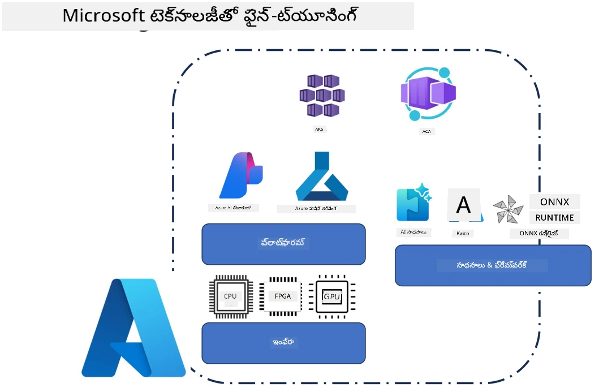
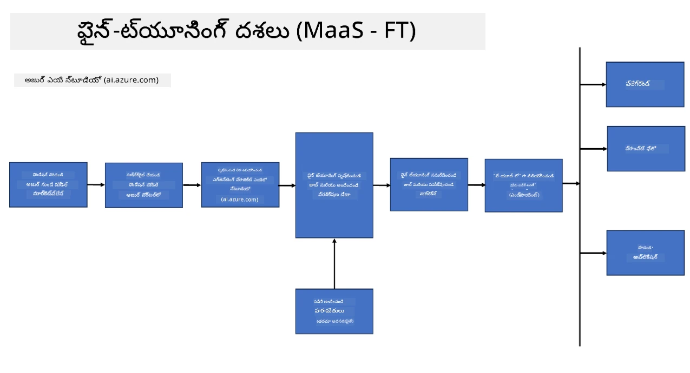
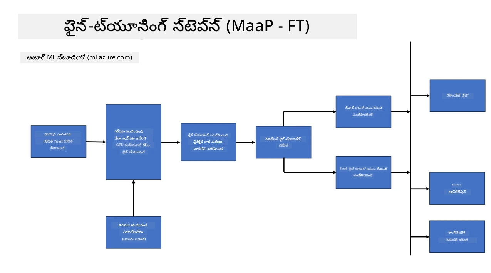
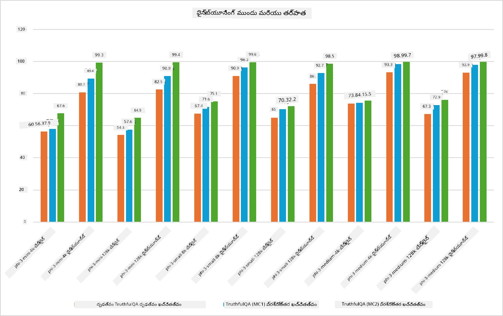

## ఫైన్ ట్యూనింగ్ సన్నివేశాలు

ఈ విభాగం Microsoft Foundry మరియు Azure వాతావరణాలలో ఫైన్-ట్యూనింగ్ సన్నివేశాల అవలోకనం అందిస్తుంది, ఇందులో డిప్లాయ్‌మెంట్ మోడల్స్, ఇన్‌ఫ్రాస్ట్రక్చర్ లేయర్లు, మరియు సాధారణంగా ఉపయోగించే ఆప్టిమైజేషన్ సాంకేతికతలు ఉంటాయి.

**ప్లాట్‌ఫారమ్**  
ఇది Microsoft Foundry (మునుపటి Azure AI Foundry) మరియు Azure Machine Learning వంటి నిర్వహించబడుతున్న సేవలను కలిగి ఉంది, ఇవి మోడల్ మేనేజ్‌మెంట్, సంయోజనం, ప్రయోగ ట్రాకింగ్, మరియు డిప్లాయ్‌మెంట్ వర్క్‌ఫ్లోలను అందిస్తాయి.

**ఇన్‌ఫ్రాస్ట్రక్చర్**  
ఫైన్-ట్యూనింగ్‌కు స్కేలబుల్ కంప్యూట్ వనరులు అవసరం. Azure వాతావరణాలలో, ఇది సాధారణంగా GPU ఆధారిత వర్చువల్ మెషీన్లు మరియు CPU వనరులు కొంత తేలికపాటి పనుల కోసం, డేటాసెట్‌లు మరియు చెక్పాయింట్లు కోసం స్కేలబుల్ స్టోరేజీతో సహా ఉంటుంది.

**సాధనాలు & ఫ్రేమ్‌వర్క్**  
ఫైన్-ట్యూనింగ్ వర్క్‌ఫ్లోలు సాధారణంగా Hugging Face Transformers, DeepSpeed, మరియు PEFT (ప్యారామీటర్-ఎఫిషియెంట్ ఫైన్-ట్యూనింగ్) వంటి ఫ్రేమ్‌వర్క్‌ల మరియు ఆప్టిమైజేషన్ లైబ్రరీలపై ఆధారపడతాయి.

Microsoft సాంకేతికతలతో ఫైన్-ట్యూనింగ్ ప్రక్రియ ప్లాట్‌ఫారమ్ సేవలు, కంప్యూట్ ఇన్‌ఫ్రాస్ట్రక్చర్, మరియు శిక్షణ ఫ్రేమ్‌వర్క్‌లను సందరిచి ఉంటుంది. ఈ భాగాలు ఎలా కలిసి పనిచేస్తాయో అర్థం చేసుకుంటే, డెవలపర్స్ ప్రత్యేక పనులకు మరియు ఉత్పత్తి సన్నివేశాలకు ఫౌండేషన్ మోడల్స్‌ను సమర్థవంతంగా అనుకూలీకరించవచ్చు.

## మోడల్ యాజమాన్యం సేవగా

కంప్యూట్‌ను సృష్టించకుండా మరియు నిర్వహించకుండా హోస్ట్ చేసిన ఫైన్-ట్యూనింగ్ ఉపయోగించి మోడల్‌ను ఫైన్-ట్యూన్ చేయండి.

సర్వర్‌లెస్ ఫైన్-ట్యూనింగ్ ఇప్పుడు Phi-3, Phi-3.5, మరియు Phi-4 మోడల్ కుటుంబాల కోసం అందుబాటులో ఉంది, ఇది డెవలపర్లకు క్లౌడ్ మరియు ఎడ్జ్ సన్నివేశాలకు మోడల్స్‌ను వేగంగా మరియు సులభంగా అనుకూలీకరించడానికి కంప్యూట్ ఏర్పాట్లు అవసరం లేకుండా అవకాశం కల్పిస్తుంది.

## మోడల్‌ను ప్లాట్‌ఫారమ్‌గా ఉపయోగించడం

వాడుకదారులు తమ స్వంత కంప్యూట్‌ను నిర్వహించి తమ మోడల్స్‌ను ఫైన్-ట్యూన్ చేస్తారు.

[Fine Tuning Sample](https://github.com/Azure/azureml-examples/blob/main/sdk/python/foundation-models/system/finetune/chat-completion/chat-completion.ipynb)

## ఫైన్-ట్యూనింగ్ సాంకేతికతల పోలిక

|సన్నివేశం|LoRA|QLoRA|PEFT|DeepSpeed|ZeRO|DoRA|
|---|---|---|---|---|---|---|
|మునుపై శిక్షణ పొందిన LLMలను ప్రత్యేక పనితీరు లేదా డొమైన్‌లకు అనుకూలీకరించడం|అవును|అవును|అవును|అవును|అవును|అవును|
|పాఠ్య వర్గీకరణ, పేరుచే గుర్తింపు, మరియు యంత్ర అనువాదం వంటి NLP పనుల కోసం ఫైన్-ట్యూనింగ్|అవును|అవును|అవును|అవును|అవును|అవును|
|QA పనుల కోసం ఫైన్-ట్యూనింగ్|అవును|అవును|అవును|అవును|అవును|అవును|
|చాట్‌బాట్లలో మానవ-పోరాటమైన ప్రతిస్పందనలను సృష్టించడానికి ఫైన్-ట్యూనింగ్|అవును|అవును|అవును|అవును|అవును|అవును|
|సంగీతం, కళ లేదా ఇతర సృజనాత్మక రూపాల సృష్టికి ఫైన్-ట్యూనింగ్|అవును|అవును|అవును|అవును|అవును|అవును|
|గణన మరియు ఆర్థిక ఖర్చులను తగ్గించడం|అవును|అవును|అవును|అవును|అవును|అవును|
|మెమొరీ వాడకాన్ని తగ్గించడం|అవును|అవును|అవును|అవును|అవును|అవును|
|సమర్థవంతమైన ఫైన్‌టీuning కోసం తక్కువ పారామితులను ఉపయోగించడం|అవును|అవును|అవును|కాదు|కాదు|అవును|
|అన్ని GPU పరికరాల సమూహ GPU మెమొరీ యాక్సెస్ ఇస్తున్న మెమొరీ-సమర్థవంతమైన డేటా పరలలిజం రూపం|కాదు|కాదు|కాదు|అవును|అవును|కాదు|

> [!NOTE]
> LoRA, QLoRA, PEFT, మరియు DoRA అనేవి ప్యారామీటర్-ఎఫిషియెంట్ ఫైన్-ట్యూనింగ్ పద్ధతులు, అయితే DeepSpeed మరియు ZeRO విస్తృత శిక్షణ మరియు మెమొరీ ఆప్టిమైజేషన్ పై కేంద్రీకృతమవుతున్నాయి.

## ఫైన్ ట్యూనింగ్ పనితీరు ఉదాహరణలు

---

<!-- CO-OP TRANSLATOR DISCLAIMER START -->
**వితరణ**:
ఈ పత్రం AI అనువాద సేవ [Co-op Translator](https://github.com/Azure/co-op-translator) ఉపయోగించి అనువదించబడింది. మనం ఖచ్చితత్వం కోసం ప్రయత్నిస్తున్నప్పటికీ, ఆటోమేటెడ్ అనువాదాల్లో పొరపాట్లు లేదా తప్పులుంటే ఉండవచ్చు. స్థానిక భాషలోని మూల పత్రం అధికారిక మూలంగా కണക്കుకోవాలి. ముఖ్యమైన సమాచారానికి, వృత్తిపరమైన మానవ అనువాదం సిఫార్సు చేయబడుతుంది. ఈ అనువాదం ఉపయోగంలో ఏర్పడే ఏవైనా అపార్థాలు లేదా దుర్విశేషాలపట్ల మేము బాధ్యం వహించము.
<!-- CO-OP TRANSLATOR DISCLAIMER END -->