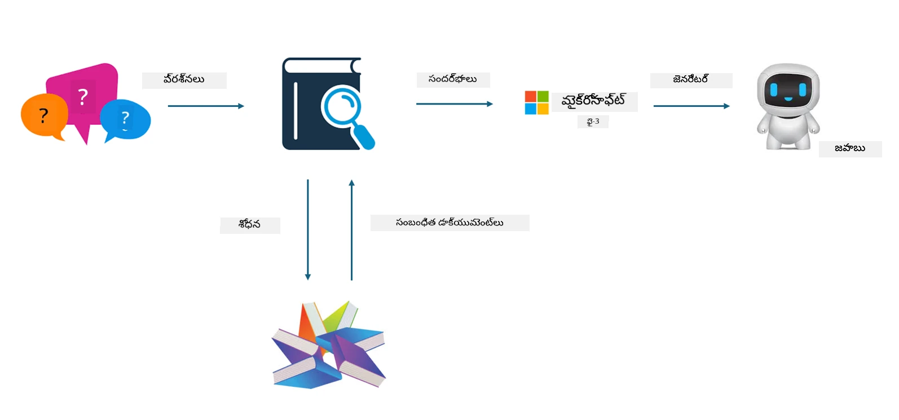

## ఫైన్‌ట్యూనింగ్ vs RAG

## రిట్రీవల్ ఆగ్మెంటెడ్ జనరేషన్

RAG అనేది డేటా రిట్రీవల్ + టెక్స్ట్ జనరేషన్. సంస్థ యొక్క నిర్మాణాత్మక (structured) మరియు నిర్మాణరహిత (unstructured) డేటా వెక్టర్ డేటాబేస్‌లో నిల్వ చేయబడతాయి. సంబంధిత కంటెంట్ కోసం శోధించినప్పుడు, సంబంధిత సారాంశం మరియు సమాచారాన్ని కనుగొని ఒక సందర్భం ఏర్పడి, LLM/SLM యొక్క టెక్స్ట్ పూర్తి చేసే సామర్థ్యంతో కలిపి కంటెంట్ రూపొందించబడుతుంది.

## RAG Process

## ఫైన్-ట్యూనింగ్
ఫైన్-ట్యూనింగ్ ఒక నిర్దిష్ట మోడల్‌ను మెరుగుపరచడానికి ఆధారపడుతుంది. ఇది మోడల్ అల్గోరిథం నుండి ప్రారంభించాల్సిన అవసరం లేదు, కానీ డేటాను నిరంతరంగా సేకరించడం అవసరం. పరిశ్రమ అనువర్తనాలలో మీరు మరింత ఖచ్చితమైన పదజాలం మరియు భాషా వ్యక్తీకరణను కోరితే, ఫైన్-ట్యూనింగ్ మంచి ఎంపిక. కానీ మీ డేటా తరచుగా మారుతుంటే, ఫైన్-ట్యూనింగ్ క్లిష్టంగా మారవచ్చు.

## ఎలా ఎంచుకోవాలి
If our answer requires the introduction of external data, RAG is the best choice

మీకు స్థిరమైన మరియు ఖచ్చితమైన పరిశ్రమ జ్ఞానాన్ని తీసివెళ్ళాలి అనుకుంటే, ఫైన్-ట్యూనింగ్ ఒక మంచి ఎంపిక అవుతుంది. RAG సంబంధిత కంటెంట్ తీసుకొచ్చేందుకు ప్రాధాన్యం ఇస్తుంది కానీ ప్రత్యేక సూత్రాలు లేదా సూక్ష్మతలను ఎల్లప్పుడూ సరిగ్గా పట్టకపోవచ్చు.

ఫైన్-ట్యూనింగ్‌కు ఉన్నత-నాణ్యత డేటా సెట్ అవసరం, మరియు అది కేవలం చిన్న పరిధిలోని డేటాతో అయితే పెద్ద మార్పు కనబడదు. RAG మరింత స్వేచ్ఛగా ఉంటుంది

ఫైన్-ట్యూనింగ్ ఒక బ్లాక్ బాక్స్ లాంటిది, ఒక తత్వశాస్త్రీయ అంశంలాగి, దాని అంతర్గత యాంత్రికతను అర్థం చేసుకోవడం కష్టం. కానీ RAG డేటా మూలాన్ని కనుగొనడాన్ని సులభతరం చేయగలదు, తద్వారా హాల్యూసినేషన్లు లేదా కంటెంట్ లోపాలను సమర్థవంతంగా సరిదిద్దడం మరియు మెరుగైన పారదర్శకతను అందించడం సులభమవుతుంది.

---

<!-- CO-OP TRANSLATOR DISCLAIMER START -->
**డిస్క్లైమర్**:
ఈ పత్రాన్ని AI అనువాద సేవ [Co-op Translator](https://github.com/Azure/co-op-translator) ఉపయోగించి అనువదించారు. మేము ఖచ్చితత్వానికి ప్రయత్నించినప్పటికీ, ఆటోమేటిక్ అనువాదాల్లో తప్పులు లేదా అస్పష్టతలు ఉండవచ్చు. మూల పత్రాన్ని దాని స్థానిక భాషలోనే అధికారిక మూలంగా పరిగణించండి. ముఖ్యమైన సమాచారానికి వృత్తిపరమైన మానవ అనువాదాన్ని మేము సూచిస్తాము. ఈ అనువాదం వలన ఏర్పడిన ఏవైనా అవగాహనా లోపాలు లేదా అపార్థాల కోసం మేము బాధ్యులు కాదు.
<!-- CO-OP TRANSLATOR DISCLAIMER END -->