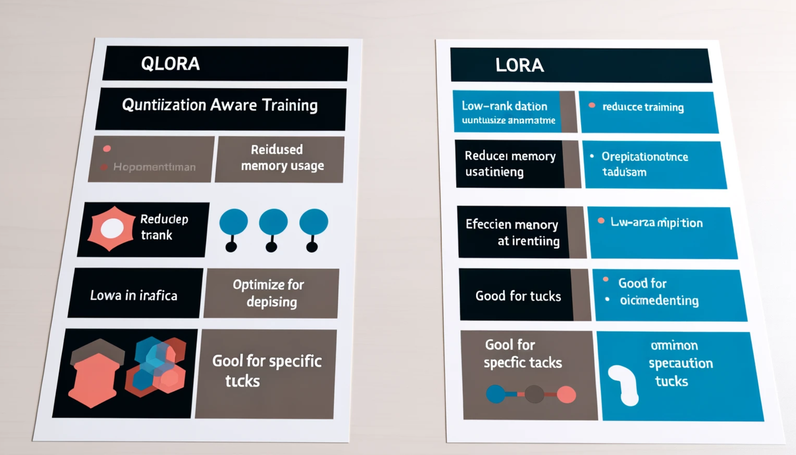

<!--
CO_OP_TRANSLATOR_METADATA:
{
  "original_hash": "743d7e9cb9c4e8ea642d77bee657a7fa",
  "translation_date": "2025-12-21T17:23:56+00:00",
  "source_file": "md/03.FineTuning/LetPhi3gotoIndustriy.md",
  "language_code": "te"
}
-->
# **Phi-3 ను ఒక పరిశ్రమ నిపుణుడిగా మార్చండి**

To put the Phi-3 model into an industry, you need to add industry business data to the Phi-3 model. We have two different options, the first is RAG (Retrieval Augmented Generation) and the second is ఫైన్-ట్యూనింగ్.

## **RAG vs ఫైన్-ట్యూనింగ్**

### **రిట్రీవల్ ఆగ్మెంటెడ్ జనరేషన్**

RAG అనేది డేటా రిట్రీవల్ + పాఠ్య జనరేషన్. సంస్థ యొక్క నిర్మితం (structured) మరియు అసంవిధానబద్ధం (unstructured) డేటా వెక్టర్ డేటాబేస్‌లో నిల్వ చేయబడతాయి. సంబంధిత కంటెంట్ కోసం శోధించినప్పుడు, సంబంధిత సారాంశం మరియు కంటెంట్‌ను కనుగొనబడి ఒక సందర్భాన్ని (context) రూపొందించి, LLM/SLM యొక్క టెక్స్ట్ కంప్లిషన్ సామర్థ్యంతో కలిపి కంటెంట్‌ను జనరేట్ చేస్తాయి.

### **ఫైన్-ట్యూనింగ్**

ఫైన్-ట్యూనింగ్ ఒక నిర్దిష్ట మోడెల్ యొక్క మెరుగుదల ఆధారంగా ఉంటుంది. ఇది మోడల్ అల్గోరిథంనుండి ప్రారంభించాల్సిన అవసరం లేదు, కానీ డేటాను నిరంతరం సేకరించడం అవసరం. పరిశ్రమ అనువర్తనాలలో మీరు మరింత ఖచ్చితమైన పదజాలం మరియు భాషా వ్యక్తీకరణను కోరుకుంటే, ఫైన్-ట్యూనింగ్ మీకు ఉత్తమ ఎంపిక. కానీ మీ డేటా తరచుగా మారుతున్నట్లయితే, ఫైన్-ట్యూనింగ్ క్లిష్టంగా మారవచ్చు.

### **ఎలా ఎంచుకోవాలి**

1. మా సమాధానం బాహ్య డేటా పరిచయాన్ని అవసరపడితే, RAG ఉత్తమ ఎంపిక.

2. మీరు స్థిరమైన మరియు ఖచ్చితమైన పరిశ్రమ జ్ఞానం ఉత్పత్తి చేయాల్సిన అవసరం ఉంటే, ఫైన్-ట్యూనింగ్ మంచి ఎంపిక అవుతుంది. RAG సంబంధిత కంటెంట్‌ను ఆకర్షించడాన్ని ప్రాధాన్యం ఇస్తుంది కానీ ప్రత్యేక నైపుణ్యాల సూక్ష్మతలను ప్రతి సారి ఖచ్చితంగా అందించకపోవచ్చు.

3. ఫైన్-ట్యూనింగ్‌కు ఉన్నత-నాణ్యత గల డేటా సెట్ అవసరం, మరియు అది కేవలం చిన్న పరిధిలోని డేటా అయితే, పెద్ద ప్రయోజనం చూపకపోవచ్చు. RAG ఎక్కువగా సౌలభ్యవంతంగా ఉంటుంది.

4. ఫైన్-ట్యూనింగ్ ఒక బ్లాక్‌బాక్స్ వంటిది, అంతర్గత యాంత్రికతను అర్థం చేసుకోవడం కష్టమవుతుంది. కానీ RAG డేటా మూలాన్ని కనుగొనడాన్ని సులభతరం చేసి హల్యూసినేషన్లు లేదా కంటెంట్ లోపాలను సముచితంగా సరిచేసేందుకు మరియు మెరుగైన పారదర్శకతను అందించేందుకు సహాయపడుతుంది.

### **సన్నివేశాలు**

1. వెర్టికల్ పరిశ్రమలు నిర్దిష్ట ప్రొఫెషనల్ పదజాలం మరియు వ్యక్తీకరణలను అవసరమిస్తుంది, ***ఫైన్-ట్యూనింగ్*** ఉత్తమ ఎంపిక అవుతుంది

2. వివిధ జ్ఞానబిందువుల సంకలనం అవసరమైన QA సిస్టమ్ కోసం, ***RAG*** ఉత్తమ ఎంపిక అవుతుంది

3. ఆటోమేటెడ్ బిజినెస్ ఫ్లోల కలయికకు ***RAG + ఫైన్-ట్యూనింగ్*** ఉత్తమ ఎంపిక

## **RAG ను ఎలా ఉపయోగించాలి**

A vector database is a collection of data stored in mathematical form. Vector databases make it easier for machine learning models to remember previous inputs, enabling machine learning to be used to support use cases such as search, recommendations, and text generation. Data can be identified based on similarity metrics rather than exact matches, allowing computer models to understand the context of the data.

Vector database is the key to realizing RAG. We can convert data into vector storage through vector models such as text-embedding-3, jina-ai-embedding, etc.

RAG అప్లికేషన్ సృష్టించే గురించి మరింత తెలుసుకోండి [https://github.com/microsoft/Phi-3CookBook](https://github.com/microsoft/Phi-3CookBook?WT.mc_id=aiml-138114-kinfeylo) 

## **ఫైన్-ట్యూనింగ్ ను ఎలా ఉపయోగించాలి**

The commonly used algorithms in Fine-tuning are Lora and QLora. How to choose?
- [ఈ శాంపిల్ నోట్‌బుక్‌తో మరింత తెలుసుకోండి](../../code/04.Finetuning/Phi_3_Inference_Finetuning.ipynb)
- [Python ఫైన్‌ట్యూనింగ్ సాంపిల్ ఉదాహరణ](../../../../code/04.Finetuning/FineTrainingScript.py)

### **LoRA మరియు QLoRA**

LoRA (Low-Rank Adaptation) మరియు QLoRA (Quantized Low-Rank Adaptation) రెండూ Parameter Efficient Fine Tuning (PEFT) ఉపయోగించి పెద్ద భాషా మోడల్స్ (LLMs) ను ఫైన్-ట్యూన్ చేయడానికి ఉపయోగించే సాంకేతికతలు. PEFT సాంకేతికతలు సాంప్రదాయ పద్ధతులకంటే మోడళ్లను మరింత సమర్థవంతంగా ట్రెయిన్ చేయడానికి రూపొందించబడ్డాయి. 
LoRA ఒక స్టాండ్అలోన్ ఫైన్‌ట్యూనింగ్ సాంకేతికత, ఇది వెయిట్ అప్‌డేట్ మెట్రిక్స్‌పై లో-రాంక్ ఆప్రోక్సిమేషన్ ఇచ్చి మెమొరీ ఫుట్‌ప్రింట్ తగ్గిస్తుంది. ఇది వేగవంతమైన ట్రైనింగ్ సమయాలను అందించి సాంప్రదాయ ఫైన్-ట్యూనింగ్ పద్ధతులకు సమీపంగా పనితీరును నిలుపుతుంది. 

QLoRA అనేది LoRAని విస్తరించిన వెర్షన్, ఇది మెమొరీ వినియోగాన్ని మరింత తగ్గించడానికి క్వాంటైజేషన్ సాంకేతికతలను కలిగి ఉంటుంది. QLoRA ప్రీ-ట్రెయిన్ చేయబడిన LLMలో వెయిట్ పారామీటర్ల ప్రిసిషన్‌ను 4-బిట్ ప్రిసిషన్‌గా క్వాంటైజ్ చేస్తుంది, ఇది LoRA కంటే మెమొరీ పరంగా మరింత సమర్థవంతంగా ఉంటుంది. అయితే, అదనపు క్వాంటైజేషన్ మరియు డిక్వాంటైజేషన్ దశల కారణంగా QLoRA ట్రైనింగ్ LoRA ట్రైనింగ్ కంటే సుమారు 30% నెమ్మదిగా ఉంటుంది. 

QLoRA క్వాంటైజేషన్ సమయంలో పరిచయమయ్యే లోపాలను సరిచేయడానికి LoRA ను సహాయకంగా ఉపయోగిస్తుంది. QLoRA సంబంధితంగా చిన్న, ఎక్కువగా అందుబాటులో ఉన్న GPUs పై బిలియన్లు పరామితులు కలిగిన భారీ మోడళ్లను ఫైన్-ట్యూన్ చేయడానికి వీలు కల్పిస్తుంది. ఉదాహరణకు, QLoRA 36 GPUs అవసరమవుతుందని భావించే 70B పరామితి మోడల్‌ను కేవలం 2

---

<!-- CO-OP TRANSLATOR DISCLAIMER START -->
నిరాకరణ:
ఈ పత్రం AI అనువాద సేవ [Co-op Translator](https://github.com/Azure/co-op-translator) ఉపయోగించి అనువదించబడింది. మేము ఖచ్చితత్వానికి ప్రయత్నిస్తున్నప్పటికీ, ఆటోమేటెడ్ అనువాదాల్లో తప్పులు లేదా అసమర్థతలు ఉండొచ్చు. స్థానిక భాషలోని అసలు పత్రాన్ని అధికారిక మూలంగా పరిగణించాలి. కీలకమైన సమాచారానికి వృత్తిపరమైన మానవ అనువాదాన్ని సిఫార్సు చేయబడుతుంది. ఈ అనువాదం ఉపయోగం వల్ల ఏర్పడిన ఏవైనా అపార్థాలు లేదా తప్పులకై మేము బాధ్యులు కాదని గమనించండి.
<!-- CO-OP TRANSLATOR DISCLAIMER END -->