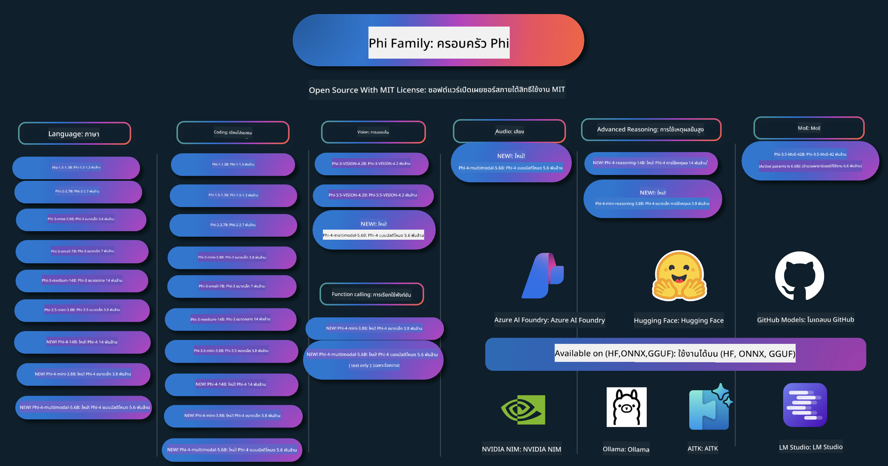

<!--
CO_OP_TRANSLATOR_METADATA:
{
  "original_hash": "1cab9282e04f2e1c388a38dca7763c16",
  "translation_date": "2025-05-09T03:56:32+00:00",
  "source_file": "README.md",
  "language_code": "th"
}
-->
# Phi Cookbook: ตัวอย่างใช้งานจริงกับโมเดล Phi ของ Microsoft

Phi คือชุดโมเดล AI แบบเปิดที่พัฒนาโดย Microsoft

Phi เป็นโมเดลภาษาขนาดเล็ก (SLM) ที่ทรงพลังและคุ้มค่าที่สุดในตอนนี้ โดยมีผลทดสอบที่ดีมากในหลายภาษา การให้เหตุผล การสร้างข้อความ/แชท การเขียนโค้ด รูปภาพ เสียง และสถานการณ์อื่นๆ

คุณสามารถนำ Phi ไปใช้งานบนคลาวด์หรืออุปกรณ์ edge ได้อย่างง่ายดาย และสร้างแอปพลิเคชัน AI เชิงสร้างสรรค์ได้แม้มีพลังการประมวลผลจำกัด

ทำตามขั้นตอนเหล่านี้เพื่อเริ่มต้นใช้งานทรัพยากรเหล่านี้:
1. **Fork the Repository**: คลิก 
2. **Clone the Repository**:   `git clone https://github.com/microsoft/PhiCookBook.git`
3. [**เข้าร่วม Microsoft AI Discord Community เพื่อพบปะผู้เชี่ยวชาญและนักพัฒนาคนอื่นๆ**](https://discord.com/invite/ByRwuEEgH4?WT.mc_id=aiml-137032-kinfeylo)

## 🌐 รองรับหลายภาษา

### รองรับผ่าน GitHub Action (อัตโนมัติ & อัปเดตเสมอ)

[French](../fr/README.md) | [Spanish](../es/README.md) | [German](../de/README.md) | [Russian](../ru/README.md) | [Arabic](../ar/README.md) | [Persian (Farsi)](../fa/README.md) | [Urdu](../ur/README.md) | [Chinese (Simplified)](../zh/README.md) | [Chinese (Traditional, Macau)](../mo/README.md) | [Chinese (Traditional, Hong Kong)](../hk/README.md) | [Chinese (Traditional, Taiwan)](../tw/README.md) | [Japanese](../ja/README.md) | [Korean](../ko/README.md) | [Hindi](../hi/README.md)

### รองรับผ่าน CLI
[Bengali](../bn/README.md) | [Marathi](../mr/README.md) | [Nepali](../ne/README.md) | [Punjabi (Gurmukhi)](../pa/README.md) | [Portuguese (Portugal)](../pt/README.md) | [Portuguese (Brazil)](../br/README.md) | [Italian](../it/README.md) | [Polish](../pl/README.md) | [Turkish](../tr/README.md) | [Greek](../el/README.md) | [Thai](./README.md) | [Swedish](../sv/README.md) | [Danish](../da/README.md) | [Norwegian](../no/README.md) | [Finnish](../fi/README.md) | [Dutch](../nl/README.md) | [Hebrew](../he/README.md) | [Vietnamese](../vi/README.md) | [Indonesian](../id/README.md) | [Malay](../ms/README.md) | [Tagalog (Filipino)](../tl/README.md) | [Swahili](../sw/README.md) | [Hungarian](../hu/README.md) | [Czech](../cs/README.md) | [Slovak](../sk/README.md) | [Romanian](../ro/README.md) | [Bulgarian](../bg/README.md) | [Serbian (Cyrillic)](../sr/README.md) | [Croatian](../hr/README.md) | [Slovenian](../sl/README.md)

## สารบัญ

- บทนำ
- [ยินดีต้อนรับสู่ครอบครัว Phi](./md/01.Introduction/01/01.PhiFamily.md)
  - [การตั้งค่าสภาพแวดล้อมของคุณ](./md/01.Introduction/01/01.EnvironmentSetup.md)
  - [ทำความเข้าใจเทคโนโลยีหลัก](./md/01.Introduction/01/01.Understandingtech.md)
  - [ความปลอดภัยของ AI สำหรับโมเดล Phi](./md/01.Introduction/01/01.AISafety.md)
  - [การรองรับฮาร์ดแวร์ Phi](./md/01.Introduction/01/01.Hardwaresupport.md)
  - [โมเดล Phi และความพร้อมใช้งานบนแพลตฟอร์มต่างๆ](./md/01.Introduction/01/01.Edgeandcloud.md)
  - [การใช้ Guidance-ai และ Phi](./md/01.Introduction/01/01.Guidance.md)
  - [GitHub Marketplace Models](https://github.com/marketplace/models)
  - [Azure AI Model Catalog](https://ai.azure.com)

- การทำ Inference Phi ในสภาพแวดล้อมต่างๆ
    -  [Hugging face](./md/01.Introduction/02/01.HF.md)
    -  [GitHub Models](./md/01.Introduction/02/02.GitHubModel.md)
    -  [Azure AI Foundry Model Catalog](./md/01.Introduction/02/03.AzureAIFoundry.md)
    -  [Ollama](./md/01.Introduction/02/04.Ollama.md)
    -  [AI Toolkit VSCode (AITK)](./md/01.Introduction/02/05.AITK.md)
    -  [NVIDIA NIM](./md/01.Introduction/02/06.NVIDIA.md)

- การทำ Inference Phi Family
    - [Inference Phi บน iOS](./md/01.Introduction/03/iOS_Inference.md)
    - [Inference Phi บน Android](./md/01.Introduction/03/Android_Inference.md)
    - [Inference Phi บน Jetson](./md/01.Introduction/03/Jetson_Inference.md)
    - [Inference Phi บน AI PC](./md/01.Introduction/03/AIPC_Inference.md)
    - [Inference Phi ด้วย Apple MLX Framework](./md/01.Introduction/03/MLX_Inference.md)
    - [Inference Phi บน Local Server](./md/01.Introduction/03/Local_Server_Inference.md)
    - [Inference Phi บน Remote Server โดยใช้ AI Toolkit](./md/01.Introduction/03/Remote_Interence.md)
    - [Inference Phi ด้วย Rust](./md/01.Introduction/03/Rust_Inference.md)
    - [Inference Phi--Vision ในเครื่อง](./md/01.Introduction/03/Vision_Inference.md)
    - [Inference Phi ด้วย Kaito AKS, Azure Containers (รองรับอย่างเป็นทางการ)](./md/01.Introduction/03/Kaito_Inference.md)
-  [การ Quantifying Phi Family](./md/01.Introduction/04/QuantifyingPhi.md)
    - [การ Quantizing Phi-3.5 / 4 ด้วย llama.cpp](./md/01.Introduction/04/UsingLlamacppQuantifyingPhi.md)
    - [การ Quantizing Phi-3.5 / 4 ด้วย Generative AI extensions สำหรับ onnxruntime](./md/01.Introduction/04/UsingORTGenAIQuantifyingPhi.md)
    - [การ Quantizing Phi-3.5 / 4 ด้วย Intel OpenVINO](./md/01.Introduction/04/UsingIntelOpenVINOQuantifyingPhi.md)
    - [การ Quantizing Phi-3.5 / 4 ด้วย Apple MLX Framework](./md/01.Introduction/04/UsingAppleMLXQuantifyingPhi.md)

-  การประเมินผล Phi
- [Response AI](./md/01.Introduction/05/ResponsibleAI.md)
    - [Azure AI Foundry for Evaluation](./md/01.Introduction/05/AIFoundry.md)
    - [Using Promptflow for Evaluation](./md/01.Introduction/05/Promptflow.md)
 
- RAG กับ Azure AI Search
    - [วิธีใช้ Phi-4-mini และ Phi-4-multimodal(RAG) กับ Azure AI Search](https://github.com/microsoft/PhiCookBook/blob/main/code/06.E2E/E2E_Phi-4-RAG-Azure-AI-Search.ipynb)

- ตัวอย่างการพัฒนาแอปพลิเคชัน Phi
  - แอปพลิเคชันข้อความและแชท
    - ตัวอย่าง Phi-4 🆕
      - [📓] [แชทกับ Phi-4-mini ONNX Model](./md/02.Application/01.TextAndChat/Phi4/ChatWithPhi4ONNX/README.md)
      - [แชทกับ Phi-4 local ONNX Model .NET](../../md/04.HOL/dotnet/src/LabsPhi4-Chat-01OnnxRuntime)
      - [แอปแชท .NET Console กับ Phi-4 ONNX โดยใช้ Semantic Kernel](../../md/04.HOL/dotnet/src/LabsPhi4-Chat-02SK)
    - ตัวอย่าง Phi-3 / 3.5
      - [แชทบอทในเบราว์เซอร์โดยใช้ Phi3, ONNX Runtime Web และ WebGPU](https://github.com/microsoft/onnxruntime-inference-examples/tree/main/js/chat)
      - [OpenVino Chat](./md/02.Application/01.TextAndChat/Phi3/E2E_OpenVino_Chat.md)
      - [โมเดลหลายตัว - โต้ตอบกับ Phi-3-mini และ OpenAI Whisper](./md/02.Application/01.TextAndChat/Phi3/E2E_Phi-3-mini_with_whisper.md)
      - [MLFlow - สร้าง wrapper และใช้ Phi-3 กับ MLFlow](./md//02.Application/01.TextAndChat/Phi3/E2E_Phi-3-MLflow.md)
      - [การปรับแต่งโมเดล - วิธีปรับแต่งโมเดล Phi-3-min สำหรับ ONNX Runtime Web ด้วย Olive](https://github.com/microsoft/Olive/tree/main/examples/phi3)
      - [แอป WinUI3 กับ Phi-3 mini-4k-instruct-onnx](https://github.com/microsoft/Phi3-Chat-WinUI3-Sample/)
      - [ตัวอย่างแอปโน้ตที่ขับเคลื่อนด้วย AI หลายโมเดลบน WinUI3](https://github.com/microsoft/ai-powered-notes-winui3-sample)
      - [ปรับแต่งและผสานรวมโมเดล Phi-3 แบบกำหนดเองกับ Prompt flow](./md/02.Application/01.TextAndChat/Phi3/E2E_Phi-3-FineTuning_PromptFlow_Integration.md)
      - [ปรับแต่งและผสานรวมโมเดล Phi-3 แบบกำหนดเองกับ Prompt flow ใน Azure AI Foundry](./md/02.Application/01.TextAndChat/Phi3/E2E_Phi-3-FineTuning_PromptFlow_Integration_AIFoundry.md)
      - [ประเมินโมเดล Phi-3 / Phi-3.5 ที่ปรับแต่งแล้วใน Azure AI Foundry โดยเน้นหลักการ Responsible AI ของ Microsoft](./md/02.Application/01.TextAndChat/Phi3/E2E_Phi-3-Evaluation_AIFoundry.md)
      - [📓] [ตัวอย่างการทำนายภาษาด้วย Phi-3.5-mini-instruct (จีน/อังกฤษ)](../../md/02.Application/01.TextAndChat/Phi3/phi3-instruct-demo.ipynb)
      - [Phi-3.5-Instruct WebGPU RAG Chatbot](./md/02.Application/01.TextAndChat/Phi3/WebGPUWithPhi35Readme.md)
      - [ใช้ Windows GPU เพื่อสร้างโซลูชัน Prompt flow กับ Phi-3.5-Instruct ONNX](./md/02.Application/01.TextAndChat/Phi3/UsingPromptFlowWithONNX.md)
      - [ใช้ Microsoft Phi-3.5 tflite เพื่อสร้างแอป Android](./md/02.Application/01.TextAndChat/Phi3/UsingPhi35TFLiteCreateAndroidApp.md)
      - [ตัวอย่าง Q&A .NET โดยใช้โมเดล Phi-3 ONNX ท้องถิ่นผ่าน Microsoft.ML.OnnxRuntime](../../md/04.HOL/dotnet/src/LabsPhi301)
      - [แอปแชท Console .NET กับ Semantic Kernel และ Phi-3](../../md/04.HOL/dotnet/src/LabsPhi302)

  - ตัวอย่างโค้ด Azure AI Inference SDK
    - ตัวอย่าง Phi-4 🆕
      - [📓] [สร้างโค้ดโปรเจกต์โดยใช้ Phi-4-multimodal](./md/02.Application/02.Code/Phi4/GenProjectCode/README.md)
    - ตัวอย่าง Phi-3 / 3.5
      - [สร้าง Visual Studio Code GitHub Copilot Chat ของคุณเองด้วย Microsoft Phi-3 Family](./md/02.Application/02.Code/Phi3/VSCodeExt/README.md)
      - [สร้าง Visual Studio Code Chat Copilot Agent ของคุณเองด้วย Phi-3.5 โดยใช้ GitHub Models](/md/02.Application/02.Code/Phi3/CreateVSCodeChatAgentWithGitHubModels.md)

  - ตัวอย่างการให้เหตุผลขั้นสูง
    - ตัวอย่าง Phi-4 🆕
      - [📓] [ตัวอย่าง Phi-4-mini-reasoning หรือ Phi-4-reasoning](./md/02.Application/03.AdvancedReasoning/Phi4/AdvancedResoningPhi4mini/README.md)
      - [📓] [การปรับแต่ง Phi-4-mini-reasoning ด้วย Microsoft Olive](../../md/02.Application/03.AdvancedReasoning/Phi4/AdvancedResoningPhi4mini/olive_ft_phi_4_reasoning_with_medicaldata.ipynb)
      - [📓] [การปรับแต่ง Phi-4-mini-reasoning ด้วย Apple MLX](../../md/02.Application/03.AdvancedReasoning/Phi4/AdvancedResoningPhi4mini/mlx_ft_phi_4_reasoning_with_medicaldata.ipynb)
      - [📓] [Phi-4-mini-reasoning กับ GitHub Models](../../md/02.Application/02.Code/Phi4r/github_models_inference.ipynb)
- [📓] [Phi-4-mini การให้เหตุผลด้วย Azure AI Foundry Models](../../md/02.Application/02.Code/Phi4r/azure_models_inference.ipynb)
  - ตัวอย่างสาธิต
      - [Phi-4-mini สาธิตที่โฮสต์บน Hugging Face Spaces](https://huggingface.co/spaces/microsoft/phi-4-mini?WT.mc_id=aiml-137032-kinfeylo)
      - [Phi-4-multimodal สาธิตที่โฮสต์บน Hugginge Face Spaces](https://huggingface.co/spaces/microsoft/phi-4-multimodal?WT.mc_id=aiml-137032-kinfeylo)
  - ตัวอย่างภาพ
    - ตัวอย่าง Phi-4 🆕
      - [📓] [ใช้ Phi-4-multimodal อ่านภาพและสร้างโค้ด](./md/02.Application/04.Vision/Phi4/CreateFrontend/README.md) 
    - ตัวอย่าง Phi-3 / 3.5
      -  [📓][Phi-3-vision-แปลงข้อความในภาพเป็นข้อความ](../../md/02.Application/04.Vision/Phi3/E2E_Phi-3-vision-image-text-to-text-online-endpoint.ipynb)
      - [Phi-3-vision-ONNX](https://onnxruntime.ai/docs/genai/tutorials/phi3-v.html)
      - [📓][Phi-3-vision CLIP Embedding](../../md/02.Application/04.Vision/Phi3/E2E_Phi-3-vision-image-text-to-text-online-endpoint.ipynb)
      - [DEMO: Phi-3 Recycling](https://github.com/jennifermarsman/PhiRecycling/)
      - [Phi-3-vision - ผู้ช่วยภาษาเชิงภาพ - กับ Phi3-Vision และ OpenVINO](https://docs.openvino.ai/nightly/notebooks/phi-3-vision-with-output.html)
      - [Phi-3 Vision Nvidia NIM](./md/02.Application/04.Vision/Phi3/E2E_Nvidia_NIM_Vision.md)
      - [Phi-3 Vision OpenVino](./md/02.Application/04.Vision/Phi3/E2E_OpenVino_Phi3Vision.md)
      - [📓][Phi-3.5 Vision ตัวอย่างหลายเฟรมหรือหลายภาพ](../../md/02.Application/04.Vision/Phi3/phi3-vision-demo.ipynb)
      - [Phi-3 Vision Local ONNX Model โดยใช้ Microsoft.ML.OnnxRuntime .NET](../../md/04.HOL/dotnet/src/LabsPhi303)
      - [เมนูสำหรับ Phi-3 Vision Local ONNX Model โดยใช้ Microsoft.ML.OnnxRuntime .NET](../../md/04.HOL/dotnet/src/LabsPhi304)

  - ตัวอย่างเสียง
    - ตัวอย่าง Phi-4 🆕
      - [📓] [การถอดเสียงเสียงด้วย Phi-4-multimodal](./md/02.Application/05.Audio/Phi4/Transciption/README.md)
      - [📓] [ตัวอย่างเสียง Phi-4-multimodal](../../md/02.Application/05.Audio/Phi4/Siri/demo.ipynb)
      - [📓] [ตัวอย่างแปลเสียงพูด Phi-4-multimodal](../../md/02.Application/05.Audio/Phi4/Translate/demo.ipynb)
      - [แอปพลิเคชันคอนโซล .NET ใช้ Phi-4-multimodal วิเคราะห์ไฟล์เสียงและสร้างถอดความ](../../md/04.HOL/dotnet/src/LabsPhi4-MultiModal-02Audio)

  - ตัวอย่าง MOE
    - ตัวอย่าง Phi-3 / 3.5
      - [📓] [Phi-3.5 Mixture of Experts Models (MoEs) ตัวอย่างโซเชียลมีเดีย](../../md/02.Application/06.MoE/Phi3/phi3_moe_demo.ipynb)
      - [📓] [สร้าง Retrieval-Augmented Generation (RAG) Pipeline ด้วย NVIDIA NIM Phi-3 MOE, Azure AI Search และ LlamaIndex](../../md/02.Application/06.MoE/Phi3/azure-ai-search-nvidia-rag.ipynb)
  - ตัวอย่าง Function Calling
    - ตัวอย่าง Phi-4 🆕
      -  [📓] [ใช้ Function Calling กับ Phi-4-mini](./md/02.Application/07.FunctionCalling/Phi4/FunctionCallingBasic/README.md)
      -  [📓] [ใช้ Function Calling สร้าง multi-agents กับ Phi-4-mini](../../md/02.Application/07.FunctionCalling/Phi4/Multiagents/Phi_4_mini_multiagent.ipynb)
      -  [📓] [ใช้ Function Calling กับ Ollama](../../md/02.Application/07.FunctionCalling/Phi4/Ollama/ollama_functioncalling.ipynb)
  - ตัวอย่างผสม Multimodal
    - ตัวอย่าง Phi-4 🆕
      -  [📓] [ใช้ Phi-4-multimodal เป็นนักข่าวเทคโนโลยี](../../md/02.Application/08.Multimodel/Phi4/TechJournalist/phi_4_mm_audio_text_publish_news.ipynb)
      - [แอปพลิเคชันคอนโซล .NET ใช้ Phi-4-multimodal วิเคราะห์ภาพ](../../md/04.HOL/dotnet/src/LabsPhi4-MultiModal-01Images)

- ตัวอย่าง Fine-tuning Phi
  - [สถานการณ์ Fine-tuning](./md/03.FineTuning/FineTuning_Scenarios.md)
  - [Fine-tuning กับ RAG](./md/03.FineTuning/FineTuning_vs_RAG.md)
  - [Fine-tuning ให้ Phi-3 เป็นผู้เชี่ยวชาญในอุตสาหกรรม](./md/03.FineTuning/LetPhi3gotoIndustriy.md)
  - [Fine-tuning Phi-3 ด้วย AI Toolkit สำหรับ VS Code](./md/03.FineTuning/Finetuning_VSCodeaitoolkit.md)
  - [Fine-tuning Phi-3 ด้วย Azure Machine Learning Service](./md/03.FineTuning/Introduce_AzureML.md)
- [การปรับแต่ง Phi-3 ด้วย Lora](./md/03.FineTuning/FineTuning_Lora.md)
  - [การปรับแต่ง Phi-3 ด้วย QLora](./md/03.FineTuning/FineTuning_Qlora.md)
  - [การปรับแต่ง Phi-3 ด้วย Azure AI Foundry](./md/03.FineTuning/FineTuning_AIFoundry.md)
  - [การปรับแต่ง Phi-3 ด้วย Azure ML CLI/SDK](./md/03.FineTuning/FineTuning_MLSDK.md)
  - [การปรับแต่งด้วย Microsoft Olive](./md/03.FineTuning/FineTuning_MicrosoftOlive.md)
  - [การปรับแต่งด้วย Microsoft Olive Hands-On Lab](./md/03.FineTuning/olive-lab/readme.md)
  - [การปรับแต่ง Phi-3-vision ด้วย Weights and Bias](./md/03.FineTuning/FineTuning_Phi-3-visionWandB.md)
  - [การปรับแต่ง Phi-3 ด้วย Apple MLX Framework](./md/03.FineTuning/FineTuning_MLX.md)
  - [การปรับแต่ง Phi-3-vision (การสนับสนุนอย่างเป็นทางการ)](./md/03.FineTuning/FineTuning_Vision.md)
  - [การปรับแต่ง Phi-3 ด้วย Kaito AKS, Azure Containers (การสนับสนุนอย่างเป็นทางการ)](./md/03.FineTuning/FineTuning_Kaito.md)
  - [การปรับแต่ง Phi-3 และ 3.5 Vision](https://github.com/2U1/Phi3-Vision-Finetune)

- Hands on Lab
  - [สำรวจโมเดลล้ำสมัย: LLMs, SLMs, การพัฒนาท้องถิ่น และอื่นๆ](https://github.com/microsoft/aitour-exploring-cutting-edge-models)
  - [ปลดล็อกศักยภาพ NLP: การปรับแต่งด้วย Microsoft Olive](https://github.com/azure/Ignite_FineTuning_workshop)

- งานวิจัยและสิ่งตีพิมพ์ทางวิชาการ
  - [Textbooks Are All You Need II: phi-1.5 technical report](https://arxiv.org/abs/2309.05463)
  - [Phi-3 Technical Report: โมเดลภาษาที่มีความสามารถสูงบนโทรศัพท์ของคุณ](https://arxiv.org/abs/2404.14219)
  - [Phi-4 Technical Report](https://arxiv.org/abs/2412.08905)
  - [Phi-4-Mini Technical Report: โมเดลภาษามัลติโมดอลที่กะทัดรัดแต่ทรงพลังผ่าน Mixture-of-LoRAs](https://arxiv.org/abs/2503.01743)
  - [การปรับแต่งโมเดลภาษาขนาดเล็กสำหรับฟังก์ชันเรียกใช้งานในรถยนต์](https://arxiv.org/abs/2501.02342)
  - [(WhyPHI) การปรับแต่ง PHI-3 สำหรับการตอบคำถามแบบปรนัย: วิธีการ ผลลัพธ์ และความท้าทาย](https://arxiv.org/abs/2501.01588)
  - [Phi-4-reasoning Technical Report](https://www.microsoft.com/en-us/research/wp-content/uploads/2025/04/phi_4_reasoning.pdf)
  - [Phi-4-mini-reasoning Technical Report](https://huggingface.co/microsoft/Phi-4-mini-reasoning/blob/main/Phi-4-Mini-Reasoning.pdf)

## การใช้งานโมเดล Phi

### Phi บน Azure AI Foundry

คุณสามารถเรียนรู้วิธีใช้ Microsoft Phi และวิธีสร้างโซลูชันแบบครบวงจรบนอุปกรณ์ฮาร์ดแวร์ต่างๆ ของคุณ เพื่อสัมผัสประสบการณ์กับ Phi ด้วยตัวเอง เริ่มต้นด้วยการทดลองเล่นกับโมเดลและปรับแต่ง Phi ให้เหมาะกับสถานการณ์ของคุณโดยใช้ [Azure AI Foundry Azure AI Model Catalog](https://aka.ms/phi3-azure-ai) คุณสามารถเรียนรู้เพิ่มเติมได้ที่ Getting Started with [Azure AI Foundry](/md/02.QuickStart/AzureAIFoundry_QuickStart.md)

**Playground**  
แต่ละโมเดลมี playground เฉพาะสำหรับทดสอบโมเดล [Azure AI Playground](https://aka.ms/try-phi3)

### Phi บน GitHub Models

คุณสามารถเรียนรู้วิธีใช้ Microsoft Phi และวิธีสร้างโซลูชันแบบครบวงจรบนอุปกรณ์ฮาร์ดแวร์ต่างๆ ของคุณ เพื่อสัมผัสประสบการณ์กับ Phi ด้วยตัวเอง เริ่มต้นด้วยการทดลองเล่นกับโมเดลและปรับแต่ง Phi ให้เหมาะกับสถานการณ์ของคุณโดยใช้ [GitHub Model Catalog](https://github.com/marketplace/models?WT.mc_id=aiml-137032-kinfeylo) คุณสามารถเรียนรู้เพิ่มเติมได้ที่ Getting Started with [GitHub Model Catalog](/md/02.QuickStart/GitHubModel_QuickStart.md)

**Playground**  
แต่ละโมเดลมี [playground สำหรับทดสอบโมเดล](/md/02.QuickStart/GitHubModel_QuickStart.md)

### Phi บน Hugging Face

คุณยังสามารถค้นหาโมเดลได้ที่ [Hugging Face](https://huggingface.co/microsoft)

**Playground**  
[Hugging Chat playground](https://huggingface.co/chat/models/microsoft/Phi-3-mini-4k-instruct)

## AI ที่รับผิดชอบ

Microsoft มุ่งมั่นช่วยลูกค้าใช้ผลิตภัณฑ์ AI อย่างรับผิดชอบ แบ่งปันความรู้ และสร้างความไว้วางใจผ่านเครื่องมือต่างๆ เช่น Transparency Notes และ Impact Assessments แหล่งข้อมูลเหล่านี้ส่วนใหญ่สามารถพบได้ที่ [https://aka.ms/RAI](https://aka.ms/RAI)  
แนวทางของ Microsoft ใน AI ที่รับผิดชอบตั้งอยู่บนหลักการ AI ของเราที่เน้นความเป็นธรรม ความน่าเชื่อถือและความปลอดภัย ความเป็นส่วนตัวและความมั่นคง ความครอบคลุม ความโปร่งใส และความรับผิดชอบ
โมเดลภาษาธรรมชาติ ภาพ และเสียงขนาดใหญ่ – เช่นเดียวกับที่ใช้ในตัวอย่างนี้ – อาจแสดงพฤติกรรมที่ไม่เป็นธรรม ไว้ใจไม่ได้ หรือไม่เหมาะสม ซึ่งอาจก่อให้เกิดความเสียหายได้ โปรดดูที่ [Azure OpenAI service Transparency note](https://learn.microsoft.com/legal/cognitive-services/openai/transparency-note?tabs=text) เพื่อรับทราบเกี่ยวกับความเสี่ยงและข้อจำกัด

แนวทางที่แนะนำในการลดความเสี่ยงเหล่านี้คือการรวมระบบความปลอดภัยในสถาปัตยกรรมของคุณที่สามารถตรวจจับและป้องกันพฤติกรรมที่เป็นอันตรายได้ [Azure AI Content Safety](https://learn.microsoft.com/azure/ai-services/content-safety/overview) ให้ชั้นป้องกันอิสระที่สามารถตรวจจับเนื้อหาที่เป็นอันตรายซึ่งสร้างโดยผู้ใช้และ AI ในแอปพลิเคชันและบริการต่างๆ Azure AI Content Safety มี API สำหรับข้อความและภาพที่ช่วยให้คุณตรวจจับเนื้อหาที่เป็นอันตราย ภายใน Azure AI Foundry บริการ Content Safety ช่วยให้คุณดู สำรวจ และทดลองโค้ดตัวอย่างสำหรับการตรวจจับเนื้อหาที่เป็นอันตรายในหลายรูปแบบ เอกสาร [quickstart documentation](https://learn.microsoft.com/azure/ai-services/content-safety/quickstart-text?tabs=visual-studio%2Clinux&pivots=programming-language-rest) ต่อไปนี้จะแนะนำวิธีการส่งคำขอไปยังบริการนี้

อีกประเด็นที่ต้องพิจารณาคือประสิทธิภาพโดยรวมของแอปพลิเคชัน ด้วยแอปพลิเคชันที่มีหลายรูปแบบและหลายโมเดล เราถือว่าประสิทธิภาพหมายถึงระบบทำงานตามที่คุณและผู้ใช้ของคุณคาดหวัง รวมถึงไม่สร้างผลลัพธ์ที่เป็นอันตรายด้วย สิ่งสำคัญคือต้องประเมินประสิทธิภาพของแอปพลิเคชันโดยรวมโดยใช้ [Performance and Quality and Risk and Safety evaluators](https://learn.microsoft.com/azure/ai-studio/concepts/evaluation-metrics-built-in) คุณยังสามารถสร้างและประเมินด้วย [custom evaluators](https://learn.microsoft.com/azure/ai-studio/how-to/develop/evaluate-sdk#custom-evaluators) ได้ด้วย

คุณสามารถประเมินแอปพลิเคชัน AI ของคุณในสภาพแวดล้อมการพัฒนาโดยใช้ [Azure AI Evaluation SDK](https://microsoft.github.io/promptflow/index.html) ไม่ว่าจะเป็นชุดข้อมูลทดสอบหรือเป้าหมาย การสร้างผลลัพธ์จากแอปพลิเคชัน AI ของคุณจะถูกวัดเชิงปริมาณด้วย evaluators ที่ติดตั้งมาแล้วหรือ custom evaluators ที่คุณเลือก เพื่อเริ่มต้นใช้งาน azure ai evaluation sdk ในการประเมินระบบของคุณ คุณสามารถทำตาม [quickstart guide](https://learn.microsoft.com/azure/ai-studio/how-to/develop/flow-evaluate-sdk) เมื่อคุณดำเนินการรันการประเมินเสร็จแล้ว คุณสามารถ [แสดงผลลัพธ์ใน Azure AI Foundry](https://learn.microsoft.com/azure/ai-studio/how-to/evaluate-flow-results) ได้

## เครื่องหมายการค้า

โครงการนี้อาจมีเครื่องหมายการค้าหรือโลโก้ของโครงการ ผลิตภัณฑ์ หรือบริการ การใช้เครื่องหมายการค้าหรือโลโก้ของ Microsoft อย่างถูกต้องต้องเป็นไปตามและปฏิบัติตาม [Microsoft's Trademark & Brand Guidelines](https://www.microsoft.com/legal/intellectualproperty/trademarks/usage/general) การใช้เครื่องหมายการค้าหรือโลโก้ของ Microsoft ในเวอร์ชันที่ดัดแปลงของโครงการนี้ต้องไม่ก่อให้เกิดความสับสนหรือสื่อว่ามีการสนับสนุนจาก Microsoft การใช้เครื่องหมายการค้าหรือโลโก้ของบุคคลที่สามต้องเป็นไปตามนโยบายของบุคคลที่สามเหล่านั้น

**ข้อจำกัดความรับผิดชอบ**:  
เอกสารนี้ได้รับการแปลโดยใช้บริการแปลภาษาด้วย AI [Co-op Translator](https://github.com/Azure/co-op-translator) แม้ว่าเราจะพยายามให้การแปลมีความถูกต้อง แต่โปรดทราบว่าการแปลอัตโนมัติอาจมีข้อผิดพลาดหรือความไม่ถูกต้อง เอกสารต้นฉบับในภาษาดั้งเดิมถือเป็นแหล่งข้อมูลที่เชื่อถือได้ สำหรับข้อมูลที่สำคัญ แนะนำให้ใช้บริการแปลโดยมืออาชีพที่เป็นมนุษย์ เราไม่รับผิดชอบต่อความเข้าใจผิดหรือการตีความที่ผิดพลาดที่เกิดจากการใช้การแปลนี้