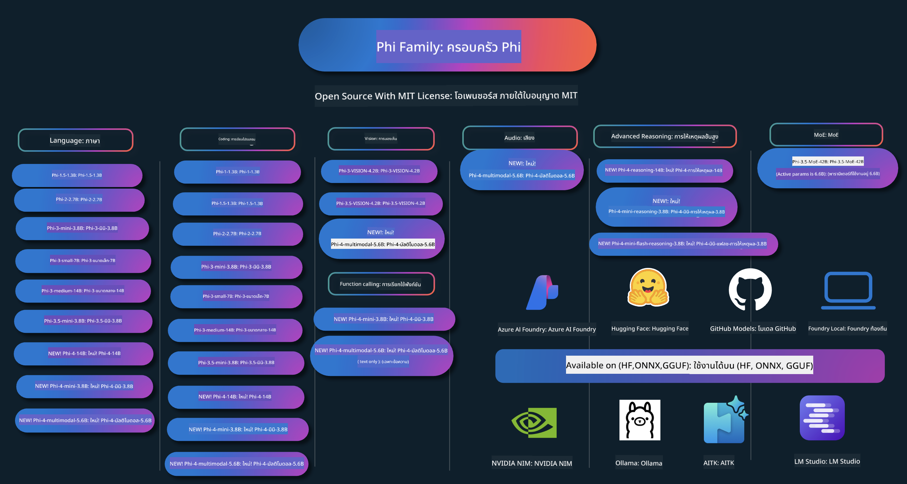

<!--
CO_OP_TRANSLATOR_METADATA:
{
  "original_hash": "ef3a50368712b1a7483d0def1f70c490",
  "translation_date": "2025-12-21T11:53:19+00:00",
  "source_file": "README.md",
  "language_code": "th"
}
-->
# Phi Cookbook: ตัวอย่างเชิงปฏิบัติการกับโมเดล Phi ของ Microsoft

Phi เป็นชุดของโมเดล AI แบบโอเพนซอร์สที่พัฒนาโดย Microsoft. 

Phi ปัจจุบันเป็นโมเดลภาษาเล็ก (SLM) ที่ทรงพลังและคุ้มค่าที่สุด โดยมีผลการทดสอบที่ดีมากในหลายภาษา การให้เหตุผล การสร้างข้อความ/การแชท การเขียนโค้ด ภาพ เสียง และสถานการณ์อื่นๆ. 

คุณสามารถปรับใช้ Phi บนคลาวด์หรือบนอุปกรณ์ขอบเครือข่าย และคุณสามารถสร้างแอปพลิเคชัน AI แบบสร้างสรรค์ได้อย่างง่ายดายด้วยกำลังประมวลผลที่จำกัด.

ทำตามขั้นตอนเหล่านี้เพื่อเริ่มใช้ทรัพยากรเหล่านี้ :
1. **Fork ที่เก็บโค้ด (Repository)**: Click 
2. **โคลนที่เก็บโค้ด (Repository)**:   `git clone https://github.com/microsoft/PhiCookBook.git`
3. [**เข้าร่วมชุมชน Microsoft AI บน Discord และพบปะผู้เชี่ยวชาญและนักพัฒนาร่วมกัน**](https://discord.com/invite/ByRwuEEgH4?WT.mc_id=aiml-137032-kinfeylo)

### 🌐 รองรับหลายภาษา

#### รองรับผ่าน GitHub Action (อัตโนมัติและอัปเดตเสมอ)

<!-- CO-OP TRANSLATOR LANGUAGES TABLE START -->
[อาหรับ](../ar/README.md) | [เบงกาลี](../bn/README.md) | [บัลแกเรีย](../bg/README.md) | [พม่า (เมียนมา)](../my/README.md) | [จีน (ตัวย่อ)](../zh/README.md) | [จีน (ตัวเต็ม, ฮ่องกง)](../hk/README.md) | [จีน (ตัวเต็ม, มาเก๊า)](../mo/README.md) | [จีน (ตัวเต็ม, ไต้หวัน)](../tw/README.md) | [โครเอเชีย](../hr/README.md) | [เช็ก](../cs/README.md) | [เดนมาร์ก](../da/README.md) | [ดัตช์](../nl/README.md) | [เอสโตเนีย](../et/README.md) | [ฟินแลนด์](../fi/README.md) | [ฝรั่งเศส](../fr/README.md) | [เยอรมัน](../de/README.md) | [กรีก](../el/README.md) | [ฮีบรู](../he/README.md) | [ฮินดี](../hi/README.md) | [ฮังการี](../hu/README.md) | [อินโดนีเซีย](../id/README.md) | [อิตาลี](../it/README.md) | [ญี่ปุ่น](../ja/README.md) | [คันนาดา](../kn/README.md) | [เกาหลี](../ko/README.md) | [ลิทัวเนีย](../lt/README.md) | [มาเลย์](../ms/README.md) | [มาลายาลัม](../ml/README.md) | [มราฐี](../mr/README.md) | [เนปาลี](../ne/README.md) | [ไนจีเรีย พิดจิน](../pcm/README.md) | [นอร์เวย์](../no/README.md) | [เปอร์เซีย (ฟาร์ซี)](../fa/README.md) | [โปแลนด์](../pl/README.md) | [โปรตุเกส (บราซิล)](../br/README.md) | [โปรตุเกส (โปรตุเกส)](../pt/README.md) | [ปัญจาบี (กุรมุขี)](../pa/README.md) | [โรมาเนีย](../ro/README.md) | [รัสเซีย](../ru/README.md) | [เซอร์เบีย (คิริลลิก)](../sr/README.md) | [สโลวัก](../sk/README.md) | [สโลวีเนีย](../sl/README.md) | [สเปน](../es/README.md) | [สวาฮีลี](../sw/README.md) | [สวีเดน](../sv/README.md) | [ทากาล็อก (ฟิลิปปินส์)](../tl/README.md) | [ทมิฬ](../ta/README.md) | [เทลูกู](../te/README.md) | [ไทย](./README.md) | [ตุรกี](../tr/README.md) | [ยูเครน](../uk/README.md) | [อูรดู](../ur/README.md) | [เวียดนาม](../vi/README.md)
<!-- CO-OP TRANSLATOR LANGUAGES TABLE END -->

## สารบัญ

- บทนำ
  - [ยินดีต้อนรับสู่ครอบครัว Phi](./md/01.Introduction/01/01.PhiFamily.md)
  - [การตั้งค่าสภาพแวดล้อมของคุณ](./md/01.Introduction/01/01.EnvironmentSetup.md)
  - [ทำความเข้าใจเทคโนโลยีหลัก](./md/01.Introduction/01/01.Understandingtech.md)
  - [ความปลอดภัยของ AI สำหรับโมเดล Phi](./md/01.Introduction/01/01.AISafety.md)
  - [การรองรับฮาร์ดแวร์ Phi](./md/01.Introduction/01/01.Hardwaresupport.md)
  - [โมเดล Phi และความพร้อมใช้งานบนแพลตฟอร์มต่างๆ](./md/01.Introduction/01/01.Edgeandcloud.md)
  - [การใช้ Guidance-ai กับ Phi](./md/01.Introduction/01/01.Guidance.md)
  - [โมเดลใน GitHub Marketplace](https://github.com/marketplace/models)
  - [คลังโมเดล Azure AI](https://ai.azure.com)

- การอนุมาน Phi ในสภาพแวดล้อมต่างๆ
    -  [Hugging face](./md/01.Introduction/02/01.HF.md)
    -  [GitHub Models](./md/01.Introduction/02/02.GitHubModel.md)
    -  [Azure AI Foundry Model Catalog](./md/01.Introduction/02/03.AzureAIFoundry.md)
    -  [Ollama](./md/01.Introduction/02/04.Ollama.md)
    -  [AI Toolkit VSCode (AITK)](./md/01.Introduction/02/05.AITK.md)
    -  [NVIDIA NIM](./md/01.Introduction/02/06.NVIDIA.md)
    -  [Foundry Local](./md/01.Introduction/02/07.FoundryLocal.md)

- การอนุมานสำหรับตระกูล Phi
    - [การอนุมาน Phi ใน iOS](./md/01.Introduction/03/iOS_Inference.md)
    - [การอนุมาน Phi ใน Android](./md/01.Introduction/03/Android_Inference.md)
    - [การอนุมาน Phi ใน Jetson](./md/01.Introduction/03/Jetson_Inference.md)
    - [การอนุมาน Phi ใน AI PC](./md/01.Introduction/03/AIPC_Inference.md)
    - [การอนุมาน Phi ด้วย Apple MLX Framework](./md/01.Introduction/03/MLX_Inference.md)
    - [การอนุมาน Phi ใน Local Server](./md/01.Introduction/03/Local_Server_Inference.md)
    - [การอนุมาน Phi ใน Remote Server โดยใช้ AI Toolkit](./md/01.Introduction/03/Remote_Interence.md)
    - [การอนุมาน Phi ด้วย Rust](./md/01.Introduction/03/Rust_Inference.md)
    - [การอนุมาน Phi--Vision ในเครื่อง](./md/01.Introduction/03/Vision_Inference.md)
    - [การอนุมาน Phi ด้วย Kaito AKS, Azure Containers (รองรับอย่างเป็นทางการ)](./md/01.Introduction/03/Kaito_Inference.md)
-  [การควอนไทซ์ของตระกูล Phi](./md/01.Introduction/04/QuantifyingPhi.md)
    - [การควอนไทซ์ Phi-3.5 / 4 โดยใช้ llama.cpp](./md/01.Introduction/04/UsingLlamacppQuantifyingPhi.md)
    - [การควอนไทซ์ Phi-3.5 / 4 โดยใช้ Generative AI extensions สำหรับ onnxruntime](./md/01.Introduction/04/UsingORTGenAIQuantifyingPhi.md)
    - [การควอนไทซ์ Phi-3.5 / 4 โดยใช้ Intel OpenVINO](./md/01.Introduction/04/UsingIntelOpenVINOQuantifyingPhi.md)
    - [การควอนไทซ์ Phi-3.5 / 4 โดยใช้ Apple MLX Framework](./md/01.Introduction/04/UsingAppleMLXQuantifyingPhi.md)

-  การประเมิน Phi
    - [AI ที่รับผิดชอบ](./md/01.Introduction/05/ResponsibleAI.md)
    - [Azure AI Foundry สำหรับการประเมิน](./md/01.Introduction/05/AIFoundry.md)
    - [การใช้ Promptflow สำหรับการประเมิน](./md/01.Introduction/05/Promptflow.md)
 
- RAG ด้วย Azure AI Search
    - [วิธีการใช้ Phi-4-mini และ Phi-4-multimodal(RAG) กับ Azure AI Search](https://github.com/microsoft/PhiCookBook/blob/main/code/06.E2E/E2E_Phi-4-RAG-Azure-AI-Search.ipynb)

- ตัวอย่างการพัฒนาแอปพลิเคชัน Phi
  - แอปพลิเคชันข้อความและการแชท
    - ตัวอย่าง Phi-4 🆕
      - [📓] [แชทกับโมเดล Phi-4-mini ONNX](./md/02.Application/01.TextAndChat/Phi4/ChatWithPhi4ONNX/README.md)
      - [แชทกับโมเดล ONNX ของ Phi-4 ในเครื่อง (.NET)](../../md/04.HOL/dotnet/src/LabsPhi4-Chat-01OnnxRuntime)
      - [แอปคอนโซล .NET แชทกับ Phi-4 ONNX โดยใช้ Sementic Kernel](../../md/04.HOL/dotnet/src/LabsPhi4-Chat-02SK)
    - ตัวอย่าง Phi-3 / 3.5
      - [แชทบอทในเครื่องบนเบราว์เซอร์โดยใช้ Phi3, ONNX Runtime Web และ WebGPU](https://github.com/microsoft/onnxruntime-inference-examples/tree/main/js/chat)
      - [แชท OpenVINO](./md/02.Application/01.TextAndChat/Phi3/E2E_OpenVino_Chat.md)
      - [หลายโมเดล - Phi-3-mini แบบโต้ตอบ และ OpenAI Whisper](./md/02.Application/01.TextAndChat/Phi3/E2E_Phi-3-mini_with_whisper.md)
      - [MLFlow - สร้าง wrapper และใช้ Phi-3 กับ MLFlow](./md//02.Application/01.TextAndChat/Phi3/E2E_Phi-3-MLflow.md)
      - [การเพิ่มประสิทธิภาพโมเดล - วิธีการปรับแต่งโมเดล Phi-3-min สำหรับ ONNX Runtime Web ด้วย Olive](https://github.com/microsoft/Olive/tree/main/examples/phi3)
      - [แอป WinUI3 พร้อม Phi-3 mini-4k-instruct-onnx](https://github.com/microsoft/Phi3-Chat-WinUI3-Sample/)
      -[WinUI3 Multi Model AI Powered Notes App Sample](https://github.com/microsoft/ai-powered-notes-winui3-sample)
      - [การปรับแต่งและผสานรวมโมเดล Phi-3 ที่กำหนดเองกับ Prompt flow](./md/02.Application/01.TextAndChat/Phi3/E2E_Phi-3-FineTuning_PromptFlow_Integration.md)
      - [การปรับแต่งและผสานรวมโมเดล Phi-3 ที่กำหนดเองกับ Prompt flow ใน Azure AI Foundry](./md/02.Application/01.TextAndChat/Phi3/E2E_Phi-3-FineTuning_PromptFlow_Integration_AIFoundry.md)
      - [ประเมินโมเดล Phi-3 / Phi-3.5 ที่ผ่านการปรับแต่งใน Azure AI Foundry โดยมุ่งเน้นที่หลักการ AI ที่มีความรับผิดชอบของ Microsoft](./md/02.Application/01.TextAndChat/Phi3/E2E_Phi-3-Evaluation_AIFoundry.md)
      - [📓] [ตัวอย่างการทำนายภาษา Phi-3.5-mini-instruct (จีน/อังกฤษ)](./md/02.Application/01.TextAndChat/Phi3/phi3-instruct-demo.ipynb)
      - [แชทบอท RAG Phi-3.5-Instruct บน WebGPU](./md/02.Application/01.TextAndChat/Phi3/WebGPUWithPhi35Readme.md)
      - [การใช้ Windows GPU เพื่อสร้างโซลูชัน Prompt flow ด้วย Phi-3.5-Instruct ONNX](./md/02.Application/01.TextAndChat/Phi3/UsingPromptFlowWithONNX.md)
      - [ใช้ Microsoft Phi-3.5 tflite เพื่อสร้างแอป Android](./md/02.Application/01.TextAndChat/Phi3/UsingPhi35TFLiteCreateAndroidApp.md)
      - [ตัวอย่าง Q&A .NET โดยใช้โมเดล ONNX Phi-3 ท้องถิ่น ผ่าน Microsoft.ML.OnnxRuntime](../../md/04.HOL/dotnet/src/LabsPhi301)
      - [แอปแชทคอนโซล .NET ด้วย Semantic Kernel และ Phi-3](../../md/04.HOL/dotnet/src/LabsPhi302)

  - ตัวอย่างโค้ดแบบใช้ Azure AI Inference SDK
    - ตัวอย่าง Phi-4 🆕
      - [📓] [สร้างโค้ดโปรเจกต์โดยใช้ Phi-4-multimodal](./md/02.Application/02.Code/Phi4/GenProjectCode/README.md)
    - Phi-3 / 3.5 ตัวอย่าง
      - [สร้าง Visual Studio Code GitHub Copilot Chat ของคุณเองด้วย Microsoft Phi-3 Family](./md/02.Application/02.Code/Phi3/VSCodeExt/README.md)
      - [สร้างตัวแทน Visual Studio Code Chat Copilot ของคุณเองด้วย Phi-3.5 โดย GitHub Models](/md/02.Application/02.Code/Phi3/CreateVSCodeChatAgentWithGitHubModels.md)

  - ตัวอย่างการให้เหตุผลขั้นสูง
    - ตัวอย่าง Phi-4 🆕
      - [📓] [ตัวอย่าง Phi-4-mini-reasoning หรือ Phi-4-reasoning](./md/02.Application/03.AdvancedReasoning/Phi4/AdvancedResoningPhi4mini/README.md)
      - [📓] [การปรับแต่ง Phi-4-mini-reasoning ด้วย Microsoft Olive](./md/02.Application/03.AdvancedReasoning/Phi4/AdvancedResoningPhi4mini/olive_ft_phi_4_reasoning_with_medicaldata.ipynb)
      - [📓] [การปรับแต่ง Phi-4-mini-reasoning ด้วย Apple MLX](./md/02.Application/03.AdvancedReasoning/Phi4/AdvancedResoningPhi4mini/mlx_ft_phi_4_reasoning_with_medicaldata.ipynb)
      - [📓] [Phi-4-mini-reasoning กับ GitHub Models](./md/02.Application/02.Code/Phi4r/github_models_inference.ipynb)
      - [📓] [Phi-4-mini-reasoning กับโมเดล Azure AI Foundry](./md/02.Application/02.Code/Phi4r/azure_models_inference.ipynb)
  - การสาธิต
      - [ตัวอย่าง Phi-4-mini โฮสต์บน Hugging Face Spaces](https://huggingface.co/spaces/microsoft/phi-4-mini?WT.mc_id=aiml-137032-kinfeylo)
      - [ตัวอย่าง Phi-4-multimodal โฮสต์บน Hugginge Face Spaces](https://huggingface.co/spaces/microsoft/phi-4-multimodal?WT.mc_id=aiml-137032-kinfeylo)
  - ตัวอย่าง Vision
    - ตัวอย่าง Phi-4 🆕
      - [📓] [ใช้ Phi-4-multimodal อ่านภาพและสร้างโค้ด](./md/02.Application/04.Vision/Phi4/CreateFrontend/README.md) 
    - Phi-3 / 3.5 ตัวอย่าง
      -  [📓][Phi-3-vision-ข้อความจากรูปภาพเป็นข้อความ](./md/02.Application/04.Vision/Phi3/E2E_Phi-3-vision-image-text-to-text-online-endpoint.ipynb)
      - [Phi-3-vision-ONNX](https://onnxruntime.ai/docs/genai/tutorials/phi3-v.html)
      - [📓][Phi-3-vision การฝัง CLIP](./md/02.Application/04.Vision/Phi3/E2E_Phi-3-vision-image-text-to-text-online-endpoint.ipynb)
      - [DEMO: Phi-3 Recycling](https://github.com/jennifermarsman/PhiRecycling/)
      - [Phi-3-vision - ผู้ช่วยภาษาเชิงภาพ - ด้วย Phi3-Vision และ OpenVINO](https://docs.openvino.ai/nightly/notebooks/phi-3-vision-with-output.html)
      - [Phi-3 Vision Nvidia NIM](./md/02.Application/04.Vision/Phi3/E2E_Nvidia_NIM_Vision.md)
      - [Phi-3 Vision OpenVino](./md/02.Application/04.Vision/Phi3/E2E_OpenVino_Phi3Vision.md)
      - [📓][ตัวอย่าง Phi-3.5 Vision หลายเฟรมหรือหลายภาพ](./md/02.Application/04.Vision/Phi3/phi3-vision-demo.ipynb)
      - [Phi-3 Vision Local ONNX Model using the Microsoft.ML.OnnxRuntime .NET](../../md/04.HOL/dotnet/src/LabsPhi303)
      - [Menu based Phi-3 Vision Local ONNX Model using the Microsoft.ML.OnnxRuntime .NET](../../md/04.HOL/dotnet/src/LabsPhi304)

  - ตัวอย่างคณิตศาสตร์
    -  Phi-4-Mini-Flash-Reasoning-Instruct Samples 🆕 [สาธิตคณิตศาสตร์ด้วย Phi-4-Mini-Flash-Reasoning-Instruct](./md/02.Application/09.Math/MathDemo.ipynb)

  - ตัวอย่างเสียง
    - ตัวอย่าง Phi-4 🆕
      - [📓] [การดึงข้อความถอดเสียงจากเสียงโดยใช้ Phi-4-multimodal](./md/02.Application/05.Audio/Phi4/Transciption/README.md)
      - [📓] [ตัวอย่างเสียง Phi-4-multimodal](./md/02.Application/05.Audio/Phi4/Siri/demo.ipynb)
      - [📓] [ตัวอย่างการแปลเสียงพูดด้วย Phi-4-multimodal](./md/02.Application/05.Audio/Phi4/Translate/demo.ipynb)
      - [.NET console application using Phi-4-multimodal Audio to analyze an audio file and generate transcript](../../md/04.HOL/dotnet/src/LabsPhi4-MultiModal-02Audio)

  - ตัวอย่าง MOE
    - Phi-3 / 3.5 Samples
      - [📓] [ตัวอย่างโซเชียลมีเดียของ Phi-3.5 Mixture of Experts Models (MoEs)](./md/02.Application/06.MoE/Phi3/phi3_moe_demo.ipynb)
      - [📓] [การสร้างท่อการประมวลผล Retrieval-Augmented Generation (RAG) ด้วย NVIDIA NIM Phi-3 MOE, Azure AI Search และ LlamaIndex](./md/02.Application/06.MoE/Phi3/azure-ai-search-nvidia-rag.ipynb)
      - 
  - ตัวอย่างการเรียกใช้ฟังก์ชัน
    - ตัวอย่าง Phi-4 🆕
      -  [📓] [การใช้ Function Calling กับ Phi-4-mini](./md/02.Application/07.FunctionCalling/Phi4/FunctionCallingBasic/README.md)
      -  [📓] [การใช้ Function Calling เพื่อสร้างตัวแทนหลายตัวด้วย Phi-4-mini](./md/02.Application/07.FunctionCalling/Phi4/Multiagents/Phi_4_mini_multiagent.ipynb)
      -  [📓] [การใช้ Function Calling กับ Ollama](./md/02.Application/07.FunctionCalling/Phi4/Ollama/ollama_functioncalling.ipynb)
      -  [📓] [การใช้ Function Calling กับ ONNX](./md/02.Application/07.FunctionCalling/Phi4/ONNX/onnx_parallel_functioncalling.ipynb)
  - ตัวอย่างการผสมมัลติมอดอล
    - ตัวอย่าง Phi-4 🆕
      -  [📓] [การใช้ Phi-4-multimodal ในฐานะนักข่าวเทคโนโลยี](./md/02.Application/08.Multimodel/Phi4/TechJournalist/phi_4_mm_audio_text_publish_news.ipynb)
      - [.NET console application using Phi-4-multimodal to analyze images](../../md/04.HOL/dotnet/src/LabsPhi4-MultiModal-01Images)

- ตัวอย่างการปรับแต่ง Phi
  - [สถานการณ์การปรับแต่ง](./md/03.FineTuning/FineTuning_Scenarios.md)
  - [การปรับแต่ง เทียบกับ RAG](./md/03.FineTuning/FineTuning_vs_RAG.md)
  - [การปรับแต่ง ให้ Phi-3 กลายเป็นผู้เชี่ยวชาญในอุตสาหกรรม](./md/03.FineTuning/LetPhi3gotoIndustriy.md)
  - [การปรับแต่ง Phi-3 ด้วย AI Toolkit สำหรับ VS Code](./md/03.FineTuning/Finetuning_VSCodeaitoolkit.md)
  - [การปรับแต่ง Phi-3 ด้วย Azure Machine Learning Service](./md/03.FineTuning/Introduce_AzureML.md)
  - [การปรับแต่ง Phi-3 ด้วย Lora](./md/03.FineTuning/FineTuning_Lora.md)
  - [การปรับแต่ง Phi-3 ด้วย QLora](./md/03.FineTuning/FineTuning_Qlora.md)
  - [การปรับแต่ง Phi-3 ด้วย Azure AI Foundry](./md/03.FineTuning/FineTuning_AIFoundry.md)
  - [การปรับแต่ง Phi-3 ด้วย Azure ML CLI/SDK](./md/03.FineTuning/FineTuning_MLSDK.md)
  - [การปรับแต่งด้วย Microsoft Olive](./md/03.FineTuning/FineTuning_MicrosoftOlive.md)
  - [การปรับแต่งด้วย Microsoft Olive Hands-On Lab](./md/03.FineTuning/olive-lab/readme.md)
  - [การปรับแต่ง Phi-3-vision ด้วย Weights and Bias](./md/03.FineTuning/FineTuning_Phi-3-visionWandB.md)
  - [การปรับแต่ง Phi-3 ด้วย Apple MLX Framework](./md/03.FineTuning/FineTuning_MLX.md)
  - [การปรับแต่ง Phi-3-vision (รองรับอย่างเป็นทางการ)](./md/03.FineTuning/FineTuning_Vision.md)
  - [การปรับแต่ง Phi-3 กับ Kaito AKS , Azure Containers(รองรับอย่างเป็นทางการ)](./md/03.FineTuning/FineTuning_Kaito.md)
  - [การปรับแต่ง Phi-3 และ 3.5 Vision](https://github.com/2U1/Phi3-Vision-Finetune)

- ห้องปฏิบัติการเชิงปฏิบัติ
  - [สำรวจโมเดลล้ำสมัย: LLMs, SLMs, local development and more](https://github.com/microsoft/aitour-exploring-cutting-edge-models)
  - [ปลดล็อกศักยภาพ NLP: การปรับแต่งด้วย Microsoft Olive](https://github.com/azure/Ignite_FineTuning_workshop)

- งานวิจัยและผลงานตีพิมพ์ทางวิชาการ
  - [Textbooks Are All You Need II: รายงานทางเทคนิค phi-1.5](https://arxiv.org/abs/2309.05463)
  - [Phi-3 Technical Report: โมเดลภาษาแบบมีความสามารถสูงใช้งานได้ในเครื่องบนโทรศัพท์ของคุณ](https://arxiv.org/abs/2404.14219)
  - [Phi-4 Technical Report](https://arxiv.org/abs/2412.08905)
  - [รายงานทางเทคนิค Phi-4-Mini: แบบจำลองภาษาแบบหลายรูปแบบเล็กแต่ทรงพลังผ่าน Mixture-of-LoRAs](https://arxiv.org/abs/2503.01743)
  - [การเพิ่มประสิทธิภาพแบบจำลองภาษาเล็กสำหรับการเรียกฟังก์ชันในยานพาหนะ](https://arxiv.org/abs/2501.02342)
  - [(WhyPHI) ปรับจูน PHI-3 สำหรับการตอบคำถามแบบปรนัย: ระเบียบวิธี ผลลัพธ์ และความท้าทาย](https://arxiv.org/abs/2501.01588)
  - [รายงานทางเทคนิค Phi-4-reasoning](https://www.microsoft.com/en-us/research/wp-content/uploads/2025/04/phi_4_reasoning.pdf)
  - [รายงานทางเทคนิค Phi-4-mini-reasoning](https://huggingface.co/microsoft/Phi-4-mini-reasoning/blob/main/Phi-4-Mini-Reasoning.pdf)

## การใช้แบบจำลอง Phi

### Phi บน Azure AI Foundry

คุณสามารถเรียนรู้วิธีการใช้ Microsoft Phi และวิธีสร้างโซลูชัน E2E บนอุปกรณ์ฮาร์ดแวร์ต่างๆ ของคุณ เพื่อสัมผัสประสบการณ์กับ Phi ด้วยตัวเอง ให้เริ่มจากการทดลองใช้งานแบบจำลองและปรับแต่ง Phi ให้เหมาะกับสถานการณ์ของคุณผ่าน [Azure AI Foundry Azure AI Model Catalog](https://aka.ms/phi3-azure-ai) คุณสามารถเรียนรู้เพิ่มเติมได้จากเอกสารเริ่มต้นใช้งานกับ [Azure AI Foundry](/md/02.QuickStart/AzureAIFoundry_QuickStart.md)

**สนามทดลอง**
แต่ละแบบจำลองมีสนามทดลองเฉพาะสำหรับทดสอบแบบจำลอง [Azure AI Playground](https://aka.ms/try-phi3).

### Phi บน GitHub Models

คุณสามารถเรียนรู้วิธีการใช้ Microsoft Phi และวิธีสร้างโซลูชัน E2E บนอุปกรณ์ฮาร์ดแวร์ต่างๆ ของคุณ เพื่อสัมผัสประสบการณ์กับ Phi ด้วยตัวเอง ให้เริ่มจากการทดลองใช้งานแบบจำลองและปรับแต่ง Phi ให้เหมาะกับสถานการณ์ของคุณผ่าน [GitHub Model Catalog](https://github.com/marketplace/models?WT.mc_id=aiml-137032-kinfeylo) คุณสามารถเรียนรู้เพิ่มเติมได้จากเอกสารเริ่มต้นใช้งานกับ [GitHub Model Catalog](/md/02.QuickStart/GitHubModel_QuickStart.md)

**สนามทดลอง**
แต่ละแบบจำลองมี [สนามทดลองสำหรับทดสอบแบบจำลอง](/md/02.QuickStart/GitHubModel_QuickStart.md).

### Phi บน Hugging Face

คุณยังสามารถค้นหาแบบจำลองได้บน [Hugging Face](https://huggingface.co/microsoft)

**สนามทดลอง**
 [สนามทดลอง Hugging Chat](https://huggingface.co/chat/models/microsoft/Phi-3-mini-4k-instruct)

 ## 🎒 หลักสูตรอื่นๆ

ทีมของเราจัดทำหลักสูตรอื่นๆ! ดูได้ที่:

<!-- CO-OP TRANSLATOR OTHER COURSES START -->
### LangChain

---

### Azure / Edge / MCP / Agents

---
 
### Generative AI Series

[-9333EA?style=for-the-badge&labelColor=E5E7EB&color=9333EA)](https://github.com/microsoft/Generative-AI-for-beginners-dotnet?WT.mc_id=academic-105485-koreyst)
[-C084FC?style=for-the-badge&labelColor=E5E7EB&color=C084FC)](https://github.com/microsoft/generative-ai-for-beginners-java?WT.mc_id=academic-105485-koreyst)
[-E879F9?style=for-the-badge&labelColor=E5E7EB&color=E879F9)](https://github.com/microsoft/generative-ai-with-javascript?WT.mc_id=academic-105485-koreyst)

---
 
### Core Learning

---
 
### Copilot Series

<!-- CO-OP TRANSLATOR OTHER COURSES END -->

## AI ที่รับผิดชอบ

Microsoft มุ่งมั่นที่จะช่วยให้ลูกค้าของเรานำผลิตภัณฑ์ AI ไปใช้อย่างรับผิดชอบ แบ่งปันบทเรียนที่เราเรียนรู้ และสร้างความร่วมมือที่อาศัยความไว้วางใจผ่านเครื่องมือต่างๆ เช่น Transparency Notes และ Impact Assessments ทรัพยากรเหล่านี้หลายอย่างสามารถหาได้ที่ [https://aka.ms/RAI](https://aka.ms/RAI)
แนวทางของ Microsoft ต่อ AI ที่รับผิดชอบมีรากฐานมาจากหลักการ AI ของเราที่รวมถึง ความเป็นธรรม ความเชื่อถือได้และความปลอดภัย ความเป็นส่วนตัวและความปลอดภัย ความครอบคลุม ความโปร่งใส และความรับผิดชอบ

แบบจำลองขนาดใหญ่ด้านภาษาธรรมชาติ รูปภาพ และเสียง — เช่น แบบจำลองที่ใช้ในตัวอย่างนี้ — อาจมีพฤติกรรมที่ไม่เป็นธรรม ไม่น่าเชื่อถือ หรือก้าวร้าว ซึ่งอาจก่อให้เกิดอันตรายได้ โปรดดู [Azure OpenAI service Transparency note](https://learn.microsoft.com/legal/cognitive-services/openai/transparency-note?tabs=text) เพื่อรับทราบเกี่ยวกับความเสี่ยงและข้อจำกัด

แนวทางที่แนะนำเพื่อลดความเสี่ยงเหล่านี้คือการรวมระบบความปลอดภัยในสถาปัตยกรรมของคุณ ที่สามารถตรวจจับและป้องกันพฤติกรรมที่เป็นอันตรายได้ [Azure AI Content Safety](https://learn.microsoft.com/azure/ai-services/content-safety/overview) ให้ชั้นการป้องกันอิสระที่สามารถตรวจจับเนื้อหาที่เป็นอันตรายซึ่งสร้างโดยผู้ใช้และที่สร้างโดย AI ในแอปพลิเคชันและบริการ Azure AI Content Safety รวมถึง API สำหรับข้อความและรูปภาพที่ช่วยให้คุณตรวจจับวัสดุที่เป็นอันตราย ภายใน Azure AI Foundry บริการ Content Safety ช่วยให้คุณดู สำรวจ และทดลองรหัสตัวอย่างสำหรับการตรวจจับเนื้อหาที่เป็นอันตรายในหลายรูปแบบได้ เอกสาร [quickstart documentation](https://learn.microsoft.com/azure/ai-services/content-safety/quickstart-text?tabs=visual-studio%2Clinux&pivots=programming-language-rest) ต่อไปนี้จะแนะนำคุณในขั้นตอนการทำคำขอไปยังบริการดังกล่าว

อีกประเด็นที่ควรพิจารณาคือประสิทธิภาพโดยรวมของแอปพลิเคชัน สำหรับแอปพลิเคชันที่เป็นมัลติ-โมดอลและใช้หลายแบบจำลอง เราพิจารณาว่าประสิทธิภาพหมายถึงระบบทำงานตามที่คุณและผู้ใช้คาดหวัง รวมถึงไม่สร้างผลลัพธ์ที่เป็นอันตรายด้วย จึงเป็นเรื่องสำคัญที่จะประเมินประสิทธิภาพของแอปพลิเคชันโดยรวมของคุณโดยใช้ [Performance and Quality and Risk and Safety evaluators](https://learn.microsoft.com/azure/ai-studio/concepts/evaluation-metrics-built-in) คุณยังสามารถสร้างและประเมินด้วย [custom evaluators](https://learn.microsoft.com/azure/ai-studio/how-to/develop/evaluate-sdk#custom-evaluators)

คุณสามารถประเมินแอปพลิเคชัน AI ของคุณในสภาพแวดล้อมการพัฒนาโดยใช้ [Azure AI Evaluation SDK](https://microsoft.github.io/promptflow/index.html) ไม่ว่าจะเป็นชุดข้อมูลทดสอบหรือตัวชี้เป้าหมาย การสร้างผลลัพธ์จากแอปพลิเคชัน generative AI ของคุณจะถูกวัดเชิงปริมาณด้วยตัวประเมินที่มีมาให้หรือโดยตัวประเมินแบบกำหนดเองที่คุณเลือก ในการเริ่มต้นกับ azure ai evaluation sdk เพื่อตรวจประเมินระบบของคุณ คุณสามารถทำตาม [quickstart guide](https://learn.microsoft.com/azure/ai-studio/how-to/develop/flow-evaluate-sdk) เมื่อคุณดำเนินการรันการประเมินแล้ว คุณสามารถ [แสดงผลลัพธ์ใน Azure AI Foundry](https://learn.microsoft.com/azure/ai-studio/how-to/evaluate-flow-results) ได้

## เครื่องหมายการค้า
โปรเจ็กต์นี้อาจมีเครื่องหมายการค้าหรือโลโก้ของโปรเจ็กต์ ผลิตภัณฑ์ หรือบริการ การใช้เครื่องหมายการค้าหรือโลโก้ของ Microsoft ที่ได้รับอนุญาตอยู่ภายใต้และต้องปฏิบัติตาม [แนวทางเครื่องหมายการค้าและแบรนด์ของ Microsoft](https://www.microsoft.com/legal/intellectualproperty/trademarks/usage/general).
การใช้เครื่องหมายการค้าหรือโลโก้ของ Microsoft ในเวอร์ชันที่แก้ไขของโปรเจ็กต์นี้ต้องไม่ก่อให้เกิดความสับสนหรือทำให้ดูเหมือนว่ามีการสนับสนุนจาก Microsoft การใช้เครื่องหมายการค้าหรือโลโก้ของบุคคลที่สามใดๆ ต้องเป็นไปตามนโยบายของบุคคลที่สามเหล่านั้น

## การขอความช่วยเหลือ

หากคุณติดขัดหรืมีคำถามเกี่ยวกับการสร้างแอป AI ให้เข้าร่วม:

หากคุณมีความคิดเห็นเกี่ยวกับผลิตภัณฑ์หรือพบข้อผิดพลาดขณะพัฒนา ให้เยี่ยมชม:

---

<!-- CO-OP TRANSLATOR DISCLAIMER START -->
คำปฏิเสธ:
เอกสารฉบับนี้ได้รับการแปลด้วยบริการแปลภาษา AI (Co-op Translator: https://github.com/Azure/co-op-translator) แม้ว่าเราจะพยายามให้การแปลมีความถูกต้อง โปรดทราบว่าการแปลโดยอัตโนมัติอาจมีข้อผิดพลาดหรือความคลาดเคลื่อนได้ เอกสารต้นฉบับในภาษาดั้งเดิมควรถือเป็นแหล่งข้อมูลที่เป็นหลัก หากเป็นข้อมูลที่มีความสำคัญ แนะนำให้ใช้การแปลโดยนักแปลมืออาชีพ เราไม่รับผิดชอบต่อความเข้าใจผิดหรือการตีความที่ผิดพลาดใดๆ ที่เกิดจากการใช้การแปลฉบับนี้
<!-- CO-OP TRANSLATOR DISCLAIMER END -->