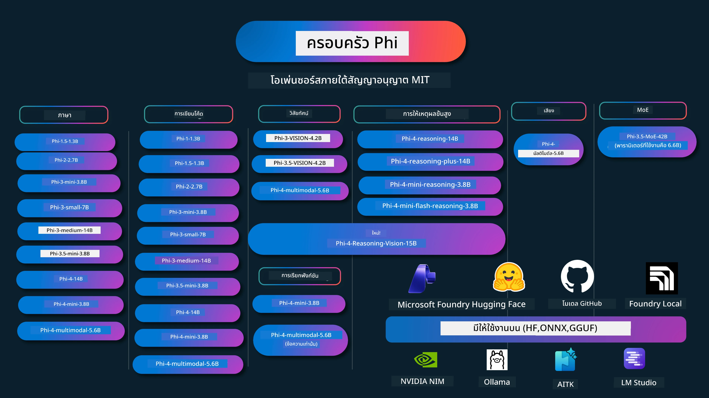

# Phi Cookbook: ตัวอย่างลงมือทำกับโมเดล Phi ของไมโครซอฟต์

[](https://codespaces.new/microsoft/phicookbook)
[](https://vscode.dev/redirect?url=vscode://ms-vscode-remote.remote-containers/cloneInVolume?url=https://github.com/microsoft/phicookbook)

[](https://GitHub.com/microsoft/phicookbook/graphs/contributors/?WT.mc_id=aiml-137032-kinfeylo)
[](https://GitHub.com/microsoft/phicookbook/issues/?WT.mc_id=aiml-137032-kinfeylo)
[](https://GitHub.com/microsoft/phicookbook/pulls/?WT.mc_id=aiml-137032-kinfeylo)
[](http://makeapullrequest.com?WT.mc_id=aiml-137032-kinfeylo)

[](https://GitHub.com/microsoft/phicookbook/watchers/?WT.mc_id=aiml-137032-kinfeylo)
[](https://GitHub.com/microsoft/phicookbook/network/?WT.mc_id=aiml-137032-kinfeylo)
[](https://GitHub.com/microsoft/phicookbook/stargazers/?WT.mc_id=aiml-137032-kinfeylo)

[](https://discord.com/invite/ByRwuEEgH4)

Phi คือชุดโมเดล AI แบบโอเพนซอร์สที่พัฒนาโดยไมโครซอฟต์

Phi เป็นโมเดลภาษาเล็ก (SLM) ที่ทรงพลังที่สุดและคุ้มค่าที่สุดในปัจจุบัน มีเกณฑ์วัดผลที่ดีมากในด้านหลายภาษา การให้เหตุผล การสร้างข้อความ/แชท การเขียนโค้ด รูปภาพ เสียง และสถานการณ์อื่น ๆ

คุณสามารถปรับใช้ Phi บนคลาวด์หรือบนอุปกรณ์ขอบเครือข่าย และสามารถสร้างแอปพลิเคชัน AI เชิงสร้างสรรค์ได้อย่างง่ายดายด้วยพลังคอมพิวเตอร์ที่จำกัด

ทำตามขั้นตอนเหล่านี้เพื่อเริ่มใช้ทรัพยากรเหล่านี้:
1. **โฟลกที่เก็บโค้ด**: คลิก [](https://GitHub.com/microsoft/phicookbook/network/?WT.mc_id=aiml-137032-kinfeylo)
2. **โคลนที่เก็บโค้ด**: `git clone https://github.com/microsoft/PhiCookBook.git`
3. [**เข้าร่วมชุมชน Microsoft AI Discord และพบปะผู้เชี่ยวชาญและนักพัฒนาร่วมกัน**](https://discord.com/invite/ByRwuEEgH4?WT.mc_id=aiml-137032-kinfeylo)



### 🌐 รองรับหลายภาษา

#### รองรับผ่าน GitHub Action (อัตโนมัติและอัปเดตอยู่เสมอ)

<!-- CO-OP TRANSLATOR LANGUAGES TABLE START -->
[อาหรับ](../ar/README.md) | [เบงกาลี](../bn/README.md) | [บัลแกเรียน](../bg/README.md) | [พม่า (เมียนมา)](../my/README.md) | [จีน (ตัวย่อ)](../zh-CN/README.md) | [จีน (ตัวเต็ม, ฮ่องกง)](../zh-HK/README.md) | [จีน (ตัวเต็ม, มาเก๊า)](../zh-MO/README.md) | [จีน (ตัวเต็ม, ไต้หวัน)](../zh-TW/README.md) | [โครเอเชีย](../hr/README.md) | [เช็ก](../cs/README.md) | [เดนมาร์ก](../da/README.md) | [ดัตช์](../nl/README.md) | [เอสโตเนีย](../et/README.md) | [ฟินแลนด์](../fi/README.md) | [ฝรั่งเศส](../fr/README.md) | [เยอรมัน](../de/README.md) | [กรีก](../el/README.md) | [ฮิบรู](../he/README.md) | [ฮินดี](../hi/README.md) | [ฮังการี](../hu/README.md) | [อินโดนีเซีย](../id/README.md) | [อิตาเลียน](../it/README.md) | [ญี่ปุ่น](../ja/README.md) | [กันนาดา](../kn/README.md) | [เขมร](../km/README.md) | [เกาหลี](../ko/README.md) | [ลิทัวเนีย](../lt/README.md) | [มาเลย์](../ms/README.md) | [มาลายาลัม](../ml/README.md) | [มาราธี](../mr/README.md) | [เนปาล](../ne/README.md) | [นีจีเรีย พิดจิน](../pcm/README.md) | [นอร์เวย์](../no/README.md) | [เปอร์เซีย (ฟาร์ซี)](../fa/README.md) | [โปแลนด์](../pl/README.md) | [โปรตุเกส (บราซิล)](../pt-BR/README.md) | [โปรตุเกส (โปรตุเกส)](../pt-PT/README.md) | [ปัญจาบี (กูรมุขี)](../pa/README.md) | [โรมาเนีย](../ro/README.md) | [รัสเซีย](../ru/README.md) | [เซอร์เบียน (ซีริลลิก)](../sr/README.md) | [สโลวัก](../sk/README.md) | [สโลวีเนีย](../sl/README.md) | [สเปน](../es/README.md) | [สวาฮิลี](../sw/README.md) | [สวีเดน](../sv/README.md) | [ทากาล็อก (ฟิลิปปินส์)](../tl/README.md) | [ทมิฬ](../ta/README.md) | [เทลูกู](../te/README.md) | [ไทย](./README.md) | [ตุรกี](../tr/README.md) | [ยูเครน](../uk/README.md) | [อูรดู](../ur/README.md) | [เวียดนาม](../vi/README.md)

> **ต้องการโคลนแบบโลคอลหรือไม่?**
>
> ที่เก็บนี้รวมการแปลมากกว่า 50 ภาษา ซึ่งเพิ่มขนาดการดาวน์โหลดอย่างมาก หากต้องการโคลนโดยไม่รวมการแปล ให้ใช้ sparse checkout:
>
> **Bash / macOS / Linux:**
> ```bash
> git clone --filter=blob:none --sparse https://github.com/microsoft/PhiCookBook.git
> cd PhiCookBook
> git sparse-checkout set --no-cone '/*' '!translations' '!translated_images'
> ```
>
> **CMD (Windows):**
> ```cmd
> git clone --filter=blob:none --sparse https://github.com/microsoft/PhiCookBook.git
> cd PhiCookBook
> git sparse-checkout set --no-cone "/*" "!translations" "!translated_images"
> ```
>
> วิธีนี้จะให้สิ่งที่คุณต้องการทั้งหมดเพื่อทำคอร์สให้เสร็จได้ด้วยการดาวน์โหลดที่เร็วยิ่งขึ้น
<!-- CO-OP TRANSLATOR LANGUAGES TABLE END -->

## สารบัญ
- บทนำ - [ยินดีต้อนรับสู่ครอบครัว Phi](./md/01.Introduction/01/01.PhiFamily.md) - [การตั้งค่าสิ่งแวดล้อมของคุณ](./md/01.Introduction/01/01.EnvironmentSetup.md) - [ความเข้าใจเทคโนโลยีหลัก](./md/01.Introduction/01/01.Understandingtech.md) - [ความปลอดภัย AI สำหรับโมเดล Phi](./md/01.Introduction/01/01.AISafety.md) - [การสนับสนุนฮาร์ดแวร์ Phi](./md/01.Introduction/01/01.Hardwaresupport.md) - [โมเดล Phi & ความพร้อมใช้งานในแพลตฟอร์มต่างๆ](./md/01.Introduction/01/01.Edgeandcloud.md) - [การใช้ Guidance-ai และ Phi](./md/01.Introduction/01/01.Guidance.md) - [โมเดลใน GitHub Marketplace](https://github.com/marketplace/models) - [แคตตาล็อกโมเดล Azure AI](https://ai.azure.com) - การทำนายผล Phi ในสภาพแวดล้อมต่างๆ - [Hugging face](./md/01.Introduction/02/01.HF.md) - [โมเดล GitHub](./md/01.Introduction/02/02.GitHubModel.md) - [แคตตาล็อกโมเดล Microsoft Foundry](./md/01.Introduction/02/03.AzureAIFoundry.md) - [Ollama](./md/01.Introduction/02/04.Ollama.md) - [AI Toolkit VSCode (AITK)](./md/01.Introduction/02/05.AITK.md) - [NVIDIA NIM](./md/01.Introduction/02/06.NVIDIA.md) - [Foundry Local](./md/01.Introduction/02/07.FoundryLocal.md) - การทำนายผล Phi Family - [การทำนาย Phi บน iOS](./md/01.Introduction/03/iOS_Inference.md) - [การทำนาย Phi บน Android](./md/01.Introduction/03/Android_Inference.md) - [การทำนาย Phi บน Jetson](./md/01.Introduction/03/Jetson_Inference.md) - [การทำนาย Phi บน AI PC](./md/01.Introduction/03/AIPC_Inference.md) - [การทำนาย Phi ด้วย Apple MLX Framework](./md/01.Introduction/03/MLX_Inference.md) - [การทำนาย Phi ใน Local Server](./md/01.Introduction/03/Local_Server_Inference.md) - [การทำนาย Phi ใน Remote Server โดยใช้ AI Toolkit](./md/01.Introduction/03/Remote_Interence.md) - [การทำนาย Phi ด้วย Rust](./md/01.Introduction/03/Rust_Inference.md) - [การทำนาย Phi--Vision ใน Local](./md/01.Introduction/03/Vision_Inference.md) - [การทำนาย Phi กับ Kaito AKS, Azure Containers (สนับสนุนอย่างเป็นทางการ)](./md/01.Introduction/03/Kaito_Inference.md) - [การแปลงค่าปริมาณ Phi Family](./md/01.Introduction/04/QuantifyingPhi.md) - [การแปลงค่าปริมาณ Phi-3.5 / 4 โดยใช้ llama.cpp](./md/01.Introduction/04/UsingLlamacppQuantifyingPhi.md) - [การแปลงค่าปริมาณ Phi-3.5 / 4 โดยใช้ขยาย Generative AI สำหรับ onnxruntime](./md/01.Introduction/04/UsingORTGenAIQuantifyingPhi.md) - [การแปลงค่าปริมาณ Phi-3.5 / 4 โดยใช้ Intel OpenVINO](./md/01.Introduction/04/UsingIntelOpenVINOQuantifyingPhi.md) - [การแปลงค่าปริมาณ Phi-3.5 / 4 โดยใช้ Apple MLX Framework](./md/01.Introduction/04/UsingAppleMLXQuantifyingPhi.md) - การประเมินผล Phi - [AI ที่รับผิดชอบ](./md/01.Introduction/05/ResponsibleAI.md) - [Microsoft Foundry สำหรับการประเมินผล](./md/01.Introduction/05/AIFoundry.md) - [การใช้ Promptflow สำหรับการประเมินผล](./md/01.Introduction/05/Promptflow.md) - RAG กับ Azure AI Search - [วิธีใช้ Phi-4-mini และ Phi-4-multimodal (RAG) กับ Azure AI Search](https://github.com/microsoft/PhiCookBook/blob/main/code/06.E2E/E2E_Phi-4-RAG-Azure-AI-Search.ipynb) - ตัวอย่างการพัฒนาแอปพลิเคชัน Phi - แอปข้อความและแชท - ตัวอย่าง Phi-4 - [📓] [แชทกับโมเดล Phi-4-mini ONNX](./md/02.Application/01.TextAndChat/Phi4/ChatWithPhi4ONNX/README.md) - [แชทกับโมเดล Phi-4 local ONNX .NET](../../md/04.HOL/dotnet/src/LabsPhi4-Chat-01OnnxRuntime) - [แอปแชทคอนโซล .NET กับ Phi-4 ONNX โดยใช้ Semantic Kernel](../../md/04.HOL/dotnet/src/LabsPhi4-Chat-02SK) - ตัวอย่าง Phi-3 / 3.5 - [แชทบอทในเครื่องในเบราว์เซอร์โดยใช้ Phi3, ONNX Runtime Web และ WebGPU](https://github.com/microsoft/onnxruntime-inference-examples/tree/main/js/chat) - [แชท OpenVino](./md/02.Application/01.TextAndChat/Phi3/E2E_OpenVino_Chat.md) - [โมเดลผสม - โต้ตอบ Phi-3-mini และ OpenAI Whisper](./md/02.Application/01.TextAndChat/Phi3/E2E_Phi-3-mini_with_whisper.md) - [MLFlow - การสร้าง wrapper และใช้ Phi-3 กับ MLFlow](./md//02.Application/01.TextAndChat/Phi3/E2E_Phi-3-MLflow.md) - [การเพิ่มประสิทธิภาพโมเดล - วิธีเพิ่มประสิทธิภาพโมเดล Phi-3-min สำหรับ ONNX Runtime Web ด้วย Olive](https://github.com/microsoft/Olive/tree/main/examples/phi3) - [แอป WinUI3 ด้วย Phi-3 mini-4k-instruct-onnx](https://github.com/microsoft/Phi3-Chat-WinUI3-Sample/) - [ตัวอย่างแอปบันทึกข้อความ Powered AI หลายโมเดลบน WinUI3](https://github.com/microsoft/ai-powered-notes-winui3-sample) - [การปรับจูนและผสานรวมโมเดล Phi-3 ที่กำหนดเองด้วย Prompt flow](./md/02.Application/01.TextAndChat/Phi3/E2E_Phi-3-FineTuning_PromptFlow_Integration.md) - [การปรับจูนและผสานรวมโมเดล Phi-3 ที่กำหนดเองด้วย Prompt flow ใน Microsoft Foundry](./md/02.Application/01.TextAndChat/Phi3/E2E_Phi-3-FineTuning_PromptFlow_Integration_AIFoundry.md) - [ประเมินโมเดล Phi-3 / Phi-3.5 ที่ปรับจูนแล้วใน Microsoft Foundry โดยเน้นหลักการ AI ที่รับผิดชอบของ Microsoft](./md/02.Application/01.TextAndChat/Phi3/E2E_Phi-3-Evaluation_AIFoundry.md) - [📓] [ตัวอย่างการทำนายภาษาของ Phi-3.5-mini-instruct (จีน/อังกฤษ)](./md/02.Application/01.TextAndChat/Phi3/phi3-instruct-demo.ipynb) - [แชทบอท RAG Phi-3.5-Instruct WebGPU](./md/02.Application/01.TextAndChat/Phi3/WebGPUWithPhi35Readme.md) - [ใช้ GPU ของ Windows เพื่อสร้างโซลูชัน Prompt flow กับ Phi-3.5-Instruct ONNX](./md/02.Application/01.TextAndChat/Phi3/UsingPromptFlowWithONNX.md) - [ใช้ Microsoft Phi-3.5 tflite เพื่อสร้างแอป Android](./md/02.Application/01.TextAndChat/Phi3/UsingPhi35TFLiteCreateAndroidApp.md) - [ตัวอย่าง Q&A .NET โดยใช้โมเดล ONNX Phi-3 ในเครื่องกับ Microsoft.ML.OnnxRuntime](../../md/04.HOL/dotnet/src/LabsPhi301) - [แอปแชทคอนโซล .NET กับ Semantic Kernel และ Phi-3](../../md/04.HOL/dotnet/src/LabsPhi302) - ตัวอย่างโค้ด SDK การทำนายผล AI Azure - ตัวอย่าง Phi-4 - [📓] [สร้างโค้ดโปรเจกต์โดยใช้ Phi-4-multimodal](./md/02.Application/02.Code/Phi4/GenProjectCode/README.md) - ตัวอย่าง Phi-3 / 3.5 - [สร้าง Visual Studio Code GitHub Copilot Chat ของคุณเองด้วย Microsoft Phi-3 Family](./md/02.Application/02.Code/Phi3/VSCodeExt/README.md) - [สร้าง Visual Studio Code Chat Copilot Agent ของคุณเองด้วย Phi-3.5 โดยใช้โมเดล GitHub](/md/02.Application/02.Code/Phi3/CreateVSCodeChatAgentWithGitHubModels.md) - ตัวอย่างการให้เหตุผลขั้นสูง - ตัวอย่าง Phi-4 - [📓] [ตัวอย่างการให้เหตุผล Phi-4-mini-reasoning หรือ Phi-4-reasoning](./md/02.Application/03.AdvancedReasoning/Phi4/AdvancedResoningPhi4mini/README.md) - [📓] [การปรับจูน Phi-4-mini-reasoning ด้วย Microsoft Olive](./md/02.Application/03.AdvancedReasoning/Phi4/AdvancedResoningPhi4mini/olive_ft_phi_4_reasoning_with_medicaldata.ipynb) - [📓] [การปรับจูน Phi-4-mini-reasoning ด้วย Apple MLX](./md/02.Application/03.AdvancedReasoning/Phi4/AdvancedResoningPhi4mini/mlx_ft_phi_4_reasoning_with_medicaldata.ipynb) - [📓] [Phi-4-mini-reasoning กับโมเดล GitHub](./md/02.Application/02.Code/Phi4r/github_models_inference.ipynb) - [📓] [Phi-4-mini-reasoning กับโมเดล Microsoft Foundry](./md/02.Application/02.Code/Phi4r/azure_models_inference.ipynb) - 
สาธิต - [Phi-4-mini สาธิตโฮสต์บน Hugging Face Spaces](https://huggingface.co/spaces/microsoft/phi-4-mini?WT.mc_id=aiml-137032-kinfeylo) - [Phi-4-multimodal สาธิตโฮสต์บน Hugginge Face Spaces](https://huggingface.co/spaces/microsoft/phi-4-multimodal?WT.mc_id=aiml-137032-kinfeylo) - ตัวอย่างวิชัน - ตัวอย่าง Phi-4 - [📓] [ใช้ Phi-4-multimodal อ่านภาพและสร้างโค้ด](./md/02.Application/04.Vision/Phi4/CreateFrontend/README.md) - ตัวอย่าง Phi-3 / 3.5 - [📓][Phi-3-vision-ภาพข้อความเป็นข้อความ](./md/02.Application/04.Vision/Phi3/E2E_Phi-3-vision-image-text-to-text-online-endpoint.ipynb) - [Phi-3-vision-ONNX](https://onnxruntime.ai/docs/genai/tutorials/phi3-v.html) - [📓][Phi-3-vision CLIP Embedding](./md/02.Application/04.Vision/Phi3/E2E_Phi-3-vision-image-text-to-text-online-endpoint.ipynb) - [DEMO: Phi-3 Recycling](https://github.com/jennifermarsman/PhiRecycling/) - [Phi-3-vision - ผู้ช่วยภาษาภาพ - กับ Phi3-Vision และ OpenVINO](https://docs.openvino.ai/nightly/notebooks/phi-3-vision-with-output.html) - [Phi-3 Vision Nvidia NIM](./md/02.Application/04.Vision/Phi3/E2E_Nvidia_NIM_Vision.md) - [Phi-3 Vision OpenVino](./md/02.Application/04.Vision/Phi3/E2E_OpenVino_Phi3Vision.md) - [📓][Phi-3.5 Vision ตัวอย่างหลายเฟรมหรือหลายภาพ](./md/02.Application/04.Vision/Phi3/phi3-vision-demo.ipynb) - [Phi-3 Vision Local ONNX Model ใช้ Microsoft.ML.OnnxRuntime .NET](../../md/04.HOL/dotnet/src/LabsPhi303) - [เมนู Phi-3 Vision Local ONNX Model ใช้ Microsoft.ML.OnnxRuntime .NET](../../md/04.HOL/dotnet/src/LabsPhi304) - ตัวอย่างการให้เหตุผล-วิชัน - Phi-4-Reasoning-Vision-15B - [📓] [ใช้ Phi-4-Reasoning-Vision-15B ตรวจจับ jaywalking](./md/02.Application/10.ReasoningVision/Phi_4_reasoning_vision_15b_Jaywalking.ipynb) - [📓] [ใช้ Phi-4-Reasoning-Vision-15B แก้ปัญหาคณิตศาสตร์](./md/02.Application/10.ReasoningVision/Phi_4_reasoning_vision_15b_Math.ipynb) - [📓] [ใช้ Phi-4-Reasoning-Vision-15B ตรวจจับ UI](./md/02.Application/10.ReasoningVision/Phi_4_reasoning_vision_15b_ui.ipynb) - ตัวอย่างคณิตศาสตร์ - ตัวอย่าง Phi-4-Mini-Flash-Reasoning-Instruct [ตัวอย่างคณิตศาสตร์กับ Phi-4-Mini-Flash-Reasoning-Instruct](./md/02.Application/09.Math/MathDemo.ipynb) - ตัวอย่างเสียง - ตัวอย่าง Phi-4 - [📓] [การแยกตัวถอดเสียงเสียงด้วย Phi-4-multimodal](./md/02.Application/05.Audio/Phi4/Transciption/README.md) - [📓] [ตัวอย่างเสียง Phi-4-multimodal](./md/02.Application/05.Audio/Phi4/Siri/demo.ipynb) - [📓] [ตัวอย่างแปลเสียงพูด Phi-4-multimodal](./md/02.Application/05.Audio/Phi4/Translate/demo.ipynb) - [.NET console application ใช้ Phi-4-multimodal เสียงวิเคราะห์ไฟล์เสียงและสร้างตัวถอดเสียง](../../md/04.HOL/dotnet/src/LabsPhi4-MultiModal-02Audio) - ตัวอย่าง MOE - ตัวอย่าง Phi-3 / 3.5 - [📓] [ตัวอย่างโมเดล Mixture of Experts (MoEs) บนโซเชียลมีเดีย Phi-3.5](./md/02.Application/06.MoE/Phi3/phi3_moe_demo.ipynb) - [📓] [สร้างระบบ Retrieval-Augmented Generation (RAG) ด้วย NVIDIA NIM Phi-3 MOE, Azure AI Search และ LlamaIndex](./md/02.Application/06.MoE/Phi3/azure-ai-search-nvidia-rag.ipynb) - - ตัวอย่าง Function Calling - ตัวอย่าง Phi-4 🆕 - [📓] [ใช้ Function Calling กับ Phi-4-mini](./md/02.Application/07.FunctionCalling/Phi4/FunctionCallingBasic/README.md) - [📓] [ใช้ Function Calling สร้าง multi-agents กับ Phi-4-mini](./md/02.Application/07.FunctionCalling/Phi4/Multiagents/Phi_4_mini_multiagent.ipynb) - [📓] [ใช้ Function Calling กับ Ollama](./md/02.Application/07.FunctionCalling/Phi4/Ollama/ollama_functioncalling.ipynb) - [📓] [ใช้ Function Calling กับ ONNX](./md/02.Application/07.FunctionCalling/Phi4/ONNX/onnx_parallel_functioncalling.ipynb) - ตัวอย่างผสมมัลติโมดัล - ตัวอย่าง Phi-4 🆕 - [📓] [ใช้ Phi-4-multimodal เป็นนักข่าวเทคโนโลยี](./md/02.Application/08.Multimodel/Phi4/TechJournalist/phi_4_mm_audio_text_publish_news.ipynb) - [.NET console application ใช้ Phi-4-multimodal วิเคราะห์ภาพ](../../md/04.HOL/dotnet/src/LabsPhi4-MultiModal-01Images) - ตัวอย่าง Fine-tuning Phi - [สถานการณ์ Fine-tuning](./md/03.FineTuning/FineTuning_Scenarios.md) - [Fine-tuning กับ RAG](./md/03.FineTuning/FineTuning_vs_RAG.md) - [Fine-tuning ให้ Phi-3 เป็นผู้เชี่ยวชาญในอุตสาหกรรม](./md/03.FineTuning/LetPhi3gotoIndustriy.md) - [Fine-tuning Phi-3 ด้วย AI Toolkit สำหรับ VS Code](./md/03.FineTuning/Finetuning_VSCodeaitoolkit.md) - [Fine-tuning Phi-3 ด้วย Azure Machine Learning Service](./md/03.FineTuning/Introduce_AzureML.md) - [Fine-tuning Phi-3 ด้วย Lora](./md/03.FineTuning/FineTuning_Lora.md) - [Fine-tuning Phi-3 ด้วย QLora](./md/03.FineTuning/FineTuning_Qlora.md) - [Fine-tuning Phi-3 ด้วย Microsoft Foundry](./md/03.FineTuning/FineTuning_AIFoundry.md) - [Fine-tuning Phi-3 ด้วย Azure ML CLI/SDK](./md/03.FineTuning/FineTuning_MLSDK.md) - [Fine-tuning ด้วย Microsoft Olive](./md/03.FineTuning/FineTuning_MicrosoftOlive.md) - [ฝึกปฏิบัติ Fine-tuning ด้วย Microsoft Olive](./md/03.FineTuning/olive-lab/readme.md) - [Fine-tuning Phi-3-vision ด้วย Weights and Bias](./md/03.FineTuning/FineTuning_Phi-3-visionWandB.md) - [Fine-tuning Phi-3 ด้วย Apple MLX Framework](./md/03.FineTuning/FineTuning_MLX.md) - [Fine-tuning Phi-3-vision (รองรับอย่างเป็นทางการ)](./md/03.FineTuning/FineTuning_Vision.md) - [Fine-Tuning Phi-3 ด้วย Kaito AKS, Azure Containers (รองรับอย่างเป็นทางการ)](./md/03.FineTuning/FineTuning_Kaito.md) - [Fine-Tuning Phi-3 และ 3.5 Vision](https://github.com/2U1/Phi3-Vision-Finetune) - ฝึกปฏิบัติ - [สำรวจโมเดลล้ำสมัย: LLMs, SLMs, การพัฒนาท้องถิ่น และอื่นๆ](https://github.com/microsoft/aitour-exploring-cutting-edge-models) - [ปลดล็อกศักยภาพ NLP: Fine-Tuning กับ Microsoft Olive](https://github.com/azure/Ignite_FineTuning_workshop) - เอกสารวิจัยและงานตีพิมพ์ทางวิชาการ - [Textbooks Are All You Need II: รายงานเทคนิค phi-1.5](https://arxiv.org/abs/2309.05463) - [รายงานเทคนิค Phi-3: โมเดลภาษาที่มีประสิทธิภาพสูงบนโทรศัพท์ของคุณ](https://arxiv.org/abs/2404.14219) - [รายงานเทคนิค Phi-4](https://arxiv.org/abs/2412.08905) - [รายงานเทคนิค Phi-4-Mini: โมเดลภาษามัลติโมดัลกะทัดรัดแต่ทรงพลังด้วย Mixture-of-LoRAs](https://arxiv.org/abs/2503.01743) - [การปรับแต่งโมเดลภาษาขนาดเล็กเพื่อรองรับ Function-Calling ในรถยนต์](https://arxiv.org/abs/2501.02342) - [(WhyPHI) Fine-Tuning PHI-3 สำหรับการตอบคำถามแบบหลายตัวเลือก: วิธีการ ผลลัพธ์ และความท้าทาย](https://arxiv.org/abs/2501.01588) - [รายงานเทคนิค Phi-4-reasoning](https://www.microsoft.com/en-us/research/wp-content/uploads/2025/04/phi_4_reasoning.pdf)
- [รายงานทางเทคนิค Phi-4-mini-reasoning](https://huggingface.co/microsoft/Phi-4-mini-reasoning/blob/main/Phi-4-Mini-Reasoning.pdf)
# Phi Cookbook: ตัวอย่างปฏิบัติด้วยโมเดล Phi ของ Microsoft

[](https://codespaces.new/microsoft/phicookbook)
[](https://vscode.dev/redirect?url=vscode://ms-vscode-remote.remote-containers/cloneInVolume?url=https://github.com/microsoft/phicookbook)

[](https://GitHub.com/microsoft/phicookbook/graphs/contributors/?WT.mc_id=aiml-137032-kinfeylo)
[](https://GitHub.com/microsoft/phicookbook/issues/?WT.mc_id=aiml-137032-kinfeylo)
[](https://GitHub.com/microsoft/phicookbook/pulls/?WT.mc_id=aiml-137032-kinfeylo)
[](http://makeapullrequest.com?WT.mc_id=aiml-137032-kinfeylo)

[](https://GitHub.com/microsoft/phicookbook/watchers/?WT.mc_id=aiml-137032-kinfeylo)
[](https://GitHub.com/microsoft/phicookbook/network/?WT.mc_id=aiml-137032-kinfeylo)
[](https://GitHub.com/microsoft/phicookbook/stargazers/?WT.mc_id=aiml-137032-kinfeylo)

[](https://discord.com/invite/ByRwuEEgH4)

Phi เป็นชุดโมเดล AI โอเพนซอร์สที่พัฒนาโดย Microsoft

Phi เป็นโมเดลภาษาขนาดเล็ก (SLM) ที่ทรงพลังและคุ้มค่าที่สุดในขณะนี้ พร้อมด้วยเกณฑ์มาตรฐานที่ดีมากในหลายภาษา, การให้เหตุผล, การสร้างข้อความ/แชท, การเขียนโค้ด, ภาพ, เสียง และสถานการณ์อื่นๆ

คุณสามารถนำ Phi ไปปรับใช้บนคลาวด์หรืออุปกรณ์ขอบเครือข่าย และคุณสามารถสร้างแอปพลิเคชัน AI เชิงสร้างสรรค์ได้อย่างง่ายดายด้วยกำลังประมวลผลที่จำกัด

ทำตามขั้นตอนเหล่านี้เพื่อเริ่มต้นใช้งานแหล่งข้อมูลเหล่านี้:
1. **Fork ที่เก็บข้อมูล**: คลิก [](https://GitHub.com/microsoft/phicookbook/network/?WT.mc_id=aiml-137032-kinfeylo)
2. **โคลนที่เก็บข้อมูล**: `git clone https://github.com/microsoft/PhiCookBook.git`
3. [**เข้าร่วมชุมชน Microsoft AI Discord และพบปะผู้เชี่ยวชาญและนักพัฒนาร่วมกัน**](https://discord.com/invite/ByRwuEEgH4?WT.mc_id=aiml-137032-kinfeylo)


### 🌐 รองรับหลายภาษา

#### รองรับผ่าน GitHub Action (อัตโนมัติและอัปเดตเสมอ)

<!-- CO-OP TRANSLATOR LANGUAGES TABLE START -->
[อาหรับ](../ar/README.md) | [เบงกาลี](../bn/README.md) | [บัลแกเรีย](../bg/README.md) | [พม่า (เมียนมาร์)](../my/README.md) | [จีน (ตัวย่อ)](../zh-CN/README.md) | [จีน (ตัวเต็ม ฮ่องกง)](../zh-HK/README.md) | [จีน (ตัวเต็ม มาเก๊า)](../zh-MO/README.md) | [จีน (ตัวเต็ม ไต้หวัน)](../zh-TW/README.md) | [โครเอเชีย](../hr/README.md) | [เช็ก](../cs/README.md) | [เดนมาร์ก](../da/README.md) | [ดัตช์](../nl/README.md) | [เอสโตเนีย](../et/README.md) | [ฟินแลนด์](../fi/README.md) | [ฝรั่งเศส](../fr/README.md) | [เยอรมัน](../de/README.md) | [กรีก](../el/README.md) | [ฮีบรู](../he/README.md) | [ฮินดี](../hi/README.md) | [ฮังการี](../hu/README.md) | [อินโดนีเซีย](../id/README.md) | [อิตาลี](../it/README.md) | [ญี่ปุ่น](../ja/README.md) | [กันนาดา](../kn/README.md) | [เขมร](../km/README.md) | [เกาหลี](../ko/README.md) | [ลิทัวเนีย](../lt/README.md) | [มาเลย์](../ms/README.md) | [มาลายาลัม](../ml/README.md) | [มราฐี](../mr/README.md) | [เนปาล](../ne/README.md) | [ภาษาอังกฤษไนจีเรีย (Pidgin)](../pcm/README.md) | [นอร์เวย์](../no/README.md) | [เปอร์เซีย (ฟาร์ซี)](../fa/README.md) | [โปแลนด์](../pl/README.md) | [โปรตุเกส (บราซิล)](../pt-BR/README.md) | [โปรตุเกส (โปรตุเกส)](../pt-PT/README.md) | [ปัญจาบี (กูรมุกชี)](../pa/README.md) | [โรมาเนีย](../ro/README.md) | [รัสเซีย](../ru/README.md) | [เซอร์เบีย (ซิริลลิก)](../sr/README.md) | [สโลวัก](../sk/README.md) | [สโลเวเนีย](../sl/README.md) | [สเปน](../es/README.md) | [สวาฮิลี](../sw/README.md) | [สวีเดน](../sv/README.md) | [ทากาล็อก (ฟิลิปปินส์)](../tl/README.md) | [ทมิฬ](../ta/README.md) | [เทลูกู](../te/README.md) | [ไทย](./README.md) | [ตุรกี](../tr/README.md) | [ยูเครน](../uk/README.md) | [อูรดู](../ur/README.md) | [เวียดนาม](../vi/README.md)

> **อยากโคลนแบบโลคัล?**
>
> ที่เก็บนี้รวมการแปลกว่า 50 ภาษา ทำให้ขนาดดาวน์โหลดเพิ่มขึ้นมาก เพื่อโคลนโดยไม่รวมการแปล ให้ใช้ sparse checkout:
>
> **Bash / macOS / Linux:**
> ```bash
> git clone --filter=blob:none --sparse https://github.com/microsoft/PhiCookBook.git
> cd PhiCookBook
> git sparse-checkout set --no-cone '/*' '!translations' '!translated_images'
> ```
>
> **CMD (Windows):**
> ```cmd
> git clone --filter=blob:none --sparse https://github.com/microsoft/PhiCookBook.git
> cd PhiCookBook
> git sparse-checkout set --no-cone "/*" "!translations" "!translated_images"
> ```
>
> วิธีนี้จะได้ทุกอย่างที่ต้องการเพื่อทำคอร์สให้เสร็จอย่างรวดเร็วขึ้นมาก
<!-- CO-OP TRANSLATOR LANGUAGES TABLE END -->

## สารบัญ

## การใช้โมเดล Phi

### Phi บน Microsoft Foundry

คุณสามารถเรียนรู้วิธีใช้ Microsoft Phi และวิธีสร้างโซลูชันครบวงจรในอุปกรณ์ฮาร์ดแวร์ต่างๆ ของคุณ เพื่อสัมผัส Phi ด้วยตัวเอง เริ่มจากลองเล่นกับโมเดลและปรับแต่ง Phi ให้เหมาะกับสถานการณ์ของคุณโดยใช้ [Microsoft Foundry Azure AI Model Catalog](https://aka.ms/phi3-azure-ai) คุณสามารถเรียนรู้เพิ่มเติมได้ที่ เริ่มต้นใช้งานกับ [Microsoft Foundry](/md/02.QuickStart/AzureAIFoundry_QuickStart.md)

**สนามทดลอง**
แต่ละโมเดลมีสนามทดลองเฉพาะเพื่อทดสอบโมเดล [Azure AI Playground](https://aka.ms/try-phi3).

### Phi บนโมเดล GitHub

คุณสามารถเรียนรู้วิธีใช้ Microsoft Phi และวิธีสร้างโซลูชันครบวงจรในอุปกรณ์ฮาร์ดแวร์ต่างๆ ของคุณ เพื่อสัมผัส Phi ด้วยตัวเอง เริ่มจากทดลองเล่นกับโมเดลและปรับแต่ง Phi ให้เหมาะกับสถานการณ์ของคุณโดยใช้ [GitHub Model Catalog](https://github.com/marketplace/models?WT.mc_id=aiml-137032-kinfeylo) คุณสามารถเรียนรู้เพิ่มเติมได้ที่ เริ่มต้นใช้งานกับ [GitHub Model Catalog](/md/02.QuickStart/GitHubModel_QuickStart.md)

**สนามทดลอง**
แต่ละโมเดลมี [สนามทดลองเพื่อทดสอบโมเดล](/md/02.QuickStart/GitHubModel_QuickStart.md).

### Phi บน Hugging Face

คุณยังสามารถค้นหาโมเดลบน [Hugging Face](https://huggingface.co/microsoft)

**สนามทดลอง**
 [สนามทดลอง Hugging Chat](https://huggingface.co/chat/models/microsoft/Phi-3-mini-4k-instruct)

 ## 🎒 คอร์สอื่นๆ

ทีมของเราผลิตคอร์สอื่นๆ อีกมาก! ตรวจสอบได้ที่:

<!-- CO-OP TRANSLATOR OTHER COURSES START -->
### LangChain
[](https://aka.ms/langchain4j-for-beginners)
[](https://aka.ms/langchainjs-for-beginners?WT.mc_id=m365-94501-dwahlin)
[](https://github.com/microsoft/langchain-for-beginners?WT.mc_id=m365-94501-dwahlin)
---

### Azure / Edge / MCP / ตัวแทน
[](https://github.com/microsoft/AZD-for-beginners?WT.mc_id=academic-105485-koreyst)
[](https://github.com/microsoft/edgeai-for-beginners?WT.mc_id=academic-105485-koreyst)
[](https://github.com/microsoft/mcp-for-beginners?WT.mc_id=academic-105485-koreyst)
[](https://github.com/microsoft/ai-agents-for-beginners?WT.mc_id=academic-105485-koreyst)

---
 
### ชุดคอร์ส Generative AI
[](https://github.com/microsoft/generative-ai-for-beginners?WT.mc_id=academic-105485-koreyst)
[-9333EA?style=for-the-badge&labelColor=E5E7EB&color=9333EA)](https://github.com/microsoft/Generative-AI-for-beginners-dotnet?WT.mc_id=academic-105485-koreyst)
[-C084FC?style=for-the-badge&labelColor=E5E7EB&color=C084FC)](https://github.com/microsoft/generative-ai-for-beginners-java?WT.mc_id=academic-105485-koreyst)
[-E879F9?style=for-the-badge&labelColor=E5E7EB&color=E879F9)](https://github.com/microsoft/generative-ai-with-javascript?WT.mc_id=academic-105485-koreyst)

---
 
### การเรียนรู้หลัก
[](https://aka.ms/ml-beginners?WT.mc_id=academic-105485-koreyst)
[](https://aka.ms/datascience-beginners?WT.mc_id=academic-105485-koreyst)
[](https://aka.ms/ai-beginners?WT.mc_id=academic-105485-koreyst)
[](https://github.com/microsoft/Security-101?WT.mc_id=academic-96948-sayoung)
[](https://aka.ms/webdev-beginners?WT.mc_id=academic-105485-koreyst)
[](https://aka.ms/iot-beginners?WT.mc_id=academic-105485-koreyst)
[](https://github.com/microsoft/xr-development-for-beginners?WT.mc_id=academic-105485-koreyst)

---
 
### ชุดบทเรียน Copilot
[](https://aka.ms/GitHubCopilotAI?WT.mc_id=academic-105485-koreyst)
[](https://github.com/microsoft/mastering-github-copilot-for-dotnet-csharp-developers?WT.mc_id=academic-105485-koreyst)
[](https://github.com/microsoft/CopilotAdventures?WT.mc_id=academic-105485-koreyst)
<!-- CO-OP TRANSLATOR OTHER COURSES END -->

## ปัญญาประดิษฐ์ที่รับผิดชอบ

ไมโครซอฟท์มุ่งมั่นในการช่วยลูกค้าของเราใช้ผลิตภัณฑ์ AI อย่างรับผิดชอบ, แบ่งปันบทเรียนของเรา, และสร้างความสัมพันธ์ที่เชื่อถือได้ผ่านเครื่องมือต่าง ๆ เช่น Transparency Notes และ Impact Assessments ทรัพยากรเหล่านี้ส่วนใหญ่อยู่ที่ [https://aka.ms/RAI](https://aka.ms/RAI)  
แนวทางการพัฒนา AI ที่รับผิดชอบของไมโครซอฟท์ตั้งอยู่บนหลักการ AI ที่เป็นธรรม เชื่อถือได้และปลอดภัย ความเป็นส่วนตัวและความปลอดภัย ความครอบคลุม ความโปร่งใส และความรับผิดชอบ

โมเดลขนาดใหญ่ของภาษา รูปภาพ และเสียง - เช่นที่ใช้ในตัวอย่างนี้ - อาจมีพฤติกรรมที่ไม่เป็นธรรม ไม่น่าเชื่อถือ หรือไม่เหมาะสม ซึ่งอาจก่อให้เกิดอันตรายได้ โปรดดู [Azure OpenAI service Transparency note](https://learn.microsoft.com/legal/cognitive-services/openai/transparency-note?tabs=text) เพื่อรับทราบเกี่ยวกับความเสี่ยงและข้อจำกัด

วิธีแนะนำเพื่อบรรเทาความเสี่ยงเหล่านี้คือการมีระบบความปลอดภัยในสถาปัตยกรรมของคุณที่สามารถตรวจจับและป้องกันพฤติกรรมที่เป็นอันตราย [Azure AI Content Safety](https://learn.microsoft.com/azure/ai-services/content-safety/overview) เป็นชั้นป้องกันอิสระ ที่สามารถตรวจสอบเนื้อหาที่เป็นอันตรายซึ่งสร้างโดยผู้ใช้และ AI ในแอปพลิเคชันและบริการ Azure AI Content Safety มีทั้ง API สำหรับข้อความและภาพที่ช่วยตรวจจับเนื้อหาที่เป็นอันตราย ภายใน Microsoft Foundry บริการ Content Safety ช่วยให้คุณสามารถดู สำรวจ และลองใช้โค้ดตัวอย่างสำหรับตรวจจับเนื้อหาที่เป็นอันตรายในหลายรูปแบบ เอกสาร [quickstart documentation](https://learn.microsoft.com/azure/ai-services/content-safety/quickstart-text?tabs=visual-studio%2Clinux&pivots=programming-language-rest) ต่อไปนี้จะชี้แนะขั้นตอนการทำคำขอไปยังบริการนี้

อีกประเด็นที่ควรพิจารณาคือประสิทธิภาพโดยรวมของแอปพลิเคชัน สำหรับแอปพลิเคชันที่ใช้หลายรูปแบบและหลายโมเดล, เราถือว่าประสิทธิภาพหมายถึงระบบทำงานได้ตามที่คุณและผู้ใช้คาดหวัง รวมถึงไม่สร้างผลลัพธ์ที่เป็นอันตรายด้วย สิ่งสำคัญคือการประเมินประสิทธิภาพโดยรวมของแอปของคุณโดยใช้ [Performance and Quality and Risk and Safety evaluators](https://learn.microsoft.com/azure/ai-studio/concepts/evaluation-metrics-built-in) นอกจากนี้คุณยังสามารถสร้างและประเมินด้วย [custom evaluators](https://learn.microsoft.com/azure/ai-studio/how-to/develop/evaluate-sdk#custom-evaluators) ได้อีกด้วย

คุณสามารถประเมินแอป AI ของคุณในสภาพแวดล้อมการพัฒนาด้วย [Azure AI Evaluation SDK](https://microsoft.github.io/promptflow/index.html) เมื่อมีชุดข้อมูลทดสอบหรือเป้าหมาย การสร้างสรรค์ของแอป generative AI จะถูกประเมินเชิงปริมาณด้วยตัวประเมินพร้อมใช้งานหรือตัวประเมินปรับแต่งเองของคุณ เพื่อเริ่มต้นใช้งาน Azure AI Evaluation SDK สำหรับประเมินระบบของคุณ คุณสามารถทำตาม [quickstart guide](https://learn.microsoft.com/azure/ai-studio/how-to/develop/flow-evaluate-sdk) เมื่อคุณรันการประเมินเสร็จแล้ว คุณสามารถ [ดูผลใน Microsoft Foundry](https://learn.microsoft.com/azure/ai-studio/how-to/evaluate-flow-results) ได้

## เครื่องหมายการค้า

โปรเจกต์นี้อาจมีเครื่องหมายการค้าหรือโลโก้ของโปรเจกต์ สินค้า หรือบริการ  
การใช้เครื่องหมายการค้าหรือโลโก้ของไมโครซอฟท์ที่ได้รับอนุญาตนั้นเป็นไปตามและต้องปฏิบัติตาม [Microsoft's Trademark & Brand Guidelines](https://www.microsoft.com/legal/intellectualproperty/trademarks/usage/general)  
การใช้เครื่องหมายการค้าหรือโลโก้ของไมโครซอฟท์ในเวอร์ชันที่แก้ไขของโปรเจกต์นี้ต้องไม่ทำให้เกิดความสับสนหรือสื่อว่ามีการสนับสนุนจากไมโครซอฟท์ การใช้เครื่องหมายการค้าหรือโลโก้ของบุคคลที่สามต้องเป็นไปตามนโยบายของบุคคลที่สามนั้น ๆ

## ขอรับความช่วยเหลือ

หากคุณติดขัดหรือต้องการคำถามเกี่ยวกับการสร้างแอป AI เข้าร่วมได้ที่:

[](https://aka.ms/foundry/discord)

หากคุณมีข้อเสนอแนะหรือพบข้อผิดพลาดขณะสร้าง โปรดเยี่ยมชม:

[](https://aka.ms/foundry/forum)

---

<!-- CO-OP TRANSLATOR DISCLAIMER START -->
**ข้อปฏิเสธความรับผิดชอบ**:  
เอกสารนี้ได้รับการแปลโดยใช้บริการแปลภาษาอัตโนมัติ [Co-op Translator](https://github.com/Azure/co-op-translator) แม้ว่าเราจะพยายามให้ความถูกต้องสูงสุด โปรดทราบว่าการแปลโดยอัตโนมัติอาจมีข้อผิดพลาดหรือความไม่ถูกต้อง เอกสารต้นฉบับในภาษาต้นทางถือเป็นแหล่งข้อมูลที่เชื่อถือได้ สำหรับข้อมูลที่สำคัญ ขอแนะนำให้ใช้การแปลโดยผู้เชี่ยวชาญมนุษย์โดยตรง เราจะไม่รับผิดชอบต่อความเข้าใจผิดหรือการตีความผิดที่เกิดจากการใช้การแปลนี้
<!-- CO-OP TRANSLATOR DISCLAIMER END -->