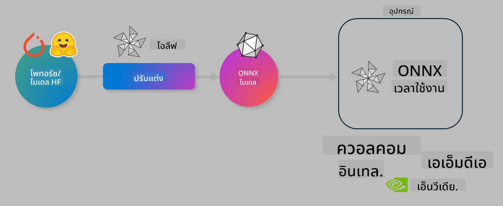

<!--
CO_OP_TRANSLATOR_METADATA:
{
  "original_hash": "6bbe47de3b974df7eea29dfeccf6032b",
  "translation_date": "2025-05-09T04:24:58+00:00",
  "source_file": "code/03.Finetuning/olive-lab/readme.md",
  "language_code": "th"
}
-->
# Lab. ปรับแต่งโมเดล AI สำหรับการทำ inference บนอุปกรณ์

## บทนำ

> [!IMPORTANT]
> ห้องปฏิบัติการนี้ต้องใช้ **Nvidia A10 หรือ A100 GPU** พร้อมไดรเวอร์และ CUDA toolkit (เวอร์ชัน 12 ขึ้นไป) ที่ติดตั้งไว้

> [!NOTE]
> ห้องปฏิบัติการนี้ใช้เวลาประมาณ **35 นาที** เพื่อให้คุณได้ทดลองใช้งานจริงเกี่ยวกับแนวคิดหลักในการปรับแต่งโมเดลสำหรับการทำ inference บนอุปกรณ์ด้วย OLIVE

## วัตถุประสงค์การเรียนรู้

เมื่อจบห้องปฏิบัติการนี้ คุณจะสามารถใช้ OLIVE เพื่อ:

- ทำ Quantize โมเดล AI โดยใช้วิธี AWQ quantization
- ปรับแต่งโมเดล AI ให้เหมาะกับงานเฉพาะทาง
- สร้าง LoRA adapters (โมเดลที่ปรับแต่งแล้ว) เพื่อให้ inference บนอุปกรณ์ทำงานได้อย่างมีประสิทธิภาพบน ONNX Runtime

### Olive คืออะไร

Olive (*O*NNX *live*) คือชุดเครื่องมือสำหรับการปรับแต่งโมเดลพร้อม CLI ที่ช่วยให้คุณส่งมอบโมเดลสำหรับ ONNX runtime +++https://onnxruntime.ai+++ ด้วยคุณภาพและประสิทธิภาพ



อินพุตของ Olive มักจะเป็นโมเดล PyTorch หรือ Hugging Face และเอาต์พุตจะเป็นโมเดล ONNX ที่ถูกปรับแต่งแล้วซึ่งทำงานบนอุปกรณ์ (เป้าหมายการใช้งาน) ที่รัน ONNX runtime Olive จะปรับแต่งโมเดลให้เหมาะกับ AI accelerator (NPU, GPU, CPU) ของอุปกรณ์ที่จัดหาโดยผู้ผลิตฮาร์ดแวร์ เช่น Qualcomm, AMD, Nvidia หรือ Intel

Olive จะรัน *workflow* ซึ่งเป็นลำดับขั้นตอนของงานปรับแต่งโมเดลที่เรียกว่า *passes* - ตัวอย่าง passes ได้แก่ การบีบอัดโมเดล, การจับกราฟ, การ quantization, การปรับแต่งกราฟ แต่ละ pass มีชุดพารามิเตอร์ที่สามารถปรับแต่งเพื่อให้ได้เมตริกที่ดีที่สุด เช่น ความแม่นยำและความหน่วงเวลาที่ถูกประเมินโดย evaluator ที่เกี่ยวข้อง Olive ใช้กลยุทธ์การค้นหาที่ใช้ algorithm เพื่อปรับแต่ละ pass ทีละตัวหรือชุดของ passes พร้อมกัน

#### ข้อดีของ Olive

- **ลดความยุ่งยากและเวลา** ในการทดลองด้วยตนเองแบบ trial-and-error กับเทคนิคต่างๆ สำหรับการปรับแต่งกราฟ, การบีบอัด และการ quantization กำหนดข้อจำกัดด้านคุณภาพและประสิทธิภาพ แล้วให้ Olive ค้นหาโมเดลที่ดีที่สุดให้อัตโนมัติ
- มี **คอมโพเนนต์ปรับแต่งโมเดลมากกว่า 40 รายการ** ครอบคลุมเทคนิคล้ำสมัยใน quantization, การบีบอัด, การปรับแต่งกราฟ และการ fine-tuning
- มี CLI ที่ใช้งานง่ายสำหรับงานปรับแต่งโมเดลทั่วไป เช่น olive quantize, olive auto-opt, olive finetune
- มีระบบแพ็กเกจและการ deploy โมเดลในตัว
- รองรับการสร้างโมเดลสำหรับ **Multi LoRA serving**
- สร้าง workflow ด้วย YAML/JSON เพื่อจัดการงานปรับแต่งและ deploy โมเดล
- รวมการทำงานร่วมกับ **Hugging Face** และ **Azure AI**
- มีระบบ **caching** ในตัวเพื่อช่วย **ลดค่าใช้จ่าย**

## คำแนะนำในการทำห้องปฏิบัติการ
> [!NOTE]
> โปรดตรวจสอบว่าคุณได้จัดเตรียม Azure AI Hub และ Project พร้อมตั้งค่า A100 compute ตาม Lab 1 แล้ว

### ขั้นตอนที่ 0: เชื่อมต่อกับ Azure AI Compute

คุณจะเชื่อมต่อกับ Azure AI compute ผ่านฟีเจอร์ remote ใน **VS Code**

1. เปิดแอปพลิเคชัน **VS Code** บนเดสก์ท็อปของคุณ
1. เปิด **command palette** โดยกด **Shift+Ctrl+P**
1. ใน command palette ค้นหา **AzureML - remote: Connect to compute instance in New Window**
1. ทำตามคำแนะนำบนหน้าจอเพื่อเชื่อมต่อกับ Compute โดยจะต้องเลือก Azure Subscription, Resource Group, Project และชื่อ Compute ที่คุณตั้งไว้ใน Lab 1
1. เมื่อเชื่อมต่อกับ Azure ML Compute node แล้ว จะมีแสดงที่ **มุมล่างซ้ายของ Visual Code** `><Azure ML: Compute Name`

### ขั้นตอนที่ 1: โคลน repo นี้

ใน VS Code คุณสามารถเปิดเทอร์มินัลใหม่ด้วย **Ctrl+J** แล้วโคลน repo นี้:

ในเทอร์มินัลจะเห็นพรอมต์

```
azureuser@computername:~/cloudfiles/code$ 
```
โคลนโซลูชัน

```bash
cd ~/localfiles
git clone https://github.com/microsoft/phi-3cookbook.git
```

### ขั้นตอนที่ 2: เปิดโฟลเดอร์ใน VS Code

เพื่อเปิด VS Code ในโฟลเดอร์ที่เกี่ยวข้อง ให้รันคำสั่งต่อไปนี้ในเทอร์มินัล ซึ่งจะเปิดหน้าต่างใหม่:

```bash
code phi-3cookbook/code/04.Finetuning/Olive-lab
```

อีกทางเลือกหนึ่งคือเปิดโฟลเดอร์โดยเลือก **File** > **Open Folder**

### ขั้นตอนที่ 3: ติดตั้ง Dependencies

เปิดหน้าต่างเทอร์มินัลใน VS Code บน Azure AI Compute Instance ของคุณ (เคล็ดลับ: **Ctrl+J**) และรันคำสั่งต่อไปนี้เพื่อติดตั้ง dependencies:

```bash
conda create -n olive-ai python=3.11 -y
conda activate olive-ai
pip install -r requirements.txt
az extension remove -n azure-cli-ml
az extension add -n ml
```

> [!NOTE]
> จะใช้เวลาประมาณ ~5 นาทีในการติดตั้ง dependencies ทั้งหมด

ในห้องปฏิบัติการนี้คุณจะดาวน์โหลดและอัปโหลดโมเดลไปยัง Azure AI Model catalog ดังนั้นเพื่อเข้าถึง model catalog คุณต้องล็อกอิน Azure ด้วยคำสั่งนี้:

```bash
az login
```

> [!NOTE]
> ขณะล็อกอิน คุณจะถูกขอให้เลือก subscription โปรดตั้งค่า subscription ให้ตรงกับที่จัดเตรียมไว้สำหรับห้องปฏิบัติการนี้

### ขั้นตอนที่ 4: รันคำสั่ง Olive

เปิดหน้าต่างเทอร์มินัลใน VS Code บน Azure AI Compute Instance ของคุณ (เคล็ดลับ: **Ctrl+J**) และตรวจสอบให้แน่ใจว่าได้เปิดใช้งาน environment `olive-ai` แล้ว:

```bash
conda activate olive-ai
```

จากนั้นรันคำสั่ง Olive ต่อไปนี้ในบรรทัดคำสั่ง

1. **ตรวจสอบข้อมูล:** ในตัวอย่างนี้คุณจะทำการ fine-tune โมเดล Phi-3.5-Mini เพื่อให้เชี่ยวชาญในการตอบคำถามเกี่ยวกับการเดินทาง โค้ดด้านล่างจะแสดงเรคคอร์ดแรกๆ ของชุดข้อมูล ซึ่งเป็นฟอร์แมต JSON lines:
   
    ```bash
    head data/data_sample_travel.jsonl
    ```
1. **Quantize โมเดล:** ก่อนฝึกสอนโมเดล คุณจะทำการ quantize ด้วยคำสั่งนี้ซึ่งใช้เทคนิคที่เรียกว่า Active Aware Quantization (AWQ) +++https://arxiv.org/abs/2306.00978+++. AWQ จะ quantize น้ำหนักโมเดลโดยพิจารณาการกระตุ้นที่เกิดขึ้นระหว่างการ inference ซึ่งหมายความว่ากระบวนการ quantization จะคำนึงถึงการกระจายข้อมูลจริงใน activation ทำให้รักษาความแม่นยำของโมเดลได้ดีกว่าการ quantize น้ำหนักแบบดั้งเดิม
    
    ```bash
    olive quantize \
       --model_name_or_path microsoft/Phi-3.5-mini-instruct \
       --trust_remote_code \
       --algorithm awq \
       --output_path models/phi/awq \
       --log_level 1
    ```
    
    ใช้เวลาประมาณ **~8 นาที** ในการทำ AWQ quantization ซึ่งจะ **ลดขนาดโมเดลจาก ~7.5GB เหลือ ~2.5GB**
   
   ในห้องปฏิบัติการนี้ เราจะแสดงวิธีนำเข้าโมเดลจาก Hugging Face (ตัวอย่าง: `microsoft/Phi-3.5-mini-instruct`). However, Olive also allows you to input models from the Azure AI catalog by updating the `model_name_or_path` argument to an Azure AI asset ID (for example:  `azureml://registries/azureml/models/Phi-3.5-mini-instruct/versions/4`). 

1. **Train the model:** Next, the `olive finetune` คำสั่งนี้จะทำการ fine-tune โมเดลที่ quantize แล้ว การ quantize ก่อนการ fine-tune แทนที่จะทำหลังจากนั้นจะให้ความแม่นยำที่ดีกว่าเพราะกระบวนการ fine-tune จะช่วยกู้คืนส่วนที่สูญเสียจากการ quantize
    
    ```bash
    olive finetune \
        --method lora \
        --model_name_or_path models/phi/awq \
        --data_files "data/data_sample_travel.jsonl" \
        --data_name "json" \
        --text_template "<|user|>\n{prompt}<|end|>\n<|assistant|>\n{response}<|end|>" \
        --max_steps 100 \
        --output_path ./models/phi/ft \
        --log_level 1
    ```
    
    ใช้เวลาประมาณ **~6 นาที** ในการทำ Fine-tuning (จำนวน 100 ขั้นตอน)

1. **Optimize:** หลังจากฝึกสอนโมเดลเสร็จแล้ว คุณจะทำการ optimize โมเดลโดยใช้คำสั่ง `auto-opt` command, which will capture the ONNX graph and automatically perform a number of optimizations to improve the model performance for CPU by compressing the model and doing fusions. It should be noted, that you can also optimize for other devices such as NPU or GPU by just updating the `--device` and `--provider` ของ Olive - แต่สำหรับห้องปฏิบัติการนี้เราจะใช้ CPU

    ```bash
    olive auto-opt \
       --model_name_or_path models/phi/ft/model \
       --adapter_path models/phi/ft/adapter \
       --device cpu \
       --provider CPUExecutionProvider \
       --use_ort_genai \
       --output_path models/phi/onnx-ao \
       --log_level 1
    ```
    
    ใช้เวลาประมาณ **~5 นาที** ในการทำ optimization

### ขั้นตอนที่ 5: ทดสอบการ inference โมเดลอย่างรวดเร็ว

เพื่อทดสอบการ inference โมเดล ให้สร้างไฟล์ Python ในโฟลเดอร์ของคุณชื่อ **app.py** แล้วคัดลอกโค้ดต่อไปนี้ไปวาง:

```python
import onnxruntime_genai as og
import numpy as np

print("loading model and adapters...", end="", flush=True)
model = og.Model("models/phi/onnx-ao/model")
adapters = og.Adapters(model)
adapters.load("models/phi/onnx-ao/model/adapter_weights.onnx_adapter", "travel")
print("DONE!")

tokenizer = og.Tokenizer(model)
tokenizer_stream = tokenizer.create_stream()

params = og.GeneratorParams(model)
params.set_search_options(max_length=100, past_present_share_buffer=False)
user_input = "what is the best thing to see in chicago"
params.input_ids = tokenizer.encode(f"<|user|>\n{user_input}<|end|>\n<|assistant|>\n")

generator = og.Generator(model, params)

generator.set_active_adapter(adapters, "travel")

print(f"{user_input}")

while not generator.is_done():
    generator.compute_logits()
    generator.generate_next_token()

    new_token = generator.get_next_tokens()[0]
    print(tokenizer_stream.decode(new_token), end='', flush=True)

print("\n")
```

รันโค้ดด้วยคำสั่ง:

```bash
python app.py
```

### ขั้นตอนที่ 6: อัปโหลดโมเดลไปยัง Azure AI

การอัปโหลดโมเดลไปยัง Azure AI model repository จะช่วยให้โมเดลสามารถแชร์กับสมาชิกทีมพัฒนาคนอื่นๆ และยังจัดการเวอร์ชันของโมเดลด้วย ในการอัปโหลดโมเดลให้รันคำสั่งต่อไปนี้:

> [!NOTE]
> อัปเดต `{}` placeholders with the name of your resource group and Azure AI Project Name. 

To find your resource group `"resourceGroup"` และชื่อโปรเจกต์ Azure AI จากนั้นรันคำสั่งนี้

```
az ml workspace show
```

หรือโดยไปที่ +++ai.azure.com+++ แล้วเลือก **management center** **project** **overview**

อัปเดตช่องว่าง `{}` ด้วยชื่อ resource group และชื่อ Azure AI Project ของคุณ

```bash
az ml model create \
    --name ft-for-travel \
    --version 1 \
    --path ./models/phi/onnx-ao \
    --resource-group {RESOURCE_GROUP_NAME} \
    --workspace-name {PROJECT_NAME}
```

คุณจะเห็นโมเดลที่อัปโหลดและสามารถ deploy โมเดลได้ที่ https://ml.azure.com/model/list

**ข้อจำกัดความรับผิดชอบ**:  
เอกสารนี้ได้รับการแปลโดยใช้บริการแปลภาษา AI [Co-op Translator](https://github.com/Azure/co-op-translator) แม้ว่าเราจะพยายามให้ความถูกต้องสูงสุด โปรดทราบว่าการแปลอัตโนมัติอาจมีข้อผิดพลาดหรือความไม่ถูกต้อง เอกสารต้นฉบับในภาษาดั้งเดิมควรถือเป็นแหล่งข้อมูลที่เชื่อถือได้ สำหรับข้อมูลสำคัญ ขอแนะนำให้ใช้บริการแปลโดยผู้เชี่ยวชาญด้านภาษามนุษย์ เราจะไม่รับผิดชอบต่อความเข้าใจผิดหรือการตีความที่ผิดพลาดใด ๆ ที่เกิดจากการใช้การแปลนี้