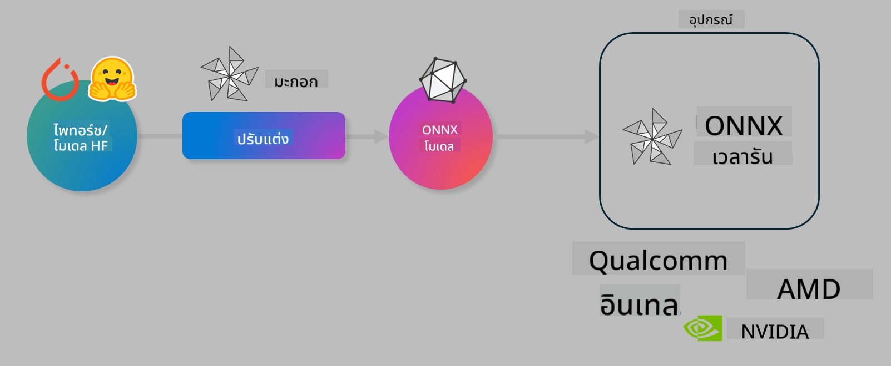

<!--
CO_OP_TRANSLATOR_METADATA:
{
  "original_hash": "6bbe47de3b974df7eea29dfeccf6032b",
  "translation_date": "2025-05-09T04:38:16+00:00",
  "source_file": "code/04.Finetuning/olive-lab/readme.md",
  "language_code": "th"
}
-->
# Lab. ปรับแต่งโมเดล AI สำหรับการประมวลผลบนอุปกรณ์

## บทนำ

> [!IMPORTANT]
> ห้องปฏิบัติการนี้ต้องการ **Nvidia A10 หรือ A100 GPU** พร้อมไดรเวอร์และ CUDA toolkit (เวอร์ชัน 12 ขึ้นไป) ที่ติดตั้งเรียบร้อยแล้ว

> [!NOTE]
> ห้องปฏิบัติการนี้ใช้เวลาประมาณ **35 นาที** ซึ่งจะให้คุณได้เรียนรู้และลงมือปฏิบัติเกี่ยวกับแนวคิดหลักของการปรับแต่งโมเดลสำหรับการประมวลผลบนอุปกรณ์ด้วย OLIVE

## วัตถุประสงค์การเรียนรู้

เมื่อจบห้องปฏิบัติการนี้ คุณจะสามารถใช้ OLIVE เพื่อ:

- ทำ Quantize โมเดล AI ด้วยวิธี AWQ quantization
- ปรับแต่งโมเดล AI สำหรับงานเฉพาะทาง
- สร้าง LoRA adapters (โมเดลที่ผ่านการปรับแต่ง) เพื่อประสิทธิภาพในการประมวลผลบนอุปกรณ์ด้วย ONNX Runtime

### Olive คืออะไร

Olive (*O*NNX *live*) คือชุดเครื่องมือสำหรับปรับแต่งโมเดลพร้อม CLI ที่ช่วยให้คุณสามารถส่งมอบโมเดลสำหรับ ONNX runtime +++https://onnxruntime.ai+++ ด้วยคุณภาพและประสิทธิภาพ



อินพุตของ Olive มักจะเป็นโมเดล PyTorch หรือ Hugging Face และเอาต์พุตจะเป็นโมเดล ONNX ที่ได้รับการปรับแต่งให้เหมาะสมสำหรับการรันบนอุปกรณ์เป้าหมายที่ใช้ ONNX runtime Olive จะปรับแต่งโมเดลให้เหมาะสมกับ AI accelerator (NPU, GPU, CPU) ของอุปกรณ์นั้นๆ ซึ่งจัดหาโดยผู้ผลิตฮาร์ดแวร์ เช่น Qualcomm, AMD, Nvidia หรือ Intel

Olive จะรัน *workflow* ซึ่งเป็นลำดับขั้นตอนของงานปรับแต่งโมเดลที่เรียกว่า *passes* ตัวอย่างเช่น model compression, graph capture, quantization, graph optimization แต่ละ pass มีพารามิเตอร์ที่สามารถปรับแต่งเพื่อให้ได้ผลลัพธ์ที่ดีที่สุด เช่น ความแม่นยำและความหน่วงเวลา ซึ่งจะถูกประเมินโดย evaluator ที่เกี่ยวข้อง Olive ใช้กลยุทธ์การค้นหาแบบอัลกอริทึมเพื่อปรับแต่งแต่ละ pass ทีละตัวหรือหลาย pass พร้อมกัน

#### ข้อดีของ Olive

- **ลดความยุ่งยากและเวลาทดลองผิดลองถูก** ด้วยการปรับแต่งแบบแมนนวลสำหรับเทคนิคต่างๆ เช่น graph optimization, compression และ quantization กำหนดข้อจำกัดด้านคุณภาพและประสิทธิภาพ แล้วให้ Olive ค้นหาโมเดลที่ดีที่สุดให้คุณโดยอัตโนมัติ
- มี **คอมโพเนนต์ปรับแต่งโมเดลในตัวกว่า 40 รายการ** ครอบคลุมเทคนิคล่าสุดใน quantization, compression, graph optimization และ fine-tuning
- มี **CLI ใช้งานง่าย** สำหรับงานปรับแต่งโมเดลทั่วไป เช่น olive quantize, olive auto-opt, olive finetune
- รองรับการบรรจุและนำโมเดลไปใช้งานในตัว
- รองรับการสร้างโมเดลสำหรับ **Multi LoRA serving**
- สร้าง workflow ด้วย YAML/JSON เพื่อจัดการงานปรับแต่งและการนำโมเดลไปใช้งาน
- เชื่อมต่อกับ **Hugging Face** และ **Azure AI**
- มีระบบ **caching** ในตัวเพื่อช่วย **ลดค่าใช้จ่าย**

## คำแนะนำสำหรับการทำ Lab
> [!NOTE]
> กรุณาตรวจสอบว่าคุณได้เตรียม Azure AI Hub และ Project พร้อมตั้งค่า A100 compute ตาม Lab 1 เรียบร้อยแล้ว

### ขั้นตอนที่ 0: เชื่อมต่อกับ Azure AI Compute

คุณจะเชื่อมต่อกับ Azure AI compute โดยใช้ฟีเจอร์ remote ใน **VS Code**

1. เปิดแอปพลิเคชัน **VS Code** บนเดสก์ท็อปของคุณ
1. เปิด **command palette** ด้วยการกด **Shift+Ctrl+P**
1. ใน command palette ให้ค้นหา **AzureML - remote: Connect to compute instance in New Window**
1. ทำตามคำแนะนำบนหน้าจอเพื่อเชื่อมต่อกับ Compute โดยจะต้องเลือก Azure Subscription, Resource Group, Project และชื่อ Compute ที่คุณตั้งไว้ใน Lab 1
1. เมื่อเชื่อมต่อกับ Azure ML Compute node แล้ว จะมีแสดงสถานะที่ **มุมล่างซ้ายของ Visual Code** `><Azure ML: Compute Name`

### ขั้นตอนที่ 1: Clone repo นี้

ใน VS Code คุณสามารถเปิด terminal ใหม่ด้วย **Ctrl+J** และ clone repo นี้ได้

ใน terminal คุณจะเห็น prompt

```
azureuser@computername:~/cloudfiles/code$ 
```  
Clone the solution  

```bash
cd ~/localfiles
git clone https://github.com/microsoft/phi-3cookbook.git
```

### ขั้นตอนที่ 2: เปิดโฟลเดอร์ใน VS Code

เพื่อเปิด VS Code ในโฟลเดอร์ที่เกี่ยวข้อง ให้รันคำสั่งนี้ใน terminal ซึ่งจะเปิดหน้าต่างใหม่:

```bash
code phi-3cookbook/code/04.Finetuning/Olive-lab
```

หรือจะเปิดโฟลเดอร์ด้วยการเลือก **File** > **Open Folder**

### ขั้นตอนที่ 3: ติดตั้ง Dependencies

เปิด terminal ใน VS Code บน Azure AI Compute Instance ของคุณ (กด **Ctrl+J**) และรันคำสั่งต่อไปนี้เพื่อติดตั้ง dependencies:

```bash
conda create -n olive-ai python=3.11 -y
conda activate olive-ai
pip install -r requirements.txt
az extension remove -n azure-cli-ml
az extension add -n ml
```

> [!NOTE]
> ใช้เวลาประมาณ ~5 นาทีในการติดตั้ง dependencies ทั้งหมด

ในห้องปฏิบัติการนี้ คุณจะดาวน์โหลดและอัปโหลดโมเดลไปยัง Azure AI Model catalog เพื่อเข้าถึง model catalog คุณจะต้องล็อกอิน Azure ด้วยคำสั่ง:

```bash
az login
```

> [!NOTE]
> ขณะล็อกอิน คุณจะถูกขอให้เลือก subscription ให้ตั้งค่าเป็น subscription ที่ใช้ในห้องปฏิบัติการนี้

### ขั้นตอนที่ 4: รันคำสั่ง Olive

เปิด terminal ใน VS Code บน Azure AI Compute Instance (กด **Ctrl+J**) และตรวจสอบว่า environment `olive-ai` ถูกเปิดใช้งานแล้ว:

```bash
conda activate olive-ai
```

จากนั้น รันคำสั่ง Olive ต่อไปนี้ใน command line

1. **ตรวจสอบข้อมูล:** ในตัวอย่างนี้ คุณจะปรับแต่งโมเดล Phi-3.5-Mini ให้เชี่ยวชาญในการตอบคำถามเกี่ยวกับการเดินทาง โค้ดด้านล่างจะแสดงข้อมูลตัวอย่างแรกๆ ของ dataset ที่อยู่ในรูปแบบ JSON lines:

    ```bash
    head data/data_sample_travel.jsonl
    ```
1. **ทำ Quantize โมเดล:** ก่อนฝึกโมเดล คุณจะทำ quantize ด้วยคำสั่งนี้ซึ่งใช้เทคนิค Active Aware Quantization (AWQ) +++https://arxiv.org/abs/2306.00978+++. AWQ จะ quantize ค่าน้ำหนักของโมเดลโดยพิจารณาจากการทำงานของ activation ในช่วง inference ซึ่งช่วยให้การ quantization เก็บรักษาความแม่นยำของโมเดลได้ดีกว่าการ quantize แบบดั้งเดิมที่พิจารณาแค่น้ำหนัก

    ```bash
    olive quantize \
       --model_name_or_path microsoft/Phi-3.5-mini-instruct \
       --trust_remote_code \
       --algorithm awq \
       --output_path models/phi/awq \
       --log_level 1
    ```

    การทำ AWQ quantization ใช้เวลาประมาณ **~8 นาที** และจะ **ลดขนาดโมเดลจาก ~7.5GB เหลือ ~2.5GB**

    ในห้องปฏิบัติการนี้ เราจะแสดงวิธีนำโมเดลจาก Hugging Face (เช่น `microsoft/Phi-3.5-mini-instruct`). However, Olive also allows you to input models from the Azure AI catalog by updating the `model_name_or_path` argument to an Azure AI asset ID (for example:  `azureml://registries/azureml/models/Phi-3.5-mini-instruct/versions/4`). 

1. **Train the model:** Next, the `olive finetune` คำสั่งนี้จะปรับแต่งโมเดลที่ถูก quantize แล้ว การ quantize ก่อน fine-tuning จะให้ความแม่นยำที่ดีกว่าเพราะกระบวนการ fine-tuning จะช่วยกู้คืนความเสียหายจากการ quantization)

    ```bash
    olive finetune \
        --method lora \
        --model_name_or_path models/phi/awq \
        --data_files "data/data_sample_travel.jsonl" \
        --data_name "json" \
        --text_template "<|user|>\n{prompt}<|end|>\n<|assistant|>\n{response}<|end|>" \
        --max_steps 100 \
        --output_path ./models/phi/ft \
        --log_level 1
    ```

    การ fine-tuning ใช้เวลาประมาณ **~6 นาที** (จำนวน 100 ขั้นตอน)

1. **Optimize:** หลังจากฝึกโมเดลเสร็จแล้ว คุณจะปรับแต่งโมเดลด้วยคำสั่ง `auto-opt` command, which will capture the ONNX graph and automatically perform a number of optimizations to improve the model performance for CPU by compressing the model and doing fusions. It should be noted, that you can also optimize for other devices such as NPU or GPU by just updating the `--device` and `--provider` ของ Olive แต่สำหรับห้องปฏิบัติการนี้ เราจะใช้ CPU

    ```bash
    olive auto-opt \
       --model_name_or_path models/phi/ft/model \
       --adapter_path models/phi/ft/adapter \
       --device cpu \
       --provider CPUExecutionProvider \
       --use_ort_genai \
       --output_path models/phi/onnx-ao \
       --log_level 1
    ```

    ใช้เวลาประมาณ **~5 นาที** ในการปรับแต่ง

### ขั้นตอนที่ 5: ทดสอบการ inference โมเดลอย่างรวดเร็ว

เพื่อทดสอบการ inference โมเดล ให้สร้างไฟล์ Python ชื่อ **app.py** ในโฟลเดอร์ของคุณ แล้วคัดลอกโค้ดต่อไปนี้ลงไป:

```python
import onnxruntime_genai as og
import numpy as np

print("loading model and adapters...", end="", flush=True)
model = og.Model("models/phi/onnx-ao/model")
adapters = og.Adapters(model)
adapters.load("models/phi/onnx-ao/model/adapter_weights.onnx_adapter", "travel")
print("DONE!")

tokenizer = og.Tokenizer(model)
tokenizer_stream = tokenizer.create_stream()

params = og.GeneratorParams(model)
params.set_search_options(max_length=100, past_present_share_buffer=False)
user_input = "what is the best thing to see in chicago"
params.input_ids = tokenizer.encode(f"<|user|>\n{user_input}<|end|>\n<|assistant|>\n")

generator = og.Generator(model, params)

generator.set_active_adapter(adapters, "travel")

print(f"{user_input}")

while not generator.is_done():
    generator.compute_logits()
    generator.generate_next_token()

    new_token = generator.get_next_tokens()[0]
    print(tokenizer_stream.decode(new_token), end='', flush=True)

print("\n")
```

รันโค้ดด้วยคำสั่ง:

```bash
python app.py
```

### ขั้นตอนที่ 6: อัปโหลดโมเดลไปยัง Azure AI

การอัปโหลดโมเดลไปยัง Azure AI model repository จะช่วยให้คุณแชร์โมเดลกับทีมพัฒนาและจัดการเวอร์ชันของโมเดลได้ เพื่ออัปโหลดโมเดล ให้รันคำสั่งนี้:

> [!NOTE]
> อัปเดตค่า `{}` ของ `resourceGroup` และชื่อ Azure AI Project แล้วรันคำสั่งต่อไปนี้

```
az ml workspace show
```

หรือไปที่ +++ai.azure.com+++ แล้วเลือก **management center** > **project** > **overview**

แก้ไขค่า `{}` ด้วยชื่อ resource group และชื่อ Azure AI Project ของคุณ

```bash
az ml model create \
    --name ft-for-travel \
    --version 1 \
    --path ./models/phi/onnx-ao \
    --resource-group {RESOURCE_GROUP_NAME} \
    --workspace-name {PROJECT_NAME}
```

คุณจะเห็นโมเดลที่อัปโหลดและสามารถนำโมเดลไปใช้งานได้ที่ https://ml.azure.com/model/list

**ข้อจำกัดความรับผิดชอบ**:  
เอกสารฉบับนี้ได้รับการแปลโดยใช้บริการแปลภาษาอัตโนมัติ [Co-op Translator](https://github.com/Azure/co-op-translator) แม้เราจะพยายามให้ความถูกต้องสูงสุด แต่โปรดทราบว่าการแปลโดยอัตโนมัติอาจมีข้อผิดพลาดหรือความไม่ถูกต้อง เอกสารต้นฉบับในภาษาต้นฉบับควรถูกพิจารณาเป็นแหล่งข้อมูลที่น่าเชื่อถือ สำหรับข้อมูลที่สำคัญ ควรใช้บริการแปลโดยผู้เชี่ยวชาญมนุษย์ เราไม่รับผิดชอบต่อความเข้าใจผิดหรือการตีความที่ผิดพลาดใดๆ ที่เกิดจากการใช้การแปลนี้