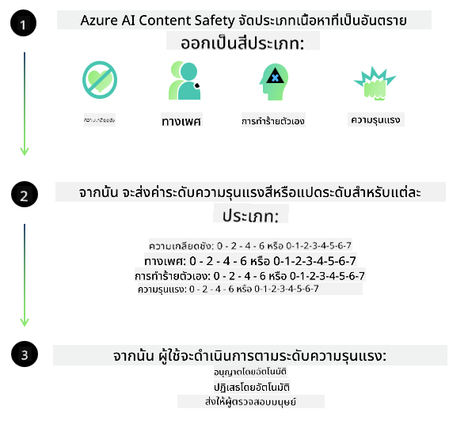
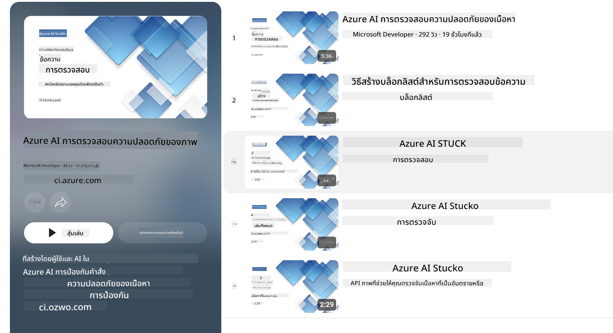

<!--
CO_OP_TRANSLATOR_METADATA:
{
  "original_hash": "c8273672cc57df2be675407a1383aaf0",
  "translation_date": "2025-07-16T17:48:34+00:00",
  "source_file": "md/01.Introduction/01/01.AISafety.md",
  "language_code": "th"
}
-->
# ความปลอดภัยของ AI สำหรับโมเดล Phi  
ตระกูลโมเดล Phi ถูกพัฒนาขึ้นตาม [Microsoft Responsible AI Standard](https://query.prod.cms.rt.microsoft.com/cms/api/am/binary/RE5cmFl) ซึ่งเป็นชุดข้อกำหนดระดับบริษัทที่อิงตามหลักการหกประการ ได้แก่ ความรับผิดชอบ ความโปร่งใส ความเป็นธรรม ความน่าเชื่อถือและความปลอดภัย ความเป็นส่วนตัวและความมั่นคงปลอดภัย และความครอบคลุม ซึ่งเป็นส่วนหนึ่งของ [Microsoft’s Responsible AI principles](https://www.microsoft.com/ai/responsible-ai)  

เช่นเดียวกับโมเดล Phi รุ่นก่อนหน้า ได้มีการนำแนวทางประเมินความปลอดภัยหลายมิติและการฝึกอบรมหลังการฝึกมาใช้ พร้อมมาตรการเพิ่มเติมเพื่อรองรับความสามารถหลายภาษาในรุ่นนี้ แนวทางการฝึกอบรมและประเมินความปลอดภัย รวมถึงการทดสอบในหลายภาษาและหมวดความเสี่ยง ได้อธิบายไว้ใน [Phi Safety Post-Training Paper](https://arxiv.org/abs/2407.13833) แม้ว่าโมเดล Phi จะได้รับประโยชน์จากแนวทางนี้ แต่ผู้พัฒนาควรนำแนวปฏิบัติ AI ที่รับผิดชอบมาใช้ รวมถึงการทำแผนที่ การวัด และการลดความเสี่ยงที่เกี่ยวข้องกับกรณีการใช้งานเฉพาะและบริบททางวัฒนธรรมและภาษา  

## แนวปฏิบัติที่ดีที่สุด  

เช่นเดียวกับโมเดลอื่น ๆ ตระกูลโมเดล Phi อาจแสดงพฤติกรรมที่ไม่เป็นธรรม ไม่น่าเชื่อถือ หรือไม่เหมาะสมได้  

พฤติกรรมจำกัดบางประการของ SLM และ LLM ที่ควรทราบ ได้แก่:  

- **คุณภาพของบริการ:** โมเดล Phi ถูกฝึกอบรมโดยใช้ข้อความภาษาอังกฤษเป็นหลัก ภาษาอื่นนอกเหนือจากภาษาอังกฤษอาจมีประสิทธิภาพต่ำกว่า และสำเนียงภาษาอังกฤษที่มีการแทนที่ในข้อมูลฝึกอบรมน้อยกว่าอาจมีประสิทธิภาพต่ำกว่าภาษาอังกฤษแบบอเมริกันมาตรฐาน  
- **การแทนที่ความเสียหายและการสืบทอดแบบแผน:** โมเดลเหล่านี้อาจแสดงการแทนที่กลุ่มคนบางกลุ่มมากหรือน้อยเกินไป ลบการแทนที่ของบางกลุ่ม หรือเสริมสร้างแบบแผนที่ดูถูกหรือเป็นลบ แม้จะมีการฝึกอบรมหลังการฝึกเพื่อความปลอดภัย ข้อจำกัดเหล่านี้อาจยังคงมีอยู่เนื่องจากระดับการแทนที่ของกลุ่มต่าง ๆ ที่แตกต่างกัน หรือความแพร่หลายของตัวอย่างแบบแผนลบในข้อมูลฝึกอบรมที่สะท้อนรูปแบบในโลกจริงและอคติในสังคม  
- **เนื้อหาที่ไม่เหมาะสมหรือก้าวร้าว:** โมเดลเหล่านี้อาจสร้างเนื้อหาที่ไม่เหมาะสมหรือก้าวร้าวประเภทอื่น ๆ ซึ่งอาจทำให้ไม่เหมาะสมที่จะนำไปใช้ในบริบทที่ละเอียดอ่อนโดยไม่มีมาตรการป้องกันเพิ่มเติมที่เหมาะสมกับกรณีการใช้งาน  
- **ความน่าเชื่อถือของข้อมูล:** โมเดลภาษาอาจสร้างเนื้อหาที่ไม่มีความหมายหรือแต่งเรื่องที่ฟังดูสมเหตุสมผลแต่ไม่ถูกต้องหรือเก่าเกินไป  
- **ขอบเขตจำกัดสำหรับโค้ด:** ข้อมูลฝึกอบรมส่วนใหญ่ของ Phi-3 เป็นภาษา Python และใช้แพ็กเกจทั่วไป เช่น "typing, math, random, collections, datetime, itertools" หากโมเดลสร้างสคริปต์ Python ที่ใช้แพ็กเกจอื่นหรือสคริปต์ในภาษาอื่น เราขอแนะนำให้ผู้ใช้ตรวจสอบการใช้งาน API ด้วยตนเองอย่างละเอียด  

ผู้พัฒนาควรนำแนวปฏิบัติ AI ที่รับผิดชอบมาใช้และรับผิดชอบในการตรวจสอบให้แน่ใจว่ากรณีการใช้งานเฉพาะเป็นไปตามกฎหมายและข้อบังคับที่เกี่ยวข้อง (เช่น ความเป็นส่วนตัว การค้า ฯลฯ)  

## ข้อควรพิจารณาเกี่ยวกับ AI ที่รับผิดชอบ  

เช่นเดียวกับโมเดลภาษาอื่น ๆ โมเดลในซีรีส์ Phi อาจแสดงพฤติกรรมที่ไม่เป็นธรรม ไม่น่าเชื่อถือ หรือก้าวร้าวได้ พฤติกรรมจำกัดที่ควรทราบ ได้แก่:  

**คุณภาพของบริการ:** โมเดล Phi ถูกฝึกอบรมโดยใช้ข้อความภาษาอังกฤษเป็นหลัก ภาษาอื่นนอกเหนือจากภาษาอังกฤษอาจมีประสิทธิภาพต่ำกว่า สำเนียงภาษาอังกฤษที่มีการแทนที่ในข้อมูลฝึกอบรมน้อยกว่าอาจมีประสิทธิภาพต่ำกว่าภาษาอังกฤษแบบอเมริกันมาตรฐาน  

**การแทนที่ความเสียหายและการสืบทอดแบบแผน:** โมเดลเหล่านี้อาจแสดงการแทนที่กลุ่มคนบางกลุ่มมากหรือน้อยเกินไป ลบการแทนที่ของบางกลุ่ม หรือเสริมสร้างแบบแผนที่ดูถูกหรือเป็นลบ แม้จะมีการฝึกอบรมหลังการฝึกเพื่อความปลอดภัย ข้อจำกัดเหล่านี้อาจยังคงมีอยู่เนื่องจากระดับการแทนที่ของกลุ่มต่าง ๆ ที่แตกต่างกัน หรือความแพร่หลายของตัวอย่างแบบแผนลบในข้อมูลฝึกอบรมที่สะท้อนรูปแบบในโลกจริงและอคติในสังคม  

**เนื้อหาที่ไม่เหมาะสมหรือก้าวร้าว:** โมเดลเหล่านี้อาจสร้างเนื้อหาที่ไม่เหมาะสมหรือก้าวร้าวประเภทอื่น ๆ ซึ่งอาจทำให้ไม่เหมาะสมที่จะนำไปใช้ในบริบทที่ละเอียดอ่อนโดยไม่มีมาตรการป้องกันเพิ่มเติมที่เหมาะสมกับกรณีการใช้งาน  
- **ความน่าเชื่อถือของข้อมูล:** โมเดลภาษาอาจสร้างเนื้อหาที่ไม่มีความหมายหรือแต่งเรื่องที่ฟังดูสมเหตุสมผลแต่ไม่ถูกต้องหรือเก่าเกินไป  

**ขอบเขตจำกัดสำหรับโค้ด:** ข้อมูลฝึกอบรมส่วนใหญ่ของ Phi-3 เป็นภาษา Python และใช้แพ็กเกจทั่วไป เช่น "typing, math, random, collections, datetime, itertools" หากโมเดลสร้างสคริปต์ Python ที่ใช้แพ็กเกจอื่นหรือสคริปต์ในภาษาอื่น เราขอแนะนำให้ผู้ใช้ตรวจสอบการใช้งาน API ด้วยตนเองอย่างละเอียด  

ผู้พัฒนาควรนำแนวปฏิบัติ AI ที่รับผิดชอบมาใช้และรับผิดชอบในการตรวจสอบให้แน่ใจว่ากรณีการใช้งานเฉพาะเป็นไปตามกฎหมายและข้อบังคับที่เกี่ยวข้อง (เช่น ความเป็นส่วนตัว การค้า ฯลฯ)  

พื้นที่สำคัญที่ควรพิจารณา ได้แก่:  

**การจัดสรร:** โมเดลอาจไม่เหมาะสมกับสถานการณ์ที่อาจมีผลกระทบสำคัญต่อสถานะทางกฎหมาย หรือการจัดสรรทรัพยากรหรือโอกาสในชีวิต (เช่น ที่อยู่อาศัย การจ้างงาน เครดิต ฯลฯ) โดยไม่มีการประเมินเพิ่มเติมและเทคนิคการลดอคติที่เหมาะสม  

**สถานการณ์ความเสี่ยงสูง:** ผู้พัฒนาควรประเมินความเหมาะสมของการใช้โมเดลในสถานการณ์ความเสี่ยงสูงที่ผลลัพธ์ที่ไม่เป็นธรรม ไม่น่าเชื่อถือ หรือก้าวร้าวอาจก่อให้เกิดค่าใช้จ่ายสูงหรือความเสียหาย รวมถึงการให้คำแนะนำในสาขาที่ละเอียดอ่อนหรือเชี่ยวชาญซึ่งความถูกต้องและความน่าเชื่อถือเป็นสิ่งสำคัญ (เช่น คำแนะนำทางกฎหมายหรือสุขภาพ) ควรมีมาตรการป้องกันเพิ่มเติมในระดับแอปพลิเคชันตามบริบทการใช้งาน  

**ข้อมูลผิดพลาด:** โมเดลอาจสร้างข้อมูลที่ไม่ถูกต้อง ผู้พัฒนาควรปฏิบัติตามแนวทางความโปร่งใสและแจ้งให้ผู้ใช้ปลายทางทราบว่ากำลังโต้ตอบกับระบบ AI ในระดับแอปพลิเคชัน ผู้พัฒนาสามารถสร้างกลไกตอบรับและกระบวนการเพื่อยึดโยงคำตอบกับข้อมูลบริบทเฉพาะกรณีการใช้งาน เทคนิคนี้เรียกว่า Retrieval Augmented Generation (RAG)  

**การสร้างเนื้อหาที่เป็นอันตราย:** ผู้พัฒนาควรประเมินผลลัพธ์ตามบริบทและใช้ตัวจำแนกความปลอดภัยที่มีอยู่หรือโซลูชันเฉพาะที่เหมาะสมกับกรณีการใช้งาน  

**การใช้งานในทางที่ผิด:** รูปแบบการใช้งานในทางที่ผิดอื่น ๆ เช่น การฉ้อโกง สแปม หรือการสร้างมัลแวร์อาจเป็นไปได้ และผู้พัฒนาควรตรวจสอบให้แน่ใจว่าแอปพลิเคชันของตนไม่ละเมิดกฎหมายและข้อบังคับที่เกี่ยวข้อง  

### การปรับแต่งและความปลอดภัยของเนื้อหา AI  

หลังจากปรับแต่งโมเดล เราขอแนะนำอย่างยิ่งให้ใช้มาตรการ [Azure AI Content Safety](https://learn.microsoft.com/azure/ai-services/content-safety/overview) เพื่อตรวจสอบเนื้อหาที่โมเดลสร้างขึ้น ระบุและบล็อกความเสี่ยง ภัยคุกคาม และปัญหาด้านคุณภาพที่อาจเกิดขึ้น  

  

[Azure AI Content Safety](https://learn.microsoft.com/azure/ai-services/content-safety/overview) รองรับทั้งเนื้อหาข้อความและภาพ สามารถติดตั้งใช้งานได้ทั้งบนคลาวด์ คอนเทนเนอร์ที่แยกตัว และอุปกรณ์ขอบเครือข่าย/ฝังตัว  

## ภาพรวมของ Azure AI Content Safety  

Azure AI Content Safety ไม่ใช่โซลูชันแบบเดียวที่เหมาะกับทุกกรณี แต่สามารถปรับแต่งให้สอดคล้องกับนโยบายเฉพาะของธุรกิจได้ นอกจากนี้ โมเดลหลายภาษาของบริการนี้ยังช่วยให้เข้าใจหลายภาษาได้พร้อมกัน  

  

- **Azure AI Content Safety**  
- **Microsoft Developer**  
- **5 วิดีโอ**  

บริการ Azure AI Content Safety ตรวจจับเนื้อหาที่เป็นอันตรายซึ่งสร้างโดยผู้ใช้และ AI ในแอปพลิเคชันและบริการ รวมถึง API สำหรับข้อความและภาพที่ช่วยให้ตรวจจับเนื้อหาที่เป็นอันตรายหรือไม่เหมาะสมได้  

[AI Content Safety Playlist](https://www.youtube.com/playlist?list=PLlrxD0HtieHjaQ9bJjyp1T7FeCbmVcPkQ)

**ข้อจำกัดความรับผิดชอบ**:  
เอกสารนี้ได้รับการแปลโดยใช้บริการแปลภาษาอัตโนมัติ [Co-op Translator](https://github.com/Azure/co-op-translator) แม้เราจะพยายามให้ความถูกต้องสูงสุด แต่โปรดทราบว่าการแปลอัตโนมัติอาจมีข้อผิดพลาดหรือความไม่ถูกต้อง เอกสารต้นฉบับในภาษาต้นทางถือเป็นแหล่งข้อมูลที่เชื่อถือได้ สำหรับข้อมูลที่สำคัญ ขอแนะนำให้ใช้บริการแปลโดยผู้เชี่ยวชาญมนุษย์ เราไม่รับผิดชอบต่อความเข้าใจผิดหรือการตีความผิดใด ๆ ที่เกิดจากการใช้การแปลนี้