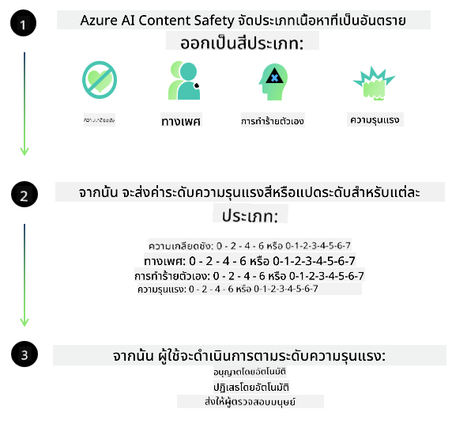

<!--
CO_OP_TRANSLATOR_METADATA:
{
  "original_hash": "839ccc4b3886ef10cfd4e64977f5792d",
  "translation_date": "2026-01-05T12:18:34+00:00",
  "source_file": "md/01.Introduction/01/01.AISafety.md",
  "language_code": "th"
}
-->
# ความปลอดภัยของ AI สำหรับโมเดล Phi
ครอบครัวโมเดล Phi ได้รับการพัฒนาตาม [มาตรฐาน AI ที่รับผิดชอบของ Microsoft](https://www.microsoft.com/ai/principles-and-approach#responsible-ai-standard) ซึ่งเป็นชุดข้อกำหนดทั่วทั้งบริษัทที่อิงตามหลักการหกประการดังนี้: ความรับผิดชอบ, ความโปร่งใส, ความเป็นธรรม, ความน่าเชื่อถือและความปลอดภัย, ความเป็นส่วนตัวและความมั่นคงปลอดภัย, และความครอบคลุม ซึ่งรวมกันเป็น [หลักการ AI ที่รับผิดชอบของ Microsoft](https://www.microsoft.com/ai/responsible-ai) 

เหมือนกับโมเดล Phi ก่อนหน้านี้ มีการนำการประเมินความปลอดภัยแบบหลายมิติและแนวทางความปลอดภัยหลังการฝึกอบรมมาใช้ โดยมีมาตรการเพิ่มเติมเพื่อตอบสนองความสามารถหลากหลายภาษาของรุ่นนี้ แนวทางของเราในการฝึกอบรมและประเมินความปลอดภัย รวมถึงการทดสอบข้ามหลายภาษาและหมวดความเสี่ยง ได้สรุปไว้ใน [เอกสาร Phi Safety Post-Training Paper](https://arxiv.org/abs/2407.13833) ในขณะที่โมเดล Phi ได้ประโยชน์จากแนวทางนี้ นักพัฒนาควรนำแนวทางปฏิบัติที่ดีที่สุดของ AI ที่รับผิดชอบมาใช้ รวมถึงการทำแผนที่ การวัด และการลดความเสี่ยงที่เกี่ยวข้องกับกรณีการใช้งานเฉพาะและบริบททางวัฒนธรรมและภาษา

## แนวทางปฏิบัติที่ดีที่สุด

เหมือนกับโมเดลอื่นๆ ครอบครัวโมเดล Phi อาจมีพฤติกรรมที่ไม่เป็นธรรม ไม่น่าเชื่อถือ หรือทำให้รู้สึกไม่เหมาะสมได้

พฤติกรรมจำกัดบางประการของ SLM และ LLM ที่คุณควรรับรู้มีดังนี้:

- **คุณภาพของการให้บริการ:** โมเดล Phi ได้รับการฝึกอบรมหลักจากข้อความภาษาอังกฤษ ภาษาอื่นที่ไม่ใช่ภาษาอังกฤษจะพบประสิทธิภาพที่แย่กว่า ความหลากหลายของภาษาอังกฤษที่มีการเป็นตัวแทนในข้อมูลฝึกที่น้อยกว่าอาจพบประสิทธิภาพที่แย่กว่าภาษาอังกฤษอเมริกันมาตรฐาน
- **การเป็นตัวแทนของอันตรายและการสืบทอดแบบแผน:** โมเดลเหล่านี้อาจแสดงการเป็นตัวแทนของกลุ่มคนบางกลุ่มมากเกินไป หรือน้อยเกินไป ลบการเป็นตัวแทนของกลุ่มบางกลุ่ม หรือเสริมสร้างแบบแผนที่ดูหมิ่นหรือเป็นลบ แม้จะมีความปลอดภัยหลังฝึกอบรม ข้อจำกัดเหล่านี้ยังคงมีอยู่เนื่องจากระดับการเป็นตัวแทนของกลุ่มที่แตกต่างกันหรือความชุกของตัวอย่างแบบแผนที่เป็นลบในข้อมูลฝึกที่สะท้อนรูปแบบในโลกจริงและอคติทางสังคม
- **เนื้อหาที่ไม่เหมาะสมหรือน่ารังเกียจ:** โมเดลเหล่านี้อาจสร้างเนื้อหาประเภทอื่นที่ไม่เหมาะสมหรือน่ารังเกียจ ซึ่งอาจทำให้ไม่เหมาะสมที่จะนำไปใช้ในบริบทที่ละเอียดอ่อนโดยไม่มีมาตรการป้องกันเพิ่มเติมซึ่งเจาะจงกับกรณีการใช้งาน
- **ความน่าเชื่อถือของข้อมูล:** โมเดลภาษาอาจสร้างเนื้อหาที่ไม่มีความหมายหรือแต่งเนื้อหาที่ฟังดูสมเหตุสมผลแต่ไม่ถูกต้องหรือไม่อัปเดต
- **ขอบเขตจำกัดสำหรับโค้ด:** ข้อมูลฝึกส่วนใหญ่ของ Phi-3 อิงกับ Python และใช้แพ็กเกจทั่วไปเช่น "typing, math, random, collections, datetime, itertools" หากโมเดลสร้างสคริปต์ Python ที่ใช้แพ็กเกจอื่นหรือสคริปต์ในภาษาอื่น เราขอแนะนำอย่างยิ่งให้ผู้ใช้ตรวจสอบการใช้งาน API ทั้งหมดด้วยตนเอง

นักพัฒนาควรนำแนวทางปฏิบัติที่ดีที่สุดของ AI ที่รับผิดชอบมาใช้ และมีความรับผิดชอบในการทำให้แน่ใจว่ากรณีการใช้งานเฉพาะปฏิบัติตามกฎหมายและข้อบังคับที่เกี่ยวข้อง (เช่น ความเป็นส่วนตัว การค้า เป็นต้น)

## ข้อควรพิจารณาด้าน AI ที่รับผิดชอบ

เหมือนกับโมเดลภาษาอื่นๆ โมเดลซีรีส์ Phi อาจมีพฤติกรรมที่ไม่เป็นธรรม ไม่น่าเชื่อถือ หรือทำให้รู้สึกไม่เหมาะสม พฤติกรรมจำกัดบางประการที่ควรทราบมีดังนี้:

**คุณภาพของการให้บริการ:** โมเดล Phi ได้รับการฝึกอบรมหลักจากข้อความภาษาอังกฤษ ภาษาอื่นที่ไม่ใช่ภาษาอังกฤษจะพบประสิทธิภาพที่แย่กว่า ความหลากหลายของภาษาอังกฤษที่มีการเป็นตัวแทนในข้อมูลฝึกที่น้อยกว่าอาจพบประสิทธิภาพที่แย่กว่าภาษาอังกฤษอเมริกันมาตรฐาน

**การเป็นตัวแทนของอันตรายและการสืบทอดแบบแผน:** โมเดลเหล่านี้อาจแสดงการเป็นตัวแทนของกลุ่มคนบางกลุ่มมากเกินไป หรือน้อยเกินไป ลบการเป็นตัวแทนของกลุ่มบางกลุ่ม หรือเสริมสร้างแบบแผนที่ดูหมิ่นหรือเป็นลบ แม้จะมีความปลอดภัยหลังฝึกอบรม ข้อจำกัดเหล่านี้ยังคงมีอยู่เนื่องจากระดับการเป็นตัวแทนของกลุ่มที่แตกต่างกันหรือความชุกของตัวอย่างแบบแผนที่เป็นลบในข้อมูลฝึกที่สะท้อนรูปแบบในโลกจริงและอคติทางสังคม

**เนื้อหาที่ไม่เหมาะสมหรือน่ารังเกียจ:** โมเดลเหล่านี้อาจสร้างเนื้อหาประเภทอื่นที่ไม่เหมาะสมหรือน่ารังเกียจ ซึ่งอาจทำให้ไม่เหมาะสมที่จะนำไปใช้ในบริบทที่ละเอียดอ่อนโดยไม่มีมาตรการป้องกันเพิ่มเติมซึ่งเจาะจงกับกรณีการใช้งาน
ความน่าเชื่อถือของข้อมูล: โมเดลภาษาอาจสร้างเนื้อหาที่ไม่มีความหมายหรือแต่งเนื้อหาที่ฟังดูสมเหตุสมผลแต่ไม่ถูกต้องหรือไม่อัปเดต

**ขอบเขตจำกัดสำหรับโค้ด:** ข้อมูลฝึกส่วนใหญ่ของ Phi-3 อิงกับ Python และใช้แพ็กเกจทั่วไปเช่น "typing, math, random, collections, datetime, itertools" หากโมเดลสร้างสคริปต์ Python ที่ใช้แพ็กเกจอื่นหรือสคริปต์ในภาษาอื่น เราขอแนะนำอย่างยิ่งให้ผู้ใช้ตรวจสอบการใช้งาน API ทั้งหมดด้วยตนเอง

นักพัฒนาควรนำแนวทางปฏิบัติที่ดีที่สุดของ AI ที่รับผิดชอบมาใช้ และมีความรับผิดชอบในการทำให้แน่ใจว่ากรณีการใช้งานเฉพาะปฏิบัติตามกฎหมายและข้อบังคับที่เกี่ยวข้อง (เช่น ความเป็นส่วนตัว การค้า เป็นต้น) ด้านสำคัญที่ควรพิจารณามีดังนี้:

**การจัดสรร:** โมเดลอาจไม่เหมาะสมสำหรับสถานการณ์ที่อาจมีผลกระทบสำคัญต่อสถานะทางกฎหมายหรือการจัดสรรทรัพยากรหรือโอกาสทางชีวิต (เช่น ที่อยู่อาศัย การจ้างงาน เครดิต ฯลฯ) โดยที่จำเป็นต้องมีการประเมินเพิ่มเติมและเทคนิคการลดอคติที่เพิ่มขึ้น

**สถานการณ์ที่มีความเสี่ยงสูง:** นักพัฒนาควรประเมินความเหมาะสมของการใช้โมเดลในสถานการณ์ที่มีความเสี่ยงสูงซึ่งผลลัพธ์ที่ไม่เป็นธรรม ไม่น่าเชื่อถือ หรือน่ารังเกียจ อาจก่อให้เกิดค่าใช้จ่ายสูงหรือเป็นอันตราย ซึ่งรวมถึงการให้คำแนะนำในโดเมนที่ละเอียดอ่อนหรือผู้เชี่ยวชาญที่ความถูกต้องและความน่าเชื่อถือเป็นสิ่งสำคัญ (เช่น คำแนะนำทางกฎหมายหรือสุขภาพ) ควรมีมาตรการป้องกันเพิ่มเติมในระดับแอปพลิเคชันตามบริบทของการใช้งาน

**ข้อมูลเท็จ:** โมเดลอาจสร้างข้อมูลที่ไม่ถูกต้อง นักพัฒนาควรปฏิบัติตามแนวทางที่โปร่งใสและแจ้งผู้ใช้ปลายทางว่ากำลังโต้ตอบกับระบบ AI ในระดับแอปพลิเคชัน นักพัฒนาสามารถสร้างกลไกตอบรับและท่อสัญญาณเพื่อตั้งรากฐานคำตอบด้วยข้อมูลเฉพาะของกรณีการใช้งานและบริบท เทคนิคนี้เรียกว่า Retrieval Augmented Generation (RAG)

**การสร้างเนื้อหาที่เป็นอันตราย:** นักพัฒนาควรประเมินผลลัพธ์ตามบริบท และใช้เครื่องมือจำแนกความปลอดภัยหรือโซลูชันที่กำหนดเองที่เหมาะสมกับกรณีการใช้งาน

**การใช้งานในทางที่ผิด:** รูปแบบการใช้งานในทางที่ผิดอื่น เช่น การฉ้อโกง สแปม หรือการผลิตมัลแวร์ อาจเป็นไปได้ และนักพัฒนาควรมั่นใจว่าแอปพลิเคชันของตนไม่ละเมิดกฎหมายและข้อบังคับที่ใช้บังคับ

### การปรับแต่งและความปลอดภัยของเนื้อหา AI

หลังจากปรับแต่งโมเดล เราขอแนะนำอย่างยิ่งให้ใช้มาตรการของ [Azure AI Content Safety](https://learn.microsoft.com/azure/ai-services/content-safety/overview) เพื่อติดตามเนื้อหาที่โมเดลสร้างขึ้น ระบุและบล็อกความเสี่ยง ภัยคุกคาม และปัญหาคุณภาพที่อาจเกิดขึ้น

[Azure AI Content Safety](https://learn.microsoft.com/azure/ai-services/content-safety/overview) รองรับทั้งเนื้อหาข้อความและภาพ สามารถปรับใช้ในระบบคลาวด์ คอนเทนเนอร์ที่ตัดการเชื่อมต่อ และบนอุปกรณ์เอดจ์/ฝังตัว

## ภาพรวมของ Azure AI Content Safety

Azure AI Content Safety ไม่ใช่โซลูชันแบบเดียวที่เหมาะกับทุกคน; สามารถปรับแต่งให้สอดคล้องกับนโยบายเฉพาะของธุรกิจได้ นอกจากนี้ โมเดลหลายภาษา ยังช่วยให้เข้าใจได้หลายภาษาในเวลาเดียวกัน

- **Azure AI Content Safety**
- **Microsoft Developer**
- **5 วิดีโอ**

บริการ Azure AI Content Safety ตรวจจับเนื้อหาที่สร้างโดยผู้ใช้และ AI ที่เป็นอันตรายในแอปพลิเคชันและบริการ รวมทั้ง API ข้อความและภาพที่ช่วยให้คุณสามารถตรวจจับวัตถุที่เป็นอันตรายหรือน่ารังเกียจได้

[AI Content Safety Playlist](https://www.youtube.com/playlist?list=PLlrxD0HtieHjaQ9bJjyp1T7FeCbmVcPkQ)

---

<!-- CO-OP TRANSLATOR DISCLAIMER START -->
**ข้อจำกัดความรับผิดชอบ**:  
เอกสารนี้ได้รับการแปลโดยใช้บริการแปลภาษาอัตโนมัติ [Co-op Translator](https://github.com/Azure/co-op-translator) แม้เราจะพยายามให้ความถูกต้องสูงสุด แต่โปรดทราบว่าการแปลโดยอัตโนมัติอาจมีข้อผิดพลาดหรือความคลาดเคลื่อนได้ เอกสารต้นฉบับในภาษาต้นฉบับถือเป็นแหล่งข้อมูลที่น่าเชื่อถือ หากเป็นข้อมูลที่สำคัญ แนะนำให้ใช้บริการแปลโดยมนุษย์มืออาชีพ เราไม่รับผิดชอบต่อความเข้าใจผิดหรือการตีความผิดใด ๆ ที่เกิดขึ้นจากการใช้การแปลฉบับนี้
<!-- CO-OP TRANSLATOR DISCLAIMER END -->