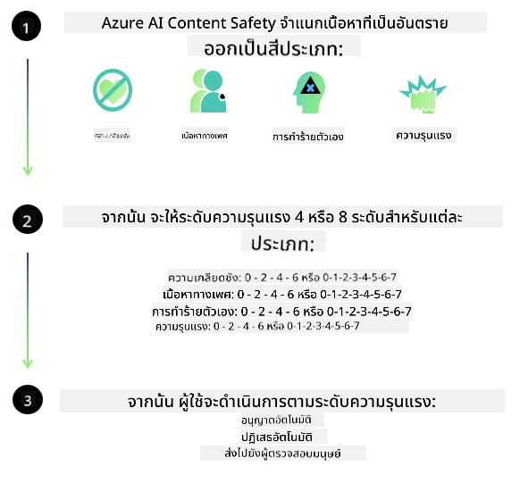
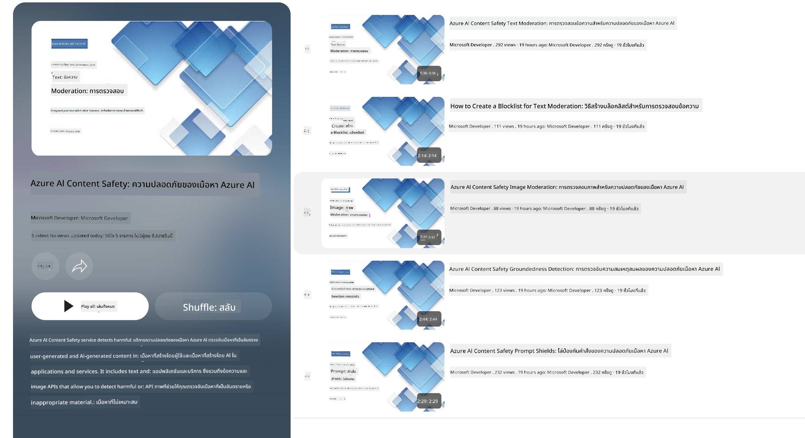

<!--
CO_OP_TRANSLATOR_METADATA:
{
  "original_hash": "c8273672cc57df2be675407a1383aaf0",
  "translation_date": "2025-05-09T06:01:23+00:00",
  "source_file": "md/01.Introduction/01/01.AISafety.md",
  "language_code": "th"
}
-->
# ความปลอดภัยของ AI สำหรับโมเดล Phi  
ตระกูลโมเดล Phi ได้รับการพัฒนาขึ้นตาม [Microsoft Responsible AI Standard](https://query.prod.cms.rt.microsoft.com/cms/api/am/binary/RE5cmFl) ซึ่งเป็นชุดข้อกำหนดระดับบริษัทที่ตั้งอยู่บนหลักการหกประการ ได้แก่ ความรับผิดชอบ, ความโปร่งใส, ความเป็นธรรม, ความน่าเชื่อถือและความปลอดภัย, ความเป็นส่วนตัวและความปลอดภัย, และความครอบคลุม ซึ่งเป็นส่วนหนึ่งของ [Microsoft’s Responsible AI principles](https://www.microsoft.com/ai/responsible-ai)

เช่นเดียวกับโมเดล Phi รุ่นก่อนหน้า มีการนำวิธีการประเมินความปลอดภัยแบบหลายมิติและการฝึกหลังการฝึกที่เน้นความปลอดภัยมาใช้ พร้อมมาตรการเพิ่มเติมเพื่อรองรับความสามารถหลายภาษาในการเปิดตัวครั้งนี้ แนวทางการฝึกและการประเมินความปลอดภัยของเรารวมถึงการทดสอบในหลายภาษาและหมวดความเสี่ยง ถูกสรุปไว้ใน [Phi Safety Post-Training Paper](https://arxiv.org/abs/2407.13833) แม้ว่าโมเดล Phi จะได้รับประโยชน์จากแนวทางนี้ แต่ผู้พัฒนาควรใช้แนวทางปฏิบัติที่ดีที่สุดด้าน AI อย่างรับผิดชอบ รวมถึงการทำแผนที่, การวัด และการลดความเสี่ยงที่เกี่ยวข้องกับกรณีการใช้งานเฉพาะและบริบททางวัฒนธรรมและภาษา

## แนวทางปฏิบัติที่ดีที่สุด  

เช่นเดียวกับโมเดลอื่น ๆ ตระกูลโมเดล Phi อาจแสดงพฤติกรรมที่ไม่เป็นธรรม, ไม่น่าเชื่อถือ หรือไม่เหมาะสมได้  

พฤติกรรมจำกัดบางประการของ SLM และ LLM ที่ควรทราบ ได้แก่:

- **คุณภาพของบริการ:** โมเดล Phi ถูกฝึกส่วนใหญ่ด้วยข้อความภาษาอังกฤษ ภาษาอื่นที่ไม่ใช่ภาษาอังกฤษอาจมีประสิทธิภาพที่แย่กว่า และภาษาอังกฤษที่มีตัวแทนในข้อมูลฝึกฝนน้อยกว่าภาษาอังกฤษอเมริกันมาตรฐานอาจมีประสิทธิภาพต่ำกว่า
- **การแทนกลุ่มที่ได้รับอันตราย & การสืบทอดแบบแผน:** โมเดลเหล่านี้อาจแทนกลุ่มคนบางกลุ่มมากเกินไป หรือน้อยเกินไป ลบการแทนกลุ่มบางกลุ่ม หรือเสริมสร้างแบบแผนที่ดูถูกหรือเป็นลบ แม้จะมีการฝึกหลังเพื่อความปลอดภัย ข้อจำกัดเหล่านี้อาจยังคงมีอยู่เนื่องจากระดับการแทนกลุ่มที่แตกต่างกัน หรือความชุกของตัวอย่างแบบแผนลบในข้อมูลฝึกที่สะท้อนรูปแบบในโลกจริงและอคติในสังคม
- **เนื้อหาที่ไม่เหมาะสมหรือดูถูก:** โมเดลเหล่านี้อาจสร้างเนื้อหาที่ไม่เหมาะสมหรือดูถูก ซึ่งอาจทำให้ไม่เหมาะสมที่จะนำไปใช้ในบริบทที่ละเอียดอ่อนโดยไม่มีมาตรการเพิ่มเติมที่เฉพาะกับกรณีการใช้งาน  
**ความน่าเชื่อถือของข้อมูล:** โมเดลภาษาอาจสร้างเนื้อหาที่ไม่มีความหมาย หรือแต่งเรื่องที่ฟังดูสมเหตุสมผลแต่ไม่ถูกต้องหรือเก่าเกินไป  
- **ขอบเขตจำกัดสำหรับโค้ด:** ข้อมูลฝึกของ Phi-3 ส่วนใหญ่เป็นภาษา Python และใช้แพ็กเกจทั่วไป เช่น "typing, math, random, collections, datetime, itertools" หากโมเดลสร้างสคริปต์ Python ที่ใช้แพ็กเกจอื่นหรือสคริปต์ในภาษาอื่น เราขอแนะนำอย่างยิ่งให้ผู้ใช้ตรวจสอบการใช้งาน API ทั้งหมดด้วยตนเอง

ผู้พัฒนาควรใช้แนวทางปฏิบัติที่ดีที่สุดด้าน AI อย่างรับผิดชอบ และรับผิดชอบในการตรวจสอบให้แน่ใจว่ากรณีการใช้งานเฉพาะเป็นไปตามกฎหมายและข้อบังคับที่เกี่ยวข้อง (เช่น ความเป็นส่วนตัว, การค้า ฯลฯ)

## ข้อควรพิจารณาด้าน Responsible AI  

เช่นเดียวกับโมเดลภาษาอื่น ๆ ตระกูลโมเดล Phi อาจแสดงพฤติกรรมที่ไม่เป็นธรรม, ไม่น่าเชื่อถือ หรือไม่เหมาะสมได้ พฤติกรรมจำกัดที่ควรทราบได้แก่:

**คุณภาพของบริการ:** โมเดล Phi ถูกฝึกส่วนใหญ่ด้วยข้อความภาษาอังกฤษ ภาษาอื่นที่ไม่ใช่ภาษาอังกฤษอาจมีประสิทธิภาพที่แย่กว่า ภาษาอังกฤษที่มีตัวแทนในข้อมูลฝึกฝนน้อยกว่าภาษาอังกฤษอเมริกันมาตรฐานอาจมีประสิทธิภาพต่ำกว่า

**การแทนกลุ่มที่ได้รับอันตราย & การสืบทอดแบบแผน:** โมเดลเหล่านี้อาจแทนกลุ่มคนบางกลุ่มมากเกินไป หรือน้อยเกินไป ลบการแทนกลุ่มบางกลุ่ม หรือเสริมสร้างแบบแผนที่ดูถูกหรือเป็นลบ แม้จะมีการฝึกหลังเพื่อความปลอดภัย ข้อจำกัดเหล่านี้อาจยังคงมีอยู่เนื่องจากระดับการแทนกลุ่มที่แตกต่างกัน หรือความชุกของตัวอย่างแบบแผนลบในข้อมูลฝึกที่สะท้อนรูปแบบในโลกจริงและอคติในสังคม

**เนื้อหาที่ไม่เหมาะสมหรือดูถูก:** โมเดลเหล่านี้อาจสร้างเนื้อหาที่ไม่เหมาะสมหรือดูถูก ซึ่งอาจทำให้ไม่เหมาะสมที่จะนำไปใช้ในบริบทที่ละเอียดอ่อนโดยไม่มีมาตรการเพิ่มเติมที่เฉพาะกับกรณีการใช้งาน  
**ความน่าเชื่อถือของข้อมูล:** โมเดลภาษาอาจสร้างเนื้อหาที่ไม่มีความหมาย หรือแต่งเรื่องที่ฟังดูสมเหตุสมผลแต่ไม่ถูกต้องหรือเก่าเกินไป

**ขอบเขตจำกัดสำหรับโค้ด:** ข้อมูลฝึกของ Phi-3 ส่วนใหญ่เป็นภาษา Python และใช้แพ็กเกจทั่วไป เช่น "typing, math, random, collections, datetime, itertools" หากโมเดลสร้างสคริปต์ Python ที่ใช้แพ็กเกจอื่นหรือสคริปต์ในภาษาอื่น เราขอแนะนำอย่างยิ่งให้ผู้ใช้ตรวจสอบการใช้งาน API ทั้งหมดด้วยตนเอง

ผู้พัฒนาควรใช้แนวทางปฏิบัติที่ดีที่สุดด้าน AI อย่างรับผิดชอบ และรับผิดชอบในการตรวจสอบให้แน่ใจว่ากรณีการใช้งานเฉพาะเป็นไปตามกฎหมายและข้อบังคับที่เกี่ยวข้อง (เช่น ความเป็นส่วนตัว, การค้า ฯลฯ) พื้นที่สำคัญที่ควรพิจารณารวมถึง:

**การจัดสรร:** โมเดลอาจไม่เหมาะสำหรับสถานการณ์ที่อาจส่งผลกระทบสำคัญต่อสถานะทางกฎหมาย หรือการจัดสรรทรัพยากรหรือโอกาสในชีวิต (เช่น ที่อยู่อาศัย, การจ้างงาน, เครดิต ฯลฯ) โดยไม่มีการประเมินเพิ่มเติมและเทคนิคการลดอคติเพิ่มเติม

**สถานการณ์ความเสี่ยงสูง:** ผู้พัฒนาควรประเมินความเหมาะสมของการใช้โมเดลในสถานการณ์ที่มีความเสี่ยงสูงซึ่งผลลัพธ์ที่ไม่เป็นธรรม, ไม่น่าเชื่อถือ หรือไม่เหมาะสมอาจมีค่าใช้จ่ายสูงหรือก่อให้เกิดอันตราย รวมถึงการให้คำแนะนำในสาขาที่ละเอียดอ่อนหรือเชี่ยวชาญซึ่งความถูกต้องและความน่าเชื่อถือเป็นสิ่งสำคัญ (เช่น คำแนะนำทางกฎหมายหรือสุขภาพ) ควรมีการติดตั้งมาตรการป้องกันเพิ่มเติมในระดับแอปพลิเคชันตามบริบทการใช้งาน

**ข้อมูลผิด:** โมเดลอาจสร้างข้อมูลที่ไม่ถูกต้อง ผู้พัฒนาควรปฏิบัติตามแนวทางปฏิบัติที่โปร่งใสและแจ้งผู้ใช้ปลายทางว่าพวกเขากำลังโต้ตอบกับระบบ AI ในระดับแอปพลิเคชัน ผู้พัฒนาสามารถสร้างกลไกการตอบรับและระบบข้อมูลพื้นฐานที่เฉพาะเจาะจงกับกรณีการใช้งาน เทคนิคนี้เรียกว่า Retrieval Augmented Generation (RAG)

**การสร้างเนื้อหาที่เป็นอันตราย:** ผู้พัฒนาควรประเมินผลลัพธ์ตามบริบท และใช้ตัวจำแนกความปลอดภัยที่มีอยู่หรือโซลูชันเฉพาะที่เหมาะสมกับกรณีการใช้งานของตน

**การใช้งานผิด:** รูปแบบการใช้งานผิดอื่น ๆ เช่น การฉ้อโกง, สแปม หรือการสร้างมัลแวร์อาจเป็นไปได้ และผู้พัฒนาควรตรวจสอบให้แน่ใจว่าแอปพลิเคชันของตนไม่ละเมิดกฎหมายและข้อบังคับที่ใช้บังคับ

### การปรับแต่งและความปลอดภัยของเนื้อหา AI  

หลังจากปรับแต่งโมเดล เราขอแนะนำอย่างยิ่งให้ใช้มาตรการของ [Azure AI Content Safety](https://learn.microsoft.com/azure/ai-services/content-safety/overview) เพื่อเฝ้าติดตามเนื้อหาที่โมเดลสร้างขึ้น, ระบุและบล็อกความเสี่ยง, ภัยคุกคาม และปัญหาด้านคุณภาพที่อาจเกิดขึ้น

[Azure AI Content Safety](https://learn.microsoft.com/azure/ai-services/content-safety/overview) รองรับทั้งเนื้อหาข้อความและภาพ สามารถนำไปใช้ในระบบคลาวด์, คอนเทนเนอร์ที่แยกออก และอุปกรณ์ edge/embedded

## ภาพรวมของ Azure AI Content Safety  

Azure AI Content Safety ไม่ใช่โซลูชันแบบหนึ่งขนาดเหมาะกับทุกคน สามารถปรับแต่งให้สอดคล้องกับนโยบายเฉพาะของธุรกิจได้ นอกจากนี้ โมเดลหลายภาษาของมันยังช่วยให้เข้าใจหลายภาษาได้พร้อมกัน

- **Azure AI Content Safety**  
- **Microsoft Developer**  
- **5 วิดีโอ**

บริการ Azure AI Content Safety ตรวจจับเนื้อหาที่เป็นอันตรายซึ่งสร้างโดยผู้ใช้และ AI ในแอปพลิเคชันและบริการ รวมถึง API ข้อความและภาพที่ช่วยให้ตรวจจับเนื้อหาที่เป็นอันตรายหรือไม่เหมาะสมได้

[AI Content Safety Playlist](https://www.youtube.com/playlist?list=PLlrxD0HtieHjaQ9bJjyp1T7FeCbmVcPkQ)

**ข้อจำกัดความรับผิดชอบ**:  
เอกสารฉบับนี้ได้รับการแปลโดยใช้บริการแปลภาษาด้วย AI [Co-op Translator](https://github.com/Azure/co-op-translator) แม้ว่าเราจะพยายามให้ความถูกต้องสูงสุด โปรดทราบว่าการแปลอัตโนมัติอาจมีข้อผิดพลาดหรือความไม่ถูกต้อง เอกสารต้นฉบับในภาษาต้นฉบับควรถูกพิจารณาเป็นแหล่งข้อมูลที่เชื่อถือได้ สำหรับข้อมูลที่สำคัญ ขอแนะนำให้ใช้การแปลโดยมนุษย์ผู้เชี่ยวชาญ เราไม่รับผิดชอบต่อความเข้าใจผิดหรือการตีความผิดใด ๆ ที่เกิดขึ้นจากการใช้การแปลนี้