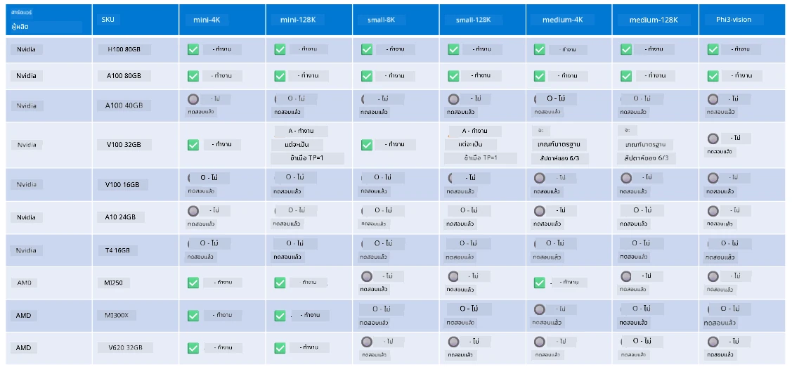

<!--
CO_OP_TRANSLATOR_METADATA:
{
  "original_hash": "8cdc17ce0f10535da30b53d23fe1a795",
  "translation_date": "2025-07-16T18:25:23+00:00",
  "source_file": "md/01.Introduction/01/01.Hardwaresupport.md",
  "language_code": "th"
}
-->
# การสนับสนุนฮาร์ดแวร์ Phi

Microsoft Phi ได้รับการปรับแต่งสำหรับ ONNX Runtime และรองรับ Windows DirectML ทำงานได้ดีบนฮาร์ดแวร์หลากหลายประเภท รวมถึง GPU, CPU และแม้แต่บนอุปกรณ์มือถือ

## ฮาร์ดแวร์ของอุปกรณ์  
โดยเฉพาะฮาร์ดแวร์ที่รองรับได้แก่:

- GPU SKU: RTX 4090 (DirectML)
- GPU SKU: 1 A100 80GB (CUDA)
- CPU SKU: Standard F64s v2 (64 vCPUs, 128 GiB memory)

## Mobile SKU

- Android - Samsung Galaxy S21
- Apple iPhone 14 หรือสูงกว่า พร้อมชิป A16/A17

## สเปคฮาร์ดแวร์ Phi

- การกำหนดค่าขั้นต่ำที่ต้องการ
- Windows: GPU ที่รองรับ DirectX 12 และ RAM รวมอย่างน้อย 4GB

CUDA: NVIDIA GPU ที่มี Compute Capability >= 7.02



## การรัน onnxruntime บนหลาย GPU

โมเดล Phi ONNX ที่มีอยู่ในปัจจุบันรองรับเพียง GPU เดียวเท่านั้น สามารถรองรับ multi-gpu สำหรับโมเดล Phi ได้ แต่ ORT ที่ใช้ 2 GPU ไม่ได้รับประกันว่าจะให้ประสิทธิภาพสูงกว่าการรัน 2 instance ของ ort โปรดดูข้อมูลล่าสุดได้ที่ [ONNX Runtime](https://onnxruntime.ai/)

ในงาน [Build 2024 the GenAI ONNX Team](https://youtu.be/WLW4SE8M9i8?si=EtG04UwDvcjunyfC) ได้ประกาศว่าพวกเขาได้เปิดใช้งาน multi-instance แทน multi-gpu สำหรับโมเดล Phi

ปัจจุบันนี้ คุณสามารถรัน onnxruntime หรือ onnxruntime-genai instance เดียวโดยใช้ตัวแปรสภาพแวดล้อม CUDA_VISIBLE_DEVICES ดังนี้

```Python
CUDA_VISIBLE_DEVICES=0 python infer.py
CUDA_VISIBLE_DEVICES=1 python infer.py
```

สามารถสำรวจ Phi เพิ่มเติมได้ที่ [Azure AI Foundry](https://ai.azure.com)

**ข้อจำกัดความรับผิดชอบ**:  
เอกสารนี้ได้รับการแปลโดยใช้บริการแปลภาษาอัตโนมัติ [Co-op Translator](https://github.com/Azure/co-op-translator) แม้เราจะพยายามให้ความถูกต้องสูงสุด แต่โปรดทราบว่าการแปลอัตโนมัติอาจมีข้อผิดพลาดหรือความไม่ถูกต้อง เอกสารต้นฉบับในภาษาต้นทางถือเป็นแหล่งข้อมูลที่เชื่อถือได้ สำหรับข้อมูลที่สำคัญ ขอแนะนำให้ใช้บริการแปลโดยผู้เชี่ยวชาญมนุษย์ เราไม่รับผิดชอบต่อความเข้าใจผิดหรือการตีความผิดใด ๆ ที่เกิดจากการใช้การแปลนี้