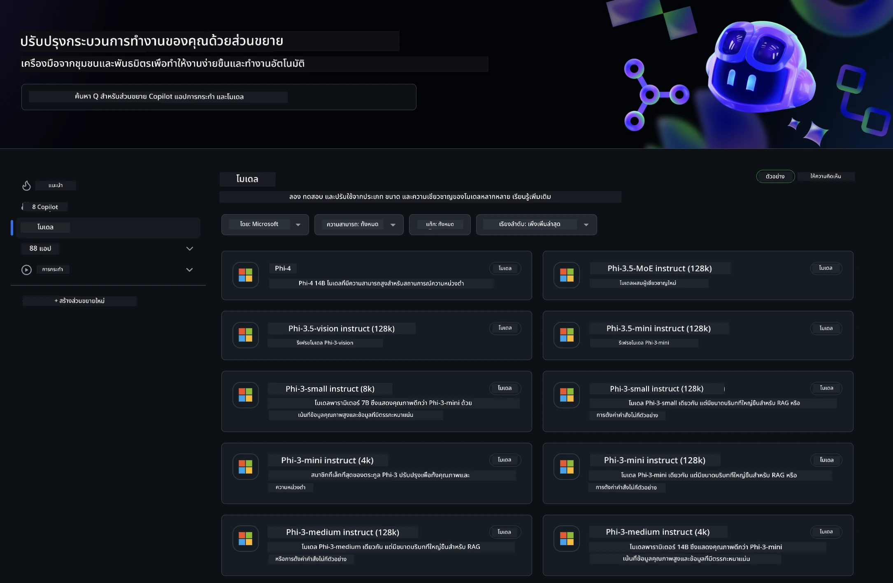
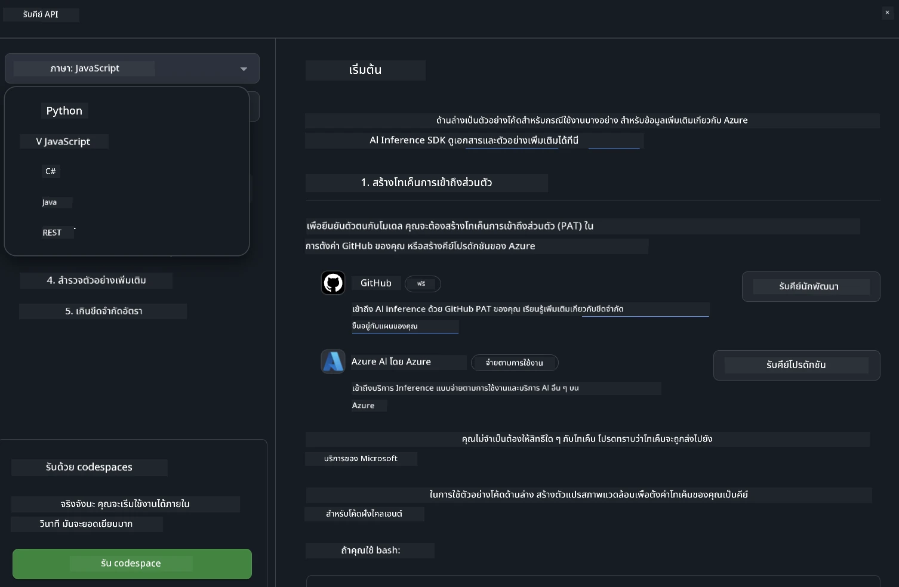
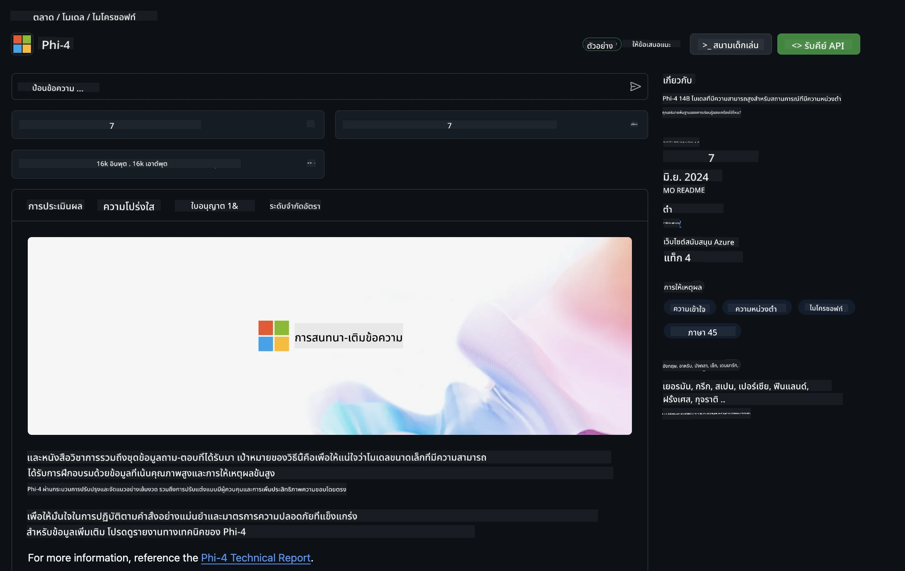

## Phi Family ใน GitHub Models

ยินดีต้อนรับสู่ [GitHub Models](https://github.com/marketplace/models) ! เราเตรียมทุกอย่างไว้พร้อมให้คุณสำรวจ AI Models ที่โฮสต์บน Azure AI



สำหรับข้อมูลเพิ่มเติมเกี่ยวกับ Models ที่มีใน GitHub Models โปรดดูที่ [GitHub Model Marketplace](https://github.com/marketplace/models)

## Models ที่มีให้ใช้งาน

แต่ละโมเดลมี playground และตัวอย่างโค้ดเฉพาะ


### Phi Family ใน GitHub Model Catalog

- [Phi-4](https://github.com/marketplace/models/azureml/Phi-4)

- [Phi-3.5-MoE instruct (128k)](https://github.com/marketplace/models/azureml/Phi-3-5-MoE-instruct)

- [Phi-3.5-vision instruct (128k)](https://github.com/marketplace/models/azureml/Phi-3-5-vision-instruct)

- [Phi-3.5-mini instruct (128k)](https://github.com/marketplace/models/azureml/Phi-3-5-mini-instruct)

- [Phi-3-Medium-128k-Instruct](https://github.com/marketplace/models/azureml/Phi-3-medium-128k-instruct)

- [Phi-3-medium-4k-instruct](https://github.com/marketplace/models/azureml/Phi-3-medium-4k-instruct)

- [Phi-3-mini-128k-instruct](https://github.com/marketplace/models/azureml/Phi-3-mini-128k-instruct)

- [Phi-3-mini-4k-instruct](https://github.com/marketplace/models/azureml/Phi-3-mini-4k-instruct)

- [Phi-3-small-128k-instruct](https://github.com/marketplace/models/azureml/Phi-3-small-128k-instruct)

- [Phi-3-small-8k-instruct](https://github.com/marketplace/models/azureml/Phi-3-small-8k-instruct)

## เริ่มต้นใช้งาน

มีตัวอย่างพื้นฐานบางส่วนที่พร้อมให้คุณรัน คุณสามารถหาได้ในโฟลเดอร์ samples หากคุณต้องการข้ามไปยังภาษาที่ชื่นชอบโดยตรง คุณสามารถดูตัวอย่างในภาษาต่อไปนี้ได้:

- Python
- JavaScript
- C#
- Java
- cURL

นอกจากนี้ยังมี Codespaces Environment เฉพาะสำหรับรันตัวอย่างและโมเดล



## ตัวอย่างโค้ด

ด้านล่างเป็นตัวอย่างโค้ดสำหรับกรณีการใช้งานบางอย่าง สำหรับข้อมูลเพิ่มเติมเกี่ยวกับ Azure AI Inference SDK โปรดดูเอกสารและตัวอย่างทั้งหมด

## การตั้งค่า

1. สร้าง personal access token  
คุณไม่จำเป็นต้องให้สิทธิ์ใดๆ กับ token นี้ โปรดทราบว่า token จะถูกส่งไปยังบริการของ Microsoft

เพื่อใช้ตัวอย่างโค้ดด้านล่าง ให้สร้าง environment variable เพื่อกำหนด token ของคุณเป็นคีย์สำหรับโค้ด client

ถ้าคุณใช้ bash:  
```
export GITHUB_TOKEN="<your-github-token-goes-here>"
```  
ถ้าคุณใช้ powershell:  

```
$Env:GITHUB_TOKEN="<your-github-token-goes-here>"
```  

ถ้าคุณใช้ Windows command prompt:  

```
set GITHUB_TOKEN=<your-github-token-goes-here>
```  

## ตัวอย่าง Python

### ติดตั้ง dependencies  
ติดตั้ง Azure AI Inference SDK ด้วย pip (ต้องใช้ Python >=3.8):  

```
pip install azure-ai-inference
```  
### รันตัวอย่างโค้ดพื้นฐาน

ตัวอย่างนี้แสดงการเรียกใช้งาน API chat completion แบบพื้นฐาน โดยใช้ GitHub AI model inference endpoint และ token GitHub ของคุณ การเรียกนี้เป็นแบบ synchronous

```python
import os
from azure.ai.inference import ChatCompletionsClient
from azure.ai.inference.models import SystemMessage, UserMessage
from azure.core.credentials import AzureKeyCredential

endpoint = "https://models.inference.ai.azure.com"
model_name = "Phi-4"
token = os.environ["GITHUB_TOKEN"]

client = ChatCompletionsClient(
    endpoint=endpoint,
    credential=AzureKeyCredential(token),
)

response = client.complete(
    messages=[
        UserMessage(content="I have $20,000 in my savings account, where I receive a 4% profit per year and payments twice a year. Can you please tell me how long it will take for me to become a millionaire? Also, can you please explain the math step by step as if you were explaining it to an uneducated person?"),
    ],
    temperature=0.4,
    top_p=1.0,
    max_tokens=2048,
    model=model_name
)

print(response.choices[0].message.content)
```

### รันการสนทนาแบบหลายรอบ

ตัวอย่างนี้แสดงการสนทนาแบบหลายรอบกับ API chat completion เมื่อใช้โมเดลสำหรับแอปแชท คุณจะต้องจัดการประวัติการสนทนาและส่งข้อความล่าสุดไปยังโมเดล

```
import os
from azure.ai.inference import ChatCompletionsClient
from azure.ai.inference.models import AssistantMessage, SystemMessage, UserMessage
from azure.core.credentials import AzureKeyCredential

token = os.environ["GITHUB_TOKEN"]
endpoint = "https://models.inference.ai.azure.com"
# Replace Model_Name
model_name = "Phi-4"

client = ChatCompletionsClient(
    endpoint=endpoint,
    credential=AzureKeyCredential(token),
)

messages = [
    SystemMessage(content="You are a helpful assistant."),
    UserMessage(content="What is the capital of France?"),
    AssistantMessage(content="The capital of France is Paris."),
    UserMessage(content="What about Spain?"),
]

response = client.complete(messages=messages, model=model_name)

print(response.choices[0].message.content)
```

### สตรีมผลลัพธ์

เพื่อประสบการณ์ผู้ใช้ที่ดียิ่งขึ้น คุณจะต้องสตรีมการตอบกลับของโมเดล เพื่อให้ token แรกแสดงผลเร็วขึ้นและไม่ต้องรอการตอบกลับนาน

```
import os
from azure.ai.inference import ChatCompletionsClient
from azure.ai.inference.models import SystemMessage, UserMessage
from azure.core.credentials import AzureKeyCredential

token = os.environ["GITHUB_TOKEN"]
endpoint = "https://models.inference.ai.azure.com"
# Replace Model_Name
model_name = "Phi-4"

client = ChatCompletionsClient(
    endpoint=endpoint,
    credential=AzureKeyCredential(token),
)

response = client.complete(
    stream=True,
    messages=[
        SystemMessage(content="You are a helpful assistant."),
        UserMessage(content="Give me 5 good reasons why I should exercise every day."),
    ],
    model=model_name,
)

for update in response:
    if update.choices:
        print(update.choices[0].delta.content or "", end="")

client.close()
```

## การใช้งานฟรีและข้อจำกัดอัตราการใช้งานสำหรับ GitHub Models



[rate limits for the playground and free API usage](https://docs.github.com/en/github-models/prototyping-with-ai-models#rate-limits) มีไว้เพื่อช่วยให้คุณทดลองใช้โมเดลและสร้างต้นแบบแอป AI ของคุณ สำหรับการใช้งานเกินขีดจำกัดเหล่านี้ และเพื่อขยายแอปของคุณ คุณต้องจัดสรรทรัพยากรจากบัญชี Azure และยืนยันตัวตนจากที่นั่นแทนการใช้ personal access token ของ GitHub คุณไม่จำเป็นต้องเปลี่ยนแปลงโค้ดอื่นใด ใช้ลิงก์นี้เพื่อดูวิธีการขยายขีดจำกัดฟรีใน Azure AI

### ข้อควรทราบ

โปรดจำไว้ว่าเมื่อคุณโต้ตอบกับโมเดล คุณกำลังทดลองใช้ AI ดังนั้นอาจมีข้อผิดพลาดในเนื้อหาเกิดขึ้นได้

ฟีเจอร์นี้มีข้อจำกัดหลายอย่าง (รวมถึงจำนวนคำขอต่อวินาที, คำขอต่อวัน, token ต่อคำขอ และคำขอพร้อมกัน) และไม่ได้ออกแบบมาเพื่อใช้งานในสภาพแวดล้อมการผลิต

GitHub Models ใช้ Azure AI Content Safety ตัวกรองเหล่านี้ไม่สามารถปิดได้ในประสบการณ์ GitHub Models หากคุณตัดสินใจใช้โมเดลผ่านบริการที่ต้องชำระเงิน โปรดตั้งค่าตัวกรองเนื้อหาให้ตรงกับความต้องการของคุณ

บริการนี้อยู่ภายใต้ข้อกำหนด Pre-release Terms ของ GitHub

**ข้อจำกัดความรับผิดชอบ**:  
เอกสารนี้ได้รับการแปลโดยใช้บริการแปลภาษาอัตโนมัติ [Co-op Translator](https://github.com/Azure/co-op-translator) แม้เราจะพยายามให้ความถูกต้องสูงสุด แต่โปรดทราบว่าการแปลอัตโนมัติอาจมีข้อผิดพลาดหรือความไม่ถูกต้อง เอกสารต้นฉบับในภาษาต้นทางถือเป็นแหล่งข้อมูลที่เชื่อถือได้ สำหรับข้อมูลที่สำคัญ ขอแนะนำให้ใช้บริการแปลโดยผู้เชี่ยวชาญมนุษย์ เราไม่รับผิดชอบต่อความเข้าใจผิดหรือการตีความผิดใด ๆ ที่เกิดจากการใช้การแปลนี้