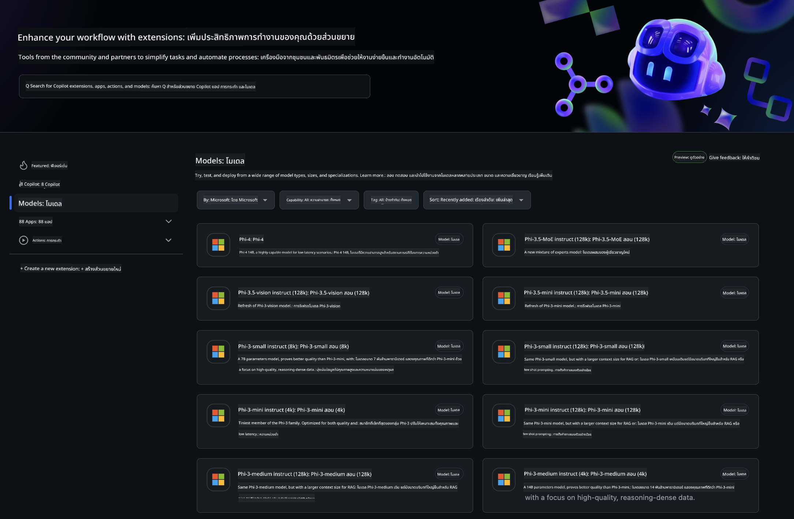
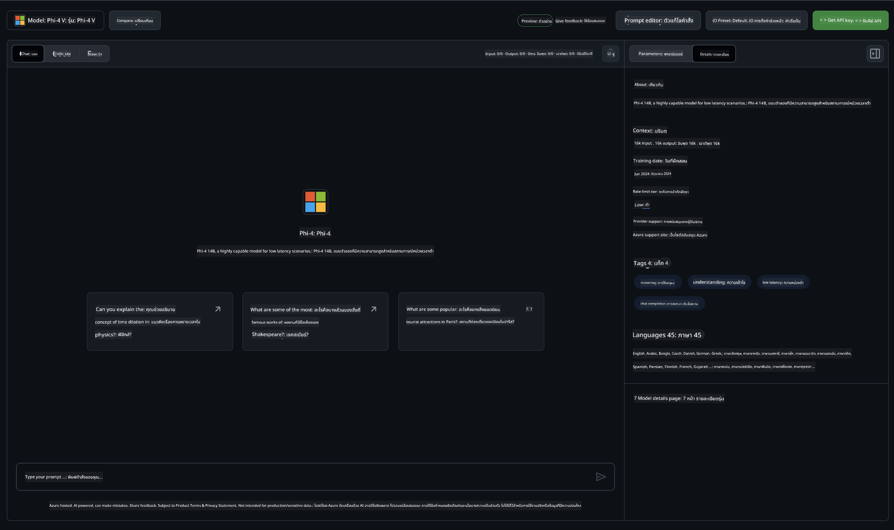
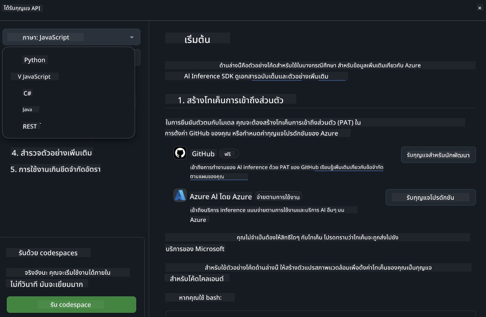
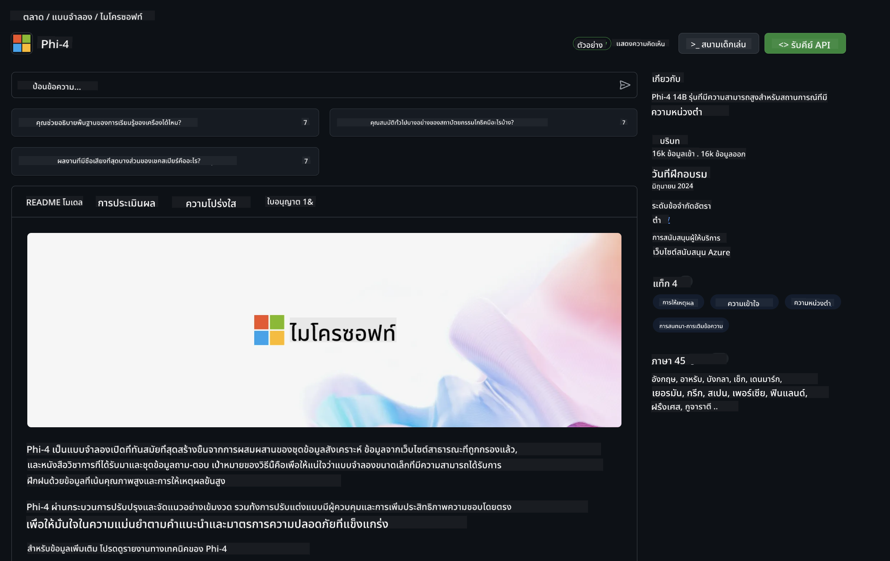

<!--
CO_OP_TRANSLATOR_METADATA:
{
  "original_hash": "fb67a08b9fc911a10ed58081fadef416",
  "translation_date": "2025-05-09T08:50:49+00:00",
  "source_file": "md/01.Introduction/02/02.GitHubModel.md",
  "language_code": "th"
}
-->
## Phi Family in GitHub Models

ยินดีต้อนรับสู่ [GitHub Models](https://github.com/marketplace/models)! เราเตรียมทุกอย่างไว้พร้อมให้คุณสำรวจ AI Models ที่โฮสต์บน Azure AI



สำหรับข้อมูลเพิ่มเติมเกี่ยวกับ Models ที่มีใน GitHub Models ดูได้ที่ [GitHub Model Marketplace](https://github.com/marketplace/models)

## Models Available

แต่ละโมเดลมี playground และตัวอย่างโค้ดเฉพาะ



### Phi Family in GitHub Model Catalog

- [Phi-4](https://github.com/marketplace/models/azureml/Phi-4)

- [Phi-3.5-MoE instruct (128k)](https://github.com/marketplace/models/azureml/Phi-3-5-MoE-instruct)

- [Phi-3.5-vision instruct (128k)](https://github.com/marketplace/models/azureml/Phi-3-5-vision-instruct)

- [Phi-3.5-mini instruct (128k)](https://github.com/marketplace/models/azureml/Phi-3-5-mini-instruct)

- [Phi-3-Medium-128k-Instruct](https://github.com/marketplace/models/azureml/Phi-3-medium-128k-instruct)

- [Phi-3-medium-4k-instruct](https://github.com/marketplace/models/azureml/Phi-3-medium-4k-instruct)

- [Phi-3-mini-128k-instruct](https://github.com/marketplace/models/azureml/Phi-3-mini-128k-instruct)

- [Phi-3-mini-4k-instruct](https://github.com/marketplace/models/azureml/Phi-3-mini-4k-instruct)

- [Phi-3-small-128k-instruct](https://github.com/marketplace/models/azureml/Phi-3-small-128k-instruct)

- [Phi-3-small-8k-instruct](https://github.com/marketplace/models/azureml/Phi-3-small-8k-instruct)

## Getting Started

มีตัวอย่างพื้นฐานบางอย่างที่พร้อมให้คุณรัน คุณสามารถหาได้ในโฟลเดอร์ samples หากคุณต้องการข้ามไปยังภาษาที่ชื่นชอบเลย คุณสามารถหาโค้ดตัวอย่างในภาษาต่อไปนี้ได้:

- Python
- JavaScript
- C#
- Java
- cURL

นอกจากนี้ยังมี Codespaces Environment เฉพาะสำหรับรันตัวอย่างและโมเดล



## Sample Code

ด้านล่างเป็นตัวอย่างโค้ดสำหรับการใช้งานบางกรณี สำหรับข้อมูลเพิ่มเติมเกี่ยวกับ Azure AI Inference SDK ดูเอกสารและตัวอย่างทั้งหมด

## Setup

1. สร้าง personal access token  
คุณไม่จำเป็นต้องกำหนดสิทธิ์ใดๆ ให้กับ token โปรดทราบว่า token นี้จะถูกส่งไปยังบริการของ Microsoft

เพื่อใช้ตัวอย่างโค้ดด้านล่าง ให้สร้าง environment variable เพื่อเก็บ token ของคุณเป็นกุญแจสำหรับโค้ด client

ถ้าคุณใช้ bash:  
```
export GITHUB_TOKEN="<your-github-token-goes-here>"
```  
ถ้าคุณใช้ powershell:  

```
$Env:GITHUB_TOKEN="<your-github-token-goes-here>"
```  

ถ้าคุณใช้ Windows command prompt:  

```
set GITHUB_TOKEN=<your-github-token-goes-here>
```

## Python Sample

### ติดตั้ง dependencies  
ติดตั้ง Azure AI Inference SDK ด้วย pip (ต้องใช้ Python >=3.8):

```
pip install azure-ai-inference
```  
### รันตัวอย่างโค้ดพื้นฐาน

ตัวอย่างนี้แสดงการเรียกใช้งานพื้นฐานกับ chat completion API โดยใช้ GitHub AI model inference endpoint และ token GitHub ของคุณ การเรียกใช้นี้เป็นแบบ synchronous

```python
import os
from azure.ai.inference import ChatCompletionsClient
from azure.ai.inference.models import SystemMessage, UserMessage
from azure.core.credentials import AzureKeyCredential

endpoint = "https://models.inference.ai.azure.com"
model_name = "Phi-4"
token = os.environ["GITHUB_TOKEN"]

client = ChatCompletionsClient(
    endpoint=endpoint,
    credential=AzureKeyCredential(token),
)

response = client.complete(
    messages=[
        UserMessage(content="I have $20,000 in my savings account, where I receive a 4% profit per year and payments twice a year. Can you please tell me how long it will take for me to become a millionaire? Also, can you please explain the math step by step as if you were explaining it to an uneducated person?"),
    ],
    temperature=0.4,
    top_p=1.0,
    max_tokens=2048,
    model=model_name
)

print(response.choices[0].message.content)
```

### รันการสนทนาแบบหลายรอบ

ตัวอย่างนี้แสดงการสนทนาแบบหลายรอบกับ chat completion API เมื่อใช้โมเดลสำหรับแอปแชท คุณจะต้องจัดการประวัติการสนทนาและส่งข้อความล่าสุดไปยังโมเดล

```
import os
from azure.ai.inference import ChatCompletionsClient
from azure.ai.inference.models import AssistantMessage, SystemMessage, UserMessage
from azure.core.credentials import AzureKeyCredential

token = os.environ["GITHUB_TOKEN"]
endpoint = "https://models.inference.ai.azure.com"
# Replace Model_Name
model_name = "Phi-4"

client = ChatCompletionsClient(
    endpoint=endpoint,
    credential=AzureKeyCredential(token),
)

messages = [
    SystemMessage(content="You are a helpful assistant."),
    UserMessage(content="What is the capital of France?"),
    AssistantMessage(content="The capital of France is Paris."),
    UserMessage(content="What about Spain?"),
]

response = client.complete(messages=messages, model=model_name)

print(response.choices[0].message.content)
```

### สตรีมผลลัพธ์

เพื่อประสบการณ์ที่ดียิ่งขึ้น คุณจะต้องสตรีมคำตอบจากโมเดลเพื่อให้ token แรกแสดงเร็วขึ้นและไม่ต้องรอคำตอบนาน

```
import os
from azure.ai.inference import ChatCompletionsClient
from azure.ai.inference.models import SystemMessage, UserMessage
from azure.core.credentials import AzureKeyCredential

token = os.environ["GITHUB_TOKEN"]
endpoint = "https://models.inference.ai.azure.com"
# Replace Model_Name
model_name = "Phi-4"

client = ChatCompletionsClient(
    endpoint=endpoint,
    credential=AzureKeyCredential(token),
)

response = client.complete(
    stream=True,
    messages=[
        SystemMessage(content="You are a helpful assistant."),
        UserMessage(content="Give me 5 good reasons why I should exercise every day."),
    ],
    model=model_name,
)

for update in response:
    if update.choices:
        print(update.choices[0].delta.content or "", end="")

client.close()
```

## FREE Usage and Rate limits for GitHub Models



[rate limits for the playground and free API usage](https://docs.github.com/en/github-models/prototyping-with-ai-models#rate-limits) ถูกออกแบบมาเพื่อช่วยให้คุณทดลองใช้โมเดลและสร้างต้นแบบแอป AI ของคุณ หากต้องการใช้งานเกินขีดจำกัดเหล่านี้และขยายแอปของคุณ คุณต้องจัดสรรทรัพยากรจากบัญชี Azure และยืนยันตัวตนจากที่นั่นแทนการใช้ personal access token ของ GitHub คุณไม่จำเป็นต้องเปลี่ยนแปลงโค้ดอื่นๆ ใช้ลิงก์นี้เพื่อดูวิธีการใช้งานเกินขีดจำกัดฟรีใน Azure AI

### Disclosures

โปรดจำไว้ว่าเมื่อคุณโต้ตอบกับโมเดล คุณกำลังทดลองกับ AI ดังนั้นอาจมีข้อผิดพลาดในเนื้อหาเกิดขึ้นได้

ฟีเจอร์นี้มีข้อจำกัดหลายประการ (รวมถึงจำนวนคำขอต่อวินาที คำขอต่อวัน โทเคนต่อคำขอ และคำขอพร้อมกัน) และไม่ได้ออกแบบมาเพื่อใช้งานในสภาพแวดล้อมการผลิต

GitHub Models ใช้ Azure AI Content Safety ตัวกรองเหล่านี้ไม่สามารถปิดได้ในประสบการณ์ GitHub Models หากคุณเลือกใช้โมเดลผ่านบริการที่ต้องชำระเงิน กรุณาตั้งค่าตัวกรองเนื้อหาให้เหมาะสมกับความต้องการของคุณ

บริการนี้อยู่ภายใต้ข้อกำหนด Pre-release ของ GitHub

**ข้อจำกัดความรับผิดชอบ**:  
เอกสารนี้ได้รับการแปลโดยใช้บริการแปลภาษาด้วย AI [Co-op Translator](https://github.com/Azure/co-op-translator) แม้เราจะพยายามให้ความถูกต้องสูงสุด แต่โปรดทราบว่าการแปลอัตโนมัติอาจมีข้อผิดพลาดหรือความไม่แม่นยำ เอกสารต้นฉบับในภาษาดั้งเดิมถือเป็นแหล่งข้อมูลที่เชื่อถือได้ สำหรับข้อมูลที่สำคัญ ขอแนะนำให้ใช้บริการแปลโดยผู้เชี่ยวชาญมนุษย์ เราจะไม่รับผิดชอบต่อความเข้าใจผิดหรือการตีความที่ผิดพลาดใด ๆ ที่เกิดจากการใช้การแปลนี้