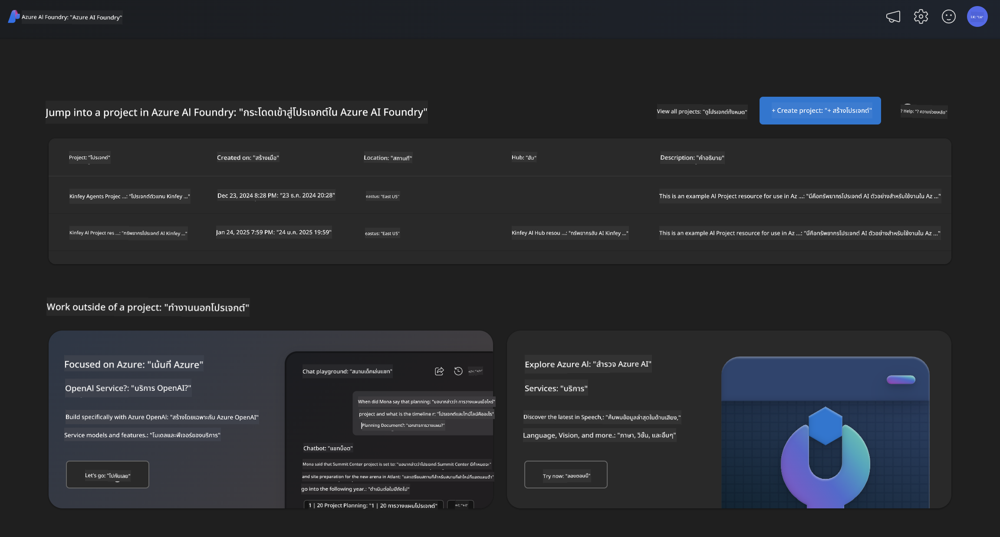
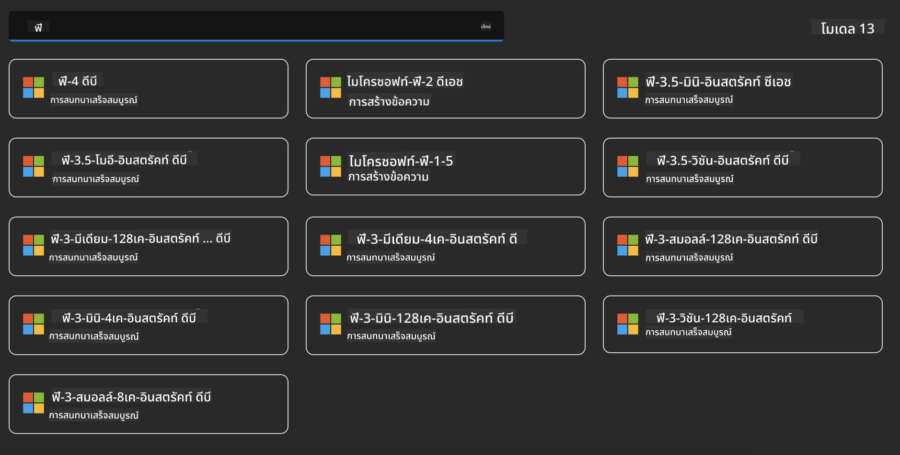
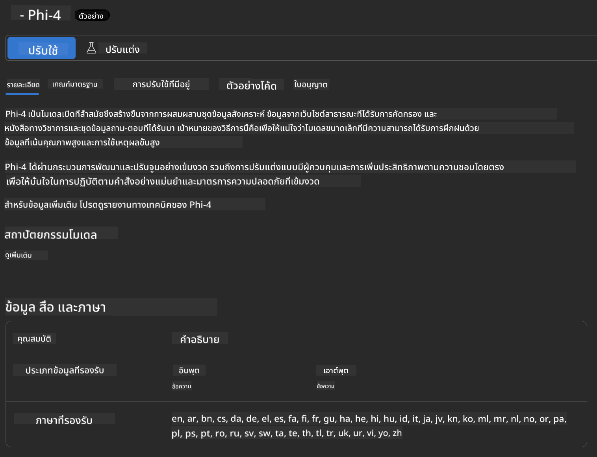
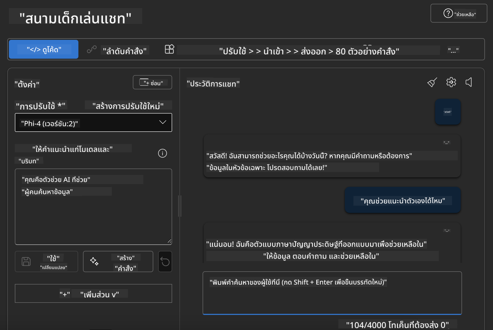

<!--
CO_OP_TRANSLATOR_METADATA:
{
  "original_hash": "3ae21dc5554e888defbe57946ee995ee",
  "translation_date": "2025-05-09T09:05:17+00:00",
  "source_file": "md/01.Introduction/02/03.AzureAIFoundry.md",
  "language_code": "th"
}
-->
## Phi Family ใน Azure AI Foundry

[Azure AI Foundry](https://ai.azure.com) เป็นแพลตฟอร์มที่เชื่อถือได้ ช่วยให้นักพัฒนาสามารถสร้างนวัตกรรมและกำหนดอนาคตด้วย AI อย่างปลอดภัย มั่นคง และมีความรับผิดชอบ

[Azure AI Foundry](https://ai.azure.com) ถูกออกแบบมาสำหรับนักพัฒนาเพื่อ:

- สร้างแอปพลิเคชัน AI แบบสร้างสรรค์บนแพลตฟอร์มระดับองค์กร
- สำรวจ สร้าง ทดสอบ และปรับใช้โดยใช้เครื่องมือ AI และโมเดล ML ขั้นสูง ที่ยึดหลักปฏิบัติ AI อย่างรับผิดชอบ
- ร่วมมือกับทีมงานตลอดวงจรชีวิตของการพัฒนาแอปพลิเคชัน

ด้วย Azure AI Foundry คุณสามารถสำรวจโมเดล บริการ และความสามารถหลากหลาย และเริ่มสร้างแอป AI ที่ตอบโจทย์เป้าหมายของคุณได้ แพลตฟอร์ม Azure AI Foundry ช่วยให้ขยายขนาดได้ง่าย เพื่อเปลี่ยนแนวคิดต้นแบบเป็นแอปพลิเคชันผลิตภัณฑ์เต็มรูปแบบ พร้อมการติดตามและปรับปรุงอย่างต่อเนื่องเพื่อความสำเร็จในระยะยาว



นอกจากการใช้ Azure AOAI Service ใน Azure AI Foundry แล้ว คุณยังสามารถใช้โมเดลจากบุคคลที่สามใน Azure AI Foundry Model Catalog ได้อีกด้วย ซึ่งเป็นตัวเลือกที่ดีถ้าคุณต้องการใช้ Azure AI Foundry เป็นแพลตฟอร์มโซลูชัน AI ของคุณ

เราสามารถปรับใช้ Phi Family Models ได้อย่างรวดเร็วผ่าน Model Catalog ใน Azure AI Foundry

[Microsoft Phi Models in Azure AI Foundry Models](https://ai.azure.com/explore/models/?selectedCollection=phi)



### **ปรับใช้ Phi-4 ใน Azure AI Foundry**



### **ทดสอบ Phi-4 ใน Azure AI Foundry Playground**



### **รันโค้ด Python เพื่อเรียกใช้ Azure AI Foundry Phi-4**

```python

import os  
import base64
from openai import AzureOpenAI  
from azure.identity import DefaultAzureCredential, get_bearer_token_provider  
        
endpoint = os.getenv("ENDPOINT_URL", "Your Azure AOAI Service Endpoint")  
deployment = os.getenv("DEPLOYMENT_NAME", "Phi-4")  
      
token_provider = get_bearer_token_provider(  
    DefaultAzureCredential(),  
    "https://cognitiveservices.azure.com/.default"  
)  
  
client = AzureOpenAI(  
    azure_endpoint=endpoint,  
    azure_ad_token_provider=token_provider,  
    api_version="2024-05-01-preview",  
)  
  

chat_prompt = [
    {
        "role": "system",
        "content": "You are an AI assistant that helps people find information."
    },
    {
        "role": "user",
        "content": "can you introduce yourself"
    }
] 
    
# Include speech result if speech is enabled  
messages = chat_prompt 

completion = client.chat.completions.create(  
    model=deployment,  
    messages=messages,
    max_tokens=800,  
    temperature=0.7,  
    top_p=0.95,  
    frequency_penalty=0,  
    presence_penalty=0,
    stop=None,  
    stream=False  
)  
  
print(completion.to_json())  

```

**ข้อจำกัดความรับผิดชอบ**:  
เอกสารฉบับนี้ได้รับการแปลโดยใช้บริการแปลภาษาอัตโนมัติ [Co-op Translator](https://github.com/Azure/co-op-translator) แม้ว่าเราจะพยายามให้การแปลมีความถูกต้อง โปรดทราบว่าการแปลโดยอัตโนมัติอาจมีข้อผิดพลาดหรือความไม่แม่นยำ เอกสารต้นฉบับในภาษาต้นทางถือเป็นแหล่งข้อมูลที่เชื่อถือได้ สำหรับข้อมูลที่สำคัญ ขอแนะนำให้ใช้บริการแปลโดยผู้เชี่ยวชาญมนุษย์ เราไม่รับผิดชอบต่อความเข้าใจผิดหรือการตีความผิดที่เกิดขึ้นจากการใช้การแปลนี้