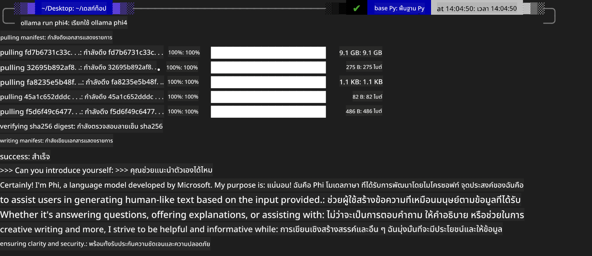

<!--
CO_OP_TRANSLATOR_METADATA:
{
  "original_hash": "0b38834693bb497f96bf53f0d941f9a1",
  "translation_date": "2025-05-09T09:16:01+00:00",
  "source_file": "md/01.Introduction/02/04.Ollama.md",
  "language_code": "th"
}
-->
## Phi Family in Ollama


[Ollama](https://ollama.com) ช่วยให้ผู้คนสามารถนำ LLM หรือ SLM โอเพ่นซอร์สมาใช้งานได้โดยตรงผ่านสคริปต์ง่าย ๆ และยังสามารถสร้าง API เพื่อช่วยในสถานการณ์การใช้งาน Copilot ในเครื่องได้ด้วย

## **1. การติดตั้ง**

Ollama รองรับการใช้งานบน Windows, macOS และ Linux คุณสามารถติดตั้ง Ollama ผ่านลิงก์นี้ ([https://ollama.com/download](https://ollama.com/download)) เมื่อติดตั้งเสร็จเรียบร้อยแล้ว คุณสามารถใช้สคริปต์ Ollama เรียก Phi-3 ผ่านหน้าต่างเทอร์มินัลได้โดยตรง คุณสามารถดู [ไลบรารีที่มีใน Ollama ทั้งหมด](https://ollama.com/library) หากเปิด repository นี้ใน Codespace จะมี Ollama ติดตั้งไว้แล้ว

```bash

ollama run phi4

```

> [!NOTE]
> โมเดลจะถูกดาวน์โหลดก่อนเมื่อคุณรันครั้งแรก แน่นอนว่าคุณสามารถระบุโมเดล Phi-4 ที่ดาวน์โหลดไว้แล้วได้โดยตรง เราจะใช้ WSL เป็นตัวอย่างในการรันคำสั่ง หลังจากดาวน์โหลดโมเดลเสร็จแล้ว คุณสามารถโต้ตอบได้โดยตรงผ่านเทอร์มินัล



## **2. เรียกใช้ phi-4 API จาก Ollama**

ถ้าคุณต้องการเรียกใช้ Phi-4 API ที่สร้างโดย ollama คุณสามารถใช้คำสั่งนี้ในเทอร์มินัลเพื่อเริ่มเซิร์ฟเวอร์ Ollama

```bash

ollama serve

```

> [!NOTE]
> หากใช้งาน MacOS หรือ Linux โปรดทราบว่าอาจเจอข้อผิดพลาดนี้ **"Error: listen tcp 127.0.0.1:11434: bind: address already in use"** เมื่อรันคำสั่งนี้ คุณสามารถละเว้นข้อผิดพลาดนี้ได้เพราะโดยทั่วไปหมายถึงเซิร์ฟเวอร์กำลังทำงานอยู่ หรือคุณจะหยุดแล้วเริ่ม Ollama ใหม่ก็ได้:

**macOS**

```bash

brew services restart ollama

```

**Linux**

```bash

sudo systemctl stop ollama

```

Ollama รองรับ API สองแบบคือ generate และ chat คุณสามารถเรียกใช้โมเดล API ที่ Ollama มีให้ตามความต้องการ โดยส่งคำขอไปยังบริการในเครื่องที่รันอยู่บนพอร์ต 11434

**Chat**

```bash

curl http://127.0.0.1:11434/api/chat -d '{
  "model": "phi3",
  "messages": [
    {
      "role": "system",
      "content": "Your are a python developer."
    },
    {
      "role": "user",
      "content": "Help me generate a bubble algorithm"
    }
  ],
  "stream": false
  
}'

This is the result in Postman


## Additional Resources

Check the list of available models in Ollama in [their library](https://ollama.com/library).

Pull your model from the Ollama server using this command

```bash
ollama pull phi4
```

Run the model using this command

```bash
ollama run phi4
```

***Note:*** Visit this link [https://github.com/ollama/ollama/blob/main/docs/api.md](https://github.com/ollama/ollama/blob/main/docs/api.md) to learn more

## Calling Ollama from Python

You can use `requests` or `urllib3` to make requests to the local server endpoints used above. However, a popular way to use Ollama in Python is via the [openai](https://pypi.org/project/openai/) SDK, since Ollama provides OpenAI-compatible server endpoints as well.

Here is an example for phi3-mini:

```python
import openai

client = openai.OpenAI(
    base_url="http://localhost:11434/v1",
    api_key="nokeyneeded",
)

response = client.chat.completions.create(
    model="phi4",
    temperature=0.7,
    n=1,
    messages=[
        {"role": "system", "content": "You are a helpful assistant."},
        {"role": "user", "content": "Write a haiku about a hungry cat"},
    ],
)

print("Response:")
print(response.choices[0].message.content)
```

## Calling Ollama from JavaScript 

```javascript
// ตัวอย่างการสรุปไฟล์ด้วย Phi-4
script({
    model: "ollama:phi4",
    title: "สรุปด้วย Phi-4",
    system: ["system"],
})

// ตัวอย่างการสรุป
const file = def("FILE", env.files)
$`สรุป ${file} ในย่อหน้าเดียว.`
```

## Calling Ollama from C#

Create a new C# Console application and add the following NuGet package:

```bash
dotnet add package Microsoft.SemanticKernel --version 1.34.0
```

Then replace this code in the `Program.cs` file

```csharp
using Microsoft.SemanticKernel;
using Microsoft.SemanticKernel.ChatCompletion;

// เพิ่มบริการ chat completion โดยใช้ endpoint ของเซิร์ฟเวอร์ ollama ในเครื่อง
#pragma warning disable SKEXP0001, SKEXP0003, SKEXP0010, SKEXP0011, SKEXP0050, SKEXP0052
builder.AddOpenAIChatCompletion(
    modelId: "phi4",
    endpoint: new Uri("http://localhost:11434/"),
    apiKey: "non required");

// เรียกใช้งาน prompt ง่าย ๆ กับบริการ chat
string prompt = "Write a joke about kittens";
var response = await kernel.InvokePromptAsync(prompt);
Console.WriteLine(response.GetValue<string>());
```

Run the app with the command:

```bash
dotnet run

**ข้อจำกัดความรับผิดชอบ**:  
เอกสารนี้ได้รับการแปลโดยใช้บริการแปลภาษา AI [Co-op Translator](https://github.com/Azure/co-op-translator) แม้ว่าเราจะพยายามให้ความถูกต้องสูงสุด แต่โปรดทราบว่าการแปลอัตโนมัติอาจมีข้อผิดพลาดหรือความไม่ถูกต้อง เอกสารต้นฉบับในภาษาต้นทางควรถูกพิจารณาเป็นแหล่งข้อมูลที่เชื่อถือได้ สำหรับข้อมูลที่สำคัญ ควรใช้บริการแปลโดยผู้เชี่ยวชาญที่เป็นมนุษย์ เราไม่รับผิดชอบต่อความเข้าใจผิดหรือการตีความที่ผิดพลาดใด ๆ ที่เกิดจากการใช้การแปลนี้