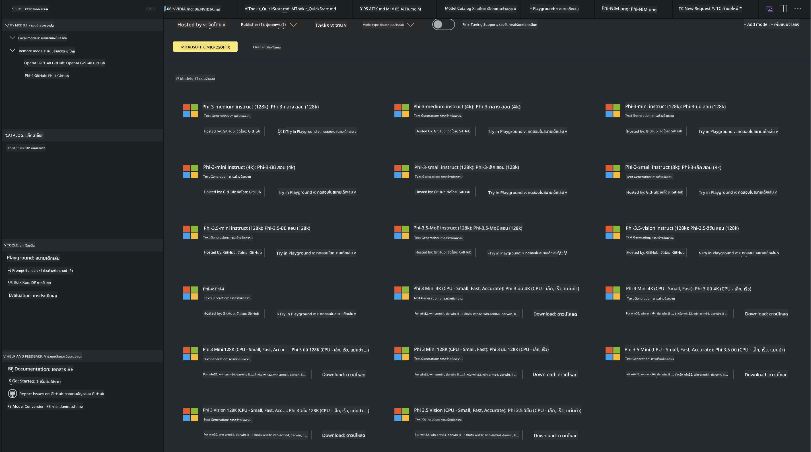
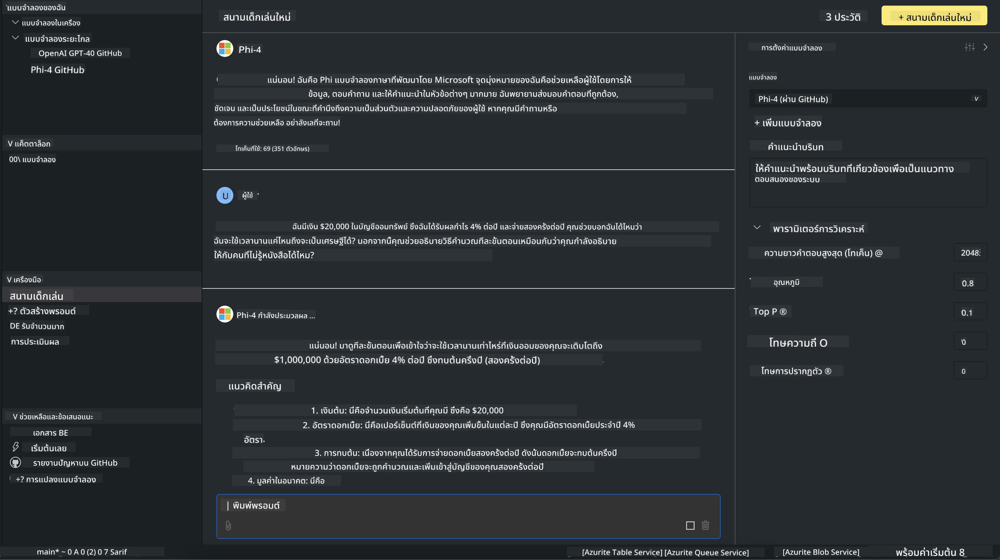

<!--
CO_OP_TRANSLATOR_METADATA:
{
  "original_hash": "4951d458c0b60c02cd1e751b40903877",
  "translation_date": "2025-05-09T09:35:00+00:00",
  "source_file": "md/01.Introduction/02/05.AITK.md",
  "language_code": "th"
}
-->
# Phi Family in AITK

[AI Toolkit for VS Code](https://marketplace.visualstudio.com/items?itemName=ms-windows-ai-studio.windows-ai-studio) ช่วยให้ง่ายต่อการพัฒนาแอป AI แบบสร้างสรรค์ โดยรวบรวมเครื่องมือและโมเดล AI ขั้นสูงจาก Azure AI Foundry Catalog และแหล่งอื่น ๆ เช่น Hugging Face คุณจะสามารถเรียกดูแคตตาล็อกโมเดล AI ที่ขับเคลื่อนโดย GitHub Models และ Azure AI Foundry Model Catalogs ดาวน์โหลดมาใช้งานทั้งแบบเครื่องท้องถิ่นหรือระยะไกล ปรับแต่ง ทดสอบ และใช้งานในแอปพลิเคชันของคุณได้

AI Toolkit Preview จะทำงานแบบเครื่องท้องถิ่น การสรุปผลหรือการปรับแต่งขึ้นอยู่กับโมเดลที่คุณเลือก อาจจำเป็นต้องใช้ GPU เช่น NVIDIA CUDA GPU คุณยังสามารถรัน GitHub Models โดยตรงกับ AITK ได้เช่นกัน

## เริ่มต้นใช้งาน

[เรียนรู้เพิ่มเติมเกี่ยวกับการติดตั้ง Windows subsystem for Linux](https://learn.microsoft.com/windows/wsl/install?WT.mc_id=aiml-137032-kinfeylo)

และ [การเปลี่ยนแปลงดิสทริบิวชันเริ่มต้น](https://learn.microsoft.com/windows/wsl/install#change-the-default-linux-distribution-installed)

[AI Tooklit GitHub Repo](https://github.com/microsoft/vscode-ai-toolkit/)

- Windows, Linux, macOS
  
- สำหรับการปรับแต่งบนทั้ง Windows และ Linux คุณจะต้องมี Nvidia GPU นอกจากนี้ **Windows** ต้องใช้ subsystem for Linux ที่มี Ubuntu เวอร์ชัน 18.4 ขึ้นไป [เรียนรู้เพิ่มเติมเกี่ยวกับการติดตั้ง Windows subsystem for Linux](https://learn.microsoft.com/windows/wsl/install) และ [การเปลี่ยนแปลงดิสทริบิวชันเริ่มต้น](https://learn.microsoft.com/windows/wsl/install#change-the-default-linux-distribution-installed)

### การติดตั้ง AI Toolkit

AI Toolkit มาพร้อมกับ [ส่วนขยาย Visual Studio Code](https://code.visualstudio.com/docs/setup/additional-components#_vs-code-extensions) ดังนั้นคุณต้องติดตั้ง [VS Code](https://code.visualstudio.com/docs/setup/windows?WT.mc_id=aiml-137032-kinfeylo) ก่อน แล้วดาวน์โหลด AI Toolkit จาก [VS Marketplace](https://marketplace.visualstudio.com/items?itemName=ms-windows-ai-studio.windows-ai-studio)  
[AI Toolkit มีให้ดาวน์โหลดใน Visual Studio Marketplace](https://marketplace.visualstudio.com/items?itemName=ms-windows-ai-studio.windows-ai-studio) และติดตั้งได้เหมือนส่วนขยาย VS Code อื่น ๆ

ถ้าคุณไม่คุ้นเคยกับการติดตั้งส่วนขยาย VS Code ให้ทำตามขั้นตอนเหล่านี้:

### ลงชื่อเข้าใช้

1. ใน Activity Bar ของ VS Code เลือก **Extensions**
2. ในแถบค้นหา Extensions พิมพ์ "AI Toolkit"
3. เลือก "AI Toolkit for Visual Studio code"
4. เลือก **Install**

ตอนนี้คุณพร้อมใช้งานส่วนขยายแล้ว!

คุณจะถูกขอให้ลงชื่อเข้าใช้ GitHub กรุณาคลิก "Allow" เพื่อดำเนินการต่อ ระบบจะพาคุณไปยังหน้าลงชื่อเข้าใช้ GitHub

กรุณาลงชื่อเข้าใช้และทำตามขั้นตอน หลังจากเสร็จสิ้นเรียบร้อย คุณจะถูกพากลับไปที่ VS Code

เมื่อติดตั้งส่วนขยายเสร็จแล้ว คุณจะเห็นไอคอน AI Toolkit ปรากฏใน Activity Bar

มาสำรวจฟังก์ชันที่มีให้กันเถอะ!

### ฟังก์ชันที่มีให้ใช้งาน

แถบด้านข้างหลักของ AI Toolkit จัดเรียงเป็น  

- **Models**
- **Resources**
- **Playground**  
- **Fine-tuning**
- **Evaluation**

มีให้ใช้งานในส่วน Resources เริ่มต้นด้วยการเลือก **Model Catalog**

### ดาวน์โหลดโมเดลจากแคตตาล็อก

เมื่อเปิด AI Toolkit จากแถบด้านข้าง VS Code คุณสามารถเลือกตัวเลือกต่อไปนี้:



- ค้นหาโมเดลที่รองรับจาก **Model Catalog** และดาวน์โหลดมาใช้งานแบบเครื่องท้องถิ่น
- ทดสอบการสรุปผลโมเดลใน **Model Playground**
- ปรับแต่งโมเดลแบบเครื่องท้องถิ่นหรือระยะไกลใน **Model Fine-tuning**
- นำโมเดลที่ปรับแต่งแล้วไปใช้งานบนคลาวด์ผ่านคำสั่งใน command palette ของ AI Toolkit
- ประเมินผลโมเดล

> [!NOTE]
>
> **GPU Vs CPU**
>
> คุณจะเห็นว่าโมเดลการ์ดแสดงขนาดโมเดล แพลตฟอร์ม และประเภทตัวเร่งความเร็ว (CPU, GPU) สำหรับประสิทธิภาพที่เหมาะสมบน **อุปกรณ์ Windows ที่มี GPU อย่างน้อยหนึ่งตัว** ให้เลือกเวอร์ชันโมเดลที่รองรับเฉพาะ Windows
>
> เพื่อให้แน่ใจว่าคุณได้โมเดลที่ปรับแต่งมาเพื่อ DirectML accelerator
>
> ชื่อโมเดลจะอยู่ในรูปแบบ
>
> - `{model_name}-{accelerator}-{quantization}-{format}`
>
> หากต้องการตรวจสอบว่าอุปกรณ์ Windows ของคุณมี GPU หรือไม่ ให้เปิด **Task Manager** แล้วเลือกแท็บ **Performance** หากมี GPU จะปรากฏในชื่อเช่น "GPU 0" หรือ "GPU 1"

### รันโมเดลใน playground

หลังจากตั้งค่าพารามิเตอร์ทั้งหมดแล้ว คลิก **Generate Project**

เมื่อดาวน์โหลดโมเดลเสร็จแล้ว เลือก **Load in Playground** บนการ์ดโมเดลในแคตตาล็อก:

- เริ่มดาวน์โหลดโมเดล
- ติดตั้งสิ่งที่จำเป็นและไลบรารีที่เกี่ยวข้องทั้งหมด
- สร้าง workspace ใน VS Code



### ใช้ REST API ในแอปพลิเคชันของคุณ

AI Toolkit มาพร้อมกับเว็บเซิร์ฟเวอร์ REST API แบบเครื่องท้องถิ่น **บนพอร์ต 5272** ที่ใช้รูปแบบ [OpenAI chat completions format](https://platform.openai.com/docs/api-reference/chat/create)  

ช่วยให้คุณทดสอบแอปพลิเคชันแบบเครื่องท้องถิ่นโดยไม่ต้องพึ่งพาบริการโมเดล AI บนคลาวด์ เช่น ไฟล์ JSON ด้านล่างแสดงวิธีการกำหนดค่าร่างคำขอ:

```json
{
    "model": "Phi-4",
    "messages": [
        {
            "role": "user",
            "content": "what is the golden ratio?"
        }
    ],
    "temperature": 0.7,
    "top_p": 1,
    "top_k": 10,
    "max_tokens": 100,
    "stream": true
}
```

คุณสามารถทดสอบ REST API โดยใช้ (เช่น) [Postman](https://www.postman.com/) หรือเครื่องมือ CURL (Client URL):

```bash
curl -vX POST http://127.0.0.1:5272/v1/chat/completions -H 'Content-Type: application/json' -d @body.json
```

### การใช้ไลบรารี OpenAI client สำหรับ Python

```python
from openai import OpenAI

client = OpenAI(
    base_url="http://127.0.0.1:5272/v1/", 
    api_key="x" # required for the API but not used
)

chat_completion = client.chat.completions.create(
    messages=[
        {
            "role": "user",
            "content": "what is the golden ratio?",
        }
    ],
    model="Phi-4",
)

print(chat_completion.choices[0].message.content)
```

### การใช้ไลบรารี Azure OpenAI client สำหรับ .NET

เพิ่ม [Azure OpenAI client library สำหรับ .NET](https://www.nuget.org/packages/Azure.AI.OpenAI/) ในโปรเจกต์ของคุณผ่าน NuGet:

```bash
dotnet add {project_name} package Azure.AI.OpenAI --version 1.0.0-beta.17
```

เพิ่มไฟล์ C# ชื่อ **OverridePolicy.cs** ในโปรเจกต์และวางโค้ดต่อไปนี้:

```csharp
// OverridePolicy.cs
using Azure.Core.Pipeline;
using Azure.Core;

internal partial class OverrideRequestUriPolicy(Uri overrideUri)
    : HttpPipelineSynchronousPolicy
{
    private readonly Uri _overrideUri = overrideUri;

    public override void OnSendingRequest(HttpMessage message)
    {
        message.Request.Uri.Reset(_overrideUri);
    }
}
```

จากนั้น วางโค้ดต่อไปนี้ในไฟล์ **Program.cs** ของคุณ:

```csharp
// Program.cs
using Azure.AI.OpenAI;

Uri localhostUri = new("http://localhost:5272/v1/chat/completions");

OpenAIClientOptions clientOptions = new();
clientOptions.AddPolicy(
    new OverrideRequestUriPolicy(localhostUri),
    Azure.Core.HttpPipelinePosition.BeforeTransport);
OpenAIClient client = new(openAIApiKey: "unused", clientOptions);

ChatCompletionsOptions options = new()
{
    DeploymentName = "Phi-4",
    Messages =
    {
        new ChatRequestSystemMessage("You are a helpful assistant. Be brief and succinct."),
        new ChatRequestUserMessage("What is the golden ratio?"),
    }
};

StreamingResponse<StreamingChatCompletionsUpdate> streamingChatResponse
    = await client.GetChatCompletionsStreamingAsync(options);

await foreach (StreamingChatCompletionsUpdate chatChunk in streamingChatResponse)
{
    Console.Write(chatChunk.ContentUpdate);
}
```


## การปรับแต่งด้วย AI Toolkit

- เริ่มต้นด้วยการค้นหาโมเดลและ playground
- การปรับแต่งและสรุปผลโมเดลโดยใช้ทรัพยากรเครื่องท้องถิ่น
- การปรับแต่งและสรุปผลโมเดลแบบระยะไกลโดยใช้ทรัพยากร Azure

[Fine Tuning with AI Toolkit](../../03.FineTuning/Finetuning_VSCodeaitoolkit.md)

## แหล่งข้อมูล Q&A ของ AI Toolkit

โปรดดูที่ [หน้า Q&A](https://github.com/microsoft/vscode-ai-toolkit/blob/main/archive/QA.md) สำหรับปัญหาและวิธีแก้ไขที่พบบ่อยที่สุด

**ข้อจำกัดความรับผิดชอบ**:  
เอกสารนี้ได้รับการแปลโดยใช้บริการแปลภาษาอัตโนมัติ [Co-op Translator](https://github.com/Azure/co-op-translator) แม้ว่าเราจะพยายามให้ความถูกต้องสูงสุด โปรดทราบว่าการแปลอัตโนมัติอาจมีข้อผิดพลาดหรือความไม่ถูกต้อง เอกสารต้นฉบับในภาษาต้นฉบับถือเป็นแหล่งข้อมูลที่น่าเชื่อถือ สำหรับข้อมูลที่สำคัญ ขอแนะนำให้ใช้การแปลโดยผู้เชี่ยวชาญมนุษย์ เราไม่รับผิดชอบต่อความเข้าใจผิดหรือการตีความผิดใด ๆ ที่เกิดจากการใช้การแปลนี้