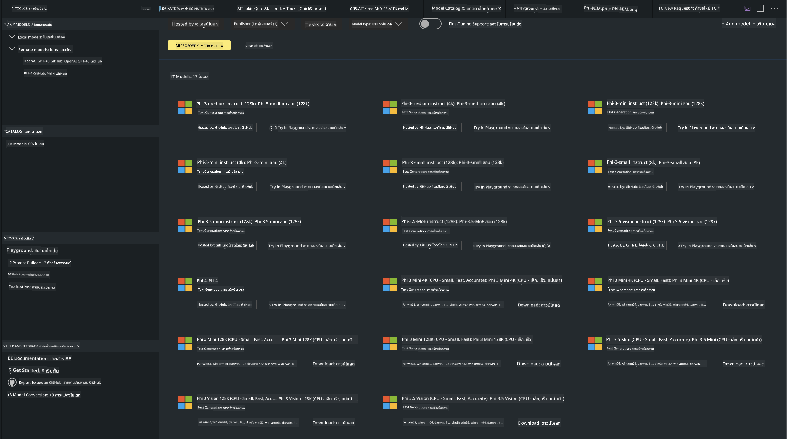

<!--
CO_OP_TRANSLATOR_METADATA:
{
  "original_hash": "4951d458c0b60c02cd1e751b40903877",
  "translation_date": "2025-07-16T19:26:29+00:00",
  "source_file": "md/01.Introduction/02/05.AITK.md",
  "language_code": "th"
}
-->
# Phi Family in AITK

[AI Toolkit for VS Code](https://marketplace.visualstudio.com/items?itemName=ms-windows-ai-studio.windows-ai-studio) ช่วยให้งานพัฒนาแอป AI สร้างสรรค์ง่ายขึ้นโดยรวบรวมเครื่องมือและโมเดล AI ขั้นสูงจาก Azure AI Foundry Catalog และแคตตาล็อกอื่นๆ เช่น Hugging Face คุณจะสามารถเรียกดูแคตตาล็อกโมเดล AI ที่ขับเคลื่อนโดย GitHub Models และ Azure AI Foundry Model Catalogs ดาวน์โหลดมาใช้งานทั้งแบบเครื่องท้องถิ่นหรือระยะไกล ปรับแต่ง ทดสอบ และนำไปใช้ในแอปพลิเคชันของคุณได้

AI Toolkit Preview จะรันบนเครื่องท้องถิ่น การทำ inference หรือ fine-tune ขึ้นอยู่กับโมเดลที่คุณเลือก อาจจำเป็นต้องมี GPU เช่น NVIDIA CUDA GPU คุณยังสามารถรัน GitHub Models โดยตรงผ่าน AITK ได้เช่นกัน

## เริ่มต้นใช้งาน

[เรียนรู้วิธีติดตั้ง Windows subsystem for Linux](https://learn.microsoft.com/windows/wsl/install?WT.mc_id=aiml-137032-kinfeylo)

และ [เปลี่ยนการแจกจ่ายเริ่มต้น](https://learn.microsoft.com/windows/wsl/install#change-the-default-linux-distribution-installed)

[AI Tooklit GitHub Repo](https://github.com/microsoft/vscode-ai-toolkit/)

- Windows, Linux, macOS

- สำหรับการ fine-tuning บน Windows และ Linux คุณจะต้องมี Nvidia GPU นอกจากนี้ **Windows** ต้องใช้ subsystem for Linux ที่มี Ubuntu เวอร์ชัน 18.4 ขึ้นไป [เรียนรู้วิธีติดตั้ง Windows subsystem for Linux](https://learn.microsoft.com/windows/wsl/install) และ [เปลี่ยนการแจกจ่ายเริ่มต้น](https://learn.microsoft.com/windows/wsl/install#change-the-default-linux-distribution-installed)

### ติดตั้ง AI Toolkit

AI Toolkit ถูกจัดส่งในรูปแบบ [ส่วนขยาย Visual Studio Code](https://code.visualstudio.com/docs/setup/additional-components#_vs-code-extensions) ดังนั้นคุณต้องติดตั้ง [VS Code](https://code.visualstudio.com/docs/setup/windows?WT.mc_id=aiml-137032-kinfeylo) ก่อน และดาวน์โหลด AI Toolkit จาก [VS Marketplace](https://marketplace.visualstudio.com/items?itemName=ms-windows-ai-studio.windows-ai-studio)  
[AI Toolkit มีให้ใช้งานใน Visual Studio Marketplace](https://marketplace.visualstudio.com/items?itemName=ms-windows-ai-studio.windows-ai-studio) และสามารถติดตั้งได้เหมือนส่วนขยาย VS Code อื่นๆ

ถ้าคุณไม่คุ้นเคยกับการติดตั้งส่วนขยาย VS Code ให้ทำตามขั้นตอนนี้:

### ลงชื่อเข้าใช้

1. ใน Activity Bar ของ VS Code เลือก **Extensions**  
2. ในแถบค้นหา Extensions พิมพ์ "AI Toolkit"  
3. เลือก "AI Toolkit for Visual Studio code"  
4. เลือก **Install**

ตอนนี้คุณพร้อมใช้งานส่วนขยายแล้ว!

คุณจะถูกขอให้ลงชื่อเข้าใช้ GitHub กรุณาคลิก "Allow" เพื่อดำเนินการต่อ คุณจะถูกเปลี่ยนเส้นทางไปยังหน้าลงชื่อเข้าใช้ GitHub

กรุณาลงชื่อเข้าใช้และทำตามขั้นตอน หลังจากเสร็จสิ้นสำเร็จ คุณจะถูกเปลี่ยนเส้นทางกลับไปยัง VS Code

เมื่อส่วนขยายติดตั้งเสร็จ คุณจะเห็นไอคอน AI Toolkit ปรากฏใน Activity Bar

มาสำรวจฟังก์ชันที่มีให้ใช้งานกัน!

### ฟังก์ชันที่มีให้ใช้งาน

แถบด้านข้างหลักของ AI Toolkit จัดเป็นหมวดหมู่ดังนี้

- **Models**  
- **Resources**  
- **Playground**  
- **Fine-tuning**  
- **Evaluation**

สามารถเข้าถึงได้ในส่วน Resources เพื่อเริ่มต้นให้เลือก **Model Catalog**

### ดาวน์โหลดโมเดลจากแคตตาล็อก

เมื่อเปิด AI Toolkit จากแถบด้านข้างของ VS Code คุณสามารถเลือกตัวเลือกดังนี้:



- ค้นหาโมเดลที่รองรับจาก **Model Catalog** และดาวน์โหลดมาใช้งานบนเครื่อง  
- ทดสอบการทำ inference ของโมเดลใน **Model Playground**  
- ปรับแต่งโมเดล (fine-tune) บนเครื่องหรือระยะไกลใน **Model Fine-tuning**  
- นำโมเดลที่ปรับแต่งแล้วไปใช้งานบนคลาวด์ผ่าน command palette ของ AI Toolkit  
- ประเมินผลโมเดล

> [!NOTE]
>
> **GPU กับ CPU**
>
> คุณจะเห็นว่าในบัตรโมเดลจะแสดงขนาดโมเดล แพลตฟอร์ม และประเภทตัวเร่งความเร็ว (CPU, GPU) เพื่อประสิทธิภาพที่ดีที่สุดบน **อุปกรณ์ Windows ที่มี GPU อย่างน้อยหนึ่งตัว** ให้เลือกเวอร์ชันโมเดลที่รองรับเฉพาะ Windows เท่านั้น
>
> วิธีนี้จะช่วยให้คุณได้โมเดลที่เหมาะสมกับตัวเร่งความเร็ว DirectML
>
> ชื่อโมเดลจะอยู่ในรูปแบบ
>
> - `{model_name}-{accelerator}-{quantization}-{format}`
>
> หากต้องการตรวจสอบว่าอุปกรณ์ Windows ของคุณมี GPU หรือไม่ ให้เปิด **Task Manager** แล้วเลือกแท็บ **Performance** ถ้ามี GPU จะปรากฏชื่อเช่น "GPU 0" หรือ "GPU 1"

### รันโมเดลใน playground

หลังตั้งค่าพารามิเตอร์ทั้งหมดแล้ว ให้คลิก **Generate Project**

เมื่อดาวน์โหลดโมเดลเสร็จแล้ว ให้เลือก **Load in Playground** บนบัตรโมเดลในแคตตาล็อก:

- เริ่มดาวน์โหลดโมเดล  
- ติดตั้งสิ่งที่จำเป็นและ dependencies ทั้งหมด  
- สร้าง workspace ใน VS Code


### ใช้ REST API ในแอปพลิเคชันของคุณ

AI Toolkit มาพร้อมกับเว็บเซิร์ฟเวอร์ REST API ท้องถิ่น **บนพอร์ต 5272** ที่ใช้ [รูปแบบ OpenAI chat completions](https://platform.openai.com/docs/api-reference/chat/create)

ช่วยให้คุณทดสอบแอปพลิเคชันบนเครื่องโดยไม่ต้องพึ่งพาบริการโมเดล AI บนคลาวด์ เช่น ไฟล์ JSON ด้านล่างแสดงวิธีตั้งค่าร่างคำขอ:

```json
{
    "model": "Phi-4",
    "messages": [
        {
            "role": "user",
            "content": "what is the golden ratio?"
        }
    ],
    "temperature": 0.7,
    "top_p": 1,
    "top_k": 10,
    "max_tokens": 100,
    "stream": true
}
```

คุณสามารถทดสอบ REST API ด้วยเครื่องมืออย่าง [Postman](https://www.postman.com/) หรือ CURL (Client URL):

```bash
curl -vX POST http://127.0.0.1:5272/v1/chat/completions -H 'Content-Type: application/json' -d @body.json
```

### การใช้ไลบรารี OpenAI client สำหรับ Python

```python
from openai import OpenAI

client = OpenAI(
    base_url="http://127.0.0.1:5272/v1/", 
    api_key="x" # required for the API but not used
)

chat_completion = client.chat.completions.create(
    messages=[
        {
            "role": "user",
            "content": "what is the golden ratio?",
        }
    ],
    model="Phi-4",
)

print(chat_completion.choices[0].message.content)
```

### การใช้ไลบรารี Azure OpenAI client สำหรับ .NET

เพิ่ม [Azure OpenAI client library สำหรับ .NET](https://www.nuget.org/packages/Azure.AI.OpenAI/) ในโปรเจกต์ของคุณผ่าน NuGet:

```bash
dotnet add {project_name} package Azure.AI.OpenAI --version 1.0.0-beta.17
```

เพิ่มไฟล์ C# ชื่อ **OverridePolicy.cs** ในโปรเจกต์ของคุณและวางโค้ดต่อไปนี้:

```csharp
// OverridePolicy.cs
using Azure.Core.Pipeline;
using Azure.Core;

internal partial class OverrideRequestUriPolicy(Uri overrideUri)
    : HttpPipelineSynchronousPolicy
{
    private readonly Uri _overrideUri = overrideUri;

    public override void OnSendingRequest(HttpMessage message)
    {
        message.Request.Uri.Reset(_overrideUri);
    }
}
```

จากนั้น วางโค้ดต่อไปนี้ในไฟล์ **Program.cs** ของคุณ:

```csharp
// Program.cs
using Azure.AI.OpenAI;

Uri localhostUri = new("http://localhost:5272/v1/chat/completions");

OpenAIClientOptions clientOptions = new();
clientOptions.AddPolicy(
    new OverrideRequestUriPolicy(localhostUri),
    Azure.Core.HttpPipelinePosition.BeforeTransport);
OpenAIClient client = new(openAIApiKey: "unused", clientOptions);

ChatCompletionsOptions options = new()
{
    DeploymentName = "Phi-4",
    Messages =
    {
        new ChatRequestSystemMessage("You are a helpful assistant. Be brief and succinct."),
        new ChatRequestUserMessage("What is the golden ratio?"),
    }
};

StreamingResponse<StreamingChatCompletionsUpdate> streamingChatResponse
    = await client.GetChatCompletionsStreamingAsync(options);

await foreach (StreamingChatCompletionsUpdate chatChunk in streamingChatResponse)
{
    Console.Write(chatChunk.ContentUpdate);
}
```


## การปรับแต่งโมเดลด้วย AI Toolkit

- เริ่มต้นด้วยการค้นหาโมเดลและ playground  
- ปรับแต่งและทำ inference ด้วยทรัพยากรคอมพิวเตอร์ท้องถิ่น  
- ปรับแต่งและทำ inference ระยะไกลโดยใช้ทรัพยากร Azure

[การปรับแต่งด้วย AI Toolkit](../../03.FineTuning/Finetuning_VSCodeaitoolkit.md)

## แหล่งข้อมูล Q&A ของ AI Toolkit

โปรดดูที่ [หน้า Q&A](https://github.com/microsoft/vscode-ai-toolkit/blob/main/archive/QA.md) สำหรับปัญหาที่พบบ่อยและวิธีแก้ไข

**ข้อจำกัดความรับผิดชอบ**:  
เอกสารนี้ได้รับการแปลโดยใช้บริการแปลภาษาอัตโนมัติ [Co-op Translator](https://github.com/Azure/co-op-translator) แม้เราจะพยายามให้ความถูกต้องสูงสุด แต่โปรดทราบว่าการแปลอัตโนมัติอาจมีข้อผิดพลาดหรือความไม่ถูกต้อง เอกสารต้นฉบับในภาษาต้นทางถือเป็นแหล่งข้อมูลที่เชื่อถือได้ สำหรับข้อมูลที่สำคัญ ขอแนะนำให้ใช้บริการแปลโดยผู้เชี่ยวชาญมนุษย์ เราไม่รับผิดชอบต่อความเข้าใจผิดหรือการตีความผิดใด ๆ ที่เกิดจากการใช้การแปลนี้