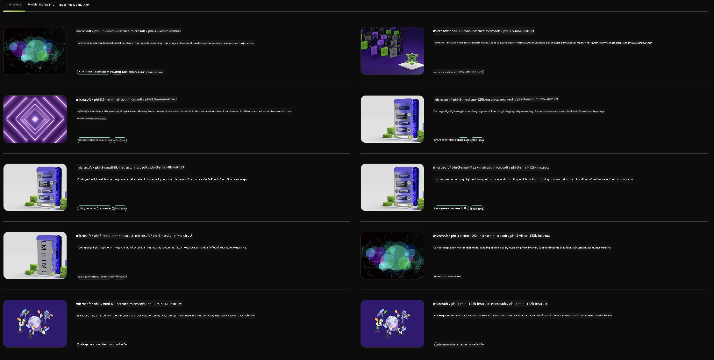

<!--
CO_OP_TRANSLATOR_METADATA:
{
  "original_hash": "7b08e277df2a9307f861ae54bc30c772",
  "translation_date": "2025-05-09T09:54:33+00:00",
  "source_file": "md/01.Introduction/02/06.NVIDIA.md",
  "language_code": "th"
}
-->
## Phi Family in NVIDIA NIM

NVIDIA NIM คือชุดไมโครเซอร์วิสที่ใช้งานง่าย ออกแบบมาเพื่อเร่งการใช้งานโมเดล AI สร้างสรรค์ (generative AI) ในคลาวด์ ศูนย์ข้อมูล และเวิร์กสเตชัน โดย NIM ถูกจัดหมวดหมู่ตามตระกูลโมเดลและแยกตามแต่ละโมเดล เช่น NVIDIA NIM สำหรับโมเดลภาษาขนาดใหญ่ (LLMs) ช่วยนำพลังของ LLMs ที่ทันสมัยสู่แอปพลิเคชันองค์กร ให้ความสามารถในการประมวลผลและเข้าใจภาษาธรรมชาติอย่างเหนือชั้น

NIM ช่วยให้ทีม IT และ DevOps สามารถโฮสต์โมเดลภาษาขนาดใหญ่ (LLMs) ด้วยตนเองในสภาพแวดล้อมที่จัดการได้อย่างง่ายดาย พร้อมทั้งยังมอบ API มาตรฐานอุตสาหกรรมให้กับนักพัฒนา เพื่อสร้าง copilots, chatbot และผู้ช่วย AI ที่ทรงพลังซึ่งเปลี่ยนแปลงธุรกิจได้ ด้วยการใช้ประโยชน์จากการเร่งความเร็ว GPU ขั้นสูงของ NVIDIA และการปรับขยายการใช้งาน NIM จึงเป็นเส้นทางที่เร็วที่สุดสู่การทำ inference ด้วยประสิทธิภาพที่ไม่มีใครเทียบได้

คุณสามารถใช้ NVIDIA NIM ในการทำ inference กับ Phi Family Models



### **ตัวอย่าง - Phi-3-Vision ใน NVIDIA NIM**

ลองนึกภาพว่าคุณมีรูปภาพ (`demo.png`) และต้องการสร้างโค้ด Python เพื่อประมวลผลภาพนี้และบันทึกเป็นเวอร์ชันใหม่ (`phi-3-vision.jpg`)

โค้ดด้านบนทำงานอัตโนมัติโดย:

1. ตั้งค่าสภาพแวดล้อมและการกำหนดค่าที่จำเป็น
2. สร้าง prompt ที่สั่งให้โมเดลสร้างโค้ด Python ที่ต้องการ
3. ส่ง prompt ไปยังโมเดลและเก็บโค้ดที่ได้มา
4. ดึงโค้ดที่สร้างขึ้นมาและรันโค้ดนั้น
5. แสดงภาพต้นฉบับและภาพที่ผ่านการประมวลผล

วิธีนี้ใช้พลังของ AI เพื่อทำงานประมวลผลภาพให้อัตโนมัติ ทำให้ทำงานได้ง่ายและรวดเร็วขึ้น

[Sample Code Solution](../../../../../code/06.E2E/E2E_Nvidia_NIM_Phi3_Vision.ipynb)

เรามาแยกวิเคราะห์โค้ดทั้งหมดทีละขั้นตอนกัน:

1. **ติดตั้งแพ็กเกจที่จำเป็น**:
    ```python
    !pip install langchain_nvidia_ai_endpoints -U
    ```
    คำสั่งนี้ติดตั้งแพ็กเกจ `langchain_nvidia_ai_endpoints` ให้เป็นเวอร์ชันล่าสุด

2. **นำเข้าโมดูลที่จำเป็น**:
    ```python
    from langchain_nvidia_ai_endpoints import ChatNVIDIA
    import getpass
    import os
    import base64
    ```
    การนำเข้าเหล่านี้นำเข้าโมดูลที่จำเป็นสำหรับการติดต่อกับ NVIDIA AI endpoints การจัดการรหัสผ่านอย่างปลอดภัย การทำงานกับระบบปฏิบัติการ และการเข้ารหัส/ถอดรหัสข้อมูลในรูปแบบ base64

3. **ตั้งค่า API Key**:
    ```python
    if not os.getenv("NVIDIA_API_KEY"):
        os.environ["NVIDIA_API_KEY"] = getpass.getpass("Enter your NVIDIA API key: ")
    ```
    โค้ดนี้ตรวจสอบว่าตัวแปรสภาพแวดล้อม `NVIDIA_API_KEY` ถูกตั้งค่าหรือไม่ หากไม่ ระบบจะขอให้ผู้ใช้กรอก API key อย่างปลอดภัย

4. **กำหนดโมเดลและเส้นทางของภาพ**:
    ```python
    model = 'microsoft/phi-3-vision-128k-instruct'
    chat = ChatNVIDIA(model=model)
    img_path = './imgs/demo.png'
    ```
    กำหนดโมเดลที่จะใช้ สร้างอินสแตนซ์ของ `ChatNVIDIA` ด้วยโมเดลที่ระบุ และกำหนดเส้นทางไปยังไฟล์ภาพ

5. **สร้างข้อความ prompt**:
    ```python
    text = "Please create Python code for image, and use plt to save the new picture under imgs/ and name it phi-3-vision.jpg."
    ```
    กำหนดข้อความ prompt ที่สั่งให้โมเดลสร้างโค้ด Python สำหรับประมวลผลภาพ

6. **เข้ารหัสภาพเป็น Base64**:
    ```python
    with open(img_path, "rb") as f:
        image_b64 = base64.b64encode(f.read()).decode()
    image = f''
    ```
    โค้ดนี้อ่านไฟล์ภาพ เข้ารหัสเป็น base64 และสร้างแท็กภาพ HTML ด้วยข้อมูลที่เข้ารหัส

7. **รวมข้อความและภาพเป็น prompt เดียว**:
    ```python
    prompt = f"{text} {image}"
    ```
    รวมข้อความ prompt และแท็กภาพ HTML เข้าด้วยกันเป็นสตริงเดียว

8. **สร้างโค้ดโดยใช้ ChatNVIDIA**:
    ```python
    code = ""
    for chunk in chat.stream(prompt):
        print(chunk.content, end="")
        code += chunk.content
    ```
    ส่ง prompt ไปยัง `ChatNVIDIA` model and collects the generated code in chunks, printing and appending each chunk to the `code` string

9. **ดึงโค้ด Python จากเนื้อหาที่สร้างขึ้น**:
    ```python
    begin = code.index('```python') + 9
    code = code[begin:]
    end = code.index('```')
    code = code[:end]
    ```
    ดึงโค้ด Python จริงออกจากเนื้อหาที่สร้างขึ้นโดยตัด markdown formatting ออก

10. **รันโค้ดที่สร้างขึ้น**:
    ```python
    import subprocess
    result = subprocess.run(["python", "-c", code], capture_output=True)
    ```
    รันโค้ด Python ที่ดึงออกมาเป็น subprocess และเก็บผลลัพธ์

11. **แสดงภาพ**:
    ```python
    from IPython.display import Image, display
    display(Image(filename='./imgs/phi-3-vision.jpg'))
    display(Image(filename='./imgs/demo.png'))
    ```
    โค้ดเหล่านี้แสดงภาพโดยใช้โมดูล `IPython.display`

**ข้อจำกัดความรับผิดชอบ**:  
เอกสารนี้ได้รับการแปลโดยใช้บริการแปลภาษาด้วย AI [Co-op Translator](https://github.com/Azure/co-op-translator) แม้เราจะพยายามให้ความถูกต้องสูงสุด แต่โปรดทราบว่าการแปลอัตโนมัติอาจมีข้อผิดพลาดหรือความไม่ถูกต้อง เอกสารต้นฉบับในภาษาต้นทางควรถูกพิจารณาเป็นแหล่งข้อมูลที่เชื่อถือได้ สำหรับข้อมูลที่สำคัญ แนะนำให้ใช้บริการแปลโดยมืออาชีพที่เป็นมนุษย์ เราไม่รับผิดชอบต่อความเข้าใจผิดหรือการตีความที่ผิดพลาดใด ๆ ที่เกิดขึ้นจากการใช้การแปลนี้