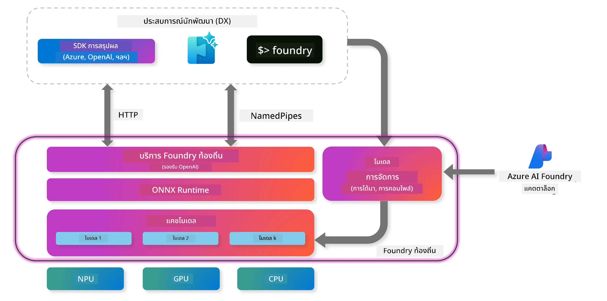
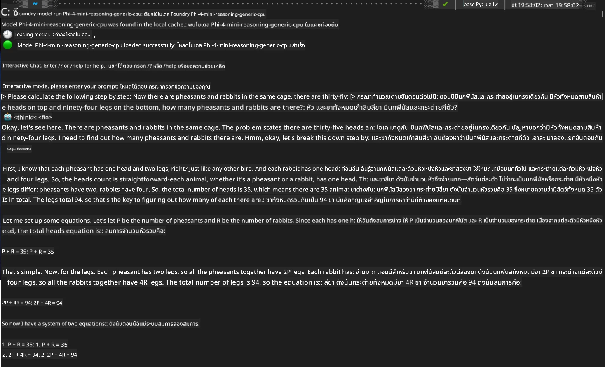

<!--
CO_OP_TRANSLATOR_METADATA:
{
  "original_hash": "52973a5680a65a810aa80b7036afd31f",
  "translation_date": "2025-07-16T19:47:07+00:00",
  "source_file": "md/01.Introduction/02/07.FoundryLocal.md",
  "language_code": "th"
}
-->
## การเริ่มต้นใช้งานโมเดล Phi-Family ใน Foundry Local

### แนะนำ Foundry Local

Foundry Local คือโซลูชันการประมวลผล AI บนอุปกรณ์ที่ทรงพลัง ซึ่งนำความสามารถ AI ระดับองค์กรมาไว้บนฮาร์ดแวร์ของคุณโดยตรง บทเรียนนี้จะพาคุณตั้งค่าและใช้งานโมเดล Phi-Family กับ Foundry Local เพื่อให้คุณควบคุมงาน AI ได้อย่างเต็มที่ พร้อมทั้งรักษาความเป็นส่วนตัวและลดค่าใช้จ่าย

Foundry Local มอบประสิทธิภาพ ความเป็นส่วนตัว การปรับแต่ง และความคุ้มค่า ด้วยการรันโมเดล AI บนอุปกรณ์ของคุณโดยตรง สามารถผสานรวมเข้ากับเวิร์กโฟลว์และแอปพลิเคชันที่มีอยู่ผ่าน CLI, SDK และ REST API ที่ใช้งานง่าย



### ทำไมต้องเลือก Foundry Local?

การเข้าใจข้อดีของ Foundry Local จะช่วยให้คุณตัดสินใจวางแผนการใช้งาน AI ได้อย่างมีข้อมูล:

- **การประมวลผลบนอุปกรณ์:** รันโมเดลบนฮาร์ดแวร์ของคุณเอง ลดค่าใช้จ่ายและเก็บข้อมูลทั้งหมดไว้ในอุปกรณ์ของคุณ

- **การปรับแต่งโมเดล:** เลือกใช้โมเดลที่ตั้งค่ามาแล้วหรือใช้โมเดลของคุณเองเพื่อตอบโจทย์ความต้องการเฉพาะ

- **ความคุ้มค่าด้านค่าใช้จ่าย:** ตัดค่าใช้จ่ายบริการคลาวด์รายเดือนโดยใช้ฮาร์ดแวร์ที่มีอยู่ ทำให้ AI เข้าถึงได้ง่ายขึ้น

- **การผสานรวมที่ราบรื่น:** เชื่อมต่อกับแอปพลิเคชันผ่าน SDK, API หรือ CLI พร้อมขยายสเกลไปยัง Azure AI Foundry ได้ตามต้องการ

> **หมายเหตุการเริ่มต้น:** บทเรียนนี้เน้นการใช้ Foundry Local ผ่าน CLI และ SDK คุณจะได้เรียนรู้ทั้งสองวิธีเพื่อเลือกใช้ให้เหมาะกับกรณีของคุณ

## ส่วนที่ 1: การตั้งค่า Foundry Local CLI

### ขั้นตอนที่ 1: การติดตั้ง

Foundry Local CLI คือประตูสู่การจัดการและรันโมเดล AI บนอุปกรณ์ของคุณ มาเริ่มติดตั้งบนระบบของคุณกัน

**แพลตฟอร์มที่รองรับ:** Windows และ macOS

สำหรับคำแนะนำการติดตั้งอย่างละเอียด โปรดดูที่ [เอกสาร Foundry Local อย่างเป็นทางการ](https://github.com/microsoft/Foundry-Local/blob/main/README.md)

### ขั้นตอนที่ 2: สำรวจโมเดลที่มีให้ใช้งาน

เมื่อคุณติดตั้ง Foundry Local CLI แล้ว คุณสามารถค้นหาโมเดลที่รองรับสำหรับกรณีการใช้งานของคุณได้ คำสั่งนี้จะแสดงโมเดลทั้งหมดที่รองรับ:


```bash
foundry model list
```

### ขั้นตอนที่ 3: ทำความเข้าใจโมเดล Phi Family

Phi Family มีโมเดลหลากหลายที่ปรับแต่งมาเพื่อกรณีการใช้งานและฮาร์ดแวร์ที่แตกต่างกัน นี่คือโมเดล Phi ที่มีใน Foundry Local:

**โมเดล Phi ที่มีให้ใช้งาน:** 

- **phi-3.5-mini** - โมเดลขนาดเล็กสำหรับงานพื้นฐาน
- **phi-3-mini-128k** - เวอร์ชันบริบทยาวสำหรับการสนทนาที่ต่อเนื่อง
- **phi-3-mini-4k** - โมเดลบริบทมาตรฐานสำหรับการใช้งานทั่วไป
- **phi-4** - โมเดลขั้นสูงที่มีความสามารถเพิ่มขึ้น
- **phi-4-mini** - เวอร์ชันน้ำหนักเบาของ Phi-4
- **phi-4-mini-reasoning** - โมเดลเฉพาะสำหรับงานวิเคราะห์เชิงเหตุผลที่ซับซ้อน

> **ความเข้ากันได้กับฮาร์ดแวร์:** แต่ละโมเดลสามารถตั้งค่าให้รองรับการเร่งความเร็วด้วยฮาร์ดแวร์ต่าง ๆ (CPU, GPU) ตามความสามารถของระบบคุณ

### ขั้นตอนที่ 4: รันโมเดล Phi ตัวแรกของคุณ

มาลองตัวอย่างใช้งานจริงกัน เราจะรันโมเดล `phi-4-mini-reasoning` ซึ่งโดดเด่นในการแก้ปัญหาที่ซับซ้อนทีละขั้นตอน


**คำสั่งรันโมเดล:**

```bash
foundry model run Phi-4-mini-reasoning-generic-cpu
```

> **การตั้งค่าในครั้งแรก:** เมื่อรันโมเดลเป็นครั้งแรก Foundry Local จะดาวน์โหลดโมเดลมายังอุปกรณ์ของคุณโดยอัตโนมัติ ระยะเวลาดาวน์โหลดขึ้นอยู่กับความเร็วเครือข่ายของคุณ กรุณารอสักครู่ในขั้นตอนนี้

### ขั้นตอนที่ 5: ทดสอบโมเดลด้วยปัญหาจริง

ตอนนี้มาทดสอบโมเดลด้วยปัญหาตรรกะคลาสสิกเพื่อดูการวิเคราะห์ทีละขั้นตอน:

**ตัวอย่างปัญหา:**

```txt
Please calculate the following step by step: Now there are pheasants and rabbits in the same cage, there are thirty-five heads on top and ninety-four legs on the bottom, how many pheasants and rabbits are there?
```

**พฤติกรรมที่คาดหวัง:** โมเดลควรแยกปัญหานี้ออกเป็นขั้นตอนเชิงตรรกะ โดยใช้ข้อมูลว่าห่านมีขา 2 ขา และกระต่ายมีขา 4 ขา เพื่อแก้ระบบสมการนี้

**ผลลัพธ์:**



## ส่วนที่ 2: การสร้างแอปพลิเคชันด้วย Foundry Local SDK

### ทำไมต้องใช้ SDK?

แม้ว่า CLI จะเหมาะสำหรับการทดสอบและโต้ตอบอย่างรวดเร็ว SDK ช่วยให้คุณผสานรวม Foundry Local เข้ากับแอปพลิเคชันของคุณในรูปแบบโปรแกรมมิ่ง เปิดโอกาสสำหรับ:

- สร้างแอปพลิเคชัน AI ที่ปรับแต่งเอง
- สร้างเวิร์กโฟลว์อัตโนมัติ
- ผสานรวมความสามารถ AI เข้ากับระบบที่มีอยู่
- พัฒนาบอทแชทและเครื่องมือโต้ตอบ

### ภาษาการเขียนโปรแกรมที่รองรับ

Foundry Local มี SDK รองรับหลายภาษาเพื่อให้เหมาะกับสภาพแวดล้อมการพัฒนาของคุณ:

**📦 SDK ที่มีให้:**

- **C# (.NET):** [เอกสารและตัวอย่าง SDK](https://github.com/microsoft/Foundry-Local/tree/main/sdk/cs)
- **Python:** [เอกสารและตัวอย่าง SDK](https://github.com/microsoft/Foundry-Local/tree/main/sdk/python)
- **JavaScript:** [เอกสารและตัวอย่าง SDK](https://github.com/microsoft/Foundry-Local/tree/main/sdk/js)
- **Rust:** [เอกสารและตัวอย่าง SDK](https://github.com/microsoft/Foundry-Local/tree/main/sdk/rust)

### ขั้นตอนถัดไป

1. **เลือก SDK ที่คุณชอบ** ตามสภาพแวดล้อมการพัฒนาของคุณ
2. **อ่านเอกสารเฉพาะ SDK** สำหรับคำแนะนำการใช้งานอย่างละเอียด
3. **เริ่มจากตัวอย่างง่าย ๆ** ก่อนสร้างแอปพลิเคชันที่ซับซ้อน
4. **สำรวจโค้ดตัวอย่าง** ที่มีในแต่ละรีโพสิตอรี SDK

## สรุป

ตอนนี้คุณได้เรียนรู้วิธี:
- ✅ ติดตั้งและตั้งค่า Foundry Local CLI
- ✅ ค้นหาและรันโมเดล Phi Family
- ✅ ทดสอบโมเดลด้วยปัญหาจริง
- ✅ เข้าใจตัวเลือก SDK สำหรับการพัฒนาแอปพลิเคชัน

Foundry Local เป็นพื้นฐานที่ทรงพลังในการนำความสามารถ AI มาสู่สภาพแวดล้อมท้องถิ่นของคุณ ให้คุณควบคุมประสิทธิภาพ ความเป็นส่วนตัว และค่าใช้จ่าย พร้อมความยืดหยุ่นในการขยายสเกลไปยังคลาวด์เมื่อจำเป็น

**ข้อจำกัดความรับผิดชอบ**:  
เอกสารนี้ได้รับการแปลโดยใช้บริการแปลภาษาอัตโนมัติ [Co-op Translator](https://github.com/Azure/co-op-translator) แม้เราจะพยายามให้ความถูกต้องสูงสุด แต่โปรดทราบว่าการแปลอัตโนมัติอาจมีข้อผิดพลาดหรือความไม่ถูกต้อง เอกสารต้นฉบับในภาษาต้นทางถือเป็นแหล่งข้อมูลที่เชื่อถือได้ สำหรับข้อมูลที่สำคัญ ขอแนะนำให้ใช้บริการแปลโดยผู้เชี่ยวชาญมนุษย์ เราไม่รับผิดชอบต่อความเข้าใจผิดหรือการตีความผิดใด ๆ ที่เกิดจากการใช้การแปลนี้