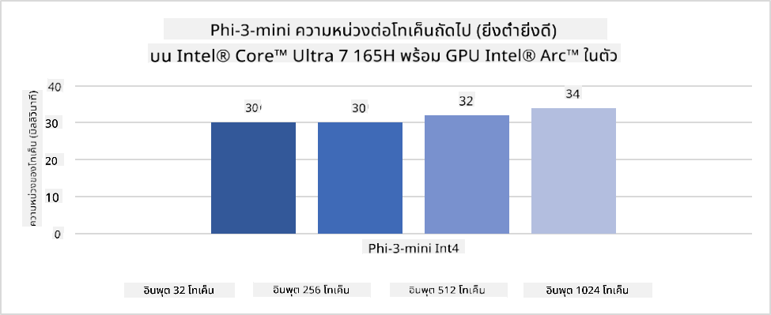
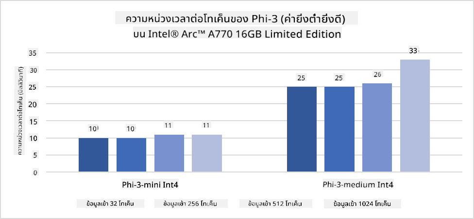
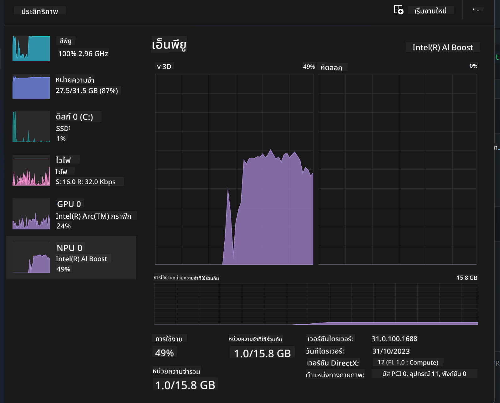
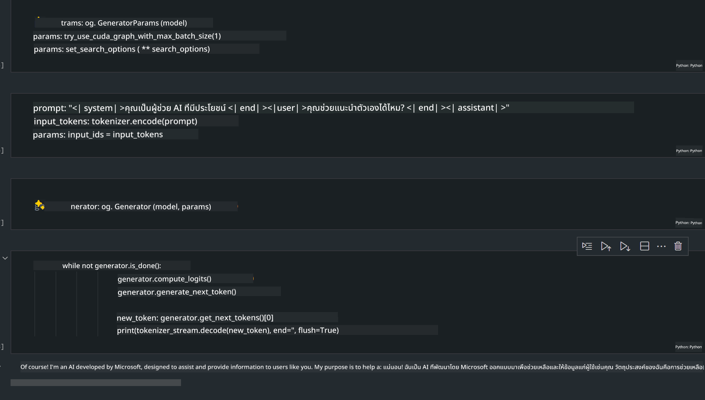
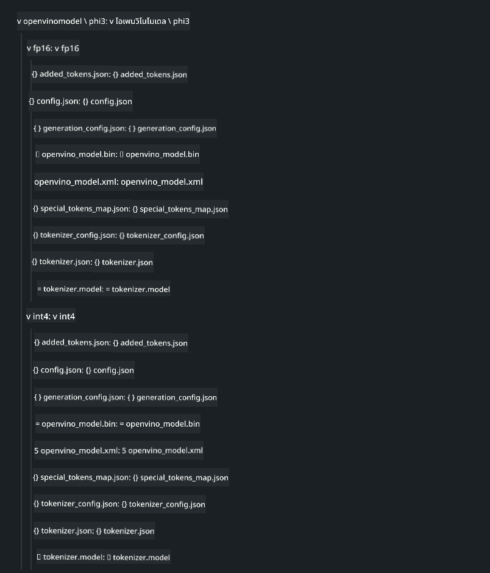
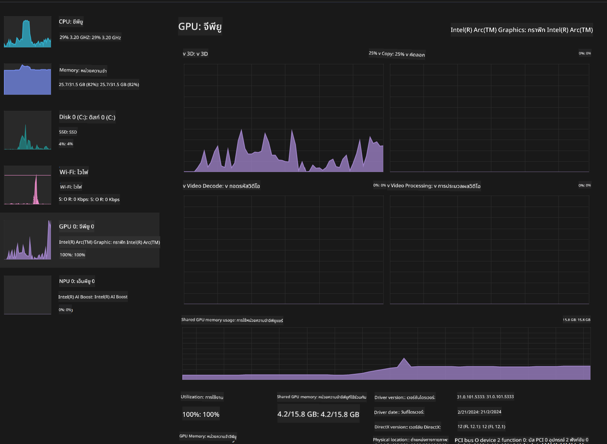

<!--
CO_OP_TRANSLATOR_METADATA:
{
  "original_hash": "e08ce816e23ad813244a09ca34ebb8ac",
  "translation_date": "2025-05-09T10:18:16+00:00",
  "source_file": "md/01.Introduction/03/AIPC_Inference.md",
  "language_code": "th"
}
-->
# **การสรุปผล Phi-3 บน AI PC**

ด้วยความก้าวหน้าของ AI สร้างสรรค์และการพัฒนาความสามารถของฮาร์ดแวร์อุปกรณ์ขอบเครือข่าย ทำให้มีโมเดล AI สร้างสรรค์จำนวนมากขึ้นที่สามารถนำไปใช้งานบนอุปกรณ์ Bring Your Own Device (BYOD) ของผู้ใช้ได้ AI PC เป็นหนึ่งในโมเดลเหล่านี้ เริ่มตั้งแต่ปี 2024 Intel, AMD และ Qualcomm ได้ร่วมมือกับผู้ผลิต PC เพื่อนำเสนอ AI PC ที่ช่วยให้สามารถปรับใช้โมเดล AI สร้างสรรค์ในเครื่องได้โดยตรงผ่านการปรับแต่งฮาร์ดแวร์ ในบทความนี้ เราจะมุ่งเน้นที่ Intel AI PC และสำรวจวิธีการใช้งาน Phi-3 บน Intel AI PC

### NPU คืออะไร

NPU (Neural Processing Unit) คือโปรเซสเซอร์เฉพาะทางหรือหน่วยประมวลผลบน SoC ขนาดใหญ่ที่ออกแบบมาเพื่อเร่งการทำงานของโครงข่ายประสาทเทียมและงาน AI โดยเฉพาะ ต่างจาก CPU และ GPU ทั่วไป NPU ถูกปรับแต่งมาเพื่อการประมวลผลแบบขนานที่เน้นข้อมูล ทำให้มีประสิทธิภาพสูงในการจัดการข้อมูลมัลติมีเดียจำนวนมาก เช่น วิดีโอและภาพ และประมวลผลข้อมูลสำหรับโครงข่ายประสาทเทียม NPU เหมาะอย่างยิ่งกับงานที่เกี่ยวข้องกับ AI เช่น การรู้จำเสียง การเบลอพื้นหลังในวิดีโอคอล และการแก้ไขภาพหรือวิดีโออย่างการตรวจจับวัตถุ

## NPU กับ GPU

แม้งาน AI และการเรียนรู้ของเครื่องส่วนใหญ่จะทำงานบน GPU แต่มีความแตกต่างสำคัญระหว่าง GPU กับ NPU
GPU มีชื่อเสียงด้านความสามารถในการประมวลผลแบบขนาน แต่ไม่ใช่ทุก GPU จะมีประสิทธิภาพเท่ากันในการประมวลผลนอกเหนือจากกราฟิก ในขณะที่ NPU ถูกสร้างขึ้นมาเฉพาะสำหรับการคำนวณที่ซับซ้อนในโครงข่ายประสาทเทียม ทำให้เหมาะสมอย่างยิ่งกับงาน AI

สรุปคือ NPU คือผู้เชี่ยวชาญด้านคณิตศาสตร์ที่ช่วยเร่งการคำนวณ AI และมีบทบาทสำคัญในยุค AI PC ที่กำลังมา!

***ตัวอย่างนี้อ้างอิงจาก Intel Core Ultra Processor รุ่นล่าสุดของ Intel***

## **1. ใช้ NPU เพื่อรันโมเดล Phi-3**

อุปกรณ์ Intel® NPU เป็นตัวเร่งการสรุปผล AI ที่รวมอยู่กับ Intel client CPUs โดยเริ่มตั้งแต่ Intel® Core™ Ultra รุ่นใหม่ (เดิมชื่อ Meteor Lake) ช่วยให้การประมวลผลงานโครงข่ายประสาทเทียมมีประสิทธิภาพด้านพลังงาน





**Intel NPU Acceleration Library**

Intel NPU Acceleration Library [https://github.com/intel/intel-npu-acceleration-library](https://github.com/intel/intel-npu-acceleration-library) คือไลบรารี Python ที่ออกแบบมาเพื่อเพิ่มประสิทธิภาพแอปพลิเคชันของคุณโดยใช้พลังของ Intel Neural Processing Unit (NPU) เพื่อทำการคำนวณความเร็วสูงบนฮาร์ดแวร์ที่รองรับ

ตัวอย่าง Phi-3-mini บน AI PC ที่ใช้ Intel® Core™ Ultra processors


ติดตั้งไลบรารี Python ด้วย pip

```bash

   pip install intel-npu-acceleration-library

```

***หมายเหตุ*** โครงการยังอยู่ระหว่างการพัฒนา แต่โมเดลอ้างอิงถือว่าครบถ้วนมากแล้ว

### **การรัน Phi-3 ด้วย Intel NPU Acceleration Library**

การใช้ Intel NPU acceleration ไลบรารีนี้จะไม่กระทบกระบวนการเข้ารหัสแบบดั้งเดิม คุณเพียงแค่ใช้ไลบรารีนี้เพื่อทำการ quantize โมเดล Phi-3 ต้นฉบับ เช่น FP16, INT8, INT4 เช่น

```python
from transformers import AutoTokenizer, pipeline,TextStreamer
from intel_npu_acceleration_library import NPUModelForCausalLM, int4
from intel_npu_acceleration_library.compiler import CompilerConfig
import warnings

model_id = "microsoft/Phi-3-mini-4k-instruct"

compiler_conf = CompilerConfig(dtype=int4)
model = NPUModelForCausalLM.from_pretrained(
    model_id, use_cache=True, config=compiler_conf, attn_implementation="sdpa"
).eval()

tokenizer = AutoTokenizer.from_pretrained(model_id)

text_streamer = TextStreamer(tokenizer, skip_prompt=True)
```

หลังจากทำการ quantize สำเร็จ ให้ดำเนินการเรียกใช้งาน NPU เพื่อรันโมเดล Phi-3 ต่อไป

```python
generation_args = {
   "max_new_tokens": 1024,
   "return_full_text": False,
   "temperature": 0.3,
   "do_sample": False,
   "streamer": text_streamer,
}

pipe = pipeline(
   "text-generation",
   model=model,
   tokenizer=tokenizer,
)

query = "<|system|>You are a helpful AI assistant.<|end|><|user|>Can you introduce yourself?<|end|><|assistant|>"

with warnings.catch_warnings():
    warnings.simplefilter("ignore")
    pipe(query, **generation_args)
```

เมื่อรันโค้ด เราสามารถดูสถานะการทำงานของ NPU ผ่าน Task Manager ได้



***ตัวอย่าง*** : [AIPC_NPU_DEMO.ipynb](../../../../../code/03.Inference/AIPC/AIPC_NPU_DEMO.ipynb)

## **2. ใช้ DirectML + ONNX Runtime เพื่อรันโมเดล Phi-3**

### **DirectML คืออะไร**

[DirectML](https://github.com/microsoft/DirectML) คือไลบรารี DirectX 12 ที่เร่งความเร็วด้วยฮาร์ดแวร์สำหรับงาน machine learning โดย DirectML ให้การเร่งด้วย GPU สำหรับงาน machine learning ทั่วไปบนฮาร์ดแวร์และไดรเวอร์ที่รองรับอย่างกว้างขวาง รวมถึง GPU ที่รองรับ DirectX 12 จากผู้ผลิตอย่าง AMD, Intel, NVIDIA และ Qualcomm

เมื่อใช้งานแบบสแตนด์อโลน DirectML API คือไลบรารี DirectX 12 ระดับต่ำ เหมาะสำหรับแอปพลิเคชันที่ต้องการประสิทธิภาพสูงและความหน่วงต่ำ เช่น เฟรมเวิร์ก เกม และแอปพลิเคชันเรียลไทม์ การทำงานร่วมกันอย่างไร้รอยต่อระหว่าง DirectML กับ Direct3D 12 รวมถึงความหน่วงต่ำและความเข้ากันได้กับฮาร์ดแวร์ ทำให้ DirectML เหมาะสำหรับการเร่ง machine learning เมื่อทั้งประสิทธิภาพสูงและความน่าเชื่อถือในการทำงานข้ามฮาร์ดแวร์เป็นสิ่งสำคัญ

***หมายเหตุ*** : DirectML เวอร์ชันล่าสุดรองรับ NPU แล้ว (https://devblogs.microsoft.com/directx/introducing-neural-processor-unit-npu-support-in-directml-developer-preview/)

### DirectML และ CUDA ในแง่ของความสามารถและประสิทธิภาพ:

**DirectML** คือไลบรารี machine learning ที่พัฒนาโดย Microsoft ออกแบบมาเพื่อเร่งงาน machine learning บนอุปกรณ์ Windows ทั้งเดสก์ท็อป แล็ปท็อป และอุปกรณ์ขอบเครือข่าย
- พื้นฐาน DX12: DirectML สร้างบน DirectX 12 (DX12) ซึ่งรองรับฮาร์ดแวร์ GPU หลากหลาย รวมทั้ง NVIDIA และ AMD
- รองรับกว้าง: เนื่องจากใช้ DX12 ทำให้ DirectML ทำงานกับ GPU ที่รองรับ DX12 ได้ทุกตัว แม้แต่ GPU แบบฝัง
- ประมวลผลภาพ: DirectML ประมวลผลภาพและข้อมูลอื่น ๆ ด้วยโครงข่ายประสาทเทียม เหมาะกับงานเช่น การรู้จำภาพ การตรวจจับวัตถุ และอื่น ๆ
- ตั้งค่าง่าย: การตั้งค่า DirectML ทำได้ง่าย และไม่ต้องการ SDK หรือไลบรารีเฉพาะจากผู้ผลิต GPU
- ประสิทธิภาพ: ในบางกรณี DirectML ทำงานได้ดีและอาจเร็วกว่า CUDA โดยเฉพาะกับงานบางประเภท
- ข้อจำกัด: อย่างไรก็ตาม บางครั้ง DirectML อาจช้ากว่า โดยเฉพาะกับชุดข้อมูลขนาดใหญ่แบบ float16

**CUDA** คือแพลตฟอร์มการประมวลผลแบบขนานและโมเดลการเขียนโปรแกรมของ NVIDIA ที่ช่วยให้นักพัฒนาสามารถใช้พลังของ GPU NVIDIA สำหรับงานคำนวณทั่วไป รวมถึง machine learning และการจำลองทางวิทยาศาสตร์
- เฉพาะ NVIDIA: CUDA ผูกติดกับ GPU ของ NVIDIA และออกแบบมาเฉพาะสำหรับ GPU เหล่านี้
- ปรับแต่งสูง: ให้ประสิทธิภาพยอดเยี่ยมสำหรับงานเร่งด้วย GPU โดยเฉพาะบน GPU NVIDIA
- ใช้กันแพร่หลาย: เฟรมเวิร์กและไลบรารี machine learning หลายตัว เช่น TensorFlow และ PyTorch รองรับ CUDA
- ปรับแต่งได้: นักพัฒนาสามารถปรับแต่งการตั้งค่า CUDA สำหรับงานเฉพาะเพื่อประสิทธิภาพสูงสุด
- ข้อจำกัด: อย่างไรก็ตาม CUDA พึ่งพาฮาร์ดแวร์ NVIDIA ทำให้การใช้งานกับ GPU อื่น ๆ มีข้อจำกัด

### การเลือกใช้ระหว่าง DirectML กับ CUDA

การเลือกใช้ DirectML หรือ CUDA ขึ้นอยู่กับกรณีการใช้งาน ฮาร์ดแวร์ที่มี และความต้องการของคุณ
ถ้าต้องการความเข้ากันได้กว้างและตั้งค่าง่าย DirectML เป็นตัวเลือกที่ดี แต่ถ้ามี GPU NVIDIA และต้องการประสิทธิภาพสูง CUDA ยังคงเป็นตัวเลือกที่แข็งแกร่ง สรุปคือทั้ง DirectML และ CUDA มีข้อดีข้อเสียของตัวเอง จึงควรพิจารณาตามความต้องการและฮาร์ดแวร์ที่มี

### **Generative AI กับ ONNX Runtime**

ในยุค AI ความสามารถในการพกพาโมเดล AI เป็นสิ่งสำคัญ ONNX Runtime ช่วยให้สามารถปรับใช้โมเดลที่ผ่านการฝึกฝนแล้วบนอุปกรณ์ต่าง ๆ ได้ง่าย นักพัฒนาไม่ต้องกังวลกับเฟรมเวิร์กสรุปผล ใช้ API เดียวกันในการสรุปผลโมเดล ในยุค AI สร้างสรรค์ ONNX Runtime ยังได้ปรับปรุงโค้ดให้เหมาะสม (https://onnxruntime.ai/docs/genai/) ด้วย ONNX Runtime ที่ถูกปรับปรุง โมเดล AI สร้างสรรค์ที่ผ่านการ quantize สามารถสรุปผลบนอุปกรณ์ต่าง ๆ ได้ ใน Generative AI กับ ONNX Runtime คุณสามารถเรียกใช้ AI model API ผ่าน Python, C#, C / C++ แน่นอนว่าการปรับใช้บน iPhone สามารถใช้ประโยชน์จาก C++ กับ Generative AI กับ ONNX Runtime API

[ตัวอย่างโค้ด](https://github.com/Azure-Samples/Phi-3MiniSamples/tree/main/onnx)

***คอมไพล์ไลบรารี generative AI กับ ONNX Runtime***

```bash

winget install --id=Kitware.CMake  -e

git clone https://github.com/microsoft/onnxruntime.git

cd .\onnxruntime\

./build.bat --build_shared_lib --skip_tests --parallel --use_dml --config Release

cd ../

git clone https://github.com/microsoft/onnxruntime-genai.git

cd .\onnxruntime-genai\

mkdir ort

cd ort

mkdir include

mkdir lib

copy ..\onnxruntime\include\onnxruntime\core\providers\dml\dml_provider_factory.h ort\include

copy ..\onnxruntime\include\onnxruntime\core\session\onnxruntime_c_api.h ort\include

copy ..\onnxruntime\build\Windows\Release\Release\*.dll ort\lib

copy ..\onnxruntime\build\Windows\Release\Release\onnxruntime.lib ort\lib

python build.py --use_dml


```

**ติดตั้งไลบรารี**

```bash

pip install .\onnxruntime_genai_directml-0.3.0.dev0-cp310-cp310-win_amd64.whl

```

นี่คือผลลัพธ์การรัน



***ตัวอย่าง*** : [AIPC_DirectML_DEMO.ipynb](../../../../../code/03.Inference/AIPC/AIPC_DirectML_DEMO.ipynb)

## **3. ใช้ Intel OpenVino เพื่อรันโมเดล Phi-3**

### **OpenVINO คืออะไร**

[OpenVINO](https://github.com/openvinotoolkit/openvino) คือชุดเครื่องมือโอเพนซอร์สสำหรับการปรับแต่งและปรับใช้โมเดล deep learning ช่วยเพิ่มประสิทธิภาพ deep learning สำหรับโมเดลภาพ เสียง และภาษา จากเฟรมเวิร์กยอดนิยมอย่าง TensorFlow, PyTorch และอื่น ๆ เริ่มต้นใช้งานกับ OpenVINO OpenVINO ยังสามารถใช้งานร่วมกับ CPU และ GPU เพื่อรันโมเดล Phi-3 ได้

***หมายเหตุ***: ปัจจุบัน OpenVINO ยังไม่รองรับ NPU

### **ติดตั้งไลบรารี OpenVINO**

```bash

 pip install git+https://github.com/huggingface/optimum-intel.git

 pip install git+https://github.com/openvinotoolkit/nncf.git

 pip install openvino-nightly

```

### **การรัน Phi-3 ด้วย OpenVINO**

เหมือนกับ NPU, OpenVINO เรียกใช้โมเดล generative AI โดยการรันโมเดลที่ผ่านการ quantize เราจำเป็นต้อง quantize โมเดล Phi-3 ก่อน และทำการ quantize ผ่านบรรทัดคำสั่งด้วย optimum-cli

**INT4**

```bash

optimum-cli export openvino --model "microsoft/Phi-3-mini-4k-instruct" --task text-generation-with-past --weight-format int4 --group-size 128 --ratio 0.6  --sym  --trust-remote-code ./openvinomodel/phi3/int4

```

**FP16**

```bash

optimum-cli export openvino --model "microsoft/Phi-3-mini-4k-instruct" --task text-generation-with-past --weight-format fp16 --trust-remote-code ./openvinomodel/phi3/fp16

```

รูปแบบที่ถูกแปลง จะเป็นแบบนี้



โหลดเส้นทางโมเดล (model_dir), การตั้งค่าที่เกี่ยวข้อง (ov_config = {"PERFORMANCE_HINT": "LATENCY", "NUM_STREAMS": "1", "CACHE_DIR": ""}) และอุปกรณ์ที่เร่งด้วยฮาร์ดแวร์ (GPU.0) ผ่าน OVModelForCausalLM

```python

ov_model = OVModelForCausalLM.from_pretrained(
     model_dir,
     device='GPU.0',
     ov_config=ov_config,
     config=AutoConfig.from_pretrained(model_dir, trust_remote_code=True),
     trust_remote_code=True,
)

```

เมื่อรันโค้ด เราสามารถดูสถานะการทำงานของ GPU ผ่าน Task Manager ได้



***ตัวอย่าง*** : [AIPC_OpenVino_Demo.ipynb](../../../../../code/03.Inference/AIPC/AIPC_OpenVino_Demo.ipynb)

### ***หมายเหตุ*** : ทั้งสามวิธีข้างต้นมีข้อดีของตัวเอง แต่แนะนำให้ใช้การเร่งด้วย NPU สำหรับการสรุปผลบน AI PC

**ข้อจำกัดความรับผิดชอบ**:  
เอกสารนี้ได้รับการแปลโดยใช้บริการแปลภาษาอัตโนมัติ [Co-op Translator](https://github.com/Azure/co-op-translator) แม้ว่าเราจะพยายามให้มีความถูกต้อง แต่โปรดทราบว่าการแปลโดยอัตโนมัติอาจมีข้อผิดพลาดหรือความไม่ถูกต้อง เอกสารต้นฉบับในภาษาต้นทางควรถือเป็นแหล่งข้อมูลที่เชื่อถือได้ สำหรับข้อมูลที่มีความสำคัญ ควรใช้การแปลโดยผู้เชี่ยวชาญที่เป็นมนุษย์ เราไม่รับผิดชอบต่อความเข้าใจผิดหรือการตีความผิดที่เกิดขึ้นจากการใช้การแปลนี้