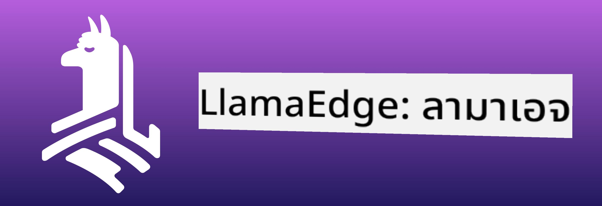
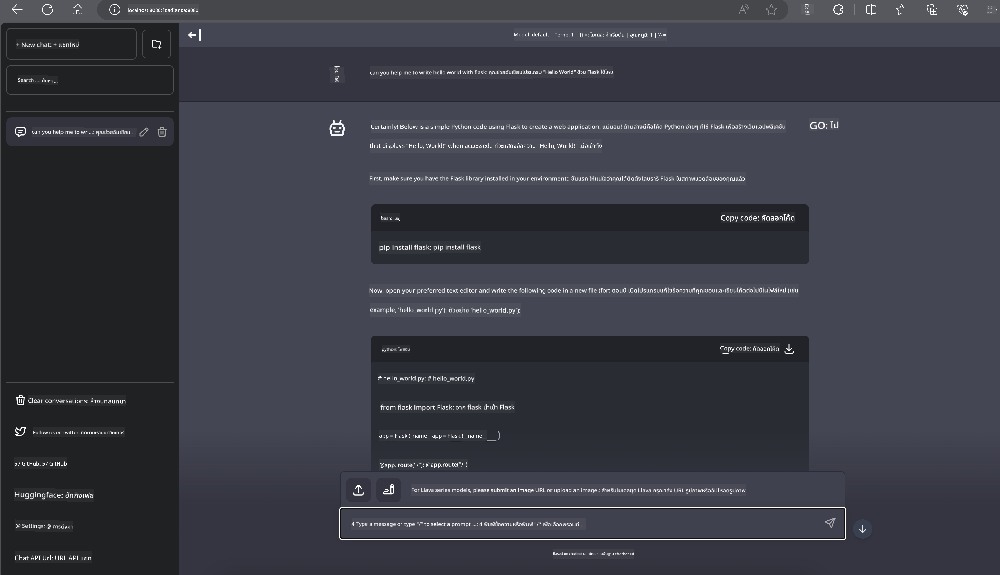

<!--
CO_OP_TRANSLATOR_METADATA:
{
  "original_hash": "be4101a30d98e95a71d42c276e8bcd37",
  "translation_date": "2025-05-09T11:38:11+00:00",
  "source_file": "md/01.Introduction/03/Jetson_Inference.md",
  "language_code": "th"
}
-->
# **การใช้งาน Inference Phi-3 บน Nvidia Jetson**

Nvidia Jetson เป็นชุดบอร์ดคอมพิวเตอร์ฝังตัวจาก Nvidia รุ่น Jetson TK1, TX1 และ TX2 ใช้โปรเซสเซอร์ Tegra (หรือ SoC) จาก Nvidia ที่รวมหน่วยประมวลผลกลาง (CPU) สถาปัตยกรรม ARM Jetson เป็นระบบที่ใช้พลังงานต่ำและออกแบบมาเพื่อเร่งการทำงานของแอปพลิเคชันด้าน machine learning Nvidia Jetson ถูกใช้โดยนักพัฒนามืออาชีพในการสร้างผลิตภัณฑ์ AI ที่ล้ำสมัยในทุกอุตสาหกรรม และโดยนักศึกษาและผู้ที่สนใจสำหรับการเรียนรู้ AI แบบลงมือทำและสร้างโปรเจกต์ที่น่าทึ่ง SLM ถูกนำไปใช้ในอุปกรณ์ edge เช่น Jetson ซึ่งช่วยให้การใช้งาน AI สร้างสรรค์ในอุตสาหกรรมเป็นไปได้ดียิ่งขึ้น

## การติดตั้งบน NVIDIA Jetson:
นักพัฒนาที่ทำงานด้านหุ่นยนต์อัตโนมัติและอุปกรณ์ฝังตัวสามารถใช้ Phi-3 Mini ได้ ขนาดของ Phi-3 ที่ค่อนข้างเล็กทำให้เหมาะสำหรับการติดตั้งบน edge พารามิเตอร์ถูกปรับแต่งอย่างละเอียดในระหว่างการฝึกฝน เพื่อให้มั่นใจว่าการตอบสนองมีความแม่นยำสูง

### การปรับแต่ง TensorRT-LLM:
[TensorRT-LLM library](https://github.com/NVIDIA/TensorRT-LLM?WT.mc_id=aiml-138114-kinfeylo) ของ NVIDIA ช่วยเพิ่มประสิทธิภาพการ inference ของโมเดลภาษาใหญ่ รองรับหน้าต่างบริบทยาวของ Phi-3 Mini ช่วยเพิ่มทั้งความเร็วและลดความหน่วง การปรับแต่งรวมถึงเทคนิคอย่าง LongRoPE, FP8 และ inflight batching

### การใช้งานและการติดตั้ง:
นักพัฒนาสามารถทดลองใช้ Phi-3 Mini กับหน้าต่างบริบท 128K ได้ที่ [NVIDIA's AI](https://www.nvidia.com/en-us/ai-data-science/generative-ai/) โดยจะมาในรูปแบบ NVIDIA NIM ซึ่งเป็นไมโครเซอร์วิสที่มี API มาตรฐาน สามารถติดตั้งใช้งานได้ทุกที่ นอกจากนี้ยังมี [TensorRT-LLM implementations บน GitHub](https://github.com/NVIDIA/TensorRT-LLM)

## **1. การเตรียมตัว**

a. Jetson Orin NX / Jetson NX

b. JetPack 5.1.2+

c. Cuda 11.8

d. Python 3.8+

## **2. การใช้งาน Phi-3 บน Jetson**

เราสามารถเลือกใช้ [Ollama](https://ollama.com) หรือ [LlamaEdge](https://llamaedge.com)

ถ้าต้องการใช้ gguf ทั้งบนคลาวด์และอุปกรณ์ edge พร้อมกัน LlamaEdge สามารถเข้าใจได้ว่าเหมือน WasmEdge (WasmEdge เป็น runtime WebAssembly ที่มีน้ำหนักเบา ประสิทธิภาพสูง และขยายตัวได้ เหมาะสำหรับแอปพลิเคชันแบบ cloud native, edge และ decentralized รองรับแอปพลิเคชันแบบ serverless, ฟังก์ชันฝังตัว, ไมโครเซอร์วิส, smart contract และอุปกรณ์ IoT คุณสามารถติดตั้งโมเดลเชิงปริมาณของ gguf บนอุปกรณ์ edge และคลาวด์ผ่าน LlamaEdge ได้



ขั้นตอนการใช้งาน

1. ติดตั้งและดาวน์โหลดไลบรารีและไฟล์ที่เกี่ยวข้อง

```bash

curl -sSf https://raw.githubusercontent.com/WasmEdge/WasmEdge/master/utils/install.sh | bash -s -- --plugin wasi_nn-ggml

curl -LO https://github.com/LlamaEdge/LlamaEdge/releases/latest/download/llama-api-server.wasm

curl -LO https://github.com/LlamaEdge/chatbot-ui/releases/latest/download/chatbot-ui.tar.gz

tar xzf chatbot-ui.tar.gz

```

**หมายเหตุ**: llama-api-server.wasm และ chatbot-ui ต้องอยู่ในไดเรกทอรีเดียวกัน

2. รันสคริปต์ในเทอร์มินัล

```bash

wasmedge --dir .:. --nn-preload default:GGML:AUTO:{Your gguf path} llama-api-server.wasm -p phi-3-chat

```

นี่คือผลลัพธ์จากการรัน



***ตัวอย่างโค้ด*** [Phi-3 mini WASM Notebook Sample](https://github.com/Azure-Samples/Phi-3MiniSamples/tree/main/wasm)

โดยสรุป Phi-3 Mini เป็นก้าวสำคัญของโมเดลภาษา ที่รวมประสิทธิภาพ การรับรู้บริบท และการปรับแต่งจาก NVIDIA ไม่ว่าคุณจะสร้างหุ่นยนต์หรือแอปพลิเคชัน edge Phi-3 Mini คือเครื่องมือที่ควรให้ความสนใจอย่างยิ่ง

**ข้อจำกัดความรับผิดชอบ**:  
เอกสารฉบับนี้ได้รับการแปลโดยใช้บริการแปลภาษาอัตโนมัติ [Co-op Translator](https://github.com/Azure/co-op-translator) แม้ว่าเราจะพยายามให้ความถูกต้อง แต่โปรดทราบว่าการแปลอัตโนมัติอาจมีข้อผิดพลาดหรือความคลาดเคลื่อนได้ เอกสารต้นฉบับในภาษาดั้งเดิมถือเป็นแหล่งข้อมูลที่เชื่อถือได้ สำหรับข้อมูลที่สำคัญ แนะนำให้ใช้บริการแปลโดยผู้เชี่ยวชาญมนุษย์ เราไม่รับผิดชอบต่อความเข้าใจผิดหรือการตีความที่ผิดพลาดที่เกิดขึ้นจากการใช้การแปลนี้