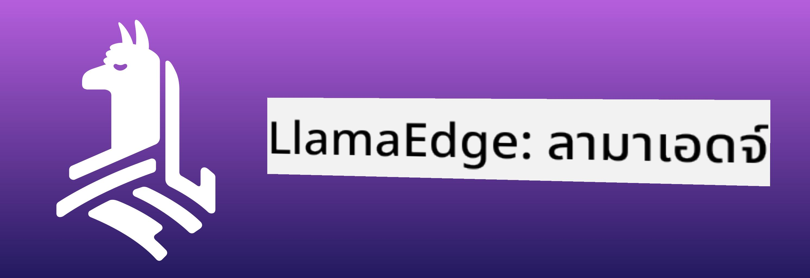

<!--
CO_OP_TRANSLATOR_METADATA:
{
  "original_hash": "be4101a30d98e95a71d42c276e8bcd37",
  "translation_date": "2025-07-16T20:42:42+00:00",
  "source_file": "md/01.Introduction/03/Jetson_Inference.md",
  "language_code": "th"
}
-->
# **การใช้งาน Inference Phi-3 บน Nvidia Jetson**

Nvidia Jetson คือชุดบอร์ดคอมพิวเตอร์ฝังตัวจาก Nvidia รุ่น Jetson TK1, TX1 และ TX2 ทั้งหมดใช้โปรเซสเซอร์ Tegra (หรือ SoC) จาก Nvidia ที่รวมหน่วยประมวลผลกลาง (CPU) สถาปัตยกรรม ARM Jetson เป็นระบบที่ใช้พลังงานต่ำและออกแบบมาเพื่อเร่งความเร็วแอปพลิเคชันด้านการเรียนรู้ของเครื่อง Nvidia Jetson ถูกใช้โดยนักพัฒนามืออาชีพเพื่อสร้างผลิตภัณฑ์ AI ที่ก้าวล้ำในทุกอุตสาหกรรม รวมถึงนักเรียนและผู้ที่สนใจสำหรับการเรียนรู้ AI แบบลงมือทำและสร้างโปรเจกต์ที่น่าทึ่ง SLM ถูกนำไปใช้ในอุปกรณ์ edge เช่น Jetson ซึ่งจะช่วยให้การใช้งาน AI สร้างสรรค์ในภาคอุตสาหกรรมมีประสิทธิภาพมากขึ้น

## การติดตั้งบน NVIDIA Jetson:
นักพัฒนาที่ทำงานกับหุ่นยนต์อัตโนมัติและอุปกรณ์ฝังตัวสามารถใช้ Phi-3 Mini ได้ ขนาดที่ค่อนข้างเล็กของ Phi-3 ทำให้เหมาะกับการติดตั้งบน edge พารามิเตอร์ได้รับการปรับแต่งอย่างละเอียดในระหว่างการฝึกฝน เพื่อให้มั่นใจในความแม่นยำสูงของคำตอบ

### การปรับแต่ง TensorRT-LLM:
ไลบรารี [TensorRT-LLM ของ NVIDIA](https://github.com/NVIDIA/TensorRT-LLM?WT.mc_id=aiml-138114-kinfeylo) ช่วยเพิ่มประสิทธิภาพการทำ inference ของโมเดลภาษาขนาดใหญ่ รองรับหน้าต่างบริบทยาวของ Phi-3 Mini ช่วยเพิ่มทั้งอัตราการประมวลผลและลดความหน่วง การปรับแต่งรวมถึงเทคนิคอย่าง LongRoPE, FP8 และ inflight batching

### การใช้งานและการติดตั้ง:
นักพัฒนาสามารถทดลองใช้ Phi-3 Mini ที่มีหน้าต่างบริบท 128K ได้ที่ [NVIDIA's AI](https://www.nvidia.com/en-us/ai-data-science/generative-ai/) ซึ่งถูกบรรจุในรูปแบบ NVIDIA NIM ซึ่งเป็นไมโครเซอร์วิสที่มี API มาตรฐานและสามารถติดตั้งได้ทุกที่ นอกจากนี้ยังมี [ตัวอย่างการใช้งาน TensorRT-LLM บน GitHub](https://github.com/NVIDIA/TensorRT-LLM)

## **1. การเตรียมตัว**

a. Jetson Orin NX / Jetson NX

b. JetPack 5.1.2+

c. Cuda 11.8

d. Python 3.8+

## **2. การใช้งาน Phi-3 บน Jetson**

เราสามารถเลือกใช้ [Ollama](https://ollama.com) หรือ [LlamaEdge](https://llamaedge.com)

ถ้าคุณต้องการใช้ gguf ทั้งบนคลาวด์และอุปกรณ์ edge พร้อมกัน LlamaEdge สามารถเข้าใจได้ว่าเป็น WasmEdge (WasmEdge คือ runtime WebAssembly ที่มีน้ำหนักเบา ประสิทธิภาพสูง และปรับขนาดได้ เหมาะสำหรับแอปพลิเคชันแบบ cloud native, edge และ decentralized รองรับแอปพลิเคชันแบบ serverless, ฟังก์ชันฝังตัว, ไมโครเซอร์วิส, สมาร์ตคอนแทรกต์ และอุปกรณ์ IoT คุณสามารถติดตั้งโมเดลเชิงปริมาณของ gguf บนอุปกรณ์ edge และคลาวด์ผ่าน LlamaEdge)



ขั้นตอนการใช้งาน

1. ติดตั้งและดาวน์โหลดไลบรารีและไฟล์ที่เกี่ยวข้อง

```bash

curl -sSf https://raw.githubusercontent.com/WasmEdge/WasmEdge/master/utils/install.sh | bash -s -- --plugin wasi_nn-ggml

curl -LO https://github.com/LlamaEdge/LlamaEdge/releases/latest/download/llama-api-server.wasm

curl -LO https://github.com/LlamaEdge/chatbot-ui/releases/latest/download/chatbot-ui.tar.gz

tar xzf chatbot-ui.tar.gz

```

**หมายเหตุ**: llama-api-server.wasm และ chatbot-ui ต้องอยู่ในไดเรกทอรีเดียวกัน

2. รันสคริปต์ในเทอร์มินัล

```bash

wasmedge --dir .:. --nn-preload default:GGML:AUTO:{Your gguf path} llama-api-server.wasm -p phi-3-chat

```

นี่คือตัวอย่างผลลัพธ์การรัน


***ตัวอย่างโค้ด*** [Phi-3 mini WASM Notebook Sample](https://github.com/Azure-Samples/Phi-3MiniSamples/tree/main/wasm)

สรุปแล้ว Phi-3 Mini คือก้าวสำคัญของโมเดลภาษา ที่ผสมผสานประสิทธิภาพ ความเข้าใจบริบท และความเชี่ยวชาญในการปรับแต่งของ NVIDIA ไม่ว่าคุณจะสร้างหุ่นยนต์หรือแอปพลิเคชัน edge Phi-3 Mini คือเครื่องมือที่ทรงพลังที่ควรทำความรู้จักไว้

**ข้อจำกัดความรับผิดชอบ**:  
เอกสารนี้ได้รับการแปลโดยใช้บริการแปลภาษาอัตโนมัติ [Co-op Translator](https://github.com/Azure/co-op-translator) แม้เราจะพยายามให้ความถูกต้องสูงสุด แต่โปรดทราบว่าการแปลอัตโนมัติอาจมีข้อผิดพลาดหรือความไม่ถูกต้อง เอกสารต้นฉบับในภาษาต้นทางถือเป็นแหล่งข้อมูลที่เชื่อถือได้ สำหรับข้อมูลที่สำคัญ ขอแนะนำให้ใช้บริการแปลโดยผู้เชี่ยวชาญมนุษย์ เราไม่รับผิดชอบต่อความเข้าใจผิดหรือการตีความผิดใด ๆ ที่เกิดจากการใช้การแปลนี้