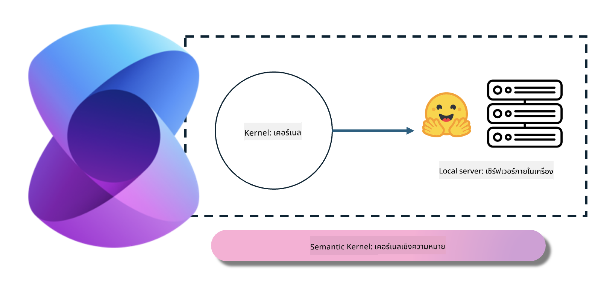
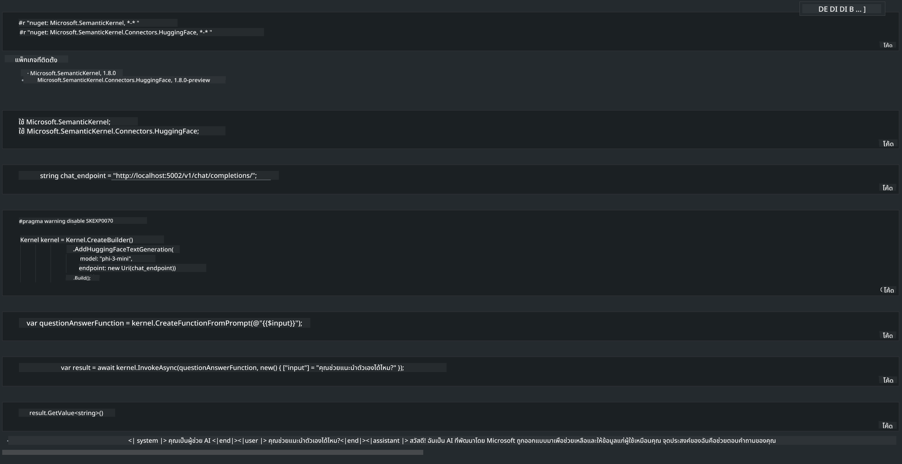

<!--
CO_OP_TRANSLATOR_METADATA:
{
  "original_hash": "bcf5dd7031db0031abdb9dd0c05ba118",
  "translation_date": "2025-05-09T12:04:49+00:00",
  "source_file": "md/01.Introduction/03/Local_Server_Inference.md",
  "language_code": "th"
}
-->
# **การใช้งาน Inference Phi-3 บนเซิร์ฟเวอร์ภายใน**

เราสามารถติดตั้ง Phi-3 บนเซิร์ฟเวอร์ภายในได้ ผู้ใช้สามารถเลือกใช้โซลูชันจาก [Ollama](https://ollama.com) หรือ [LM Studio](https://llamaedge.com) หรือจะเขียนโค้ดเองก็ได้ คุณสามารถเชื่อมต่อบริการ Phi-3 บนเครื่องผ่าน [Semantic Kernel](https://github.com/microsoft/semantic-kernel?WT.mc_id=aiml-138114-kinfeylo) หรือ [Langchain](https://www.langchain.com/) เพื่อสร้างแอปพลิเคชัน Copilot

## **ใช้ Semantic Kernel เพื่อเข้าถึง Phi-3-mini**

ในแอปพลิเคชัน Copilot เราสร้างแอปผ่าน Semantic Kernel / LangChain โครงสร้างแอปแบบนี้โดยทั่วไปจะรองรับ Azure OpenAI Service / โมเดล OpenAI และยังรองรับโมเดลโอเพ่นซอร์สบน Hugging Face รวมถึงโมเดลภายในเครื่องด้วย แล้วถ้าอยากใช้ Semantic Kernel เพื่อเข้าถึง Phi-3-mini ต้องทำอย่างไร? ตัวอย่างเช่น ใช้ .NET เราสามารถผสานกับ Hugging Face Connector ใน Semantic Kernel ได้ โดยค่าเริ่มต้นจะตรงกับ model id บน Hugging Face (ครั้งแรกที่ใช้จะดาวน์โหลดโมเดลจาก Hugging Face ซึ่งใช้เวลานาน) นอกจากนี้ยังสามารถเชื่อมต่อกับบริการที่ติดตั้งภายในเครื่องได้ เมื่อเทียบกัน เราแนะนำให้ใช้แบบหลังเพราะมีความเป็นอิสระสูงกว่า โดยเฉพาะในแอปพลิเคชันสำหรับองค์กร

จากภาพ การเข้าถึงบริการภายในผ่าน Semantic Kernel สามารถเชื่อมต่อกับเซิร์ฟเวอร์โมเดล Phi-3-mini ที่สร้างขึ้นเองได้อย่างง่ายดาย นี่คือผลลัพธ์ที่รันได้

***Sample Code*** https://github.com/kinfey/Phi3MiniSamples/tree/main/semantickernel

**ข้อจำกัดความรับผิดชอบ**:  
เอกสารฉบับนี้ได้รับการแปลโดยใช้บริการแปลภาษาด้วย AI [Co-op Translator](https://github.com/Azure/co-op-translator) แม้ว่าเราจะพยายามให้ความถูกต้องสูงสุด แต่โปรดทราบว่าการแปลอัตโนมัติอาจมีข้อผิดพลาดหรือความคลาดเคลื่อนได้ เอกสารต้นฉบับในภาษาต้นทางถือเป็นแหล่งข้อมูลที่น่าเชื่อถือที่สุด สำหรับข้อมูลที่สำคัญ ขอแนะนำให้ใช้บริการแปลโดยผู้เชี่ยวชาญมนุษย์ เราไม่รับผิดชอบต่อความเข้าใจผิดหรือการตีความที่ผิดพลาดที่เกิดจากการใช้การแปลนี้