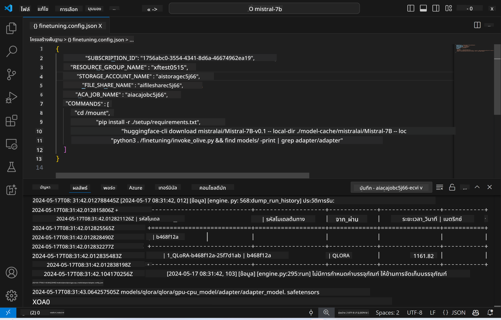
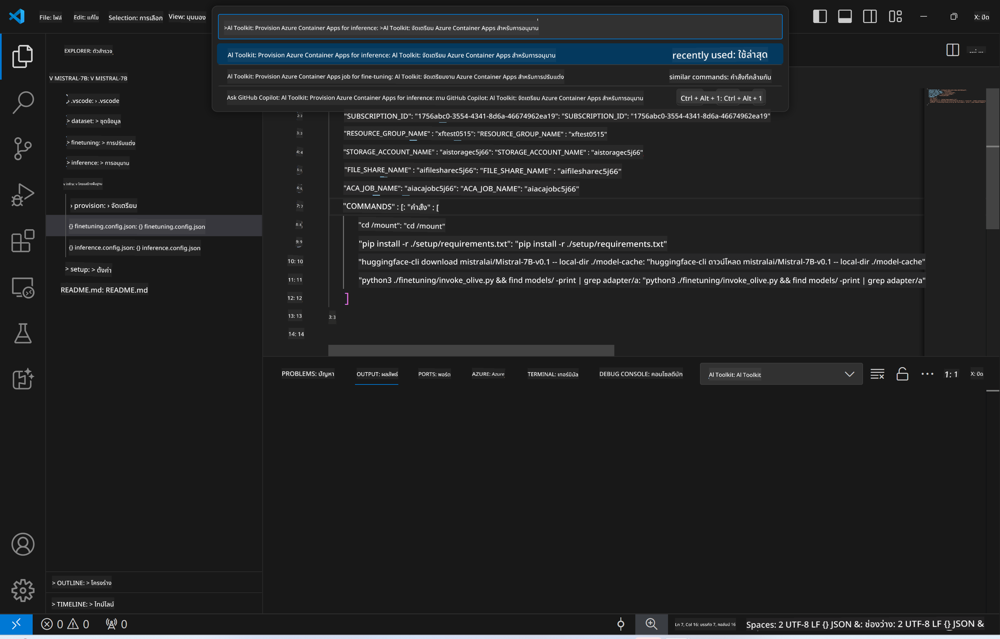
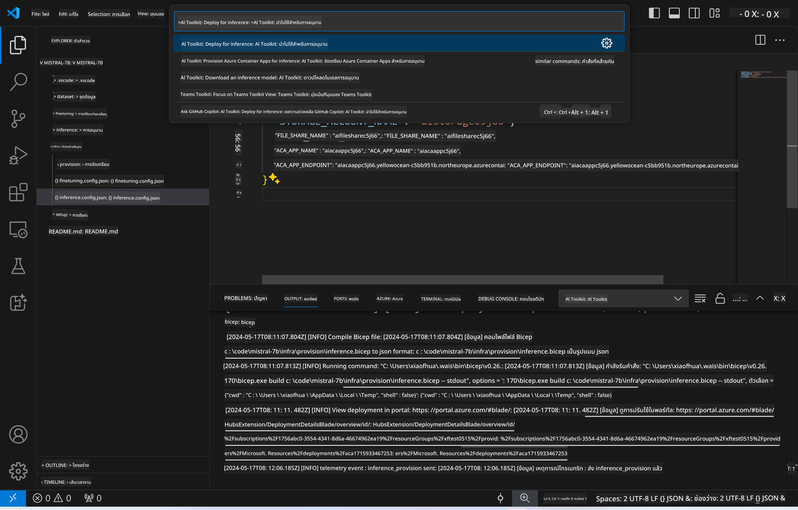
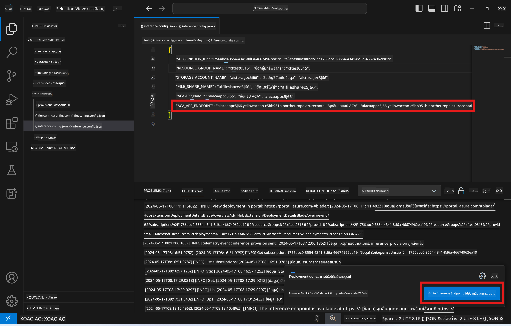

<!--
CO_OP_TRANSLATOR_METADATA:
{
  "original_hash": "a54cd3d65b6963e4e8ce21e143c3ab04",
  "translation_date": "2025-05-09T12:40:14+00:00",
  "source_file": "md/01.Introduction/03/Remote_Interence.md",
  "language_code": "th"
}
-->
# การทำ Remote Inferencing ด้วยโมเดลที่ผ่านการปรับแต่งแล้ว

หลังจากที่ฝึก adapters ในสภาพแวดล้อมระยะไกลเสร็จแล้ว ให้ใช้แอป Gradio ง่ายๆ ในการโต้ตอบกับโมเดล



### การจัดเตรียม Azure Resources  
คุณต้องตั้งค่า Azure Resources สำหรับการทำ remote inference โดยการรันคำสั่ง `AI Toolkit: Provision Azure Container Apps for inference` จาก command palette ในขั้นตอนนี้คุณจะถูกขอให้เลือก Azure Subscription และ resource group ของคุณ  


โดยปกติ subscription และ resource group สำหรับ inference ควรตรงกับที่ใช้ในการปรับแต่งโมเดล การ inference จะใช้ Azure Container App Environment เดียวกัน และเข้าถึงโมเดลและ model adapter ที่เก็บไว้ใน Azure Files ซึ่งถูกสร้างขึ้นในขั้นตอนการปรับแต่ง

## การใช้ AI Toolkit

### การ deploy สำหรับ inference  
ถ้าคุณต้องการแก้ไขโค้ด inference หรือต้องการโหลดโมเดล inference ใหม่ ให้รันคำสั่ง `AI Toolkit: Deploy for inference` คำสั่งนี้จะซิงค์โค้ดล่าสุดของคุณกับ ACA และรีสตาร์ท replica



หลังจาก deploy สำเร็จ โมเดลก็พร้อมสำหรับการประเมินผลผ่าน endpoint นี้

### การเข้าถึง Inference API

คุณสามารถเข้าถึง Inference API ได้โดยคลิกที่ปุ่ม "*Go to Inference Endpoint*" ที่แสดงใน notification ของ VSCode หรือจะหา web API endpoint ได้จาก `ACA_APP_ENDPOINT` ใน `./infra/inference.config.json` และใน output panel



> **Note:** endpoint สำหรับ inference อาจต้องใช้เวลาสักครู่ก่อนจะพร้อมใช้งานเต็มที่

## ส่วนประกอบของ Inference ที่รวมใน Template

| โฟลเดอร์ | เนื้อหา |
| ------ |--------- |
| `infra` | เก็บการตั้งค่าทั้งหมดที่จำเป็นสำหรับการทำงานระยะไกล |
| `infra/provision/inference.parameters.json` | เก็บพารามิเตอร์สำหรับ bicep templates ที่ใช้ในการจัดเตรียม Azure resources สำหรับ inference |
| `infra/provision/inference.bicep` | เก็บเทมเพลตสำหรับการจัดเตรียม Azure resources สำหรับ inference |
| `infra/inference.config.json` | ไฟล์คอนฟิกที่สร้างโดยคำสั่ง `AI Toolkit: Provision Azure Container Apps for inference` ใช้เป็นอินพุตสำหรับคำสั่งระยะไกลอื่นๆ |

### การใช้ AI Toolkit ในการตั้งค่า Azure Resource Provision  
ตั้งค่า [AI Toolkit](https://marketplace.visualstudio.com/items?itemName=ms-windows-ai-studio.windows-ai-studio)

จัดเตรียม Azure Container Apps สำหรับ inference โดยแก้ไขไฟล์ `./infra/provision/inference.parameters.json` จากนั้นรันคำสั่ง `AI Toolkit: Provision Azure Container Apps for inference` จาก command palette คำสั่งนี้จะอัปเดต resource ที่ระบุไว้และสร้าง resource ที่ยังไม่มี

ตัวอย่างเช่น หากคุณมี Azure container environment อยู่แล้ว ไฟล์ `./infra/finetuning.parameters.json` ของคุณควรมีลักษณะดังนี้:

```json
{
    "$schema": "https://schema.management.azure.com/schemas/2019-04-01/deploymentParameters.json#",
    "contentVersion": "1.0.0.0",
    "parameters": {
      ...
      "acaEnvironmentName": {
        "value": "<your-aca-env-name>"
      },
      "acaEnvironmentStorageName": {
        "value": null
      },
      ...
    }
  }
```

### การ Provision แบบแมนนวล  
ถ้าคุณต้องการตั้งค่า Azure resources ด้วยตัวเอง คุณสามารถใช้ไฟล์ bicep ที่ให้มาในโฟลเดอร์ `./infra/provision` และไฟล์ `inference.config.json`

ตัวอย่าง:

```json
{
  "SUBSCRIPTION_ID": "<your-subscription-id>",
  "RESOURCE_GROUP_NAME": "<your-resource-group-name>",
  "STORAGE_ACCOUNT_NAME": "<your-storage-account-name>",
  "FILE_SHARE_NAME": "<your-file-share-name>",
  "ACA_APP_NAME": "<your-aca-name>",
  "ACA_APP_ENDPOINT": "<your-aca-endpoint>"
}
```

**ข้อจำกัดความรับผิดชอบ**:  
เอกสารฉบับนี้ได้รับการแปลโดยใช้บริการแปลภาษาด้วย AI [Co-op Translator](https://github.com/Azure/co-op-translator) แม้เราจะพยายามให้ความถูกต้องสูงสุด แต่โปรดทราบว่าการแปลอัตโนมัติอาจมีข้อผิดพลาดหรือความไม่ถูกต้อง เอกสารต้นฉบับในภาษาดั้งเดิมถือเป็นแหล่งข้อมูลที่เชื่อถือได้ สำหรับข้อมูลที่สำคัญ แนะนำให้ใช้การแปลโดยมืออาชีพที่เป็นมนุษย์ เราไม่รับผิดชอบต่อความเข้าใจผิดหรือการตีความผิดที่เกิดจากการใช้การแปลนี้