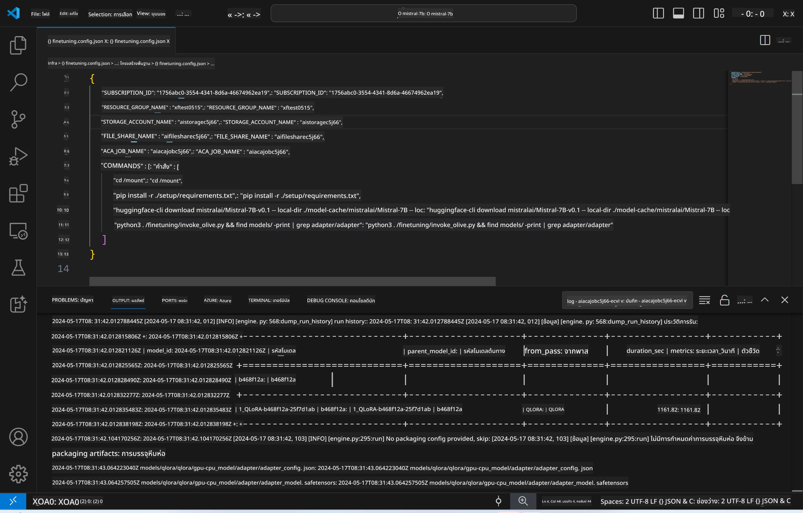
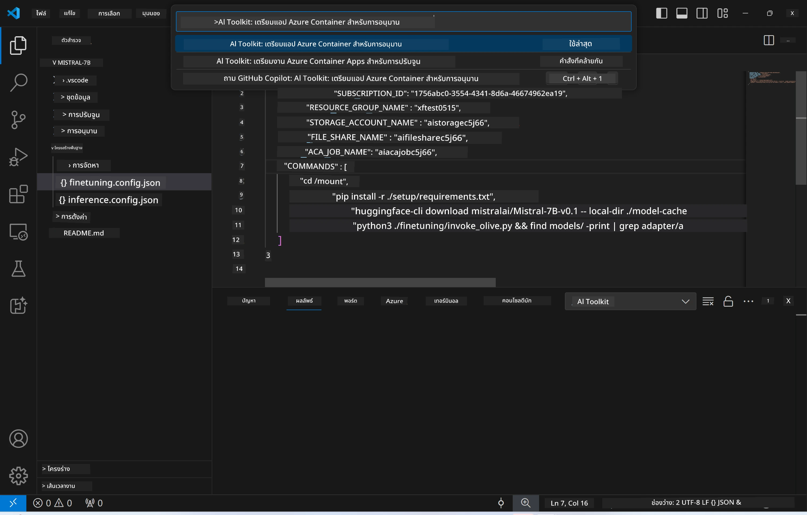
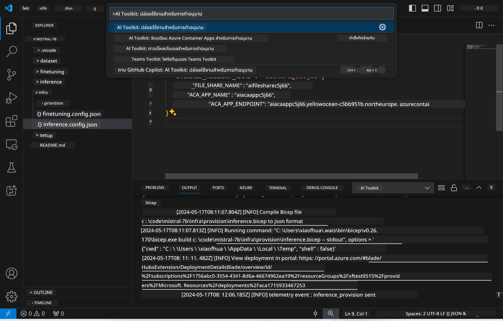
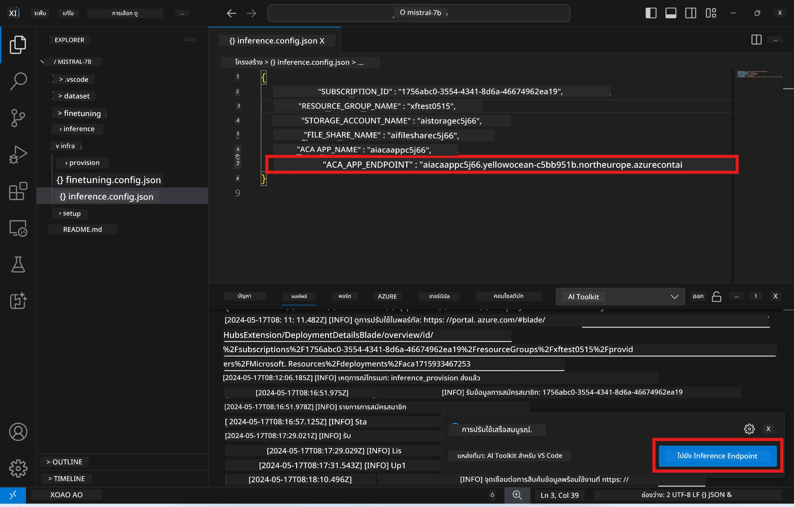

<!--
CO_OP_TRANSLATOR_METADATA:
{
  "original_hash": "a54cd3d65b6963e4e8ce21e143c3ab04",
  "translation_date": "2025-07-16T21:19:15+00:00",
  "source_file": "md/01.Introduction/03/Remote_Interence.md",
  "language_code": "th"
}
-->
# การทำ Remote Inferencing ด้วยโมเดลที่ผ่านการปรับแต่งแล้ว

หลังจากที่ได้ฝึก adapters ในสภาพแวดล้อมระยะไกลแล้ว ให้ใช้แอป Gradio ง่ายๆ เพื่อโต้ตอบกับโมเดล



### การจัดเตรียม Azure Resources  
คุณต้องตั้งค่า Azure Resources สำหรับการทำ remote inference โดยการรันคำสั่ง `AI Toolkit: Provision Azure Container Apps for inference` จาก command palette ในขั้นตอนนี้ คุณจะถูกขอให้เลือก Azure Subscription และ resource group ของคุณ  


โดยค่าเริ่มต้น subscription และ resource group สำหรับ inference ควรตรงกับที่ใช้สำหรับการปรับแต่ง โมเดลจะใช้ Azure Container App Environment เดียวกันและเข้าถึงโมเดลและ adapter ที่เก็บไว้ใน Azure Files ซึ่งถูกสร้างขึ้นในขั้นตอนการปรับแต่ง

## การใช้งาน AI Toolkit

### การ Deploy สำหรับ Inference  
หากคุณต้องการแก้ไขโค้ด inference หรือต้องการโหลดโมเดล inference ใหม่ ให้รันคำสั่ง `AI Toolkit: Deploy for inference` คำสั่งนี้จะซิงโครไนซ์โค้ดล่าสุดของคุณกับ ACA และรีสตาร์ท replica



หลังจากการ deploy สำเร็จ โมเดลก็พร้อมสำหรับการประเมินผลผ่าน endpoint นี้

### การเข้าถึง Inference API

คุณสามารถเข้าถึง inference API ได้โดยคลิกที่ปุ่ม "*Go to Inference Endpoint*" ที่แสดงใน notification ของ VSCode หรือจะดู endpoint ของเว็บ API ได้จาก `ACA_APP_ENDPOINT` ในไฟล์ `./infra/inference.config.json` และใน output panel



> **Note:** อาจต้องใช้เวลาสักครู่ก่อนที่ inference endpoint จะพร้อมใช้งานเต็มที่

## ส่วนประกอบของ Inference ที่รวมอยู่ในเทมเพลต

| โฟลเดอร์ | เนื้อหา |
| -------- |--------- |
| `infra` | รวมการตั้งค่าทั้งหมดที่จำเป็นสำหรับการทำงานระยะไกล |
| `infra/provision/inference.parameters.json` | เก็บพารามิเตอร์สำหรับ bicep templates ใช้สำหรับ provisioning Azure resources สำหรับ inference |
| `infra/provision/inference.bicep` | เทมเพลตสำหรับ provisioning Azure resources สำหรับ inference |
| `infra/inference.config.json` | ไฟล์คอนฟิกที่ถูกสร้างโดยคำสั่ง `AI Toolkit: Provision Azure Container Apps for inference` ใช้เป็นอินพุตสำหรับคำสั่งระยะไกลอื่นๆ |

### การใช้ AI Toolkit ในการตั้งค่า Azure Resource Provision  
ตั้งค่า [AI Toolkit](https://marketplace.visualstudio.com/items?itemName=ms-windows-ai-studio.windows-ai-studio)

รันคำสั่ง Provision Azure Container Apps for inference

คุณสามารถดูพารามิเตอร์การตั้งค่าได้ในไฟล์ `./infra/provision/inference.parameters.json` รายละเอียดดังนี้:  
| พารามิเตอร์ | คำอธิบาย |
| ----------- |---------- |
| `defaultCommands` | คำสั่งสำหรับเริ่มต้นเว็บ API |
| `maximumInstanceCount` | กำหนดจำนวนสูงสุดของ GPU instances |
| `location` | ตำแหน่งที่ Azure resources จะถูก provision ค่าเริ่มต้นจะเหมือนกับตำแหน่งของ resource group ที่เลือก |
| `storageAccountName`, `fileShareName`, `acaEnvironmentName`, `acaEnvironmentStorageName`, `acaAppName`, `acaLogAnalyticsName` | พารามิเตอร์เหล่านี้ใช้ตั้งชื่อ Azure resources สำหรับ provisioning โดยค่าเริ่มต้นจะเหมือนกับชื่อ resource ที่ใช้ในขั้นตอนการปรับแต่ง คุณสามารถใส่ชื่อ resource ใหม่ที่ยังไม่ถูกใช้เพื่อสร้าง resource ชื่อเฉพาะของคุณเอง หรือจะใส่ชื่อ resource ที่มีอยู่แล้วถ้าต้องการใช้ resource นั้น สำหรับรายละเอียดเพิ่มเติมดูที่หัวข้อ [Using existing Azure Resources](../../../../../md/01.Introduction/03) |

### การใช้ Azure Resources ที่มีอยู่แล้ว

โดยค่าเริ่มต้น การ provision สำหรับ inference จะใช้ Azure Container App Environment, Storage Account, Azure File Share และ Azure Log Analytics เดียวกับที่ใช้ในขั้นตอนการปรับแต่ง จะมีการสร้าง Azure Container App แยกต่างหากสำหรับ inference API เท่านั้น

ถ้าคุณได้ปรับแต่ง Azure resources ในขั้นตอนการปรับแต่ง หรืออยากใช้ Azure resources ที่มีอยู่แล้วสำหรับ inference ให้ระบุชื่อ resource เหล่านั้นในไฟล์ `./infra/inference.parameters.json` จากนั้นรันคำสั่ง `AI Toolkit: Provision Azure Container Apps for inference` จาก command palette คำสั่งนี้จะอัปเดต resource ที่ระบุไว้และสร้าง resource ที่ยังไม่มี

ตัวอย่างเช่น หากคุณมี Azure container environment อยู่แล้ว ไฟล์ `./infra/finetuning.parameters.json` ของคุณควรมีลักษณะดังนี้:

```json
{
    "$schema": "https://schema.management.azure.com/schemas/2019-04-01/deploymentParameters.json#",
    "contentVersion": "1.0.0.0",
    "parameters": {
      ...
      "acaEnvironmentName": {
        "value": "<your-aca-env-name>"
      },
      "acaEnvironmentStorageName": {
        "value": null
      },
      ...
    }
  }
```

### การ Provision แบบแมนนวล  
ถ้าคุณต้องการตั้งค่า Azure resources ด้วยตัวเอง คุณสามารถใช้ไฟล์ bicep ที่มีให้ในโฟลเดอร์ `./infra/provision` หากคุณได้ตั้งค่าและกำหนดค่า Azure resources ทั้งหมดแล้วโดยไม่ใช้ AI Toolkit command palette คุณก็แค่ใส่ชื่อ resource ลงในไฟล์ `inference.config.json`

ตัวอย่างเช่น:

```json
{
  "SUBSCRIPTION_ID": "<your-subscription-id>",
  "RESOURCE_GROUP_NAME": "<your-resource-group-name>",
  "STORAGE_ACCOUNT_NAME": "<your-storage-account-name>",
  "FILE_SHARE_NAME": "<your-file-share-name>",
  "ACA_APP_NAME": "<your-aca-name>",
  "ACA_APP_ENDPOINT": "<your-aca-endpoint>"
}
```

**ข้อจำกัดความรับผิดชอบ**:  
เอกสารนี้ได้รับการแปลโดยใช้บริการแปลภาษาอัตโนมัติ [Co-op Translator](https://github.com/Azure/co-op-translator) แม้เราจะพยายามให้ความถูกต้องสูงสุด แต่โปรดทราบว่าการแปลอัตโนมัติอาจมีข้อผิดพลาดหรือความไม่ถูกต้อง เอกสารต้นฉบับในภาษาต้นทางถือเป็นแหล่งข้อมูลที่เชื่อถือได้ สำหรับข้อมูลที่สำคัญ ขอแนะนำให้ใช้บริการแปลโดยผู้เชี่ยวชาญมนุษย์ เราไม่รับผิดชอบต่อความเข้าใจผิดหรือการตีความผิดใด ๆ ที่เกิดจากการใช้การแปลนี้